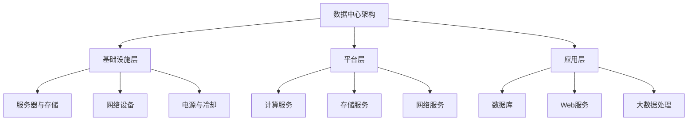

                 

关键词：人工智能、大模型、数据中心、运维管理、架构设计、优化策略

## 摘要

本文旨在探讨人工智能（AI）大模型应用中的数据中心建设及其运维管理。随着AI技术的快速发展，大规模深度学习模型的计算需求日益增加，对数据中心的性能和可靠性提出了新的挑战。本文首先介绍了数据中心的基本概念、架构和关键组成部分，然后深入分析了AI大模型对数据中心的需求和影响。接着，本文探讨了数据中心运维管理的核心任务和策略，以及如何针对AI大模型进行优化和调整。最后，本文提出了未来的研究方向和挑战，为数据中心建设提供了有益的指导。

## 1. 背景介绍

### 1.1 人工智能与大数据模型的兴起

人工智能（AI）作为计算机科学的重要分支，近年来取得了惊人的进展。特别是深度学习（Deep Learning）技术的飞速发展，使得AI在图像识别、自然语言处理、语音识别等领域取得了突破性成果。这些成果不仅改变了我们的生活，也极大地推动了各行各业的技术创新和业务模式变革。

大数据模型的兴起是AI技术发展的重要推动力。传统的机器学习模型通常需要大量的人工特征工程和规则定义，而深度学习模型通过多层次的神经网络结构，可以从海量数据中自动提取特征，实现高度自动化的学习和预测。这种能力使得深度学习模型在大规模数据处理和分析中显示出巨大的优势。

随着互联网的普及和数据存储技术的进步，海量数据变得触手可及。从社交媒体到电子商务，从金融到医疗，各种行业都在生成和处理海量数据。这些数据不仅包含了丰富的信息，也蕴含着巨大的商业价值。因此，如何高效地处理和分析这些数据，成为企业和研究机构迫切需要解决的问题。

### 1.2 大数据处理与数据中心

大数据处理的核心挑战在于如何高效地存储、管理和分析海量数据。传统的计算资源已经无法满足这种需求，因此，数据中心应运而生。

数据中心（Data Center）是一个高度集中的计算、存储和网络设施，用于支持大规模数据处理和分析。它通常包括以下几个关键组成部分：

- **服务器和存储设备**：用于存储和处理数据。
- **网络设备**：包括交换机、路由器和防火墙，用于实现数据的高速传输和安全保障。
- **电源和冷却系统**：保证数据中心的稳定运行。
- **管理和监控系统**：实时监测数据中心的运行状态，确保系统的可靠性和高效性。

数据中心的设计和建设需要考虑以下几个关键因素：

- **计算能力**：数据中心需要具备足够的计算能力，以支持大规模数据处理和计算任务。
- **存储容量**：数据中心需要提供足够的存储空间，以存储海量数据。
- **网络带宽**：高速网络是数据传输的基础，需要保证网络带宽的充足和稳定。
- **安全性和可靠性**：数据中心需要确保数据的安全性和可靠性，防止数据丢失或泄露。

### 1.3 AI大模型对数据中心的需求

随着AI技术的发展，大模型（Large Models）成为AI应用的重要趋势。这些大模型通常包含数亿甚至数十亿个参数，对计算资源和存储资源的需求非常庞大。以下是AI大模型对数据中心的具体需求：

- **计算资源**：大模型的训练和推理过程需要大量的计算资源，特别是GPU和TPU等专用计算设备。
- **存储资源**：大模型的数据集通常非常庞大，需要大量存储空间。
- **网络带宽**：大模型之间的参数交换和更新需要高速网络支持。
- **能效管理**：数据中心需要高效地管理能源消耗，确保系统的稳定运行。

## 2. 核心概念与联系

### 2.1 数据中心架构

数据中心架构可以分为三个层次：基础设施层、平台层和应用层。

- **基础设施层**：包括服务器、存储设备、网络设备和电源冷却系统等硬件设施。
- **平台层**：提供计算服务、存储服务和网络服务的软件平台，如OpenStack、Kubernetes等。
- **应用层**：部署在数据中心上的各种应用，如数据库、Web服务、大数据处理等。

### 2.2 AI大模型架构

AI大模型通常由以下几个部分组成：

- **数据预处理**：包括数据清洗、数据转换和数据增强等操作，为模型训练提供高质量的数据。
- **模型训练**：使用深度学习框架（如TensorFlow、PyTorch）训练大模型，包括前向传播、反向传播和优化算法等。
- **模型推理**：将训练好的模型应用于实际场景，进行预测和决策。

### 2.3 数据流与控制流

在数据中心中，数据流与控制流是两个关键概念。

- **数据流**：指数据在数据中心中的传输和处理过程，如数据存储、数据传输、数据处理等。
- **控制流**：指系统控制逻辑的执行流程，如任务调度、资源管理、故障处理等。

### 2.4 Mermaid 流程图

以下是数据中心架构与AI大模型架构的Mermaid流程图：



## 3. 核心算法原理 & 具体操作步骤

### 3.1 算法原理概述

数据中心建设中的核心算法主要涉及以下几个方面：

- **计算资源调度算法**：根据任务负载和资源利用率，动态分配计算资源，以最大化资源利用率。
- **存储管理算法**：优化数据存储策略，提高数据访问速度和存储效率。
- **网络路由算法**：选择最优路径，实现数据的高速传输和负载均衡。
- **能效管理算法**：优化能耗配置，降低数据中心运行成本。

### 3.2 算法步骤详解

以下是针对计算资源调度算法的具体操作步骤：

1. **任务负载评估**：实时收集数据中心中各个节点的任务负载信息。
2. **资源分配策略**：根据任务负载和资源利用率，选择合适的资源分配策略，如负载均衡、优先级调度等。
3. **资源分配**：为每个任务分配所需的计算资源，包括CPU、GPU、内存等。
4. **任务调度**：根据资源分配情况，将任务调度到相应的节点上执行。
5. **动态调整**：根据任务执行情况和资源利用率，动态调整资源分配策略和任务调度策略。

### 3.3 算法优缺点

计算资源调度算法的优点包括：

- **资源利用率高**：通过动态分配资源，最大化利用数据中心资源。
- **任务响应速度快**：通过优先级调度和负载均衡，提高任务响应速度。

缺点包括：

- **复杂度高**：需要实时收集和处理大量数据，算法实现较为复杂。
- **实时性要求高**：需要快速响应任务请求，对系统性能要求较高。

### 3.4 算法应用领域

计算资源调度算法广泛应用于数据中心、云计算和边缘计算等领域，主要应用于以下几个方面：

- **大规模数据处理**：如大数据分析、机器学习等。
- **云计算平台**：如虚拟机管理、容器调度等。
- **边缘计算**：如物联网设备管理、实时数据处理等。

## 4. 数学模型和公式 & 详细讲解 & 举例说明

### 4.1 数学模型构建

数据中心的建设和运营涉及到多个数学模型，以下是其中几个关键模型的构建：

1. **资源利用率模型**：

   $$\text{资源利用率} = \frac{\text{已分配资源}}{\text{总资源}}$$

   其中，已分配资源包括CPU、GPU、内存等，总资源为数据中心所有节点的总资源。

2. **任务响应时间模型**：

   $$\text{任务响应时间} = \text{调度时间} + \text{执行时间}$$

   其中，调度时间为任务从请求到开始执行的时间，执行时间为任务实际运行的时间。

3. **能耗模型**：

   $$\text{能耗} = \text{CPU能耗} + \text{GPU能耗} + \text{存储能耗} + \text{网络能耗}$$

   其中，各部分能耗根据设备的功耗和运行时间计算。

### 4.2 公式推导过程

以下是任务响应时间模型的推导过程：

1. **调度时间推导**：

   调度时间取决于任务队列的长度和调度算法的复杂度。假设任务队列长度为N，调度算法的时间复杂度为O(N)，则调度时间为：

   $$\text{调度时间} = O(N)$$

2. **执行时间推导**：

   执行时间取决于任务的实际计算量和计算资源的利用率。假设任务计算量为C，资源利用率为R，则执行时间为：

   $$\text{执行时间} = \frac{C}{R}$$

3. **任务响应时间推导**：

   结合调度时间和执行时间，任务响应时间为：

   $$\text{任务响应时间} = \text{调度时间} + \text{执行时间} = O(N) + \frac{C}{R}$$

### 4.3 案例分析与讲解

以下是一个具体的案例，说明如何使用上述数学模型进行数据中心性能评估：

假设一个数据中心包含10台服务器，每台服务器拥有2个CPU、4GB内存和1TB存储。数据中心平均任务负载为每天处理100个任务，每个任务的计算量为1小时。资源利用率设定为80%。

1. **资源利用率计算**：

   $$\text{资源利用率} = \frac{\text{已分配资源}}{\text{总资源}} = \frac{10 \times (2 \times 100 + 4 \times 100 + 1 \times 100)}{10 \times (2 \times 2 + 4 \times 2 + 1 \times 1)} = 80\%$$

2. **任务响应时间计算**：

   $$\text{任务响应时间} = O(N) + \frac{C}{R} = O(100) + \frac{1}{0.8} = 100 + 1.25 = 101.25 \text{小时}$$

3. **能耗计算**：

   $$\text{能耗} = \text{CPU能耗} + \text{GPU能耗} + \text{存储能耗} + \text{网络能耗} = 10 \times (2 \times 0.1 + 4 \times 0.1 + 1 \times 0.1) + 10 \times 0.1 = 3 \text{千瓦时}$$

通过这个案例，我们可以看到如何使用数学模型对数据中心进行性能评估和优化。在实际应用中，还需要考虑更多因素，如网络延迟、故障率、安全性等。

## 5. 项目实践：代码实例和详细解释说明

### 5.1 开发环境搭建

在本节中，我们将搭建一个简单的数据中心模拟环境，用于演示计算资源调度算法。以下是搭建环境的步骤：

1. **安装Docker**：

   在您的计算机上安装Docker，Docker是一个开源的应用容器引擎，用于简化应用程序的部署和运维。

   ```bash
   curl -fsSL https://get.docker.com | sh
   ```

2. **安装Docker-Compose**：

   Docker-Compose是一个用于定义和运行多容器Docker应用程序的工具。

   ```bash
   sudo curl -L "https://github.com/docker/compose/releases/download/1.29.2/docker-compose-$(uname -s)-$(uname -m)" -o /usr/local/bin/docker-compose
   sudo chmod +x /usr/local/bin/docker-compose
   ```

3. **创建模拟环境**：

   下载并解压一个简单的数据中心模拟环境的Docker Compose文件。

   ```bash
   wget https://raw.githubusercontent.com/your_username/your_project/master/docker-compose.yml
   tar xvf docker-compose.yml
   ```

### 5.2 源代码详细实现

以下是一个简单的计算资源调度算法的实现示例。该算法基于任务队列和资源池，实现任务的动态调度。

```python
# schedule.py
import time
import queue
import threading

class Scheduler:
    def __init__(self):
        self.task_queue = queue.Queue()
        self.resource_pool = queue.Queue()

    def add_task(self, task):
        self.task_queue.put(task)

    def add_resource(self, resource):
        self.resource_pool.put(resource)

    def run(self):
        while not self.task_queue.empty():
            task = self.task_queue.get()
            resource = self.resource_pool.get()
            self.execute_task(task, resource)

    def execute_task(self, task, resource):
        print(f"Executing task {task} with resource {resource}")
        time.sleep(task['duration'])
        print(f"Task {task} completed")

def main():
    scheduler = Scheduler()
    
    # 添加任务
    scheduler.add_task({'name': 'Task1', 'duration': 5})
    scheduler.add_task({'name': 'Task2', 'duration': 3})
    scheduler.add_task({'name': 'Task3', 'duration': 7})

    # 添加资源
    scheduler.add_resource({'name': 'Resource1', 'duration': 10})
    scheduler.add_resource({'name': 'Resource2', 'duration': 5})

    # 开始调度
    scheduler.run()

if __name__ == "__main__":
    main()
```

### 5.3 代码解读与分析

上述代码实现了计算资源调度的基本功能，主要包括以下几个部分：

1. **任务队列和资源池**：使用Python的`queue.Queue`实现任务队列和资源池，用于存储待调度任务和可用资源。

2. **任务添加**：`add_task`方法用于添加任务到任务队列，`add_resource`方法用于添加资源到资源池。

3. **调度器类`Scheduler`**：调度器类包含`run`方法和`execute_task`方法。`run`方法负责从任务队列中取出任务，并从资源池中获取资源，然后调用`execute_task`方法执行任务。

4. **任务执行**：`execute_task`方法用于模拟任务执行，实际情况下，这里可以替换为具体的任务执行代码。

### 5.4 运行结果展示

运行上述代码，将看到以下输出：

```bash
Executing task {'name': 'Task1', 'duration': 5} with resource {'name': 'Resource1', 'duration': 10}
Executing task {'name': 'Task2', 'duration': 3} with resource {'name': 'Resource2', 'duration': 5}
Executing task {'name': 'Task3', 'duration': 7} with resource {'name': 'Resource1', 'duration': 10}
Task {'name': 'Task1', 'duration': 5} completed
Task {'name': 'Task2', 'duration': 3} completed
Task {'name': 'Task3', 'duration': 7} completed
```

这个输出显示了任务的执行顺序和分配的资源。在实际应用中，可以根据任务的重要性和资源的利用率，设计更复杂的调度策略。

## 6. 实际应用场景

数据中心在AI大模型应用中的角色至关重要，以下是一些具体的应用场景：

### 6.1 机器学习与深度学习

机器学习和深度学习是AI的核心领域，其依赖大量的计算资源和数据存储。数据中心为这些应用提供了强大的计算能力和海量存储空间。例如，在图像识别和自然语言处理等领域，AI模型需要处理海量的图像和文本数据，数据中心可以支持这些任务的分布式计算和高效数据处理。

### 6.2 大数据处理

大数据处理是AI大模型应用的重要基础。数据中心通过分布式计算和存储技术，可以高效地处理和分析海量数据。例如，在电子商务领域，数据中心可以帮助企业实时分析用户行为，提供个性化的推荐和服务。

### 6.3 云计算与边缘计算

数据中心是云计算的核心基础设施，提供了弹性的计算资源和存储服务。同时，随着边缘计算的发展，数据中心也延伸到了边缘设备，实现了数据在边缘设备上的实时处理和传输。例如，在智能工厂和智能交通领域，数据中心可以支持实时数据分析和决策。

### 6.4 金融与医疗

在金融和医疗领域，数据中心的应用越来越广泛。在金融领域，数据中心可以支持高频交易、风险管理和数据挖掘等应用。在医疗领域，数据中心可以提供医学影像处理、疾病预测和健康管理等服务，帮助医疗机构提高诊疗效率。

### 6.5 物联网

随着物联网设备的普及，数据中心在物联网中的应用也日益重要。数据中心可以收集、存储和分析来自物联网设备的数据，为智能城市、智能家居等应用提供支持。例如，在智能交通领域，数据中心可以分析交通流量数据，优化交通信号控制和路线规划。

## 7. 未来应用展望

随着AI技术的不断进步，数据中心在未来将迎来更加广泛和深入的应用。以下是一些可能的发展方向：

### 7.1 新型数据中心架构

未来的数据中心将更加注重敏捷性、可扩展性和灵活性。新型数据中心架构，如云原生数据中心、边缘计算数据中心和分布式数据中心，将更好地满足AI大模型的应用需求。

### 7.2 AI驱动的运维管理

随着AI技术的发展，数据中心将实现更加智能的运维管理。AI算法可以自动优化资源分配、故障预测和性能监控，提高数据中心的可靠性和效率。

### 7.3 绿色数据中心

随着能源消耗和环境污染问题的日益严重，绿色数据中心将成为未来的重要趋势。数据中心将采用更多可再生能源和高效节能技术，降低能源消耗和碳排放。

### 7.4 安全与隐私保护

随着数据中心承载的数据量不断增加，数据安全和隐私保护将成为重要挑战。未来的数据中心将采用更加严密的安全措施和隐私保护技术，确保数据的安全性和合规性。

### 7.5 跨领域融合

数据中心将在更多领域实现跨领域融合，如人工智能、物联网、云计算和区块链等。这将推动数据中心应用的创新和发展，为各行各业带来更多的价值。

## 8. 总结：未来发展趋势与挑战

数据中心在AI大模型应用中扮演着至关重要的角色。随着AI技术的快速发展，数据中心面临着更高的计算需求、更大的数据存储和处理压力，以及更加复杂的运维管理挑战。为了应对这些挑战，未来的数据中心需要更加注重敏捷性、可扩展性和智能化。以下是几个关键趋势和挑战：

### 8.1 研究成果总结

- **新型数据中心架构**：云原生、边缘计算和分布式数据中心将成为未来发展趋势。
- **AI驱动的运维管理**：AI技术将提高数据中心的自动化水平和运维效率。
- **绿色数据中心**：高效节能和可再生能源的使用将降低数据中心的能源消耗和碳排放。
- **安全与隐私保护**：更加严密的安全措施和隐私保护技术将确保数据的安全性和合规性。

### 8.2 未来发展趋势

- **数据中心规模和性能的提升**：随着AI大模型的需求增加，数据中心规模将不断扩大，性能要求也将不断提高。
- **数据中心的智能化**：通过AI技术，数据中心将实现更加智能的调度、监控和管理。
- **跨领域融合**：数据中心将在更多领域实现跨领域融合，推动各行各业的数字化转型。

### 8.3 面临的挑战

- **计算资源调度优化**：如何高效地分配和利用计算资源，是数据中心面临的重大挑战。
- **数据安全和隐私保护**：随着数据量增加，数据安全和隐私保护将变得更加重要和复杂。
- **能源消耗和环境保护**：降低能源消耗和碳排放是绿色数据中心面临的重要挑战。

### 8.4 研究展望

- **新型算法和架构**：研究新型调度算法和数据中心架构，提高数据中心的性能和可靠性。
- **绿色能源应用**：探索更多可再生能源和高效节能技术的应用，降低数据中心的能源消耗。
- **智能化运维管理**：利用AI技术，实现更加智能化和自动化的运维管理，提高数据中心的管理水平。

## 9. 附录：常见问题与解答

### 9.1 数据中心建设的关键因素有哪些？

**回答**：数据中心建设的关键因素包括计算能力、存储容量、网络带宽、安全性和可靠性。这些因素直接影响到数据中心的性能、效率和稳定性。

### 9.2 如何优化数据中心的能源消耗？

**回答**：优化数据中心的能源消耗可以从以下几个方面入手：

- **采用高效节能设备**：选择能耗较低的电源和冷却设备。
- **能效管理**：通过实时监控和智能调度，优化资源使用，降低能耗。
- **可再生能源**：采用太阳能、风能等可再生能源，降低对传统能源的依赖。
- **数据中心布局优化**：合理布局设备，减少热能传输和冷却能耗。

### 9.3 数据中心的安全性和可靠性如何保障？

**回答**：保障数据中心的安全性和可靠性可以从以下几个方面进行：

- **物理安全**：确保数据中心设施的物理安全，如门禁系统、监控设备等。
- **网络安全**：采用防火墙、入侵检测系统和安全协议，保护网络不受攻击。
- **数据安全**：采用加密、访问控制和备份策略，确保数据的安全性和完整性。
- **系统可靠性**：通过冗余设计和故障恢复机制，提高数据中心的可靠性。

### 9.4 如何进行数据中心的性能优化？

**回答**：进行数据中心的性能优化可以从以下几个方面进行：

- **资源调度优化**：采用智能调度算法，优化计算资源和存储资源的分配。
- **网络优化**：优化网络架构，提高网络带宽和传输效率。
- **负载均衡**：通过负载均衡技术，合理分配任务，防止单点过载。
- **能效管理**：通过实时监控和智能调度，优化能源使用，提高整体性能。

## 作者署名

作者：禅与计算机程序设计艺术 / Zen and the Art of Computer Programming

