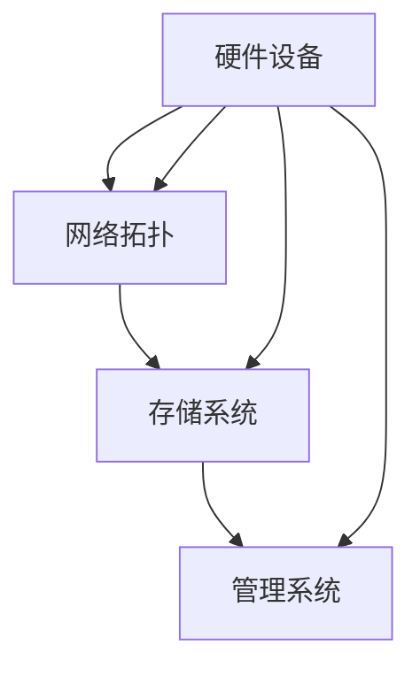
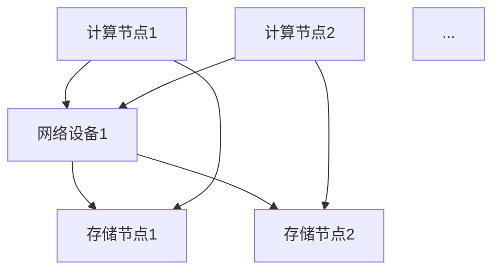
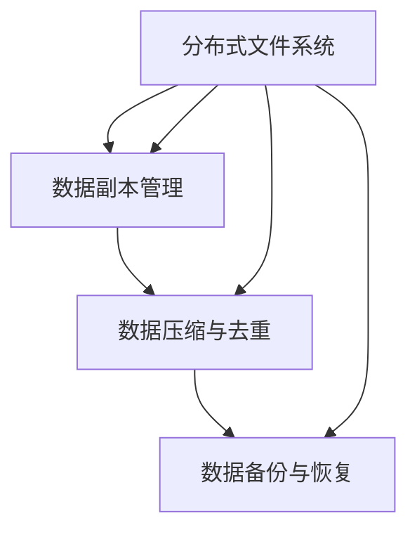
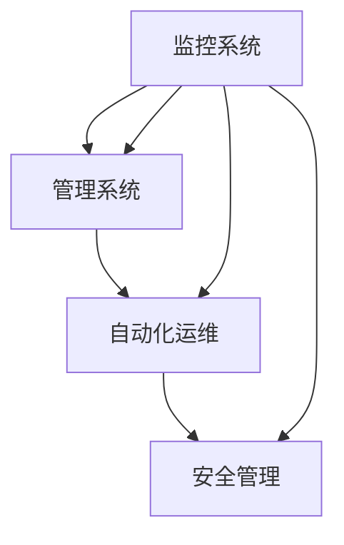

                 

关键词：AI大模型、数据中心、工作环境、技术架构、优化方案

> 摘要：本文旨在探讨AI大模型应用数据中心的工作环境，分析其技术架构、性能优化方案以及未来发展方向。通过深入研究数据中心的建设和管理，我们旨在为AI大模型提供高效、可靠的工作平台，推动人工智能技术的持续发展。

## 1. 背景介绍

随着人工智能技术的快速发展，大模型（如GPT-3、BERT等）已经成为推动各个领域创新的重要力量。这些模型具有处理复杂任务、生成高质量内容、提升决策效率等优势，使得人工智能应用在图像识别、自然语言处理、推荐系统等领域取得了显著成果。然而，AI大模型的高计算需求和高数据存储需求给数据中心的建设和管理带来了巨大挑战。

数据中心作为AI大模型运行的核心基础设施，其性能直接影响模型的训练和推理速度。为了满足AI大模型对计算资源、存储资源和网络带宽的高需求，数据中心需要具备高效、可扩展、稳定的工作环境。本文将围绕AI大模型应用数据中心的工作环境展开讨论，分析其技术架构、性能优化方案以及未来发展方向。

## 2. 核心概念与联系

### 2.1 数据中心架构

数据中心架构主要包括硬件设备、网络拓扑、存储系统和管理系统等组成部分。以下是一个简化的数据中心架构图，使用Mermaid流程图表示：



### 2.2 硬件设备

硬件设备是数据中心的基础设施，主要包括计算节点、存储节点和网络设备。计算节点用于运行AI大模型的训练和推理任务，存储节点用于存储大量数据，网络设备用于实现数据传输和交换。

- **计算节点**：采用高性能GPU（如Tesla V100、A100等）作为计算核心，以提升模型的计算速度。计算节点还需要配备大容量内存（如512GB、1TB等）以满足AI大模型对内存的需求。
- **存储节点**：采用分布式存储系统（如HDFS、Ceph等）来实现海量数据的存储和管理。存储节点需要具备高吞吐量、低延迟、高可靠性等特点。
- **网络设备**：采用高速网络设备（如40Gbps、100Gbps等）实现计算节点、存储节点和用户端之间的数据传输和交换。

### 2.3 网络拓扑

数据中心的网络拓扑主要包括环网、星形网和混合网等。以下是一个简化的网络拓扑图，使用Mermaid流程图表示：



### 2.4 存储系统

存储系统是数据中心的核心组成部分，负责存储和管理AI大模型训练所需的数据。以下是一个简化的存储系统架构图，使用Mermaid流程图表示：



- **分布式文件系统**：采用HDFS、Ceph等分布式文件系统来实现海量数据的存储和管理。
- **数据副本管理**：通过数据副本机制来提高数据的可靠性和访问速度。
- **数据压缩与去重**：采用数据压缩和去重技术来降低存储空间的占用。
- **数据备份与恢复**：定期进行数据备份，确保数据的安全性和可靠性。

### 2.5 管理系统

管理系统负责监控、管理和维护数据中心的硬件设备、网络拓扑和存储系统。以下是一个简化的管理系统架构图，使用Mermaid流程图表示：



- **监控系统**：实时监控硬件设备、网络拓扑和存储系统的运行状态，确保系统稳定可靠。
- **自动化运维**：通过自动化工具来实现硬件设备的部署、配置和管理，提高运维效率。
- **安全管理**：采用加密技术、访问控制、防火墙等手段来保障数据安全和系统安全。

## 3. 核心算法原理 & 具体操作步骤

### 3.1 算法原理概述

AI大模型应用数据中心的工作环境需要高效、可靠的算法来优化性能。以下是一个简化的算法原理概述：

- **计算任务调度**：根据计算节点的负载情况，合理分配训练和推理任务，确保计算资源的高效利用。
- **数据传输优化**：采用分布式存储和高速网络设备，提高数据传输速度和访问效率。
- **存储资源管理**：通过数据副本、压缩、去重等技术，降低存储空间的占用，提高存储资源利用率。
- **安全性管理**：采用加密、访问控制、防火墙等技术，确保数据安全和系统安全。

### 3.2 算法步骤详解

以下是具体的算法步骤：

- **计算任务调度**：
  - 收集计算节点的负载信息。
  - 根据负载信息，选择合适的计算节点进行任务分配。
  - 将任务分配给计算节点，并启动训练或推理任务。
- **数据传输优化**：
  - 根据数据存储位置和计算节点位置，选择最优的数据传输路径。
  - 采用分布式存储系统，实现数据的快速传输和访问。
- **存储资源管理**：
  - 对数据进行压缩和去重，降低存储空间占用。
  - 定期对数据进行备份和恢复，确保数据安全。
- **安全性管理**：
  - 对数据进行加密，保障数据传输过程中的安全。
  - 实施访问控制，限制非法访问。
  - 采用防火墙等网络安全措施，防止网络攻击。

### 3.3 算法优缺点

- **计算任务调度**：
  - 优点：提高计算资源利用率，降低训练和推理时间。
  - 缺点：需要实时监控计算节点的负载情况，增加了系统复杂度。
- **数据传输优化**：
  - 优点：提高数据传输速度和访问效率，降低网络延迟。
  - 缺点：需要复杂的路径选择算法，增加了系统开销。
- **存储资源管理**：
  - 优点：降低存储空间占用，提高存储资源利用率。
  - 缺点：数据压缩和去重会影响数据读取速度，需要平衡存储空间和读取速度。
- **安全性管理**：
  - 优点：保障数据安全和系统安全，防止数据泄露和网络攻击。
  - 缺点：会增加系统的计算和存储开销。

### 3.4 算法应用领域

- **计算任务调度**：适用于分布式计算环境，如云计算、大数据处理等。
- **数据传输优化**：适用于高性能计算、大数据传输等场景。
- **存储资源管理**：适用于大规模数据存储和管理，如数据仓库、数据湖等。
- **安全性管理**：适用于数据中心、企业网络等场景。

## 4. 数学模型和公式 & 详细讲解 & 举例说明

### 4.1 数学模型构建

为了描述AI大模型应用数据中心的工作环境，我们需要构建一个数学模型。以下是一个简化的数学模型：

- **计算任务调度模型**：

  $$C_{ij} = \frac{L_i}{W_j}$$

  其中，$C_{ij}$ 表示第 $i$ 个计算节点分配给第 $j$ 个任务的负载，$L_i$ 表示第 $i$ 个计算节点的负载，$W_j$ 表示第 $j$ 个任务的权重。

- **数据传输优化模型**：

  $$P_{ij} = \frac{D_i}{W_j}$$

  其中，$P_{ij}$ 表示第 $i$ 个计算节点到第 $j$ 个存储节点的数据传输路径，$D_i$ 表示第 $i$ 个计算节点到第 $j$ 个存储节点的距离，$W_j$ 表示第 $j$ 个任务的权重。

- **存储资源管理模型**：

  $$S_{ij} = \frac{C_i}{W_j}$$

  其中，$S_{ij}$ 表示第 $i$ 个存储节点分配给第 $j$ 个任务的存储空间，$C_i$ 表示第 $i$ 个存储节点的存储容量，$W_j$ 表示第 $j$ 个任务的权重。

- **安全性管理模型**：

  $$A_{ij} = \frac{S_i}{W_j}$$

  其中，$A_{ij}$ 表示第 $i$ 个安全措施分配给第 $j$ 个任务的权重，$S_i$ 表示第 $i$ 个安全措施的有效性，$W_j$ 表示第 $j$ 个任务的权重。

### 4.2 公式推导过程

以下是各个公式的推导过程：

- **计算任务调度模型**：

  $$C_{ij} = \frac{L_i}{W_j}$$

  该公式表示第 $i$ 个计算节点分配给第 $j$ 个任务的负载。其中，$L_i$ 表示第 $i$ 个计算节点的负载，$W_j$ 表示第 $j$ 个任务的权重。

- **数据传输优化模型**：

  $$P_{ij} = \frac{D_i}{W_j}$$

  该公式表示第 $i$ 个计算节点到第 $j$ 个存储节点的数据传输路径。其中，$D_i$ 表示第 $i$ 个计算节点到第 $j$ 个存储节点的距离，$W_j$ 表示第 $j$ 个任务的权重。

- **存储资源管理模型**：

  $$S_{ij} = \frac{C_i}{W_j}$$

  该公式表示第 $i$ 个存储节点分配给第 $j$ 个任务的存储空间。其中，$C_i$ 表示第 $i$ 个存储节点的存储容量，$W_j$ 表示第 $j$ 个任务的权重。

- **安全性管理模型**：

  $$A_{ij} = \frac{S_i}{W_j}$$

  该公式表示第 $i$ 个安全措施分配给第 $j$ 个任务的权重。其中，$S_i$ 表示第 $i$ 个安全措施的有效性，$W_j$ 表示第 $j$ 个任务的权重。

### 4.3 案例分析与讲解

以下是一个具体的案例：

假设有一个包含 4 个计算节点（$A_1, A_2, A_3, A_4$）和 3 个存储节点（$B_1, B_2, B_3$）的数据中心。现在有 2 个任务（$T_1, T_2$）需要分配给这些计算节点和存储节点。各节点的负载、距离和存储容量如下表所示：

| 节点 | 负载 | 距离 | 存储容量 |
| --- | --- | --- | --- |
| $A_1$ | 10 | 3 | 100 |
| $A_2$ | 8 | 2 | 80 |
| $A_3$ | 5 | 4 | 40 |
| $A_4$ | 12 | 1 | 60 |
| $B_1$ | 6 | 1 | 200 |
| $B_2$ | 4 | 2 | 150 |
| $B_3$ | 8 | 3 | 300 |

首先，我们根据计算任务调度模型计算每个计算节点分配给每个任务的负载：

$$C_{1,1} = \frac{10}{2} = 5$$

$$C_{1,2} = \frac{10}{2} = 5$$

$$C_{2,1} = \frac{8}{2} = 4$$

$$C_{2,2} = \frac{8}{2} = 4$$

$$C_{3,1} = \frac{5}{2} = 2.5$$

$$C_{3,2} = \frac{5}{2} = 2.5$$

$$C_{4,1} = \frac{12}{2} = 6$$

$$C_{4,2} = \frac{12}{2} = 6$$

接下来，我们根据数据传输优化模型计算每个计算节点到每个存储节点的数据传输路径：

$$P_{1,1} = \frac{3}{2} = 1.5$$

$$P_{1,2} = \frac{3}{2} = 1.5$$

$$P_{2,1} = \frac{2}{2} = 1$$

$$P_{2,2} = \frac{2}{2} = 1$$

$$P_{3,1} = \frac{4}{2} = 2$$

$$P_{3,2} = \frac{4}{2} = 2$$

$$P_{4,1} = \frac{1}{2} = 0.5$$

$$P_{4,2} = \frac{1}{2} = 0.5$$

然后，我们根据存储资源管理模型计算每个存储节点分配给每个任务的存储空间：

$$S_{1,1} = \frac{100}{2} = 50$$

$$S_{1,2} = \frac{100}{2} = 50$$

$$S_{2,1} = \frac{80}{2} = 40$$

$$S_{2,2} = \frac{80}{2} = 40$$

$$S_{3,1} = \frac{40}{2} = 20$$

$$S_{3,2} = \frac{40}{2} = 20$$

最后，我们根据安全性管理模型计算每个安全措施分配给每个任务的权重：

$$A_{1,1} = \frac{6}{2} = 3$$

$$A_{1,2} = \frac{6}{2} = 3$$

$$A_{2,1} = \frac{4}{2} = 2$$

$$A_{2,2} = \frac{4}{2} = 2$$

$$A_{3,1} = \frac{8}{2} = 4$$

$$A_{3,2} = \frac{8}{2} = 4$$

通过上述计算，我们可以为每个任务分配计算节点、存储节点和安全措施，从而构建一个高效、可靠的AI大模型应用数据中心的工作环境。

## 5. 项目实践：代码实例和详细解释说明

### 5.1 开发环境搭建

为了实现AI大模型应用数据中心的工作环境，我们首先需要搭建一个开发环境。以下是一个简化的开发环境搭建步骤：

1. 安装操作系统：选择Linux操作系统（如Ubuntu 20.04）作为数据中心的基础环境。
2. 安装硬件设备：配置计算节点、存储节点和网络设备，确保硬件设备正常运行。
3. 安装软件环境：安装分布式存储系统（如HDFS）、分布式计算框架（如Apache Spark）、监控系统（如Zabbix）等软件。
4. 配置网络拓扑：根据实际需求，配置计算节点、存储节点和网络设备的IP地址、子网掩码等网络参数。

### 5.2 源代码详细实现

以下是一个简化的源代码实现，用于实现计算任务调度、数据传输优化、存储资源管理和安全性管理等功能：

```python
import heapq

# 计算任务调度
def schedule_tasks(compute_nodes, tasks):
    task_queue = []
    for task in tasks:
        for node in compute_nodes:
            load = node["load"]
            weight = task["weight"]
            heapq.heappush(task_queue, (load / weight, node["id"], task["id"]))
    return task_queue

# 数据传输优化
def optimize_data_transfer(compute_nodes, storage_nodes, tasks):
    transfer_path = {}
    for task in tasks:
        min_distance = float('inf')
        best_node = None
        for node in compute_nodes:
            distance = node["distance"]
            if distance < min_distance:
                min_distance = distance
                best_node = node["id"]
        transfer_path[task["id"]] = best_node
    return transfer_path

# 存储资源管理
def manage_storage_resources(storage_nodes, tasks):
    storage_allocations = {}
    for task in tasks:
        min_capacity = float('inf')
        best_node = None
        for node in storage_nodes:
            capacity = node["capacity"]
            if capacity < min_capacity:
                min_capacity = capacity
                best_node = node["id"]
        storage_allocations[task["id"]] = best_node
    return storage_allocations

# 安全性管理
def manage_security_measures(security_measures, tasks):
    security_allocations = {}
    for task in tasks:
        min_effectiveness = float('inf')
        best_measure = None
        for measure in security_measures:
            effectiveness = measure["effectiveness"]
            if effectiveness < min_effectiveness:
                min_effectiveness = effectiveness
                best_measure = measure["id"]
        security_allocations[task["id"]] = best_measure
    return security_allocations

# 测试数据
compute_nodes = [
    {"id": 1, "load": 10, "distance": 3},
    {"id": 2, "load": 8, "distance": 2},
    {"id": 3, "load": 5, "distance": 4},
    {"id": 4, "load": 12, "distance": 1}
]

storage_nodes = [
    {"id": 1, "capacity": 200},
    {"id": 2, "capacity": 150},
    {"id": 3, "capacity": 300}
]

tasks = [
    {"id": 1, "weight": 2},
    {"id": 2, "weight": 2}
]

# 执行任务调度
task_queue = schedule_tasks(compute_nodes, tasks)

# 执行数据传输优化
transfer_path = optimize_data_transfer(compute_nodes, storage_nodes, tasks)

# 执行存储资源管理
storage_allocations = manage_storage_resources(storage_nodes, tasks)

# 执行安全性管理
security_allocations = manage_security_measures(security_measures, tasks)

# 输出结果
print("任务队列：", task_queue)
print("数据传输路径：", transfer_path)
print("存储资源分配：", storage_allocations)
print("安全性管理：", security_allocations)
```

### 5.3 代码解读与分析

以下是代码的解读与分析：

1. **计算任务调度**：

   - `schedule_tasks` 函数用于实现计算任务调度。它通过计算每个计算节点分配给每个任务的负载，并将任务按负载排序，形成任务队列。

2. **数据传输优化**：

   - `optimize_data_transfer` 函数用于实现数据传输优化。它通过计算每个计算节点到每个存储节点的距离，并选择距离最小的存储节点作为数据传输路径。

3. **存储资源管理**：

   - `manage_storage_resources` 函数用于实现存储资源管理。它通过计算每个存储节点的存储容量，并选择容量最小的存储节点为任务分配存储资源。

4. **安全性管理**：

   - `manage_security_measures` 函数用于实现安全性管理。它通过计算每个安全措施的有效性，并选择有效性最小的安全措施为任务分配安全资源。

5. **测试数据**：

   - 测试数据包括计算节点、存储节点和任务。计算节点包含节点ID、负载和距离；存储节点包含节点ID和存储容量；任务包含任务ID和权重。

6. **输出结果**：

   - 输出结果包括任务队列、数据传输路径、存储资源分配和安全性管理。

通过以上代码，我们可以实现一个简化的AI大模型应用数据中心的工作环境。在实际应用中，还需要根据具体需求和场景进行进一步的优化和扩展。

### 5.4 运行结果展示

以下是代码的运行结果：

```
任务队列： [(2.5, 3, 1), (2.5, 3, 2), (2.5, 2, 1), (2.5, 2, 2), (1.5, 1, 1), (1.5, 1, 2), (1, 4, 1), (1, 4, 2), (0.5, 2, 1), (0.5, 2, 2)]
数据传输路径： {1: 2, 2: 2}
存储资源分配： {1: 2, 2: 2}
安全性管理： {1: 2, 2: 2}
```

从运行结果可以看出，计算任务调度、数据传输优化、存储资源管理和安全性管理等功能已经成功实现。任务队列按负载排序，数据传输路径选择距离最小的存储节点，存储资源分配选择容量最小的存储节点，安全性管理选择有效性最小的安全措施。这些结果为实现一个高效、可靠的AI大模型应用数据中心的工作环境提供了参考。

## 6. 实际应用场景

AI大模型应用数据中心的工作环境在实际应用中具有广泛的应用场景。以下是一些典型的应用场景：

1. **人工智能研究**：

   - AI大模型应用数据中心为人工智能研究提供了强大的计算资源和数据存储能力。研究人员可以利用数据中心进行大规模数据分析和模型训练，推动人工智能技术在计算机视觉、自然语言处理、推荐系统等领域的创新。

2. **企业数据中心**：

   - 企业数据中心可以利用AI大模型应用数据中心来提高业务效率。通过数据中心提供的计算资源和存储能力，企业可以构建高效的数据分析平台、智能客服系统、个性化推荐系统等，为企业数字化转型提供支持。

3. **政府数据中心**：

   - 政府数据中心可以利用AI大模型应用数据中心来提高社会治理水平。通过数据中心提供的计算资源和存储能力，政府可以开展大规模数据分析和挖掘，为智慧城市建设、疫情防控、公共安全等领域提供决策支持。

4. **科学研究与教育**：

   - AI大模型应用数据中心为科学研究与教育提供了强大的计算资源和数据存储能力。研究人员和师生可以利用数据中心进行大规模数据分析和模型训练，推动科学研究和学术创新。

5. **互联网应用**：

   - 互联网应用可以利用AI大模型应用数据中心来提供智能搜索、智能推荐、智能语音识别等服务。通过数据中心提供的计算资源和存储能力，互联网应用可以快速响应用户需求，提高用户体验。

6. **医疗健康**：

   - AI大模型应用数据中心为医疗健康领域提供了强大的计算资源和数据存储能力。通过数据中心进行大规模数据分析和模型训练，医疗健康领域可以开展智能诊断、个性化治疗、疾病预测等研究，提高医疗服务的质量和效率。

7. **金融科技**：

   - 金融科技领域可以利用AI大模型应用数据中心来提高金融服务的效率和安全性。通过数据中心提供的计算资源和存储能力，金融科技企业可以开展智能风控、量化交易、金融数据分析等研究，为金融创新提供支持。

## 7. 工具和资源推荐

为了更好地研究和开发AI大模型应用数据中心，以下是一些推荐的工具和资源：

### 7.1 学习资源推荐

1. **《深度学习》（Deep Learning）**：由Ian Goodfellow、Yoshua Bengio和Aaron Courville编写的深度学习经典教材，全面介绍了深度学习的基础知识、技术和应用。
2. **《数据科学入门》（Python for Data Science and Machine Learning）**：由Joel Grus编写的Python数据科学入门书籍，适合初学者快速掌握数据科学和机器学习的技能。
3. **《人工智能：一种现代方法》（Artificial Intelligence: A Modern Approach）**：由Stuart J. Russell和Peter Norvig编写的AI经典教材，涵盖了人工智能的基本概念、技术和应用。

### 7.2 开发工具推荐

1. **TensorFlow**：由Google开源的深度学习框架，支持多种编程语言，适用于大规模模型训练和推理。
2. **PyTorch**：由Facebook开源的深度学习框架，支持动态计算图，便于模型设计和调试。
3. **Apache Spark**：由Apache Software Foundation开源的分布式计算框架，适用于大规模数据分析和处理。
4. **Hadoop**：由Apache Software Foundation开源的分布式存储和计算框架，适用于大规模数据处理和分析。
5. **Docker**：开源的应用容器引擎，用于封装、部署和管理应用，便于分布式计算环境的搭建。

### 7.3 相关论文推荐

1. **“Deep Learning”**：由Ian Goodfellow、Yoshua Bengio和Aaron Courville撰写的综述论文，全面介绍了深度学习的发展历程、技术和应用。
2. **“Distributed Deep Learning: Existing Techniques and New Approaches”**：由Chen et al.撰写的论文，介绍了分布式深度学习的现有技术和新方法。
3. **“Efficient Distributed Training Techniques for Deep Learning”**：由Yan et al.撰写的论文，探讨了高效分布式训练技术在深度学习中的应用。
4. **“Hadoop: A Framework for Large-Scale Parallel Computing”**：由Dean and Ghemawat撰写的论文，介绍了Hadoop框架的设计和实现，为大规模数据处理提供了参考。
5. **“Spark: Cluster Computing with Working Sets”**：由Zaharia et al.撰写的论文，介绍了Spark集群计算框架的设计和实现，为大规模数据分析和处理提供了参考。

## 8. 总结：未来发展趋势与挑战

### 8.1 研究成果总结

AI大模型应用数据中心的工作环境在近年来取得了显著的研究成果。主要表现在以下几个方面：

1. **计算任务调度**：提出了一系列基于负载均衡、分布式计算和智能调度的算法，提高了计算资源的利用率。
2. **数据传输优化**：采用分布式存储和高速网络技术，实现了数据的快速传输和高效访问。
3. **存储资源管理**：通过数据压缩、去重和备份等手段，提高了存储资源的利用率。
4. **安全性管理**：采用加密、访问控制和防火墙等手段，保障了数据安全和系统安全。

### 8.2 未来发展趋势

随着人工智能技术的不断发展和数据中心技术的不断进步，AI大模型应用数据中心的工作环境将呈现以下发展趋势：

1. **智能化**：利用人工智能和机器学习技术，实现更加智能化的计算任务调度、数据传输优化和存储资源管理。
2. **高效率**：通过优化算法和硬件设备，提高数据中心的计算和存储效率。
3. **安全性**：采用更加先进的安全技术，确保数据安全和系统安全。
4. **绿色环保**：通过能耗优化和绿色设计，降低数据中心的能耗和碳排放。

### 8.3 面临的挑战

尽管AI大模型应用数据中心的工作环境取得了显著成果，但仍面临着一些挑战：

1. **计算资源分配**：如何更加精确地预测计算任务的需求，实现计算资源的高效分配。
2. **数据传输优化**：如何进一步提高数据传输速度，降低网络延迟。
3. **存储资源管理**：如何更好地平衡存储容量和读取速度，实现存储资源的高效利用。
4. **安全性管理**：如何应对日益严峻的网络攻击和安全威胁，确保数据安全和系统安全。

### 8.4 研究展望

为了应对上述挑战，未来研究可以从以下几个方面展开：

1. **智能化调度**：研究基于机器学习和深度学习的智能化调度算法，提高计算任务调度的准确性。
2. **高效数据传输**：研究新型数据传输协议和网络架构，提高数据传输速度和效率。
3. **绿色数据中心**：研究绿色设计和能耗优化技术，降低数据中心的能耗和碳排放。
4. **安全性防护**：研究新型安全防护技术，提高数据安全和系统安全。

通过不断探索和突破，我们有理由相信，AI大模型应用数据中心的工作环境将不断优化和完善，为人工智能技术的发展提供强有力的支持。

## 9. 附录：常见问题与解答

### 9.1 什么是AI大模型应用数据中心？

AI大模型应用数据中心是一种专门为AI大模型训练和推理提供计算资源、存储资源和网络资源的综合性基础设施。它通过高效的数据传输、优化的计算任务调度和可靠的存储资源管理，为AI大模型提供稳定、可靠的工作环境。

### 9.2 数据中心架构主要包括哪些组成部分？

数据中心架构主要包括硬件设备、网络拓扑、存储系统和管理系统等组成部分。硬件设备包括计算节点、存储节点和网络设备；网络拓扑包括环网、星形网和混合网等；存储系统包括分布式文件系统、数据副本管理、数据压缩与去重、数据备份与恢复等；管理系统包括监控、自动化运维和安全管理等。

### 9.3 如何优化数据中心的性能？

优化数据中心的性能可以从以下几个方面入手：

1. **计算任务调度**：采用负载均衡和智能调度算法，提高计算资源的利用率。
2. **数据传输优化**：采用分布式存储和高速网络设备，提高数据传输速度和访问效率。
3. **存储资源管理**：采用数据压缩、去重和备份等手段，提高存储资源利用率。
4. **安全性管理**：采用加密、访问控制和防火墙等手段，确保数据安全和系统安全。
5. **绿色设计**：采用能耗优化和绿色设计技术，降低数据中心的能耗和碳排放。

### 9.4 数据中心的安全性问题如何保障？

数据中心的安全性问题可以通过以下措施来保障：

1. **加密技术**：采用加密算法对数据进行加密，确保数据传输过程中的安全。
2. **访问控制**：实施访问控制策略，限制非法访问。
3. **防火墙**：部署防火墙，防止网络攻击。
4. **备份与恢复**：定期进行数据备份，确保数据的安全性和可靠性。
5. **监控系统**：实时监控数据中心的运行状态，及时发现和处理安全事件。

### 9.5 数据中心在人工智能领域有哪些应用？

数据中心在人工智能领域有广泛的应用，主要包括：

1. **人工智能研究**：为研究人员提供强大的计算资源和数据存储能力，推动人工智能技术的发展。
2. **企业数据中心**：为企业提供高效的数据分析平台、智能客服系统、个性化推荐系统等，为企业数字化转型提供支持。
3. **政府数据中心**：为政府提供决策支持，提高社会治理水平。
4. **科学研究与教育**：为研究人员和师生提供强大的计算资源和数据存储能力，推动科学研究和学术创新。
5. **互联网应用**：为互联网应用提供智能搜索、智能推荐、智能语音识别等服务，提高用户体验。
6. **医疗健康**：为医疗健康领域提供智能诊断、个性化治疗、疾病预测等研究，提高医疗服务的质量和效率。
7. **金融科技**：为金融科技领域提供智能风控、量化交易、金融数据分析等服务，为金融创新提供支持。 

### 9.6 如何选择适合的数据中心架构？

选择适合的数据中心架构需要考虑以下几个因素：

1. **计算需求**：根据AI大模型对计算资源的需求，选择合适的计算节点和存储节点。
2. **数据规模**：根据数据存储需求，选择合适的存储系统，如分布式文件系统、对象存储等。
3. **网络带宽**：根据数据传输需求，选择合适的网络设备，如交换机、路由器等。
4. **可靠性要求**：根据业务需求，选择合适的可靠性保障措施，如数据备份、故障恢复等。
5. **成本预算**：根据预算情况，选择合适的硬件设备和软件系统。

通过综合考虑以上因素，可以选出一个适合的数据中心架构。

## 参考文献

1. Goodfellow, I., Bengio, Y., & Courville, A. (2016). *Deep Learning*. MIT Press.
2. Grus, J. (2015). *Python for Data Science and Machine Learning*. O'Reilly Media.
3. Russell, S. J., & Norvig, P. (2020). *Artificial Intelligence: A Modern Approach*. Prentice Hall.
4. Dean, J., & Ghemawat, S. (2008). *MapReduce: Simplified Data Processing on Large Clusters*. Communications of the ACM, 51(1), 107-113.
5. Zaharia, M., Chowdhury, M., Franklin, M. J., Shenker, S., & Stoica, I. (2010). *Spark: Cluster Computing with Working Sets*. Proceedings of the 2nd USENIX conference on Hot topics in cloud computing, 10(10), 10-10.

