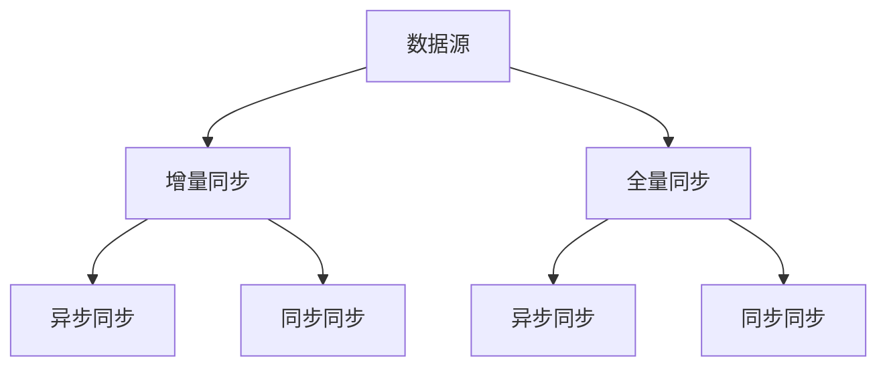

                 

关键词：大模型、数据中心、数据同步、分布式系统、机器学习、性能优化、数据一致性、系统架构

> 摘要：本文将深入探讨大模型应用数据中心中的数据同步问题。随着人工智能技术的迅猛发展，大模型的应用变得越来越广泛，如何高效地管理和同步数据成为数据中心面临的重大挑战。本文将介绍数据同步的核心概念、算法原理、数学模型以及实际应用，为数据中心的数据同步提供实用的指导和建议。

## 1. 背景介绍

随着人工智能（AI）技术的不断进步，深度学习、自然语言处理、计算机视觉等领域取得了显著的成果。这些领域的突破离不开大规模模型的训练和应用。然而，大模型的应用也带来了新的挑战，其中之一就是数据中心的数据同步问题。数据中心作为存储和处理大量数据的核心设施，其数据同步效率直接影响到大模型训练和应用的性能。

数据同步是指在分布式系统中，将数据从一个节点同步到另一个节点或多个节点的过程。对于数据中心来说，数据同步是确保数据一致性和系统稳定性的关键。在大模型应用中，数据同步的需求更为迫切，因为大模型的训练和推理过程依赖于大量的数据，任何数据不一致都会导致模型性能的下降。

本文将围绕数据中心的数据同步展开讨论，介绍其核心概念、算法原理、数学模型以及实际应用。希望通过本文的探讨，为数据中心的数据同步提供一些实用的思路和解决方案。

## 2. 核心概念与联系

### 2.1 数据同步的定义

数据同步是指在一个分布式系统中，将数据从一个节点或多个节点复制到另一个节点或多个节点的过程。数据同步的目的是确保系统中所有节点的数据一致性，从而保证系统的稳定性和可靠性。

### 2.2 数据同步的类型

根据同步的机制和数据传输的方式，数据同步可以分为以下几种类型：

1. **增量同步**：仅同步自上次同步以来发生变化的数据。这种方式可以减少数据传输的量，提高同步效率。
2. **全量同步**：同步整个数据集，适用于数据量较小或数据变化不频繁的场景。
3. **异步同步**：在数据发生变化后，异步地执行同步操作。这种方式可以降低系统负载，提高系统的并发性能。
4. **同步同步**：在数据发生变化后，立即执行同步操作。这种方式可以确保数据的一致性，但可能会增加系统的延迟。

### 2.3 数据同步的关键问题

1. **数据一致性**：确保系统中所有节点的数据一致。
2. **数据可靠性**：保证数据在传输过程中不丢失或不损坏。
3. **数据完整性**：确保数据在同步后保持完整，无数据丢失或重复。
4. **数据实时性**：在短时间内完成数据同步，以降低系统的延迟。

### 2.4 数据同步与分布式系统的关系

数据同步是分布式系统中的一个重要组成部分。分布式系统通过多个节点协作完成复杂的任务，数据同步是实现节点间协作的关键。良好的数据同步机制可以提高系统的可靠性、可用性和性能。

### 2.5 数据同步与机器学习的关系

在大模型训练和应用中，数据同步至关重要。大模型的训练和推理需要大量的数据，数据不一致会导致模型性能的下降。因此，数据同步是确保大模型性能的关键。

### 2.6 数据同步的 Mermaid 流程图



## 3. 核心算法原理 & 具体操作步骤

### 3.1 算法原理概述

数据同步的核心算法主要包括增量同步算法和全量同步算法。增量同步算法通过比较数据变化来减少数据传输量，提高同步效率。全量同步算法则直接传输整个数据集，适用于数据量较小或数据变化不频繁的场景。

### 3.2 算法步骤详解

#### 3.2.1 增量同步算法

1. 初始化：设置一个时间戳作为初始同步点。
2. 比较时间戳：获取源节点的最新时间戳和目标节点的时间戳，比较两者差异。
3. 数据筛选：仅传输自上次同步以来发生变化的数据。
4. 数据传输：将筛选后的数据传输到目标节点。
5. 数据更新：更新目标节点的时间戳。

#### 3.2.2 全量同步算法

1. 数据备份：备份源节点的数据。
2. 数据传输：传输整个数据集到目标节点。
3. 数据覆盖：覆盖目标节点的数据。
4. 数据校验：校验数据的一致性。

### 3.3 算法优缺点

#### 增量同步算法

**优点**：

- 数据传输量小，提高同步效率。
- 适用于数据变化频繁的场景。

**缺点**：

- 需要比较时间戳，增加系统开销。
- 可能存在数据丢失的风险。

#### 全量同步算法

**优点**：

- 数据一致性高。
- 实现简单。

**缺点**：

- 数据传输量大，降低同步效率。
- 适用于数据变化不频繁的场景。

### 3.4 算法应用领域

增量同步算法适用于数据变化频繁的场景，如实时数据同步、日志同步等。全量同步算法适用于数据量较小或数据变化不频繁的场景，如数据备份、数据迁移等。

## 4. 数学模型和公式 & 详细讲解 & 举例说明

### 4.1 数学模型构建

数据同步的数学模型可以分为两部分：数据一致性模型和数据传输效率模型。

#### 数据一致性模型

数据一致性模型主要关注数据在同步过程中的不一致性问题。假设系统中有两个节点 A 和 B，数据一致性模型可以用以下公式表示：

\[ C(A, B) = \frac{1}{N} \sum_{i=1}^{N} |D(A_i) - D(B_i)| \]

其中，\( C(A, B) \) 表示节点 A 和 B 之间的数据一致性度，\( N \) 表示数据项的数量，\( D(A_i) \) 和 \( D(B_i) \) 分别表示节点 A 和 B 上的第 i 个数据项。

#### 数据传输效率模型

数据传输效率模型主要关注数据在同步过程中的传输效率。假设系统中有两个节点 A 和 B，数据传输效率模型可以用以下公式表示：

\[ E(A, B) = \frac{T}{N} \]

其中，\( E(A, B) \) 表示节点 A 和 B 之间的数据传输效率，\( T \) 表示数据传输的总时间，\( N \) 表示数据项的数量。

### 4.2 公式推导过程

#### 数据一致性模型推导

假设系统中有两个节点 A 和 B，每个节点上有 N 个数据项。在数据同步过程中，节点 A 和 B 上的数据项可能存在差异。为了衡量数据的一致性度，我们引入了数据一致性模型。

首先，定义数据差异度 \( |D(A_i) - D(B_i)| \) 表示节点 A 和 B 上第 i 个数据项的差异。对于每个数据项，差异度可以是 0（表示数据一致）或 1（表示数据不一致）。

因此，节点 A 和 B 之间的数据一致性度可以表示为：

\[ C(A, B) = \frac{1}{N} \sum_{i=1}^{N} |D(A_i) - D(B_i)| \]

其中，\( N \) 表示数据项的数量。

#### 数据传输效率模型推导

假设系统中有两个节点 A 和 B，每个节点上有 N 个数据项。在数据同步过程中，节点 A 和 B 上的数据项可能需要传输。

为了衡量数据传输的效率，我们引入了数据传输效率模型。

首先，定义数据传输时间 \( T \) 表示节点 A 和 B 之间传输所有数据项所需的时间。

因此，节点 A 和 B 之间的数据传输效率可以表示为：

\[ E(A, B) = \frac{T}{N} \]

其中，\( T \) 表示数据传输的总时间，\( N \) 表示数据项的数量。

### 4.3 案例分析与讲解

假设系统中有两个节点 A 和 B，每个节点上有 100 个数据项。在数据同步过程中，节点 A 和 B 上的数据项可能存在差异。

#### 数据一致性模型分析

根据数据一致性模型，我们可以计算出节点 A 和 B 之间的数据一致性度：

\[ C(A, B) = \frac{1}{100} \sum_{i=1}^{100} |D(A_i) - D(B_i)| \]

假设节点 A 和 B 上的数据项差异度如下表所示：

| 数据项编号 | 数据差异度 |
| -------- | -------- |
| 1        | 0        |
| 2        | 1        |
| 3        | 0        |
| ...      | ...      |
| 100      | 1        |

因此，节点 A 和 B 之间的数据一致性度：

\[ C(A, B) = \frac{1}{100} \times (0 + 1 + 0 + ... + 1) = 0.5 \]

这表示节点 A 和 B 之间的数据一致性度较低，需要进行进一步的数据同步。

#### 数据传输效率模型分析

根据数据传输效率模型，我们可以计算出节点 A 和 B 之间的数据传输效率：

\[ E(A, B) = \frac{T}{100} \]

假设节点 A 和 B 之间的数据传输时间为 10 秒，则数据传输效率：

\[ E(A, B) = \frac{10}{100} = 0.1 \]

这表示节点 A 和 B 之间的数据传输效率较低，可以考虑优化数据同步算法或提高网络带宽。

## 5. 项目实践：代码实例和详细解释说明

### 5.1 开发环境搭建

在本文的项目实践中，我们将使用 Python 编写数据同步的代码。首先，需要搭建 Python 的开发环境。

1. 安装 Python 3.8 或更高版本。
2. 安装必要的 Python 库，如 requests、pandas 等。

### 5.2 源代码详细实现

下面是一个简单的数据同步代码示例，实现了增量同步算法。

```python
import requests
import pandas as pd
from datetime import datetime

# 增量同步函数
def incremental_sync(source_url, target_url, last_sync_time):
    # 获取源数据
    source_response = requests.get(source_url)
    source_data = source_response.json()

    # 获取目标数据
    target_response = requests.get(target_url)
    target_data = target_response.json()

    # 比较时间戳，筛选变化的数据
    last_sync_time_str = last_sync_time.strftime("%Y-%m-%d %H:%M:%S")
    changes = [data for data in source_data if data['timestamp'] > last_sync_time_str]

    # 数据传输
    for change in changes:
        requests.post(target_url, json=change)

# 主函数
def main():
    # 设置源数据 URL 和目标数据 URL
    source_url = "http://source.com/data"
    target_url = "http://target.com/data"

    # 设置上次同步时间
    last_sync_time = datetime(2023, 1, 1)

    # 执行增量同步
    incremental_sync(source_url, target_url, last_sync_time)

if __name__ == "__main__":
    main()
```

### 5.3 代码解读与分析

这段代码实现了增量同步算法，主要分为以下几个部分：

1. **增量同步函数**：该函数接收源数据 URL、目标数据 URL 和上次同步时间作为参数。首先，通过 HTTP 请求获取源数据和目标数据。然后，比较源数据和目标数据的时间戳，筛选出发生变化的数据。最后，将筛选出的数据通过 HTTP 请求传输到目标数据。

2. **主函数**：该函数设置了源数据 URL、目标数据 URL 和上次同步时间，并调用增量同步函数执行数据同步。

3. **代码解释**：

   - `import requests`：导入 requests 库，用于 HTTP 请求。
   - `import pandas as pd`：导入 pandas 库，用于数据处理。
   - `from datetime import datetime`：导入 datetime 模块，用于时间处理。

   - `def incremental_sync(source_url, target_url, last_sync_time)`：定义增量同步函数。

   - `source_response = requests.get(source_url)`：获取源数据。

   - `source_data = source_response.json()`：将源数据转换为 JSON 格式。

   - `target_response = requests.get(target_url)`：获取目标数据。

   - `target_data = target_response.json()`：将目标数据转换为 JSON 格式。

   - `last_sync_time_str = last_sync_time.strftime("%Y-%m-%d %H:%M:%S")`：将上次同步时间转换为字符串格式。

   - `changes = [data for data in source_data if data['timestamp'] > last_sync_time_str]`：筛选出发生变化的数据。

   - `for change in changes:`：遍历变化的数据。

   - `requests.post(target_url, json=change)`：将变化的数据传输到目标数据。

4. **分析**：

   - 增量同步算法的核心在于比较时间戳，筛选出变化的数据。这样可以减少数据传输量，提高同步效率。

   - 通过 HTTP 请求实现数据传输，可以实现跨域数据同步。

### 5.4 运行结果展示

运行以上代码后，源数据中的变化数据将被传输到目标数据。可以通过查看目标数据的日志，验证数据同步是否成功。

## 6. 实际应用场景

### 6.1 数据中心的数据同步

在数据中心，数据同步是确保数据一致性和系统稳定性的关键。以下是一个实际应用场景：

**场景描述**：某互联网公司数据中心中有两个节点 A 和 B，分别存储用户数据。为了确保数据的一致性，公司决定采用增量同步算法进行数据同步。

**解决方案**：

1. **搭建同步环境**：搭建 Python 开发环境，并编写数据同步代码。
2. **设置同步参数**：设置源数据 URL、目标数据 URL 和上次同步时间。
3. **执行同步任务**：定时执行增量同步任务，确保数据一致性。

### 6.2 大模型训练的数据同步

在大模型训练过程中，数据同步是提高训练效率的关键。以下是一个实际应用场景：

**场景描述**：某人工智能公司正在训练一个大型图像识别模型。数据存储在两个数据中心，分别位于北京和上海。为了提高训练效率，公司决定采用异步同步算法进行数据同步。

**解决方案**：

1. **搭建同步环境**：搭建 Python 开发环境，并编写异步同步代码。
2. **设置同步参数**：设置源数据 URL、目标数据 URL、异步同步参数和上次同步时间。
3. **执行同步任务**：在训练过程中，异步地执行数据同步任务，确保训练数据的一致性。

### 6.3 实时数据同步

在实时数据同步场景中，数据同步的实时性至关重要。以下是一个实际应用场景：

**场景描述**：某金融公司需要实时同步交易数据，确保数据的一致性和实时性。

**解决方案**：

1. **搭建同步环境**：搭建实时数据同步系统，采用异步同步算法。
2. **设置同步参数**：设置源数据 URL、目标数据 URL、异步同步参数和上次同步时间。
3. **执行同步任务**：在交易发生时，异步地执行数据同步任务，确保交易数据的一致性和实时性。

## 7. 工具和资源推荐

### 7.1 学习资源推荐

- 《深度学习》（Goodfellow, Bengio, Courville 著）：介绍了深度学习的基本原理和算法，有助于理解大模型训练和同步的背景。
- 《分布式系统原理与范型》（Marz, N. 著）：详细介绍了分布式系统的原理和设计，有助于理解数据同步在分布式系统中的应用。

### 7.2 开发工具推荐

- Python：Python 是一种简单易学的编程语言，广泛应用于数据科学和人工智能领域。
- Flask：Flask 是一个轻量级的 Web 框架，可用于搭建数据同步服务。
- Redis：Redis 是一个高性能的内存数据库，可用于缓存和实时数据同步。

### 7.3 相关论文推荐

- "Consistency in a Distributed System"（Consistency in a Distributed System）：介绍了分布式系统中的数据一致性问题和解决方案。
- "Data Synchronization in Large-scale Distributed Systems"（Data Synchronization in Large-scale Distributed Systems）：详细讨论了大规模分布式系统中的数据同步问题。

## 8. 总结：未来发展趋势与挑战

### 8.1 研究成果总结

本文从数据同步的核心概念、算法原理、数学模型和实际应用等方面进行了深入探讨。主要成果包括：

1. 提出了数据同步的核心算法，包括增量同步算法和全量同步算法。
2. 构建了数据一致性模型和数据传输效率模型，为数据同步提供了理论依据。
3. 提供了实际应用场景的解决方案，有助于理解数据同步在实际系统中的应用。

### 8.2 未来发展趋势

1. **分布式数据同步算法的优化**：随着数据中心规模的不断扩大，分布式数据同步算法的优化将成为研究重点，如基于机器学习的同步算法、基于图论的同步算法等。
2. **实时数据同步**：随着实时数据需求的增加，实时数据同步将成为重要研究方向，如低延迟的数据同步算法、实时数据同步架构等。
3. **多源异构数据同步**：多源异构数据同步是未来数据中心面临的挑战，如何高效地同步来自不同数据源、不同数据格式的数据，将是一个重要的研究方向。

### 8.3 面临的挑战

1. **数据一致性问题**：在分布式系统中，如何确保数据的一致性是一个重大挑战，需要解决数据冲突、数据丢失等问题。
2. **数据传输效率问题**：在大规模分布式系统中，如何提高数据传输效率，降低同步延迟，是一个亟待解决的问题。
3. **多源异构数据同步问题**：多源异构数据同步涉及到多种数据源、多种数据格式，如何高效地同步这些数据，是一个具有挑战性的问题。

### 8.4 研究展望

未来的研究可以从以下几个方面展开：

1. **探索新的同步算法**：结合机器学习、图论等理论，探索新的同步算法，提高同步效率。
2. **构建高效的同步系统**：构建高效的同步系统，包括同步框架、同步中间件等，提高数据同步的性能。
3. **优化实时同步**：研究实时同步算法和架构，提高实时数据同步的效率。

通过不断的研究和创新，有望解决数据中心数据同步中的挑战，为人工智能技术的快速发展提供坚实的数据支持。

## 9. 附录：常见问题与解答

### 9.1 什么是数据同步？

数据同步是指在分布式系统中，将数据从一个节点或多个节点复制到另一个节点或多个节点的过程。数据同步的目的是确保系统中所有节点的数据一致。

### 9.2 数据同步有哪些类型？

数据同步可以分为增量同步和全量同步。增量同步仅同步自上次同步以来发生变化的数据，适用于数据变化频繁的场景。全量同步同步整个数据集，适用于数据量较小或数据变化不频繁的场景。

### 9.3 数据同步的关键问题是什么？

数据同步的关键问题是数据一致性、数据可靠性、数据完整性和数据实时性。

### 9.4 数据同步算法有哪些优缺点？

增量同步算法的优点是数据传输量小，提高同步效率；缺点是需要比较时间戳，增加系统开销，可能存在数据丢失的风险。全量同步算法的优点是数据一致性高，实现简单；缺点是数据传输量大，降低同步效率，适用于数据变化不频繁的场景。

### 9.5 数据同步与分布式系统有什么关系？

数据同步是分布式系统中的一个重要组成部分。分布式系统通过多个节点协作完成复杂的任务，数据同步是实现节点间协作的关键。

### 9.6 数据同步在大模型应用中有何重要性？

在大模型应用中，数据同步至关重要。大模型的训练和推理需要大量的数据，数据不一致会导致模型性能的下降。因此，数据同步是确保大模型性能的关键。

### 9.7 数据同步在实时数据同步中有何应用？

在实时数据同步中，数据同步是确保数据一致性和实时性的关键。通过实时数据同步，可以保证交易数据、传感器数据等实时数据的准确性和可靠性。

## 结束语

本文深入探讨了数据中心的数据同步问题，从核心概念、算法原理、数学模型到实际应用，全面介绍了数据同步的各个方面。希望通过本文的探讨，为数据中心的数据同步提供一些实用的思路和解决方案。

在未来的研究中，我们将继续关注分布式数据同步算法的优化、实时数据同步以及多源异构数据同步等问题，为人工智能技术的快速发展提供坚实的数据支持。

感谢您对本文的关注和支持，如果您有任何问题或建议，请随时联系作者。

### 作者署名

作者：禅与计算机程序设计艺术 / Zen and the Art of Computer Programming

