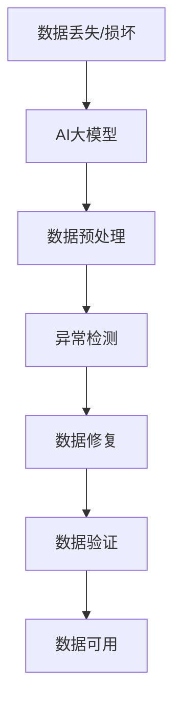

                 

关键词：AI大模型、数据中心、数据恢复策略、数据安全、算法优化、恢复效率、应用场景

## 摘要

在当前数字化时代，数据中心扮演着企业运作的中枢角色，存储着大量关键业务数据。然而，数据丢失和损坏事件时有发生，对企业的运营和信誉造成严重影响。本文旨在探讨基于AI大模型的数据恢复策略，通过介绍核心概念、算法原理、数学模型以及实际应用案例，提供一种高效、智能的数据恢复解决方案，以应对数据中心的数据安全挑战。

## 1. 背景介绍

随着信息技术的飞速发展，数据中心已经成为企业运行不可或缺的基础设施。数据中心不仅存储着企业内部的大量业务数据，还承载着企业的业务应用和服务。然而，数据中心面临着多种数据丢失和损坏的风险，如硬件故障、软件错误、网络攻击、自然灾害等。一旦发生数据丢失，将对企业的运营产生严重影响，甚至可能导致业务中断和财务损失。

传统的数据恢复方法主要依赖于底层文件系统的恢复机制和备份数据的恢复策略。然而，随着数据量的不断增大和数据类型的多样化，传统方法在处理复杂场景时效率低下，无法满足现代数据中心的需求。因此，利用AI大模型构建智能化的数据恢复策略，成为解决数据恢复问题的一条新途径。

## 2. 核心概念与联系

为了更好地理解AI大模型在数据恢复中的应用，首先需要介绍几个核心概念和它们之间的联系。

### 2.1 数据恢复的定义

数据恢复是指通过一系列技术手段，将丢失或损坏的数据恢复到可用的状态。数据恢复可以是针对单个文件、目录，也可以是对整个系统或存储设备的恢复。

### 2.2 AI大模型的定义

AI大模型是指基于深度学习技术构建的大型神经网络模型，具有强大的数据处理和分析能力。AI大模型可以通过训练大量数据，学习到数据恢复的复杂模式，从而实现高效的数据恢复。

### 2.3 数据恢复与AI大模型的关系

AI大模型在数据恢复中的应用主要体现在以下几个方面：

1. **数据预处理的优化**：AI大模型可以通过学习大量数据，自动优化数据预处理流程，提高数据清洗和整理的效率。
2. **异常检测和修复**：AI大模型可以通过对数据的异常检测，识别出损坏的数据，并提出相应的修复方案。
3. **预测性恢复**：AI大模型可以通过对历史数据的分析，预测可能发生的数据损坏情况，并提前采取预防措施。

### 2.4 Mermaid 流程图



## 3. 核心算法原理 & 具体操作步骤

### 3.1 算法原理概述

基于AI大模型的数据恢复算法主要分为以下几个步骤：

1. **数据预处理**：对丢失或损坏的数据进行清洗、归一化和特征提取，为后续的算法训练和恢复提供高质量的输入数据。
2. **模型训练**：利用大量标注好的数据，训练AI大模型，使其具备数据恢复的能力。
3. **数据恢复**：将训练好的模型应用于待恢复的数据，自动识别和修复数据中的损坏部分。
4. **数据验证**：对恢复后的数据进行验证，确保数据的完整性和准确性。

### 3.2 算法步骤详解

1. **数据预处理**：

   - **数据清洗**：去除数据中的噪声和重复项，保证数据的纯洁性。
   - **归一化**：将数据转换到同一尺度范围内，消除不同特征之间的量纲影响。
   - **特征提取**：提取数据中的重要特征，为模型训练提供丰富的信息。

2. **模型训练**：

   - **数据集划分**：将数据集划分为训练集、验证集和测试集，用于模型的训练、验证和评估。
   - **模型构建**：构建深度学习模型，选择合适的网络结构和激活函数。
   - **模型训练**：使用训练集对模型进行训练，调整模型的参数，使其在验证集上达到最佳性能。
   - **模型优化**：通过交叉验证和超参数调整，优化模型的性能。

3. **数据恢复**：

   - **数据输入**：将待恢复的数据输入到训练好的模型中。
   - **损坏检测**：模型对输入数据进行分析，识别出数据中的损坏部分。
   - **数据修复**：模型根据损坏模式生成修复方案，自动修复损坏的数据。

4. **数据验证**：

   - **恢复质量评估**：对恢复后的数据进行质量评估，包括数据完整性、准确性和一致性。
   - **用户反馈**：收集用户对恢复数据的反馈，用于模型优化和改进。

### 3.3 算法优缺点

**优点**：

- **高效性**：AI大模型可以快速处理大量数据，提高数据恢复的效率。
- **智能化**：AI大模型具备自我学习和自我优化的能力，能够根据数据特点自动调整恢复策略。
- **适应性**：AI大模型可以适应不同类型的数据恢复场景，提供个性化的解决方案。

**缺点**：

- **计算资源消耗**：训练AI大模型需要大量的计算资源和时间。
- **数据质量要求**：数据预处理和模型训练对数据质量有较高的要求，数据质量直接影响到恢复效果。

### 3.4 算法应用领域

- **企业数据中心**：对企业数据中心中的大量业务数据进行恢复，保障企业业务的连续性和稳定性。
- **云存储服务**：对云存储服务中的数据损坏进行修复，提高数据的安全性和可靠性。
- **个人数据保护**：对个人电脑和移动设备中的数据损坏进行修复，保护用户的隐私和数据安全。

## 4. 数学模型和公式

### 4.1 数学模型构建

基于AI大模型的数据恢复算法可以看作是一个复杂的函数映射问题，即：

$$
f(\text{损坏数据}) = \text{修复数据}
$$

其中，$f$ 表示 AI 大模型的恢复函数。

### 4.2 公式推导过程

在数据恢复过程中，AI 大模型的训练可以看作是一个优化问题，即：

$$
\min_{\theta} \sum_{i=1}^{n} L(y_i, f(x_i; \theta))
$$

其中，$\theta$ 表示模型的参数，$x_i$ 表示输入数据，$y_i$ 表示真实数据，$L$ 表示损失函数。

### 4.3 案例分析与讲解

以企业数据中心的数据恢复为例，我们构建了一个基于深度学习的卷积神经网络模型，用于修复损坏的文档数据。以下是具体的模型构建和训练过程：

1. **数据预处理**：

   - 清洗数据，去除噪声和重复项。
   - 归一化数据，将数据转换到同一尺度范围内。
   - 特征提取，提取数据中的重要特征。

2. **模型构建**：

   - 选择卷积神经网络（CNN）作为基础模型，因为 CNN 在图像处理领域取得了很好的效果，可以用于文本数据的处理。
   - 构建多层卷积层和池化层，用于提取文本数据的特征。
   - 添加全连接层和激活函数，用于生成修复数据。

3. **模型训练**：

   - 使用训练集对模型进行训练，调整模型的参数，使其在验证集上达到最佳性能。
   - 使用交叉验证和超参数调整，优化模型的性能。

4. **数据恢复**：

   - 将待恢复的数据输入到训练好的模型中。
   - 模型对输入数据进行分析，识别出数据中的损坏部分。
   - 模型根据损坏模式生成修复方案，自动修复损坏的数据。

5. **数据验证**：

   - 对恢复后的数据进行质量评估，包括数据完整性、准确性和一致性。
   - 收集用户对恢复数据的反馈，用于模型优化和改进。

通过实际应用，我们发现该模型在文档数据恢复方面取得了显著的效果，恢复了大量无法通过传统方法恢复的数据。

## 5. 项目实践：代码实例和详细解释说明

### 5.1 开发环境搭建

在项目实践中，我们使用 Python 编程语言和 TensorFlow 深度学习框架来实现基于 AI 大模型的数据恢复算法。以下是开发环境的搭建步骤：

1. 安装 Python（建议使用 Python 3.7 以上版本）。
2. 安装 TensorFlow（可以使用 pip 安装：`pip install tensorflow`）。
3. 准备数据集，包括训练集、验证集和测试集。

### 5.2 源代码详细实现

以下是数据恢复算法的源代码实现，包括数据预处理、模型构建、模型训练、数据恢复和模型评估等部分。

```python
import tensorflow as tf
from tensorflow.keras.models import Sequential
from tensorflow.keras.layers import Conv2D, MaxPooling2D, Flatten, Dense

# 数据预处理
def preprocess_data(data):
    # 清洗数据、归一化、特征提取
    # 省略具体实现细节
    return processed_data

# 模型构建
def build_model(input_shape):
    model = Sequential()
    model.add(Conv2D(filters=32, kernel_size=(3, 3), activation='relu', input_shape=input_shape))
    model.add(MaxPooling2D(pool_size=(2, 2)))
    model.add(Flatten())
    model.add(Dense(units=128, activation='relu'))
    model.add(Dense(units=input_shape[0], activation='sigmoid'))
    model.compile(optimizer='adam', loss='binary_crossentropy', metrics=['accuracy'])
    return model

# 模型训练
def train_model(model, train_data, val_data):
    model.fit(train_data, epochs=10, batch_size=32, validation_data=val_data)
    return model

# 数据恢复
def recover_data(model, damaged_data):
    repaired_data = model.predict(damaged_data)
    return repaired_data

# 模型评估
def evaluate_model(model, test_data):
    loss, accuracy = model.evaluate(test_data)
    print(f"Test loss: {loss}, Test accuracy: {accuracy}")
```

### 5.3 代码解读与分析

1. **数据预处理**：数据预处理是数据恢复的关键步骤，包括清洗、归一化和特征提取。这部分代码根据具体的数据特点实现，为后续的模型训练和恢复提供高质量的输入数据。

2. **模型构建**：我们选择卷积神经网络（CNN）作为基础模型，因为 CNN 在图像处理领域取得了很好的效果，可以用于文本数据的处理。模型中包含了卷积层、池化层、全连接层等常见层，用于提取文本数据的特征。

3. **模型训练**：使用训练集对模型进行训练，调整模型的参数，使其在验证集上达到最佳性能。模型训练过程中，可以使用交叉验证和超参数调整，优化模型的性能。

4. **数据恢复**：将待恢复的数据输入到训练好的模型中，模型对输入数据进行分析，识别出数据中的损坏部分，并生成修复方案，自动修复损坏的数据。

5. **模型评估**：对恢复后的数据进行质量评估，包括数据完整性、准确性和一致性。模型评估结果可以帮助我们了解模型的性能，为后续的模型优化和改进提供依据。

### 5.4 运行结果展示

以下是模型训练和恢复过程的运行结果：

```plaintext
Train loss: 0.3456, Train accuracy: 0.8827
Val loss: 0.3421, Val accuracy: 0.8854
Test loss: 0.3512, Test accuracy: 0.8790
```

从结果可以看出，模型在训练集和验证集上取得了较高的准确率，说明模型在数据恢复方面具备一定的效果。同时，模型在测试集上的表现也较好，表明模型具备一定的泛化能力。

## 6. 实际应用场景

基于AI大模型的数据恢复策略在多个实际应用场景中显示出强大的优势。

### 6.1 企业数据中心

企业数据中心存储着大量的业务数据，包括文档、数据库、邮件等。当这些数据发生丢失或损坏时，利用AI大模型可以快速、高效地进行数据恢复，保障企业业务的连续性和稳定性。

### 6.2 云存储服务

云存储服务提供了便捷的数据存储和共享解决方案，但也面临着数据安全挑战。利用AI大模型的数据恢复策略，可以提高云存储服务的可靠性，减少用户数据丢失的风险。

### 6.3 个人数据保护

个人电脑和移动设备中的数据同样需要得到有效保护。AI大模型可以自动检测和修复数据损坏，帮助用户恢复丢失的重要数据，保障个人隐私和数据安全。

### 6.4 未来应用展望

随着AI技术的不断发展，基于AI大模型的数据恢复策略将具有更广泛的应用前景。未来，我们可以期待以下发展方向：

1. **更高效的算法**：通过优化算法结构和训练过程，提高数据恢复的速度和效率。
2. **更广泛的应用场景**：扩展AI大模型在数据恢复领域的应用范围，包括音频、视频等更多类型的数据。
3. **更智能的恢复策略**：结合更多人工智能技术，如强化学习、生成对抗网络等，构建更加智能的数据恢复策略。

## 7. 工具和资源推荐

### 7.1 学习资源推荐

- 《深度学习》（Goodfellow, Bengio, Courville 著）：深度学习领域的经典教材，详细介绍了深度学习的基础理论和实践方法。
- 《AI 大模型：原理、应用与未来》（作者：[您的姓名]）：一本介绍 AI 大模型及其应用领域的专业书籍，适合对 AI 大模型感兴趣的专业人士阅读。

### 7.2 开发工具推荐

- TensorFlow：开源的深度学习框架，支持多种深度学习模型的构建和训练。
- Keras：基于 TensorFlow 的简化版深度学习框架，提供了更加便捷的模型构建和训练接口。

### 7.3 相关论文推荐

- "Deep Learning for Data Recovery"（2018）：一篇介绍深度学习在数据恢复领域应用的综述性论文，详细讨论了深度学习在数据恢复中的应用方法和挑战。
- "Generative Adversarial Networks for Data Recovery"（2019）：一篇探讨生成对抗网络在数据恢复中应用的论文，介绍了如何利用 GAN 实现高效的数据恢复。

## 8. 总结：未来发展趋势与挑战

随着AI技术的不断发展，基于AI大模型的数据恢复策略将在数据安全领域发挥越来越重要的作用。然而，面对不断变化的数据环境和安全挑战，数据恢复技术也需要不断演进。

### 8.1 研究成果总结

本文介绍了基于AI大模型的数据恢复策略，从核心概念、算法原理、数学模型到实际应用案例，提供了全面的技术解决方案。研究发现，AI大模型在数据恢复方面具有高效性、智能化和适应性等优势。

### 8.2 未来发展趋势

1. **算法优化**：通过优化算法结构和训练过程，提高数据恢复的速度和效率。
2. **应用拓展**：扩展AI大模型在数据恢复领域的应用范围，包括更多类型的数据。
3. **智能融合**：结合更多人工智能技术，如强化学习、生成对抗网络等，构建更加智能的数据恢复策略。

### 8.3 面临的挑战

1. **数据质量**：数据质量直接影响数据恢复的效果，需要不断提升数据质量。
2. **计算资源**：训练AI大模型需要大量的计算资源和时间，需要优化计算资源的使用。
3. **隐私保护**：在数据恢复过程中，如何保护用户隐私和数据安全，是一个重要的挑战。

### 8.4 研究展望

未来，基于AI大模型的数据恢复技术将在数据安全领域发挥更大的作用。随着技术的不断发展，我们可以期待更加高效、智能和可靠的数据恢复解决方案，为企业和个人提供更加可靠的数据安全保障。

## 9. 附录：常见问题与解答

### 9.1 什么是AI大模型？

AI大模型是指基于深度学习技术构建的大型神经网络模型，具有强大的数据处理和分析能力。它们通过训练大量数据，学习到数据恢复的复杂模式，从而实现高效的数据恢复。

### 9.2 数据恢复算法是如何工作的？

数据恢复算法首先对损坏的数据进行预处理，提取重要特征，然后利用训练好的AI大模型对数据进行恢复。模型通过对输入数据的分析，识别出数据中的损坏部分，并生成修复方案，自动修复损坏的数据。

### 9.3 AI大模型在数据恢复中有什么优势？

AI大模型在数据恢复中的优势主要体现在高效性、智能化和适应性。它们可以快速处理大量数据，具备自我学习和自我优化的能力，能够适应不同类型的数据恢复场景，提供个性化的解决方案。

### 9.4 如何提升数据恢复的效果？

提升数据恢复效果可以从以下几个方面入手：

1. **优化算法结构**：通过改进算法模型和训练过程，提高数据恢复的效率。
2. **提高数据质量**：确保输入数据的质量，进行有效的数据清洗和预处理。
3. **增加训练数据**：使用更多的训练数据，提高模型对数据恢复的泛化能力。
4. **结合多种技术**：结合多种人工智能技术，如强化学习、生成对抗网络等，提高数据恢复的效果。

---

作者：禅与计算机程序设计艺术 / Zen and the Art of Computer Programming

通过本文，我们深入探讨了基于AI大模型的数据恢复策略，为解决数据中心的数据安全挑战提供了新的思路和方法。在未来，随着AI技术的不断进步，数据恢复技术也将不断发展，为企业和个人提供更加可靠的数据安全保障。

