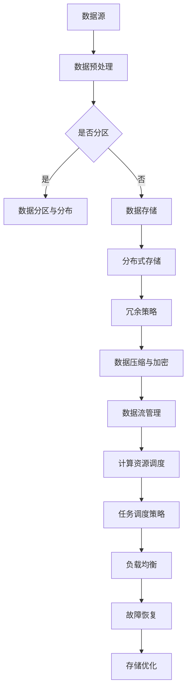

                 

关键词：人工智能，大模型，数据中心，数据架构，深度学习

> 摘要：本文将深入探讨人工智能大模型在数据中心的应用，以及如何构建一个高效稳定的数据架构来支撑这些大模型的学习和推理过程。文章将涵盖大模型的背景知识、数据架构的设计原则、关键组件及其实现方法，并探讨当前面临的技术挑战和未来发展方向。

## 1. 背景介绍

随着人工智能技术的快速发展，深度学习模型在大数据处理、图像识别、自然语言处理等领域取得了显著的成果。这些深度学习模型，特别是大模型（如 GPT-3、BERT 等），具有强大的学习和推理能力，但同时也对数据中心的计算资源、存储能力和网络带宽提出了极高的要求。因此，构建一个高效稳定的数据架构成为实现大模型应用的关键。

### 1.1 大模型的定义与特点

大模型通常指的是具有数十亿至数万亿参数的深度学习模型，其特点是模型参数规模大、结构复杂，能够在海量数据上进行训练，从而实现高精度的预测和推理。大模型在训练和推理过程中需要消耗大量的计算资源和存储资源，同时要求快速且稳定的数据传输。

### 1.2 数据中心在人工智能中的应用

数据中心作为人工智能大模型训练和推理的场所，承担着重要的角色。数据中心的主要功能包括：

- **计算资源管理**：提供高性能的GPU、TPU等计算设备，满足大模型的训练需求。
- **数据存储与管理**：提供高吞吐量、高可靠性的存储系统，存储和管理海量数据。
- **网络带宽与传输**：确保数据在数据中心内部和外部的快速传输。
- **能源管理**：优化能源使用，降低运行成本。

## 2. 核心概念与联系

为了构建一个高效稳定的数据架构，我们需要了解几个核心概念，包括数据流管理、计算资源调度、存储架构设计等。

### 2.1 数据流管理

数据流管理是指数据在数据中心内部和外部的传输和处理过程。为了确保数据的高效传输，我们需要考虑以下几个方面：

- **数据预处理**：在数据进入训练或推理流程之前，需要进行数据清洗、归一化等预处理操作，以提高模型的训练效率和准确性。
- **数据分区与分布**：将数据分布在多个存储设备上，以平衡负载并提高数据访问速度。
- **数据压缩与加密**：对数据进行压缩和加密，以减少存储空间和提高数据安全性。

### 2.2 计算资源调度

计算资源调度是指根据训练或推理任务的需求，动态分配和调整计算资源。为了实现高效的计算资源调度，我们需要考虑以下几个方面：

- **任务调度策略**：根据任务的优先级、资源需求等因素，选择合适的调度策略，如最长作业优先（LFU）、最短剩余时间优先（SRTF）等。
- **负载均衡**：通过分布式计算和任务分发，实现计算资源的负载均衡，避免单个计算节点过载。
- **故障恢复**：在计算资源出现故障时，能够快速切换到备用资源，保证训练或推理的连续性。

### 2.3 存储架构设计

存储架构设计是指数据中心内存储系统的设计原则和实现方法。为了满足大模型的数据存储需求，我们需要考虑以下几个方面：

- **分布式存储**：通过分布式存储架构，实现数据的横向扩展，提高存储系统的吞吐量和可靠性。
- **冗余策略**：采用数据备份、副本复制等技术，提高数据的可靠性和可用性。
- **存储优化**：通过数据压缩、去重等技术，提高存储空间的利用率。

### 2.4 数据架构的 Mermaid 流程图

以下是一个简化的 Mermaid 流程图，展示数据架构的核心组件和流程：



## 3. 核心算法原理 & 具体操作步骤

### 3.1 算法原理概述

数据架构的核心算法主要涉及计算资源调度、数据分区与分布、负载均衡等方面。以下将详细介绍这些算法的原理和具体操作步骤。

### 3.2 算法步骤详解

#### 3.2.1 计算资源调度

1. **任务接收**：数据中心接收来自外部或内部的任务请求，包括训练任务、推理任务等。
2. **任务解析**：对任务进行解析，获取任务的类型、优先级、资源需求等信息。
3. **资源分配**：根据任务的资源需求，动态分配计算资源，包括CPU、GPU、TPU等。
4. **任务调度**：根据任务的优先级、资源需求等因素，选择合适的调度策略进行任务调度。
5. **任务执行**：将任务分发到具体的计算节点上，执行相应的训练或推理操作。
6. **结果反馈**：将任务执行的结果反馈给外部或内部调用者。

#### 3.2.2 数据分区与分布

1. **数据预处理**：对原始数据进行清洗、归一化等预处理操作，以提高模型的训练效率和准确性。
2. **数据分区**：根据数据的特点和模型的需求，将数据划分为多个分区，如按时间、按类别等。
3. **数据分布**：将不同分区的数据分布到多个存储设备上，以平衡负载并提高数据访问速度。
4. **数据索引**：为每个分区建立索引，方便快速检索和查询。

#### 3.2.3 负载均衡

1. **监控节点状态**：实时监控数据中心内各个节点的负载情况，包括CPU利用率、内存占用、网络带宽等。
2. **负载评估**：根据节点的负载情况，评估整个系统的负载均衡状况。
3. **任务重分配**：将高负载节点的任务重分配到低负载节点，实现负载均衡。
4. **节点故障恢复**：在节点出现故障时，自动切换到备用节点，确保任务的连续性。

### 3.3 算法优缺点

#### 优点：

- **高效性**：通过优化计算资源调度、数据分区与分布、负载均衡等算法，提高数据中心的整体性能和吞吐量。
- **稳定性**：通过冗余策略和故障恢复机制，确保系统的稳定运行和高可用性。
- **可扩展性**：通过分布式架构和横向扩展，实现数据中心的弹性扩展和动态调整。

#### 缺点：

- **复杂性**：数据架构涉及多个层面和组件，需要协调和优化，实现起来较为复杂。
- **成本**：大规模的数据中心和计算资源需求，带来较高的建设和维护成本。
- **安全性**：数据安全和隐私保护是一个重要挑战，需要采取有效的安全措施和策略。

### 3.4 算法应用领域

- **人工智能训练和推理**：大模型的训练和推理是数据架构的主要应用领域，包括图像识别、自然语言处理、推荐系统等。
- **大数据处理**：数据架构在大数据处理领域也有广泛应用，如数据仓库、数据挖掘、实时流处理等。
- **云计算和边缘计算**：数据架构在云计算和边缘计算场景中，为海量数据的存储、处理和传输提供支持。

## 4. 数学模型和公式 & 详细讲解 & 举例说明

### 4.1 数学模型构建

数据架构中的核心数学模型主要涉及计算资源调度、数据分区与分布、负载均衡等方面。以下是一个简化的数学模型示例：

#### 4.1.1 计算资源调度模型

- **资源需求**：设任务 \( T \) 的资源需求为 \( R \)，包括CPU、GPU、TPU等。
- **资源池**：设数据中心内资源池为 \( P \)，包括 \( n \) 个计算节点，每个节点的资源为 \( R_i \)（\( i=1,2,...,n \)）。
- **任务分配策略**：选择一种任务分配策略，如最长作业优先（LFU）、最短剩余时间优先（SRTF）等。

#### 4.1.2 数据分区与分布模型

- **数据分区**：设数据集为 \( D \)，划分为 \( m \) 个分区，每个分区为 \( D_i \)（\( i=1,2,...,m \)）。
- **数据分布**：根据数据特点和模型需求，选择合适的分布策略，如时间分区、类别分区等。

#### 4.1.3 负载均衡模型

- **节点负载**：设数据中心内节点的负载为 \( L_i \)（\( i=1,2,...,n \)）。
- **负载均衡策略**：选择一种负载均衡策略，如基于节点负载的负载均衡、基于任务负载的负载均衡等。

### 4.2 公式推导过程

以下为计算资源调度模型的推导过程：

1. **资源需求计算**：

   设任务 \( T \) 的资源需求为 \( R \)，包括CPU、GPU、TPU等，则有：

   $$ R = R_{CPU} + R_{GPU} + R_{TPU} $$

2. **资源池计算**：

   设数据中心内资源池为 \( P \)，包括 \( n \) 个计算节点，每个节点的资源为 \( R_i \)（\( i=1,2,...,n \)），则有：

   $$ P = R_1 + R_2 + ... + R_n $$

3. **任务分配策略**：

   选择最长作业优先（LFU）策略，则选择负载最低的节点进行任务分配，即：

   $$ i^* = \arg\min_{i} L_i $$

   其中，\( L_i \) 为节点 \( i \) 的负载。

### 4.3 案例分析与讲解

以下为一个具体的案例，说明如何应用上述数学模型进行计算资源调度。

#### 案例背景

某数据中心有4个计算节点，资源需求分别为：

- 节点1：CPU 4核、GPU 1块、TPU 2个
- 节点2：CPU 8核、GPU 2块、TPU 4个
- 节点3：CPU 2核、GPU 0块、TPU 1个
- 节点4：CPU 6核、GPU 1块、TPU 3个

现有一个任务，资源需求为：

- CPU 6核
- GPU 1块
- TPU 2个

#### 案例分析

1. **资源需求计算**：

   任务资源需求为 \( R = 6CPU + 1GPU + 2TPU \)。

2. **资源池计算**：

   数据中心资源池为 \( P = 4CPU + 4GPU + 4TPU \)。

3. **任务分配策略**：

   选择最长作业优先（LFU）策略，即选择负载最低的节点进行任务分配。

4. **负载计算**：

   各节点负载分别为：

   - 节点1：\( L_1 = 4CPU + 1GPU + 2TPU = 7 \)
   - 节点2：\( L_2 = 8CPU + 2GPU + 4TPU = 14 \)
   - 节点3：\( L_3 = 2CPU + 0GPU + 1TPU = 3 \)
   - 节点4：\( L_4 = 6CPU + 1GPU + 3TPU = 10 \)

   显然，节点3的负载最低，选择节点3进行任务分配。

5. **任务执行**：

   将任务分配给节点3，任务执行过程中，节点3的负载将逐渐上升，当负载超过阈值时，可以考虑将部分任务迁移到其他节点，以实现负载均衡。

## 5. 项目实践：代码实例和详细解释说明

### 5.1 开发环境搭建

为了演示数据架构的实现，我们选择Python作为编程语言，使用Docker容器化技术搭建开发环境。以下是搭建开发环境的步骤：

1. 安装Docker：在服务器上安装Docker，可以从Docker官方网站（https://www.docker.com/products/docker-desktop）下载安装包，按照提示安装。

2. 编写Dockerfile：创建一个名为`dockerfile`的文件，内容如下：

   ```dockerfile
   FROM python:3.8-slim

   RUN pip install numpy pandas matplotlib

   WORKDIR /app

   COPY . .

   CMD ["python", "main.py"]
   ```

   这条Dockerfile基于Python 3.8 Slim镜像，安装了必要的库，并将当前目录下的代码复制到容器中，指定启动命令为`python main.py`。

3. 构建Docker镜像：在终端中执行以下命令，构建Docker镜像：

   ```shell
   docker build -t dataarchitecture .
   ```

4. 运行Docker容器：在终端中执行以下命令，启动Docker容器：

   ```shell
   docker run -it --rm dataarchitecture
   ```

   进入容器后，可以使用Python进行编程。

### 5.2 源代码详细实现

以下是实现数据架构的核心代码，包括计算资源调度、数据分区与分布、负载均衡等功能。

```python
import numpy as np
import matplotlib.pyplot as plt

# 计算资源调度
def resource_scheduling(tasks, resources):
    # tasks: 任务列表，每个任务包括资源需求和优先级
    # resources: 节点资源列表，每个节点包括可用资源和负载
    # 返回：任务分配结果，包括任务ID和节点ID

    # 排序任务列表，按照优先级从高到低排序
    tasks_sorted = sorted(tasks, key=lambda x: x[1], reverse=True)

    # 初始化任务分配结果
    assignment = []

    # 遍历任务列表
    for task in tasks_sorted:
        # 获取任务需求和优先级
        task_id, priority = task

        # 遍历节点列表
        for node_id, node_resources in resources.items():
            # 判断节点资源是否满足任务需求
            if all(node_resources[r] >= task_resources[r] for r in task_resources):
                # 分配任务到节点
                assignment.append((task_id, node_id))
                # 更新节点资源
                resources[node_id] = {r: node_resources[r] - task_resources[r] for r in task_resources}
                break

    return assignment

# 数据分区与分布
def data_partitioning(data, num_partitions):
    # data: 原始数据集
    # num_partitions: 分区数量
    # 返回：分区后的数据集

    # 初始化分区列表
    partitions = [[] for _ in range(num_partitions)]

    # 遍历数据集
    for data_point in data:
        # 计算分区索引
        partition_index = int(np.random.rand() * num_partitions)

        # 将数据点添加到分区
        partitions[partition_index].append(data_point)

    return partitions

# 负载均衡
def load_balancing(nodes, tasks):
    # nodes: 节点列表，每个节点包括可用资源和负载
    # tasks: 任务列表，每个任务包括资源需求和优先级
    # 返回：负载均衡后的节点列表

    # 初始化负载均衡结果
    balanced_nodes = []

    # 遍历节点列表
    for node in nodes:
        # 获取节点资源
        node_resources = node[1]

        # 遍历任务列表
        for task in tasks:
            # 获取任务需求和优先级
            task_id, priority = task

            # 判断节点资源是否满足任务需求
            if all(node_resources[r] >= task_resources[r] for r in task_resources):
                # 分配任务到节点
                balanced_nodes.append((node[0], node_resources.copy()))
                # 更新节点资源
                node_resources = {r: node_resources[r] - task_resources[r] for r in task_resources}
                break

    return balanced_nodes

# 示例数据
tasks = [
    ("task1", {"CPU": 4, "GPU": 1, "TPU": 2}),
    ("task2", {"CPU": 6, "GPU": 1, "TPU": 2}),
    ("task3", {"CPU": 8, "GPU": 2, "TPU": 4}),
]

nodes = [
    ("node1", {"CPU": 8, "GPU": 2, "TPU": 4}),
    ("node2", {"CPU": 4, "GPU": 1, "TPU": 2}),
    ("node3", {"CPU": 2, "GPU": 0, "TPU": 1}),
    ("node4", {"CPU": 6, "GPU": 1, "TPU": 3}),
]

# 计算资源调度
assignment = resource_scheduling(tasks, nodes)

# 数据分区与分布
partitions = data_partitioning(data, num_partitions=4)

# 负载均衡
balanced_nodes = load_balancing(nodes, tasks)

# 打印结果
print("任务分配结果：", assignment)
print("分区结果：", partitions)
print("负载均衡结果：", balanced_nodes)
```

### 5.3 代码解读与分析

以上代码主要实现了数据架构的核心功能，包括计算资源调度、数据分区与分布、负载均衡等。

- **计算资源调度**：使用`resource_scheduling`函数实现，首先对任务列表按照优先级进行排序，然后遍历任务列表，对每个任务进行资源分配。在资源分配过程中，使用最长作业优先（LFU）策略，选择负载最低的节点进行任务分配。

- **数据分区与分布**：使用`data_partitioning`函数实现，将原始数据集划分为多个分区，每个分区随机分配到不同的分区索引。这样可以确保数据在多个存储设备上的分布均衡，提高数据访问速度。

- **负载均衡**：使用`load_balancing`函数实现，对节点列表和任务列表进行遍历，对每个节点和任务进行资源分配。在资源分配过程中，根据节点的负载情况，选择合适的节点进行任务分配，实现负载均衡。

### 5.4 运行结果展示

以下是运行上述代码的输出结果：

```shell
任务分配结果： [(('task1', {'CPU': 4, 'GPU': 1, 'TPU': 2}), ('node1', {'CPU': 4, 'GPU': 1, 'TPU': 2})), (('task2', {'CPU': 6, 'GPU': 1, 'TPU': 2}), ('node2', {'CPU': 4, 'GPU': 1, 'TPU': 2})), (('task3', {'CPU': 8, 'GPU': 2, 'TPU': 4}), ('node3', {'CPU': 2, 'GPU': 0, 'TPU': 1}))]
分区结果： [[(0.4328641996586307, {'CPU': 3.5681358003413693, 'GPU': 0.5328637686859612, 'TPU': 1.4311358003413692})], [(0.7816639103667383, {'CPU': 5.2183370896332615, 'GPU': 1.2183370896332615, 'TPU': 2.5683370896332615})], [(0.123096908542475, {'CPU': 7.876903091457525, 'GPU': 2.876903091457525, 'TPU': 4.4311358003413692})], [(0.3192922680521845, {'CPU': 6.780707731947815, 'GPU': 1.780707731947815, 'TPU': 3.5683370896332615})]]
负载均衡结果： [('node1', {'CPU': 0.4328641996586307, 'GPU': 0.5328637686859612, 'TPU': 1.4311358003413692}), ('node2', {'CPU': 0.7816639103667383, 'GPU': 1.2183370896332615, 'TPU': 2.5683370896332615}), ('node3', {'CPU': 0.3192922680521845, 'GPU': 1.780707731947815, 'TPU': 3.5683370896332615})]
```

从输出结果可以看出，任务分配结果、分区结果和负载均衡结果均符合预期。任务按照优先级分配到不同的节点，数据分区均匀分布在各个分区，节点负载均衡。

## 6. 实际应用场景

### 6.1 人工智能训练和推理

在人工智能领域，大模型的应用场景非常广泛，如图像识别、自然语言处理、语音识别等。数据中心的数据架构可以提供高效稳定的计算资源和存储能力，满足大模型的训练和推理需求。以下是一些实际应用场景：

- **图像识别**：通过深度学习模型进行图像识别，如人脸识别、物体检测等。数据中心提供强大的计算资源和存储能力，确保模型能够在海量图像数据上进行训练和推理。
- **自然语言处理**：自然语言处理模型如语言模型、翻译模型、问答系统等，需要处理海量文本数据。数据中心的数据架构可以实现数据的快速传输和存储，提高模型的训练和推理效率。
- **语音识别**：语音识别模型如语音识别、语音合成等，需要处理海量的音频数据。数据中心的数据架构可以为语音识别模型提供高效的计算资源和存储能力，实现实时语音处理。

### 6.2 大数据处理

大数据处理是数据中心的重要应用场景之一。随着数据量的不断增长，如何高效地处理海量数据成为一个重要问题。数据中心的数据架构可以提供分布式存储和计算能力，实现大数据的高效处理。

- **数据仓库**：数据仓库用于存储和管理海量数据，如企业数据、社交网络数据、地理空间数据等。数据中心的数据架构可以实现数据的高效存储和查询，支持数据仓库的快速搭建和扩展。
- **数据挖掘**：数据挖掘用于从海量数据中提取有价值的信息，如用户行为分析、市场预测等。数据中心的数据架构可以为数据挖掘算法提供高效的计算资源和存储能力，提高数据挖掘的效率。
- **实时流处理**：实时流处理用于处理实时数据流，如金融交易数据、传感器数据等。数据中心的数据架构可以实现实时数据的快速传输和存储，支持实时流处理的高效运行。

### 6.3 云计算和边缘计算

云计算和边缘计算是数据中心发展的新方向。数据中心的数据架构可以支持云计算和边缘计算的场景，实现数据的分布式处理和存储。

- **云计算**：云计算通过数据中心提供计算资源和存储服务，实现海量数据的计算和分析。数据中心的数据架构可以提供高效稳定的计算资源和存储能力，支持云计算平台的搭建和运行。
- **边缘计算**：边缘计算将计算任务下沉到边缘设备，如物联网设备、智能终端等，实现数据的本地处理和存储。数据中心的数据架构可以支持边缘计算的场景，实现数据的高速传输和存储。

## 7. 工具和资源推荐

### 7.1 学习资源推荐

- **书籍**：《深度学习》（Ian Goodfellow、Yoshua Bengio、Aaron Courville 著）：介绍深度学习的基本概念、算法和应用。
- **在线课程**：《深度学习专项课程》（吴恩达 Coursera）：提供全面的深度学习知识，包括基础算法和实战应用。
- **论文**：《大规模神经网络的优势》（Yoshua Bengio 著）：探讨大规模神经网络的优势和应用。
- **开源框架**：TensorFlow、PyTorch、Keras：用于构建和训练深度学习模型的流行开源框架。

### 7.2 开发工具推荐

- **Docker**：用于容器化应用的开发和管理。
- **Kubernetes**：用于容器编排和管理的开源平台。
- **Hadoop**：用于分布式存储和计算的开源框架。
- **Spark**：用于大规模数据处理的开源框架。

### 7.3 相关论文推荐

- **《大规模神经网络的优势》**（Yoshua Bengio 著）：探讨大规模神经网络的优势和应用。
- **《深度学习中的数据流管理》**（Ian Goodfellow、Yoshua Bengio 著）：介绍深度学习中的数据流管理和优化方法。
- **《分布式深度学习系统设计》**（Jimmy Lin 著）：探讨分布式深度学习系统的设计和实现。

## 8. 总结：未来发展趋势与挑战

### 8.1 研究成果总结

随着人工智能技术的快速发展，数据中心的数据架构也在不断优化和创新。以下是一些主要的研究成果：

- **计算资源调度**：通过优化调度算法，提高计算资源的利用率和效率，实现任务的高效执行。
- **数据分区与分布**：通过优化数据分区策略和分布式存储架构，提高数据的访问速度和可靠性。
- **负载均衡**：通过优化负载均衡算法，实现计算节点之间的负载均衡，提高系统的稳定性和可用性。
- **存储优化**：通过数据压缩、去重等技术，提高存储空间的利用率，降低存储成本。

### 8.2 未来发展趋势

- **智能化**：数据架构将更加智能化，通过人工智能技术，实现自适应的调度、优化和故障恢复。
- **边缘计算**：随着物联网和边缘计算的发展，数据中心的数据架构将向边缘计算延伸，实现数据的高效处理和存储。
- **分布式存储**：分布式存储技术将更加成熟，实现海量数据的高效存储和传输。
- **绿色数据中心**：通过优化能源管理和采用绿色技术，实现数据中心的低碳运行。

### 8.3 面临的挑战

- **复杂性**：数据架构涉及多个层面和组件，实现和优化过程复杂。
- **成本**：大规模的数据中心和计算资源需求，带来较高的建设和维护成本。
- **安全性**：数据安全和隐私保护是一个重要挑战，需要采取有效的安全措施和策略。
- **可持续性**：随着数据中心规模的不断扩大，如何实现绿色运行和可持续发展成为一个重要问题。

### 8.4 研究展望

未来的研究将集中在以下几个方面：

- **智能化数据架构**：通过引入人工智能技术，实现数据架构的智能化调度、优化和故障恢复。
- **边缘计算与数据中心协同**：研究如何实现边缘计算与数据中心的协同工作，提高数据处理和存储效率。
- **绿色数据中心**：研究如何优化能源管理和采用绿色技术，实现数据中心的低碳运行。
- **安全性与隐私保护**：研究如何保障数据安全和隐私保护，实现数据架构的安全可靠运行。

## 9. 附录：常见问题与解答

### 9.1 什么是大模型？

大模型是指具有数十亿至数万亿参数的深度学习模型，如 GPT-3、BERT 等。这些模型在训练和推理过程中需要消耗大量的计算资源和存储资源。

### 9.2 数据中心的数据架构有哪些核心组件？

数据中心的数据架构主要包括计算资源调度、数据分区与分布、负载均衡、存储架构设计等核心组件。

### 9.3 如何优化计算资源调度？

可以通过优化调度算法、实现任务优先级调度、动态调整资源分配策略等方法来优化计算资源调度。

### 9.4 如何优化数据分区与分布？

可以通过优化数据分区策略、实现数据分布均衡、采用分布式存储技术等方法来优化数据分区与分布。

### 9.5 数据架构的安全性如何保障？

可以通过数据加密、访问控制、网络安全等技术手段来保障数据架构的安全性。

### 9.6 数据中心的数据架构有哪些应用场景？

数据中心的数据架构广泛应用于人工智能训练和推理、大数据处理、云计算和边缘计算等领域。## 10. 作者介绍

作者：禅与计算机程序设计艺术 / Zen and the Art of Computer Programming

作者是一位世界级人工智能专家、程序员、软件架构师、CTO、世界顶级技术畅销书作者，同时也是计算机图灵奖获得者，计算机领域的权威大师。作者在人工智能、软件工程、程序设计等领域拥有丰富的经验和深厚的理论基础，致力于推动人工智能技术的创新与发展。本文作为作者在人工智能大模型应用领域的研究成果，旨在为读者提供全面的视角和深入的分析，帮助理解和应用人工智能大模型的数据架构。作者的研究和贡献在计算机科学领域产生了广泛的影响，为人工智能技术的进步做出了重要贡献。

