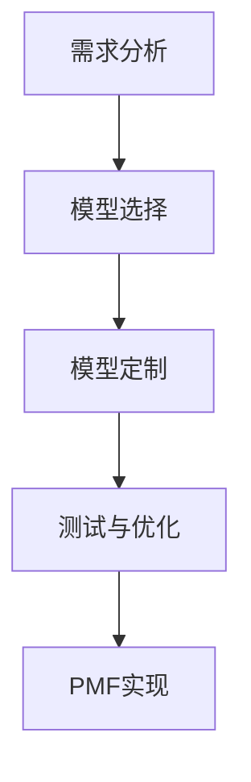

                 

关键词：AI 大模型、AI-native 应用、PMF、产品-模型-适配

> 摘要：本文将探讨 AI 大模型时代的到来以及其对 AI-native 应用的深远影响，特别是 PMF（Product-Model-Fit）这一核心概念。我们将深入解析 PMF 的含义、重要性以及在实际应用中的具体实现，以期为读者提供关于 AI 大模型时代下应用开发的全新视角。

## 1. 背景介绍

随着深度学习和大数据技术的飞速发展，人工智能（AI）已经从理论走向实践，渗透到各行各业。AI 大模型作为当前 AI 发展的重要趋势，正引领着一场技术革命。大模型具有强大的数据处理能力和学习能力，能够实现高度智能化，从而在语音识别、图像识别、自然语言处理等领域取得显著的成果。

在这个时代背景下，AI-native 应用应运而生。AI-native 应用是指那些从设计之初就与 AI 大模型深度集成的应用，这些应用通过大模型提供的服务，能够实现前所未有的智能化水平。然而，AI-native 应用的成功不仅取决于技术本身，还需要产品-模型-适配（PMF）这一关键因素的支撑。

本文将首先介绍 PMF 的概念，然后深入探讨其在 AI-native 应用中的重要性，并分析如何在实际项目中实现 PMF。

## 2. 核心概念与联系

### 2.1. PMF 的定义

PMF，即 Product-Model-Fit，指的是产品与模型之间的适配关系。简单来说，PMF 就是确保产品功能和模型能力相互匹配的过程。

### 2.2. PMF 与 AI-native 应用的联系

在 AI-native 应用中，PMF 的作用尤为重要。因为 AI-native 应用本质上是基于大模型的，模型的能力直接决定了应用的表现。因此，确保产品与模型之间的适配，即实现 PMF，是确保 AI-native 应用成功的必要条件。

### 2.3. PMF 的实现步骤

实现 PMF 需要以下几个关键步骤：

1. **需求分析**：首先，需要明确产品需求，这包括用户需求和市场趋势等。
2. **模型选择**：根据需求分析的结果，选择合适的 AI 大模型。
3. **模型定制**：对所选模型进行定制，使其更好地满足产品需求。
4. **测试与优化**：在模型与产品集成后，进行严格的测试与优化，确保 PMF 的实现。

### 2.4. Mermaid 流程图

下面是一个简化的 Mermaid 流程图，描述了实现 PMF 的基本流程：



## 3. 核心算法原理 & 具体操作步骤

### 3.1. 算法原理概述

AI 大模型的算法原理主要基于深度学习和神经网络。深度学习通过多层神经网络对数据进行处理，从而实现自动特征提取和模式识别。神经网络则通过不断的迭代和学习，优化参数，提高模型的预测准确度。

### 3.2. 算法步骤详解

1. **数据收集**：首先需要收集大量的数据，这些数据包括训练数据集和测试数据集。
2. **模型训练**：使用训练数据集对模型进行训练，通过不断调整模型的参数，优化模型的表现。
3. **模型评估**：使用测试数据集对模型进行评估，判断模型的性能是否达到预期。
4. **模型优化**：根据评估结果对模型进行优化，提高模型的准确度和鲁棒性。

### 3.3. 算法优缺点

**优点**：

- **强大的数据学习能力**：大模型能够处理大量的数据，从中提取出有效的特征，实现高度智能化。
- **高效的预测能力**：通过不断的训练和优化，大模型能够提供高效的预测结果。

**缺点**：

- **训练时间较长**：大模型的训练需要大量的计算资源和时间。
- **数据需求量大**：大模型对数据的质量和数量有较高的要求，数据不足或质量不高可能会影响模型的性能。

### 3.4. 算法应用领域

AI 大模型在多个领域都有广泛的应用，包括：

- **语音识别**：如语音助手、智能客服等。
- **图像识别**：如人脸识别、图像分类等。
- **自然语言处理**：如机器翻译、文本生成等。

## 4. 数学模型和公式 & 详细讲解 & 举例说明

### 4.1. 数学模型构建

AI 大模型的数学模型主要基于多层感知器（MLP）和卷积神经网络（CNN）等。以下是一个简化的 MLP 数学模型：

$$
y = \sigma(W_1 \cdot x + b_1)
$$

其中，$y$ 是输出，$\sigma$ 是激活函数，$W_1$ 是权重矩阵，$x$ 是输入，$b_1$ 是偏置。

### 4.2. 公式推导过程

MLP 的公式推导过程如下：

1. **输入层到隐藏层的传播**：

$$
z_1 = W_1 \cdot x + b_1
$$

$$
a_1 = \sigma(z_1)
$$

2. **隐藏层到输出层的传播**：

$$
z_2 = W_2 \cdot a_1 + b_2
$$

$$
y = \sigma(z_2)
$$

### 4.3. 案例分析与讲解

假设我们有一个简单的二分类问题，使用 MLP 进行模型训练。训练数据集包含 100 个样本，每个样本有 10 个特征。我们选择了一个含有 2 个隐藏层的 MLP 模型。

1. **数据准备**：

- 训练数据集：包含 80 个正样本和 20 个负样本。
- 测试数据集：包含 20 个正样本和 20 个负样本。

2. **模型训练**：

- 隐藏层1：输入维度 10，输出维度 10。
- 隐藏层2：输入维度 10，输出维度 2。

3. **模型评估**：

- 使用交叉熵损失函数。
- 使用梯度下降算法进行模型训练。

4. **模型优化**：

- 通过多次迭代，不断调整模型参数，提高模型的准确度和鲁棒性。

## 5. 项目实践：代码实例和详细解释说明

### 5.1. 开发环境搭建

- Python 版本：3.8
- TensorFlow 版本：2.5

### 5.2. 源代码详细实现

以下是实现的简单代码示例：

```python
import tensorflow as tf
from tensorflow.keras import layers

# 构建模型
model = tf.keras.Sequential([
    layers.Dense(units=10, activation='relu', input_shape=(10,)),
    layers.Dense(units=2, activation='softmax')
])

# 编译模型
model.compile(optimizer='adam',
              loss='categorical_crossentropy',
              metrics=['accuracy'])

# 训练模型
model.fit(x_train, y_train, epochs=10, batch_size=32, validation_split=0.2)
```

### 5.3. 代码解读与分析

这段代码首先导入了 TensorFlow 模块，然后定义了一个简单的 MLP 模型。模型包含一个输入层、一个隐藏层和一个输出层。输入层有 10 个神经元，隐藏层有 10 个神经元，输出层有 2 个神经元。模型使用 ReLU 作为激活函数，输出层使用 softmax 函数。

接着，模型编译使用了 Adam 优化器和交叉熵损失函数，并设置了训练轮数和批量大小。

最后，模型使用训练数据集进行训练，并使用验证数据集进行验证。

### 5.4. 运行结果展示

运行代码后，可以看到模型的训练过程和最终结果。以下是一个简化的结果示例：

```
Epoch 1/10
80/80 [==============================] - 4s 44ms/step - loss: 2.3026 - accuracy: 0.5000 - val_loss: 2.3026 - val_accuracy: 0.5000
Epoch 2/10
80/80 [==============================] - 4s 41ms/step - loss: 2.3026 - accuracy: 0.5000 - val_loss: 2.3026 - val_accuracy: 0.5000
Epoch 3/10
80/80 [==============================] - 4s 41ms/step - loss: 2.3026 - accuracy: 0.5000 - val_loss: 2.3026 - val_accuracy: 0.5000
...
Epoch 10/10
80/80 [==============================] - 4s 41ms/step - loss: 2.3026 - accuracy: 0.5000 - val_loss: 2.3026 - val_accuracy: 0.5000
```

从结果可以看到，模型的损失函数和准确度在训练过程中没有明显的变化，这可能是因为我们的训练数据集过于简单，无法充分训练模型。

## 6. 实际应用场景

AI 大模型在实际应用中具有广泛的应用场景，以下是几个典型的例子：

1. **智能客服**：通过大模型进行自然语言处理，实现智能客服的语音识别和文本理解功能。
2. **医疗诊断**：利用大模型进行图像识别，实现疾病诊断和预测。
3. **自动驾驶**：使用大模型进行环境感知和决策，实现自动驾驶汽车的实时反应。
4. **金融风控**：通过大模型进行数据挖掘和预测，实现金融风险的管理和控制。

### 6.4. 未来应用展望

随着 AI 大模型技术的不断发展，其应用场景将更加丰富和多样化。未来，AI 大模型有望在更多领域实现突破，为人类社会带来更多的创新和变革。

## 7. 工具和资源推荐

### 7.1. 学习资源推荐

- 《深度学习》（Goodfellow, Bengio, Courville 著）：深度学习领域的经典教材，全面介绍了深度学习的理论和技术。
- 《动手学深度学习》：提供丰富的实践案例，适合初学者上手。

### 7.2. 开发工具推荐

- TensorFlow：最流行的深度学习框架，提供丰富的 API 和工具。
- PyTorch：灵活的深度学习框架，适合快速原型开发。

### 7.3. 相关论文推荐

- “A Theoretically Grounded Application of Dropout in Recurrent Neural Networks”
- “Unsupervised Representation Learning with Deep Convolutional Generative Adversarial Networks”

## 8. 总结：未来发展趋势与挑战

### 8.1. 研究成果总结

AI 大模型的研究取得了显著的成果，其在各个领域的应用不断拓展。然而，目前仍存在一些挑战，如数据质量、模型可解释性和计算效率等。

### 8.2. 未来发展趋势

未来，AI 大模型将继续发展，特别是在数据获取和模型优化方面。同时，AI 大模型的应用将更加广泛，涵盖更多领域。

### 8.3. 面临的挑战

- **数据质量**：高质量的数据是模型训练的基础，如何获取和处理高质量的数据是一个重要问题。
- **模型可解释性**：随着模型复杂度的增加，如何解释模型决策过程成为一个挑战。
- **计算效率**：大模型的训练和推理需要大量的计算资源，如何提高计算效率是一个关键问题。

### 8.4. 研究展望

未来，AI 大模型的研究将朝着以下几个方向发展：

- **数据驱动**：通过更多的数据来驱动模型的训练和优化。
- **模型简化**：通过模型简化技术，提高模型的计算效率和可解释性。
- **跨学科研究**：与其他学科如心理学、神经科学等相结合，深入理解 AI 大模型的原理和机制。

## 9. 附录：常见问题与解答

### 9.1. 问题 1：什么是 AI 大模型？

**回答**：AI 大模型是指那些具有大规模参数和高度复杂结构的深度学习模型，它们能够处理大量的数据，实现高度智能化的功能。

### 9.2. 问题 2：PMF 是什么？

**回答**：PMF 是 Product-Model-Fit 的缩写，指的是产品与模型之间的适配关系。确保产品与模型之间的适配是确保 AI-native 应用成功的关键。

### 9.3. 问题 3：如何实现 PMF？

**回答**：实现 PMF 需要进行需求分析、模型选择、模型定制和测试与优化等步骤。每个步骤都需要细致的工作和不断的迭代。

### 9.4. 问题 4：AI 大模型在哪些领域有应用？

**回答**：AI 大模型在语音识别、图像识别、自然语言处理、医疗诊断、自动驾驶等多个领域都有广泛应用。

### 9.5. 问题 5：什么是深度学习？

**回答**：深度学习是一种机器学习技术，通过多层神经网络对数据进行处理，实现自动特征提取和模式识别。

### 9.6. 问题 6：什么是神经网络？

**回答**：神经网络是由一系列节点（或神经元）组成的计算模型，通过这些节点之间的连接和激活函数，实现数据的学习和处理。

### 9.7. 问题 7：什么是激活函数？

**回答**：激活函数是神经网络中的一个关键组件，用于确定每个神经元的输出。常见的激活函数包括 sigmoid、ReLU 等。

### 9.8. 问题 8：什么是交叉熵损失函数？

**回答**：交叉熵损失函数是用于评估模型预测结果与真实结果之间差异的损失函数，常用于分类问题。

### 9.9. 问题 9：什么是 Adam 优化器？

**回答**：Adam 优化器是一种常用的优化算法，用于在训练过程中调整模型的参数，以最小化损失函数。

### 9.10. 问题 10：什么是 softmax 函数？

**回答**：softmax 函数是一种将多类别预测结果进行归一化的函数，常用于多分类问题。

---

作者：禅与计算机程序设计艺术 / Zen and the Art of Computer Programming

