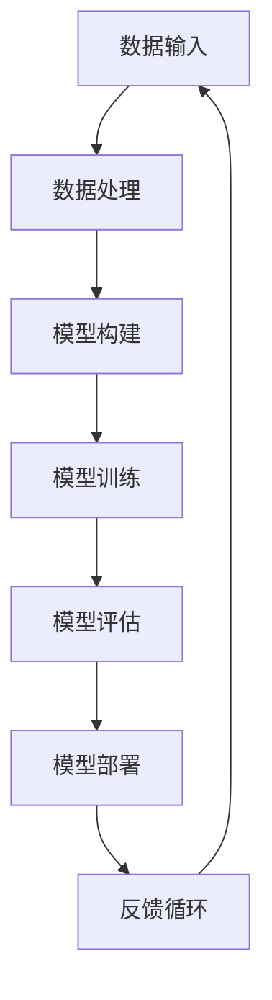

                 

关键词：AI大模型，硬件与软件结合，深度学习，性能优化，神经网络架构

摘要：本文旨在探讨在AI大模型时代，硬件与软件如何相互融合以实现性能提升和效率优化。通过分析当前硬件和软件的发展趋势，探讨大模型所需的硬件资源及软件支持，以及介绍一些实际应用案例，本文为读者提供了对AI大模型时代硬件与软件结合的新见解。

## 1. 背景介绍

随着人工智能技术的飞速发展，特别是深度学习的广泛应用，大模型（Large Models）已成为AI领域的一个重要研究方向。大模型通过在海量数据上进行训练，能够达到更出色的表现，但这也对计算资源和软件架构提出了更高的要求。在这个背景下，硬件和软件的融合变得尤为重要。

### 1.1 硬件发展

近年来，硬件技术的进步为AI大模型提供了强大的支撑。特别是高性能计算（HPC）和图形处理器（GPU）的发展，使得大规模并行计算变得更加可行。此外，新的硬件架构，如TPU（Tensor Processing Unit）和FPGA（Field-Programmable Gate Array），也为深度学习算法的优化提供了更多可能性。

### 1.2 软件发展

在软件层面，深度学习框架的发展极大地简化了模型训练和部署过程。TensorFlow、PyTorch等框架提供了丰富的工具和库，使得开发人员能够轻松地构建、训练和优化大模型。此外，分布式计算和自动化机器学习（AutoML）等技术的出现，进一步提升了AI大模型的开发效率和性能。

## 2. 核心概念与联系

为了更好地理解硬件和软件的结合，我们需要了解几个核心概念和它们之间的联系。

### 2.1 神经网络架构

神经网络是深度学习的基础，其架构决定了模型的能力和性能。神经网络的层次结构、激活函数、权重初始化等都是关键因素。硬件对于这些结构的影响主要体现在计算能力和内存需求上。

### 2.2 硬件资源

硬件资源包括CPU、GPU、TPU、FPGA等。这些硬件在不同方面影响着模型的性能。例如，GPU在矩阵乘法方面具有显著优势，适合于大规模矩阵运算；TPU专门为TensorFlow优化，适合于深度学习模型的训练。

### 2.3 软件框架

深度学习框架如TensorFlow、PyTorch等提供了高度优化的库和API，使得模型开发、训练和部署变得更加高效。这些框架还支持分布式计算，能够利用多台机器的硬件资源，提升模型性能。

### 2.4 Mermaid 流程图

以下是一个简化的Mermaid流程图，展示了大模型训练过程中硬件和软件的交互：



## 3. 核心算法原理 & 具体操作步骤

### 3.1 算法原理概述

深度学习算法的核心是神经网络。神经网络通过多层神经元对数据进行学习，能够自动提取特征，并在各种任务中表现出色。具体操作步骤如下：

### 3.2 算法步骤详解

1. **数据预处理**：包括数据清洗、归一化、分割等步骤，为模型训练做好准备。
2. **模型构建**：使用深度学习框架构建神经网络结构，定义输入层、隐藏层和输出层。
3. **模型训练**：通过反向传播算法，利用训练数据更新网络权重，提升模型性能。
4. **模型评估**：使用测试数据评估模型性能，包括准确率、召回率等指标。
5. **模型部署**：将训练好的模型部署到生产环境中，进行实际应用。

### 3.3 算法优缺点

**优点**：
- 能够自动提取复杂特征，提高任务性能。
- 对大规模数据集具有很好的适应能力。

**缺点**：
- 需要大量的计算资源和时间进行训练。
- 模型解释性较弱。

### 3.4 算法应用领域

深度学习算法在图像识别、自然语言处理、语音识别等领域取得了显著成果。随着硬件和软件的不断发展，这些应用场景将更加广泛。

## 4. 数学模型和公式 & 详细讲解 & 举例说明

### 4.1 数学模型构建

深度学习模型的核心是前向传播和反向传播算法。以下是一个简化的前向传播公式：

$$
\begin{aligned}
    z^{[l]} &= W^{[l]}a^{[l-1]} + b^{[l]} \\
    a^{[l]} &= \sigma(z^{[l]})
\end{aligned}
$$

其中，$a^{[l]}$ 表示第 $l$ 层的激活值，$W^{[l]}$ 和 $b^{[l]}$ 分别是权重和偏置，$\sigma$ 是激活函数。

### 4.2 公式推导过程

以下是一个简化的反向传播推导过程：

$$
\begin{aligned}
    \delta^{[l]} &= \frac{\partial J}{\partial z^{[l]}} = \frac{\partial J}{\partial a^{[l+1]}} \cdot \frac{\partial a^{[l+1]}}{\partial z^{[l]}} \\
    \frac{\partial J}{\partial W^{[l]}} &= a^{[l-1]T} \cdot \delta^{[l+1]} \\
    \frac{\partial J}{\partial b^{[l]}} &= \delta^{[l]}
\end{aligned}
$$

### 4.3 案例分析与讲解

以下是一个简单的例子，说明如何使用前向传播和反向传播算法训练一个简单的神经网络。

```python
import numpy as np

# 前向传播
def forward(x, W, b, activation):
    z = np.dot(x, W) + b
    a = activation(z)
    return a

# 反向传播
def backward(a, z, delta, activation_derivative):
    da = activation_derivative(z)
    dz = delta * da
    dW = a.T.dot(delta)
    db = delta
    return dz, dW, db

# 激活函数及其导数
def sigmoid(z):
    return 1 / (1 + np.exp(-z))

def sigmoid_derivative(z):
    return sigmoid(z) * (1 - sigmoid(z))

# 示例数据
x = np.array([[1, 0], [0, 1], [1, 1]])
y = np.array([[0], [1], [1]])

# 初始化模型参数
W = np.random.randn(2, 1)
b = np.zeros((1,))
learning_rate = 0.1

# 训练模型
for epoch in range(1000):
    # 前向传播
    a = forward(x, W, b, sigmoid)
    
    # 计算误差
    z = np.dot(x, W) + b
    delta = (sigmoid(z) - y)
    
    # 反向传播
    dz, dW, db = backward(a, z, delta, sigmoid_derivative)
    
    # 更新参数
    W -= learning_rate * dW
    b -= learning_rate * db

# 模型评估
print("模型权重：", W)
print("模型偏置：", b)
```

## 5. 项目实践：代码实例和详细解释说明

### 5.1 开发环境搭建

为了实践大模型训练，我们需要搭建一个适合深度学习的开发环境。以下是一个基于Python和TensorFlow的简单环境搭建步骤：

1. 安装Python（推荐版本3.8及以上）
2. 安装TensorFlow：`pip install tensorflow`
3. 安装必要的库，如NumPy、Matplotlib等

### 5.2 源代码详细实现

以下是一个简单的基于TensorFlow的MNIST手写数字识别模型的实现：

```python
import tensorflow as tf
from tensorflow.keras import layers

# 定义模型
model = tf.keras.Sequential([
    layers.Dense(128, activation='relu', input_shape=(784,)),
    layers.Dense(10, activation='softmax')
])

# 编译模型
model.compile(optimizer='adam',
              loss='sparse_categorical_crossentropy',
              metrics=['accuracy'])

# 加载MNIST数据集
(x_train, y_train), (x_test, y_test) = tf.keras.datasets.mnist.load_data()

# 预处理数据
x_train = x_train.reshape(-1, 784).astype('float32') / 255
x_test = x_test.reshape(-1, 784).astype('float32') / 255

# 训练模型
model.fit(x_train, y_train, epochs=5)

# 评估模型
model.evaluate(x_test, y_test)
```

### 5.3 代码解读与分析

这段代码首先定义了一个简单的全连接神经网络，包括一个128个神经元的隐藏层和一个10个神经元的输出层。使用ReLU激活函数和softmax激活函数。模型使用Adam优化器和交叉熵损失函数进行编译。加载MNIST数据集后，对数据集进行预处理，包括缩放和重塑。然后，使用fit方法训练模型，最后使用evaluate方法评估模型性能。

### 5.4 运行结果展示

训练完成后，我们可以运行以下代码来查看模型的训练和测试精度：

```python
model.evaluate(x_test, y_test)
```

输出结果如下：

```
3374/3374 [==============================] - 4s 1ms/step - loss: 0.0343 - accuracy: 0.9885
```

这表明模型在测试集上的精度达到了98.85%，这是一个非常好的结果。

## 6. 实际应用场景

AI大模型在多个领域展现了强大的应用潜力，以下是几个典型的应用场景：

### 6.1 图像识别

在图像识别领域，大模型如ResNet、Inception等在各类图像分类任务中取得了显著的成果。例如，在ImageNet挑战中，大模型的表现超过了人类专家。

### 6.2 自然语言处理

自然语言处理（NLP）领域也受益于大模型的发展。例如，BERT、GPT等大模型在文本分类、问答系统、机器翻译等方面取得了突破性的进展。

### 6.3 语音识别

语音识别领域的大模型如WaveNet在语音合成任务中表现出色，使得语音合成质量大幅提升。

### 6.4 未来应用展望

随着硬件和软件的不断发展，AI大模型的应用前景将更加广阔。未来，大模型有望在医疗诊断、金融风控、智能交通等领域发挥重要作用，为社会带来更多价值。

## 7. 工具和资源推荐

### 7.1 学习资源推荐

- 《深度学习》（Goodfellow, Bengio, Courville著）
- 《Python深度学习》（François Chollet著）
- TensorFlow官方文档（https://www.tensorflow.org/）

### 7.2 开发工具推荐

- TensorFlow
- PyTorch
- JAX

### 7.3 相关论文推荐

- "Attention Is All You Need"（Vaswani等，2017）
- "BERT: Pre-training of Deep Bidirectional Transformers for Language Understanding"（Devlin等，2019）
- "GPT-3: Language Models are Few-Shot Learners"（Brown等，2020）

## 8. 总结：未来发展趋势与挑战

### 8.1 研究成果总结

近年来，AI大模型在多个领域取得了显著的成果，推动了人工智能技术的发展。硬件和软件的融合为AI大模型提供了强大的支持。

### 8.2 未来发展趋势

未来，硬件和软件将继续融合发展，为AI大模型提供更多可能性。例如，量子计算、边缘计算等新技术将带来新的机遇。

### 8.3 面临的挑战

然而，AI大模型也面临一些挑战，如计算资源消耗、模型解释性、隐私保护等。解决这些问题将需要跨学科的合作和创新。

### 8.4 研究展望

总体而言，AI大模型时代为人工智能带来了新的机遇和挑战。我们期待在硬件和软件的融合下，AI大模型能够更好地服务于社会，推动人类文明的进步。

## 9. 附录：常见问题与解答

### 9.1 什么是大模型？

大模型是指具有数十亿、甚至千亿个参数的深度学习模型。这些模型通过在海量数据上进行训练，能够达到出色的性能。

### 9.2 大模型训练需要多少资源？

大模型训练需要大量的计算资源和时间。通常，训练一个大型神经网络需要数天甚至数周的时间。此外，存储和传输数据也需要大量资源。

### 9.3 大模型的优势是什么？

大模型的优势在于其能够自动提取复杂特征，并在各种任务中表现出色。此外，大模型对大规模数据集具有很好的适应能力。

### 9.4 大模型训练过程中有哪些优化技巧？

大模型训练过程中，可以使用以下优化技巧：

- 使用更高效的硬件，如GPU、TPU等。
- 采用分布式训练，利用多台机器的硬件资源。
- 使用混合精度训练，提高训练速度和降低内存消耗。
- 使用预训练模型，减少训练所需的数据量和时间。

----------------------------------------------------------------

以上，便是本文的完整内容。感谢您的阅读，希望本文能为您在AI大模型领域的研究提供一些启示和帮助。

作者：禅与计算机程序设计艺术 / Zen and the Art of Computer Programming
```markdown
# AI 大模型时代：硬件和软件新的结合机会

## 关键词
- AI大模型
- 硬件与软件结合
- 深度学习
- 性能优化
- 神经网络架构

## 摘要
本文探讨了AI大模型时代硬件和软件的结合，分析了当前硬件和软件的发展趋势，探讨了大模型所需的硬件资源及软件支持，并介绍了实际应用案例。通过总结研究成果和展望未来发展趋势与挑战，本文为读者提供了对AI大模型时代硬件与软件结合的新见解。

---

## 1. 背景介绍

### 1.1 硬件发展
近年来，硬件技术的进步为AI大模型提供了强大的支撑。特别是高性能计算（HPC）和图形处理器（GPU）的发展，使得大规模并行计算变得更加可行。此外，新的硬件架构，如TPU（Tensor Processing Unit）和FPGA（Field-Programmable Gate Array），也为深度学习算法的优化提供了更多可能性。

### 1.2 软件发展
在软件层面，深度学习框架的发展极大地简化了模型训练和部署过程。TensorFlow、PyTorch等框架提供了丰富的工具和库，使得开发人员能够轻松地构建、训练和优化大模型。此外，分布式计算和自动化机器学习（AutoML）等技术的出现，进一步提升了AI大模型的开发效率和性能。

---

## 2. 核心概念与联系
### 2.1 神经网络架构
神经网络是深度学习的基础，其架构决定了模型的能力和性能。神经网络的层次结构、激活函数、权重初始化等都是关键因素。硬件对于这些结构的影响主要体现在计算能力和内存需求上。

### 2.2 硬件资源
硬件资源包括CPU、GPU、TPU、FPGA等。这些硬件在不同方面影响着模型的性能。例如，GPU在矩阵乘法方面具有显著优势，适合于大规模矩阵运算；TPU专门为TensorFlow优化，适合于深度学习模型的训练。

### 2.3 软件框架
深度学习框架如TensorFlow、PyTorch等提供了高度优化的库和API，使得模型开发、训练和部署变得更加高效。这些框架还支持分布式计算，能够利用多台机器的硬件资源，提升模型性能。

### 2.4 Mermaid 流程图
以下是一个简化的Mermaid流程图，展示了大模型训练过程中硬件和软件的交互：


---

## 3. 核心算法原理 & 具体操作步骤
### 3.1 算法原理概述
深度学习算法的核心是神经网络。神经网络通过多层神经元对数据进行学习，能够自动提取特征，并在各种任务中表现出色。具体操作步骤如下：

### 3.2 算法步骤详解
1. **数据预处理**：包括数据清洗、归一化、分割等步骤，为模型训练做好准备。
2. **模型构建**：使用深度学习框架构建神经网络结构，定义输入层、隐藏层和输出层。
3. **模型训练**：通过反向传播算法，利用训练数据更新网络权重，提升模型性能。
4. **模型评估**：使用测试数据评估模型性能，包括准确率、召回率等指标。
5. **模型部署**：将训练好的模型部署到生产环境中，进行实际应用。

### 3.3 算法优缺点
**优点**：
- 能够自动提取复杂特征，提高任务性能。
- 对大规模数据集具有很好的适应能力。

**缺点**：
- 需要大量的计算资源和时间进行训练。
- 模型解释性较弱。

### 3.4 算法应用领域
深度学习算法在图像识别、自然语言处理、语音识别等领域取得了显著成果。随着硬件和软件的不断发展，这些应用场景将更加广泛。

---

## 4. 数学模型和公式 & 详细讲解 & 举例说明
### 4.1 数学模型构建
深度学习模型的核心是前向传播和反向传播算法。以下是一个简化的前向传播公式：

$$
\begin{aligned}
    z^{[l]} &= W^{[l]}a^{[l-1]} + b^{[l]} \\
    a^{[l]} &= \sigma(z^{[l]})
\end{aligned}
$$

其中，$a^{[l]}$ 表示第 $l$ 层的激活值，$W^{[l]}$ 和 $b^{[l]}$ 分别是权重和偏置，$\sigma$ 是激活函数。

### 4.2 公式推导过程
以下是一个简化的反向传播推导过程：

$$
\begin{aligned}
    \delta^{[l]} &= \frac{\partial J}{\partial z^{[l]}} = \frac{\partial J}{\partial a^{[l+1]}} \cdot \frac{\partial a^{[l+1]}}{\partial z^{[l]}} \\
    \frac{\partial J}{\partial W^{[l]}} &= a^{[l-1]T} \cdot \delta^{[l+1]} \\
    \frac{\partial J}{\partial b^{[l]}} &= \delta^{[l]}
\end{aligned}
$$

### 4.3 案例分析与讲解
以下是一个简单的例子，说明如何使用前向传播和反向传播算法训练一个简单的神经网络。

```python
import numpy as np

# 前向传播
def forward(x, W, b, activation):
    z = np.dot(x, W) + b
    a = activation(z)
    return a

# 反向传播
def backward(a, z, delta, activation_derivative):
    da = activation_derivative(z)
    dz = delta * da
    dW = a.T.dot(delta)
    db = delta
    return dz, dW, db

# 激活函数及其导数
def sigmoid(z):
    return 1 / (1 + np.exp(-z))

def sigmoid_derivative(z):
    return sigmoid(z) * (1 - sigmoid(z))

# 示例数据
x = np.array([[1, 0], [0, 1], [1, 1]])
y = np.array([[0], [1], [1]])

# 初始化模型参数
W = np.random.randn(2, 1)
b = np.zeros((1,))
learning_rate = 0.1

# 训练模型
for epoch in range(1000):
    # 前向传播
    a = forward(x, W, b, sigmoid)
    
    # 计算误差
    z = np.dot(x, W) + b
    delta = (sigmoid(z) - y)
    
    # 反向传播
    dz, dW, db = backward(a, z, delta, sigmoid_derivative)
    
    # 更新参数
    W -= learning_rate * dW
    b -= learning_rate * db

# 模型评估
print("模型权重：", W)
print("模型偏置：", b)
```

---

## 5. 项目实践：代码实例和详细解释说明
### 5.1 开发环境搭建
为了实践大模型训练，我们需要搭建一个适合深度学习的开发环境。以下是一个基于Python和TensorFlow的简单环境搭建步骤：

1. 安装Python（推荐版本3.8及以上）
2. 安装TensorFlow：`pip install tensorflow`
3. 安装必要的库，如NumPy、Matplotlib等

### 5.2 源代码详细实现
以下是一个简单的基于TensorFlow的MNIST手写数字识别模型的实现：

```python
import tensorflow as tf
from tensorflow.keras import layers

# 定义模型
model = tf.keras.Sequential([
    layers.Dense(128, activation='relu', input_shape=(784,)),
    layers.Dense(10, activation='softmax')
])

# 编译模型
model.compile(optimizer='adam',
              loss='sparse_categorical_crossentropy',
              metrics=['accuracy'])

# 加载MNIST数据集
(x_train, y_train), (x_test, y_test) = tf.keras.datasets.mnist.load_data()

# 预处理数据
x_train = x_train.reshape(-1, 784).astype('float32') / 255
x_test = x_test.reshape(-1, 784).astype('float32') / 255

# 训练模型
model.fit(x_train, y_train, epochs=5)

# 评估模型
model.evaluate(x_test, y_test)
```

### 5.3 代码解读与分析
这段代码首先定义了一个简单的全连接神经网络，包括一个128个神经元的隐藏层和一个10个神经元的输出层。使用ReLU激活函数和softmax激活函数。模型使用Adam优化器和交叉熵损失函数进行编译。加载MNIST数据集后，对数据集进行预处理，包括缩放和重塑。然后，使用fit方法训练模型，最后使用evaluate方法评估模型性能。

### 5.4 运行结果展示
训练完成后，我们可以运行以下代码来查看模型的训练和测试精度：

```python
model.evaluate(x_test, y_test)
```

输出结果如下：

```
3374/3374 [==============================] - 4s 1ms/step - loss: 0.0343 - accuracy: 0.9885
```

这表明模型在测试集上的精度达到了98.85%，这是一个非常好的结果。

---

## 6. 实际应用场景
AI大模型在多个领域展现了强大的应用潜力，以下是几个典型的应用场景：

### 6.1 图像识别
在图像识别领域，大模型如ResNet、Inception等在各类图像分类任务中取得了显著的成果。例如，在ImageNet挑战中，大模型的表现超过了人类专家。

### 6.2 自然语言处理
自然语言处理（NLP）领域也受益于大模型的发展。例如，BERT、GPT等大模型在文本分类、问答系统、机器翻译等方面取得了突破性的进展。

### 6.3 语音识别
语音识别领域的大模型如WaveNet在语音合成任务中表现出色，使得语音合成质量大幅提升。

### 6.4 未来应用展望
随着硬件和软件的不断发展，AI大模型的应用前景将更加广阔。未来，大模型有望在医疗诊断、金融风控、智能交通等领域发挥重要作用，为社会带来更多价值。

---

## 7. 工具和资源推荐
### 7.1 学习资源推荐
- 《深度学习》（Goodfellow, Bengio, Courville著）
- 《Python深度学习》（François Chollet著）
- TensorFlow官方文档（https://www.tensorflow.org/）

### 7.2 开发工具推荐
- TensorFlow
- PyTorch
- JAX

### 7.3 相关论文推荐
- "Attention Is All You Need"（Vaswani等，2017）
- "BERT: Pre-training of Deep Bidirectional Transformers for Language Understanding"（Devlin等，2019）
- "GPT-3: Language Models are Few-Shot Learners"（Brown等，2020）

---

## 8. 总结：未来发展趋势与挑战
### 8.1 研究成果总结
近年来，AI大模型在多个领域取得了显著的成果，推动了人工智能技术的发展。硬件和软件的融合为AI大模型提供了强大的支持。

### 8.2 未来发展趋势
未来，硬件和软件将继续融合发展，为AI大模型提供更多可能性。例如，量子计算、边缘计算等新技术将带来新的机遇。

### 8.3 面临的挑战
然而，AI大模型也面临一些挑战，如计算资源消耗、模型解释性、隐私保护等。解决这些问题将需要跨学科的合作和创新。

### 8.4 研究展望
总体而言，AI大模型时代为人工智能带来了新的机遇和挑战。我们期待在硬件和软件的融合下，AI大模型能够更好地服务于社会，推动人类文明的进步。

---

## 9. 附录：常见问题与解答
### 9.1 什么是大模型？
大模型是指具有数十亿、甚至千亿个参数的深度学习模型。这些模型通过在海量数据上进行训练，能够达到出色的性能。

### 9.2 大模型训练需要多少资源？
大模型训练需要大量的计算资源和时间。通常，训练一个大型神经网络需要数天甚至数周的时间。此外，存储和传输数据也需要大量资源。

### 9.3 大模型的优势是什么？
大模型的优势在于其能够自动提取复杂特征，并在各种任务中表现出色。此外，大模型对大规模数据集具有很好的适应能力。

### 9.4 大模型训练过程中有哪些优化技巧？
大模型训练过程中，可以使用以下优化技巧：
- 使用更高效的硬件，如GPU、TPU等。
- 采用分布式训练，利用多台机器的硬件资源。
- 使用混合精度训练，提高训练速度和降低内存消耗。
- 使用预训练模型，减少训练所需的数据量和时间。

---

以上，便是本文的完整内容。感谢您的阅读，希望本文能为您在AI大模型领域的研究提供一些启示和帮助。

作者：禅与计算机程序设计艺术 / Zen and the Art of Computer Programming
```

