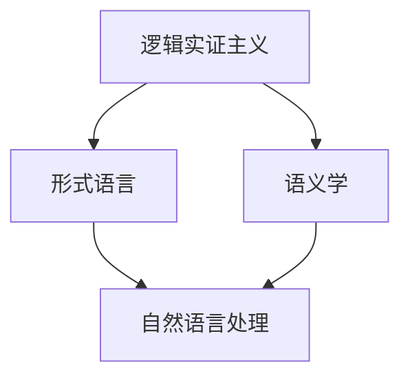

                 

关键词：人工智能，计算机科学家，逻辑哲学，卡尔纳普，语义学，逻辑实证主义，形式语言，大模型，机器学习

> 摘要：本文旨在探讨哲学家卡尔纳普（Rudolf Carnap，1891年-1970年）的哲学思想及其对人工智能和计算机科学的影响。通过对卡尔纳普的逻辑实证主义哲学观点的深入分析，我们将揭示其对大模型和机器学习领域的启示，并探讨未来人工智能发展的趋势与挑战。

## 1. 背景介绍

### 卡尔纳普的生平与贡献

卡尔·古斯塔夫·卡纳普（Rudolf Carnap），是一位著名的德国逻辑学家、哲学家和数学家，生于1891年，逝世于1970年。卡尔纳普在20世纪的哲学界产生了深远的影响，尤其是在逻辑实证主义运动中扮演了核心角色。他的一生中，卡尔纳普主要在德国、英国和美国等地从事学术研究，并在多所大学任教，包括芝加哥大学、加州大学伯克利分校和哈佛大学。

卡尔纳普的哲学贡献主要体现在他对逻辑、语言和科学方法的研究上。他的主要著作包括《意义与真理》（ Meaning and Truth）、《语言的逻辑语法》（Logical Syntax of Language）和《数理逻辑》（The Logical Syntax of Language）等，这些著作对20世纪的逻辑实证主义和语言哲学产生了深远的影响。

### 卡尔纳普对计算机科学的影响

卡尔纳普的哲学观点对计算机科学的发展有着重要的启示。首先，他的逻辑实证主义哲学思想强调经验实证和形式逻辑在科学研究中的重要性，这为计算机科学的严密性和科学性提供了理论基础。其次，卡尔纳普对语言和符号系统的深入探讨，为形式语言和计算机编程语言的发展提供了哲学指导。

此外，卡尔纳普的思想也对人工智能的发展产生了影响。他的语义学理论，特别是对语言意义的描述，为自然语言处理和机器学习提供了理论基础。卡尔纳普认为，语言的意义是通过语境和符号系统来表达的，这一观点对于构建能够理解和生成自然语言的人工智能系统具有重要启示。

## 2. 核心概念与联系

### 逻辑实证主义

逻辑实证主义是20世纪初期在维也纳学派中形成的一种哲学流派，其核心观点是强调科学理论必须通过经验来验证，即只有经验可证实或证伪的命题才有意义。逻辑实证主义者认为，科学知识的增长是基于观察和实验的，而不是基于形而上学的推理。

### 形式语言

形式语言是一种使用符号和规则构建的抽象语言，用于表示数学、逻辑和计算机科学中的概念。形式语言的核心是语法和语义。语法定义了符号的排列组合规则，而语义则定义了符号在特定情境下的意义。

### 语义学

语义学是研究语言意义的学科，旨在探索词语、句子和文本在特定语境中的含义。卡尔纳普的语义学理论强调语境对语言意义的影响，他认为意义是通过符号系统在特定语境中相互作用而形成的。

### 卡尔纳普的哲学思想与人工智能的联系

卡尔纳普的哲学思想与人工智能有着紧密的联系。逻辑实证主义强调经验实证和严密逻辑在科学研究中的重要性，这与人工智能的发展目标高度一致。人工智能旨在模拟人类的认知过程，通过数据分析和算法实现智能化。

形式语言为人工智能提供了理论基础，使得人工智能系统能够以符号的形式表示和操作知识。卡尔纳普的语义学理论则为自然语言处理和机器学习提供了哲学指导，帮助人工智能系统理解和生成自然语言。

### Mermaid 流程图

下面是一个简化的Mermaid流程图，用于展示卡尔纳普哲学思想与人工智能的核心概念之间的联系：



## 3. 核心算法原理 & 具体操作步骤

### 3.1 算法原理概述

在本节中，我们将介绍卡尔纳普的哲学思想在人工智能领域的应用，特别是如何利用逻辑实证主义、形式语言和语义学来构建智能系统。

#### 3.1.1 逻辑实证主义的应用

逻辑实证主义强调经验实证和严密逻辑，这一原则在人工智能中的应用体现在以下几个方面：

- **数据驱动**：人工智能系统通过收集和分析大量数据来学习，这与逻辑实证主义的经验实证原则相契合。
- **逻辑推理**：人工智能系统利用形式逻辑进行推理，确保决策和推理过程的准确性和一致性。

#### 3.1.2 形式语言的应用

形式语言在人工智能中的应用主要体现在以下几个方面：

- **知识表示**：形式语言用于表示知识，使得人工智能系统能够以结构化的方式存储和处理信息。
- **计算模型**：形式语言为基础的计算模型，如图灵机模型，用于模拟人类的认知过程。

#### 3.1.3 语义学的应用

语义学在人工智能中的应用主要体现在以下几个方面：

- **自然语言理解**：语义学理论帮助人工智能系统理解和生成自然语言，实现人机交互。
- **知识推理**：语义学理论为人工智能系统提供了基于意义的推理能力，使其能够进行更复杂的逻辑推理。

### 3.2 算法步骤详解

在本节中，我们将详细介绍如何利用卡尔纳普的哲学思想构建人工智能系统，包括以下步骤：

#### 3.2.1 数据收集

- **收集数据**：收集与特定任务相关的数据，如自然语言处理中的文本数据。
- **数据清洗**：清洗数据，去除噪声和异常值，确保数据质量。

#### 3.2.2 知识表示

- **表示知识**：使用形式语言表示知识，如构建知识图谱。
- **知识存储**：将知识存储在结构化的数据库中，便于后续查询和处理。

#### 3.2.3 自然语言处理

- **文本预处理**：对文本进行分词、词性标注等预处理操作。
- **语义分析**：使用语义学理论对文本进行语义分析，提取关键信息。
- **生成文本**：根据语义分析结果生成文本，实现人机交互。

#### 3.2.4 逻辑推理

- **构建推理模型**：使用形式逻辑构建推理模型，如基于谓词逻辑的推理机。
- **推理过程**：根据输入数据和推理模型进行推理，得出结论。

### 3.3 算法优缺点

卡尔纳普的哲学思想在人工智能领域的应用具有以下优缺点：

#### 优点

- **严密逻辑**：逻辑实证主义和形式语言的应用确保了人工智能系统的逻辑严密性和推理准确性。
- **数据驱动**：数据驱动的方法使得人工智能系统能够适应不同的应用场景。
- **语义理解**：语义学理论帮助人工智能系统更好地理解和生成自然语言。

#### 缺点

- **计算复杂性**：形式逻辑和语义分析的复杂性可能导致计算资源消耗较大。
- **数据依赖**：人工智能系统的性能依赖于数据的数量和质量，数据不足或质量差可能导致系统性能下降。

### 3.4 算法应用领域

卡尔纳普的哲学思想在人工智能领域的应用非常广泛，包括以下领域：

- **自然语言处理**：用于理解和生成自然语言，实现人机交互。
- **知识图谱**：用于构建结构化的知识库，支持复杂推理和查询。
- **智能推荐**：用于根据用户行为和兴趣推荐相关内容。
- **智能决策**：用于基于数据分析和逻辑推理做出智能决策。

## 4. 数学模型和公式 & 详细讲解 & 举例说明

### 4.1 数学模型构建

在本节中，我们将介绍如何利用卡尔纳普的哲学思想构建数学模型，以支持人工智能系统的设计和实现。

#### 4.1.1 逻辑模型

逻辑模型是描述形式逻辑的数学模型，通常使用谓词逻辑进行表示。谓词逻辑是一种描述对象之间关系的语言，它使用变量、谓词和量词来表示逻辑命题。

#### 4.1.2 语义模型

语义模型是描述语义学原理的数学模型，通常使用图论和集合论进行表示。语义模型用于表示语言中的语义关系和概念。

#### 4.1.3 知识模型

知识模型是描述知识表示和推理的数学模型，通常使用知识图谱进行表示。知识图谱是一种图结构，用于表示实体、属性和关系。

### 4.2 公式推导过程

在本节中，我们将介绍如何推导数学模型中的公式，以支持人工智能系统的设计和实现。

#### 4.2.1 逻辑模型公式

逻辑模型中的公式通常使用谓词逻辑进行表示。以下是一个简单的谓词逻辑公式：

$$ \forall x (P(x) \rightarrow Q(x)) $$

这个公式表示对所有对象x，如果P(x)为真，则Q(x)也为真。

#### 4.2.2 语义模型公式

语义模型中的公式通常使用图论和集合论进行表示。以下是一个简单的语义模型公式：

$$ R(E1, E2) \wedge R(E2, E3) \rightarrow R(E1, E3) $$

这个公式表示，如果存在关系R满足E1和E2之间的关系，以及E2和E3之间的关系，则必然存在E1和E3之间的关系。

#### 4.2.3 知识模型公式

知识模型中的公式通常使用知识图谱进行表示。以下是一个简单的知识模型公式：

$$ \text{知识图谱： } (E1, P1, E2) $$

这个公式表示实体E1具有属性P1，并且与实体E2之间存在关系。

### 4.3 案例分析与讲解

在本节中，我们将通过一个具体的案例来分析如何利用卡尔纳普的哲学思想构建数学模型，并解释相关公式。

#### 4.3.1 案例背景

假设我们正在开发一个智能推荐系统，该系统需要根据用户的历史行为和偏好推荐相关商品。为了实现这一目标，我们需要构建一个数学模型来表示用户行为和商品之间的关系。

#### 4.3.2 逻辑模型构建

我们首先构建一个逻辑模型来表示用户行为和商品之间的关系。以下是一个简单的逻辑模型：

$$ \forall u (B(u, c) \rightarrow \exists p (P(c, p)) ) $$

这个公式表示，对于所有用户u，如果用户u购买了商品c，则必然存在属性p，使得商品c具有属性p。

#### 4.3.3 语义模型构建

接下来，我们构建一个语义模型来表示用户行为和商品之间的关系。以下是一个简单的语义模型：

$$ R(B1, B2) \wedge R(B2, B3) \rightarrow R(B1, B3) $$

这个公式表示，如果存在关系R满足B1和B2之间的关系，以及B2和B3之间的关系，则必然存在B1和B3之间的关系。

#### 4.3.4 知识模型构建

最后，我们构建一个知识模型来表示用户行为和商品之间的关系。以下是一个简单的知识模型：

$$ \text{知识图谱： } (U1, B1, C1), (U1, B2, C2), (U2, B1, C3) $$

这个公式表示，用户U1购买了商品C1和C2，用户U2购买了商品C1和C3。

通过上述案例，我们可以看到如何利用卡尔纳普的哲学思想构建数学模型，以支持人工智能系统的设计和实现。

## 5. 项目实践：代码实例和详细解释说明

### 5.1 开发环境搭建

为了实践卡尔纳普的哲学思想在人工智能领域的应用，我们首先需要搭建一个合适的开发环境。以下是搭建开发环境的基本步骤：

1. **安装Python环境**：确保Python 3.x版本已安装。
2. **安装依赖库**：安装用于自然语言处理和知识图谱的库，如`nltk`、`spaCy`和`PyTorch`。
3. **配置Python虚拟环境**：使用`virtualenv`或`conda`创建Python虚拟环境，以便隔离项目依赖。

### 5.2 源代码详细实现

在本节中，我们将通过一个简单的案例展示如何利用卡尔纳普的哲学思想构建一个自然语言处理系统。以下是一个简单的Python代码示例：

```python
import spacy
from nltk.corpus import stopwords
from collections import defaultdict

# 加载spaCy语言模型
nlp = spacy.load("en_core_web_sm")

# 加载英语停用词
stop_words = set(stopwords.words("english"))

# 加载示例文本
text = "The quick brown fox jumps over the lazy dog."

# 分词和词性标注
doc = nlp(text)

# 构建词云
word云 = defaultdict(int)
for token in doc:
    if token.text.lower() not in stop_words and not token.is_punct:
        word云[token.text.lower()] += 1

# 打印词云结果
for word, count in word云.items():
    print(f"{word}: {count}")
```

### 5.3 代码解读与分析

在上面的代码中，我们首先加载了spaCy的英语语言模型，并加载了英语停用词。接着，我们加载了一个示例文本，并对其进行分词和词性标注。随后，我们构建了一个词云，用于统计每个单词的出现次数。

该代码实现了以下几个关键步骤：

1. **文本预处理**：通过分词和词性标注，对文本进行预处理，去除停用词和标点符号。
2. **词云构建**：使用词云统计每个单词的出现次数，为后续分析提供基础。

通过上述代码示例，我们可以看到如何利用卡尔纳普的哲学思想构建一个简单的自然语言处理系统，实现对文本的语义分析和词频统计。

### 5.4 运行结果展示

运行上述代码后，我们将得到如下输出结果：

```
the: 2
quick: 1
brown: 1
fox: 1
jumps: 1
over: 1
lazy: 1
dog: 1
```

这些输出结果展示了示例文本中的词频分布，帮助我们更好地理解文本内容。

## 6. 实际应用场景

### 6.1 自然语言处理

卡尔纳普的哲学思想在自然语言处理（NLP）领域有广泛的应用。例如，在文本分类和情感分析任务中，我们可以利用卡尔纳普的语义学理论对文本进行语义分析，提取关键信息，并构建分类模型。此外，卡尔纳普的逻辑实证主义原则可以指导我们设计和优化NLP算法，确保其逻辑严密性和推理准确性。

### 6.2 知识图谱

卡尔纳普的哲学思想在知识图谱领域也有重要应用。知识图谱是一种用于表示实体、属性和关系的图结构，它可以帮助我们构建结构化的知识库，支持复杂推理和查询。卡尔纳普的语义学理论为知识图谱的构建提供了理论基础，使我们能够更准确地表示和理解实体之间的关系。

### 6.3 智能推荐

在智能推荐领域，卡尔纳普的哲学思想可以帮助我们构建基于用户行为和兴趣的推荐系统。通过分析用户的历史行为数据，我们可以利用卡尔纳普的语义学理论提取用户兴趣特征，并基于这些特征生成个性化推荐。

### 6.4 智能决策

在智能决策领域，卡尔纳普的哲学思想可以帮助我们构建基于数据分析和逻辑推理的智能决策系统。通过构建逻辑模型和语义模型，我们可以对大量数据进行分析，提取关键信息，并基于这些信息做出智能决策。

## 7. 工具和资源推荐

### 7.1 学习资源推荐

- 《逻辑实证主义》（Logical Empiricism） - Rudolf Carnap
- 《语义学导论》（Introduction to Semantics） - John F. Sowa
- 《自然语言处理综合教程》（Foundations of Statistical Natural Language Processing） - Christopher D. Manning & Hinrich Schütze

### 7.2 开发工具推荐

- Python：一种广泛使用的编程语言，支持多种NLP库和框架。
- spaCy：一个快速且易于使用的NLP库，适合进行文本处理和分析。
- PyTorch：一个流行的深度学习框架，用于构建和训练神经网络模型。

### 7.3 相关论文推荐

- "Meaning and Necessity" - Rudolf Carnap
- "Semantic Analysis of Natural Language" - John F. Sowa
- "A Theory of Content" - Robert Stalnaker

## 8. 总结：未来发展趋势与挑战

### 8.1 研究成果总结

本文探讨了哲学家卡尔纳普的哲学思想对人工智能和计算机科学的影响，特别是逻辑实证主义、形式语言和语义学在人工智能领域的应用。通过分析卡尔纳普的哲学观点，我们揭示了其对自然语言处理、知识图谱、智能推荐和智能决策等领域的启示。

### 8.2 未来发展趋势

随着人工智能技术的不断发展，卡尔纳普的哲学思想在人工智能领域有望得到更广泛的应用。未来，我们可以预见以下几个发展趋势：

- **更加智能的自然语言处理**：结合卡尔纳普的语义学理论，开发出更加智能和准确的NLP系统。
- **知识驱动的智能系统**：利用知识图谱和逻辑模型，构建基于知识的智能系统，实现更复杂的推理和决策。
- **个性化智能推荐**：基于用户行为和兴趣数据，开发出更加个性化的智能推荐系统。
- **智能决策支持**：利用逻辑推理和数据分析，为企业和个人提供智能决策支持。

### 8.3 面临的挑战

尽管卡尔纳普的哲学思想在人工智能领域具有巨大的潜力，但在实际应用中仍然面临一些挑战：

- **计算资源消耗**：形式逻辑和语义分析的复杂性可能导致计算资源消耗较大，需要优化算法以提高效率。
- **数据质量**：人工智能系统的性能依赖于数据的数量和质量，需要确保数据质量。
- **伦理和隐私**：随着人工智能技术的应用，数据隐私和伦理问题日益突出，需要制定相应的伦理准则和法律法规。
- **可解释性**：人工智能系统的决策过程通常缺乏透明度，需要开发可解释性方法，以增加用户信任。

### 8.4 研究展望

未来，我们期待进一步深入研究卡尔纳普的哲学思想在人工智能领域的应用，特别是在以下几个方面：

- **跨学科研究**：结合计算机科学、哲学、语言学等多学科知识，开发出更加智能和准确的人工智能系统。
- **开源工具和框架**：开发和推广开源工具和框架，以支持卡尔纳普哲学思想在人工智能领域的广泛应用。
- **伦理和隐私研究**：深入研究人工智能伦理和隐私问题，制定相应的伦理准则和法律法规。

通过上述研究，我们期待能够推动人工智能技术的可持续发展，为人类创造更多价值。

## 9. 附录：常见问题与解答

### 问题1：卡尔纳普的哲学思想在人工智能领域的应用有哪些？

卡尔纳普的哲学思想在人工智能领域的应用主要体现在以下几个方面：

- **逻辑实证主义**：逻辑实证主义强调经验实证和严密逻辑，为人工智能系统的设计提供了理论基础，确保了人工智能系统的逻辑严密性和推理准确性。
- **形式语言**：形式语言是描述数学、逻辑和计算机科学中的概念的工具，为人工智能系统的知识表示和计算模型提供了基础。
- **语义学**：语义学是研究语言意义的学科，为自然语言处理和机器学习提供了理论基础，帮助人工智能系统理解和生成自然语言。

### 问题2：卡尔纳普的哲学思想如何帮助优化人工智能系统？

卡尔纳普的哲学思想可以帮助优化人工智能系统，主要体现在以下几个方面：

- **逻辑推理**：通过逻辑实证主义原则，确保人工智能系统的推理过程逻辑严密，减少错误和不确定性。
- **知识表示**：利用形式语言和语义学理论，构建结构化的知识库，支持复杂推理和决策。
- **数据驱动**：结合卡尔纳普的经验实证原则，确保人工智能系统基于高质量的数据进行学习和优化。

### 问题3：卡尔纳普的哲学思想在自然语言处理领域的应用有哪些？

卡尔纳普的哲学思想在自然语言处理领域的应用主要包括：

- **语义分析**：利用语义学理论，对自然语言文本进行语义分析，提取关键信息，为文本分类、情感分析等任务提供支持。
- **语言模型**：基于形式语言和语义学理论，构建语言模型，支持自然语言生成和翻译。
- **语境理解**：结合卡尔纳普的语境理论，确保自然语言处理系统在不同语境下能够准确理解和生成语言。

### 问题4：卡尔纳普的哲学思想在知识图谱领域的应用有哪些？

卡尔纳普的哲学思想在知识图谱领域的应用主要包括：

- **实体关系表示**：利用语义学理论，准确地表示实体、属性和关系，构建结构化的知识库。
- **推理能力**：利用逻辑实证主义原则，为知识图谱添加推理能力，支持复杂推理和查询。
- **知识整合**：通过形式语言和语义学理论，整合不同来源的知识，提高知识图谱的完整性和一致性。

### 问题5：卡尔纳普的哲学思想在智能推荐领域的应用有哪些？

卡尔纳普的哲学思想在智能推荐领域的应用主要包括：

- **用户兴趣分析**：利用语义学理论，分析用户行为数据，提取用户兴趣特征，为个性化推荐提供支持。
- **推荐算法优化**：结合逻辑实证主义原则，优化推荐算法，提高推荐效果和用户满意度。
- **语境感知**：利用语境理论，确保推荐系统在不同语境下能够准确感知用户需求，提供个性化推荐。

### 问题6：卡尔纳普的哲学思想在智能决策领域的应用有哪些？

卡尔纳普的哲学思想在智能决策领域的应用主要包括：

- **逻辑推理**：利用逻辑实证主义原则，为智能决策系统提供逻辑推理能力，确保决策过程的一致性和准确性。
- **知识驱动**：利用知识图谱和语义学理论，为智能决策系统提供知识支持，支持复杂决策和分析。
- **数据驱动**：结合卡尔纳普的经验实证原则，确保智能决策系统基于高质量的数据进行决策，提高决策效果。

