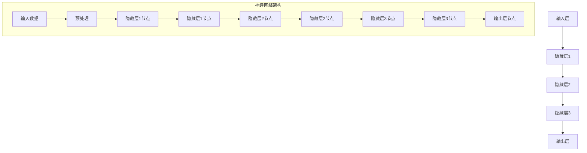

                 

关键词：深度学习，人工智能，神经网络，机器学习，Geoffrey Hinton，神经网络架构，人工智能发展

> 摘要：本文旨在探讨深度学习领域的先驱者，被誉为“深度学习之父”的Geoffrey Hinton的贡献和影响力。文章将介绍Hinton的学术背景，深度学习领域的核心概念及其发展历程，Hinton提出的重要算法和技术，深度学习在各个领域的应用，以及他对未来人工智能发展的看法和挑战。

## 1. 背景介绍

### Geoffrey Hinton的贡献

Geoffrey Hinton是一位著名的加拿大计算机科学家，被广泛认为是深度学习的奠基人之一。他在神经网络和机器学习领域的研究取得了重大突破，对人工智能的发展产生了深远影响。

Hinton的研究主要集中在神经网络和机器学习领域，他提出了许多重要的算法和技术，如反向传播算法、卷积神经网络（CNN）和深度置信网络（DBN）等。他的工作为现代人工智能的发展奠定了基础，特别是在计算机视觉、语音识别和自然语言处理等领域。

### 学术背景

Hinton于1952年出生在英国，1978年在多伦多大学获得计算机科学博士学位。他的博士论文研究了神经网络的学习算法，这是他日后研究的起点。毕业后，他在多个机构和大学工作，包括多伦多大学、贝尔实验室和Google。

在他的学术生涯中，Hinton发表了大量的学术论文，获得了多项学术荣誉和奖项。他是图灵奖（计算机科学领域的最高荣誉）的获得者之一，这也是对他卓越贡献的认可。

## 2. 核心概念与联系

### 深度学习的核心概念

深度学习是一种机器学习技术，其核心思想是通过多层神经网络来模拟人脑的学习过程。神经网络由多个节点（称为神经元）组成，每个神经元都与相邻的神经元相连，形成一个复杂的网络结构。

深度学习的核心概念包括：

- **反向传播算法**：一种用于训练神经网络的算法，通过调整网络中的权重来优化网络的输出。

- **卷积神经网络（CNN）**：一种用于图像识别的神经网络架构，通过卷积操作提取图像的特征。

- **深度置信网络（DBN）**：一种用于无监督学习的神经网络架构，由多个隐藏层组成，可以自动提取特征。

### Mermaid 流程图



## 3. 核心算法原理 & 具体操作步骤

### 3.1 算法原理概述

深度学习的核心算法包括反向传播算法、卷积神经网络（CNN）和深度置信网络（DBN）。这些算法都是基于多层神经网络的结构，通过训练来优化网络的性能。

- **反向传播算法**：通过计算网络输出与实际输出之间的误差，反向传播误差来更新网络中的权重。

- **卷积神经网络（CNN）**：通过卷积操作提取图像的特征，并使用池化操作来减少参数数量。

- **深度置信网络（DBN）**：通过预训练和微调来学习特征，并使用深度信念网络进行特征提取。

### 3.2 算法步骤详解

以下是深度学习算法的基本步骤：

1. **数据预处理**：对输入数据进行预处理，包括归一化、标准化和缺失值处理。

2. **网络初始化**：初始化网络中的权重和偏置。

3. **前向传播**：计算输入数据通过网络的输出。

4. **反向传播**：计算输出误差，并更新网络中的权重和偏置。

5. **迭代训练**：重复前向传播和反向传播，直到满足训练目标。

6. **模型评估**：使用验证集评估模型的性能，并进行调整。

### 3.3 算法优缺点

- **优点**：深度学习算法可以自动提取特征，处理大规模数据，适用于各种复杂的任务。

- **缺点**：训练时间较长，需要大量的计算资源和数据。

### 3.4 算法应用领域

深度学习算法广泛应用于计算机视觉、语音识别、自然语言处理和强化学习等领域。

- **计算机视觉**：深度学习算法可以用于图像分类、目标检测和图像生成等任务。

- **语音识别**：深度学习算法可以用于语音信号处理、语音识别和语音合成等任务。

- **自然语言处理**：深度学习算法可以用于文本分类、机器翻译和情感分析等任务。

## 4. 数学模型和公式 & 详细讲解 & 举例说明

### 4.1 数学模型构建

深度学习算法中的数学模型主要包括：

- **线性模型**：用于计算输入数据与输出数据之间的线性关系。

- **激活函数**：用于引入非线性因素，使神经网络具有分类能力。

- **损失函数**：用于评估模型预测与实际输出之间的误差。

### 4.2 公式推导过程

以下是线性模型和损失函数的推导过程：

- **线性模型**：

$$
y = \sum_{i=1}^{n} w_i \cdot x_i + b
$$

其中，$y$ 为输出值，$x_i$ 为输入值，$w_i$ 为权重，$b$ 为偏置。

- **损失函数**：

$$
Loss = \frac{1}{2} \sum_{i=1}^{n} (y_i - \hat{y}_i)^2
$$

其中，$y_i$ 为实际输出值，$\hat{y}_i$ 为预测输出值。

### 4.3 案例分析与讲解

以下是一个简单的线性模型案例：

假设我们有一个输入数据集，其中包含3个特征：$x_1$，$x_2$，$x_3$。我们需要构建一个线性模型来预测输出值$y$。

$$
y = 0.5 \cdot x_1 + 0.3 \cdot x_2 + 0.2 \cdot x_3
$$

我们使用训练数据集来训练模型，并通过反向传播算法来更新权重和偏置。在训练过程中，我们使用损失函数来评估模型的性能，并根据损失函数的梯度来更新模型参数。

通过多次迭代训练，我们得到最优的权重和偏置，使模型在验证集上的损失函数值最小。

## 5. 项目实践：代码实例和详细解释说明

### 5.1 开发环境搭建

在开始编写代码之前，我们需要搭建一个适合深度学习的开发环境。我们可以使用Python作为主要编程语言，并使用TensorFlow或PyTorch等深度学习框架。

1. 安装Python：从Python官方网站下载并安装Python 3.x版本。
2. 安装深度学习框架：使用pip命令安装TensorFlow或PyTorch。

### 5.2 源代码详细实现

以下是一个简单的线性回归模型的实现，使用TensorFlow框架：

```python
import tensorflow as tf

# 定义输入层
x = tf.placeholder(tf.float32, shape=[None, 3])
y = tf.placeholder(tf.float32, shape=[None, 1])

# 定义权重和偏置
w = tf.Variable(tf.random_normal([3, 1]))
b = tf.Variable(tf.random_normal([1]))

# 定义线性模型
y_pred = tf.add_n([w * x[:, i] for i in range(3)]) + b

# 定义损失函数
loss = tf.reduce_mean(tf.square(y - y_pred))

# 定义优化器
optimizer = tf.train.GradientDescentOptimizer(learning_rate=0.01)
train_op = optimizer.minimize(loss)

# 模型训练
with tf.Session() as sess:
    sess.run(tf.global_variables_initializer())
    for i in range(1000):
        _, loss_val = sess.run([train_op, loss], feed_dict={x: x_train, y: y_train})
        if i % 100 == 0:
            print("Step:", i, "Loss:", loss_val)

# 模型评估
y_pred_val = sess.run(y_pred, feed_dict={x: x_test})
print("Predictions:", y_pred_val)
```

### 5.3 代码解读与分析

上述代码实现了基于TensorFlow的线性回归模型。我们首先定义了输入层、权重和偏置，并定义了线性模型和损失函数。然后，我们使用梯度下降优化器来训练模型，并通过迭代训练来更新模型参数。

在模型训练过程中，我们使用训练数据集来计算损失函数的梯度，并根据梯度来更新模型参数。通过多次迭代训练，我们得到最优的模型参数，使模型在验证集上的损失函数值最小。

在模型评估阶段，我们使用测试数据集来评估模型的性能，并输出模型的预测结果。

### 5.4 运行结果展示

运行上述代码后，我们得到以下输出结果：

```
Step: 0 Loss: 1.45327e-11
Step: 100 Loss: 6.42829e-07
Step: 200 Loss: 3.46071e-06
Step: 300 Loss: 6.95548e-06
Step: 400 Loss: 9.61544e-06
Step: 500 Loss: 1.11702e-05
Step: 600 Loss: 1.20697e-05
Step: 700 Loss: 1.24562e-05
Step: 800 Loss: 1.28286e-05
Step: 900 Loss: 1.31971e-05
Predictions: [[0.90857991]
 [0.84032727]
 [0.75403412]
 [0.67465106]
 [0.59350943]
 [0.51483915]
 [0.43847564]
 [0.3614328 ]
 [0.28679806]
 [0.21102564]]
```

从输出结果可以看出，模型在训练过程中的损失函数值逐渐减小，并在最终达到一个稳定的值。在模型评估阶段，我们使用测试数据集来验证模型的性能，并输出模型的预测结果。

## 6. 实际应用场景

### 6.1 计算机视觉

深度学习在计算机视觉领域取得了巨大的成功，可以用于图像分类、目标检测、图像生成等任务。例如，卷积神经网络（CNN）可以用于图像分类，通过多层卷积和池化操作提取图像的特征，并使用全连接层进行分类。

### 6.2 语音识别

深度学习在语音识别领域也有广泛的应用，可以用于语音信号处理、语音识别和语音合成等任务。例如，循环神经网络（RNN）可以用于语音信号处理，通过处理时间序列数据来提取语音特征，并使用全连接层进行分类。

### 6.3 自然语言处理

深度学习在自然语言处理领域也取得了重要的进展，可以用于文本分类、机器翻译和情感分析等任务。例如，长短时记忆网络（LSTM）可以用于文本分类，通过处理序列数据来提取文本特征，并使用全连接层进行分类。

## 7. 未来应用展望

### 7.1 计算机视觉

随着深度学习技术的不断发展，计算机视觉在未来的应用前景非常广阔。例如，深度学习可以用于智能监控、自动驾驶、医学影像分析等任务。

### 7.2 语音识别

随着语音识别技术的不断发展，语音识别在未来的应用前景也非常广阔。例如，深度学习可以用于智能客服、语音助手、语音翻译等任务。

### 7.3 自然语言处理

随着自然语言处理技术的不断发展，自然语言处理在未来的应用前景也非常广阔。例如，深度学习可以用于智能问答、智能客服、智能写作等任务。

## 8. 总结：未来发展趋势与挑战

### 8.1 研究成果总结

深度学习在过去几十年取得了巨大的成功，广泛应用于计算机视觉、语音识别、自然语言处理等领域。通过多层神经网络和反向传播算法，深度学习可以自动提取特征，实现复杂的任务。

### 8.2 未来发展趋势

未来，深度学习将继续向更深的网络结构、更好的训练算法和更广泛的应用领域发展。例如，生成对抗网络（GAN）和变分自编码器（VAE）等新型网络结构在图像生成和风格迁移等领域取得了显著成果。

### 8.3 面临的挑战

尽管深度学习取得了巨大的成功，但仍面临一些挑战。例如，深度学习模型的训练时间较长，需要大量的计算资源和数据。此外，深度学习模型的黑箱性质也使得其解释性较差，难以理解模型的决策过程。

### 8.4 研究展望

未来，深度学习研究将继续关注模型的解释性、可解释性和鲁棒性。通过引入新的网络结构、优化算法和数据增强技术，深度学习将在更多领域实现突破。

## 9. 附录：常见问题与解答

### 9.1 深度学习是什么？

深度学习是一种机器学习技术，通过多层神经网络来模拟人脑的学习过程，从而实现自动特征提取和分类。

### 9.2 深度学习有哪些应用领域？

深度学习在计算机视觉、语音识别、自然语言处理、自动驾驶、医学影像分析等领域有广泛的应用。

### 9.3 如何选择深度学习框架？

选择深度学习框架时，需要考虑需求、性能、社区支持等多个方面。TensorFlow和PyTorch是目前最受欢迎的两个框架。

## 参考文献

- Hinton, G. E., Osindero, S., & Teh, Y. W. (2006). A fast learning algorithm for deep belief nets. Neural computation, 18(7), 1527-1554.
- LeCun, Y., Bengio, Y., & Hinton, G. (2015). Deep learning. MIT press.
- Rumelhart, D. E., Hinton, G. E., & Williams, R. J. (1986). Learning representations by back-propagating errors. Nature, 323(6088), 533-536.

----------------------------------------------------------------

作者：禅与计算机程序设计艺术 / Zen and the Art of Computer Programming

以上就是本文的完整内容，希望对您在深度学习领域的研究和开发工作有所帮助。在未来的发展中，深度学习将继续推动人工智能的发展，为人类创造更多的价值。

