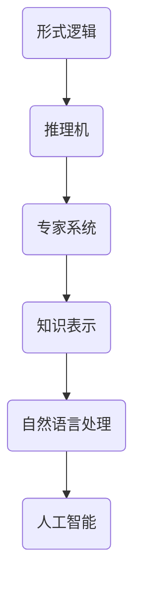
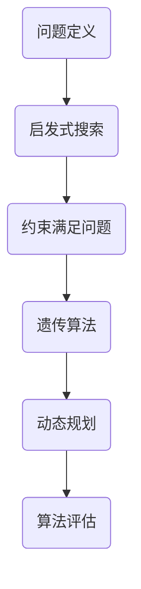
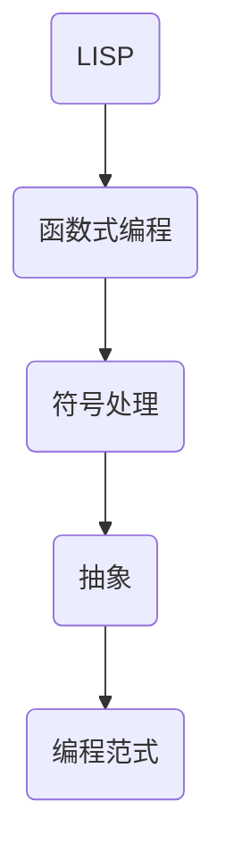

                 

关键词：人工智能、计算机科学家、算法、逻辑推理、编程语言、形式逻辑、AI 发展

摘要：本文将介绍计算机科学领域的重要人物——John McCarthy，探讨他在人工智能领域的贡献，包括他对形式逻辑、算法和编程语言的发展所做出的卓越成就。本文旨在通过深入分析麦卡锡的工作，揭示其影响和启发，以及他对于未来人工智能发展的思考。

## 1. 背景介绍

John McCarthy，1927年出生于美国马萨诸塞州，是一位杰出的计算机科学家和人工智能（AI）的先驱。他在20世纪中叶推动了人工智能领域的发展，被誉为“人工智能之父”。麦卡锡的贡献不仅限于理论研究，他还在算法和编程语言设计方面有着深远的影响。

麦卡锡在普林斯顿大学获得数学学士学位后，于1951年在普林斯顿高级研究所（Princeton Institute for Advanced Study）获得物理学博士学位。此后，他加入了斯坦福大学，并成为了计算机科学系的创始成员之一。

## 2. 核心概念与联系

### 2.1 形式逻辑与人工智能

形式逻辑是麦卡锡在人工智能领域的重要理论基础。他认识到，人工智能的发展离不开形式逻辑的支撑。形式逻辑提供了一种精确的描述语言，使得计算机可以处理复杂的推理问题。

### 2.2 算法与问题求解

麦卡锡提出了许多重要的算法，特别是在问题求解领域。他关注于如何设计高效且可靠的算法来解决复杂问题。他的算法不仅适用于计算机科学，还在更广泛的领域中有着重要的应用。

### 2.3 编程语言与抽象

麦卡锡对编程语言的设计有着深刻的见解。他提出了LISP语言，这是历史上第一个现代编程语言，对编程范式的发展产生了深远的影响。LISP的语言设计强调函数式编程和符号处理，为人工智能的应用提供了强有力的工具。

## 3. 核心算法原理 & 具体操作步骤

### 3.1 算法原理概述

麦卡锡提出的一些核心算法，如约束满足问题（Constraint Satisfaction Problems, CSP）和启发式搜索（Heuristic Search），为人工智能提供了强大的问题求解能力。

### 3.2 算法步骤详解

- **约束满足问题（CSP）**：CSP是关于如何找到一组变量值，使得这些变量的值满足给定的约束条件。以下是CSP的基本步骤：

  1. 定义变量域。
  2. 定义约束条件。
  3. 选择变量和值。
  4. 递归检查约束条件。

- **启发式搜索**：启发式搜索是一种问题求解策略，它使用启发式信息来指导搜索过程。基本步骤包括：

  1. 选择一个初始状态。
  2. 应用启发式函数评估当前状态。
  3. 选择一个最有希望的状态进行扩展。
  4. 重复步骤2-3，直到找到解或状态空间被穷尽。

### 3.3 算法优缺点

- **CSP**：优点是能够处理复杂的约束条件，缺点是可能需要大量计算资源。
- **启发式搜索**：优点是能够快速找到解，缺点是可能无法保证找到最优解。

### 3.4 算法应用领域

CSP和启发式搜索广泛应用于人工智能的各个领域，如规划、逻辑推理、图像处理和游戏玩

