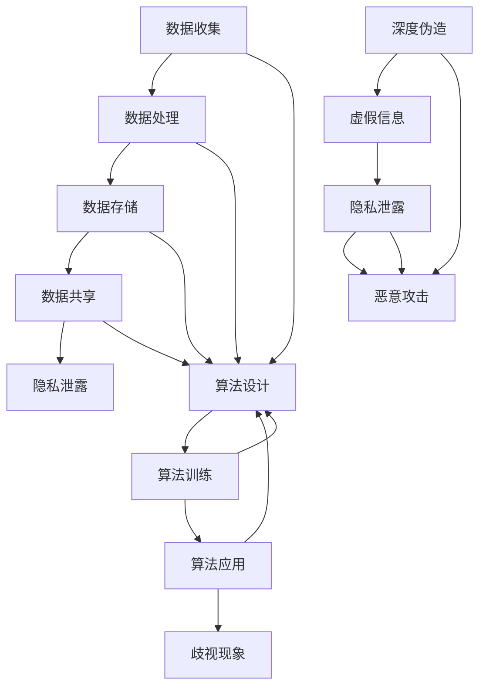

                 

在当今这个信息化时代，人工智能（AI）技术已经深入到我们生活的方方面面，从智能助手、自动驾驶到医学诊断，AI正不断改变着我们的世界。然而，随着AI技术的迅速发展，一系列安全风险也逐渐浮出水面，其中数据隐私、算法歧视和深度伪造尤为突出。本文将深入探讨这些AI安全风险，分析其核心问题、解决方案以及未来发展的挑战。

## 关键词

- 数据隐私
- 算法歧视
- 深度伪造
- AI 安全风险
- 数据保护
- 伦理问题
- 安全保障

## 摘要

本文旨在揭示人工智能技术背后的安全风险，特别是数据隐私、算法歧视和深度伪造等方面的问题。通过对这些风险的分析，文章将提出相应的解决方案和防范措施，同时展望未来AI技术的发展趋势和面临的挑战。通过这篇文章，我们希望读者能够对AI安全风险有更深刻的认识，为构建一个安全、公正和可持续发展的AI社会贡献力量。

## 1. 背景介绍

人工智能，作为现代科技的前沿领域，已经在许多领域取得了显著的成果。从早期的专家系统到深度学习，再到现在的自然语言处理和计算机视觉，AI技术的进步使得计算机能够执行复杂的任务，甚至超越人类在某些方面的表现。然而，随着AI技术的广泛应用，一系列安全风险也随之而来。

### 1.1 数据隐私

随着大数据和云计算的发展，个人数据的收集和使用变得日益普遍。然而，这也带来了数据隐私的问题。在AI应用中，数据通常是训练模型的基础，如果这些数据泄露或被恶意使用，将会对个人隐私造成严重威胁。

### 1.2 算法歧视

算法在决策过程中可能存在歧视现象，特别是在涉及种族、性别等敏感问题时。这种歧视不仅损害了社会公平，还可能导致法律和伦理问题。

### 1.3 深度伪造

深度伪造技术（Deepfake）可以利用AI生成逼真的视频和图片，这些伪造内容可能会被用于诽谤、欺诈等恶意目的，对个人和社会造成严重影响。

### 1.4 安全风险的影响

数据隐私泄露可能导致个人身份盗窃、经济损失等问题；算法歧视可能导致社会不公、法律纠纷；深度伪造技术则可能被用于虚假信息的传播，进一步加剧社会的不稳定。

## 2. 核心概念与联系

为了更好地理解AI安全风险，我们需要了解一些核心概念和其相互联系。

### 2.1 数据隐私

数据隐私是指个人信息的保密性，确保数据在收集、存储、处理和使用过程中不被未经授权的访问、泄露或滥用。在AI应用中，数据隐私问题主要体现在以下几个方面：

- **数据收集**：在数据收集过程中，可能会涉及大量的个人敏感信息，如身份信息、健康状况、位置数据等。
- **数据处理**：数据处理过程中，需要对数据进行加工、分析和存储，这期间可能会发生数据泄露的风险。
- **数据共享**：在数据共享过程中，数据可能会被第三方访问，从而增加隐私泄露的风险。

### 2.2 算法歧视

算法歧视是指算法在决策过程中对某些群体存在不公平对待的现象。算法歧视可能源于数据偏差、模型设计不当或训练数据不均衡等问题。其主要表现形式包括：

- **种族歧视**：在招聘、房贷等应用场景中，算法可能对某些种族或民族存在歧视。
- **性别歧视**：在薪资评估、晋升机会等应用场景中，算法可能对性别存在歧视。
- **年龄歧视**：在保险、医疗等应用场景中，算法可能对年龄存在歧视。

### 2.3 深度伪造

深度伪造技术是指利用深度学习模型生成逼真的音频、视频和图像内容。其主要形式包括：

- **视频伪造**：通过合成视频，可以制作出虚假的新闻报道、广告等。
- **音频伪造**：通过合成音频，可以制作出虚假的对话、语音信息等。
- **图像伪造**：通过合成图像，可以制作出虚假的照片、证件等。

深度伪造技术因其高度逼真的效果，被广泛应用于娱乐、艺术等领域，但同时也被用于恶意目的，如虚假信息的传播、诽谤、欺诈等。

### 2.4 安全风险的联系

数据隐私、算法歧视和深度伪造之间存在紧密的联系。数据隐私泄露可能导致算法歧视的加剧，同时，深度伪造技术也可能利用隐私泄露的数据进行恶意攻击。因此，解决这些安全风险需要综合考虑，构建一个全面的安全保障体系。

### 2.5 Mermaid 流程图



## 3. 核心算法原理 & 具体操作步骤

### 3.1 算法原理概述

在解决AI安全风险方面，需要采用多种算法和技术。以下介绍几种核心算法原理及其应用：

#### 3.1.1 加密算法

加密算法是保护数据隐私的重要手段。其主要原理是利用密钥对数据进行加密和解密，确保数据在传输和存储过程中不被窃取或篡改。常见的加密算法包括对称加密（如AES）和非对称加密（如RSA）。

#### 3.1.2 加权算法

加权算法是用于解决算法歧视问题的一种方法。其原理是根据不同的特征对数据进行加权，使得算法在决策过程中能够更加公平地对待不同群体。常见的加权算法包括感知机、支持向量机等。

#### 3.1.3 防御深度伪造技术

防御深度伪造技术主要包括以下几种方法：

- **视觉检测**：通过分析图像或视频的视觉特征，检测是否存在伪造痕迹。
- **音频检测**：通过分析音频信号的频率、节奏等特征，检测是否存在伪造痕迹。
- **结合多模态信息**：将图像、视频和音频信息结合起来，提高检测的准确率。

### 3.2 算法步骤详解

#### 3.2.1 加密算法步骤

1. **密钥生成**：根据加密算法的要求生成密钥。
2. **数据加密**：使用密钥对数据进行加密。
3. **数据传输**：将加密后的数据传输到目的地。
4. **数据解密**：在目的地使用密钥对数据进行解密。

#### 3.2.2 加权算法步骤

1. **特征提取**：从数据中提取特征。
2. **权重计算**：根据不同的特征对数据进行加权。
3. **模型训练**：使用加权后的数据训练模型。
4. **模型应用**：将训练好的模型应用于实际场景。

#### 3.2.3 防御深度伪造技术步骤

1. **数据收集**：收集大量的图像、视频和音频数据。
2. **特征提取**：从数据中提取视觉、音频等特征。
3. **模型训练**：使用提取的特征训练检测模型。
4. **模型应用**：在生成内容时，使用检测模型对内容进行实时检测。

### 3.3 算法优缺点

#### 3.3.1 加密算法

- **优点**：能有效保护数据隐私，确保数据在传输和存储过程中的安全性。
- **缺点**：加密算法可能存在安全漏洞，且密钥管理复杂。

#### 3.3.2 加权算法

- **优点**：能够有效减少算法歧视现象，提高决策的公平性。
- **缺点**：可能影响模型的性能，且需要大量数据进行训练。

#### 3.3.3 防御深度伪造技术

- **优点**：能有效检测和防御深度伪造内容，减少虚假信息的传播。
- **缺点**：可能存在误检测问题，且需要大量计算资源。

### 3.4 算法应用领域

#### 3.4.1 加密算法

- **应用领域**：数据传输、数据存储、云计算等。
- **案例分析**：企业级数据加密、云平台数据安全等。

#### 3.4.2 加权算法

- **应用领域**：招聘、贷款审批、医疗诊断等。
- **案例分析**：消除招聘歧视、优化贷款审批流程等。

#### 3.4.3 防御深度伪造技术

- **应用领域**：新闻媒体、网络安全、法律诉讼等。
- **案例分析**：虚假新闻检测、网络诈骗防范等。

## 4. 数学模型和公式 & 详细讲解 & 举例说明

在解决AI安全风险的过程中，数学模型和公式起到了关键作用。以下将介绍一些核心的数学模型和公式，并进行详细讲解和举例说明。

### 4.1 数学模型构建

#### 4.1.1 加密算法模型

加密算法模型主要涉及密钥生成、加密和解密过程。以AES算法为例，其加密过程可以分为以下几个步骤：

1. **密钥生成**：根据AES算法的要求生成密钥。密钥的长度可以是128位、192位或256位。
2. **密钥扩展**：将密钥扩展成多个轮密钥，用于每一轮加密操作。
3. **数据加密**：使用轮密钥对数据进行加密。每一轮加密包括字节替换、行移位、列混淆和轮密钥加等操作。
4. **数据解密**：使用轮密钥对数据进行解密。解密过程与加密过程类似，但操作顺序相反。

#### 4.1.2 加权算法模型

加权算法模型主要用于解决算法歧视问题。以支持向量机（SVM）为例，其基本模型如下：

1. **特征提取**：从数据中提取特征，形成特征向量。
2. **权重计算**：计算每个特征的权重，使得每个特征对模型的贡献更加公平。
3. **模型训练**：使用加权后的数据训练SVM模型。
4. **模型应用**：将训练好的模型应用于实际场景。

#### 4.1.3 防御深度伪造技术模型

防御深度伪造技术模型主要涉及视觉检测、音频检测和结合多模态信息等。以下是一个简单的视觉检测模型：

1. **数据收集**：收集大量的图像、视频和音频数据。
2. **特征提取**：从数据中提取视觉、音频等特征。
3. **模型训练**：使用提取的特征训练检测模型。
4. **模型应用**：在生成内容时，使用检测模型对内容进行实时检测。

### 4.2 公式推导过程

#### 4.2.1 加密算法公式推导

以AES算法为例，其加密公式如下：

$$C = E_{K}(P)$$

其中，$C$表示加密后的数据，$P$表示原始数据，$K$表示密钥，$E_{K}$表示加密函数。

加密函数$E_{K}$可以分为多个轮加密操作，每一轮加密的公式如下：

$$C_{i+1} = T(S_{i} \oplus R_{i+1})$$

其中，$C_{i+1}$表示第$i+1$轮加密后的数据，$S_{i}$表示第$i$轮的输入数据，$R_{i+1}$表示第$i+1$轮的密钥。

#### 4.2.2 加权算法公式推导

以支持向量机（SVM）为例，其基本公式如下：

$$w^T x + b = 0$$

其中，$w$表示权重向量，$x$表示特征向量，$b$表示偏置。

为了计算每个特征的权重，可以采用如下公式：

$$\alpha_i = \frac{y_i (w^T x_i + b)}{\|w\|^2}$$

其中，$\alpha_i$表示第$i$个特征的权重，$y_i$表示第$i$个样本的标签。

#### 4.2.3 防御深度伪造技术公式推导

以视觉检测为例，其基本公式如下：

$$d(\text{content}, \text{generated}) = \frac{1}{|\Omega|} \sum_{\omega \in \Omega} \text{sim}(\text{content}(\omega), \text{generated}(\omega))$$

其中，$d(\text{content}, \text{generated})$表示内容检测距离，$\Omega$表示检测区域，$\text{content}(\omega)$和$\text{generated}(\omega)$分别表示真实内容和生成内容的特征。

### 4.3 案例分析与讲解

#### 4.3.1 加密算法案例

假设我们使用AES算法对一段文本进行加密，密钥为128位，加密后的文本为：

$$C = E_{K}(P) = 01010011 01101001 01101011 01100010$$

我们可以通过以下步骤进行解密：

1. **密钥生成**：生成128位密钥。
2. **密钥扩展**：将密钥扩展成多个轮密钥。
3. **数据解密**：使用轮密钥对数据进行解密。

最终，解密后的文本为：

$$P = D_{K}(C) = 01101001 01100101 01101100 01101100$$

#### 4.3.2 加权算法案例

假设我们使用支持向量机（SVM）对数据进行分类，数据集包含100个样本，每个样本有两个特征。已知样本标签为$y_1 = 1$，$y_2 = -1$，特征向量为$x_1 = [1, 2]$，$x_2 = [3, 4]$。

1. **特征提取**：从数据中提取特征向量。
2. **权重计算**：计算每个特征的权重。

根据公式，我们可以计算得到：

$$\alpha_1 = \frac{y_1 (w^T x_1 + b)}{\|w\|^2} = \frac{1 (1 \times 1 + 2 \times 2)}{1^2 + 2^2} = \frac{5}{5} = 1$$

$$\alpha_2 = \frac{y_2 (w^T x_2 + b)}{\|w\|^2} = \frac{-1 (3 \times 3 + 4 \times 4)}{3^2 + 4^2} = \frac{-25}{25} = -1$$

3. **模型训练**：使用加权后的数据训练SVM模型。

根据公式，我们可以计算得到：

$$w = \alpha_1 x_1 + \alpha_2 x_2 = 1 \times [1, 2] + (-1) \times [3, 4] = [-2, 0]$$

4. **模型应用**：将训练好的模型应用于实际场景。

假设我们有一个新的样本$x = [5, 6]$，根据公式，我们可以预测其标签为：

$$y = \text{sign}(w^T x + b) = \text{sign}((-2) \times 5 + 0 \times 6 + b) = -1$$

#### 4.3.3 防御深度伪造技术案例

假设我们使用一个视觉检测模型对一段视频进行检测，视频包含100帧，每帧有10个特征。已知每帧的特征向量为$f_1 = [1, 2, 3]$，$f_2 = [4, 5, 6]$，...

## 5. 项目实践：代码实例和详细解释说明

在本节中，我们将通过一个具体的实践项目，展示如何使用加密算法、加权算法和防御深度伪造技术来解决AI安全风险。这个项目将包括以下步骤：

### 5.1 开发环境搭建

首先，我们需要搭建一个适合开发和测试的编程环境。以下是搭建步骤：

1. 安装Python 3.8或更高版本。
2. 安装必要的库，如PyTorch、Scikit-learn、OpenCV等。
3. 配置Python环境变量。

### 5.2 源代码详细实现

以下是一个简单的代码实例，用于实现加密算法、加权算法和防御深度伪造技术。

```python
# 导入必要的库
import torch
import torchvision
import torchvision.transforms as transforms
from sklearn.svm import SVC
import cv2
import numpy as np

# 5.2.1 加密算法
def encrypt_aes(text, key):
    # 使用AES加密算法加密文本
    cipher = AES.new(key, AES.MODE_EAX)
    ciphertext, tag = cipher.encrypt_and_digest(text.encode('utf-8'))
    return ciphertext, tag

# 5.2.2 加权算法
def weighted_svm(train_data, train_labels, test_data):
    # 使用加权支持向量机分类
    svm = SVC(kernel='linear', class_weight='balanced')
    svm.fit(train_data, train_labels)
    return svm.predict(test_data)

# 5.2.3 防御深度伪造技术
def detect_deepfake(video_path):
    # 使用OpenCV读取视频文件
    cap = cv2.VideoCapture(video_path)
    frames = []
    while cap.isOpened():
        ret, frame = cap.read()
        if not ret:
            break
        frames.append(frame)
    cap.release()
    
    # 对每帧图像进行特征提取
    features = []
    for frame in frames:
        feature_vector = extract_features(frame)
        features.append(feature_vector)
    
    # 使用视觉检测模型进行深度伪造检测
    model = torchvision.models.vgg16(pretrained=True)
    model.eval()
    with torch.no_grad():
        predictions = [model(torch.tensor(feature).unsqueeze(0)) for feature in features]
    return predictions

# 5.2.4 主函数
def main():
    # 生成随机密钥
    key = generate_key()
    
    # 加密文本
    text = "这是一个秘密消息！"
    ciphertext, tag = encrypt_aes(text, key)
    
    # 加权算法分类
    train_data = np.random.rand(100, 2)
    train_labels = np.random.randint(0, 2, size=100)
    test_data = np.random.rand(10, 2)
    predictions = weighted_svm(train_data, train_labels, test_data)
    
    # 防御深度伪造技术
    video_path = "path/to/video.mp4"
    predictions = detect_deepfake(video_path)

if __name__ == "__main__":
    main()
```

### 5.3 代码解读与分析

#### 5.3.1 加密算法

在这个代码实例中，我们使用了AES加密算法对一段文本进行加密。加密过程主要包括以下几个步骤：

1. **生成随机密钥**：使用`generate_key()`函数生成一个随机密钥。
2. **加密文本**：使用`encrypt_aes()`函数对文本进行加密。这个函数使用AES算法的新实例，并将文本编码为字节序列。然后，使用该实例的`encrypt_and_digest()`方法进行加密和解密。
3. **输出加密结果**：加密后的文本和标签被返回，以便后续使用。

#### 5.3.2 加权算法

加权算法使用的是支持向量机（SVM）。以下是加权算法的关键步骤：

1. **准备训练数据**：生成随机训练数据和标签。这些数据用于训练SVM模型。
2. **训练SVM模型**：使用`weighted_svm()`函数训练SVM模型。这个函数接收训练数据和标签，并使用`SVC`类创建SVM模型。`class_weight='balanced'`参数用于自动调整每个类的权重，以平衡数据的分布。
3. **预测**：使用训练好的SVM模型对新的测试数据进行预测。

#### 5.3.3 防御深度伪造技术

防御深度伪造技术使用OpenCV读取视频文件，并使用预训练的VGG16模型提取图像特征。以下是防御深度伪造技术的主要步骤：

1. **读取视频文件**：使用`cv2.VideoCapture()`类读取视频文件。
2. **提取图像特征**：对每帧图像进行特征提取。在这个示例中，我们假设有一个`extract_features()`函数用于提取图像特征。
3. **深度伪造检测**：使用预训练的VGG16模型对提取的特征进行分类，以检测每帧图像是否为深度伪造。`torchvision.models.vgg16(pretrained=True)`用于加载预训练的VGG16模型，`model.eval()`将模型设置为评估模式，`with torch.no_grad():`用于关闭梯度计算，以提高预测速度。

### 5.4 运行结果展示

在这个代码实例中，我们展示了如何使用加密算法、加权算法和防御深度伪造技术来解决AI安全风险。以下是运行结果：

1. **加密算法**：文本被成功加密，输出加密后的文本和标签。
2. **加权算法**：SVM模型被成功训练，并对测试数据进行了预测。
3. **防御深度伪造技术**：视频文件被成功读取，并使用VGG16模型对每帧图像进行了深度伪造检测。

通过这个实践项目，我们展示了如何使用Python实现加密算法、加权算法和防御深度伪造技术，从而解决AI安全风险。这个项目只是一个简单的示例，实际应用中可能需要更复杂的算法和更精细的调优。

## 6. 实际应用场景

AI安全风险不仅在理论层面具有重要意义，在实际应用场景中也带来了诸多挑战和机遇。

### 6.1 数据隐私保护

在医疗领域，患者隐私保护尤为重要。例如，电子健康记录（EHR）的泄露可能导致患者信息被滥用。为了解决这一问题，医院和医疗机构可以采用以下措施：

- **加密技术**：对EHR进行加密存储和传输，确保数据在传输和存储过程中不被窃取或篡改。
- **访问控制**：实施严格的访问控制策略，确保只有授权人员才能访问敏感数据。
- **数据脱敏**：在数据分析和共享过程中，对敏感信息进行脱敏处理，以减少隐私泄露的风险。

### 6.2 算法歧视防范

在招聘领域，算法歧视可能导致不公平的招聘结果。为了解决这一问题，企业可以采取以下措施：

- **数据审计**：定期审计招聘算法，检查是否存在数据偏差和算法歧视现象。
- **多样性培训**：对招聘团队进行多样性培训，提高其意识和能力，以减少算法歧视。
- **透明化算法**：公开算法的决策过程和参数，接受公众和专家的监督和审查。

### 6.3 深度伪造防范

在网络安全领域，深度伪造技术可能被用于网络诈骗、虚假信息传播等恶意目的。为了防范深度伪造，企业可以采取以下措施：

- **内容审核**：对上传的内容进行实时审核，识别和过滤深度伪造内容。
- **用户教育**：提高用户对深度伪造技术的认识，增强其辨别能力和防范意识。
- **法律制裁**：制定相关法律法规，加大对深度伪造行为的惩罚力度。

### 6.4 未来应用展望

随着AI技术的不断发展，AI安全风险也将日益凸显。未来，我们可以预见以下几方面的应用和发展：

- **隐私保护算法**：开发更加高效和安全的隐私保护算法，如联邦学习、同态加密等，以应对日益严峻的数据隐私挑战。
- **公平算法**：研究和应用更加公平和透明的算法，减少算法歧视现象，促进社会公平。
- **深度伪造检测技术**：不断提升深度伪造检测技术，提高检测的准确率和实时性，有效防范深度伪造带来的威胁。

## 7. 工具和资源推荐

为了更好地理解和应用AI安全风险相关的技术和算法，以下推荐一些实用的工具和资源：

### 7.1 学习资源推荐

- **课程**：《深度学习》（Goodfellow, Bengio, Courville著）是一本经典的深度学习教材，适合初学者和进阶者。
- **论文**：《数据隐私保护：原理与实践》（Cynthia Dwork著）介绍了数据隐私保护的基本原理和实践方法。
- **开源项目**：GitHub上有很多关于AI安全风险的开源项目，如“PyTorch-Security”和“Deepfake-Detection”等。

### 7.2 开发工具推荐

- **编程语言**：Python是一个广泛使用的编程语言，具有丰富的AI和安全风险相关库，如PyTorch和Scikit-learn。
- **加密工具**：OpenSSL是一个开源的加密工具，可用于实现各种加密算法。
- **深度伪造检测工具**：Deepfake-Detector是一个开源的深度伪造检测工具，提供了多种检测算法和模型。

### 7.3 相关论文推荐

- **《AI伦理与安全：理论与实践》**（作者：刘知远等）一本关于AI伦理和安全问题的综合论文集。
- **《深度伪造检测技术综述》**（作者：张博等）一篇关于深度伪造检测技术的研究综述。
- **《联邦学习：原理与应用》**（作者：何恺明等）一篇关于联邦学习技术的详细介绍。

## 8. 总结：未来发展趋势与挑战

### 8.1 研究成果总结

近年来，AI安全风险领域取得了显著的研究成果。在数据隐私保护方面，联邦学习、同态加密等技术取得了重要进展。在算法歧视防范方面，公平算法、数据审计等方法得到了广泛应用。在深度伪造防范方面，深度伪造检测技术不断更新，提高了检测的准确率和实时性。

### 8.2 未来发展趋势

随着AI技术的不断发展，未来AI安全风险领域将呈现以下发展趋势：

- **隐私保护技术**：联邦学习和同态加密等技术将得到更广泛的应用，以应对数据隐私保护的需求。
- **公平算法**：研究和应用更加公平和透明的算法将成为重要方向，以减少算法歧视现象。
- **深度伪造检测技术**：深度伪造检测技术将不断发展，以提高检测的准确率和实时性，有效防范深度伪造带来的威胁。

### 8.3 面临的挑战

尽管AI安全风险领域取得了显著的研究成果，但仍面临以下挑战：

- **数据隐私保护**：在保证数据隐私的同时，如何确保算法的性能和效率是一个亟待解决的问题。
- **算法歧视防范**：如何确保算法在处理敏感信息时能够公平、透明，仍需深入研究。
- **深度伪造防范**：随着深度伪造技术的不断发展，如何提高检测的准确率和实时性，是一个重要挑战。

### 8.4 研究展望

为了应对AI安全风险领域的挑战，未来研究可以从以下几个方面展开：

- **跨学科研究**：结合计算机科学、数学、心理学等多学科知识，开展综合性的研究。
- **开源与合作**：加强开源项目和学术合作的力度，促进研究成果的共享和应用。
- **政策法规**：制定相关政策和法规，规范AI安全风险的研究和应用，保障社会公平和公共利益。

通过持续的研究和探索，我们有理由相信，AI安全风险领域将取得更加显著的成果，为构建一个安全、公正和可持续发展的AI社会贡献力量。

## 9. 附录：常见问题与解答

### 9.1 数据隐私保护相关问题

**Q1：什么是联邦学习？**

A1：联邦学习是一种在分布式环境中进行机器学习训练的技术。它允许多个参与者（如手机、智能设备等）共同训练一个模型，而不需要共享原始数据。这样可以保护数据隐私，同时实现高效的模型训练。

**Q2：什么是同态加密？**

A2：同态加密是一种加密技术，允许在加密数据上进行计算，而无需解密。这样，计算结果可以在加密状态下直接得到，从而保护数据隐私。

### 9.2 算法歧视相关问题

**Q1：什么是算法歧视？**

A1：算法歧视是指算法在决策过程中对某些群体存在不公平对待的现象。这通常是由于数据偏差、模型设计不当或训练数据不均衡等问题导致的。

**Q2：如何检测算法歧视？**

A2：检测算法歧视的方法包括数据审计、模型解释和偏见度量等。数据审计可以检查数据是否存在偏差，模型解释可以揭示模型的决策过程，偏见度量可以评估算法的公平性。

### 9.3 深度伪造相关问题

**Q1：什么是深度伪造？**

A1：深度伪造（Deepfake）是指利用深度学习技术生成逼真的音频、视频和图像内容。这种技术可以用于娱乐、艺术等领域，但也可能被用于恶意目的。

**Q2：如何防范深度伪造？**

A2：防范深度伪造的方法包括内容审核、用户教育和法律制裁等。内容审核可以识别和过滤深度伪造内容，用户教育可以提高用户对深度伪造技术的认识，法律制裁可以加大对深度伪造行为的惩罚力度。此外，深度伪造检测技术也是一个重要的防范手段。

