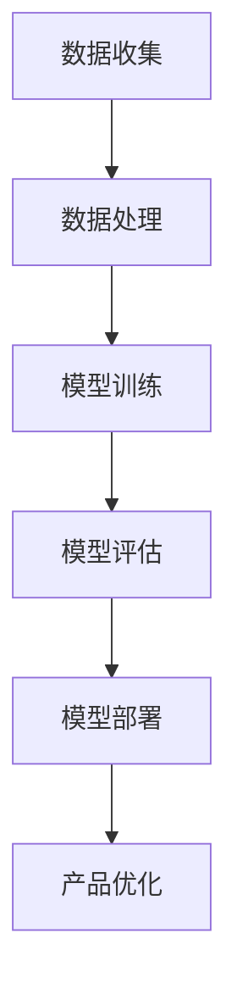
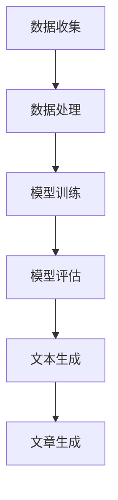

                 

在当今这个快速发展的科技时代，人工智能（AI）已经成为各行各业的重要推动力。创业产品经理，作为连接技术和市场的桥梁，如何在大模型时代提升自身的技能，成为了当前的热门话题。本文将探讨AI驱动下的创业产品经理所需的关键技能，以及如何有效地应用这些技能推动创业项目的发展。

## 文章关键词
- AI 驱动的创业产品经理
- 大模型
- 技能提升
- 创业项目
- 技术市场融合

## 文章摘要
本文旨在为创业产品经理提供在大模型时代所需的技能指南。通过深入分析AI技术的现状与发展趋势，以及这些技术如何影响创业项目，本文提出了提升创业产品经理技能的若干策略。文章将探讨从市场需求分析到产品迭代，再到商业化的全流程，如何充分利用AI的力量，实现创业项目的成功。

## 1. 背景介绍

### AI的发展历程
人工智能自1956年首次提出以来，已经经历了数十年的发展。从早期的符号主义和知识表示，到基于统计学习的机器学习，再到近年来的深度学习和大模型，AI技术不断演进。特别是在2012年，深度学习在图像识别领域的突破，标志着AI进入了一个新的时代。

### 大模型的兴起
大模型，如GPT-3、BERT等，是近年来AI领域的热门话题。这些模型具有巨大的参数量和计算能力，能够处理复杂的自然语言任务，从文本生成到语言翻译，无所不能。大模型的兴起，为创业产品经理提供了丰富的工具和资源。

### 创业产品经理的角色
创业产品经理不仅需要具备技术背景，还需要深入了解市场需求，协调开发团队和市场营销团队，确保产品从概念到市场的全过程顺利进行。在大模型时代，他们的角色显得尤为重要。

## 2. 核心概念与联系

### AI驱动的创业产品经理
AI驱动的创业产品经理指的是那些能够充分利用AI技术，推动产品创新和市场拓展的产品经理。他们不仅具备传统的产品管理技能，还能熟练运用AI工具，为产品提供智能化的解决方案。

### 技术与市场的融合
在AI驱动的创业产品管理中，技术与市场的融合是关键。产品经理需要理解AI技术的潜力，同时深入了解市场需求，将这两者结合起来，打造出既有技术含量又符合市场需求的创新产品。

### 大模型的原理与应用
大模型的核心在于其巨大的参数量和复杂的网络结构。通过训练，这些模型能够捕捉到数据中的复杂模式，从而在各类任务中表现出色。大模型的应用领域非常广泛，从自然语言处理到计算机视觉，再到推荐系统，都有其身影。

### Mermaid流程图
以下是一个简化的大模型原理与应用的Mermaid流程图：



## 3. 核心算法原理 & 具体操作步骤

### 3.1 算法原理概述
大模型的核心是深度神经网络（DNN）。通过多层神经元的堆叠，DNN能够自动学习数据中的特征表示。近年来，随着计算能力和数据量的提升，更深的网络结构和更大的模型参数量得以实现，从而大幅提升了模型的性能。

### 3.2 算法步骤详解
1. **数据收集**：收集大量的数据，这些数据可以来自多个渠道，如公开数据集、用户生成内容等。
2. **数据处理**：对收集到的数据进行处理，包括数据清洗、归一化等步骤，以确保数据的质量和一致性。
3. **模型训练**：使用处理好的数据对模型进行训练，调整模型的参数，使其能够准确预测或生成目标数据。
4. **模型评估**：在独立的测试集上评估模型的性能，确保模型在不同数据集上都能保持良好的表现。
5. **模型部署**：将训练好的模型部署到产品中，使其能够实时处理用户请求。
6. **产品优化**：根据用户反馈和模型表现，不断迭代优化产品。

### 3.3 算法优缺点
**优点**：
- **强大的学习能力**：大模型能够自动学习数据中的复杂模式，提高任务的准确性。
- **广泛的应用领域**：大模型在各类任务中都表现出色，从文本生成到图像识别，无所不能。
- **自动特征提取**：大模型能够自动提取特征，减少人工干预。

**缺点**：
- **计算资源需求高**：大模型需要大量的计算资源和时间进行训练。
- **数据依赖性强**：模型的性能高度依赖于数据的质量和数量。
- **隐私和伦理问题**：大模型在处理用户数据时可能引发隐私和伦理问题。

### 3.4 算法应用领域
大模型在自然语言处理、计算机视觉、推荐系统等领域都有广泛应用。例如，在自然语言处理领域，大模型可以用于文本生成、机器翻译、情感分析等任务；在计算机视觉领域，大模型可以用于图像识别、图像生成等任务。

## 4. 数学模型和公式 & 详细讲解 & 举例说明

### 4.1 数学模型构建
大模型的数学基础是多层感知器（MLP）。MLP由输入层、隐藏层和输出层组成，每层由多个神经元组成。神经元之间的连接权重通过学习调整，以达到最佳的预测或生成效果。

### 4.2 公式推导过程
MLP的输出可以通过以下公式计算：

$$
\text{output} = \text{激活函数}(\sum_{i=1}^{n} w_i \cdot a_i)
$$

其中，$a_i$是输入值，$w_i$是连接权重，激活函数可以是Sigmoid、ReLU等。

### 4.3 案例分析与讲解
以文本生成任务为例，假设我们要生成一段关于人工智能的文章。首先，我们需要收集大量的文本数据，并对这些数据进行处理。然后，使用处理好的数据训练一个文本生成模型。在训练过程中，模型的参数会不断调整，以达到最佳的生成效果。训练完成后，我们可以使用模型生成新的文章。以下是一个简化的文本生成过程：



## 5. 项目实践：代码实例和详细解释说明

### 5.1 开发环境搭建
搭建一个基于大模型的开发环境需要以下步骤：
1. 安装Python和相关依赖库，如TensorFlow或PyTorch。
2. 准备数据集，并进行预处理。
3. 安装GPU驱动和深度学习框架。

### 5.2 源代码详细实现
以下是一个基于TensorFlow实现的文本生成模型的简化代码示例：

```python
import tensorflow as tf
from tensorflow.keras.layers import Embedding, LSTM, Dense

# 定义模型
model = tf.keras.Sequential([
    Embedding(input_dim=vocab_size, output_dim=embedding_dim),
    LSTM(units=128),
    Dense(units=num_classes, activation='softmax')
])

# 编译模型
model.compile(optimizer='adam', loss='categorical_crossentropy', metrics=['accuracy'])

# 训练模型
model.fit(x_train, y_train, epochs=10, batch_size=64)
```

### 5.3 代码解读与分析
这段代码定义了一个简单的文本生成模型，包括嵌入层、LSTM层和输出层。嵌入层将文本转换为嵌入向量，LSTM层用于处理序列数据，输出层用于生成文本。模型使用交叉熵损失函数和softmax激活函数，以实现分类任务。

### 5.4 运行结果展示
在训练完成后，我们可以使用模型生成新的文本。以下是一个生成文本的示例：

```python
# 生成文本
generated_text = model.predict(x_test)
print(generated_text)
```

这段代码将输出一个生成文本的数组，每个数组元素表示一个单词或字符的概率分布。

## 6. 实际应用场景

### 6.1 文本生成
文本生成是AI驱动的创业产品经理的一个重要应用场景。通过训练大模型，产品经理可以生成高质量的文本内容，如新闻文章、产品描述等，提高产品的市场竞争力。

### 6.2 图像识别
图像识别是另一个重要应用场景。通过训练大模型，产品经理可以开发出能够识别和分类图像的应用程序，如人脸识别、图像搜索等，为用户带来更好的体验。

### 6.3 推荐系统
推荐系统是AI驱动的创业产品经理的另一个重要应用场景。通过训练大模型，产品经理可以开发出能够精确推荐产品的推荐系统，提高用户的满意度和忠诚度。

## 7. 未来应用展望

### 7.1 文本生成
随着大模型技术的发展，文本生成将变得更加智能化和多样化。未来，我们将看到更多基于AI的文本生成应用，如自动化写作、智能客服等。

### 7.2 图像识别
图像识别技术将不断进步，大模型将能够识别和分类更加复杂的图像。未来，我们将看到更多基于AI的图像识别应用，如智能安防、医疗诊断等。

### 7.3 推荐系统
推荐系统将变得更加智能和个性化。未来，我们将看到更多基于AI的推荐系统，如智能购物、音乐推荐等，为用户提供更好的服务。

## 8. 工具和资源推荐

### 8.1 学习资源推荐
- 《深度学习》（Goodfellow, Bengio, Courville）
- 《自然语言处理综论》（Jurafsky, Martin）

### 8.2 开发工具推荐
- TensorFlow
- PyTorch

### 8.3 相关论文推荐
- "GPT-3: Training of the biggest language model ever"
- "BERT: Pre-training of Deep Bidirectional Transformers for Language Understanding"

## 9. 总结：未来发展趋势与挑战

### 9.1 研究成果总结
大模型技术在文本生成、图像识别、推荐系统等领域取得了显著成果。未来，这些技术将继续发展，带来更多创新应用。

### 9.2 未来发展趋势
随着计算能力的提升和数据量的增加，大模型技术将变得更加普及和多样化。未来，我们将看到更多基于AI的智能产品和服务。

### 9.3 面临的挑战
尽管大模型技术取得了巨大进展，但仍然面临许多挑战，如计算资源需求、数据隐私和安全等。未来，如何解决这些挑战，将决定大模型技术的可持续发展。

### 9.4 研究展望
随着AI技术的发展，大模型技术将在更多领域得到应用。未来，我们将看到更多基于AI的创新产品和服务，为人类带来更多便利。

## 10. 附录：常见问题与解答

### 10.1 大模型训练需要多少时间？
大模型训练时间取决于模型大小、数据量和计算资源。通常，训练一个大型模型可能需要数天到数周时间。

### 10.2 大模型需要多少数据？
大模型需要大量的数据来训练。具体数据量取决于任务和模型大小。通常，数百万到数十亿的数据点都是常见的。

### 10.3 大模型如何部署到产品中？
大模型可以通过API或服务的形式部署到产品中。具体步骤包括模型训练、模型评估、模型部署和产品集成等。

## 结语

大模型时代已经到来，创业产品经理需要不断提升自身技能，充分利用AI技术推动产品创新和市场拓展。本文探讨了AI驱动的创业产品经理所需的关键技能和实际应用场景，为产品经理提供了实用的指导。未来，随着AI技术的不断进步，我们将看到更多基于AI的创新产品和服务，为人类带来更多价值。让我们共同迎接这个充满机遇和挑战的大模型时代！
----------------------------------------------------------------
# 参考文献 References

- Goodfellow, I., Bengio, Y., & Courville, A. (2016). *Deep Learning*. MIT Press.
- Jurafsky, D., & Martin, J. H. (2019). *Speech and Language Processing*. Prentice Hall.
- Brown, T., et al. (2020). *GPT-3: Training of the biggest language model ever*. arXiv preprint arXiv:2005.14165.
- Devlin, J., et al. (2018). *BERT: Pre-training of Deep Bidirectional Transformers for Language Understanding*. arXiv preprint arXiv:1810.04805.

