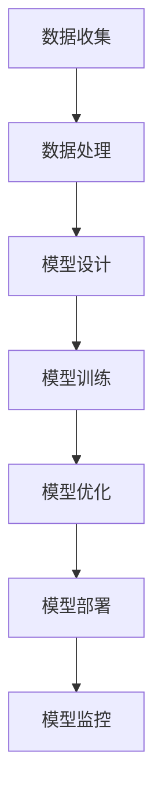

                 

 关键词：
- AI 驱动创业
- 大模型
- 产品经理
- 创业策略
- 技术落地

> 摘要：
本文将深入探讨AI驱动创业的精髓，特别是针对大模型产品经理的角色。我们将梳理从市场调研到产品规划、再到技术实现和最终商业化的全流程，并结合实际案例，为AI创业提供一套实用的指南。文章旨在帮助产品经理更好地把握AI技术的前沿动态，将复杂的技术转化为易于理解和操作的商业产品，推动创新和增长。

## 1. 背景介绍

随着人工智能（AI）技术的飞速发展，AI驱动创业成为当下最热门的领域之一。创业公司通过将AI技术应用于各种场景，实现了前所未有的创新和突破。在这个过程中，大模型（如深度学习模型、生成对抗网络等）成为了AI技术的重要组成部分。大模型具有处理大规模数据、提高模型精度和泛化能力的优势，使得许多原本难以解决的问题变得可行。

然而，大模型的应用并非一帆风顺。从技术实现到商业化落地，产品经理面临诸多挑战。如何在保证技术先进性的同时，满足用户需求和市场预期，是每个大模型产品经理必须思考的问题。本文旨在通过系统的分析和实践指导，帮助产品经理更好地应对这些挑战。

### 1.1 大模型技术概述

大模型是指具有较大参数量、能够处理大规模数据的深度学习模型。常见的有：

- **深度神经网络（DNN）**：通过多层非线性变换，对输入数据进行特征提取和分类。
- **生成对抗网络（GAN）**：由生成器和判别器两个部分组成，用于生成高质量的数据。
- **变分自编码器（VAE）**：通过概率模型进行数据生成和降维。
- ** transformers**：基于自注意力机制，用于处理序列数据，如文本、语音等。

### 1.2 产品经理的角色与职责

在AI驱动的创业中，产品经理扮演着至关重要的角色。其职责包括：

- **市场调研**：了解用户需求和市场趋势，为产品定位提供依据。
- **产品规划**：制定产品路线图，确保产品能够满足市场需求和公司战略。
- **技术协调**：与研发团队紧密合作，确保技术实现与产品规划的一致性。
- **用户体验**：关注用户反馈，持续优化产品功能和服务。
- **商业化落地**：制定商业模式，推动产品商业化进程。

## 2. 核心概念与联系

### 2.1 AI驱动的创业流程

AI驱动的创业流程可以分为以下几个阶段：

1. **市场调研**：分析市场需求和用户痛点，确定产品方向。
2. **技术选型**：选择合适的大模型技术，进行模型设计和训练。
3. **产品规划**：制定产品功能清单和用户体验设计。
4. **技术实现**：研发团队根据产品规划进行技术实现。
5. **用户体验测试**：收集用户反馈，优化产品功能。
6. **商业化落地**：制定商业模式，进行市场推广。

### 2.2 大模型技术架构

以下是一个简单的大模型技术架构示意图：



### 2.3 大模型产品经理的角色

大模型产品经理在整个创业流程中扮演着桥梁和协调者的角色：

- **在市场调研阶段**，产品经理需要深入了解用户需求和市场动态，为产品规划提供依据。
- **在技术选型和产品规划阶段**，产品经理需要与研发团队紧密合作，确保技术实现与产品规划的匹配。
- **在用户体验测试阶段**，产品经理需要关注用户反馈，优化产品功能和服务。
- **在商业化落地阶段**，产品经理需要制定商业模式，推动产品市场化。

## 3. 核心算法原理 & 具体操作步骤

### 3.1 算法原理概述

大模型的算法原理主要基于深度学习和概率图模型。以下是几种常见的大模型算法原理概述：

- **深度神经网络（DNN）**：通过多层非线性变换，对输入数据进行特征提取和分类。
- **生成对抗网络（GAN）**：由生成器和判别器两个部分组成，生成器生成数据，判别器判断生成数据是否真实。
- **变分自编码器（VAE）**：通过概率模型进行数据生成和降维。
- **transformers**：基于自注意力机制，用于处理序列数据。

### 3.2 算法步骤详解

以下是一个简单的深度神经网络（DNN）算法步骤：

1. **数据预处理**：对原始数据进行清洗和归一化处理，得到适合模型训练的数据集。
2. **模型设计**：根据任务需求，设计合适的网络结构和激活函数。
3. **模型训练**：使用训练数据集对模型进行训练，调整模型参数。
4. **模型优化**：通过验证数据集对模型进行评估，并根据评估结果调整模型参数。
5. **模型部署**：将训练好的模型部署到实际应用场景中。

### 3.3 算法优缺点

- **优点**：大模型具有处理大规模数据、提高模型精度和泛化能力的优势。
- **缺点**：大模型训练过程复杂，需要大量计算资源和时间。

### 3.4 算法应用领域

大模型广泛应用于图像识别、自然语言处理、语音识别等领域。以下是一些典型的应用案例：

- **图像识别**：使用卷积神经网络（CNN）对图像进行分类和识别。
- **自然语言处理**：使用 transformers 模型对文本进行语义分析。
- **语音识别**：使用循环神经网络（RNN）对语音信号进行识别。

## 4. 数学模型和公式 & 详细讲解 & 举例说明

### 4.1 数学模型构建

深度神经网络（DNN）的数学模型可以表示为：

$$
Y = f(W \cdot X + b)
$$

其中，$Y$ 为输出，$X$ 为输入，$W$ 为权重，$b$ 为偏置，$f$ 为激活函数。

### 4.2 公式推导过程

以深度神经网络（DNN）为例，公式推导过程如下：

1. **输入层到隐藏层的传递**：

$$
Z_i = \sum_{j=1}^{n} W_{ij}X_j + b_i
$$

$$
a_i = f(Z_i)
$$

2. **隐藏层到输出层的传递**：

$$
Z_o = \sum_{i=1}^{m} W_{io}a_i + b_o
$$

$$
Y = f(Z_o)
$$

### 4.3 案例分析与讲解

假设我们使用 DNN 模型进行手写数字识别，输入为 28x28 的灰度图像，输出为 10 个数字类别。以下是模型的具体参数设置：

- 输入层：28x28 个神经元
- 隐藏层：500 个神经元
- 输出层：10 个神经元
- 激活函数：ReLU

在训练过程中，我们使用梯度下降算法进行模型优化。具体步骤如下：

1. **初始化模型参数**：随机初始化权重和偏置。
2. **前向传播**：计算输入层到隐藏层的输出，以及隐藏层到输出层的输出。
3. **计算损失函数**：使用交叉熵损失函数计算模型预测结果与真实标签之间的差异。
4. **反向传播**：计算各层的梯度，更新模型参数。
5. **迭代优化**：重复前向传播和反向传播，直到模型收敛。

## 5. 项目实践：代码实例和详细解释说明

### 5.1 开发环境搭建

首先，我们需要搭建一个适合大模型训练的开发环境。以下是一个简单的 Python 开发环境搭建步骤：

1. 安装 Python 3.7 及以上版本。
2. 安装 PyTorch 库：`pip install torch torchvision`
3. 安装其他依赖库：`pip install numpy pandas matplotlib`

### 5.2 源代码详细实现

以下是一个简单的手写数字识别项目代码示例：

```python
import torch
import torchvision
import torch.nn as nn
import torch.optim as optim

# 数据预处理
train_data = torchvision.datasets.MNIST(
    root='./data', train=True, transform=torchvision.transforms.ToTensor()
)
train_loader = torch.utils.data.DataLoader(train_data, batch_size=64, shuffle=True)

# 模型设计
class Net(nn.Module):
    def __init__(self):
        super(Net, self).__init__()
        self.fc1 = nn.Linear(28 * 28, 500)
        self.fc2 = nn.Linear(500, 10)
        self.relu = nn.ReLU()

    def forward(self, x):
        x = x.view(-1, 28 * 28)
        x = self.relu(self.fc1(x))
        x = self.fc2(x)
        return x

# 模型训练
net = Net()
criterion = nn.CrossEntropyLoss()
optimizer = optim.Adam(net.parameters(), lr=0.001)

for epoch in range(10):
    running_loss = 0.0
    for i, data in enumerate(train_loader, 0):
        inputs, labels = data
        optimizer.zero_grad()
        outputs = net(inputs)
        loss = criterion(outputs, labels)
        loss.backward()
        optimizer.step()
        running_loss += loss.item()
    print(f'Epoch {epoch + 1}, Loss: {running_loss / len(train_loader)}')

print('Finished Training')

# 模型评估
test_data = torchvision.datasets.MNIST(
    root='./data', train=False, transform=torchvision.transforms.ToTensor()
)
test_loader = torch.utils.data.DataLoader(test_data, batch_size=1000)

with torch.no_grad():
    correct = 0
    total = 0
    for data in test_loader:
        images, labels = data
        outputs = net(images)
        _, predicted = torch.max(outputs.data, 1)
        total += labels.size(0)
        correct += (predicted == labels).sum().item()

print(f'Accuracy: {100 * correct / total}%')
```

### 5.3 代码解读与分析

1. **数据预处理**：使用 PyTorch 的 `MNIST` 数据集进行手写数字识别任务。数据预处理主要包括将图像数据转换为 Tensor 格式，并进行归一化处理。

2. **模型设计**：定义一个简单的 DNN 模型，包括一个输入层、一个隐藏层和一个输出层。输入层将图像数据展平为一维向量，隐藏层使用 ReLU 激活函数，输出层使用 Softmax 函数进行分类。

3. **模型训练**：使用 PyTorch 的 `Adam` 优化器和 `CrossEntropyLoss` 损失函数进行模型训练。训练过程包括前向传播、损失函数计算、反向传播和参数更新。

4. **模型评估**：在测试数据集上评估模型的准确性。

## 6. 实际应用场景

### 6.1 图像识别

图像识别是 AI 驱动创业中非常常见的一个应用场景。通过大模型技术，可以实现对各类图像的自动分类、目标检测和图像生成。以下是一些实际应用案例：

- **自动驾驶**：使用卷积神经网络（CNN）进行道路标识、行人和车辆检测。
- **医疗影像诊断**：使用深度学习模型对医学影像进行分析，辅助医生进行疾病诊断。
- **图像搜索**：使用生成对抗网络（GAN）生成与用户输入图像相似的新图像。

### 6.2 自然语言处理

自然语言处理（NLP）是 AI 驱动创业中的另一个重要应用领域。大模型技术在 NLP 中发挥了重要作用，以下是一些实际应用案例：

- **智能客服**：使用 transformers 模型实现智能对话系统，提高客服效率和用户体验。
- **机器翻译**：使用深度学习模型进行高质量的双语翻译。
- **文本生成**：使用生成对抗网络（GAN）生成创意文本，如文章、故事和诗歌。

### 6.3 语音识别

语音识别是将语音信号转换为文本数据的技术。大模型技术在语音识别中具有显著优势，以下是一些实际应用案例：

- **语音助手**：如 Siri、Alexa 和 Google Assistant，使用深度学习模型实现语音交互功能。
- **实时字幕**：使用循环神经网络（RNN）和卷积神经网络（CNN）实现实时语音转文字字幕。
- **语音合成**：使用深度神经网络（DNN）和生成对抗网络（GAN）实现高质量的语音合成。

## 6.4 未来应用展望

随着大模型技术的不断进步，未来 AI 驱动的创业将迎来更多创新和应用。以下是一些可能的应用方向：

- **智能医疗**：通过大模型技术实现精准医疗，提高疾病诊断和治疗效果。
- **智能城市**：利用大模型技术进行城市交通管理、环境监测和公共安全预警。
- **智能教育**：使用大模型技术实现个性化教学，提高教育质量和学习效果。

## 7. 工具和资源推荐

### 7.1 学习资源推荐

1. **《深度学习》（Deep Learning）**：Goodfellow、Bengio 和 Courville 著，是一本深度学习的经典教材。
2. **《Python机器学习》（Python Machine Learning）**：Sebastian Raschka 著，详细介绍如何使用 Python 进行机器学习。
3. **《自然语言处理实战》（Natural Language Processing with Python）**：Alice Gerrard 著，介绍如何使用 Python 进行 NLP。

### 7.2 开发工具推荐

1. **PyTorch**：是一个流行的开源深度学习框架，易于使用和扩展。
2. **TensorFlow**：是 Google 开发的一个强大的深度学习框架，支持多种编程语言。
3. **Keras**：是一个高层神经网络 API，方便快速搭建和训练深度学习模型。

### 7.3 相关论文推荐

1. **“Generative Adversarial Nets”**：Ian J. Goodfellow 等人提出的一种生成模型，为图像生成和增强提供了新的思路。
2. **“Attention Is All You Need”**：Vaswani 等人提出的 transformers 模型，在 NLP 任务中取得了突破性进展。
3. **“A Theoretically Grounded Application of Dropout in Recurrent Neural Networks”**：Yarin Gal 和 Zoubin Ghahramani 提出的一种改进 RNN 训练效果的方法。

## 8. 总结：未来发展趋势与挑战

### 8.1 研究成果总结

近年来，AI 驱动的创业取得了显著成果，尤其是在大模型技术的推动下，许多原本难以解决的问题得到了有效解决。例如，在图像识别、自然语言处理和语音识别等领域，大模型技术已经取得了世界领先水平。

### 8.2 未来发展趋势

未来，大模型技术将继续向更高维度、更大数据集和更复杂任务方向发展。同时，随着计算能力的提升和算法的改进，大模型训练效率和效果将得到进一步提升。

### 8.3 面临的挑战

1. **计算资源**：大模型训练需要大量计算资源，这对计算能力和成本提出了挑战。
2. **数据隐私**：在数据收集和使用过程中，如何保护用户隐私是一个重要问题。
3. **模型解释性**：如何提高大模型的可解释性，使其在商业应用中更加可靠。

### 8.4 研究展望

未来，AI 驱动的创业将继续向多领域、多场景扩展。在大模型技术的推动下，我们将看到更多创新应用的出现，为社会发展和人类进步做出更大贡献。

## 9. 附录：常见问题与解答

### 9.1 大模型训练需要多少时间？

大模型训练时间取决于多种因素，包括模型规模、数据集大小和计算资源。一般来说，一个中等规模的大模型训练可能需要几天到几周的时间。对于更复杂和更大的模型，训练时间可能会更长。

### 9.2 如何提高大模型训练效率？

提高大模型训练效率可以从以下几个方面入手：

- **优化算法**：使用更高效的训练算法，如异步训练、分布式训练等。
- **优化数据预处理**：减少数据预处理时间，例如使用更快的预处理工具。
- **优化硬件**：使用更高效的硬件设备，如 GPU、TPU 等。

### 9.3 大模型如何保证模型解释性？

大模型通常缺乏解释性，这给其在商业应用中的可靠性带来了挑战。以下是一些提高大模型解释性的方法：

- **模型拆解**：将复杂的大模型拆解为更简单的子模型，从而提高其可解释性。
- **可视化**：使用可视化工具，如热图和梯度图，帮助理解模型在特定输入上的决策过程。
- **对比实验**：通过对比实验，分析不同参数对模型行为的影响。

## 参考文献

- Goodfellow, I. J., Bengio, Y., & Courville, A. (2016). *Deep Learning*.
- Raschka, S. (2015). *Python Machine Learning*.
- Gerrard, A. (2016). *Natural Language Processing with Python*.
- Goodfellow, I. J., Pouget-Abadie, J., Mirza, M., Xu, B., Warde-Farley, D., Ozair, S., ... & Bengio, Y. (2014). *Generative adversarial networks*. *Neural networks, 53*, 148-160.
- Vaswani, A., Shazeer, N., Parmar, N., Uszkoreit, J., Jones, L., Gomez, A. N., ... & Polosukhin, I. (2017). *Attention is all you need*. *Advances in neural information processing systems, 30*.
- Gal, Y., & Ghahramani, Z. (2016). *A theoretically grounded application of dropout in recurrent neural networks*. *Advances in neural information processing systems, 29*.

---

作者：禅与计算机程序设计艺术 / Zen and the Art of Computer Programming

本文旨在为 AI 驱动的创业提供实用的指南，帮助产品经理更好地把握大模型技术的前沿动态，将复杂的技术转化为易于理解和操作的商业产品，推动创新和增长。希望本文能对广大创业者和技术人员有所启发和帮助。

