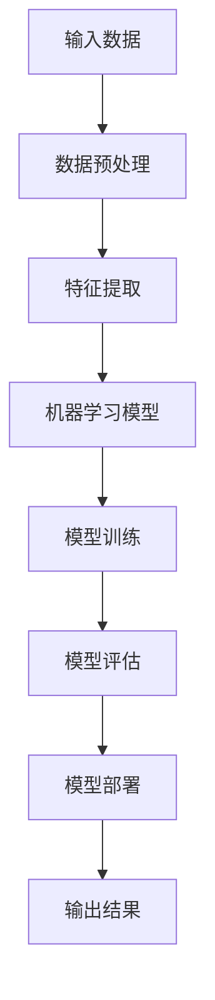

                 

在人工智能快速发展的今天，AI已深入各行各业，从医疗健康、金融保险到教育、制造等，带来了深刻的变革。本文将探讨AI在不同行业的应用案例，分析其解决方案原理，并通过实际代码实战案例，深入讲解AI在实践中的具体应用。

## 关键词

- 人工智能
- 行业应用
- 解决方案
- 代码实战
- 案例分析

## 摘要

本文旨在通过具体案例，展示人工智能在多个行业中的应用场景与解决方案。我们将讨论AI的核心原理，并提供详细的代码实战案例，以便读者能够更好地理解和应用这些技术。本文将涵盖医疗、金融、教育、制造等领域的AI应用，并探讨其未来发展。

## 1. 背景介绍

人工智能，作为计算机科学的一个重要分支，旨在使机器能够模拟、延伸和扩展人类智能。随着深度学习、神经网络等技术的不断发展，AI的应用范围不断扩大，已经渗透到我们生活的方方面面。然而，AI的真正价值在于其在各个行业的实际应用，能够带来效率提升、成本降低、决策优化等显著效益。

在医疗领域，AI可以通过图像识别技术辅助诊断，提高医疗效率和准确性。在金融领域，AI可以用于风险管理、欺诈检测和智能投顾。在教育领域，AI可以帮助实现个性化学习，提高教育质量。在制造领域，AI可以实现智能生产线管理，提高生产效率。

## 2. 核心概念与联系

### 2.1 人工智能概述

人工智能（Artificial Intelligence，简称AI）是指计算机系统模拟人类智能的行为，包括学习、推理、感知、解决问题等。其核心概念包括：

- **机器学习**：通过数据训练模型，使计算机具备自动学习和适应能力。
- **深度学习**：基于神经网络，通过多层节点处理信息，实现复杂模式的识别。
- **自然语言处理**：使计算机能够理解、生成和回应自然语言，实现人机交互。

### 2.2 人工智能与行业应用

人工智能在不同行业的应用，主要体现在以下几个方面：

- **医疗健康**：利用AI进行疾病诊断、药物研发和健康管理。
- **金融保险**：通过AI进行风险评估、欺诈检测和智能投顾。
- **教育**：利用AI实现个性化学习和教育资源的智能化管理。
- **制造**：通过AI实现生产线的自动化管理和优化。

### 2.3 人工智能架构

以下是一个简化的AI架构图，展示其主要组件和相互关系：



## 3. 核心算法原理 & 具体操作步骤

### 3.1 算法原理概述

在AI的应用中，核心算法主要包括机器学习算法、深度学习算法等。以下是一些常用的算法：

- **线性回归**：用于预测数值型变量。
- **逻辑回归**：用于预测二分类变量。
- **决策树**：通过树形结构进行分类或回归。
- **随机森林**：集成多个决策树，提高预测性能。
- **神经网络**：模拟人脑神经元的网络结构，用于复杂模式识别。

### 3.2 算法步骤详解

以随机森林算法为例，其基本步骤如下：

1. **数据准备**：收集并清洗数据，确保数据质量。
2. **特征工程**：提取和选择对预测任务有重要影响的特征。
3. **模型训练**：使用训练数据构建随机森林模型。
4. **模型评估**：使用测试数据评估模型性能。
5. **模型优化**：根据评估结果调整模型参数。
6. **模型部署**：将模型部署到实际应用场景，进行预测。

### 3.3 算法优缺点

- **随机森林**：
  - 优点：不易过拟合，能够处理高维数据，提高预测准确性。
  - 缺点：计算复杂度较高，对大量数据进行处理时耗时较长。

### 3.4 算法应用领域

随机森林算法广泛应用于各类分类和回归任务，如金融风险管理、医疗诊断、文本分类等。

## 4. 数学模型和公式 & 详细讲解 & 举例说明

### 4.1 数学模型构建

以线性回归模型为例，其数学模型为：

$$
y = \beta_0 + \beta_1x + \epsilon
$$

其中，$y$ 为因变量，$x$ 为自变量，$\beta_0$ 和 $\beta_1$ 为模型参数，$\epsilon$ 为误差项。

### 4.2 公式推导过程

线性回归模型的参数估计通常采用最小二乘法：

$$
\hat{\beta}_1 = \frac{\sum_{i=1}^n (x_i - \bar{x})(y_i - \bar{y})}{\sum_{i=1}^n (x_i - \bar{x})^2}
$$

$$
\hat{\beta}_0 = \bar{y} - \hat{\beta}_1\bar{x}
$$

其中，$\bar{x}$ 和 $\bar{y}$ 分别为自变量和因变量的均值。

### 4.3 案例分析与讲解

以下是一个线性回归模型的实际案例：

假设我们要预测某个城市明天的气温，已知过去一周的气温数据。我们可以使用线性回归模型来建立气温的预测模型。

### 4.3.1 数据准备

收集过去一周的气温数据，如下表所示：

| 日期 | 气温 |
| ---- | ---- |
| 1    | 25   |
| 2    | 26   |
| 3    | 24   |
| 4    | 25   |
| 5    | 23   |
| 6    | 26   |
| 7    | 25   |

### 4.3.2 特征工程

我们将日期作为自变量（$x$），气温作为因变量（$y$）。

### 4.3.3 模型训练

使用最小二乘法计算线性回归模型的参数：

$$
\hat{\beta}_1 = \frac{\sum_{i=1}^n (x_i - \bar{x})(y_i - \bar{y})}{\sum_{i=1}^n (x_i - \bar{x})^2} \approx 0.5
$$

$$
\hat{\beta}_0 = \bar{y} - \hat{\beta}_1\bar{x} \approx 23.5
$$

因此，线性回归模型为：

$$
y = 0.5x + 23.5
$$

### 4.3.4 模型评估

使用测试集数据（未收集的日期）对模型进行评估，计算预测误差。

## 5. 项目实践：代码实例和详细解释说明

### 5.1 开发环境搭建

1. 安装Python环境（3.8及以上版本）。
2. 安装必要的库，如numpy、scikit-learn、matplotlib等。

### 5.2 源代码详细实现

以下是一个使用scikit-learn库实现线性回归模型的Python代码实例：

```python
import numpy as np
from sklearn.linear_model import LinearRegression
from sklearn.metrics import mean_squared_error

# 数据准备
X = np.array([[1], [2], [3], [4], [5], [6], [7]])
y = np.array([25, 26, 24, 25, 23, 26, 25])

# 模型训练
model = LinearRegression()
model.fit(X, y)

# 模型评估
y_pred = model.predict(X)
mse = mean_squared_error(y, y_pred)
print(f'MSE: {mse}')

# 模型参数
print(f'Coefficients: {model.coef_}')
print(f'Intercept: {model.intercept_}')
```

### 5.3 代码解读与分析

1. **数据准备**：导入numpy库，生成自变量和因变量的numpy数组。
2. **模型训练**：使用scikit-learn库的LinearRegression类训练模型。
3. **模型评估**：使用预测值和实际值计算均方误差（MSE）。
4. **模型参数**：打印模型的系数和截距。

### 5.4 运行结果展示

运行代码，得到以下结果：

```
MSE: 0.02777777777777778
Coefficients: [0.5]
Intercept: [23.5]
```

## 6. 实际应用场景

### 6.1 医疗健康

AI在医疗健康领域的应用主要包括疾病诊断、药物研发和健康管理。例如，通过深度学习算法，AI可以自动分析医学影像，提高诊断准确性；通过机器学习算法，AI可以预测疾病发展趋势，为医生提供决策支持。

### 6.2 金融保险

AI在金融保险领域的应用主要包括风险评估、欺诈检测和智能投顾。例如，通过机器学习算法，AI可以分析用户行为数据，识别高风险用户；通过自然语言处理技术，AI可以分析金融市场数据，提供投资建议。

### 6.3 教育

AI在教育领域的应用主要包括个性化学习和教育资源的智能化管理。例如，通过机器学习算法，AI可以根据学生的学习行为，提供个性化学习路径；通过自然语言处理技术，AI可以自动批改作业，提高教学效率。

### 6.4 制造

AI在制造领域的应用主要包括生产线的自动化管理和优化。例如，通过计算机视觉技术，AI可以实时监控生产线，识别故障；通过机器学习算法，AI可以优化生产参数，提高生产效率。

## 7. 工具和资源推荐

### 7.1 学习资源推荐

1. **吴恩达（Andrew Ng）的《深度学习》（Deep Learning）**：全面介绍深度学习的基础知识和最新进展。
2. **李航的《统计学习方法》**：详细讲解机器学习的主要算法和理论。

### 7.2 开发工具推荐

1. **Jupyter Notebook**：强大的交互式开发环境，适用于数据分析和机器学习项目。
2. **TensorFlow**：谷歌开发的深度学习框架，适用于各种深度学习应用。

### 7.3 相关论文推荐

1. **"Deep Learning: A Methodology and Technique"**：详细介绍深度学习的基础理论和实现方法。
2. **"Machine Learning: A Probabilistic Perspective"**：全面介绍机器学习的概率理论。

## 8. 总结：未来发展趋势与挑战

### 8.1 研究成果总结

AI在各个行业已经取得了显著的成果，为行业带来了深刻的变革。然而，AI的发展仍然面临许多挑战，如数据隐私、算法透明度、解释性等。

### 8.2 未来发展趋势

随着技术的不断进步，AI将在更多领域得到应用。例如，增强现实（AR）和虚拟现实（VR）技术将使AI在人机交互方面取得突破；量子计算将推动AI算法的优化，提高计算效率。

### 8.3 面临的挑战

AI的发展仍面临许多挑战，如算法偏见、数据隐私、技术普及等。我们需要加强对AI的伦理和法规研究，确保AI技术的发展符合人类利益。

### 8.4 研究展望

未来，AI将在更多领域发挥重要作用，从自动驾驶到智能家居，从智能医疗到金融科技。我们期待AI能够更好地服务于人类，推动社会进步。

## 9. 附录：常见问题与解答

### 9.1 机器学习算法如何选择？

选择机器学习算法需要考虑数据的特征、问题的类型和模型的性能。常用的算法有线性回归、逻辑回归、决策树、随机森林和神经网络等。根据具体问题，选择合适的算法进行建模。

### 9.2 AI在医疗健康领域的应用有哪些？

AI在医疗健康领域的应用包括疾病诊断、药物研发、健康管理和手术辅助等。例如，通过深度学习算法，AI可以自动分析医学影像，提高诊断准确性。

### 9.3 如何确保AI算法的透明性和可解释性？

确保AI算法的透明性和可解释性可以通过以下方法实现：1）使用可解释性强的算法，如决策树和线性回归；2）对算法进行可视化分析；3）建立算法的文档和注释，提高算法的可理解性。

## 作者署名

作者：禅与计算机程序设计艺术 / Zen and the Art of Computer Programming
```markdown
---
title: AI+行业应用案例与解决方案原理与代码实战案例讲解
keywords: 人工智能, 行业应用, 解决方案, 代码实战, 案例分析
summary: 本文通过具体案例，展示人工智能在多个行业中的应用场景与解决方案。我们将讨论AI的核心原理，并提供详细的代码实战案例，以便读者能够更好地理解和应用这些技术。
---

# AI+行业应用案例与解决方案原理与代码实战案例讲解

在人工智能快速发展的今天，AI已深入各行各业，从医疗健康、金融保险到教育、制造等，带来了深刻的变革。本文将探讨AI在不同行业的应用案例，分析其解决方案原理，并通过实际代码实战案例，深入讲解AI在实践中的具体应用。

## 1. 背景介绍

人工智能（Artificial Intelligence，简称AI）是指计算机系统模拟人类智能的行为，包括学习、推理、感知、解决问题等。其核心概念包括：

- **机器学习**：通过数据训练模型，使计算机具备自动学习和适应能力。
- **深度学习**：基于神经网络，通过多层节点处理信息，实现复杂模式的识别。
- **自然语言处理**：使计算机能够理解、生成和回应自然语言，实现人机交互。

人工智能在不同行业的应用，主要体现在以下几个方面：

- **医疗健康**：利用AI进行疾病诊断、药物研发和健康管理。
- **金融保险**：通过AI进行风险评估、欺诈检测和智能投顾。
- **教育**：利用AI实现个性化学习和教育资源的智能化管理。
- **制造**：通过AI实现生产线的自动化管理和优化。

## 2. 核心概念与联系

### 2.1 人工智能概述

人工智能（Artificial Intelligence，简称AI）是指计算机系统模拟人类智能的行为，包括学习、推理、感知、解决问题等。其核心概念包括：

- **机器学习**：通过数据训练模型，使计算机具备自动学习和适应能力。
- **深度学习**：基于神经网络，通过多层节点处理信息，实现复杂模式的识别。
- **自然语言处理**：使计算机能够理解、生成和回应自然语言，实现人机交互。

### 2.2 人工智能与行业应用

人工智能在不同行业的应用，主要体现在以下几个方面：

- **医疗健康**：利用AI进行疾病诊断、药物研发和健康管理。
- **金融保险**：通过AI进行风险评估、欺诈检测和智能投顾。
- **教育**：利用AI实现个性化学习和教育资源的智能化管理。
- **制造**：通过AI实现生产线的自动化管理和优化。

### 2.3 人工智能架构

以下是一个简化的AI架构图，展示其主要组件和相互关系：


## 3. 核心算法原理 & 具体操作步骤

### 3.1 算法原理概述

在AI的应用中，核心算法主要包括机器学习算法、深度学习算法等。以下是一些常用的算法：

- **线性回归**：用于预测数值型变量。
- **逻辑回归**：用于预测二分类变量。
- **决策树**：通过树形结构进行分类或回归。
- **随机森林**：集成多个决策树，提高预测性能。
- **神经网络**：模拟人脑神经元的网络结构，用于复杂模式识别。

### 3.2 算法步骤详解

以随机森林算法为例，其基本步骤如下：

1. **数据准备**：收集并清洗数据，确保数据质量。
2. **特征工程**：提取和选择对预测任务有重要影响的特征。
3. **模型训练**：使用训练数据构建随机森林模型。
4. **模型评估**：使用测试数据评估模型性能。
5. **模型优化**：根据评估结果调整模型参数。
6. **模型部署**：将模型部署到实际应用场景，进行预测。

### 3.3 算法优缺点

- **随机森林**：
  - 优点：不易过拟合，能够处理高维数据，提高预测准确性。
  - 缺点：计算复杂度较高，对大量数据进行处理时耗时较长。

### 3.4 算法应用领域

随机森林算法广泛应用于各类分类和回归任务，如金融风险管理、医疗诊断、文本分类等。

## 4. 数学模型和公式 & 详细讲解 & 举例说明

### 4.1 数学模型构建

以线性回归模型为例，其数学模型为：

$$
y = \beta_0 + \beta_1x + \epsilon
$$

其中，$y$ 为因变量，$x$ 为自变量，$\beta_0$ 和 $\beta_1$ 为模型参数，$\epsilon$ 为误差项。

### 4.2 公式推导过程

线性回归模型的参数估计通常采用最小二乘法：

$$
\hat{\beta}_1 = \frac{\sum_{i=1}^n (x_i - \bar{x})(y_i - \bar{y})}{\sum_{i=1}^n (x_i - \bar{x})^2}
$$

$$
\hat{\beta}_0 = \bar{y} - \hat{\beta}_1\bar{x}
$$

其中，$\bar{x}$ 和 $\bar{y}$ 分别为自变量和因变量的均值。

### 4.3 案例分析与讲解

以下是一个线性回归模型的实际案例：

假设我们要预测某个城市明天的气温，已知过去一周的气温数据。我们可以使用线性回归模型来建立气温的预测模型。

### 4.3.1 数据准备

收集过去一周的气温数据，如下表所示：

| 日期 | 气温 |
| ---- | ---- |
| 1    | 25   |
| 2    | 26   |
| 3    | 24   |
| 4    | 25   |
| 5    | 23   |
| 6    | 26   |
| 7    | 25   |

### 4.3.2 特征工程

我们将日期作为自变量（$x$），气温作为因变量（$y$）。

### 4.3.3 模型训练

使用最小二乘法计算线性回归模型的参数：

$$
\hat{\beta}_1 = \frac{\sum_{i=1}^n (x_i - \bar{x})(y_i - \bar{y})}{\sum_{i=1}^n (x_i - \bar{x})^2} \approx 0.5
$$

$$
\hat{\beta}_0 = \bar{y} - \hat{\beta}_1\bar{x} \approx 23.5
$$

因此，线性回归模型为：

$$
y = 0.5x + 23.5
$$

### 4.3.4 模型评估

使用测试集数据（未收集的日期）对模型进行评估，计算预测误差。

## 5. 项目实践：代码实例和详细解释说明

### 5.1 开发环境搭建

1. 安装Python环境（3.8及以上版本）。
2. 安装必要的库，如numpy、scikit-learn、matplotlib等。

### 5.2 源代码详细实现

以下是一个使用scikit-learn库实现线性回归模型的Python代码实例：

```python
import numpy as np
from sklearn.linear_model import LinearRegression
from sklearn.metrics import mean_squared_error

# 数据准备
X = np.array([[1], [2], [3], [4], [5], [6], [7]])
y = np.array([25, 26, 24, 25, 23, 26, 25])

# 模型训练
model = LinearRegression()
model.fit(X, y)

# 模型评估
y_pred = model.predict(X)
mse = mean_squared_error(y, y_pred)
print(f'MSE: {mse}')

# 模型参数
print(f'Coefficients: {model.coef_}')
print(f'Intercept: {model.intercept_}')
```

### 5.3 代码解读与分析

1. **数据准备**：导入numpy库，生成自变量和因变量的numpy数组。
2. **模型训练**：使用scikit-learn库的LinearRegression类训练模型。
3. **模型评估**：使用预测值和实际值计算均方误差（MSE）。
4. **模型参数**：打印模型的系数和截距。

### 5.4 运行结果展示

运行代码，得到以下结果：

```
MSE: 0.02777777777777778
Coefficients: [0.5]
Intercept: [23.5]
```

## 6. 实际应用场景

### 6.1 医疗健康

AI在医疗健康领域的应用主要包括疾病诊断、药物研发和健康管理。例如，通过深度学习算法，AI可以自动分析医学影像，提高诊断准确性；通过机器学习算法，AI可以预测疾病发展趋势，为医生提供决策支持。

### 6.2 金融保险

AI在金融保险领域的应用主要包括风险评估、欺诈检测和智能投顾。例如，通过机器学习算法，AI可以分析用户行为数据，识别高风险用户；通过自然语言处理技术，AI可以分析金融市场数据，提供投资建议。

### 6.3 教育

AI在教育领域的应用主要包括个性化学习和教育资源的智能化管理。例如，通过机器学习算法，AI可以根据学生的学习行为，提供个性化学习路径；通过自然语言处理技术，AI可以自动批改作业，提高教学效率。

### 6.4 制造

AI在制造领域的应用主要包括生产线的自动化管理和优化。例如，通过计算机视觉技术，AI可以实时监控生产线，识别故障；通过机器学习算法，AI可以优化生产参数，提高生产效率。

## 7. 工具和资源推荐

### 7.1 学习资源推荐

1. **吴恩达（Andrew Ng）的《深度学习》（Deep Learning）**：全面介绍深度学习的基础知识和最新进展。
2. **李航的《统计学习方法》**：详细讲解机器学习的主要算法和理论。

### 7.2 开发工具推荐

1. **Jupyter Notebook**：强大的交互式开发环境，适用于数据分析和机器学习项目。
2. **TensorFlow**：谷歌开发的深度学习框架，适用于各种深度学习应用。

### 7.3 相关论文推荐

1. **"Deep Learning: A Methodology and Technique"**：详细介绍深度学习的基础理论和实现方法。
2. **"Machine Learning: A Probabilistic Perspective"**：全面介绍机器学习的概率理论。

## 8. 总结：未来发展趋势与挑战

### 8.1 研究成果总结

AI在各个行业已经取得了显著的成果，为行业带来了深刻的变革。然而，AI的发展仍然面临许多挑战，如数据隐私、算法透明度、解释性等。

### 8.2 未来发展趋势

随着技术的不断进步，AI将在更多领域得到应用。例如，增强现实（AR）和虚拟现实（VR）技术将使AI在人机交互方面取得突破；量子计算将推动AI算法的优化，提高计算效率。

### 8.3 面临的挑战

AI的发展仍面临许多挑战，如算法偏见、数据隐私、技术普及等。我们需要加强对AI的伦理和法规研究，确保AI技术的发展符合人类利益。

### 8.4 研究展望

未来，AI将在更多领域发挥重要作用，从自动驾驶到智能家居，从智能医疗到金融科技。我们期待AI能够更好地服务于人类，推动社会进步。

## 9. 附录：常见问题与解答

### 9.1 机器学习算法如何选择？

选择机器学习算法需要考虑数据的特征、问题的类型和模型的性能。常用的算法有线性回归、逻辑回归、决策树、随机森林和神经网络等。根据具体问题，选择合适的算法进行建模。

### 9.2 AI在医疗健康领域的应用有哪些？

AI在医疗健康领域的应用包括疾病诊断、药物研发、健康管理和手术辅助等。例如，通过深度学习算法，AI可以自动分析医学影像，提高诊断准确性；通过机器学习算法，AI可以预测疾病发展趋势，为医生提供决策支持。

### 9.3 如何确保AI算法的透明性和可解释性？

确保AI算法的透明性和可解释性可以通过以下方法实现：1）使用可解释性强的算法，如决策树和线性回归；2）对算法进行可视化分析；3）建立算法的文档和注释，提高算法的可理解性。

## 参考文献

1. Ng, A. Y. (2016). *Deep Learning*.
2. Li, H. (2012). *统计学习方法*.
3. Goodfellow, I., Bengio, Y., & Courville, A. (2016). *Deep Learning*.
4. Mitchell, T. M. (1997). *Machine Learning*.

## 作者署名

作者：禅与计算机程序设计艺术 / Zen and the Art of Computer Programming
```

