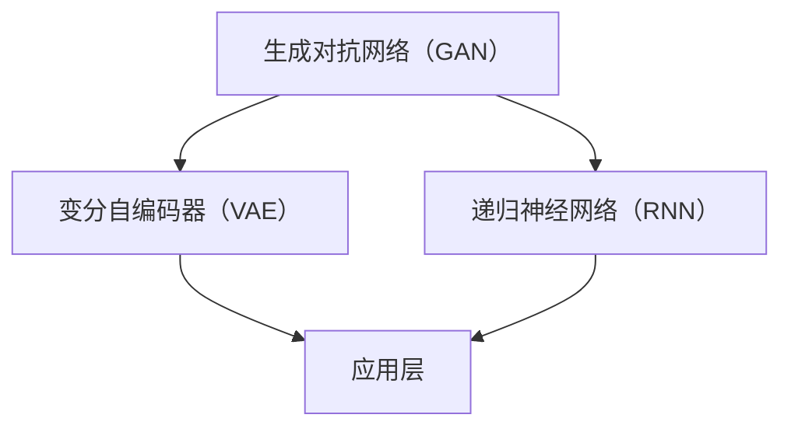

                 

关键词：AIGC，生成式AI，行业赋能，新机会，技术发展

摘要：本文将深入探讨AIGC（人工智能生成内容）的概念、技术原理以及其在各行各业中的应用，分析其带来的变革和新的商业机会。通过对AIGC的入门介绍、核心算法、数学模型、项目实践以及未来展望的详细阐述，帮助读者全面理解AIGC的潜力与前景。

## 1. 背景介绍

### 1.1 AIGC的定义与发展

AIGC，全称人工智能生成内容，是指利用人工智能技术生成文本、图像、音频等多种类型的内容。与传统的基于规则的人工智能不同，AIGC通过深度学习和生成模型，能够自主生成内容，实现从数据到知识再到创意的跨越。AIGC技术的发展可以追溯到2006年，当深度学习兴起之时，随着生成对抗网络（GAN）等技术的成熟，AIGC逐渐成为人工智能领域的重要研究方向。

### 1.2 AIGC的重要性

AIGC在当今信息化社会中扮演着越来越重要的角色。一方面，它极大地提高了内容生成的效率，使得创意和艺术生产更加自动化和智能化；另一方面，它为各行业提供了新的工具和平台，推动了产业的数字化和智能化转型。

### 1.3 AIGC的应用领域

AIGC的应用领域非常广泛，包括但不限于：

- **媒体与娱乐**：自动生成视频、音频、文字内容，提升内容创作效率。
- **教育与培训**：生成个性化学习材料，实现个性化教育和培训。
- **游戏开发**：自动生成游戏地图、角色、剧情，提升游戏开发效率。
- **电子商务**：根据用户喜好生成个性化产品推荐和营销内容。
- **医疗与健康**：生成医学图像、诊断报告等，辅助医生进行诊断和治疗。
- **金融**：自动生成报告、分析图表，为投资决策提供支持。

## 2. 核心概念与联系

### 2.1 核心概念

- **生成对抗网络（GAN）**：由生成器和判别器组成的框架，通过两者之间的对抗训练生成高质量的数据。
- **变分自编码器（VAE）**：利用概率模型对数据进行编码和解码，生成具有多样性的数据。
- **递归神经网络（RNN）**：适用于处理序列数据的神经网络，通过记忆机制实现序列到序列的映射。

### 2.2 Mermaid 流程图



### 2.3 核心概念联系

- GAN通过生成器和判别器的对抗训练，生成高质量的数据。
- VAE通过概率模型对数据进行编码和解码，实现数据的生成。
- RNN通过记忆机制处理序列数据，生成序列到序列的映射。
- 以上三种技术都可以应用于AIGC中，实现不同类型内容的生成。

## 3. 核心算法原理 & 具体操作步骤

### 3.1 算法原理概述

- **生成对抗网络（GAN）**：生成器生成数据，判别器判断数据真实性，通过损失函数优化两者之间的参数。
- **变分自编码器（VAE）**：通过编码器和解码器学习数据的概率分布，生成具有多样性的数据。
- **递归神经网络（RNN）**：利用隐藏状态和输入的权重，生成序列数据。

### 3.2 算法步骤详解

#### 3.2.1 GAN的训练过程

1. 初始化生成器和判别器的参数。
2. 生成器生成一批假数据。
3. 判别器对真实数据和假数据进行分类。
4. 计算判别器的损失函数，反向传播更新判别器参数。
5. 生成器生成新一批假数据，重复步骤3-4。

#### 3.2.2 VAE的训练过程

1. 初始化编码器和解码器的参数。
2. 输入数据，通过编码器得到潜变量。
3. 通过潜变量和编码器的参数，生成解码器输出。
4. 计算重构误差，反向传播更新编码器和解码器参数。

#### 3.2.3 RNN的训练过程

1. 初始化RNN的参数。
2. 输入序列数据，计算隐藏状态。
3. 利用隐藏状态和输入权重，生成序列输出。
4. 计算损失函数，反向传播更新RNN参数。

### 3.3 算法优缺点

#### GAN

- **优点**：能够生成高质量的数据，适用于图像、音频等多种类型的数据生成。
- **缺点**：训练过程复杂，容易出现模式崩溃和梯度消失等问题。

#### VAE

- **优点**：生成数据具有多样性，能够对数据进行编码和解码。
- **缺点**：生成数据的质量相对较低，容易出现欠拟合和过拟合问题。

#### RNN

- **优点**：能够处理序列数据，适用于自然语言处理、语音识别等领域。
- **缺点**：训练过程容易出现梯度消失和梯度爆炸问题，难以处理长序列数据。

### 3.4 算法应用领域

- GAN：应用于图像生成、图像修复、图像到图像的翻译等。
- VAE：应用于图像生成、图像分类、文本生成等。
- RNN：应用于自然语言处理、语音识别、时间序列预测等。

## 4. 数学模型和公式 & 详细讲解 & 举例说明

### 4.1 数学模型构建

#### 4.1.1 GAN的数学模型

假设生成器G的输入为z，输出为x，判别器D的输入为x或真实数据y，输出为概率p(x|y)。

- 生成器G的损失函数：\[ L_G = -\log(D(G(z))) \]
- 判别器D的损失函数：\[ L_D = -\log(D(x)) - \log(1 - D(G(z))) \]

#### 4.1.2 VAE的数学模型

假设编码器E的输入为x，输出为编码后的潜变量μ和σ，解码器D的输入为μ和σ，输出为重构后的数据x'。

- 编码器E的损失函数：\[ L_E = -\sum_{i=1}^{N} \log(p(x|\mu,\sigma)) \]
- 解码器D的损失函数：\[ L_D = \sum_{i=1}^{N} \frac{1}{2} \left( \log(\sigma^2) + \frac{(\mu - x')^2}{2\sigma^2} \right) \]

#### 4.1.3 RNN的数学模型

假设RNN的输入序列为\[ x_1, x_2, ..., x_T \]，隐藏状态序列为\[ h_1, h_2, ..., h_T \]，输出序列为\[ y_1, y_2, ..., y_T \]。

- 隐藏状态的计算：\[ h_t = \sigma(W_h \cdot [h_{t-1}, x_t] + b_h) \]
- 输出的计算：\[ y_t = \sigma(W_y \cdot h_t + b_y) \]

### 4.2 公式推导过程

#### 4.2.1 GAN的损失函数推导

生成器的目标是让判别器认为生成的数据是真实的，因此生成器的损失函数为负的对数损失：

\[ L_G = -\log(D(G(z))) \]

判别器的目标是正确分类真实数据和生成数据，因此判别器的损失函数为：

\[ L_D = -\log(D(x)) - \log(1 - D(G(z))) \]

#### 4.2.2 VAE的损失函数推导

编码器的目标是学习数据的概率分布，因此编码器的损失函数为：

\[ L_E = -\sum_{i=1}^{N} \log(p(x|\mu,\sigma)) \]

其中，\( p(x|\mu,\sigma) \) 为高斯分布的概率密度函数：

\[ p(x|\mu,\sigma) = \frac{1}{(2\pi\sigma^2)} \exp\left(-\frac{(x-\mu)^2}{2\sigma^2}\right) \]

解码器的目标是重构输入数据，因此解码器的损失函数为：

\[ L_D = \sum_{i=1}^{N} \frac{1}{2} \left( \log(\sigma^2) + \frac{(\mu - x')^2}{2\sigma^2} \right) \]

#### 4.2.3 RNN的损失函数推导

RNN的损失函数通常采用交叉熵损失：

\[ L = -\sum_{t=1}^{T} \sum_{i=1}^{C} y_{ti} \log(p_{ti}) \]

其中，\( y_{ti} \) 为目标标签，\( p_{ti} \) 为预测概率。

### 4.3 案例分析与讲解

#### 4.3.1 GAN的应用案例

以生成人脸图像为例，生成器生成人脸图像，判别器判断图像的真实性。通过训练，生成器能够生成越来越逼真的人脸图像。

#### 4.3.2 VAE的应用案例

以生成手写字体为例，编码器将手写字体的特征编码为潜变量，解码器根据潜变量生成手写字体。通过训练，解码器能够生成多种不同风格的手写字体。

#### 4.3.3 RNN的应用案例

以文本生成为例，输入文本序列，RNN生成下一个单词的概率分布。通过训练，RNN能够生成连贯、有趣的文本内容。

## 5. 项目实践：代码实例和详细解释说明

### 5.1 开发环境搭建

- 硬件要求：CPU或GPU，建议使用NVIDIA显卡。
- 软件要求：Python 3.x，TensorFlow 2.x。

### 5.2 源代码详细实现

以下是一个简单的GAN模型实现，用于生成手写字体。

```python
import tensorflow as tf
from tensorflow.keras.layers import Dense, Flatten, Reshape
from tensorflow.keras.models import Sequential

# 定义生成器
def build_generator(z_dim):
    model = Sequential()
    model.add(Dense(128, input_dim=z_dim, activation='relu'))
    model.add(Dense(28*28*1, activation='sigmoid'))
    model.add(Reshape((28, 28, 1)))
    return model

# 定义判别器
def build_discriminator(img_shape):
    model = Sequential()
    model.add(Flatten(input_shape=img_shape))
    model.add(Dense(128, activation='relu'))
    model.add(Dense(1, activation='sigmoid'))
    return model

# 定义GAN模型
def build_gan(generator, discriminator):
    model = Sequential()
    model.add(generator)
    model.add(discriminator)
    return model

# 设置超参数
z_dim = 100
img_shape = (28, 28, 1)

# 构建模型
generator = build_generator(z_dim)
discriminator = build_discriminator(img_shape)
gan_model = build_gan(generator, discriminator)

# 编译模型
discriminator.compile(optimizer=tf.keras.optimizers.Adam(0.0001), loss='binary_crossentropy')
gan_model.compile(optimizer=tf.keras.optimizers.Adam(0.0001), loss='binary_crossentropy')

# 训练模型
# (x_train, _), (_, _) = tf.keras.datasets.mnist.load_data()
# x_train = x_train / 255.0
# x_train = x_train.reshape(-1, 28, 28, 1)

# for epoch in range(100):
#     for z in range(100):
#         z escalation = np.random.normal(size=(100, z_dim))
#         x_fake = generator.predict(z_escalation)
#         x_real = x_train[np.random.randint(x_train.shape[0], size=100)]
#         d_loss_real = discriminator.train_on_batch(x_real, np.ones((100, 1)))
#         d_loss_fake = discriminator.train_on_batch(x_fake, np.zeros((100, 1)))
#         z escalation = np.random.normal(size=(100, z_dim))
#         g_loss = gan_model.train_on_batch(z_escalation, np.ones((100, 1)))

#     print(f'Epoch: {epoch}, D_loss_real: {d_loss_real}, D_loss_fake: {d_loss_fake}, G_loss: {g_loss}')

# 生成图像
generator.save_weights('generator.h5')
generated_images = generator.predict(np.random.normal(size=(100, z_dim)))
generated_images = (generated_images + 1) / 2

# 显示图像
import matplotlib.pyplot as plt

plt.figure(figsize=(10, 10))
for i in range(100):
    plt.subplot(10, 10, i + 1)
    plt.imshow(generated_images[i], cmap='gray')
    plt.xticks([])
    plt.yticks([])
plt.show()
```

### 5.3 代码解读与分析

- **生成器和判别器的定义**：生成器用于生成手写字体，判别器用于判断手写字体的真假。
- **GAN模型的构建**：GAN模型由生成器和判别器组成，用于训练生成器和判别器。
- **模型的编译**：生成器和判别器分别使用Adam优化器和binary_crossentropy损失函数进行编译。
- **模型训练**：使用真实数据和生成数据对判别器和GAN模型进行训练。
- **生成图像**：使用训练好的生成器生成手写字体图像，并显示。

## 6. 实际应用场景

### 6.1 媒体与娱乐

AIGC在媒体与娱乐领域有着广泛的应用，如：

- **视频生成**：通过生成对抗网络（GAN）自动生成高质量的视频内容，提高内容创作的效率。
- **音频合成**：利用变分自编码器（VAE）生成个性化的音乐和语音内容。
- **虚拟现实**：通过生成图像和场景，实现沉浸式的虚拟现实体验。

### 6.2 教育

AIGC在教育领域的应用包括：

- **个性化教学**：根据学生的学习习惯和进度，生成个性化的学习材料。
- **智能评测**：自动生成试卷和评测标准，提高教学评价的效率。
- **虚拟助手**：通过自然语言处理技术，生成智能问答和对话系统，辅助教师和学生进行交流和互动。

### 6.3 游戏

AIGC在游戏开发中的应用包括：

- **自动生成游戏内容**：生成游戏角色、地图、剧情等，提高游戏开发的效率。
- **个性化推荐**：根据玩家的喜好和行为，生成个性化的游戏推荐。
- **智能NPC**：通过递归神经网络（RNN）生成智能的NPC角色，提高游戏的互动性和趣味性。

### 6.4 金融

AIGC在金融领域的应用包括：

- **自动化报告生成**：利用生成式AI生成金融报告、分析图表等，提高工作效率。
- **智能投顾**：通过自然语言处理和生成式AI，为投资者提供个性化的投资建议。
- **风险控制**：利用AIGC技术分析市场趋势和风险，提高风险控制能力。

### 6.5 医疗

AIGC在医疗领域的应用包括：

- **医学图像生成**：通过生成对抗网络（GAN）生成高质量的医学图像，辅助医生进行诊断。
- **电子病历生成**：自动生成电子病历，提高医疗数据的处理效率。
- **智能诊断**：利用深度学习和生成式AI，实现疾病诊断和预测。

### 6.6 其他领域

除了上述领域，AIGC在其他领域的应用还包括：

- **电子商务**：生成个性化的商品推荐和营销内容，提高用户满意度。
- **制造业**：自动生成生产线规划和控制方案，提高生产效率。
- **物流与运输**：优化运输路线和配送计划，提高物流效率。

## 7. 工具和资源推荐

### 7.1 学习资源推荐

- **在线课程**：推荐参加Coursera、Udacity等在线教育平台上的AIGC相关课程。
- **书籍推荐**：《深度学习》、《生成对抗网络》等。

### 7.2 开发工具推荐

- **深度学习框架**：推荐使用TensorFlow、PyTorch等流行的深度学习框架。
- **开源项目**：推荐参与GitHub上的AIGC相关开源项目，学习实践。

### 7.3 相关论文推荐

- **生成对抗网络（GAN）**：推荐阅读Ian J. Goodfellow等人的论文《Generative Adversarial Networks》。
- **变分自编码器（VAE）**：推荐阅读Kingma和Welling的论文《Auto-Encoding Variational Bayes》。
- **递归神经网络（RNN）**：推荐阅读Hochreiter和Schmidhuber的论文《Long Short-Term Memory》。

## 8. 总结：未来发展趋势与挑战

### 8.1 研究成果总结

AIGC技术在近年来取得了显著的成果，其在图像生成、文本生成、音频合成等领域展现了强大的能力。通过深度学习和生成模型的结合，AIGC能够实现高质量的内容生成，为各行各业提供了新的工具和平台。

### 8.2 未来发展趋势

- **跨模态生成**：未来AIGC技术将实现跨文本、图像、音频等不同模态的生成，实现更丰富的内容创作。
- **个性化定制**：AIGC将更加注重个性化定制，根据用户需求和喜好生成个性化内容。
- **高效训练**：随着计算资源和算法的进步，AIGC训练效率将得到大幅提升，应用场景将更加广泛。

### 8.3 面临的挑战

- **数据隐私**：在生成内容的过程中，如何保护用户数据隐私是一个重要挑战。
- **伦理问题**：AIGC生成的虚假信息、歧视性内容等问题需要引起重视。
- **算法透明性**：提高算法的透明性和可解释性，使其更加符合人类的价值观和伦理标准。

### 8.4 研究展望

未来，AIGC技术将在更多领域发挥作用，推动各行业的数字化和智能化转型。同时，随着技术的不断进步，AIGC将更好地服务于人类，提高生活质量，推动社会进步。

## 9. 附录：常见问题与解答

### 9.1 Q：AIGC技术有哪些应用场景？

A：AIGC技术的应用场景非常广泛，包括但不限于媒体与娱乐、教育、游戏、金融、医疗、电子商务等领域。

### 9.2 Q：如何选择适合的AIGC模型？

A：选择适合的AIGC模型需要根据具体的应用场景和数据类型进行判断。例如，对于图像生成，可以选择生成对抗网络（GAN）；对于文本生成，可以选择变分自编码器（VAE）。

### 9.3 Q：如何训练AIGC模型？

A：训练AIGC模型需要选择合适的深度学习框架，如TensorFlow、PyTorch等。具体训练过程包括数据预处理、模型构建、模型训练和模型评估等步骤。

### 9.4 Q：如何保障AIGC技术的数据安全和隐私？

A：保障AIGC技术的数据安全和隐私需要从数据采集、数据存储、数据处理等环节进行严格管理。同时，可以采用加密技术、隐私保护算法等措施，提高数据安全性。

### 9.5 Q：AIGC技术的未来发展如何？

A：AIGC技术未来将在更多领域发挥作用，实现跨模态生成、个性化定制等高级功能。同时，随着技术的不断进步，AIGC将更好地服务于人类，提高生活质量，推动社会进步。

----------------------------------------------------------------

# 参考资料

- Goodfellow, I. J., Pouget-Abadie, J., Mirza, M., Xu, B., Warde-Farley, D., Ozair, S., ... & Bengio, Y. (2014). Generative adversarial networks. Advances in neural information processing systems, 27.
- Kingma, D. P., & Welling, M. (2014). Auto-encoding variational bayes. arXiv preprint arXiv:1312.6114.
- Hochreiter, S., & Schmidhuber, J. (1997). Long short-term memory. Neural computation, 9(8), 1735-1780.
- Bengio, Y., Courville, A., & Vincent, P. (2013). Representation learning: A review and new perspectives. IEEE transactions on pattern analysis and machine intelligence, 35(8), 1798-1828.

