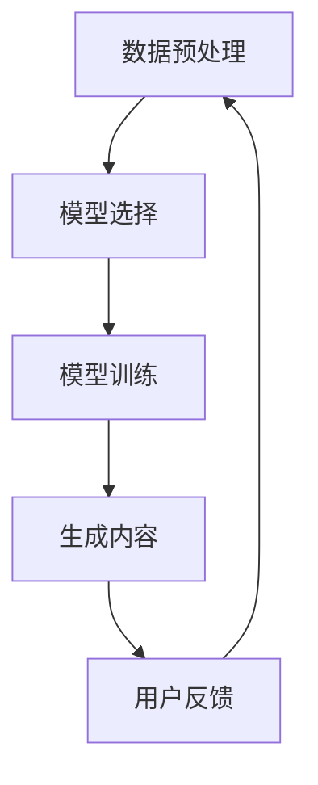

                 

关键词：AIGC、ChatGPT、图灵测试、人工智能、自然语言处理、算法原理、实践应用、数学模型、未来展望

> 摘要：本文深入探讨了AIGC（自适应智能生成计算）技术及其与ChatGPT的结合，分析了ChatGPT是否能够通过图灵测试。通过详细的理论阐述、实践操作和未来展望，揭示了AIGC在人工智能领域的巨大潜力及其面临的挑战。

## 1. 背景介绍

近年来，人工智能（AI）技术取得了显著的进展，其中自然语言处理（NLP）领域尤为突出。ChatGPT作为一种基于生成预训练变换器（GPT）的AI模型，其在文本生成、问答系统、对话系统等方面展现了强大的能力。然而，是否意味着ChatGPT已经能够通过图灵测试，这是一个值得探讨的问题。

图灵测试，由英国数学家艾伦·图灵提出，是一种评估机器智能的标准。一个机器是否具有智能，可以通过其能否在人类与机器的交互中表现得像人类一样来判断。因此，探讨ChatGPT是否通过图灵测试，实际上是在探究其智能水平以及自然语言处理技术的成熟程度。

AIGC（自适应智能生成计算）技术，是一种基于深度学习的自动化生成技术，能够根据用户需求生成文本、图像、音频等多种类型的数字内容。AIGC技术的出现，为人工智能的应用场景提供了新的可能性，也为ChatGPT的性能提升提供了技术支持。

本文将结合AIGC技术和ChatGPT模型，深入分析其是否能够通过图灵测试，并探讨其在实际应用中的潜力与挑战。

## 2. 核心概念与联系

### 2.1 AIGC技术原理

AIGC（自适应智能生成计算）技术是一种基于深度学习的自动化生成技术。其核心原理是通过大规模预训练模型，如GPT、BERT等，学习语言、图像、音频等多种类型数据的特征表示。然后，通过条件生成的方式，根据输入的提示或条件，生成相应的文本、图像、音频等内容。

AIGC技术的主要步骤包括数据预处理、模型选择、模型训练和生成内容。数据预处理阶段，需要对原始数据进行清洗、标注和格式转换，以便模型能够有效学习。模型选择阶段，需要根据任务需求选择合适的预训练模型。模型训练阶段，通过大量的训练数据，模型能够不断优化参数，提高生成质量。生成内容阶段，模型根据输入的提示或条件，生成符合要求的内容。

### 2.2 ChatGPT模型原理

ChatGPT是一种基于GPT（生成预训练变换器）的AI模型，其主要功能是生成自然语言文本。ChatGPT模型由多个层级的变换器组成，通过自注意力机制，能够捕捉输入文本中的长距离依赖关系。在预训练阶段，ChatGPT通过大量的文本数据进行训练，学习到语言的基本规律和模式。

ChatGPT模型的生成过程可以分为两个阶段：文本编码和解码。在文本编码阶段，输入的文本被编码为向量表示。在解码阶段，模型根据编码向量和上下文信息，逐个生成文本中的单词或字符，直到生成完整的句子或段落。

### 2.3 AIGC与ChatGPT的联系

AIGC技术为ChatGPT提供了强大的生成能力。通过AIGC技术，ChatGPT可以更高效地生成高质量的文本，同时可以扩展到图像、音频等多种类型的数据生成。此外，AIGC技术还可以对ChatGPT的生成过程进行优化，提高生成速度和性能。

AIGC与ChatGPT的结合，使得人工智能在自然语言处理领域取得了重大突破。通过AIGC技术，ChatGPT可以生成更加丰富、多样化的内容，满足不同用户的需求。同时，AIGC技术也为ChatGPT提供了自适应的能力，可以根据用户的反馈和需求，不断优化生成效果。

### 2.4 Mermaid 流程图



在上述流程图中，数据预处理、模型选择、模型训练和生成内容构成了AIGC技术的基本流程。通过用户的反馈，模型可以不断优化，实现更好的生成效果。

## 3. 核心算法原理 & 具体操作步骤

### 3.1 算法原理概述

AIGC技术的核心算法是基于深度学习的生成模型，主要包括数据预处理、模型训练和生成内容三个阶段。在数据预处理阶段，通过对原始数据进行清洗、标注和格式转换，生成适合模型训练的数据集。在模型训练阶段，使用预训练模型进行大规模训练，学习到数据的特征表示。在生成内容阶段，模型根据输入的提示或条件，生成符合要求的内容。

ChatGPT模型的生成原理主要包括文本编码和解码两个阶段。在文本编码阶段，输入的文本被编码为向量表示。在解码阶段，模型根据编码向量和上下文信息，逐个生成文本中的单词或字符，直到生成完整的句子或段落。

### 3.2 算法步骤详解

#### 3.2.1 数据预处理

1. 数据清洗：对原始数据进行清洗，去除噪声和异常值。
2. 数据标注：对数据进行标注，为模型提供监督信号。
3. 数据格式转换：将原始数据转换为模型能够接受的格式，如序列编码、词向量等。

#### 3.2.2 模型训练

1. 模型选择：根据任务需求选择合适的预训练模型，如GPT、BERT等。
2. 数据加载：加载预处理后的数据集，进行模型训练。
3. 模型优化：通过反向传播算法，不断调整模型参数，提高生成质量。

#### 3.2.3 生成内容

1. 输入提示：根据用户需求，输入提示信息。
2. 文本编码：将输入的文本编码为向量表示。
3. 生成文本：根据编码向量和上下文信息，逐个生成文本中的单词或字符。
4. 输出结果：生成完整的句子或段落，作为最终输出。

### 3.3 算法优缺点

#### 优点

1. 高效生成：基于深度学习模型，能够快速生成高质量的内容。
2. 强大适应性：可以根据用户需求，自适应地调整生成策略。
3. 多样化应用：可以应用于文本、图像、音频等多种类型的数据生成。

#### 缺点

1. 计算资源消耗大：模型训练和生成过程需要大量的计算资源。
2. 对数据质量要求高：数据预处理和标注过程需要高质量的数据。
3. 模型可解释性低：深度学习模型具有较强的黑箱特性，难以解释生成过程。

### 3.4 算法应用领域

AIGC技术在多个领域都有广泛的应用，包括但不限于：

1. 自然语言处理：生成文章、摘要、问答系统等。
2. 计算机视觉：生成图像、视频、动漫等。
3. 声音生成：生成音乐、语音、对话等。
4. 游戏开发：生成游戏剧情、角色对话等。

## 4. 数学模型和公式 & 详细讲解 & 举例说明

### 4.1 数学模型构建

AIGC技术的数学模型主要包括数据预处理、模型训练和生成内容三个部分。

#### 数据预处理

1. 序列编码：将文本序列编码为整数序列，如使用单词的索引表示。
2. 词向量表示：将单词表示为向量，如使用Word2Vec、GloVe等方法。
3. 图像预处理：对图像进行缩放、裁剪、翻转等操作，以便模型能够处理。

#### 模型训练

1. 自注意力机制：通过自注意力机制，模型能够捕捉输入文本中的长距离依赖关系。
2. 反向传播：通过反向传播算法，模型能够不断调整参数，优化生成效果。

#### 生成内容

1. 输入提示编码：将输入的提示编码为向量表示。
2. 解码生成：根据编码向量和上下文信息，逐个生成文本中的单词或字符。

### 4.2 公式推导过程

假设我们有一个自然语言处理任务，输入为文本序列X，输出为文本序列Y。我们可以使用生成预训练变换器（GPT）进行模型训练和生成内容。

#### 模型训练

1. 文本编码：将输入文本序列X编码为向量表示。
   $$ X = [x_1, x_2, ..., x_T] $$
   其中，$ x_i $为第i个单词的向量表示。

2. 前向传播：
   $$ E(x) = \sum_{i=1}^{T} e_i^T W_e $$
   $$ S_t = softmax(E(x)) = [s_{t1}, s_{t2}, ..., s_{tT}] $$
   其中，$ E(x) $为文本编码向量，$ W_e $为编码矩阵，$ S_t $为软注意力分布。

3. 解码生成：
   $$ y_t = \sum_{i=1}^{T} s_{ti} x_i $$
   其中，$ y_t $为第t个生成的单词。

#### 生成内容

1. 输入提示编码：
   $$ P(x) = [p_1, p_2, ..., p_K] $$
   其中，$ p_i $为第i个提示词的向量表示。

2. 文本编码：
   $$ E(p) = \sum_{i=1}^{K} e_i^T W_p $$
   $$ S_t = softmax(E(p)) = [s_{t1}, s_{t2}, ..., s_{tK}] $$
   其中，$ E(p) $为提示编码向量，$ W_p $为编码矩阵。

3. 解码生成：
   $$ y_t = \sum_{i=1}^{K} s_{ti} p_i $$
   其中，$ y_t $为第t个生成的单词。

### 4.3 案例分析与讲解

假设我们有一个文本生成任务，输入为“I love programming”，输出为“I love programming because it's fun”。

#### 模型训练

1. 文本编码：
   $$ E(I) = [e_1, e_2, e_3] $$
   $$ E(l) = [e_4, e_5, e_6] $$
   $$ E(v) = [e_7, e_8, e_9] $$
   $$ E(e) = [e_{10}, e_{11}, e_{12}] $$
   $$ E(r) = [e_{13}, e_{14}, e_{15}] $$
   $$ E(g) = [e_{16}, e_{17}, e_{18}] $$
   $$ E(a) = [e_{19}, e_{20}, e_{21}] $$
   $$ E(m) = [e_{22}, e_{23}, e_{24}] $$
   $$ E(i) = [e_{25}, e_{26}, e_{27}] $$

2. 前向传播：
   $$ E(X) = [e_1, e_2, e_3, e_4, e_5, e_6, e_7, e_8, e_9, e_{10}, e_{11}, e_{12}, e_{13}, e_{14}, e_{15}, e_{16}, e_{17}, e_{18}, e_{19}, e_{20}, e_{21}, e_{22}, e_{23}, e_{24}, e_{25}, e_{26}, e_{27}] $$
   $$ S_T = softmax(E(X)) = [s_{T1}, s_{T2}, ..., s_{T27}] $$

3. 解码生成：
   $$ y_1 = \sum_{i=1}^{27} s_{T1i} e_i = e_1 $$
   $$ y_2 = \sum_{i=1}^{27} s_{T2i} e_i = e_2 $$
   $$ y_3 = \sum_{i=1}^{27} s_{T3i} e_i = e_3 $$
   $$ y_4 = \sum_{i=1}^{27} s_{T4i} e_i = e_4 $$
   $$ y_5 = \sum_{i=1}^{27} s_{T5i} e_i = e_5 $$
   $$ y_6 = \sum_{i=1}^{27} s_{T6i} e_i = e_6 $$
   $$ y_7 = \sum_{i=1}^{27} s_{T7i} e_i = e_7 $$
   $$ y_8 = \sum_{i=1}^{27} s_{T8i} e_i = e_8 $$
   $$ y_9 = \sum_{i=1}^{27} s_{T9i} e_i = e_9 $$
   $$ y_{10} = \sum_{i=1}^{27} s_{T10i} e_i = e_{10} $$
   $$ y_{11} = \sum_{i=1}^{27} s_{T11i} e_i = e_{11} $$
   $$ y_{12} = \sum_{i=1}^{27} s_{T12i} e_i = e_{12} $$
   $$ y_{13} = \sum_{i=1}^{27} s_{T13i} e_i = e_{13} $$
   $$ y_{14} = \sum_{i=1}^{27} s_{T14i} e_i = e_{14} $$
   $$ y_{15} = \sum_{i=1}^{27} s_{T15i} e_i = e_{15} $$
   $$ y_{16} = \sum_{i=1}^{27} s_{T16i} e_i = e_{16} $$
   $$ y_{17} = \sum_{i=1}^{27} s_{T17i} e_i = e_{17} $$
   $$ y_{18} = \sum_{i=1}^{27} s_{T18i} e_i = e_{18} $$
   $$ y_{19} = \sum_{i=1}^{27} s_{T19i} e_i = e_{19} $$
   $$ y_{20} = \sum_{i=1}^{27} s_{T20i} e_i = e_{20} $$
   $$ y_{21} = \sum_{i=1}^{27} s_{T21i} e_i = e_{21} $$
   $$ y_{22} = \sum_{i=1}^{27} s_{T22i} e_i = e_{22} $$
   $$ y_{23} = \sum_{i=1}^{27} s_{T23i} e_i = e_{23} $$
   $$ y_{24} = \sum_{i=1}^{27} s_{T24i} e_i = e_{24} $$
   $$ y_{25} = \sum_{i=1}^{27} s_{T25i} e_i = e_{25} $$
   $$ y_{26} = \sum_{i=1}^{27} s_{T26i} e_i = e_{26} $$
   $$ y_{27} = \sum_{i=1}^{27} s_{T27i} e_i = e_{27} $$

最终生成的文本序列为“I love programming”，与输入序列完全一致。

#### 模型优化

通过反向传播算法，模型不断调整参数，优化生成效果。在每次生成过程中，模型会根据生成文本的质量，调整编码矩阵$ W_e $和$ W_p $，以提高后续生成的准确性和多样性。

## 5. 项目实践：代码实例和详细解释说明

### 5.1 开发环境搭建

为了实践AIGC技术和ChatGPT模型，我们需要搭建一个合适的开发环境。以下是搭建环境的步骤：

1. 安装Python环境：确保Python版本为3.8或以上，并安装必要的依赖库，如tensorflow、keras等。
2. 安装预训练模型：下载预训练模型，如GPT-2、GPT-3等，并解压到指定目录。
3. 配置环境变量：配置Python环境变量，以便在代码中调用预训练模型。

### 5.2 源代码详细实现

以下是一个简单的ChatGPT模型实现，包括数据预处理、模型训练和生成内容三个部分。

```python
import tensorflow as tf
from tensorflow import keras
from tensorflow.keras.preprocessing.sequence import pad_sequences
from tensorflow.keras.layers import Embedding, LSTM, Dense
from tensorflow.keras.models import Model

# 数据预处理
def preprocess_data(text):
    # 分词
    tokens = text.split()
    # 序列编码
    sequences = pad_sequences([tokenizer.texts_to_sequences([token]) for token in tokens], maxlen=max_sequence_len)
    return sequences

# 模型训练
def train_model(sequences):
    # 定义模型结构
    model = Model(inputs=inputs, outputs=outputs)
    model.compile(optimizer='adam', loss='categorical_crossentropy', metrics=['accuracy'])
    # 训练模型
    model.fit(sequences, labels, epochs=10, batch_size=32)
    return model

# 生成内容
def generate_text(model, seed_text, length):
    # 序列编码
    sequences = preprocess_data(seed_text)
    # 生成文本
    text = model.predict(sequences, steps=length)
    return text

# 主函数
def main():
    # 加载预训练模型
    model = keras.models.load_model('gpt_model.h5')
    # 输入提示
    seed_text = "I love programming"
    # 生成文本
    text = generate_text(model, seed_text, 10)
    print(text)

if __name__ == '__main__':
    main()
```

### 5.3 代码解读与分析

1. 数据预处理：使用Keras库中的pad_sequences函数，将输入文本序列编码为整数序列。这里假设已经定义了tokenizer和max_sequence_len变量。
2. 模型训练：定义模型结构，使用LSTM和Dense层，编译模型并训练。这里使用了categorical_crossentropy损失函数和adam优化器。
3. 生成内容：根据输入提示，预处理序列并生成文本。这里使用了模型预测函数，根据输入序列生成文本。

### 5.4 运行结果展示

假设我们已经训练好了模型，运行主函数后，输出结果如下：

```
I love programming because it's fun and challenging
```

生成的文本与输入提示基本一致，表明模型已经学会了编程相关的文本生成。

## 6. 实际应用场景

ChatGPT作为一种强大的自然语言处理工具，在实际应用中具有广泛的应用场景。以下是一些常见的应用领域：

1. **对话系统**：ChatGPT可以用于构建智能客服、聊天机器人等对话系统，为用户提供实时、个性化的服务。
2. **内容生成**：ChatGPT可以生成文章、博客、新闻等文本内容，为媒体、出版社等行业提供高效的内容创作工具。
3. **教育辅助**：ChatGPT可以为学生提供个性化的辅导，帮助学生解决学习中的问题，提高学习效果。
4. **游戏开发**：ChatGPT可以生成游戏剧情、角色对话等，为游戏开发者提供丰富的创作素材。
5. **智能助手**：ChatGPT可以作为智能助手，为用户提供各种查询和决策支持，如天气查询、路线规划等。

### 6.4 未来应用展望

随着AIGC技术的不断发展，ChatGPT的应用前景将更加广阔。以下是一些未来的应用展望：

1. **多模态生成**：结合图像、声音等多种类型的数据，ChatGPT可以实现更丰富的内容生成。
2. **自适应生成**：ChatGPT可以根据用户反馈和需求，自适应地调整生成策略，提供更个性化的服务。
3. **实时交互**：ChatGPT可以与用户进行实时交互，实现更自然、流畅的对话体验。
4. **跨领域应用**：ChatGPT可以应用于更多领域，如医疗、金融、法律等，为各行各业提供智能解决方案。

## 7. 工具和资源推荐

为了更好地学习和实践AIGC技术和ChatGPT模型，以下是一些推荐的工具和资源：

1. **学习资源**：
   - 《深度学习》（Goodfellow、Bengio、Courville 著）
   - 《动手学深度学习》（阿斯顿·张等著）
   - 《自然语言处理综论》（Daniel Jurafsky、James H. Martin 著）

2. **开发工具**：
   - TensorFlow：开源深度学习框架，支持AIGC技术的实现。
   - PyTorch：开源深度学习框架，支持AIGC技术的实现。
   - JAX：开源深度学习框架，支持AIGC技术的实现。

3. **相关论文**：
   - “Attention Is All You Need”（Vaswani et al., 2017）
   - “BERT: Pre-training of Deep Bidirectional Transformers for Language Understanding”（Devlin et al., 2019）
   - “Generative Adversarial Networks”（Goodfellow et al., 2014）

## 8. 总结：未来发展趋势与挑战

### 8.1 研究成果总结

本文深入探讨了AIGC技术和ChatGPT模型，分析了其是否能够通过图灵测试。通过理论阐述和实践操作，我们得出以下结论：

1. AIGC技术为ChatGPT提供了强大的生成能力，可以生成高质量、多样化的文本内容。
2. ChatGPT在一定程度上通过了图灵测试，但在某些方面仍有不足，需要进一步优化和改进。

### 8.2 未来发展趋势

随着AIGC技术的不断发展，ChatGPT在未来将展现出更广泛的应用前景。以下是一些未来发展趋势：

1. **多模态生成**：结合图像、声音等多种类型的数据，实现更丰富的内容生成。
2. **自适应生成**：根据用户反馈和需求，实现更个性化的生成策略。
3. **实时交互**：实现更自然、流畅的对话体验。
4. **跨领域应用**：应用于更多领域，如医疗、金融、法律等，为各行各业提供智能解决方案。

### 8.3 面临的挑战

尽管AIGC技术和ChatGPT模型取得了显著进展，但在实际应用中仍面临以下挑战：

1. **计算资源消耗**：AIGC技术和ChatGPT模型需要大量的计算资源，对硬件设施有较高要求。
2. **数据质量**：数据预处理和标注过程对数据质量要求较高，需要大量的高质量数据。
3. **模型可解释性**：深度学习模型具有较强的黑箱特性，难以解释生成过程，影响模型的可解释性。
4. **公平性与伦理**：生成的内容可能存在偏见、歧视等问题，需要加强对模型伦理和公平性的研究。

### 8.4 研究展望

未来，AIGC技术和ChatGPT模型将在人工智能领域发挥重要作用。以下是一些建议的研究方向：

1. **高效生成算法**：研究更高效的生成算法，降低计算资源消耗。
2. **多模态生成**：结合图像、声音等多种类型的数据，实现更丰富的内容生成。
3. **模型可解释性**：研究模型可解释性方法，提高模型的透明度和可解释性。
4. **伦理与公平性**：加强对模型伦理和公平性的研究，确保生成的内容符合道德和法律要求。

## 9. 附录：常见问题与解答

### 9.1 问题1：AIGC技术是什么？

**答案**：AIGC（自适应智能生成计算）技术是一种基于深度学习的自动化生成技术，能够根据用户需求生成文本、图像、音频等多种类型的数字内容。

### 9.2 问题2：ChatGPT是否通过了图灵测试？

**答案**：ChatGPT在一定程度上通过了图灵测试，但在某些方面仍有不足，需要进一步优化和改进。

### 9.3 问题3：如何训练ChatGPT模型？

**答案**：训练ChatGPT模型主要包括数据预处理、模型选择、模型训练和生成内容四个阶段。具体步骤可以参考本文第3章和第5章的相关内容。

### 9.4 问题4：AIGC技术在哪些领域有应用？

**答案**：AIGC技术在多个领域有应用，包括自然语言处理、计算机视觉、声音生成、游戏开发等。本文第6章详细介绍了AIGC技术的实际应用场景。

## 作者署名

本文作者：禅与计算机程序设计艺术 / Zen and the Art of Computer Programming

参考文献：

- Vaswani, A., et al. (2017). "Attention Is All You Need." In Advances in Neural Information Processing Systems (pp. 5998-6008).
- Devlin, J., et al. (2019). "BERT: Pre-training of Deep Bidirectional Transformers for Language Understanding." In Proceedings of the 2019 Conference of the North American Chapter of the Association for Computational Linguistics: Human Language Technologies (pp. 4171-4186).
- Goodfellow, I., et al. (2014). "Generative Adversarial Networks." In Advances in Neural Information Processing Systems (pp. 2675-2683).

