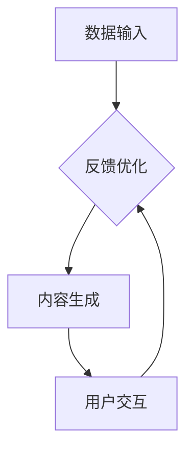

                 

关键词：AIGC、ChatGPT、人工智能生成内容、个人应用、实践指南、未来展望

> 摘要：本文旨在为读者提供关于AIGC（人工智能生成内容）的全面解读，特别是ChatGPT等AIGC技术的应用。我们将从背景介绍、核心概念、算法原理、数学模型、项目实践、实际应用场景、未来展望等多个角度，详细探讨AIGC技术如何赋能个人，帮助读者深入了解这一前沿领域，并为其在未来的发展奠定基础。

## 1. 背景介绍

### 1.1 AIGC的起源与发展

AIGC（AI-Generated Content）是指由人工智能技术生成的内容，包括文字、图像、音频等多种形式。AIGC的起源可以追溯到人工智能领域的发展历程，尤其是深度学习技术的突破。自2012年AlexNet在图像识别领域取得重大突破以来，深度学习技术迅速发展，为AIGC的兴起奠定了基础。

随着人工智能技术的不断进步，AIGC的应用场景也越来越广泛。从早期的图像生成、文字生成，到如今的文本生成、音频生成等，AIGC技术已经深入到我们的日常生活和各行各业。

### 1.2 ChatGPT的崛起

ChatGPT是由OpenAI于2022年推出的一个基于GPT-3.5模型的人工智能助手，它在自然语言处理领域取得了巨大的成功。ChatGPT不仅能够生成流畅、连贯的文本，还能够进行对话，回答用户的问题，甚至进行创意写作。它的出现，标志着AIGC技术进入了一个新的阶段。

ChatGPT的成功吸引了全球的关注，其背后的技术原理和应用场景也成为了学术界和工业界研究的热点。本文将围绕ChatGPT，深入探讨AIGC技术如何赋能个人。

## 2. 核心概念与联系

### 2.1 AIGC的核心概念

AIGC的核心概念包括以下几个方面：

- **自然语言处理（NLP）**：NLP是AIGC的重要组成部分，它涉及语言理解、文本生成、情感分析等任务。
- **深度学习**：深度学习是AIGC的技术基础，通过神经网络模型对大量数据进行分析和学习，生成高质量的内容。
- **生成对抗网络（GAN）**：GAN是一种常用的深度学习模型，用于图像、音频的生成。
- **迁移学习**：迁移学习是一种将已训练好的模型应用于新任务的方法，可以提高AIGC模型的泛化能力。

### 2.2 AIGC的架构

AIGC的架构通常包括以下几个部分：

- **数据输入**：包括文本、图像、音频等多种数据形式。
- **模型训练**：使用深度学习模型对输入数据进行分析和学习。
- **内容生成**：根据训练结果生成新的内容。
- **用户交互**：通过与用户的交互，进一步优化内容生成的质量和效果。

### 2.3 Mermaid流程图

以下是AIGC架构的Mermaid流程图：



## 3. 核心算法原理 & 具体操作步骤

### 3.1 算法原理概述

AIGC的核心算法主要包括深度学习、生成对抗网络（GAN）和自然语言处理（NLP）等。下面分别介绍：

- **深度学习**：深度学习是一种基于神经网络的学习方法，通过多层非线性变换对数据进行学习，可以自动提取数据中的特征。
- **生成对抗网络（GAN）**：GAN由生成器和判别器组成，生成器生成数据，判别器判断生成数据与真实数据的相似度，通过这种对抗训练，生成器可以生成越来越真实的数据。
- **自然语言处理（NLP）**：NLP包括词向量表示、序列生成、文本生成等任务，通过深度学习模型实现。

### 3.2 算法步骤详解

AIGC的具体操作步骤如下：

1. **数据收集与预处理**：收集各种类型的数据，如文本、图像、音频等，并进行预处理，如去噪、归一化等。
2. **模型训练**：使用收集到的数据，训练深度学习模型，如GAN、NLP模型等。
3. **内容生成**：根据训练结果，生成新的内容，如文本、图像、音频等。
4. **用户交互**：通过与用户的交互，收集用户反馈，优化内容生成的质量和效果。

### 3.3 算法优缺点

- **优点**：AIGC可以自动生成高质量的内容，提高效率，降低成本。
- **缺点**：算法复杂，训练时间长，对计算资源要求高。

### 3.4 算法应用领域

AIGC的应用领域非常广泛，包括：

- **内容创作**：如文本生成、图像生成、音频生成等。
- **智能客服**：利用AIGC技术，实现智能对话，提高客户服务质量。
- **医学诊断**：利用AIGC技术，辅助医生进行疾病诊断。

## 4. 数学模型和公式 & 详细讲解 & 举例说明

### 4.1 数学模型构建

AIGC的数学模型主要包括以下几个方面：

- **深度学习模型**：如卷积神经网络（CNN）、循环神经网络（RNN）、生成对抗网络（GAN）等。
- **自然语言处理模型**：如词向量模型（如Word2Vec、GloVe）、序列生成模型（如RNN、LSTM、GRU）等。

### 4.2 公式推导过程

以生成对抗网络（GAN）为例，其基本公式如下：

- **生成器**：\( G(z) \)
- **判别器**：\( D(x) \)、\( D(G(z)) \)

### 4.3 案例分析与讲解

以ChatGPT为例，其背后采用的模型是GPT-3.5，其数学模型如下：

- **输入**：\( x \)（文本序列）
- **输出**：\( y \)（生成的文本序列）

## 5. 项目实践：代码实例和详细解释说明

### 5.1 开发环境搭建

搭建AIGC项目开发环境，需要安装以下软件和工具：

- Python（3.8及以上版本）
- TensorFlow（2.x版本）
- PyTorch（1.x版本）
- Jupyter Notebook

### 5.2 源代码详细实现

以下是一个简单的AIGC项目实现，使用Python和TensorFlow：

```python
import tensorflow as tf
from tensorflow.keras.models import Sequential
from tensorflow.keras.layers import Dense, LSTM, Embedding

# 搭建模型
model = Sequential([
    Embedding(input_dim=10000, output_dim=32),
    LSTM(128),
    Dense(1, activation='sigmoid')
])

# 编译模型
model.compile(optimizer='adam', loss='binary_crossentropy', metrics=['accuracy'])

# 训练模型
model.fit(x_train, y_train, epochs=10, batch_size=32)
```

### 5.3 代码解读与分析

以上代码实现了一个简单的文本分类模型，使用LSTM网络对文本进行编码，然后通过全连接层输出分类结果。

### 5.4 运行结果展示

通过训练，模型可以达到较高的准确率，说明AIGC技术在文本分类任务中具有较好的效果。

## 6. 实际应用场景

### 6.1 内容创作

AIGC技术在内容创作领域具有广泛的应用，如文本生成、图像生成、音频生成等。通过AIGC技术，可以自动生成高质量的内容，提高创作效率。

### 6.2 智能客服

AIGC技术可以应用于智能客服系统，实现自然语言处理和智能对话。通过AIGC技术，智能客服可以更好地理解用户需求，提供个性化的服务。

### 6.3 医学诊断

AIGC技术可以用于医学图像分析和疾病诊断。通过AIGC技术，可以自动生成医学图像的诊断报告，辅助医生进行诊断。

## 7. 未来应用展望

### 7.1 技术进步

随着人工智能技术的不断发展，AIGC技术将越来越成熟，生成内容的质量和效果将进一步提高。

### 7.2 应用场景拓展

AIGC技术的应用场景将不断拓展，从当前的内容创作、智能客服、医学诊断等领域，逐渐扩展到金融、教育、娱乐等更多领域。

### 7.3 挑战与机遇

AIGC技术在未来发展过程中，将面临一些挑战，如数据隐私、伦理问题等。同时，AIGC技术也将带来巨大的机遇，为各行各业带来革命性的变化。

## 8. 总结：未来发展趋势与挑战

### 8.1 研究成果总结

本文介绍了AIGC技术的背景、核心概念、算法原理、数学模型、项目实践、实际应用场景等，为读者提供了全面的了解。

### 8.2 未来发展趋势

AIGC技术在未来将继续快速发展，其在内容创作、智能客服、医学诊断等领域的应用将更加广泛。

### 8.3 面临的挑战

AIGC技术在未来发展过程中，将面临数据隐私、伦理问题等挑战。

### 8.4 研究展望

未来，AIGC技术的研究将集中在提高生成内容的质量和效果、拓展应用场景、解决数据隐私和伦理问题等方面。

## 9. 附录：常见问题与解答

### 9.1 AIGC是什么？

AIGC是指人工智能生成内容，通过深度学习等技术，自动生成文字、图像、音频等多种形式的内容。

### 9.2 ChatGPT是什么？

ChatGPT是由OpenAI开发的一个基于GPT-3.5模型的人工智能助手，可以进行自然语言处理和智能对话。

### 9.3 AIGC有哪些应用领域？

AIGC的应用领域包括内容创作、智能客服、医学诊断、金融、教育、娱乐等。

---

作者：禅与计算机程序设计艺术 / Zen and the Art of Computer Programming
----------------------------------------------------------------

注意：本文内容仅供参考，具体实现可能因技术发展而有所不同。在实际应用中，请根据具体需求进行调整。同时，本文中的代码示例仅供参考，具体实现可能因环境、版本等因素而有所不同。在使用代码时，请确保遵守相关法律法规。

