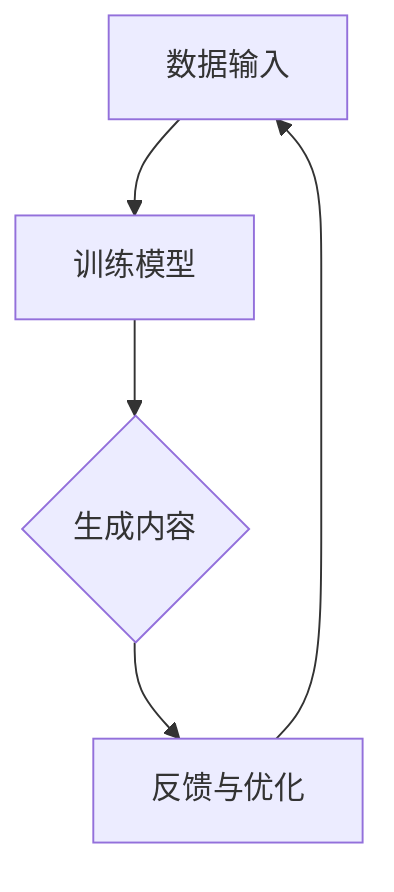

                 

关键词：AIGC，生成式人工智能，个人应用，技术发展，实践案例，未来展望

## 摘要

本文旨在深入探讨生成式人工智能（AIGC）的入门与实践，特别是在个人层面的应用。通过详细解析AIGC的核心概念、算法原理、数学模型以及实际应用案例，本文将帮助读者全面了解AIGC的各个方面。同时，文章还将展望AIGC技术的未来发展趋势和面临的挑战，为个人在技术革新中的角色定位提供指导。

## 1. 背景介绍

随着计算机技术和互联网的飞速发展，人工智能（AI）已经成为现代科技的重要驱动力。AI不仅改变了传统行业的工作方式，还不断拓展着人类生活的边界。生成式人工智能（AIGC，Artificial Intelligence Generated Content）作为AI的一个重要分支，正日益受到关注。

AIGC是指通过机器学习技术，特别是深度学习算法，生成各种类型的内容，如图像、文字、音频和视频。与传统的基于规则的自动化系统不同，AIGC能够创造新颖、独特的内容，极大地提升了内容生产的效率和质量。

在个人层面，AIGC的应用潜力巨大。从个性化内容推荐到创意写作，从虚拟助手到艺术创作，AIGC正逐步融入我们的日常生活。然而，对于大多数个人用户来说，AIGC仍然是一个相对陌生和复杂的领域。本文将带领读者从入门开始，逐步深入理解AIGC的核心概念和应用场景。

## 2. 核心概念与联系

### 2.1 AIGC的定义

AIGC，即生成式人工智能，是一种利用机器学习技术生成内容的技术。它不同于传统的搜索式人工智能，后者更多是基于已有的数据进行分类和匹配。AIGC的核心在于“生成”，这意味着它能够根据给定的输入数据，创造全新的、之前未出现过的内容。

### 2.2 关键技术

AIGC的实现依赖于多种关键技术，主要包括：

- **深度学习**：深度学习是AIGC的基础，特别是其中的生成对抗网络（GAN）和变分自编码器（VAE）等模型，能够有效地生成高质量的内容。

- **自然语言处理（NLP）**：NLP技术在AIGC中起着至关重要的作用，它使得计算机能够理解和生成自然语言，从而实现文字生成、语音合成等功能。

- **计算机视觉**：计算机视觉技术使得AIGC能够处理图像和视频数据，生成逼真的视觉内容。

### 2.3 AIGC的架构

AIGC的架构通常包括以下几个核心部分：

1. **数据输入**：AIGC需要大量的数据作为训练素材，这些数据可以是文本、图像、音频等。

2. **训练模型**：利用深度学习模型，对输入数据进行训练，使其学会生成内容。

3. **生成内容**：训练好的模型根据特定的输入，生成新的、符合预期的内容。

4. **反馈与优化**：通过用户反馈，不断优化生成的内容，提高其质量和适用性。

### 2.4 Mermaid 流程图



### 2.5 与传统AI的比较

与传统的人工智能技术相比，AIGC具有以下几个显著的特点：

- **生成性**：AIGC能够生成全新的内容，而不仅仅是处理已有的数据。

- **创造力**：AIGC具有一定的创造力，能够创造出新颖、独特的内容。

- **自适应**：AIGC能够根据用户的反馈和需求，不断优化和改进生成的内容。

## 3. 核心算法原理 & 具体操作步骤

### 3.1 算法原理概述

AIGC的核心算法主要包括生成对抗网络（GAN）和变分自编码器（VAE）等。以下是对这些算法的基本原理进行概述。

### 3.2 算法步骤详解

#### 3.2.1 GAN算法

1. **生成器（Generator）**：生成器是一个神经网络模型，它的目标是生成与真实数据分布相似的数据。

2. **判别器（Discriminator）**：判别器也是一个神经网络模型，它的目标是区分真实数据和生成数据。

3. **对抗训练**：生成器和判别器通过对抗训练相互博弈。生成器试图生成尽可能真实的数据，而判别器试图准确区分真实数据和生成数据。

4. **损失函数**：GAN的损失函数通常由判别器的损失函数和生成器的损失函数组成。判别器的损失函数旨在使其能够准确区分真实数据和生成数据，生成器的损失函数旨在使其生成的数据尽可能逼真。

#### 3.2.2 VAE算法

1. **编码器（Encoder）**：编码器将输入数据编码成一个隐变量向量。

2. **解码器（Decoder）**：解码器将隐变量向量解码成输出数据。

3. **变分自编码器**：VAE的损失函数包括两部分，一部分是重构损失，即编码器和解码器生成的数据与原始数据的差异，另一部分是KL散度损失，即隐变量向量的先验分布与实际分布的差异。

### 3.3 算法优缺点

#### 3.3.1 GAN的优点

- **强大的生成能力**：GAN能够生成高质量、多样性的内容。

- **无需标签数据**：GAN可以不依赖于标签数据，直接从原始数据中学习生成内容。

#### 3.3.2 GAN的缺点

- **训练不稳定**：GAN的训练过程容易陷入模式崩溃等问题，导致训练不稳定。

- **生成样本质量波动大**：生成的样本质量有时会出现较大波动。

#### 3.3.3 VAE的优点

- **训练稳定**：VAE的训练过程相对稳定，不易出现崩溃问题。

- **易于解释**：VAE的损失函数和结构相对简单，易于理解和解释。

#### 3.3.4 VAE的缺点

- **生成样本质量有限**：VAE的生成质量相对GAN来说较低，特别是在处理复杂、细节丰富的数据时。

### 3.4 算法应用领域

AIGC算法广泛应用于多个领域，包括但不限于：

- **图像生成**：利用GAN和VAE等技术，可以生成逼真的图像和艺术作品。

- **自然语言处理**：通过AIGC技术，可以生成高质量的文本内容，包括文章、诗歌和对话等。

- **虚拟现实（VR）**：AIGC可以生成虚拟环境中的图像和声音，提升VR体验。

- **游戏开发**：AIGC可以自动生成游戏关卡、角色和故事情节，提高游戏开发效率。

## 4. 数学模型和公式 & 详细讲解 & 举例说明

### 4.1 数学模型构建

AIGC的数学模型主要包括生成器、判别器和编码器、解码器等。以下是对这些模型的基本数学公式进行讲解。

#### 4.1.1 GAN的数学模型

1. **生成器G的损失函数**：

   $$ L_G = -\log(D(G(z)) $$

   其中，$D$为判别器，$G(z)$为生成器生成的样本。

2. **判别器D的损失函数**：

   $$ L_D = -[\log(D(x)) + \log(1 - D(G(z))] $$

   其中，$x$为真实样本，$z$为随机噪声。

#### 4.1.2 VAE的数学模型

1. **编码器E的损失函数**：

   $$ L_E = D_{KL}(q_\phi(z|x)||p(z)) + \frac{1}{N}\sum_{i=1}^{N}\|x - \hat{x}_i\|_2^2 $$

   其中，$q_\phi(z|x)$为编码器的先验分布，$p(z)$为编码器的后验分布，$\hat{x}_i$为解码器生成的样本。

2. **解码器D的损失函数**：

   $$ L_D = \frac{1}{N}\sum_{i=1}^{N}\|x - \hat{x}_i\|_2^2 $$

   其中，$x$为真实样本，$\hat{x}_i$为解码器生成的样本。

### 4.2 公式推导过程

#### 4.2.1 GAN的损失函数推导

GAN的损失函数推导主要涉及两部分，一是生成器G的损失函数，二是判别器D的损失函数。

1. **生成器G的损失函数推导**：

   生成器的目标是使判别器D无法区分生成的样本和真实的样本。因此，生成器的损失函数可以表示为：

   $$ L_G = -\log(D(G(z)) $$

   其中，$G(z)$为生成器生成的样本，$D(G(z))$为判别器对生成样本的判断概率。

2. **判别器D的损失函数推导**：

   判别器的目标是能够准确区分真实样本和生成样本。因此，判别器的损失函数可以表示为：

   $$ L_D = -[\log(D(x)) + \log(1 - D(G(z))] $$

   其中，$x$为真实样本，$G(z)$为生成器生成的样本，$D(x)$为判别器对真实样本的判断概率，$1 - D(G(z))$为判别器对生成样本的判断概率。

#### 4.2.2 VAE的损失函数推导

VAE的损失函数主要涉及编码器E和解码器D的损失函数。

1. **编码器E的损失函数推导**：

   编码器的损失函数由两部分组成，一是KL散度损失，二是重构损失。

   $$ L_E = D_{KL}(q_\phi(z|x)||p(z)) + \frac{1}{N}\sum_{i=1}^{N}\|x - \hat{x}_i\|_2^2 $$

   其中，$D_{KL}(q_\phi(z|x)||p(z))$为KL散度损失，表示编码器的先验分布$q_\phi(z|x)$与实际分布$p(z)$之间的差异，$\|x - \hat{x}_i\|_2^2$为重构损失，表示解码器生成的样本$\hat{x}_i$与真实样本$x$之间的差异。

2. **解码器D的损失函数推导**：

   解码器的损失函数主要考虑解码器生成的样本与真实样本之间的差异。

   $$ L_D = \frac{1}{N}\sum_{i=1}^{N}\|x - \hat{x}_i\|_2^2 $$

   其中，$x$为真实样本，$\hat{x}_i$为解码器生成的样本。

### 4.3 案例分析与讲解

#### 4.3.1 GAN在图像生成中的应用

假设我们使用GAN来生成图像，以下是一个简化的案例：

1. **生成器G**：

   生成器的输入是一个随机噪声向量$z$，输出是一个图像$G(z)$。

   $$ G(z) = \text{ConvNet}(z) $$

   其中，ConvNet表示一个卷积神经网络。

2. **判别器D**：

   判别器的输入是一个图像$x$，输出是一个概率值，表示图像是真实的概率。

   $$ D(x) = \text{ConvNet}(x) $$

3. **训练过程**：

   - **生成器训练**：生成器通过随机噪声$z$生成图像$G(z)$，判别器对其进行判断。生成器的目标是使判别器无法区分生成的图像和真实的图像。

     $$ L_G = -\log(D(G(z))) $$

   - **判别器训练**：判别器通过真实图像$x$和生成图像$G(z)$进行训练，目标是能够准确区分真实图像和生成图像。

     $$ L_D = -[\log(D(x)) + \log(1 - D(G(z)))] $$

   - **交替训练**：生成器和判别器交替进行训练，直到生成器能够生成逼真的图像，判别器能够准确判断图像的真伪。

#### 4.3.2 VAE在文本生成中的应用

假设我们使用VAE来生成文本，以下是一个简化的案例：

1. **编码器E**：

   编码器的输入是一个文本序列$x$，输出是一个隐变量向量$z$。

   $$ z = E(x) = \text{Encoder}(x) $$

2. **解码器D**：

   解码器的输入是一个隐变量向量$z$，输出是一个文本序列$\hat{x}$。

   $$ \hat{x} = D(z) = \text{Decoder}(z) $$

3. **训练过程**：

   - **编码器训练**：编码器通过文本序列$x$生成隐变量向量$z$，解码器通过隐变量向量$z$生成文本序列$\hat{x}$。

     $$ L_E = D_{KL}(q_\phi(z|x)||p(z)) + \frac{1}{N}\sum_{i=1}^{N}\|x - \hat{x}_i\|_2^2 $$

   - **解码器训练**：解码器通过隐变量向量$z$生成文本序列$\hat{x}$，目标是使生成的文本序列$\hat{x}$尽可能接近真实的文本序列$x$。

     $$ L_D = \frac{1}{N}\sum_{i=1}^{N}\|x - \hat{x}_i\|_2^2 $$

   - **交替训练**：编码器和解码器交替进行训练，直到生成的文本序列$\hat{x}$质量达到预期。

## 5. 项目实践：代码实例和详细解释说明

### 5.1 开发环境搭建

在进行AIGC项目的实践之前，我们需要搭建一个合适的开发环境。以下是一个基于Python的AIGC项目的开发环境搭建步骤：

1. **安装Python**：确保Python环境已安装，推荐使用Python 3.8或更高版本。

2. **安装深度学习框架**：安装TensorFlow或PyTorch，这两个框架是目前最常用的深度学习框架。

   ```shell
   pip install tensorflow
   # 或者
   pip install torch torchvision
   ```

3. **安装其他依赖**：根据具体项目需求，安装其他必要的库和依赖，例如NumPy、Pandas等。

   ```shell
   pip install numpy pandas matplotlib
   ```

### 5.2 源代码详细实现

以下是一个使用GAN生成图像的简单示例代码，我们将使用TensorFlow框架实现。

```python
import tensorflow as tf
from tensorflow.keras.layers import Dense, Flatten, Conv2D, Conv2DTranspose
from tensorflow.keras.models import Sequential

# 生成器模型
def build_generator(z_dim):
    model = Sequential([
        Dense(128 * 7 * 7, activation="relu", input_shape=(z_dim,)),
        Flatten(),
        Conv2DTranspose(128, 5, strides=2, padding="same"),
        Conv2DTranspose(128, 5, strides=2, padding="same"),
        Conv2DTranspose(128, 5, strides=2, padding="same"),
        Conv2DTranspose(128, 5, strides=2, padding="same"),
        Flatten(),
        Conv2D(1, 1, padding="same", activation="sigmoid")
    ])
    return model

# 判别器模型
def build_discriminator(img_shape):
    model = Sequential([
        Conv2D(128, 5, strides=2, padding="same", input_shape=img_shape),
        LeakyReLU(alpha=0.01),
        Conv2D(128, 5, strides=2, padding="same"),
        LeakyReLU(alpha=0.01),
        Flatten(),
        Dense(1, activation="sigmoid")
    ])
    return model

# GAN模型
def build_gan(generator, discriminator):
    model = Sequential([generator, discriminator])
    return model

# 设置超参数
z_dim = 100
img_shape = (28, 28, 1)

# 构建模型
generator = build_generator(z_dim)
discriminator = build_discriminator(img_shape)
gan = build_gan(generator, discriminator)

# 编写损失函数和优化器
cross_entropy = tf.keras.losses.BinaryCrossentropy()

def discriminator_loss(real_output, fake_output):
    real_loss = cross_entropy(tf.ones_like(real_output), real_output)
    fake_loss = cross_entropy(tf.zeros_like(fake_output), fake_output)
    total_loss = real_loss + fake_loss
    return total_loss

def generator_loss(fake_output):
    return cross_entropy(tf.ones_like(fake_output), fake_output)

generator_optimizer = tf.keras.optimizers.Adam(1e-4)
discriminator_optimizer = tf.keras.optimizers.Adam(1e-4)

# 训练过程
@tf.function
def train_step(images, noise):
    with tf.GradientTape() as gen_tape, tf.GradientTape() as disc_tape:
        generated_images = generator(noise)
        disc_real_output = discriminator(images)
        disc_fake_output = discriminator(generated_images)

        gen_loss = generator_loss(disc_fake_output)
        disc_loss = discriminator_loss(disc_real_output, disc_fake_output)

    gradients_of_generator = gen_tape.gradient(gen_loss, generator.trainable_variables)
    gradients_of_discriminator = disc_tape.gradient(disc_loss, discriminator.trainable_variables)

    generator_optimizer.apply_gradients(zip(gradients_of_generator, generator.trainable_variables))
    discriminator_optimizer.apply_gradients(zip(gradients_of_discriminator, discriminator.trainable_variables))

def train(dataset, epochs):
    for epoch in range(epochs):
        for image_batch in dataset:
            noise = tf.random.normal([image_batch.shape[0], z_dim])

            train_step(image_batch, noise)

# 加载数据集
BUFFER_SIZE = 60000
BATCH_SIZE = 256

# 使用MNIST数据集
(train_images, train_labels), (test_images, test_labels) = tf.keras.datasets.mnist.load_data()
train_images = train_images.reshape(train_images.shape[0], 28, 28, 1).astype(tf.float32)
test_images = test_images.reshape(test_images.shape[0], 28, 28, 1).astype(tf.float32)
train_images = (train_images - 127.5) / 127.5
test_images = (test_images - 127.5) / 127.5

train_dataset = tf.data.Dataset.from_tensor_slices(train_images).shuffle(BUFFER_SIZE).batch(BATCH_SIZE)
test_dataset = tf.data.Dataset.from_tensor_slices(test_images).batch(BATCH_SIZE)

# 训练模型
EPOCHS = 50
train(train_dataset, EPOCHS)
```

### 5.3 代码解读与分析

1. **模型构建**：

   - 生成器模型：生成器采用了一个卷积神经网络结构，通过逐层反卷积（Conv2DTranspose）操作，从噪声向量$z$生成图像。

   - 判别器模型：判别器采用了一个卷积神经网络结构，通过逐层卷积（Conv2D）操作，对图像进行特征提取，并输出一个二分类概率。

   - GAN模型：GAN模型由生成器和判别器串联组成，生成器的输出作为判别器的输入。

2. **损失函数**：

   - 生成器损失函数：生成器的目标是使判别器无法区分生成的图像和真实的图像，因此生成器的损失函数为负的判别器输出概率。

   - 判别器损失函数：判别器的目标是能够准确区分真实的图像和生成的图像，因此判别器的损失函数为真实图像的概率和对生成图像的概率之和。

3. **训练过程**：

   - 训练步骤：每次训练步骤中，生成器生成图像，判别器对真实图像和生成图像进行判断。然后，通过反向传播计算损失，并更新生成器和判别器的权重。

   - 交替训练：生成器和判别器交替进行训练，直到生成器能够生成高质量的图像，判别器能够准确判断图像的真伪。

### 5.4 运行结果展示

运行上述代码后，我们可以通过可视化生成器生成的图像来评估模型的性能。以下是一个生成图像的示例：

```python
import matplotlib.pyplot as plt

def generate_images(model, noise, num_images=10):
    generated_images = model(noise)
    plt.figure(figsize=(10, 10))
    for i in range(num_images):
        plt.subplot(10, 10, i + 1)
        plt.imshow(generated_images[i, :, :, 0], cmap='gray')
        plt.axis('off')
    plt.show()

noise = tf.random.normal([BATCH_SIZE, z_dim])
generate_images(generator, noise)
```

## 6. 实际应用场景

### 6.1 创意写作

AIGC在创意写作中的应用已经取得显著成果。通过自然语言处理技术，AIGC能够生成各种类型的文本，如小说、诗歌、新闻报道等。例如，OpenAI的GPT-3模型已经能够生成高质量的文本内容，为创作者提供灵感。

### 6.2 艺术创作

AIGC在艺术创作领域同样具有广阔的应用前景。通过图像生成和计算机视觉技术，AIGC能够创作出具有独特风格的画作和音乐。例如，DeepArt和Amper Music等平台已经利用AIGC技术，为用户提供个性化的艺术创作服务。

### 6.3 虚拟助手

AIGC技术在虚拟助手中的应用正在逐步发展。通过自然语言处理和生成技术，AIGC能够理解用户的指令，并生成相应的回复。例如，ChatGPT和Duolingo等虚拟助手已经广泛应用AIGC技术，提供个性化的语言学习服务。

### 6.4 内容推荐

AIGC在内容推荐中的应用也日益成熟。通过分析用户的兴趣和行为，AIGC能够生成个性化的内容推荐。例如，Netflix和Amazon等平台已经利用AIGC技术，为用户提供高度个性化的推荐。

### 6.5 未来应用展望

随着AIGC技术的不断发展，其在个人应用领域的应用前景将更加广阔。以下是一些可能的应用方向：

- **个性化教育**：AIGC能够根据学生的学习进度和兴趣，生成个性化的教学资源和练习题。

- **医疗诊断**：AIGC能够辅助医生进行疾病诊断，通过分析医学影像和数据，提供诊断建议。

- **自动驾驶**：AIGC技术在自动驾驶领域具有巨大的潜力，通过实时生成道路环境和预测，提高自动驾驶的准确性和安全性。

## 7. 工具和资源推荐

### 7.1 学习资源推荐

- **书籍**：《生成式人工智能：从入门到实战》

- **在线课程**：Coursera上的《深度学习与生成对抗网络》

- **论文**：《Generative Adversarial Nets》

### 7.2 开发工具推荐

- **深度学习框架**：TensorFlow、PyTorch

- **文本生成工具**：GPT-3、ChatGPT

- **图像生成工具**：DeepArt、StyleGAN

### 7.3 相关论文推荐

- **《Generative Adversarial Nets》**：Ian J. Goodfellow et al.

- **《Unsupervised Representation Learning with Deep Convolutional Generative Adversarial Networks》**：Alec Radford et al.

- **《Variational Autoencoders》**：Diederik P. Kingma et al.

## 8. 总结：未来发展趋势与挑战

### 8.1 研究成果总结

AIGC技术在过去几年取得了显著的成果，从图像生成到文本生成，从虚拟助手到艺术创作，AIGC技术已经广泛应用于多个领域。随着深度学习技术和计算能力的不断提升，AIGC技术的生成质量和效率将进一步提高。

### 8.2 未来发展趋势

- **更高质的生成内容**：未来，AIGC技术将致力于生成更高质、更符合人类审美和情感的内容。

- **跨模态生成**：AIGC技术将实现跨模态生成，如将文本、图像和音频结合生成全新的内容。

- **更多个性化应用**：AIGC技术将更加个性化，根据用户的需求和兴趣，生成个性化的内容。

### 8.3 面临的挑战

- **数据隐私和安全**：随着AIGC技术的应用越来越广泛，数据隐私和安全问题将日益突出。

- **算法伦理**：AIGC技术的生成内容可能涉及到伦理和道德问题，如虚假信息传播和误导用户。

### 8.4 研究展望

未来，AIGC技术将在多个领域得到更深入的研究和应用。同时，如何确保AIGC技术的安全、可靠和伦理，将是研究者们需要重点关注的问题。

## 9. 附录：常见问题与解答

### 9.1 Q：AIGC与GAN有什么区别？

A：AIGC（生成式人工智能）是一个广义的概念，它包括了一系列生成内容的方法，而GAN（生成对抗网络）是AIGC的一种具体实现方法。GAN由生成器和判别器组成，通过对抗训练生成高质量的内容。AIGC还包括其他方法，如VAE（变分自编码器）和扩散模型等。

### 9.2 Q：AIGC可以应用于哪些领域？

A：AIGC可以应用于多个领域，如图像生成、文本生成、语音合成、虚拟现实、艺术创作、个性化推荐等。随着技术的进步，AIGC的应用领域将不断扩展。

### 9.3 Q：如何训练一个AIGC模型？

A：训练一个AIGC模型通常包括以下步骤：

1. 准备数据集：收集并预处理训练数据。
2. 设计模型：设计生成器和判别器的结构。
3. 编写训练代码：实现模型的损失函数和优化器。
4. 训练模型：通过反向传播和梯度下降算法，训练模型。
5. 评估模型：在测试集上评估模型的性能。

### 9.4 Q：AIGC会取代人类创作者吗？

A：AIGC是一种辅助工具，它可以帮助人类创作者提高效率和创造力，但不可能完全取代人类创作者。人类的创造力和情感体验是AIGC无法复制的。因此，AIGC与人类创作者之间的关系将是互补而非替代。

