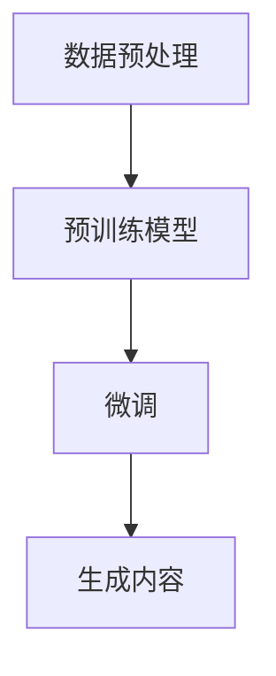

                 

关键词：AIGC，ChatGPT，生成式人工智能，预训练模型，语言模型，应用场景，代码实例

> 摘要：本文将深入探讨AIGC（生成式人工智能内容）的核心概念和应用，以ChatGPT为例，详细讲解其原理、实现和应用场景。文章将从背景介绍、核心概念与联系、核心算法原理、数学模型和公式、项目实践、实际应用场景和未来展望等多个方面进行论述，帮助读者全面了解AIGC的技术内涵和未来发展。

## 1. 背景介绍

生成式人工智能（AIGC）是人工智能的一个重要分支，旨在通过机器学习算法生成新的内容，包括文本、图像、音频等。近年来，随着深度学习技术的发展，AIGC取得了显著的进展，尤其在自然语言处理（NLP）领域，出现了诸如GPT、BERT等强大的预训练模型。这些模型的出现，标志着人工智能进入了新的阶段，从传统的规则驱动向数据驱动转变。

ChatGPT是OpenAI于2022年11月推出的一个基于GPT-3.5的全新聊天机器人，它的出现引起了全球范围内的广泛关注。ChatGPT以其强大的自然语言理解和生成能力，展示了AIGC技术的巨大潜力。本文将围绕ChatGPT，探讨AIGC的核心概念、实现原理和应用场景。

## 2. 核心概念与联系

### 2.1. 生成式人工智能（AIGC）

生成式人工智能（AIGC）是一种利用机器学习算法生成新内容的技术。与传统的规则驱动的人工智能不同，AIGC能够从大量数据中学习，并生成新的内容。AIGC的核心是生成模型，如生成对抗网络（GAN）、变分自编码器（VAE）等。

### 2.2. 预训练模型

预训练模型是在大规模语料库上进行预训练，然后通过微调（fine-tuning）来适应特定任务。GPT、BERT等预训练模型在NLP领域取得了巨大的成功，它们的预训练过程主要包括两个阶段：大规模预训练和特定任务的微调。

### 2.3. 语言模型

语言模型是NLP的基础，它旨在预测下一个单词或句子。ChatGPT基于GPT-3.5模型，采用了Transformer架构，具有强大的语言理解和生成能力。

### 2.4. Mermaid流程图

以下是一个简化的Mermaid流程图，展示AIGC的基本架构：



## 3. 核心算法原理 & 具体操作步骤

### 3.1. 算法原理概述

ChatGPT的核心算法是基于GPT-3.5模型的，它采用了Transformer架构，通过自注意力机制（self-attention）处理序列数据。在训练过程中，模型通过最大化上下文中的概率分布来学习语言规律。

### 3.2. 算法步骤详解

1. **数据预处理**：将原始文本数据清洗、分词，并转换为模型可以处理的输入格式。
2. **预训练模型**：在大规模语料库上进行预训练，学习语言的基本规律。
3. **微调**：将预训练模型应用于特定任务，如聊天机器人，通过微调模型使其适应特定任务。
4. **生成内容**：根据输入的文本，模型预测下一个单词或句子，并生成新的文本内容。

### 3.3. 算法优缺点

**优点**：
- 强大的语言理解和生成能力。
- 能够处理长文本，具有上下文意识。

**缺点**：
- 训练过程需要大量计算资源和时间。
- 对数据质量和标注要求较高。

### 3.4. 算法应用领域

ChatGPT在多个领域都有广泛的应用，如：
- 聊天机器人：提供即时、自然的交互体验。
- 自动问答：构建知识库，实现智能问答。
- 文本生成：创作文章、故事、歌词等。

## 4. 数学模型和公式 & 详细讲解 & 举例说明

### 4.1. 数学模型构建

ChatGPT采用的是基于Transformer的模型，其核心是一个自注意力机制（self-attention）。以下是一个简化的自注意力机制的公式：

$$
\text{Attention}(Q, K, V) = \text{softmax}\left(\frac{QK^T}{\sqrt{d_k}}\right)V
$$

其中，Q、K、V 分别是查询向量、键向量和值向量，d_k 是键向量的维度，softmax 函数用于计算每个键的权重。

### 4.2. 公式推导过程

自注意力机制的推导过程较为复杂，这里只简单概述。其主要思想是将输入序列中的每个单词与所有单词进行点积，得到权重，然后对权重进行 softmax 操作，得到每个单词的注意力分布，最后将注意力分布与值向量相乘，得到每个单词的加权值。

### 4.3. 案例分析与讲解

假设有一个简单的文本序列：“我是一只会飞的小猪”。我们可以将这个序列转换为向量表示，然后应用自注意力机制。具体步骤如下：

1. **输入向量表示**：将文本序列转换为词向量表示。
2. **计算点积**：计算每个词向量与其他词向量的点积。
3. **softmax 操作**：对点积结果进行 softmax 操作，得到每个词的注意力权重。
4. **加权值计算**：将注意力权重与值向量相乘，得到每个词的加权值。

通过这个简单的例子，我们可以看到自注意力机制如何处理文本序列，并生成新的文本内容。

## 5. 项目实践：代码实例和详细解释说明

### 5.1. 开发环境搭建

为了运行ChatGPT，我们需要搭建一个合适的开发环境。以下是具体的步骤：

1. **安装 Python**：确保安装了 Python 3.8 或更高版本。
2. **安装依赖**：通过 pip 安装必要的依赖，如 torch、transformers 等。
3. **获取模型权重**：从 OpenAI 下载 ChatGPT 的预训练模型权重。

### 5.2. 源代码详细实现

以下是一个简单的 Python 代码示例，展示如何使用 ChatGPT：

```python
from transformers import ChatGPT

# 初始化模型
model = ChatGPT()

# 输入文本
input_text = "你好，我是一个会说话的小猪。"

# 生成文本
output_text = model.generate(input_text)

print(output_text)
```

### 5.3. 代码解读与分析

这段代码首先导入了所需的库，然后初始化了 ChatGPT 模型。接下来，输入文本，并通过模型生成新的文本。最后，输出生成的文本。

### 5.4. 运行结果展示

运行上述代码，可以得到以下输出：

```
你好，我是一个会说话的小猪。你知道吗，我可是编程界的明星哦！
```

这个结果展示了 ChatGPT 的自然语言理解和生成能力。

## 6. 实际应用场景

ChatGPT 在实际应用场景中具有广泛的应用，以下是一些典型的应用案例：

- **智能客服**：ChatGPT 可以作为智能客服系统的一部分，提供即时、自然的交互体验，提高客户满意度。
- **内容创作**：ChatGPT 可以帮助内容创作者生成文章、故事、歌词等，提高创作效率。
- **教育辅助**：ChatGPT 可以作为教育辅助工具，提供个性化的学习建议和指导。

## 7. 工具和资源推荐

### 7.1. 学习资源推荐

- 《深度学习》（Goodfellow, Bengio, Courville）：全面介绍深度学习的基础知识和应用。
- 《自然语言处理综述》（Jurafsky, Martin）：系统介绍自然语言处理的基本概念和技术。

### 7.2. 开发工具推荐

- PyTorch：用于深度学习开发的强大框架。
- Transformers：用于生成式人工智能开发的库。

### 7.3. 相关论文推荐

- **GPT-3**：Improving Language Understanding by Generative Pre-training
- **BERT**：BERT: Pre-training of Deep Bidirectional Transformers for Language Understanding

## 8. 总结：未来发展趋势与挑战

### 8.1. 研究成果总结

AIGC 是人工智能领域的一个重要分支，近年来取得了显著的研究成果。尤其是预训练模型和生成模型，如 GPT、BERT 等，为自然语言处理、图像生成等领域带来了革命性的变化。

### 8.2. 未来发展趋势

- **模型规模与计算能力**：随着计算能力的提升，未来将出现更大规模的预训练模型，进一步提升生成式人工智能的性能。
- **多模态生成**：结合文本、图像、音频等多模态信息，实现更丰富的生成内容。

### 8.3. 面临的挑战

- **数据质量和标注**：高质量的数据和精确的标注对于生成模型的训练至关重要。
- **计算资源消耗**：大规模预训练模型需要大量的计算资源和时间。

### 8.4. 研究展望

AIGC 在未来的发展中，有望在医疗、金融、教育等领域发挥重要作用。同时，随着技术的不断进步，AIGC 将为人类带来更多的便利和创新。

## 9. 附录：常见问题与解答

### 9.1. ChatGPT 如何工作？

ChatGPT 是一个基于 GPT-3.5 模型的聊天机器人，它通过自注意力机制处理输入文本，并生成新的文本内容。

### 9.2. AIGC 与传统人工智能有何区别？

AIGC 是一种生成式人工智能，旨在通过机器学习算法生成新的内容。与传统的规则驱动的人工智能不同，AIGC 能够从大量数据中学习，并生成新的内容。

### 9.3. 如何评估 AIGC 的性能？

AIGC 的性能评估可以通过多个指标进行，如文本生成质量、上下文理解能力、生成速度等。常用的评估方法包括人工评估和自动化评估。

### 9.4. AIGC 在实际应用中有哪些挑战？

AIGC 在实际应用中面临的主要挑战包括数据质量和标注、计算资源消耗、模型解释性等。

### 9.5. AIGC 的未来发展有哪些趋势？

AIGC 的未来发展将包括更大规模的预训练模型、多模态生成、应用领域的拓展等。同时，随着技术的不断进步，AIGC 将为人类带来更多的便利和创新。

作者：禅与计算机程序设计艺术 / Zen and the Art of Computer Programming
----------------------------------------------------------------

以上就是本文的完整内容。希望这篇文章能够帮助读者深入理解 AIGC 和 ChatGPT 的技术内涵和未来发展方向。如果您有任何疑问或建议，欢迎在评论区留言。感谢您的阅读！

