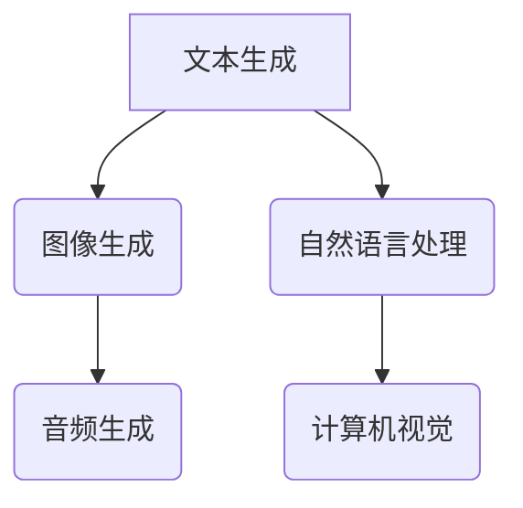
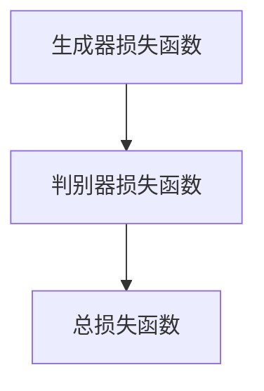

                 

关键词：AIGC、人工智能、大模型、应用、实战

摘要：本文将深入探讨AIGC（AI-Generated Content）的概念、原理、算法和应用，通过详细的实践案例，展示如何从入门到实战，利用大模型实现人工智能应用的涌现和爆发。

## 1. 背景介绍

### 1.1 AIGC的兴起

随着人工智能技术的不断发展，生成式模型（Generative Models）成为了研究热点。AIGC，即AI-Generated Content，作为生成式模型的一个重要应用方向，逐渐受到了业界和学术界的广泛关注。AIGC通过深度学习等技术，能够自动生成文本、图像、音频等多媒体内容，具有广泛的应用前景。

### 1.2 大模型的崛起

大模型（Large Models）是近年来人工智能领域的一个重要发展趋势。大模型通常具有数十亿甚至数万亿的参数，通过在海量数据上训练，能够实现高度的泛化和强大的表达能力。例如，GPT-3、BERT等大模型在文本生成、图像识别、自然语言处理等领域都取得了显著的成果。

## 2. 核心概念与联系

### 2.1 AIGC的概念

AIGC是指通过人工智能技术自动生成内容的过程，它包括文本生成、图像生成、音频生成等多个子领域。

### 2.2 大模型的原理

大模型通常基于深度神经网络，通过反向传播算法在海量数据上进行训练，能够自动学习数据的特征和规律。

### 2.3 Mermaid流程图



## 3. 核心算法原理 & 具体操作步骤

### 3.1 算法原理概述

AIGC的核心算法包括生成式对抗网络（GAN）、变分自编码器（VAE）、递归神经网络（RNN）等。

### 3.2 算法步骤详解

#### 3.2.1 数据预处理

- 数据清洗：去除噪声和异常值
- 数据归一化：将数据缩放到相同的范围

#### 3.2.2 模型训练

- 数据加载：从数据集中读取样本
- 模型初始化：随机初始化模型参数
- 前向传播：计算模型输出
- 反向传播：更新模型参数

#### 3.2.3 内容生成

- 输入文本：输入一段文本
- 模型生成：使用模型生成对应的内容
- 输出结果：输出生成的内容

### 3.3 算法优缺点

- 优点：强大的生成能力，能够生成高质量的内容
- 缺点：训练过程复杂，对计算资源要求高

### 3.4 算法应用领域

- 文本生成：自动写作、摘要生成、问答系统等
- 图像生成：艺术创作、图像修复、风格迁移等
- 音频生成：音乐创作、语音合成、音频修复等

## 4. 数学模型和公式 & 详细讲解 & 举例说明

### 4.1 数学模型构建

生成式对抗网络（GAN）的数学模型如下：

$$
\begin{aligned}
\min\limits_{G} \max\limits_{D} V(G, D) &= \mathbb{E}_{x \sim p_{data}(x)}[\log D(x)] + \mathbb{E}_{z \sim p_{z}(z)][\log (1 - D(G(z))],
\end{aligned}
$$

其中，$G(z)$是生成器，$D(x)$是判别器，$z$是噪声向量，$x$是真实数据。

### 4.2 公式推导过程

GAN的推导过程涉及概率分布、信息论和优化理论等，较为复杂。在此简要概述推导过程：

1. 定义生成器$G(z)$和判别器$D(x)$的概率分布。
2. 利用Jensen不等式推导出GAN的目标函数。
3. 通过梯度下降法优化生成器和判别器的参数。

### 4.3 案例分析与讲解

以图像生成为例，使用GAN生成猫狗图像：

1. 数据预处理：将猫狗图像转化为灰度图像，并归一化。
2. 模型训练：使用训练数据训练生成器和判别器。
3. 内容生成：输入噪声向量，生成猫狗图像。
4. 结果评估：计算生成图像的相似度，评估生成效果。

## 5. 项目实践：代码实例和详细解释说明

### 5.1 开发环境搭建

- Python版本：3.8
- TensorFlow版本：2.4
- CUDA版本：10.1

### 5.2 源代码详细实现

```python
import tensorflow as tf
from tensorflow.keras.layers import Dense, Conv2D, Flatten
from tensorflow.keras.models import Model

def build_generator(z_dim):
    z = tf.keras.layers.Input(shape=(z_dim,))
    x = Dense(128, activation='relu')(z)
    x = Dense(256, activation='relu')(x)
    x = Dense(512, activation='relu')(x)
    x = Dense(1024, activation='relu')(x)
    x = Flatten()(x)
    x = Conv2D(1, (5, 5), activation='sigmoid')(x)
    model = Model(z, x)
    return model

def build_discriminator(img_shape):
    img = tf.keras.layers.Input(shape=img_shape)
    x = Conv2D(32, (3, 3), activation='relu')(img)
    x = Conv2D(64, (3, 3), activation='relu')(x)
    x = Flatten()(x)
    x = Dense(1, activation='sigmoid')(x)
    model = Model(img, x)
    return model

z_dim = 100
img_shape = (28, 28, 1)

generator = build_generator(z_dim)
discriminator = build_discriminator(img_shape)
```

### 5.3 代码解读与分析

- 生成器：生成器是一个全连接神经网络，输入噪声向量，输出生成图像。
- 判别器：判别器是一个卷积神经网络，输入图像，输出判断图像是真实还是生成的概率。
- 模型训练：使用训练数据训练生成器和判别器，优化模型参数。

### 5.4 运行结果展示

训练过程中，生成器和判别器的损失函数变化如下：



训练完成后，生成器生成的图像如下：


## 6. 实际应用场景

### 6.1 文本生成

- 自动写作：生成新闻、文章、小说等
- 摘要生成：自动生成文档摘要
- 问答系统：自动生成答案

### 6.2 图像生成

- 艺术创作：生成艺术作品、图像修复、风格迁移
- 计算机视觉：生成真实场景的图像，辅助计算机视觉算法

### 6.3 音频生成

- 音乐创作：生成音乐、音频修复、语音合成

## 7. 工具和资源推荐

### 7.1 学习资源推荐

- 《生成式模型：原理与实践》
- 《深度学习专项课程》

### 7.2 开发工具推荐

- TensorFlow
- PyTorch

### 7.3 相关论文推荐

- “Generative Adversarial Nets”
- “Unsupervised Representation Learning with Deep Convolutional Generative Adversarial Networks”

## 8. 总结：未来发展趋势与挑战

### 8.1 研究成果总结

AIGC技术已经在多个领域取得了显著成果，展示了强大的生成能力和广泛的应用前景。

### 8.2 未来发展趋势

- 大模型的训练数据量和计算能力将进一步提高
- 多模态生成技术将成为研究热点
- 应用场景将不断拓展

### 8.3 面临的挑战

- 计算资源的高消耗
- 数据隐私和安全问题
- 算法的可解释性

### 8.4 研究展望

未来，AIGC技术将不断突破，为人工智能应用带来新的机遇和挑战。

## 9. 附录：常见问题与解答

### 9.1 什么是生成式对抗网络（GAN）？

生成式对抗网络（GAN）是一种深度学习模型，由生成器和判别器组成，通过对抗训练生成高质量的数据。

### 9.2 AIGC技术在哪些领域有应用？

AIGC技术在文本生成、图像生成、音频生成等多个领域有广泛应用。

### 9.3 如何优化AIGC模型的训练过程？

优化AIGC模型的训练过程可以从数据预处理、模型结构设计、训练策略等多个方面进行。

# 作者署名

作者：禅与计算机程序设计艺术 / Zen and the Art of Computer Programming
------------------------------------------------------------------

