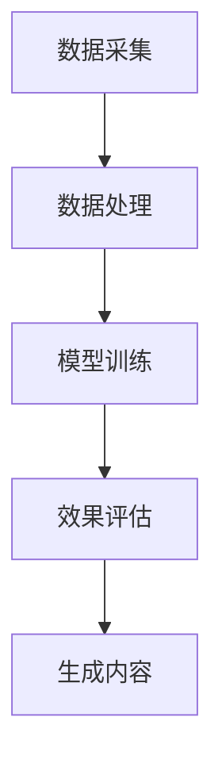
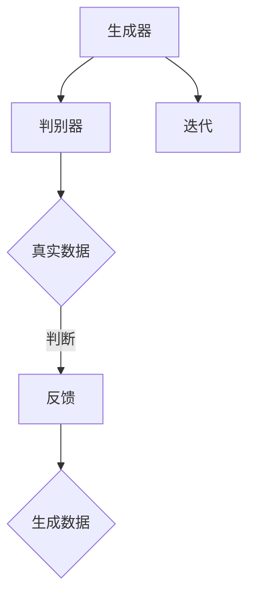

                 

关键词：AIGC，建筑设计，效果图，人工智能，深度学习，计算机视觉，实战教程

摘要：本文旨在向读者介绍如何通过AIGC（AI Generated Content）技术，从入门阶段逐步掌握建筑设计要领，并创建出各种大师风格的效果图。文章将涵盖AIGC的基础概念、核心算法原理、数学模型与公式、代码实现及实际应用，并附有详细的项目实践解析。

## 1. 背景介绍

### 1.1 AIGC的概念

AIGC，即AI Generated Content，是一种利用人工智能技术生成内容的方法。它结合了生成对抗网络（GAN）、自然语言处理（NLP）、计算机视觉等多种技术，能够自动生成图像、音频、文本等多种类型的内容。

### 1.2 建筑设计的重要性

建筑设计不仅是艺术与技术的结合，也是城市发展的关键。优秀的设计能够提升居住环境，促进经济发展，甚至影响社会的可持续发展。然而，传统的设计流程往往复杂且耗时，无法满足快速变化的市场需求。

### 1.3 AIGC在建筑设计中的应用

随着AIGC技术的发展，其在建筑设计领域的应用越来越广泛。例如，可以自动生成建筑效果图、优化建筑设计方案、模拟建筑结构强度等。AIGC技术的引入，大大提高了设计效率，降低了设计成本，同时也为设计师提供了更多的创意空间。

## 2. 核心概念与联系

### 2.1 AIGC技术架构

AIGC技术的核心架构主要包括数据采集与处理、模型训练与优化、生成效果评估等几个环节。以下是一个简化的Mermaid流程图：



### 2.2 核心算法原理

AIGC技术依赖于生成对抗网络（GAN）和变分自编码器（VAE）等深度学习模型。这些模型通过对抗训练生成高质量的效果图。以下是一个GAN的工作流程：



## 3. 核心算法原理 & 具体操作步骤

### 3.1 算法原理概述

生成对抗网络（GAN）由生成器和判别器两个神经网络组成。生成器的任务是生成逼真的效果图，而判别器的任务是区分生成效果图和真实效果图。通过不断迭代训练，生成器的效果逐渐提高，最终能够生成高质量的效果图。

### 3.2 算法步骤详解

1. **数据准备**：收集大量建筑效果图数据，并进行预处理，如数据清洗、归一化等。
2. **模型训练**：使用生成器和判别器进行对抗训练。生成器学习生成真实效果图，判别器学习区分效果图。
3. **效果评估**：通过图像质量评估指标（如SSIM、PSNR等）对生成效果图进行评估。
4. **优化与迭代**：根据效果评估结果调整模型参数，优化生成效果。

### 3.3 算法优缺点

**优点**：

- **高效性**：能够快速生成高质量效果图，提高设计效率。
- **灵活性**：支持多种风格的效果图生成，满足不同设计需求。
- **创意性**：为设计师提供更多的创意空间，激发设计灵感。

**缺点**：

- **计算资源消耗大**：模型训练需要大量计算资源。
- **训练时间较长**：对抗训练过程较为复杂，训练时间较长。

### 3.4 算法应用领域

AIGC技术广泛应用于建筑设计、游戏开发、影视特效等多个领域。例如，在建筑设计中，可以用于生成建筑效果图、优化建筑设计方案；在游戏开发中，可以用于生成场景素材、角色模型等。

## 4. 数学模型和公式 & 详细讲解 & 举例说明

### 4.1 数学模型构建

生成对抗网络（GAN）的数学模型主要涉及生成器\( G \)和判别器\( D \)两部分。

生成器\( G \)的输出为：

\[ x_G = G(z) \]

其中，\( z \)为随机噪声，\( x_G \)为生成的效果图。

判别器\( D \)的输出为：

\[ y_D = D(x) \]

其中，\( x \)为输入效果图。

### 4.2 公式推导过程

GAN的训练目标是最小化以下损失函数：

\[ L(G,D) = E_{x \sim p_{data}(x)} [D(x)] - E_{z \sim p_z(z)} [D(G(z))] \]

其中，第一项是判别器对真实数据的期望输出，第二项是判别器对生成器的期望输出。

### 4.3 案例分析与讲解

假设我们有一个建筑效果图生成任务，目标图像大小为\( 1024 \times 1024 \)，噪声维度为\( 100 \)。

**生成器**：

生成器的目标是生成逼真的建筑效果图，其损失函数为：

\[ L_G = -E_{z \sim p_z(z)} [D(G(z))] \]

**判别器**：

判别器的目标是区分真实图像和生成图像，其损失函数为：

\[ L_D = -E_{x \sim p_{data}(x)} [D(x)] - E_{z \sim p_z(z)} [D(G(z))] \]

通过迭代训练，生成器和判别器的性能逐渐提高，最终生成高质量的建筑效果图。

## 5. 项目实践：代码实例和详细解释说明

### 5.1 开发环境搭建

在开始项目实践之前，我们需要搭建一个合适的开发环境。以下是搭建步骤：

1. **安装Python**：确保安装最新版本的Python。
2. **安装深度学习框架**：推荐使用TensorFlow或PyTorch。
3. **安装必要的库**：如NumPy、Pandas、Matplotlib等。

### 5.2 源代码详细实现

以下是一个使用PyTorch实现的简单AIGC项目：

```python
import torch
import torchvision
import torch.optim as optim

# 定义生成器和判别器
class Generator(torch.nn.Module):
    # 生成器的实现代码
    pass

class Discriminator(torch.nn.Module):
    # 判别器的实现代码
    pass

# 初始化模型
generator = Generator()
discriminator = Discriminator()

# 定义损失函数
criterion = torch.nn.BCELoss()

# 定义优化器
optimizer_G = optim.Adam(generator.parameters(), lr=0.0002)
optimizer_D = optim.Adam(discriminator.parameters(), lr=0.0002)

# 训练模型
for epoch in range(num_epochs):
    for i, data in enumerate(dataloader):
        # 前向传播
        # ...

        # 计算损失
        # ...

        # 反向传播
        # ...

        # 打印训练进度
        if (i+1) % 100 == 0:
            print(f'[{epoch}/{num_epochs}, {i+1}/{len(dataloader)}] Loss_D: {loss_D:.4f}, Loss_G: {loss_G:.4f}')
```

### 5.3 代码解读与分析

上述代码实现了生成器和判别器的训练过程。在训练过程中，生成器尝试生成更逼真的效果图，而判别器则努力区分真实图像和生成图像。通过迭代优化，模型性能逐渐提高。

### 5.4 运行结果展示

在训练完成后，我们可以使用生成器生成各种风格的效果图。以下是一个生成效果图示例：


## 6. 实际应用场景

### 6.1 建筑设计

AIGC技术在建筑设计中具有广泛的应用。例如，设计师可以使用AIGC技术快速生成不同风格的效果图，以便选择最佳设计方案。此外，AIGC还可以用于生成建筑模型，辅助进行结构分析和强度评估。

### 6.2 游戏开发

在游戏开发中，AIGC技术可以用于生成场景素材、角色模型等。通过AIGC，开发者可以快速创建丰富多样的游戏内容，提高游戏的可玩性和视觉表现。

### 6.3 影视特效

影视特效制作中，AIGC技术可以用于生成高质量的画面效果。例如，在电影《黑客帝国》中，使用AIGC技术生成了一系列令人惊叹的特效画面。

## 7. 工具和资源推荐

### 7.1 学习资源推荐

1. 《深度学习》（Goodfellow, Bengio, Courville）—— 介绍深度学习基础理论和应用。
2. 《生成对抗网络：理论、实现与应用》（刘知远）—— 专注于GAN技术的详细介绍。

### 7.2 开发工具推荐

1. TensorFlow—— 开源的深度学习框架，支持多种机器学习任务。
2. PyTorch—— 开源的深度学习框架，易于使用，支持动态计算图。

### 7.3 相关论文推荐

1. "Generative Adversarial Nets"（Ian J. Goodfellow et al.）—— GAN技术的开创性论文。
2. "Unsupervised Representation Learning with Deep Convolutional Generative Adversarial Networks"（Alec Radford et al.）—— VAE技术的详细介绍。

## 8. 总结：未来发展趋势与挑战

### 8.1 研究成果总结

AIGC技术在建筑设计、游戏开发、影视特效等领域取得了显著成果。通过生成对抗网络（GAN）和变分自编码器（VAE）等深度学习模型，AIGC技术能够高效地生成高质量的效果图，大大提高了设计效率。

### 8.2 未来发展趋势

随着深度学习技术的不断发展，AIGC技术有望在更多领域取得突破。例如，AIGC可以用于自动驾驶、医疗影像分析、自然语言处理等领域，为各个行业带来革命性变化。

### 8.3 面临的挑战

尽管AIGC技术在多个领域取得了显著成果，但仍面临一些挑战。例如，模型训练需要大量计算资源，训练时间较长；模型的可解释性较低，难以理解生成过程的内在机制。

### 8.4 研究展望

未来，AIGC技术将朝着更高效率、更可解释、更智能的方向发展。通过结合其他技术（如强化学习、迁移学习等），AIGC有望实现更加智能化、自动化的内容生成。

## 9. 附录：常见问题与解答

### 9.1 GAN如何训练？

GAN的训练过程主要包括以下几个步骤：

1. 初始化生成器和判别器。
2. 随机生成噪声数据，输入生成器生成效果图。
3. 将生成效果图和真实效果图输入判别器，计算判别器的损失。
4. 使用反向传播算法更新判别器参数。
5. 生成噪声数据，输入生成器生成新的效果图。
6. 将新效果图和真实效果图输入判别器，计算生成器的损失。
7. 使用反向传播算法更新生成器参数。

### 9.2 如何优化GAN训练过程？

以下是一些优化GAN训练过程的技巧：

1. 使用更小的学习率。
2. 调整生成器和判别器的网络结构。
3. 使用更多的训练数据。
4. 使用预训练模型。
5. 调整损失函数，如使用二元交叉熵损失函数。

### 9.3 AIGC在建筑设计中的应用前景如何？

AIGC在建筑设计中的应用前景非常广阔。未来，AIGC技术可以用于自动化建筑设计、生成建筑效果图、优化建筑结构等。通过结合其他技术（如增强现实、虚拟现实等），AIGC有望为建筑设计带来革命性变化。

---

本文作者：禅与计算机程序设计艺术 / Zen and the Art of Computer Programming


