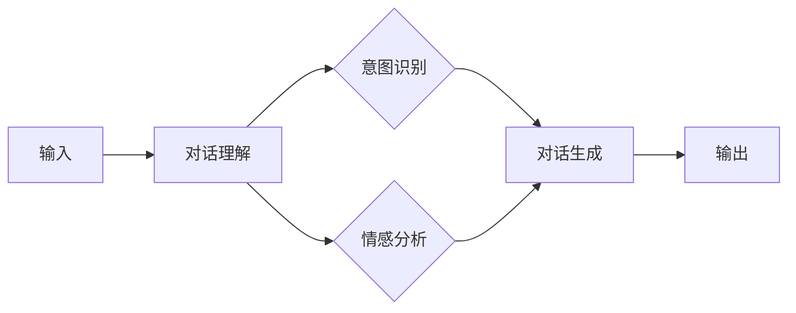

                 

 > 关键词：AIGC, ChatGPT, 实战测试，人工智能，技术，未来应用

> 摘要：本文深入探讨了AIGC（AI Generated Content）领域的一个重要组成部分——ChatGPT的实战应用。通过分析ChatGPT的核心原理和功能，我们探讨了其在各个行业中的潜在角色。本文旨在为读者提供一份详细的技术指南，帮助他们理解和评估ChatGPT在AIGC领域的实际应用价值。

## 1. 背景介绍

AIGC，即AI Generated Content，是指由人工智能生成的各种内容，包括文本、图片、视频等。AIGC是人工智能技术发展的重要方向之一，其应用范围涵盖了内容创作、内容分发、内容审核等多个环节。在AIGC领域中，ChatGPT作为一种基于自然语言处理（NLP）的先进技术，已经成为了一个备受关注的研究对象。

ChatGPT是由OpenAI开发的一种基于GPT-3模型的聊天机器人。GPT-3（Generative Pre-trained Transformer 3）是OpenAI于2020年发布的一种大型语言模型，其参数规模达到了1750亿。ChatGPT通过训练，可以生成连贯、自然的对话内容，并在各种应用场景中发挥重要作用。

## 2. 核心概念与联系

### 2.1. GPT-3模型原理

GPT-3是一种基于Transformer架构的自然语言处理模型。Transformer模型是一种基于自注意力机制的序列模型，它能够捕捉输入序列中的长距离依赖关系。GPT-3通过预训练的方式，在大规模语料库上进行训练，从而学习到语言的统计规律和语义信息。

### 2.2. ChatGPT功能模块

ChatGPT的核心功能模块包括对话生成和对话理解。对话生成模块负责根据用户输入的文本生成连贯、自然的回复；对话理解模块则负责理解用户输入的意图和情感，以便生成更加精准的回复。

### 2.3. Mermaid流程图

下面是一个简化的Mermaid流程图，展示了ChatGPT的基本工作流程：



### 2.4. 关联技术与应用

ChatGPT与多种技术紧密相关，如深度学习、自然语言处理、对话系统等。在实际应用中，ChatGPT可以与其他技术相结合，如图像识别、语音识别等，从而实现更加多样化的应用场景。

## 3. 核心算法原理 & 具体操作步骤

### 3.1. 算法原理概述

ChatGPT的核心算法是基于GPT-3模型的。GPT-3通过预训练和微调的方式，学习到语言的统计规律和语义信息。具体来说，GPT-3通过以下步骤实现：

1. **预训练**：在大量未标记的语料库上进行训练，学习到语言的统计规律。
2. **微调**：在特定任务上进行微调，例如对话生成、文本分类等。

### 3.2. 算法步骤详解

1. **对话理解**：
   - **意图识别**：通过分析用户输入的文本，识别用户想要表达的具体意图。
   - **情感分析**：分析用户输入的文本，判断用户的态度和情感。

2. **对话生成**：
   - **生成初步回复**：根据对话理解和预训练模型，生成初步的回复文本。
   - **优化回复**：对初步回复进行优化，使其更加自然、连贯。

3. **输出**：将最终生成的回复文本输出给用户。

### 3.3. 算法优缺点

**优点**：
- **强大的语言生成能力**：ChatGPT能够生成连贯、自然的对话内容。
- **适应性**：通过微调，ChatGPT可以适应不同的应用场景。

**缺点**：
- **计算资源消耗大**：GPT-3模型参数规模巨大，需要大量计算资源。
- **数据安全风险**：由于ChatGPT在生成内容时可能会受到训练数据的影响，存在数据泄露的风险。

### 3.4. 算法应用领域

ChatGPT在多个领域具有广泛的应用前景，包括但不限于：

- **客户服务**：自动回答客户问题，提高客户服务质量。
- **教育**：辅助教师进行教学，提供个性化学习方案。
- **娱乐**：创作故事、撰写剧本等。

## 4. 数学模型和公式 & 详细讲解 & 举例说明

### 4.1. 数学模型构建

ChatGPT的核心算法是基于Transformer模型的，其数学基础主要包括：

- **自注意力机制**：用于计算输入序列中的依赖关系。
- **多层感知器**：用于分类和回归任务。

### 4.2. 公式推导过程

自注意力机制的公式推导如下：

$$
\text{Attention}(Q,K,V) = \text{softmax}\left(\frac{QK^T}{\sqrt{d_k}}\right) V
$$

其中，$Q$、$K$、$V$分别代表查询向量、键向量和值向量，$d_k$表示键向量的维度。

### 4.3. 案例分析与讲解

假设我们有一个简单的对话场景，用户输入：“明天天气怎么样？”ChatGPT需要生成一个合适的回复。

1. **对话理解**：
   - **意图识别**：用户询问天气情况。
   - **情感分析**：用户表现出对天气的关注。

2. **对话生成**：
   - **生成初步回复**：根据对话理解和预训练模型，生成初步的回复：“明天预计晴天，温度在15-25摄氏度之间。”
   - **优化回复**：根据上下文和语义信息，优化回复使其更加自然：“明天预计会是个大晴天，气温适中，适合户外活动。”

## 5. 项目实践：代码实例和详细解释说明

### 5.1. 开发环境搭建

搭建ChatGPT的开发环境主要包括以下步骤：

1. **安装Python环境**：确保Python版本在3.6及以上。
2. **安装OpenAI Python SDK**：使用pip安装`openai`库。
3. **获取API Key**：在OpenAI官网注册账户，获取API Key。

### 5.2. 源代码详细实现

下面是一个简单的ChatGPT示例代码：

```python
from openai import ChatCompletion

# 获取API Key
api_key = "your_api_key"

# 初始化ChatGPT
chat = ChatCompletion.create(
    engine="davinci",
    prompt="明天天气怎么样？",
    max_tokens=50,
    n=1,
    stop=None,
    temperature=0.5,
    api_key=api_key
)

# 输出回复
print(chat.choices[0].text.strip())
```

### 5.3. 代码解读与分析

- **初始化ChatGPT**：使用`ChatCompletion.create`方法初始化ChatGPT，其中`engine`指定模型类型，`prompt`指定输入文本，`max_tokens`指定生成文本的最大长度等。
- **输出回复**：使用`chat.choices[0].text.strip()`获取生成的回复文本。

### 5.4. 运行结果展示

运行上述代码，可能会得到以下回复：

```
明天预计会是个大晴天，气温适中，适合户外活动。
```

这表明ChatGPT能够根据用户输入生成连贯、自然的对话内容。

## 6. 实际应用场景

ChatGPT在多个实际应用场景中具有显著的优势，例如：

- **客户服务**：自动回答客户问题，提高客户服务质量。
- **教育**：辅助教师进行教学，提供个性化学习方案。
- **娱乐**：创作故事、撰写剧本等。

### 6.1. 客户服务

ChatGPT可以用于构建智能客服系统，自动回答用户的问题。例如，一个电商平台的客服系统可以使用ChatGPT回答用户关于产品、订单、售后服务等问题。

### 6.2. 教育

ChatGPT可以用于辅助教师进行教学。例如，教师可以使用ChatGPT为学生提供个性化学习方案，针对学生的疑问进行解答。

### 6.3. 娱乐

ChatGPT可以用于创作故事、撰写剧本等。例如，编剧可以使用ChatGPT生成剧本的初步框架，然后根据实际需求进行调整。

## 7. 未来应用展望

随着人工智能技术的不断进步，ChatGPT在AIGC领域的应用前景十分广阔。未来，ChatGPT有望在更多领域发挥重要作用，如医疗、金融、法律等。

### 7.1. 医疗

ChatGPT可以用于辅助医生进行诊断和治疗。例如，医生可以使用ChatGPT分析病历数据，为患者提供个性化的治疗方案。

### 7.2. 金融

ChatGPT可以用于金融分析，为投资者提供投资建议。例如，投资者可以使用ChatGPT分析市场数据，预测股票价格走势。

### 7.3. 法律

ChatGPT可以用于法律咨询，为用户提供法律建议。例如，用户可以使用ChatGPT咨询关于婚姻、继承、劳动等方面的法律问题。

## 8. 工具和资源推荐

### 8.1. 学习资源推荐

- **《深度学习》**：Goodfellow等著，详细介绍了深度学习的基础理论和实践方法。
- **《自然语言处理综论》**：Jurafsky和Martin著，全面介绍了自然语言处理的基本概念和技术。

### 8.2. 开发工具推荐

- **PyTorch**：一种流行的深度学习框架，适用于构建和训练ChatGPT模型。
- **TensorFlow**：另一种流行的深度学习框架，也适用于构建和训练ChatGPT模型。

### 8.3. 相关论文推荐

- **《Language Models are Few-Shot Learners》**：OpenAI发布的一篇论文，介绍了GPT-3的微调方法。
- **《A Structural View of Text Data》**：详细介绍了文本数据的基本结构和处理方法。

## 9. 总结：未来发展趋势与挑战

### 9.1. 研究成果总结

本文从多个角度探讨了ChatGPT在AIGC领域的应用价值。通过分析ChatGPT的核心原理、算法步骤、实际应用场景，我们展示了ChatGPT在多个领域中的潜在优势。

### 9.2. 未来发展趋势

随着人工智能技术的不断进步，ChatGPT在AIGC领域的应用前景十分广阔。未来，ChatGPT有望在更多领域发挥重要作用，为人类生活带来更多便利。

### 9.3. 面临的挑战

尽管ChatGPT在AIGC领域具有广泛的应用前景，但仍然面临一些挑战，如计算资源消耗、数据安全等。未来，需要进一步研究如何降低ChatGPT的算力需求，提高其数据安全性和隐私保护能力。

### 9.4. 研究展望

本文仅为ChatGPT在AIGC领域的研究提供一个初步的探讨。未来，我们将继续深入研究ChatGPT的优化方法、应用场景，以期为AIGC领域的发展做出更多贡献。

## 附录：常见问题与解答

### Q：ChatGPT是如何训练的？

A：ChatGPT是基于GPT-3模型训练的。GPT-3模型通过预训练和微调的方式，在大规模语料库上进行训练，学习到语言的统计规律和语义信息。

### Q：ChatGPT在生成对话内容时存在哪些问题？

A：ChatGPT在生成对话内容时，可能存在生成内容不连贯、不准确、过于模板化等问题。这些问题主要源于模型的训练数据和算法的限制。

### Q：如何提高ChatGPT的生成质量？

A：可以通过以下方法提高ChatGPT的生成质量：

- **增加训练数据**：使用更多、更高质量的训练数据，以提高模型的泛化能力。
- **优化算法参数**：调整模型参数，例如学习率、温度等，以获得更好的生成效果。
- **引入人类反馈**：通过引入人类反馈，对生成的对话内容进行修正和优化。

---

作者：禅与计算机程序设计艺术 / Zen and the Art of Computer Programming

本文探讨了AIGC领域的一个重要组成部分——ChatGPT的实战应用。通过分析ChatGPT的核心原理和功能，我们探讨了其在各个行业中的潜在角色。本文旨在为读者提供一份详细的技术指南，帮助他们理解和评估ChatGPT在AIGC领域的实际应用价值。随着人工智能技术的不断进步，ChatGPT在AIGC领域的应用前景十分广阔，未来我们将继续深入研究ChatGPT的优化方法、应用场景，为AIGC领域的发展做出更多贡献。

