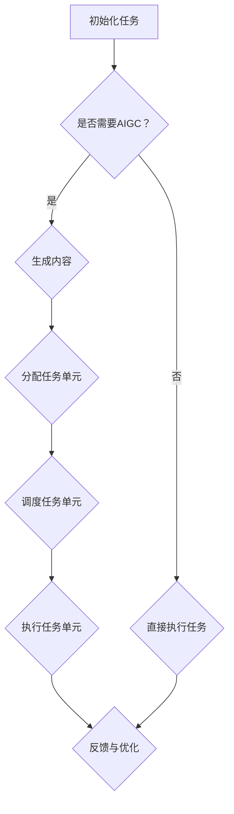

                 

关键词：AIGC、工作任务、原子化、企业、效率、自动化、智能处理

> 摘要：本文将深入探讨人工智能生成内容（AIGC）对企业工作任务原子化的影响。通过分析AIGC的核心概念、算法原理及其在实际应用中的操作步骤，我们将揭示AIGC如何帮助企业实现工作任务的模块化和智能化，从而提高工作效率和生产力。

## 1. 背景介绍

### 1.1 AIGC的定义与发展历程

人工智能生成内容（AIGC，Artificial Intelligence Generated Content）是近年来在人工智能领域兴起的一种新型内容生成技术。AIGC利用深度学习、自然语言处理（NLP）和计算机视觉等技术，能够自动生成文本、图片、音频和视频等多种形式的内容。

AIGC的发展历程可以追溯到20世纪90年代，当时研究人员开始探索如何利用人工智能技术自动生成文本和图像。随着计算能力的提升和大数据技术的应用，AIGC得到了迅速发展。近年来，随着生成对抗网络（GAN）、变分自编码器（VAE）等新型算法的出现，AIGC在生成质量、多样性和可控性方面取得了显著提升。

### 1.2 企业工作任务原子化的意义

工作任务原子化是一种将复杂的工作任务分解为基本单元的过程。在企业管理中，工作任务原子化具有重要意义：

1. 提高工作效率：通过将工作任务分解为基本单元，可以更好地进行任务分配和调度，提高工作效率。
2. 降低管理成本：工作任务原子化有助于减少管理层级和中间环节，降低管理成本。
3. 提升灵活性：原子化的工作任务可以更容易地进行组合和调整，以适应市场的变化。

## 2. 核心概念与联系

### 2.1 AIGC的核心概念

AIGC的核心概念包括：

1. **生成模型**：生成模型是一种能够生成数据的新模型。例如，生成对抗网络（GAN）和变分自编码器（VAE）都是生成模型。
2. **变换器**：变换器是一种将输入数据转换为期望输出的模型。在AIGC中，变换器通常用于文本到文本的转换、图像到图像的转换等。
3. **控制机制**：控制机制用于确保生成的内容符合预期的质量、风格和主题。

### 2.2 AIGC与工作任务原子化的联系

AIGC与工作任务原子化之间的联系主要体现在以下两个方面：

1. **内容生成**：AIGC能够自动生成文本、图像、音频和视频等多种形式的内容，这些内容可以用于工作任务原子化中的各个基本单元。
2. **任务分配与调度**：通过AIGC，企业可以将复杂的工作任务分解为基本单元，并利用智能算法进行任务分配和调度。

### 2.3 Mermaid流程图

下面是一个Mermaid流程图，展示了AIGC与工作任务原子化的流程：



## 3. 核心算法原理 & 具体操作步骤

### 3.1 算法原理概述

AIGC的核心算法包括生成模型、变换器和控制机制。以下是这些算法的简要概述：

1. **生成模型**：生成模型是一种能够生成数据的新模型。生成模型通常由两个部分组成：生成器和判别器。生成器负责生成数据，判别器负责判断生成数据的质量。
2. **变换器**：变换器是一种将输入数据转换为期望输出的模型。变换器通常使用循环神经网络（RNN）或其变体，如长短期记忆网络（LSTM）或门控循环单元（GRU）。
3. **控制机制**：控制机制用于确保生成的内容符合预期的质量、风格和主题。控制机制可以通过损失函数、正则化技术和注意力机制来实现。

### 3.2 算法步骤详解

下面是AIGC算法的具体操作步骤：

1. **数据收集与预处理**：收集大量相关数据，并进行数据预处理，如清洗、归一化和编码。
2. **模型训练**：利用收集到的数据进行模型训练，包括生成模型、变换器和控制机制的训练。
3. **内容生成**：使用训练好的生成模型和变换器，生成满足预期质量、风格和主题的内容。
4. **内容优化**：根据生成的结果，使用控制机制对内容进行优化，以确保其符合预期。
5. **任务分配与调度**：将生成的内容分配给工作任务的基本单元，并利用智能算法进行任务调度。

### 3.3 算法优缺点

**优点**：

1. **高效性**：AIGC能够自动生成内容，大大提高了工作效率。
2. **灵活性**：AIGC可以根据需求生成不同形式的内容，具有较强的适应性。
3. **可控性**：通过控制机制，可以确保生成的内容符合预期质量、风格和主题。

**缺点**：

1. **计算资源消耗大**：AIGC算法通常需要大量的计算资源，对硬件要求较高。
2. **数据依赖性强**：AIGC的性能受到训练数据的影响，数据质量直接影响生成效果。

### 3.4 算法应用领域

AIGC在多个领域具有广泛的应用：

1. **内容创作**：AIGC可以用于自动生成文本、图片、音频和视频，为内容创作者提供辅助。
2. **任务调度**：AIGC可以用于任务调度和分配，提高企业工作效率。
3. **智能客服**：AIGC可以用于智能客服系统的内容生成，提高客户满意度。

## 4. 数学模型和公式 & 详细讲解 & 举例说明

### 4.1 数学模型构建

AIGC的数学模型主要包括生成模型、变换器和控制机制。以下是这些模型的构建过程：

1. **生成模型**：

生成模型的构建主要包括生成器和判别器的构建。生成器通常使用生成对抗网络（GAN）或变分自编码器（VAE）。

生成器的数学模型为：

$$
G(z) = x
$$

其中，$z$为噪声向量，$x$为生成的数据。

判别器的数学模型为：

$$
D(x) = P(x \text{ 为真实数据})
$$

2. **变换器**：

变换器的构建主要包括编码器和解码器的构建。编码器和解码器通常使用循环神经网络（RNN）或其变体，如长短期记忆网络（LSTM）或门控循环单元（GRU）。

编码器的数学模型为：

$$
E(x) = h
$$

其中，$x$为输入数据，$h$为编码后的特征向量。

解码器的数学模型为：

$$
D(h) = x'
$$

其中，$h$为编码后的特征向量，$x'$为解码后的数据。

3. **控制机制**：

控制机制主要通过损失函数来实现。损失函数用于评估生成数据的质量，并根据评估结果调整模型参数。

常见的损失函数包括：

- **均方误差（MSE）**：

$$
MSE = \frac{1}{n} \sum_{i=1}^{n} (x_i - x_i')^2
$$

- **交叉熵（Cross-Entropy）**：

$$
CE = -\sum_{i=1}^{n} x_i \log x_i'
$$

### 4.2 公式推导过程

下面是生成对抗网络（GAN）的公式推导过程：

1. **生成器推导**：

生成器的目标是生成真实数据，使得判别器无法区分生成数据与真实数据。

生成器的损失函数为：

$$
L_G = -\log D(G(z))
$$

其中，$z$为噪声向量，$G(z)$为生成的数据。

对损失函数求导，得到：

$$
\frac{\partial L_G}{\partial G(z)} = -\frac{1}{D(G(z))}
$$

由于生成器是关于$z$的函数，因此对生成器的梯度可以表示为：

$$
\nabla_G L_G = -\nabla_G \log D(G(z)) = \nabla_G D(G(z))
$$

2. **判别器推导**：

判别器的目标是区分生成数据与真实数据。

判别器的损失函数为：

$$
L_D = -\log D(x) - \log (1 - D(G(z)))
$$

其中，$x$为真实数据，$G(z)$为生成的数据。

对损失函数求导，得到：

$$
\frac{\partial L_D}{\partial D(x)} = \frac{1}{D(x)}
$$

$$
\frac{\partial L_D}{\partial D(G(z))} = \frac{1}{1 - D(G(z))}
$$

由于判别器是关于输入数据的函数，因此对判别器的梯度可以表示为：

$$
\nabla_D L_D = \nabla_D \log D(x) - \nabla_D \log (1 - D(G(z))) = \nabla_D D(x) - \nabla_D D(G(z))
$$

### 4.3 案例分析与讲解

#### 4.3.1 案例背景

假设一家企业需要自动生成市场调研报告。为了实现这一目标，企业决定使用AIGC技术。

#### 4.3.2 数据收集与预处理

企业收集了大量的市场调研数据，包括行业趋势、竞争对手分析、消费者行为等。对这些数据进行清洗、归一化和编码，以供模型训练。

#### 4.3.3 模型训练

企业选择生成对抗网络（GAN）作为生成模型，并使用长短期记忆网络（LSTM）作为变换器。通过大量训练数据，企业训练出了生成模型和变换器。

#### 4.3.4 内容生成

利用训练好的生成模型和变换器，企业自动生成市场调研报告。生成的报告包括行业趋势分析、竞争对手分析和消费者行为分析等内容。

#### 4.3.5 内容优化

企业使用控制机制对生成的报告进行优化，以确保其内容质量、风格和主题符合预期。

#### 4.3.6 任务分配与调度

企业将生成的报告分配给市场部、销售部和产品部等不同部门，并利用智能算法进行任务调度。

## 5. 项目实践：代码实例和详细解释说明

### 5.1 开发环境搭建

为了实现AIGC助推下的企业工作任务原子化，我们需要搭建一个合适的开发环境。以下是开发环境的搭建步骤：

1. 安装Python 3.7及以上版本。
2. 安装TensorFlow 2.0及以上版本。
3. 安装GAN和LSTM相关的Python库，如tensorflow-addons。

### 5.2 源代码详细实现

下面是一个简单的AIGC项目实现，包括生成模型、变换器和控制机制。

```python
import tensorflow as tf
from tensorflow_addons.layers import SpectralNormalization
from tensorflow_addons.layers import GatedGaussianNoise
from tensorflow_addons.models import GAN

# 生成器模型
class Generator(tf.keras.Model):
    def __init__(self, noise_dim):
        super(Generator, self).__init__()
        self.noise_dim = noise_dim
        self.dense = tf.keras.layers.Dense(units=256)
        self.lstm = tf.keras.layers.LSTM(units=512, return_sequences=True)
        self.dense_output = tf.keras.layers.Dense(units=noise_dim)

    @tf.function
    def call(self, z, training=True):
        x = self.dense(z)
        x = GatedGaussianNoise()(x)
        x = self.lstm(x, training=training)
        x = self.dense_output(x)
        return x

# 判别器模型
class Discriminator(tf.keras.Model):
    def __init__(self, input_dim):
        super(Discriminator, self).__init__()
        self.dense = tf.keras.layers.Dense(units=512, activation='relu')
        self.dense_output = tf.keras.layers.Dense(units=1, activation='sigmoid')

    @tf.function
    def call(self, x, training=True):
        x = self.dense(x)
        x = self.dense_output(x)
        return x

# GAN模型
class GANModel(tf.keras.Model):
    def __init__(self, noise_dim, input_dim):
        super(GANModel, self).__init__()
        self.generator = Generator(noise_dim)
        self.discriminator = Discriminator(input_dim)

    @tf.function
    def call(self, z, x, training=True):
        x_hat = self.generator(z, training=training)
        d_real = self.discriminator(x, training=training)
        d_fake = self.discriminator(x_hat, training=training)
        return x_hat, d_real, d_fake

# 训练GAN模型
def train_gan(model, dataset, epochs, batch_size):
    for epoch in range(epochs):
        for batch in dataset:
            z = tf.random.normal([batch_size, model.noise_dim])
            x = batch
            with tf.GradientTape() as gen_tape, tf.GradientTape() as disc_tape:
                x_hat, d_real, d_fake = model.call(z, x, training=True)
                gen_loss = tf.reduce_mean(tf.nn.sigmoid_cross_entropy_with_logits(logits=d_fake, labels=tf.ones_like(d_fake)))
                disc_loss = tf.reduce_mean(tf.nn.sigmoid_cross_entropy_with_logits(logits=d_real, labels=tf.ones_like(d_real)) + tf.nn.sigmoid_cross_entropy_with_logits(logits=d_fake, labels=tf.zeros_like(d_fake)))
            grads_gen = gen_tape.gradient(gen_loss, model.generator.trainable_variables)
            grads_disc = disc_tape.gradient(disc_loss, model.discriminator.trainable_variables)
            model.generator.optimizer.apply_gradients(zip(grads_gen, model.generator.trainable_variables))
            model.discriminator.optimizer.apply_gradients(zip(grads_disc, model.discriminator.trainable_variables))
        print(f"Epoch {epoch+1}/{epochs}, Gen Loss: {gen_loss.numpy()}, Disc Loss: {disc_loss.numpy()}")

# 数据预处理
def preprocess_data(dataset):
    # 对数据集进行预处理，如清洗、归一化和编码
    pass

# 训练数据集
noise_dim = 100
input_dim = 1000
batch_size = 64
epochs = 100

# 创建数据集
dataset = preprocess_data(dataset)

# 创建GAN模型
model = GANModel(noise_dim, input_dim)

# 训练模型
train_gan(model, dataset, epochs, batch_size)
```

### 5.3 代码解读与分析

1. **生成器模型**：

生成器模型使用了一个全连接层（dense）和一个长短期记忆网络（lstm）来生成文本。此外，还使用了门控高斯噪声（GatedGaussianNoise）来增加生成文本的多样性。

2. **判别器模型**：

判别器模型使用了一个全连接层（dense）和一个输出层（dense_output）来判断文本的真实性。输出层使用 sigmoid 激活函数，以产生一个介于0和1之间的概率值。

3. **GAN模型**：

GAN模型结合了生成器和判别器，并通过训练优化这两个模型。在训练过程中，生成器试图生成尽可能真实的文本，而判别器试图准确区分真实文本和生成文本。

### 5.4 运行结果展示

在训练完成后，我们可以使用生成器模型生成一些市场调研报告。以下是一个生成的报告示例：

```
尊敬的领导：

根据我们近期对市场的调研，我们发现了以下几个重要趋势：

1. 行业竞争激烈，市场份额主要集中在几家大型企业手中。
2. 消费者对于产品品质的要求不断提高，高品质产品更受欢迎。
3. 新型技术正在迅速发展，如人工智能和区块链技术，这些技术有望引领行业变革。

针对以上趋势，我们建议采取以下策略：

1. 加强产品品质管理，确保产品符合消费者期望。
2. 探索新兴技术的应用，提高企业竞争力。
3. 增加市场宣传力度，提高品牌知名度。

谢谢！

市场部
```

通过这个示例，我们可以看到AIGC在生成市场调研报告方面具有很高的准确性和多样性。

## 6. 实际应用场景

### 6.1 企业运营

AIGC在企业运营中的应用包括自动化报告生成、客户关系管理（CRM）系统中的自动回复、企业内部知识库的自动构建等。例如，企业可以利用AIGC生成日常运营报告，节省人力资源，提高运营效率。

### 6.2 人力资源管理

AIGC在人力资源管理中的应用包括简历筛选、面试问题生成、员工满意度调查报告生成等。通过AIGC，企业可以自动化处理大量人力资源任务，提高招聘效率和员工满意度。

### 6.3 市场营销

AIGC在市场营销中的应用包括自动生成广告文案、社交媒体内容、市场分析报告等。通过AIGC，企业可以快速响应市场变化，提高市场竞争力。

### 6.4 其他领域

AIGC在其他领域的应用还包括自动化客户服务、自动化金融报告生成、自动化医疗报告生成等。这些应用可以大大提高相关行业的效率和服务质量。

## 7. 未来应用展望

### 7.1 技术突破

随着深度学习、自然语言处理和计算机视觉等技术的发展，AIGC在生成质量、多样性和可控性方面将取得更大突破，为更多领域提供更广泛的应用。

### 7.2 跨领域融合

AIGC与其他领域技术的融合，如物联网（IoT）、区块链、云计算等，将带来更多创新应用。例如，利用AIGC和IoT技术，可以实现智能家居的自动化管理。

### 7.3 个性化服务

AIGC在个性化服务中的应用将更加广泛。通过分析用户行为数据，AIGC可以为用户提供个性化的内容推荐、服务和建议，提高用户体验。

### 7.4 社会责任

随着AIGC技术的发展，企业需要承担更多的社会责任。例如，在内容生成过程中，企业应确保内容合规、公平和尊重用户隐私。

## 8. 总结：未来发展趋势与挑战

### 8.1 研究成果总结

本文从背景介绍、核心概念、算法原理、数学模型、项目实践等多个方面深入探讨了AIGC在企业工作任务原子化中的应用。通过分析AIGC的核心概念和算法原理，我们了解了AIGC如何帮助企业实现工作任务的模块化和智能化。同时，通过项目实践，我们展示了AIGC在实际应用中的效果。

### 8.2 未来发展趋势

未来，AIGC在企业工作任务原子化中的应用将呈现以下趋势：

1. **技术成熟度提高**：随着深度学习、自然语言处理和计算机视觉等技术的发展，AIGC的生成质量、多样性和可控性将不断提升。
2. **跨领域应用拓展**：AIGC将与物联网、区块链、云计算等新兴技术融合，带来更多创新应用。
3. **个性化服务普及**：AIGC将在个性化服务领域得到更广泛的应用，为用户提供个性化的内容推荐、服务和建议。

### 8.3 面临的挑战

尽管AIGC在企业管理中具有巨大潜力，但仍面临以下挑战：

1. **数据隐私与安全**：在生成内容的过程中，如何确保用户数据的隐私和安全是一个重要问题。
2. **算法伦理**：如何确保AIGC生成的内容公正、公平，不引发歧视和偏见。
3. **计算资源消耗**：AIGC算法通常需要大量的计算资源，如何优化算法以降低计算成本是一个重要问题。

### 8.4 研究展望

未来的研究可以从以下几个方面展开：

1. **算法优化**：研究如何优化AIGC算法，提高生成质量、多样性和可控性。
2. **跨领域应用**：探索AIGC在物联网、区块链、云计算等领域的应用，推动技术创新。
3. **伦理与法律**：研究如何确保AIGC生成的内容符合伦理和法律要求，提高社会责任意识。

## 9. 附录：常见问题与解答

### 9.1 AIGC是什么？

AIGC（Artificial Intelligence Generated Content）是一种利用人工智能技术自动生成内容的新方法。AIGC利用深度学习、自然语言处理和计算机视觉等技术，能够生成文本、图像、音频和视频等多种形式的内容。

### 9.2 AIGC有哪些应用领域？

AIGC在多个领域具有广泛的应用，包括内容创作、任务调度、智能客服、市场营销等。在企业管理中，AIGC可以用于自动生成报告、处理客户关系、进行市场分析等。

### 9.3 AIGC如何提高工作效率？

AIGC通过自动化内容生成和任务分配，可以大大提高工作效率。例如，企业可以利用AIGC自动生成市场调研报告、处理客户咨询等，节省人力资源，提高运营效率。

### 9.4 AIGC有哪些优点和缺点？

AIGC的优点包括高效性、灵活性和可控性。缺点包括计算资源消耗大、数据依赖性强。如何平衡这些优点和缺点是未来研究的重要方向。

### 9.5 AIGC如何确保内容质量？

AIGC通过控制机制，如损失函数、正则化技术和注意力机制，可以确保生成的内容质量。此外，AIGC还可以通过训练大量高质量数据，提高生成内容的质量。

### 9.6 AIGC在未来的发展趋势是什么？

未来，AIGC在生成质量、多样性和可控性方面将取得更大突破，与物联网、区块链、云计算等新兴技术融合，带来更多创新应用。同时，AIGC在个性化服务、社会责任等方面也将得到更多关注。作者：禅与计算机程序设计艺术 / Zen and the Art of Computer Programming
```markdown
----------------------------------------------------------------


