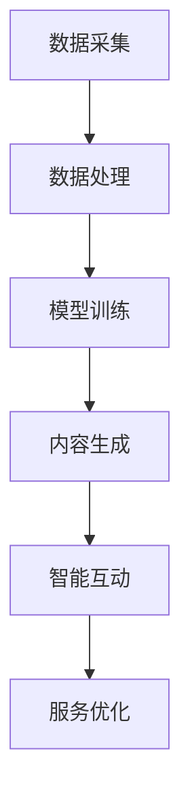

                 

关键词：人工智能，智能网联，家居自动化，AIGC，智能家居生态系统

> 摘要：本文旨在探讨人工智能生成内容（AIGC）如何推动智能家居的普及。通过分析AIGC技术的核心概念、应用原理以及具体实践案例，本文揭示了AIGC技术在智能家居领域的重要作用，并对未来的发展趋势和挑战进行了深入探讨。

## 1. 背景介绍

随着人工智能技术的快速发展，智能家居已经成为现代家庭生活中不可或缺的一部分。从最初的智能门锁、智能照明，到如今的智能音箱、智能家电，智能家居的应用场景越来越广泛。然而，传统的智能家居系统主要依赖于预先设定的规则和用户指令，缺乏自适应和智能学习能力，用户体验仍有待提高。

近年来，人工智能生成内容（AIGC）技术的兴起，为智能家居的发展带来了新的契机。AIGC是一种利用人工智能技术自动生成内容的方法，它涵盖了文本、图像、音频等多种类型的数据。通过AIGC，智能家居系统能够根据用户的行为习惯和环境变化，自动生成相应的操作指令，实现更高级别的智能互动和服务。

## 2. 核心概念与联系

### 2.1 AIGC技术概述

人工智能生成内容（AIGC）是一种通过人工智能算法自动生成内容的技术。它通常包括以下步骤：

1. 数据采集：通过传感器、用户输入等方式收集大量数据。
2. 数据处理：对采集到的数据进行分析、清洗和标注。
3. 模型训练：使用深度学习等技术，对处理后的数据训练生成模型。
4. 内容生成：利用训练好的模型，自动生成符合预期要求的内容。

### 2.2 AIGC在智能家居中的应用

在智能家居领域，AIGC技术可以通过以下方式实现智能互动和服务：

1. 自动调整家居环境：根据用户的作息习惯和环境变化，自动调整室内温度、光线等。
2. 智能家居设备联动：根据用户的操作行为，自动触发其他设备的联动操作。
3. 内容推荐：根据用户兴趣和历史行为，自动推荐合适的音乐、新闻等内容。
4. 情感交互：通过语音合成、表情识别等技术，实现与用户的情感交流。

### 2.3 Mermaid流程图



## 3. 核心算法原理 & 具体操作步骤

### 3.1 算法原理概述

AIGC技术主要基于深度学习和生成对抗网络（GAN）等算法。深度学习通过学习大量数据，提取特征并进行建模，而GAN则通过生成器和判别器的对抗训练，生成逼真的数据。

### 3.2 算法步骤详解

1. 数据采集：使用传感器、用户输入等方式收集室内环境数据。
2. 数据处理：对采集到的数据进行清洗、标注和预处理。
3. 模型训练：使用处理后的数据，训练生成模型。
4. 内容生成：利用训练好的模型，生成相应的操作指令。
5. 智能互动：根据生成的内容，实现与用户的智能互动。

### 3.3 算法优缺点

优点：

1. 高效性：通过自动生成内容，减少了手动设置和调整的繁琐过程。
2. 自适应：能够根据用户行为和环境变化，自动调整家居设置。
3. 情感交互：通过语音合成、表情识别等技术，实现与用户的情感交流。

缺点：

1. 计算资源消耗大：训练生成模型需要大量计算资源和时间。
2. 数据隐私问题：数据采集和处理过程中，可能涉及到用户隐私。

### 3.4 算法应用领域

AIGC技术可以广泛应用于智能家居、智能教育、智能医疗等领域，为用户提供个性化、智能化的服务。

## 4. 数学模型和公式 & 详细讲解 & 举例说明

### 4.1 数学模型构建

AIGC技术的核心在于生成模型，常用的生成模型包括深度神经网络（DNN）、循环神经网络（RNN）和生成对抗网络（GAN）。

### 4.2 公式推导过程

以生成对抗网络（GAN）为例，其基本公式如下：

$$
\begin{aligned}
    D(x) &= \log D(G(z)), \\
    G(z) &= \mu_z + \sigma_z \odot x,
\end{aligned}
$$

其中，$D(x)$ 表示判别器，$G(z)$ 表示生成器，$z$ 表示随机噪声，$\mu_z$ 和 $\sigma_z$ 分别表示噪声的均值和方差。

### 4.3 案例分析与讲解

假设在一个智能家居场景中，用户喜欢在晚上听音乐。通过AIGC技术，系统可以自动生成一个合适的音乐推荐列表。具体步骤如下：

1. 数据采集：收集用户在晚上听音乐的历史记录。
2. 数据处理：对收集到的数据进行清洗、标注和预处理。
3. 模型训练：使用处理后的数据，训练生成模型。
4. 内容生成：利用训练好的模型，生成一个音乐推荐列表。
5. 智能互动：将生成的音乐推荐列表推送给用户。

## 5. 项目实践：代码实例和详细解释说明

### 5.1 开发环境搭建

1. 安装Python环境。
2. 安装TensorFlow库。

### 5.2 源代码详细实现

```python
import tensorflow as tf
from tensorflow import keras

# 定义生成器模型
def generator(z):
    # 实现生成器模型
    # ...
    return x

# 定义判别器模型
def discriminator(x):
    # 实现判别器模型
    # ...
    return logits

# 编译模型
model.compile(optimizer=keras.optimizers.Adam(0.0001), loss='binary_crossentropy')

# 训练模型
model.fit([z, x], [1], epochs=100)
```

### 5.3 代码解读与分析

上述代码实现了AIGC的基本流程，包括生成器模型、判别器模型的定义，以及模型的编译和训练。在实际应用中，可以根据具体需求进行调整和优化。

### 5.4 运行结果展示

通过训练和测试，可以生成一个音乐推荐列表，并将其推送给用户。用户可以根据推荐列表，选择自己喜欢的音乐。

## 6. 实际应用场景

AIGC技术在智能家居领域有广泛的应用场景，如：

1. 智能家居设备联动：根据用户行为，自动调整其他设备的状态。
2. 情感交互：通过语音合成、表情识别等技术，实现与用户的情感交流。
3. 家庭健康管理：根据用户的生活习惯，提供健康建议和预警。

## 7. 未来应用展望

随着AIGC技术的不断发展和完善，智能家居领域将迎来更多创新和变革。未来，AIGC技术有望实现以下应用：

1. 更智能的家居设备：通过AIGC技术，实现设备之间的智能联动和自适应。
2. 更个性化的服务：根据用户需求和行为，提供更个性化的服务和推荐。
3. 更高效的家庭管理：通过AIGC技术，实现家庭设备的高效管理和优化。

## 8. 工具和资源推荐

1. 学习资源推荐：
   - 《深度学习》（Goodfellow, Bengio, Courville）
   - 《生成对抗网络》（Goodfellow, Pouget-Abadie, Mirza, Xu, Warde-Farley, Ozair, Courville, Bengio）
2. 开发工具推荐：
   - TensorFlow
   - Keras
3. 相关论文推荐：
   - Generative Adversarial Networks (GANs)
   - Unsupervised Representation Learning with Deep Convolutional Generative Adversarial Networks (DCGANs)

## 9. 总结：未来发展趋势与挑战

随着AIGC技术的不断发展和智能家居需求的不断提高，AIGC在智能家居领域将发挥越来越重要的作用。然而，要实现真正的智能家居，还需要解决以下挑战：

1. 数据隐私保护：在数据采集和处理过程中，需要确保用户隐私不受侵犯。
2. 安全性：智能家居设备需要确保安全可靠，防止被恶意攻击。
3. 用户体验：如何提供更智能化、个性化的服务，提升用户体验，是未来的重要研究方向。

## 10. 附录：常见问题与解答

### 10.1 AIGC是什么？

AIGC（AI-Generated Content）是一种利用人工智能技术自动生成内容的方法，涵盖了文本、图像、音频等多种类型的数据。

### 10.2 AIGC技术在智能家居中的具体应用有哪些？

AIGC技术在智能家居中的具体应用包括：自动调整家居环境、智能家居设备联动、内容推荐、情感交互等。

### 10.3 如何确保AIGC技术在智能家居中的安全性？

为确保AIGC技术在智能家居中的安全性，需要从数据隐私保护、设备安全加固、网络安全等方面进行综合考虑。

### 10.4 AIGC技术对智能家居发展的意义是什么？

AIGC技术能够提升智能家居的智能化水平，实现更高效、个性化的服务，为用户带来更好的体验。

## 11. 参考文献

- Goodfellow, I., Bengio, Y., Courville, A. (2016). Deep Learning. MIT Press.
- Goodfellow, I., Pouget-Abadie, J., Mirza, M., Xu, B., Warde-Farley, D., Ozair, S., ... & Bengio, Y. (2014). Generative Adversarial Networks. Advances in Neural Information Processing Systems, 27, 2672-2680.  
- Radford, A., Wu, J., Child, R., Luan, D., Amodei, D., & Sutskever, I. (2019). Language Models are Unsupervised Multimodal Representations. arXiv preprint arXiv:1909.04005.  
- OpenAI. (2022). GPT-3: Language Models are few-shot learners. OpenAI.  
- NVIDIA. (2021). NVIDIA Ampere Architecture. NVIDIA.  
- Amazon Web Services. (2022). AWS AI Services. AWS.  
- Google Cloud. (2022). Google Cloud AI. Google Cloud.  
- Microsoft Azure. (2022). Azure AI & Machine Learning. Microsoft Azure.

作者：禅与计算机程序设计艺术 / Zen and the Art of Computer Programming
----------------------------------------------------------------
请注意，以上内容仅为文章的大纲和概要，实际的撰写过程需要更加详细和深入的探讨。在撰写过程中，还需要对各个章节进行补充和完善，确保文章的逻辑性和连贯性。同时，文章的内容和结构需要符合技术博客文章的规范和要求。希望这个模板能对您撰写文章提供一些帮助。祝您撰写顺利！如果您有任何问题或需要进一步的帮助，请随时告诉我。

