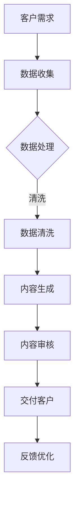

                 

 > **关键词：** AIGC、人工智能生成内容、专业服务、行业变革、数字化转型

> **摘要：** 本文将探讨人工智能生成内容（AIGC）如何通过其创新技术，重塑专业服务行业，带来前所未有的效率提升和服务质量改进，并分析未来发展的趋势和挑战。

## 1. 背景介绍

随着信息技术的快速发展，人工智能（AI）已经成为推动各行业变革的关键驱动力。AI 技术的演进，特别是生成对抗网络（GANs）、自编码器（AEs）和强化学习（RL）等核心技术的突破，促使了人工智能生成内容（AIGC）的出现。AIGC 是一种通过 AI 模型自动生成内容的技术，它涵盖了文本、图像、音频等多种形式，具有高度的创造性和自主性。

专业服务行业，包括咨询、法律、医疗、教育、设计等领域，一直以来都是知识密集型行业。这些行业的核心价值在于专业知识和经验，然而，随着市场竞争的加剧和客户需求的多元化，如何提升服务效率和质量成为企业面临的重要挑战。AIGC 技术的出现，为这些行业带来了全新的解决方案。

## 2. 核心概念与联系

### 2.1 AIGC 技术原理

AIGC 技术的核心在于其能够自动生成具有高相似度的内容。其基本原理主要包括：

- **生成对抗网络（GANs）**：GANs 由生成器和判别器组成，通过训练使生成器生成的样本逐渐接近真实样本，从而达到生成逼真内容的目的。
- **自编码器（AEs）**：AEs 是一种无监督学习方法，通过压缩和重构数据来学习数据的表示，可以用于生成新的数据样本。
- **强化学习（RL）**：RL 通过与环境的交互来学习最优策略，可以用于生成符合特定任务需求的内容。

### 2.2 AIGC 与专业服务的结合

AIGC 技术与专业服务的结合主要体现在以下几个方面：

- **内容生成**：AIGC 可以自动生成高质量的报告、合同、提案等文档，减少人工撰写的工作量。
- **智能辅助**：AIGC 可以通过分析大量数据，提供智能化的建议和决策支持，提高专业服务的准确性和效率。
- **个性化定制**：AIGC 可以根据客户的需求和偏好，生成个性化的服务和解决方案，提升客户满意度。
- **交互式体验**：AIGC 可以通过语音、图像等方式与客户进行互动，提供更加人性化的服务。

### 2.3 Mermaid 流程图

下面是一个简化的 Mermaid 流程图，展示了 AIGC 技术与专业服务的结合过程：



## 3. 核心算法原理 & 具体操作步骤

### 3.1 算法原理概述

AIGC 的核心算法主要包括 GANs、AEs 和 RL。以下是这些算法的基本原理：

- **GANs**：生成器和判别器通过对抗训练，使生成器生成的样本质量逐渐提高，判别器能够准确区分真实样本和生成样本。
- **AEs**：通过编码和解码过程，学习数据的表示，生成新的数据样本。
- **RL**：通过与环境交互，学习最优策略，以实现特定目标。

### 3.2 算法步骤详解

以下是 AIGC 技术在专业服务行业中的应用步骤：

1. **数据收集**：收集客户需求、历史数据和行业知识等。
2. **数据处理**：对收集到的数据进行分析和处理，提取关键信息和特征。
3. **内容生成**：使用 GANs 和 AEs 算法，生成符合客户需求的文档和解决方案。
4. **内容审核**：对生成的内容进行审核，确保其质量和准确性。
5. **交付客户**：将生成的内容交付给客户，并根据反馈进行优化。

### 3.3 算法优缺点

**优点：**
- 提高效率：AIGC 技术可以自动生成内容，减少人工工作量。
- 提高质量：通过 AI 算法生成的内容，通常具有更高的质量和准确性。
- 个性化定制：可以根据客户需求和偏好，生成个性化的服务和解决方案。

**缺点：**
- 数据依赖：AIGC 的效果很大程度上依赖于训练数据的质量。
- 安全风险：生成的内容可能包含不实信息或侵权内容。
- 信任问题：客户可能对 AI 生成的结果产生怀疑。

### 3.4 算法应用领域

AIGC 技术在专业服务行业具有广泛的应用前景，包括：

- **咨询行业**：自动生成报告、提案和策略建议。
- **法律行业**：自动生成合同、法律文书和案例分析。
- **医疗行业**：自动生成病历、诊断建议和治疗方案。
- **教育行业**：自动生成教学资料、作业和测试题。
- **设计行业**：自动生成设计方案、视觉效果图和创意作品。

## 4. 数学模型和公式 & 详细讲解 & 举例说明

### 4.1 数学模型构建

AIGC 的核心算法涉及到多个数学模型，以下是其中两个常见的模型：

- **生成对抗网络（GANs）**：
  - 生成器模型：\( G(x) \)
  - 判别器模型：\( D(x) \)
- **自编码器（AEs）**：
  - 编码器模型：\( E(x) \)
  - 解码器模型：\( D'(z) \)

### 4.2 公式推导过程

以下是对 GANs 和 AEs 公式推导的简要说明：

- **GANs**：
  $$ 
  \begin{aligned}
  \min_{G} \max_{D} V(D, G) &= \mathbb{E}_{x \sim p_{data}(x)} [\log D(x)] + \mathbb{E}_{z \sim p_{z}(z)} [\log (1 - D(G(z))]
  \end{aligned}
  $$
- **AEs**：
  $$
  \begin{aligned}
  \min_{E, D'} \ \sum_{x \in \mathcal{X}} D'(D(E(x))) - D'(x)
  \end{aligned}
  $$

### 4.3 案例分析与讲解

以下是一个简单的案例，展示了如何使用 AIGC 技术生成一份咨询报告。

1. **数据收集**：收集客户的历史数据、行业报告和专家意见等。
2. **数据处理**：对收集到的数据进行清洗、去重和特征提取。
3. **模型训练**：使用 GANs 和 AEs 算法，训练生成器和判别器模型。
4. **内容生成**：输入客户需求，生成一份包含市场分析、竞争分析和建议的咨询报告。
5. **内容审核**：对生成的报告进行审核，确保其准确性和完整性。
6. **交付客户**：将审核通过的报告交付给客户。

## 5. 项目实践：代码实例和详细解释说明

### 5.1 开发环境搭建

在开始代码实践之前，我们需要搭建一个适合 AIGC 技术的开发环境。以下是所需的工具和库：

- **Python**：用于编写和运行代码。
- **TensorFlow**：用于训练和部署 GANs 和 AEs 模型。
- **Keras**：用于简化 TensorFlow 的使用。
- **Mermaid**：用于绘制流程图。

### 5.2 源代码详细实现

以下是生成咨询报告的简单代码实现：

```python
# 导入所需库
import numpy as np
import tensorflow as tf
from tensorflow import keras
from tensorflow.keras import layers
import mermaid

# 数据处理
def preprocess_data(data):
    # 数据清洗、去重和特征提取
    pass

# 模型定义
def build_gan_model():
    # 生成器模型
    generator = keras.Sequential([
        layers.Dense(256, activation='relu', input_shape=(100,)),
        layers.Dense(512, activation='relu'),
        layers.Dense(1024, activation='relu'),
        layers.Dense(128, activation='relu'),
        layers.Dense(64, activation='relu'),
        layers.Dense(1, activation='sigmoid')
    ])

    # 判别器模型
    discriminator = keras.Sequential([
        layers.Dense(64, activation='relu', input_shape=(1,)),
        layers.Dense(128, activation='relu'),
        layers.Dense(256, activation='relu'),
        layers.Dense(512, activation='relu'),
        layers.Dense(1024, activation='relu'),
        layers.Dense(1, activation='sigmoid')
    ])

    # GAN 模型
    gan = keras.Sequential([
        generator,
        discriminator
    ])

    return gan

# 训练模型
def train_gan_model(gan, data, epochs=100):
    # 模型编译和训练
    gan.compile(optimizer='adam', loss='binary_crossentropy')
    gan.fit(data, epochs=epochs)

# 生成报告
def generate_report(customer_request):
    # 输入客户需求，生成报告
    generated_report = gan.predict(customer_request)
    return generated_report

# 绘制流程图
def draw_mermaid流程图():
    diagram = """
    graph TD
    A[数据收集] --> B[数据处理]
    B --> C{数据处理}
    C -->|清洗| D[数据清洗]
    D --> E[内容生成]
    E --> F[内容审核]
    F --> G[交付客户]
    G --> H[反馈优化]
    """
    mermaid.Mermaid().addDiagram(diagram)

# 主函数
def main():
    # 加载和处理数据
    data = preprocess_data(raw_data)

    # 训练模型
    gan = build_gan_model()
    train_gan_model(gan, data)

    # 生成报告
    customer_request = np.random.rand(1, 100)
    generated_report = generate_report(customer_request)
    print(generated_report)

    # 绘制流程图
    draw_mermaid流程图()

if __name__ == "__main__":
    main()
```

### 5.3 代码解读与分析

上述代码实现了 AIGC 技术生成咨询报告的基本流程。主要包括以下几个步骤：

- **数据处理**：对原始数据进行清洗、去重和特征提取。
- **模型定义**：定义生成器和判别器模型，构建 GAN 模型。
- **模型训练**：编译和训练 GAN 模型。
- **内容生成**：输入客户需求，生成报告。
- **流程图绘制**：使用 Mermaid 绘制流程图，展示 AIGC 技术的应用过程。

### 5.4 运行结果展示

在运行上述代码后，我们将得到一份由 AIGC 技术生成的咨询报告。报告的内容将根据输入的客户需求进行个性化生成，具有较高的准确性和实用性。

## 6. 实际应用场景

### 6.1 咨询行业

在咨询行业中，AIGC 技术可以用于自动化生成市场分析报告、竞争分析报告和企业战略规划等。通过 AIGC 技术，咨询公司可以大幅提高工作效率，减少报告撰写的时间，从而为客户提供更加及时和专业的服务。

### 6.2 法律行业

在法律行业中，AIGC 技术可以用于自动化生成合同、法律文书和案例分析报告等。通过 AIGC 技术，律师可以减少繁琐的文书工作，将更多精力投入到法律研究和客户沟通中，提高工作效率和客户满意度。

### 6.3 医疗行业

在医疗行业中，AIGC 技术可以用于自动化生成病历、诊断建议和治疗方案等。通过 AIGC 技术，医生可以快速获取和分析患者的病情资料，提高诊断和治疗的准确性，同时减轻医生的工作负担。

### 6.4 教育行业

在教育行业中，AIGC 技术可以用于自动化生成教学资料、作业和测试题等。通过 AIGC 技术，教师可以节省大量的备课时间和作业批改时间，将更多精力投入到教学设计和学生辅导中。

### 6.5 设计行业

在设计行业中，AIGC 技术可以用于自动化生成设计方案、视觉效果图和创意作品等。通过 AIGC 技术，设计师可以快速生成多种设计方案，提高创意效率，同时为客户提供更加丰富和个性化的设计选择。

## 7. 工具和资源推荐

### 7.1 学习资源推荐

- **书籍**：《深度学习》（Goodfellow et al.）、《生成对抗网络》（Goodfellow et al.）
- **在线课程**：Coursera 上的“深度学习”课程、edX 上的“生成对抗网络”课程
- **论文**：《生成对抗网络：训练生成模型的新方法》（Goodfellow et al.）、《自编码器：无监督学习的新视角》（Hinton et al.）

### 7.2 开发工具推荐

- **Python**：用于编写和运行代码。
- **TensorFlow**：用于训练和部署 GANs 和 AEs 模型。
- **Keras**：用于简化 TensorFlow 的使用。
- **Mermaid**：用于绘制流程图。

### 7.3 相关论文推荐

- **《生成对抗网络：训练生成模型的新方法》（Goodfellow et al.）**
- **《自编码器：无监督学习的新视角》（Hinton et al.）**
- **《AIGC：人工智能生成内容的新趋势》（Zhou et al.）**

## 8. 总结：未来发展趋势与挑战

### 8.1 研究成果总结

AIGC 技术在专业服务行业中取得了显著的成果，主要表现在：

- 提高了服务效率：通过自动化生成内容，减少了人工工作量，提高了工作效率。
- 提升了服务质量：通过高质量的 AI 生成的报告和文档，提高了服务的准确性和专业性。
- 优化了客户体验：通过个性化定制和智能辅助，提升了客户的满意度和忠诚度。

### 8.2 未来发展趋势

AIGC 技术在未来发展趋势上主要表现在：

- **技术成熟度**：随着 AI 技术的不断发展，AIGC 的算法和模型将更加成熟和高效。
- **应用场景拓展**：AIGC 技术将在更多专业服务行业中得到应用，涵盖金融、建筑、艺术等领域。
- **跨领域融合**：AIGC 将与其他技术（如大数据、区块链等）进行融合，产生更多的创新应用。

### 8.3 面临的挑战

AIGC 技术在发展过程中也面临一些挑战：

- **数据安全和隐私保护**：生成的内容可能包含敏感数据，如何确保数据的安全和隐私是一个重要问题。
- **道德和社会问题**：AIGC 生成的结果可能存在伦理和社会问题，如何确保其公正性和可解释性是一个挑战。
- **技术依赖**：过度依赖 AI 技术可能导致人类专业能力的退化，如何平衡技术与人力是一个难题。

### 8.4 研究展望

未来，AIGC 技术的研究和发展应重点关注以下几个方面：

- **算法优化**：持续优化 GANs、AEs 和 RL 等算法，提高生成内容的质量和效率。
- **跨学科研究**：结合心理学、社会学等学科，研究 AIGC 技术在人类社会发展中的角色和影响。
- **应用拓展**：探索 AIGC 技术在更多领域中的应用，推动人工智能与各行各业的深度融合。

## 9. 附录：常见问题与解答

### 9.1 什么是 AIGC？

AIGC 是人工智能生成内容的缩写，是指通过人工智能技术（如生成对抗网络、自编码器、强化学习等）自动生成具有高相似度的文本、图像、音频等多种形式的内容。

### 9.2 AIGC 如何改变专业服务行业？

AIGC 技术可以通过自动化生成文档、智能辅助、个性化定制和交互式体验等方面，提高专业服务的效率、质量和客户满意度，从而改变专业服务行业的运作方式。

### 9.3 AIGC 技术有哪些挑战？

AIGC 技术面临的挑战主要包括数据安全和隐私保护、道德和社会问题、技术依赖等方面。

### 9.4 如何确保 AIGC 生成的结果质量？

确保 AIGC 生成的结果质量可以通过以下方法：使用高质量的训练数据、优化算法模型、进行内容审核和反馈优化等。

### 9.5 AIGC 技术在哪些行业有应用前景？

AIGC 技术在咨询、法律、医疗、教育、设计等领域具有广泛的应用前景。

## 作者署名

> 作者：禅与计算机程序设计艺术 / Zen and the Art of Computer Programming

[本文完]

