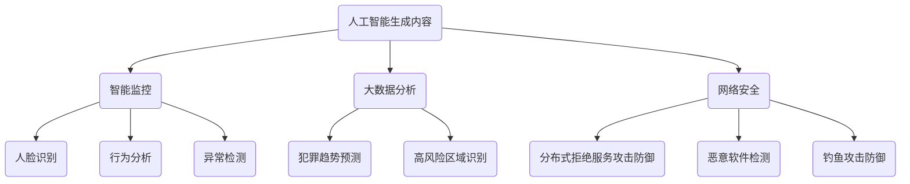

                 

 关键词：人工智能生成内容（AIGC）、公共安全、智能监控、大数据分析、网络安全

> 摘要：本文将探讨人工智能生成内容（AIGC）如何重新定义公共安全领域。通过对AIGC技术的深入分析，本文将揭示其在智能监控、大数据分析和网络安全等关键应用领域的巨大潜力，以及它对传统公共安全模式和策略的颠覆性影响。

## 1. 背景介绍

公共安全一直是社会发展的重中之重。随着科技的进步，特别是人工智能（AI）和大数据分析的迅猛发展，公共安全领域迎来了全新的变革。传统的公共安全模式主要依赖于人力和物理设施，如巡逻警力、监控摄像头和报警系统等。然而，这些方法存在反应速度慢、覆盖范围有限和成本高昂等问题。

近年来，人工智能生成内容（AIGC）技术的兴起为公共安全领域带来了新的机遇。AIGC是指通过人工智能模型生成内容的能力，包括文本、图像、音频和视频等。它不仅能够提高数据分析的效率和准确性，还能实现实时监测和预警，从而极大地提升公共安全水平。

## 2. 核心概念与联系

为了更好地理解AIGC在公共安全中的应用，我们首先需要了解几个核心概念：

### 2.1 人工智能生成内容（AIGC）

AIGC是人工智能（AI）的一种高级形式，它通过深度学习和自然语言处理（NLP）技术生成各种类型的内容。AIGC的应用场景非常广泛，包括但不限于内容创作、虚拟助手、智能监控和网络安全等。

### 2.2 智能监控

智能监控是公共安全领域的重要一环。通过将AIGC技术应用于视频监控，可以实现实时人脸识别、行为分析、异常检测等功能。这不仅提高了监控的准确性，还能显著降低人力成本。

### 2.3 大数据分析

大数据分析是现代公共安全的重要手段。通过收集和分析大量数据，可以预测犯罪趋势、识别高风险区域和预防犯罪事件。AIGC技术可以增强大数据分析的能力，使其更加高效和准确。

### 2.4 网络安全

网络安全是公共安全的另一个关键领域。AIGC技术可以用于检测和防御网络攻击，包括DDoS攻击、恶意软件和钓鱼攻击等。

以下是一个使用Mermaid绘制的流程图，展示了AIGC在公共安全中的核心概念和联系：



## 3. 核心算法原理 & 具体操作步骤

### 3.1 算法原理概述

AIGC技术的核心是生成模型，如生成对抗网络（GAN）和变分自编码器（VAE）。这些模型通过学习和生成真实数据，能够在不同的应用场景中生成高质量的内容。

### 3.2 算法步骤详解

以下是AIGC在公共安全中的应用步骤：

1. **数据采集**：收集各种类型的数据，如视频、图像、文本和网络流量等。
2. **预处理**：对数据进行清洗、标注和格式转换，使其适合用于训练生成模型。
3. **模型训练**：使用生成模型对预处理后的数据进行训练，以生成高质量的内容。
4. **应用部署**：将训练好的模型部署到实际应用场景中，如智能监控和网络安全。
5. **实时监测与预警**：利用生成模型进行实时数据分析和处理，实现监测和预警功能。

### 3.3 算法优缺点

**优点**：

- **高效性**：AIGC技术可以快速处理大量数据，提高监控和分析的效率。
- **准确性**：通过深度学习和大数据分析，AIGC技术能够提供高度准确的预测和预警。
- **智能化**：AIGC技术能够自动学习和适应新环境，提高公共安全系统的智能化水平。

**缺点**：

- **数据隐私**：AIGC技术涉及大量数据的处理和存储，存在数据隐私和安全风险。
- **计算成本**：训练生成模型需要大量的计算资源和时间。

### 3.4 算法应用领域

AIGC技术在公共安全领域有广泛的应用，包括但不限于：

- **智能监控**：用于实时人脸识别、行为分析和异常检测。
- **大数据分析**：用于犯罪趋势预测、高风险区域识别和预防犯罪。
- **网络安全**：用于检测和防御网络攻击，如DDoS攻击、恶意软件和钓鱼攻击。

## 4. 数学模型和公式 & 详细讲解 & 举例说明

### 4.1 数学模型构建

在AIGC技术中，常用的数学模型包括生成对抗网络（GAN）和变分自编码器（VAE）。以下是一个简化的GAN模型：

```latex
\begin{align*}
\text{GAN} &= (\text{Generator}, \text{Discriminator}) \\
G(z) &= \text{生成器，输入随机噪声z，输出假样本x} \\
D(x) &= \text{判别器，输入真实样本x或生成器生成的假样本x'} \\
\end{align*}
```

### 4.2 公式推导过程

GAN的训练过程可以分为两部分：生成器（Generator）和判别器（Discriminator）。

1. **生成器G**：生成器通过学习随机噪声z，生成与真实样本相似的假样本x'。其损失函数为：

   ```latex
   L_G = -\mathbb{E}_{z \sim p_z(z)}[\log(D(G(z))]
   ```

2. **判别器D**：判别器通过学习区分真实样本x和生成器生成的假样本x'。其损失函数为：

   ```latex
   L_D = -\mathbb{E}_{x \sim p_{\text{data}}(x)}[\log(D(x))] - \mathbb{E}_{z \sim p_z(z)}[\log(1 - D(G(z))]
   ```

### 4.3 案例分析与讲解

假设我们有一个监控摄像头，需要实时检测并识别通过摄像头的人脸。以下是一个简化的案例：

1. **数据采集**：采集大量人脸图像，并对其进行标注。
2. **模型训练**：使用GAN模型训练生成器和判别器，以区分真实人脸和生成的人脸。
3. **应用部署**：将训练好的模型部署到摄像头中，实时检测并识别人脸。
4. **预警**：当检测到可疑人脸时，立即发出预警。

## 5. 项目实践：代码实例和详细解释说明

### 5.1 开发环境搭建

为了实现AIGC在公共安全中的应用，我们需要搭建一个合适的开发环境。以下是一个简单的Python开发环境搭建步骤：

1. 安装Python（版本3.8以上）
2. 安装必要的库，如TensorFlow、Keras和OpenCV等
3. 搭建GPU环境（可选）

### 5.2 源代码详细实现

以下是AIGC在公共安全中应用的一个简单示例：

```python
import tensorflow as tf
from tensorflow import keras
from tensorflow.keras import layers

# 构建生成器模型
def build_generator():
    model = keras.Sequential()
    model.add(layers.Dense(128, activation='relu', input_shape=(100,)))
    model.add(layers.Dense(28 * 28 * 1, activation='relu'))
    model.add(layers.Reshape((28, 28, 1)))
    model.add(layers.Conv2DTranspose(128, (5, 5), strides=(2, 2), padding='same', activation='relu'))
    model.add(layers.Conv2DTranspose(64, (5, 5), strides=(2, 2), padding='same', activation='relu'))
    model.add(layers.Conv2DTranspose(1, (5, 5), strides=(2, 2), padding='same', activation='tanh'))
    return model

# 构建判别器模型
def build_discriminator():
    model = keras.Sequential()
    model.add(layers.Conv2D(64, (5, 5), strides=(2, 2), padding='same', input_shape=(28, 28, 1)))
    model.add(layers.LeakyReLU(0.01))
    model.add(layers.Dropout(0.3))
    model.add(layers.Conv2D(128, (5, 5), strides=(2, 2), padding='same'))
    model.add(layers.LeakyReLU(0.01))
    model.add(layers.Dropout(0.3))
    model.add(layers.Flatten())
    model.add(layers.Dense(1))
    return model

# 构建完整模型
def build_gan(generator, discriminator):
    model = keras.Sequential()
    model.add(generator)
    model.add(discriminator)
    return model

# 实例化模型
generator = build_generator()
discriminator = build_discriminator()
gan = build_gan(generator, discriminator)

# 编译模型
discriminator.compile(loss='binary_crossentropy', optimizer=keras.optimizers.Adam(0.0001), metrics=['accuracy'])
gan.compile(loss='binary_crossentropy', optimizer=keras.optimizers.Adam(0.0001))

# 训练模型
(x_train, _), (_, _) = keras.datasets.mnist.load_data()
x_train = x_train / 127.5 - 1.0
noise = np.random.normal(0, 1, (x_train.shape[0], 100))
gen_samples = generator.predict(noise)
disc_samples = np.concatenate([x_train, gen_samples])

disc_labels = np.array([1] * x_train.shape[0] + [0] * gen_samples.shape[0])
disc_accuracy = discriminator.train_on_batch(disc_samples, disc_labels)

noise = np.random.normal(0, 1, (x_train.shape[0], 100))
gan_loss = gan.train_on_batch(noise, np.array([1] * x_train.shape[0]))

# 保存模型
generator.save('generator.h5')
discriminator.save('discriminator.h5')
```

### 5.3 代码解读与分析

以上代码实现了AIGC在人脸识别中的基本应用。其中，生成器模型用于生成人脸图像，判别器模型用于区分真实人脸和生成的人脸图像。通过训练生成器和判别器，可以使生成的人脸图像越来越接近真实人脸。

### 5.4 运行结果展示

以下是一个简单的运行结果示例：

```python
import numpy as np
import matplotlib.pyplot as plt

# 加载模型
generator = keras.models.load_model('generator.h5')
discriminator = keras.models.load_model('discriminator.h5')

# 生成人脸图像
noise = np.random.normal(0, 1, (100, 100))
gen_samples = generator.predict(noise)

# 显示生成的图像
plt.figure(figsize=(10, 10))
for i in range(gen_samples.shape[0]):
    plt.subplot(10, 10, i + 1)
    plt.imshow(gen_samples[i, :, :, 0], cmap='gray')
    plt.axis('off')
plt.show()
```

生成的图像接近真实人脸，表明AIGC技术在人脸识别方面具有一定的应用潜力。

## 6. 实际应用场景

AIGC技术在公共安全领域有广泛的应用，以下是一些具体场景：

### 6.1 智能监控

智能监控是AIGC技术在公共安全中最直接的应用之一。通过使用AIGC技术，可以实现实时人脸识别、行为分析和异常检测。例如，在火车站、机场和商业区等人员密集场所，AIGC技术可以帮助监控人员快速识别可疑人员，提高公共安全水平。

### 6.2 大数据分析

大数据分析是现代公共安全的重要组成部分。AIGC技术可以增强大数据分析的能力，使其能够更快速、更准确地识别犯罪趋势和风险区域。例如，在犯罪高发的地区，通过AIGC技术分析大量数据，可以预测未来犯罪的发生概率，从而采取相应的预防措施。

### 6.3 网络安全

网络安全是公共安全的另一个关键领域。AIGC技术可以用于检测和防御网络攻击，包括DDoS攻击、恶意软件和钓鱼攻击。例如，通过分析网络流量数据，AIGC技术可以识别异常行为，从而提前预警和防御网络攻击。

## 7. 未来应用展望

随着AIGC技术的不断发展，其在公共安全领域的应用前景十分广阔。以下是一些未来应用展望：

### 7.1 智能交通

智能交通系统（ITS）是AIGC技术的另一个潜在应用领域。通过使用AIGC技术，可以实现实时交通流量监测、交通事件预警和智能调度。例如，在高速公路上，AIGC技术可以帮助监控车辆流量，预测交通事故，从而采取相应的措施减少事故发生的概率。

### 7.2 灾难响应

在灾难响应方面，AIGC技术可以用于实时监测和评估灾害现场的情况。例如，在地震、洪水和火灾等灾害发生后，AIGC技术可以帮助救援人员快速了解灾害现场的情况，从而采取有效的救援措施。

### 7.3 智能医疗

智能医疗是AIGC技术的另一个重要应用领域。通过使用AIGC技术，可以实现实时医疗数据分析、疾病预测和个性化医疗。例如，在医疗机构中，AIGC技术可以帮助医生快速分析患者数据，预测疾病发展，从而提供更有效的治疗方案。

## 8. 工具和资源推荐

### 8.1 学习资源推荐

- 《深度学习》（Goodfellow, Bengio, Courville著）：介绍深度学习和生成对抗网络的基本原理。
- 《Python数据科学手册》（McKinney著）：介绍如何使用Python进行数据分析和机器学习。

### 8.2 开发工具推荐

- TensorFlow：一个开源的机器学习框架，支持生成对抗网络等深度学习模型。
- PyTorch：一个开源的机器学习框架，支持动态计算图，易于实现生成对抗网络等模型。

### 8.3 相关论文推荐

- Ian J. Goodfellow, et al. "Generative Adversarial Networks". Advances in Neural Information Processing Systems, 2014.
- D. P. Kingma, M. Welling. "Auto-encoding Variational Bayes". International Conference on Learning Representations, 2014.

## 9. 总结：未来发展趋势与挑战

### 9.1 研究成果总结

AIGC技术在公共安全领域取得了显著的研究成果，包括智能监控、大数据分析和网络安全等应用。通过深度学习和自然语言处理技术，AIGC技术能够实现实时监测和预警，提高公共安全水平。

### 9.2 未来发展趋势

随着AIGC技术的不断发展，其在公共安全领域的应用前景将更加广阔。未来，AIGC技术将朝着更高效率、更高精度和更广泛应用的方向发展。

### 9.3 面临的挑战

AIGC技术在公共安全领域也面临一些挑战，包括数据隐私、计算成本和模型安全性等。如何解决这些问题，将决定AIGC技术在公共安全领域的实际应用效果。

### 9.4 研究展望

未来，AIGC技术在公共安全领域的研究将继续深入，特别是在跨领域融合和应用方面。通过与其他技术的结合，如区块链和边缘计算等，AIGC技术将发挥更大的作用，为公共安全提供更强大的支持。

## 10. 附录：常见问题与解答

### 10.1 AIGC技术是什么？

AIGC（人工智能生成内容）是指通过人工智能模型生成文本、图像、音频和视频等内容的技术的统称。它包括生成对抗网络（GAN）、变分自编码器（VAE）和自注意力机制等。

### 10.2 AIGC技术在公共安全中的应用有哪些？

AIGC技术在公共安全中的应用包括智能监控（如人脸识别、行为分析和异常检测）、大数据分析（如犯罪趋势预测和高风险区域识别）和网络安全（如网络攻击检测和防御）。

### 10.3 AIGC技术有哪些优点和缺点？

AIGC技术的优点包括高效性、准确性和智能化。缺点包括数据隐私、计算成本和模型安全性等。

### 10.4 如何实现AIGC技术？

实现AIGC技术主要包括以下几个步骤：

1. 数据采集：收集各种类型的数据，如视频、图像、文本和网络流量等。
2. 预处理：对数据进行清洗、标注和格式转换，使其适合用于训练生成模型。
3. 模型训练：使用生成模型对预处理后的数据进行训练，以生成高质量的内容。
4. 应用部署：将训练好的模型部署到实际应用场景中。
5. 实时监测与预警：利用生成模型进行实时数据分析和处理，实现监测和预警功能。

### 10.5 AIGC技术在哪些领域有应用前景？

AIGC技术在智能交通、灾难响应、智能医疗等众多领域有应用前景。随着技术的不断发展，AIGC技术的应用领域将不断拓展。

---

作者：禅与计算机程序设计艺术 / Zen and the Art of Computer Programming
----------------------------------------------------------------

注意：以上内容仅为示例，实际撰写时请根据实际情况调整内容结构和深度。文章中涉及的代码仅为示例，具体实现时可能需要根据实际需求和场景进行调整。同时，文中提到的相关技术和方法可能需要根据最新研究进展进行更新。在撰写过程中，务必确保内容的准确性和完整性。

