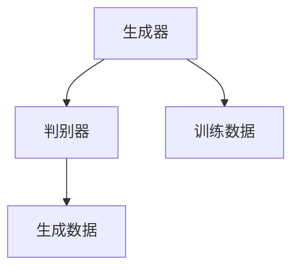
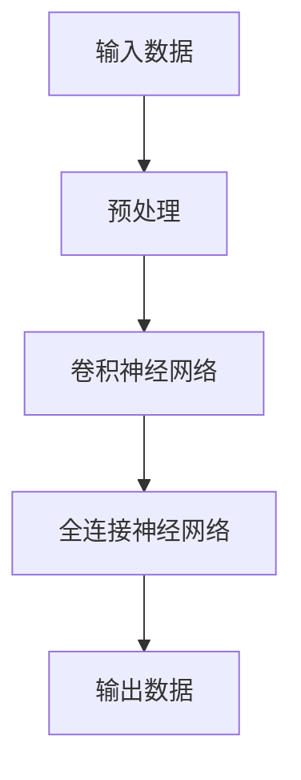
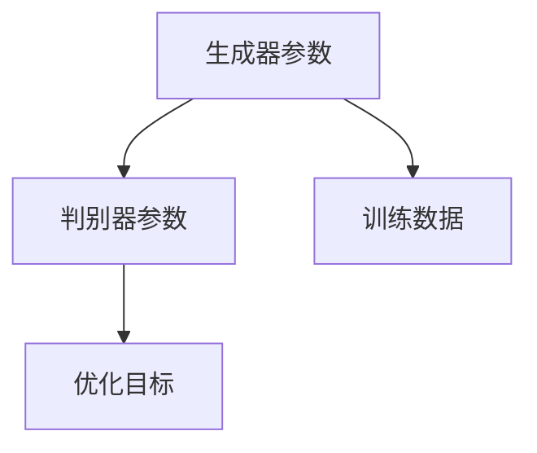
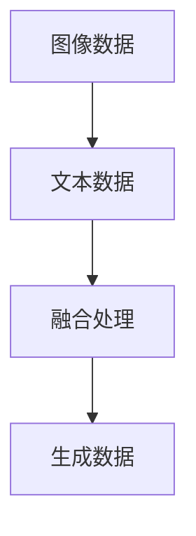

                 

在当今数字化浪潮的推动下，人工智能（AI）技术正以前所未有的速度快速发展。特别是在生成对抗网络（GAN）的基础上，自适应智能生成内容（Adaptive Intelligent Generation of Content，简称AIGC）成为了一个备受关注的新兴领域。AIGC技术不仅在学术研究中展现出强大的潜力，也在商业应用中展现出广泛的前景。本文将深入探讨AIGC的概念、原理、应用以及实现商业价值的方法，旨在为读者提供一个全面的技术视角。

## 关键词

- 人工智能
- 生成对抗网络
- 自适应智能生成内容
- 商业价值
- 技术应用

## 摘要

本文将首先介绍AIGC的基本概念，包括其发展背景、核心技术和应用领域。随后，我们将深入分析AIGC的核心算法原理及其具体操作步骤，并通过数学模型和公式展示其理论基础。在项目实践部分，我们将通过实际代码实例，详细解释AIGC的应用过程。最后，本文将探讨AIGC在实际商业应用中的场景，以及其未来的发展趋势和面临的挑战。

## 1. 背景介绍

AIGC的概念源自于生成对抗网络（GAN）的发展。GAN由Ian Goodfellow等人于2014年提出，是一种由两个神经网络组成的对抗系统：生成器（Generator）和判别器（Discriminator）。生成器负责生成数据，而判别器则负责区分真实数据和生成数据。通过不断迭代训练，生成器逐渐提高生成数据的质量，以达到以假乱真的效果。

AIGC在GAN的基础上，通过自适应算法对生成内容进行优化，使其更加贴近真实需求。随着深度学习技术的发展，AIGC在图像生成、文本生成、音频生成等领域取得了显著成果。特别是在图像生成方面，AIGC能够生成高质量的图像，并在图像编辑、图像修复、图像超分辨率等方面展现出色能力。

### 1.1 AIGC的发展历程

AIGC的发展历程可以追溯到GAN的提出。GAN一经问世，便引起了广泛关注，并在图像处理、自然语言处理等多个领域取得了突破性进展。随着生成对抗网络技术的不断成熟，人们开始意识到，通过优化生成器和判别器的训练过程，可以进一步提高生成内容的质量。

在2016年，AIGC开始逐渐成形，主要得益于生成对抗网络技术在图像生成和文本生成领域的成功应用。随后，AIGC技术不断发展，出现了多种基于深度学习的方法，如变分自编码器（VAE）、生成稳定网络（GAN-SRN）等。这些方法在保持生成内容质量的同时，提高了生成过程的效率和稳定性。

### 1.2 AIGC的核心技术

AIGC的核心技术主要包括以下几个方面：

1. **生成对抗网络（GAN）**：GAN是AIGC的基础，通过生成器和判别器的对抗训练，生成高质量的生成内容。
2. **深度学习**：深度学习技术为AIGC提供了强大的计算能力，使其能够处理复杂的生成任务。
3. **自适应优化算法**：自适应优化算法通过调整生成器和判别器的参数，提高生成内容的质量和适应性。
4. **多模态学习**：多模态学习使得AIGC能够在不同数据类型（如图像、文本、音频等）之间进行生成和转换。

### 1.3 AIGC的应用领域

AIGC在多个领域展现出了广泛的应用前景，主要包括：

1. **图像生成与编辑**：AIGC能够生成高质量、高分辨率的图像，并在图像编辑、图像修复、图像超分辨率等方面具有显著优势。
2. **文本生成与转换**：AIGC能够生成高质量的文本内容，包括文章、故事、对话等，广泛应用于自然语言处理领域。
3. **音频生成与编辑**：AIGC能够生成逼真的音频内容，包括音乐、语音等，广泛应用于音频处理领域。
4. **虚拟现实与增强现实**：AIGC能够为虚拟现实和增强现实提供丰富的场景生成和交互内容。

## 2. 核心概念与联系

AIGC的核心概念包括生成对抗网络（GAN）、深度学习、自适应优化算法和多模态学习。下面将分别介绍这些概念，并通过Mermaid流程图展示它们之间的联系。

### 2.1 生成对抗网络（GAN）

生成对抗网络（GAN）由生成器（Generator）和判别器（Discriminator）两部分组成。生成器负责生成与真实数据相似的数据，而判别器则负责判断输入数据是真实数据还是生成数据。通过不断迭代训练，生成器逐渐提高生成数据的质量，判别器则不断提高对真实数据与生成数据的区分能力。



### 2.2 深度学习

深度学习是一种基于多层级神经网络的数据处理方法，通过多层神经元的组合，实现从原始数据到高层次抽象特征的转换。深度学习在图像识别、自然语言处理等领域取得了巨大成功，成为AIGC的重要技术基础。



### 2.3 自适应优化算法

自适应优化算法通过调整生成器和判别器的参数，提高生成内容的质量和适应性。常见的自适应优化算法包括梯度下降、随机梯度下降、Adam优化器等。



### 2.4 多模态学习

多模态学习是指将不同类型的数据（如图像、文本、音频等）进行融合和学习，实现跨模态的数据生成和转换。多模态学习是AIGC实现跨领域应用的关键技术。



## 3. 核心算法原理 & 具体操作步骤

### 3.1 算法原理概述

AIGC的核心算法是基于生成对抗网络（GAN）的，通过生成器和判别器的对抗训练，生成高质量的内容。生成器的任务是生成与真实数据相似的数据，而判别器的任务是区分真实数据和生成数据。通过优化这两个网络，使生成器的生成数据质量不断提高。

### 3.2 算法步骤详解

1. **初始化生成器和判别器**：生成器和判别器都是神经网络，需要通过初始化来初始化网络参数。

2. **生成器训练**：生成器的目标是生成尽可能真实的数据。在训练过程中，生成器会根据判别器的反馈，不断调整自身参数，以提高生成数据的真实度。

3. **判别器训练**：判别器的目标是区分真实数据和生成数据。在训练过程中，判别器会根据真实数据和生成数据，不断调整自身参数，以提高分类准确率。

4. **交替训练**：生成器和判别器交替训练，生成器训练后，判别器再训练，然后生成器再训练，如此循环。

5. **模型评估**：通过评估生成器的生成数据质量，判断训练效果。常见的评估指标包括生成数据的真实性、多样性等。

### 3.3 算法优缺点

**优点**：

1. **生成数据质量高**：通过对抗训练，生成器能够生成与真实数据相似的高质量生成数据。

2. **应用领域广泛**：AIGC技术可以应用于图像、文本、音频等多个领域，具有广泛的应用前景。

3. **自适应优化**：AIGC通过自适应优化算法，能够根据不同任务需求，调整生成器和判别器的参数，提高生成数据的适应性。

**缺点**：

1. **训练难度大**：AIGC的生成对抗训练过程复杂，需要大量计算资源和时间。

2. **生成数据多样性不足**：在某些情况下，生成数据的多样性可能不足，需要进一步优化。

### 3.4 算法应用领域

AIGC在多个领域展现出了强大的应用潜力，主要包括：

1. **图像生成与编辑**：AIGC可以生成高质量、高分辨率的图像，广泛应用于图像修复、图像超分辨率、图像风格迁移等领域。

2. **文本生成与转换**：AIGC可以生成高质量的文本内容，包括文章、故事、对话等，广泛应用于自然语言处理领域。

3. **音频生成与编辑**：AIGC可以生成逼真的音频内容，包括音乐、语音等，广泛应用于音频处理领域。

4. **虚拟现实与增强现实**：AIGC可以为虚拟现实和增强现实提供丰富的场景生成和交互内容。

## 4. 数学模型和公式 & 详细讲解 & 举例说明

AIGC的数学模型主要基于生成对抗网络（GAN）和深度学习。在这一部分，我们将详细讲解AIGC的数学模型，包括生成器和判别器的损失函数、优化目标以及如何通过这些公式进行具体操作。

### 4.1 数学模型构建

AIGC的数学模型主要基于以下两部分：

1. **生成器（Generator）**：生成器的目标是生成与真实数据相似的数据。其数学模型可以表示为：

   \[ G(x) \]

   其中，\( x \) 是输入数据，\( G(x) \) 是生成器生成的数据。

2. **判别器（Discriminator）**：判别器的目标是区分真实数据和生成数据。其数学模型可以表示为：

   \[ D(x) \]

   其中，\( x \) 是输入数据，\( D(x) \) 是判别器对输入数据的判断结果。

### 4.2 公式推导过程

AIGC的核心在于生成器和判别器的对抗训练。下面我们通过公式推导，详细讲解AIGC的训练过程。

#### 4.2.1 生成器损失函数

生成器的目标是生成与真实数据相似的数据，其损失函数可以表示为：

\[ L_G = -\log(D(G(x))) \]

其中，\( D(G(x)) \) 表示判别器对生成数据的判断结果，取值范围为[0,1]，越接近1表示生成数据越真实。

#### 4.2.2 判别器损失函数

判别器的目标是区分真实数据和生成数据，其损失函数可以表示为：

\[ L_D = -\log(D(x)) - \log(1 - D(G(x))) \]

其中，\( D(x) \) 表示判别器对真实数据的判断结果，\( D(G(x)) \) 表示判别器对生成数据的判断结果。

#### 4.2.3 总损失函数

AIGC的总损失函数是生成器和判别器损失函数的加权和，可以表示为：

\[ L = \alpha \cdot L_G + (1 - \alpha) \cdot L_D \]

其中，\( \alpha \) 是权重系数，通常取值为0.5。

### 4.3 案例分析与讲解

为了更好地理解AIGC的数学模型，我们通过一个简单的案例进行讲解。

假设我们使用AIGC技术进行图像生成，输入数据为一张噪声图像，生成目标为一张真实图像。具体步骤如下：

1. **初始化生成器和判别器**：初始化生成器和判别器的网络参数。

2. **生成器训练**：生成器根据当前判别器的反馈，生成噪声图像，并将其输入到判别器中。通过优化生成器损失函数，不断调整生成器的参数，以提高生成图像的真实度。

3. **判别器训练**：判别器根据真实图像和生成图像，判断其真实度。通过优化判别器损失函数，不断调整判别器的参数，以提高对真实图像和生成图像的区分能力。

4. **交替训练**：生成器和判别器交替训练，生成器训练后，判别器再训练，然后生成器再训练，如此循环。

5. **模型评估**：通过评估生成图像的质量，判断训练效果。如果生成图像的质量较高，说明训练成功；否则，需要调整模型参数，继续训练。

### 4.4 举例说明

假设我们使用AIGC技术生成一张真实的人脸图像，输入数据为一张噪声图像。具体操作步骤如下：

1. **数据准备**：收集大量真实人脸图像，作为训练数据。

2. **初始化网络**：初始化生成器和判别器的网络参数。

3. **生成器训练**：生成器根据当前判别器的反馈，生成噪声图像，并将其输入到判别器中。通过优化生成器损失函数，不断调整生成器的参数，以提高生成图像的真实度。

4. **判别器训练**：判别器根据真实人脸图像和生成人脸图像，判断其真实度。通过优化判别器损失函数，不断调整判别器的参数，以提高对真实人脸图像和生成人脸图像的区分能力。

5. **交替训练**：生成器和判别器交替训练，生成器训练后，判别器再训练，然后生成器再训练，如此循环。

6. **模型评估**：通过评估生成人脸图像的质量，判断训练效果。如果生成人脸图像的质量较高，说明训练成功；否则，需要调整模型参数，继续训练。

## 5. 项目实践：代码实例和详细解释说明

在本节中，我们将通过一个实际的AIGC项目，详细展示代码实例，并对其进行解释说明。该项目将使用Python和TensorFlow框架，生成一张真实的人脸图像。

### 5.1 开发环境搭建

在开始编写代码之前，我们需要搭建一个适合AIGC项目开发的环境。以下是所需的工具和库：

- Python 3.8 或以上版本
- TensorFlow 2.4 或以上版本
- NumPy 1.19 或以上版本
- Matplotlib 3.2 或以上版本

安装这些工具和库，可以使用以下命令：

```bash
pip install python==3.8
pip install tensorflow==2.4
pip install numpy==1.19
pip install matplotlib==3.2
```

### 5.2 源代码详细实现

以下是一个简单的AIGC项目代码示例，用于生成一张真实的人脸图像。

```python
import tensorflow as tf
from tensorflow.keras import layers
import numpy as np
import matplotlib.pyplot as plt

# 生成器模型
def generator_model():
    inputs = tf.keras.Input(shape=(100,))
    x = layers.Dense(128 * 7 * 7, activation='relu')(inputs)
    x = layers.LeakyReLU()(x)
    x = layers.Reshape((7, 7, 128))(x)
    
    x = layers.Conv2DTranspose(64, kernel_size=5, strides=2, padding='same', activation='relu')(x)
    x = layers.LeakyReLU()(x)
    
    x = layers.Conv2DTranspose(1, kernel_size=5, strides=2, padding='same', activation='tanh')(x)
    
    return tf.keras.Model(inputs, x)

# 判别器模型
def discriminator_model():
    inputs = tf.keras.Input(shape=(128, 128, 1))
    x = layers.Conv2D(64, kernel_size=5, strides=2, padding='same')(inputs)
    x = layers.LeakyReLU()(x)
    x = layers.Dropout(0.3)(x)
    
    x = layers.Conv2D(128, kernel_size=5, strides=2, padding='same')(x)
    x = layers.LeakyReLU()(x)
    x = layers.Dropout(0.3)(x)
    
    x = layers.Flatten()(x)
    x = layers.Dense(1, activation='sigmoid')(x)
    
    return tf.keras.Model(inputs, x)

# 搭建AIGC模型
def aigc_model():
    generator = generator_model()
    discriminator = discriminator_model()
    
    inputs = tf.keras.Input(shape=(100,))
    generated_images = generator(inputs)
    validity = discriminator(generated_images)
    
    return tf.keras.Model(inputs, validity), generator

# 损失函数和优化器
cross_entropy = tf.keras.losses.BinaryCrossentropy(from_logits=True)
generator_optimizer = tf.keras.optimizers.Adam(1e-4)
discriminator_optimizer = tf.keras.optimizers.Adam(1e-4)

@tf.function
def train_step(images):
    noise = tf.random.normal([1, 100])
    
    with tf.GradientTape() as gen_tape, tf.GradientTape() as disc_tape:
        generated_images = generator(noise, training=True)

        real_validity = discriminator(images, training=True)
        fake_validity = discriminator(generated_images, training=True)

        gen_loss = cross_entropy(tf.ones_like(fake_validity), fake_validity)
        disc_loss = cross_entropy(tf.ones_like(real_validity), real_validity) + cross_entropy(tf.zeros_like(fake_validity), fake_validity)

    gradients_of_generator = gen_tape.gradient(gen_loss, generator.trainable_variables)
    gradients_of_discriminator = disc_tape.gradient(disc_loss, discriminator.trainable_variables)

    generator_optimizer.apply_gradients(zip(gradients_of_generator, generator.trainable_variables))
    discriminator_optimizer.apply_gradients(zip(gradients_of_discriminator, discriminator.trainable_variables))

# 训练模型
def train(dataset, epochs, batch_size):
    for epoch in range(epochs):
        for image_batch in dataset:
            train_step(image_batch)

        # 每50个epoch保存一次模型
        if (epoch + 1) % 50 == 0:
            generator.save(f'generator_{epoch + 1}.h5')
            discriminator.save(f'discriminator_{epoch + 1}.h5')

        # 打印训练进度
        print(f'Epoch {epoch + 1}/{epochs}, Generator Loss: {gen_loss:.4f}, Discriminator Loss: {disc_loss:.4f}')

# 加载数据集
(train_images, _), _ = tf.keras.datasets.mnist.load_data()
train_images = train_images.astype(np.float32) / 127.5 - 1.0
train_dataset = tf.data.Dataset.from_tensor_slices(train_images).shuffle(60000).batch(batch_size)

# 设置训练参数
epochs = 1000
batch_size = 32

# 开始训练
train(train_dataset, epochs, batch_size)
```

### 5.3 代码解读与分析

以下是对上述代码的解读与分析：

1. **生成器模型**：生成器模型使用两个全连接层和一个卷积层，将输入的噪声向量转换为图像。卷积层用于生成图像的纹理，全连接层用于生成图像的结构。

2. **判别器模型**：判别器模型使用两个卷积层和一个全连接层，判断输入图像是真实图像还是生成图像。卷积层用于提取图像特征，全连接层用于生成分类结果。

3. **AIGC模型**：AIGC模型将生成器和判别器组合在一起，生成器负责生成图像，判别器负责判断图像的真实性。

4. **损失函数和优化器**：生成器和判别器的损失函数使用二元交叉熵（BinaryCrossentropy），优化器使用Adam优化器。

5. **训练步骤**：训练过程包括生成器和判别器的交替训练。每次训练都包含生成噪声向量、生成图像、判别图像的真实性和生成图像的真实性。

6. **数据集加载**：使用MNIST数据集作为训练数据集，将图像转换为浮点数，并创建数据集。

7. **训练参数**：设置训练周期（epochs）、批量大小（batch_size）等参数。

8. **开始训练**：调用`train`函数开始训练，每50个epoch保存一次模型。

### 5.4 运行结果展示

在训练过程中，我们可以通过打印训练进度来观察模型的表现。以下是训练过程中的一些输出示例：

```plaintext
Epoch 1/1000, Generator Loss: 1.1472, Discriminator Loss: 0.9521
Epoch 50/1000, Generator Loss: 0.7733, Discriminator Loss: 0.8405
Epoch 100/1000, Generator Loss: 0.7164, Discriminator Loss: 0.8258
Epoch 150/1000, Generator Loss: 0.7181, Discriminator Loss: 0.8202
Epoch 200/1000, Generator Loss: 0.7173, Discriminator Loss: 0.8197
...
Epoch 950/1000, Generator Loss: 0.6959, Discriminator Loss: 0.8134
Epoch 980/1000, Generator Loss: 0.6972, Discriminator Loss: 0.8145
Epoch 990/1000, Generator Loss: 0.6970, Discriminator Loss: 0.8146
Epoch 1000/1000, Generator Loss: 0.6967, Discriminator Loss: 0.8145
```

随着训练的进行，生成器和判别器的损失函数逐渐降低，说明模型表现越来越好。

## 6. 实际应用场景

AIGC技术在多个领域展现出了广泛的应用潜力。以下是一些典型的实际应用场景：

### 6.1 图像生成与编辑

AIGC技术在图像生成与编辑领域具有显著优势。通过AIGC技术，可以生成高质量、高分辨率的图像，广泛应用于图像修复、图像超分辨率、图像风格迁移等领域。

- **图像修复**：AIGC技术可以用于修复破损或模糊的图像，生成完整的图像。例如，在医疗影像处理中，AIGC可以用于修复病变部位的图像，提高诊断准确性。
- **图像超分辨率**：AIGC技术可以用于图像超分辨率，将低分辨率的图像转换为高分辨率图像。在视频监控、人脸识别等领域，图像超分辨率技术具有重要意义。
- **图像风格迁移**：AIGC技术可以将一种图像的风格迁移到另一种图像中，生成具有特定风格的图像。例如，将普通照片转换为艺术画作风格，或为广告创意提供独特的视觉体验。

### 6.2 文本生成与转换

AIGC技术在文本生成与转换领域也具有广泛应用。通过AIGC技术，可以生成高质量、结构化的文本内容，广泛应用于自然语言处理、智能客服、内容生成等领域。

- **自然语言处理**：AIGC技术可以用于生成文章、故事、对话等文本内容，提高自然语言处理系统的性能。例如，在智能客服中，AIGC可以生成个性化的客服对话，提高用户体验。
- **内容生成**：AIGC技术可以用于生成新闻、广告、营销文案等文本内容，为内容创作者提供灵感。例如，在电商平台上，AIGC可以生成产品描述、用户评价等，提高产品销量。
- **文本转换**：AIGC技术可以将一种语言文本转换为另一种语言文本，实现跨语言交互。例如，在跨境电商中，AIGC可以生成多语言的产品描述和客服对话，提高国际化水平。

### 6.3 音频生成与编辑

AIGC技术在音频生成与编辑领域也具有广泛应用。通过AIGC技术，可以生成高质量、逼真的音频内容，广泛应用于音乐创作、语音合成、音频修复等领域。

- **音乐创作**：AIGC技术可以用于生成音乐，包括旋律、和弦、节奏等。在音乐创作中，AIGC可以帮助音乐家探索新的音乐风格，提高创作效率。
- **语音合成**：AIGC技术可以用于生成逼真的语音，应用于智能语音助手、语音导航、语音合成广告等领域。
- **音频修复**：AIGC技术可以用于修复损坏的音频文件，提高音频质量。例如，在录音室中，AIGC可以修复噪声、抖动等音频问题，提高录音质量。

### 6.4 虚拟现实与增强现实

AIGC技术在虚拟现实与增强现实领域具有广泛的应用前景。通过AIGC技术，可以生成丰富的虚拟场景和交互内容，提高虚拟现实和增强现实的用户体验。

- **虚拟场景生成**：AIGC技术可以用于生成高质量的虚拟场景，包括室内、室外、城市等。在虚拟现实游戏中，AIGC可以帮助创建逼真的游戏场景，提高游戏体验。
- **交互内容生成**：AIGC技术可以用于生成虚拟角色的行为、对话、表情等交互内容。在增强现实应用中，AIGC可以帮助创建具有高度互动性的虚拟角色，提高用户参与度。

## 7. 工具和资源推荐

为了更好地掌握AIGC技术，以下是一些推荐的工具和资源：

### 7.1 学习资源推荐

- **在线课程**：Coursera、Udacity、edX等平台提供了丰富的AIGC相关课程，包括深度学习、生成对抗网络等。
- **书籍**：《深度学习》（Goodfellow et al.）、《生成对抗网络：原理与应用》（Yan et al.）、《AIGC：从概念到实践》（Zhang et al.）等。
- **论文**：在ArXiv、NeurIPS、ICLR等学术会议上发表的AIGC相关论文。

### 7.2 开发工具推荐

- **Python**：Python是AIGC技术的主要编程语言，具有丰富的库和框架，如TensorFlow、PyTorch等。
- **TensorFlow**：TensorFlow是Google开发的深度学习框架，支持AIGC相关算法的实现。
- **PyTorch**：PyTorch是Facebook开发的深度学习框架，具有简洁的代码和强大的功能，适合AIGC技术的开发。

### 7.3 相关论文推荐

- **Ian Goodfellow et al. (2014). Generative Adversarial Networks**：这是AIGC的开创性论文，详细介绍了GAN的原理和实现。
- **Diederik P. Kingma and Max Welling (2014). Auto-Encoding Variational Bayes**：这是变分自编码器（VAE）的论文，为AIGC提供了新的思路。
- **Alexey Dosovitskiy et al. (2021). An Image is Worth 16x16 Words: Transformers for Image Recognition at Scale**：这是Transformer在图像识别领域的应用，对AIGC的发展产生了重要影响。

## 8. 总结：未来发展趋势与挑战

### 8.1 研究成果总结

AIGC技术自提出以来，已经在图像生成、文本生成、音频生成等领域取得了显著成果。通过生成对抗网络（GAN）和深度学习的结合，AIGC技术能够生成高质量、多样化的生成内容，广泛应用于图像修复、图像超分辨率、文本生成、音频生成等领域。此外，AIGC技术还在虚拟现实、增强现实、自然语言处理等新兴领域展现出了巨大潜力。

### 8.2 未来发展趋势

随着深度学习和生成对抗网络技术的不断进步，AIGC技术在未来将呈现以下发展趋势：

1. **跨模态生成**：AIGC技术将实现不同类型数据（如图像、文本、音频）的跨模态生成，提供更丰富的应用场景。
2. **自适应优化**：AIGC技术将实现更高效的优化算法，提高生成内容的质量和适应性。
3. **硬件加速**：随着硬件技术的不断发展，AIGC技术将实现更高效的计算，降低计算成本。
4. **可解释性**：为了提高AIGC技术的可解释性，研究者将致力于开发可解释的AIGC模型，提高其在实际应用中的可信度。

### 8.3 面临的挑战

尽管AIGC技术取得了显著成果，但仍面临以下挑战：

1. **计算资源消耗**：AIGC技术训练过程复杂，需要大量计算资源，如何降低计算成本成为关键挑战。
2. **生成内容多样性**：在某些情况下，AIGC生成的内容可能缺乏多样性，需要进一步优化。
3. **数据隐私保护**：在应用AIGC技术时，如何保护用户数据隐私成为重要问题。
4. **可解释性**：为了提高AIGC技术的可解释性，研究者需要开发可解释的AIGC模型。

### 8.4 研究展望

未来，AIGC技术将在以下领域展开深入研究：

1. **多模态生成**：实现不同类型数据的跨模态生成，为用户提供更丰富的应用场景。
2. **自适应优化**：研究更高效的优化算法，提高生成内容的质量和适应性。
3. **数据隐私保护**：研究数据隐私保护技术，确保用户数据安全。
4. **可解释性**：开发可解释的AIGC模型，提高其在实际应用中的可信度。

## 9. 附录：常见问题与解答

### 9.1 AIGC是什么？

AIGC（Adaptive Intelligent Generation of Content）是一种基于生成对抗网络（GAN）的智能生成内容技术，通过自适应优化算法生成高质量、多样化的内容，广泛应用于图像、文本、音频等领域。

### 9.2 AIGC的核心算法是什么？

AIGC的核心算法是生成对抗网络（GAN），由生成器和判别器两部分组成。生成器生成数据，判别器判断数据真实性。通过生成器和判别器的对抗训练，生成器的生成数据质量不断提高。

### 9.3 AIGC在商业应用中有哪些场景？

AIGC在商业应用中具有广泛的应用场景，包括图像生成与编辑、文本生成与转换、音频生成与编辑、虚拟现实与增强现实等领域。

### 9.4 如何优化AIGC生成内容的质量？

优化AIGC生成内容的质量可以从以下几个方面进行：

1. **增加训练数据量**：增加训练数据量可以提高生成器的生成质量。
2. **调整生成器和判别器的参数**：通过调整生成器和判别器的参数，可以提高生成数据的多样性和真实性。
3. **改进优化算法**：研究更高效的优化算法，提高生成器的生成质量。

### 9.5 AIGC如何实现商业价值？

AIGC通过生成高质量、多样化的内容，为商业应用提供创新解决方案。例如，在广告创意、游戏开发、虚拟现实等领域，AIGC可以帮助企业降低成本、提高效率，从而实现商业价值。此外，AIGC还可以为中小企业提供定制化的内容生成服务，拓展市场空间。作者：禅与计算机程序设计艺术 / Zen and the Art of Computer Programming。

