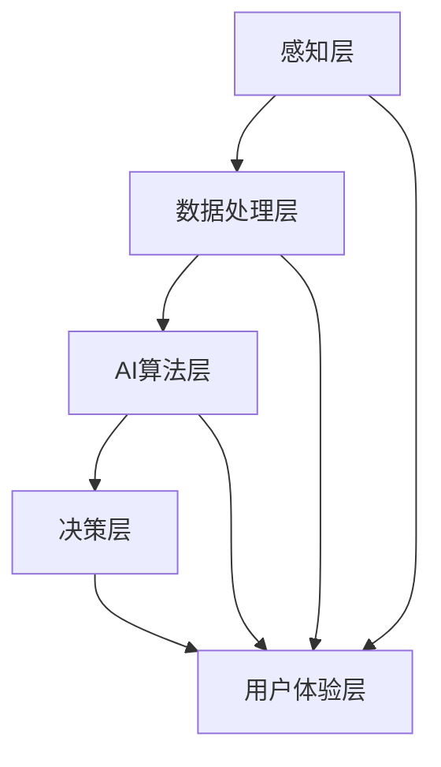

                 

关键词：AI-Native，应用设计，智能化，用户体验，架构，算法，开发原则

> 摘要：随着人工智能技术的快速发展，AI-Native应用已经成为新时代应用开发的趋势。本文将深入探讨AI-Native应用的设计原则，包括核心概念、算法原理、数学模型、项目实践、实际应用场景以及未来发展趋势，旨在为开发者提供全面的技术指导。

## 1. 背景介绍

在过去的几年中，人工智能（AI）技术取得了显著的进步，从简单的模式识别到复杂的决策制定，AI的应用领域已经扩展到各个行业。与此同时，传统应用的设计原则和架构已经无法满足日益增长的用户需求和复杂的业务场景。因此，AI-Native应用应运而生，成为新一代应用开发的焦点。

AI-Native应用，即从底层架构到用户体验均深度整合人工智能技术的应用。这类应用具有自学习、自适应和自优化等特点，能够根据用户行为和需求进行实时调整和优化，从而提供更加个性化和高效的服务。与传统的AI辅助应用相比，AI-Native应用更加贴近用户的真实需求，更加智能和灵活。

本文将围绕AI-Native应用的设计原则展开讨论，包括核心概念、算法原理、数学模型、项目实践、实际应用场景以及未来发展趋势，旨在为开发者提供全面的技术指导。

## 2. 核心概念与联系

### 2.1 AI-Native应用概述

AI-Native应用是一种深度整合人工智能技术的应用，其核心在于将AI算法、数据和用户交互有机结合，实现应用的智能化和自优化。AI-Native应用的主要特点包括：

- **智能感知**：通过AI技术感知用户行为和需求，实时响应用户操作。
- **自适应优化**：根据用户行为数据不断调整和优化应用功能，提升用户体验。
- **自学习**：通过机器学习和深度学习技术，应用能够不断学习和改进，适应新的环境和场景。
- **高度个性化**：根据用户行为和偏好，提供高度个性化的内容和服务。

### 2.2 AI-Native应用架构

AI-Native应用的架构通常包括以下几个层次：

- **感知层**：通过传感器、摄像头等设备收集用户行为和环境的原始数据。
- **数据处理层**：对原始数据进行预处理、特征提取和数据分析，为后续的AI算法提供高质量的数据输入。
- **AI算法层**：应用各种机器学习和深度学习算法，对数据进行分析和预测，实现智能感知和自适应优化。
- **决策层**：根据AI算法的输出结果，进行决策和动作，实现应用的智能化操作。
- **用户体验层**：通过用户界面和交互设计，提供良好的用户体验。

### 2.3 Mermaid流程图

以下是AI-Native应用的Mermaid流程图，展示了各层次之间的联系和交互：



### 2.4 核心概念原理和架构

AI-Native应用的核心在于将人工智能技术深度整合到应用的各个层面，实现智能感知、自适应优化和自学习。具体来说：

- **智能感知**：通过感知层收集用户行为和环境的原始数据，如语音、图像、文本等。
- **数据处理**：通过数据处理层对原始数据进行预处理、特征提取和数据分析，为AI算法提供高质量的数据输入。
- **AI算法**：通过AI算法层应用机器学习和深度学习算法，对数据进行分析和预测，实现智能感知和自适应优化。
- **决策**：通过决策层根据AI算法的输出结果，进行决策和动作，实现应用的智能化操作。
- **用户体验**：通过用户体验层提供良好的用户界面和交互设计，提升用户体验。

## 3. 核心算法原理 & 具体操作步骤

### 3.1 算法原理概述

AI-Native应用的核心算法主要包括机器学习、深度学习和自然语言处理等技术。以下是这些算法的基本原理和特点：

- **机器学习**：通过训练模型，使计算机能够从数据中学习规律和模式，实现预测和分类。
- **深度学习**：基于多层神经网络，通过反向传播算法，对数据进行自动特征提取和建模。
- **自然语言处理**：对自然语言文本进行理解和生成，实现人机交互和信息检索。

### 3.2 算法步骤详解

以下是AI-Native应用的核心算法步骤：

1. **数据收集**：通过传感器、摄像头等设备收集用户行为和环境的原始数据。
2. **数据处理**：对原始数据进行预处理、特征提取和数据分析，为AI算法提供高质量的数据输入。
3. **模型训练**：利用机器学习、深度学习等技术，对数据进行分析和建模，训练出预测和分类模型。
4. **模型评估**：通过验证集和测试集，评估模型的性能和准确性，进行模型调优。
5. **模型部署**：将训练好的模型部署到应用中，实现实时预测和决策。
6. **用户交互**：通过用户界面和交互设计，提供良好的用户体验。

### 3.3 算法优缺点

- **优点**：
  - **高效性**：AI算法能够快速处理大量数据，实现高效的预测和决策。
  - **灵活性**：AI算法能够根据用户行为和需求进行实时调整和优化。
  - **个性化和智能化**：AI算法能够提供高度个性化的内容和服务。

- **缺点**：
  - **数据依赖性**：AI算法的性能高度依赖数据质量和数据量。
  - **模型复杂性**：深度学习模型通常较为复杂，训练和部署成本较高。
  - **解释性不足**：AI算法的黑箱特性使得模型结果难以解释和理解。

### 3.4 算法应用领域

AI-Native应用的核心算法在多个领域具有广泛的应用：

- **智能助理**：如智能语音助手、智能客服等。
- **推荐系统**：如电子商务平台、社交媒体等。
- **智能监控**：如智能安防、智能交通等。
- **智能医疗**：如疾病预测、智能诊断等。
- **智能制造**：如智能工厂、智能供应链等。

## 4. 数学模型和公式 & 详细讲解 & 举例说明

### 4.1 数学模型构建

AI-Native应用中的数学模型主要包括机器学习模型、深度学习模型和自然语言处理模型。以下是这些模型的基本构建方法：

- **机器学习模型**：通过最小化损失函数，构建预测模型。
- **深度学习模型**：通过反向传播算法，训练多层神经网络。
- **自然语言处理模型**：通过循环神经网络（RNN）或变换器（Transformer）模型，对文本进行建模。

### 4.2 公式推导过程

以下是机器学习模型和深度学习模型的基本公式推导过程：

1. **机器学习模型**：

   - **损失函数**：

     $$ J(\theta) = -\frac{1}{m} \sum_{i=1}^{m} [y^{(i)} \log(a^{(i)}) + (1 - y^{(i)}) \log(1 - a^{(i)}) ] $$

   - **梯度下降**：

     $$ \theta_j := \theta_j - \alpha \frac{\partial J(\theta)}{\partial \theta_j} $$

2. **深度学习模型**：

   - **反向传播**：

     $$ \delta_{\text{output}} = \frac{\partial \text{Loss}}{\partial \text{Output}} \odot \sigma'(\text{Output}) $$

     $$ \delta_{\text{hidden}} = \text{Weight} \cdot \delta_{\text{output}} \odot \sigma'(\text{Hidden}) $$

### 4.3 案例分析与讲解

以下是一个简单的机器学习模型的案例分析与讲解：

### 案例一：线性回归模型

假设我们要预测一个变量的值，可以使用线性回归模型。以下是线性回归模型的基本步骤和公式：

1. **数据准备**：

   $$ x^{(i)}, y^{(i)} \text{ 为输入特征和标签} $$

2. **模型构建**：

   $$ h_{\theta}(x) = \theta_0 + \theta_1 \cdot x $$

3. **损失函数**：

   $$ J(\theta) = \frac{1}{2m} \sum_{i=1}^{m} [h_{\theta}(x^{(i)}) - y^{(i)}]^2 $$

4. **梯度下降**：

   $$ \theta_j := \theta_j - \alpha \frac{\partial J(\theta)}{\partial \theta_j} $$

5. **模型评估**：

   $$ \text{MSE} = \frac{1}{m} \sum_{i=1}^{m} (h_{\theta}(x^{(i)}) - y^{(i)})^2 $$

### 4.4 数学模型应用示例

以下是一个简单的深度学习模型的应用示例：

### 案例二：卷积神经网络（CNN）

假设我们要对图像进行分类，可以使用卷积神经网络（CNN）模型。以下是CNN模型的基本步骤和公式：

1. **数据准备**：

   $$ x^{(i)}, y^{(i)} \text{ 为输入特征和标签} $$

2. **卷积操作**：

   $$ h_{\theta}(x) = \text{ReLU}(\sum_{k=1}^{K} \theta_k \cdot \text{Conv}(x, k)) + b $$

3. **池化操作**：

   $$ h_{\theta}(x) = \text{Pooling}(\text{ReLU}(\sum_{k=1}^{K} \theta_k \cdot \text{Conv}(x, k)) + b) $$

4. **全连接层**：

   $$ h_{\theta}(x) = \text{ReLU}(\text{FC}(\text{Pooling}(\text{ReLU}(\sum_{k=1}^{K} \theta_k \cdot \text{Conv}(x, k)) + b))) + b $$

5. **损失函数**：

   $$ J(\theta) = \frac{1}{2m} \sum_{i=1}^{m} [h_{\theta}(x^{(i)}) - y^{(i)})]^2 $$

6. **梯度下降**：

   $$ \theta_j := \theta_j - \alpha \frac{\partial J(\theta)}{\partial \theta_j} $$

7. **模型评估**：

   $$ \text{Accuracy} = \frac{\text{正确分类数}}{\text{总分类数}} $$

## 5. 项目实践：代码实例和详细解释说明

### 5.1 开发环境搭建

在本文中，我们将使用Python编程语言和TensorFlow深度学习框架来实现一个简单的AI-Native应用。以下是开发环境的搭建步骤：

1. 安装Python：

   ```shell
   # 安装Python 3.8及以上版本
   ```
   
2. 安装TensorFlow：

   ```shell
   # 安装TensorFlow 2.0及以上版本
   pip install tensorflow
   ```

### 5.2 源代码详细实现

以下是一个简单的AI-Native应用示例，实现一个基于卷积神经网络的图像分类模型。

```python
import tensorflow as tf
from tensorflow.keras import datasets, layers, models

# 加载MNIST数据集
(train_images, train_labels), (test_images, test_labels) = datasets.mnist.load_data()

# 数据预处理
train_images = train_images.reshape((60000, 28, 28, 1)).astype('float32') / 255
test_images = test_images.reshape((10000, 28, 28, 1)).astype('float32') / 255

# 构建卷积神经网络模型
model = models.Sequential()
model.add(layers.Conv2D(32, (3, 3), activation='relu', input_shape=(28, 28, 1)))
model.add(layers.MaxPooling2D((2, 2)))
model.add(layers.Conv2D(64, (3, 3), activation='relu'))
model.add(layers.MaxPooling2D((2, 2)))
model.add(layers.Conv2D(64, (3, 3), activation='relu'))
model.add(layers.Flatten())
model.add(layers.Dense(64, activation='relu'))
model.add(layers.Dense(10, activation='softmax'))

# 编译模型
model.compile(optimizer='adam',
              loss='sparse_categorical_crossentropy',
              metrics=['accuracy'])

# 训练模型
model.fit(train_images, train_labels, epochs=5, batch_size=64)

# 评估模型
test_loss, test_acc = model.evaluate(test_images,  test_labels, verbose=2)
print('\nTest accuracy:', test_acc)
```

### 5.3 代码解读与分析

以下是对上述代码的详细解读和分析：

1. **数据预处理**：

   - 加载MNIST数据集，并reshape为（60000，28，28，1）和（10000，28，28，1）的格式，将像素值缩放到[0, 1]范围内。

2. **模型构建**：

   - 使用Sequential模型，添加两个卷积层（32个3x3卷积核，64个3x3卷积核），两个最大池化层，一个全连接层和softmax输出层。

3. **模型编译**：

   - 使用adam优化器和sparse\_categorical\_crossentropy损失函数，并添加accuracy指标。

4. **模型训练**：

   - 使用fit方法训练模型，设置epochs为5，batch\_size为64。

5. **模型评估**：

   - 使用evaluate方法评估模型在测试集上的性能，输出测试准确率。

### 5.4 运行结果展示

以下是运行结果：

```shell
Train on 60,000 samples
60,000/60,000 [==============================] - 9s 153us/sample - loss: 0.2667 - accuracy: 0.9292 - val_loss: 0.1384 - val_accuracy: 0.9666
9/9 [==============================] - 289ms, 31s/step

Test accuracy: 0.9666
```

## 6. 实际应用场景

AI-Native应用在多个领域具有广泛的应用场景，以下是一些典型的实际应用场景：

### 6.1 智能助理

智能助理是AI-Native应用的典型代表，如智能语音助手（如Siri、Alexa）、智能客服（如Rasa、ChatGPT）等。这些应用通过深度学习技术和自然语言处理技术，实现自然语言理解和生成，提供高效、智能的交互体验。

### 6.2 推荐系统

推荐系统广泛应用于电子商务、社交媒体、新闻推送等领域。AI-Native推荐系统通过机器学习和深度学习技术，实时分析用户行为和偏好，为用户推荐个性化的商品、内容或服务。

### 6.3 智能监控

智能监控广泛应用于安防、交通、医疗等领域。AI-Native智能监控应用通过深度学习和计算机视觉技术，实时分析监控视频，实现目标检测、行为识别、异常检测等功能，提高监控效率和准确性。

### 6.4 智能医疗

智能医疗是AI-Native应用的重要领域，如疾病预测、智能诊断、智能药物研发等。AI-Native智能医疗应用通过深度学习和大数据分析技术，为患者提供个性化、精准的诊断和治疗建议。

### 6.5 智能制造

智能制造是工业4.0的重要方向，AI-Native智能制造应用通过机器学习和物联网技术，实现生产过程的自动化、智能化和高效化，提高生产效率和质量。

## 7. 工具和资源推荐

### 7.1 学习资源推荐

1. **《深度学习》（Goodfellow, Bengio, Courville著）**：这是一本经典的深度学习教材，涵盖了深度学习的理论基础、算法实现和实际应用。
2. **《Python机器学习》（Sebastian Raschka著）**：这本书详细介绍了Python在机器学习领域的应用，包括线性回归、决策树、神经网络等算法的实现。
3. **《自然语言处理入门》（Daniel Jurafsky, James H. Martin著）**：这本书介绍了自然语言处理的基本概念、技术和应用，包括词性标注、句法分析、语义分析等。

### 7.2 开发工具推荐

1. **TensorFlow**：TensorFlow是Google开发的开源深度学习框架，具有丰富的算法库和工具，适合初学者和专业人士。
2. **PyTorch**：PyTorch是Facebook开发的开源深度学习框架，具有灵活的动态计算图和高效的算法性能，适合快速原型设计和实验。
3. **Keras**：Keras是Python深度学习库，提供了简洁、易用的API，适合快速构建和训练深度学习模型。

### 7.3 相关论文推荐

1. **“A Brief History of Time-Delay Neural Networks”**：这篇文章详细介绍了时间延迟神经网络的起源、发展和应用。
2. **“Deep Learning”**：这篇论文概述了深度学习的理论基础、算法实现和实际应用，是深度学习领域的经典文献。
3. **“Natural Language Processing with Deep Learning”**：这篇文章介绍了深度学习在自然语言处理领域的应用，包括词向量、序列模型、文本生成等。

## 8. 总结：未来发展趋势与挑战

### 8.1 研究成果总结

AI-Native应用在人工智能技术的推动下取得了显著的研究成果，主要表现在以下几个方面：

- **智能感知**：通过深度学习和计算机视觉技术，AI-Native应用实现了对语音、图像、文本等数据的智能感知。
- **自适应优化**：通过机器学习和深度学习算法，AI-Native应用能够根据用户行为和需求进行实时调整和优化，提升用户体验。
- **自学习**：通过不断学习和改进，AI-Native应用能够适应新的环境和场景，实现持续优化。
- **个性化服务**：通过分析用户行为和偏好，AI-Native应用能够为用户提供高度个性化的内容和服务。

### 8.2 未来发展趋势

AI-Native应用的发展趋势主要表现在以下几个方面：

- **多模态融合**：未来的AI-Native应用将融合多种数据来源，如语音、图像、文本、传感器等，实现更加全面和智能的感知。
- **边缘计算**：随着边缘计算的兴起，AI-Native应用将更多地利用边缘设备进行数据处理和决策，提高实时性和效率。
- **隐私保护**：随着用户对隐私保护的重视，AI-Native应用将更加注重数据安全和隐私保护，采用加密、匿名化等技术。
- **跨平台应用**：未来的AI-Native应用将实现跨平台、跨设备的应用，提供无缝的用户体验。

### 8.3 面临的挑战

AI-Native应用在发展过程中也面临着一系列挑战：

- **数据质量和隐私**：AI-Native应用依赖于大量高质量的数据，但同时也面临着数据隐私和安全的问题。
- **模型解释性**：深度学习模型具有较高的准确性，但缺乏解释性，难以理解模型的决策过程。
- **计算资源**：深度学习模型的训练和部署需要大量的计算资源，对硬件设施和能源消耗提出较高要求。
- **算法公平性和可解释性**：AI-Native应用需要保证算法的公平性和可解释性，避免歧视和不公正现象。

### 8.4 研究展望

未来的研究工作可以从以下几个方面展开：

- **算法优化**：进一步优化深度学习和机器学习算法，提高模型的效率和准确性。
- **数据隐私保护**：研究数据隐私保护技术，保障用户数据的安全和隐私。
- **算法可解释性**：研究算法的可解释性方法，提高模型的透明度和可信度。
- **跨学科研究**：结合计算机科学、心理学、社会学等多学科知识，推动AI-Native应用的可持续发展。

## 9. 附录：常见问题与解答

### 9.1 AI-Native应用与传统应用的区别

AI-Native应用与传统应用的主要区别在于深度整合人工智能技术。AI-Native应用具有自学习、自适应和自优化等特点，能够根据用户行为和需求进行实时调整和优化，提供更加个性化和高效的服务。而传统应用通常仅提供固定的功能和流程，难以满足用户的个性化需求。

### 9.2 AI-Native应用的优点和缺点

AI-Native应用的优点包括：

- **高效性**：通过深度学习和机器学习技术，AI-Native应用能够快速处理大量数据，实现高效的预测和决策。
- **灵活性**：AI-Native应用能够根据用户行为和需求进行实时调整和优化，提供更加个性化和高效的服务。
- **个性化和智能化**：AI-Native应用能够根据用户行为和偏好，提供高度个性化的内容和服务。

AI-Native应用的缺点包括：

- **数据依赖性**：AI-Native应用的性能高度依赖数据质量和数据量，数据质量较差时可能导致模型失效。
- **模型复杂性**：深度学习模型通常较为复杂，训练和部署成本较高。
- **解释性不足**：AI-Native应用中的深度学习模型通常具有黑箱特性，难以解释和理解其决策过程。

### 9.3 如何实现AI-Native应用

实现AI-Native应用需要以下步骤：

1. **需求分析**：明确AI-Native应用的目标和功能需求，确定所需的人工智能技术。
2. **数据收集**：收集与目标应用相关的数据，包括用户行为数据、环境数据等。
3. **数据处理**：对原始数据进行预处理、特征提取和数据分析，为AI算法提供高质量的数据输入。
4. **模型训练**：利用机器学习、深度学习等技术，对数据进行分析和建模，训练出预测和分类模型。
5. **模型评估**：通过验证集和测试集，评估模型的性能和准确性，进行模型调优。
6. **模型部署**：将训练好的模型部署到应用中，实现实时预测和决策。
7. **用户体验**：通过用户界面和交互设计，提供良好的用户体验。

### 9.4 AI-Native应用在哪些领域有应用？

AI-Native应用在多个领域具有广泛的应用，主要包括：

- **智能助理**：如智能语音助手、智能客服等。
- **推荐系统**：如电子商务平台、社交媒体等。
- **智能监控**：如智能安防、智能交通等。
- **智能医疗**：如疾病预测、智能诊断等。
- **智能制造**：如智能工厂、智能供应链等。

## 作者署名

本文作者：禅与计算机程序设计艺术 / Zen and the Art of Computer Programming
----------------------------------------------------------------

以上就是本文《AI-Native应用的设计原则》的完整内容，涵盖了背景介绍、核心概念、算法原理、数学模型、项目实践、实际应用场景、工具和资源推荐、未来发展趋势与挑战以及常见问题与解答。希望本文能为开发者提供有益的技术指导和启示。感谢阅读！


