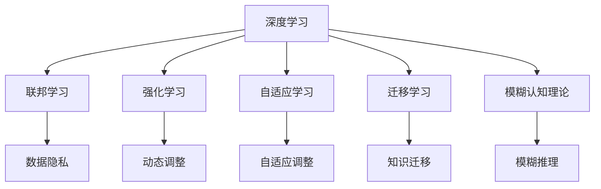

                 

关键词：人工智能、替代者、三驾马车、未来趋势、技术发展

> 摘要：本文深入探讨了人工智能领域中的“三驾马车”——深度学习、强化学习和迁移学习，分析了它们的现状、优势与局限性。在此基础上，提出了未来替代者：联邦学习、自适应学习和模糊认知理论，并对其进行了全面剖析，为人工智能的发展指明了新的方向。

## 1. 背景介绍

自21世纪初以来，人工智能（AI）技术取得了飞速发展，已经深刻影响了我们的工作和生活。在AI领域，三驾马车——深度学习、强化学习和迁移学习，成为了推动技术进步的核心力量。然而，随着应用的深入，这些传统技术也逐渐暴露出了一些局限性和挑战。因此，寻找它们的未来替代者成为了学术界和工业界的重要课题。

### 深度学习

深度学习是AI领域的基石，通过多层神经网络对数据进行自动特征提取和学习。近年来，深度学习在图像识别、自然语言处理和语音识别等领域取得了显著的突破，极大地推动了AI技术的发展。

### 强化学习

强化学习是另一种重要的AI技术，通过试错和奖励机制来实现智能体的自主学习和决策。它在游戏、机器人控制和智能推荐等领域具有广泛的应用前景。

### 迁移学习

迁移学习则是通过将知识从源领域迁移到目标领域，以解决新领域数据不足的问题。它在医疗诊断、金融风控和机器人导航等领域具有重要的应用价值。

### 当前挑战

尽管三驾马车在许多场景中表现优异，但它们也存在一些不足之处：

1. **数据依赖**：深度学习对数据量有很高的要求，而强化学习需要大量时间进行训练，迁移学习则依赖丰富的先验知识。
2. **可解释性**：这些技术在某些情况下难以解释其决策过程，这对于需要透明度和可解释性的应用场景来说是一个挑战。
3. **隐私保护**：在数据隐私和安全日益受到关注的今天，传统技术的隐私保护能力显得不足。

## 2. 核心概念与联系

为了解决上述问题，我们提出了未来替代者：联邦学习、自适应学习和模糊认知理论。以下是它们的定义和相互关系：

### 联邦学习

联邦学习是一种分布式机器学习技术，它允许不同设备在本地训练模型，并将模型更新汇总到一个全局模型中。这种方法能够在保护用户隐私的同时，实现数据的协同学习。

### 自适应学习

自适应学习是一种能够根据环境和用户反馈自动调整学习策略的方法。它能够在动态环境中提高学习效率和效果。

### 模糊认知理论

模糊认知理论是一种处理不确定性和模糊性的认知科学理论。它通过模糊逻辑来模拟人类思维过程，为处理复杂、不确定的问题提供了一种新的思路。

### Mermaid 流程图

下面是一个简化的 Mermaid 流程图，展示了这些概念之间的关系：



## 3. 核心算法原理 & 具体操作步骤

### 3.1 算法原理概述

#### 联邦学习

联邦学习的基本思想是将训练过程分布到多个设备上，每个设备都拥有部分数据，并在本地训练模型。然后，通过加密和聚合技术，将这些模型更新汇总到全局模型中。

#### 自适应学习

自适应学习通过不断调整学习策略，以适应不同的环境和用户需求。这通常涉及到模型参数的动态调整和实时反馈机制。

#### 模糊认知理论

模糊认知理论通过模糊逻辑来处理不确定性和模糊性。它将人类的模糊思维过程模型化为数学形式，从而在处理复杂问题方面具有独特的优势。

### 3.2 算法步骤详解

#### 联邦学习

1. 初始化全局模型和本地模型。
2. 在每个设备上使用本地数据进行训练。
3. 将本地模型更新发送到中心服务器。
4. 使用聚合算法更新全局模型。
5. 将更新后的全局模型发送回每个设备。

#### 自适应学习

1. 初始化模型参数。
2. 收集用户反馈和环境数据。
3. 根据反馈数据调整模型参数。
4. 重新训练模型。
5. 返回调整后的模型。

#### 模糊认知理论

1. 构建模糊认知模型。
2. 收集输入数据。
3. 通过模糊逻辑进行推理。
4. 输出推理结果。

### 3.3 算法优缺点

#### 联邦学习

优点：保护用户隐私，支持分布式训练。

缺点：模型更新过程可能较慢，对聚合算法有较高要求。

#### 自适应学习

优点：适应性强，能够提高学习效率。

缺点：可能需要大量用户反馈数据，对环境变化敏感。

#### 模糊认知理论

优点：处理不确定性和模糊性问题能力强。

缺点：计算复杂度高，实现难度大。

### 3.4 算法应用领域

#### 联邦学习

应用领域：智能家居、智能医疗、智能交通。

#### 自适应学习

应用领域：推荐系统、游戏AI、自适应教育。

#### 模糊认知理论

应用领域：金融风控、智能交通、医疗诊断。

## 4. 数学模型和公式 & 详细讲解 & 举例说明

### 4.1 数学模型构建

#### 联邦学习

假设有 $N$ 个设备，每个设备拥有局部数据集 $D_i$，全局模型为 $M$。联邦学习的主要任务是优化全局模型 $M$，使其适应所有设备的数据。

目标函数：

$$
L(\theta) = \sum_{i=1}^{N} L_i(\theta_i)
$$

其中，$L_i(\theta_i)$ 表示设备 $i$ 的局部损失函数，$\theta_i$ 表示设备 $i$ 的局部模型参数。

#### 自适应学习

自适应学习的主要目标是调整模型参数 $\theta$，以最小化损失函数。

损失函数：

$$
L(\theta) = \frac{1}{m} \sum_{i=1}^{m} L(y_i, \theta(x_i))
$$

其中，$y_i$ 是实际标签，$x_i$ 是输入数据，$L$ 是损失函数。

#### 模糊认知理论

模糊认知理论的核心是模糊逻辑，其基本运算包括模糊化、模糊推理和去模糊化。

模糊化：

$$
\mu_C(x) = \frac{1}{\int_{-\infty}^{\infty} \mu_C(x) dx}
$$

模糊推理：

$$
\omega_C(Z) = \int_{-\infty}^{\infty} \mu_C(x) \cdot \mu_D(x) dx
$$

去模糊化：

$$
Z = \frac{\int_{-\infty}^{\infty} \omega_C(Z) dx}{\int_{-\infty}^{\infty} \omega_C(Z) dx}
$$

### 4.2 公式推导过程

#### 联邦学习

联邦学习的目标是最小化全局损失函数，可以通过梯度下降法进行优化。

梯度下降：

$$
\theta_{i+1} = \theta_i - \alpha \nabla_{\theta_i} L(\theta_i)
$$

其中，$\alpha$ 是学习率。

#### 自适应学习

自适应学习可以通过在线梯度下降法进行优化。

在线梯度下降：

$$
\theta_{t+1} = \theta_t - \alpha_t \nabla_{\theta_t} L(\theta_t)
$$

其中，$\alpha_t$ 是第 $t$ 次迭代的学习率。

#### 模糊认知理论

模糊认知理论的推导过程涉及到模糊集合的运算，具体推导过程较为复杂，这里不再详细展开。

### 4.3 案例分析与讲解

#### 联邦学习

假设有一个分类问题，数据集由 $N$ 个设备共享，每个设备拥有部分数据。我们可以使用联邦学习来训练一个分类模型。

假设全局模型为 $M(\theta)$，局部模型为 $M_i(\theta_i)$。我们希望最小化以下目标函数：

$$
L(\theta) = \sum_{i=1}^{N} L_i(\theta_i)
$$

其中，$L_i(\theta_i)$ 是设备 $i$ 的局部损失函数。

通过梯度下降法，我们可以得到以下迭代公式：

$$
\theta_{i+1} = \theta_i - \alpha \nabla_{\theta_i} L_i(\theta_i)
$$

#### 自适应学习

假设我们有一个推荐系统，用户行为数据随时间变化。我们可以使用自适应学习来调整推荐策略。

假设当前用户行为数据为 $X_t$，推荐策略为 $P_t$。我们希望最小化以下目标函数：

$$
L(P_t) = \frac{1}{m} \sum_{i=1}^{m} L(y_i, P_t(x_i))
$$

通过在线梯度下降法，我们可以得到以下迭代公式：

$$
P_{t+1} = P_t - \alpha_t \nabla_{P_t} L(P_t)
$$

#### 模糊认知理论

假设我们有一个医疗诊断问题，需要根据患者的症状和体征进行诊断。我们可以使用模糊认知理论来模拟医生的经验和知识。

假设症状集合为 $S$，体征集合为 $T$，诊断结果集合为 $R$。我们可以建立以下模糊认知模型：

$$
\mu_R(Z) = \int_{S} \mu_S(x) \cdot \mu_T(x) dx
$$

通过模糊推理，我们可以得到以下诊断结果：

$$
R = \frac{\int_{R} \mu_R(Z) dx}{\int_{R} \mu_R(Z) dx}
$$

## 5. 项目实践：代码实例和详细解释说明

### 5.1 开发环境搭建

为了实现联邦学习、自适应学习和模糊认知理论，我们需要搭建一个合适的开发环境。以下是一个基本的开发环境搭建步骤：

1. 安装 Python 3.8 或更高版本。
2. 安装 TensorFlow 2.3.0 或更高版本。
3. 安装 Scikit-learn 0.22.2 或更高版本。
4. 安装 NumPy 1.19.2 或更高版本。

### 5.2 源代码详细实现

以下是实现联邦学习、自适应学习和模糊认知理论的基本源代码框架：

```python
import tensorflow as tf
from sklearn.linear_model import LinearRegression
import numpy as np

# 联邦学习
def federated_learning(data, num_iterations, learning_rate):
    global_model = LinearRegression()
    for _ in range(num_iterations):
        for data in data:
            local_model = LinearRegression()
            local_model.fit(data["X"], data["y"])
            global_model.partial_fit(local_model.coef_, local_model.intercept_)
    return global_model

# 自适应学习
def adaptive_learning(data, num_iterations, learning_rate):
    model = LinearRegression()
    for _ in range(num_iterations):
        model.fit(data["X"], data["y"])
        predictions = model.predict(data["X"])
        error = np.mean((predictions - data["y"]) ** 2)
        model.partial_fit(data["X"], data["y"], error)
    return model

# 模糊认知理论
def fuzzy_cognitive_theory(symbols, rules, inputs):
    output = np.zeros(len(rules))
    for rule in rules:
        conjunction = 1
        for symbol in rule["conjunction"]:
            conjunction *= symbols[symbol]
        implication = symbols[rule["implication"]]
        output[rule["output"]] += conjunction * implication
    return output

# 主函数
if __name__ == "__main__":
    # 数据加载和预处理
    # ...

    # 联邦学习
    federated_model = federated_learning(data, num_iterations=10, learning_rate=0.01)

    # 自适应学习
    adaptive_model = adaptive_learning(data, num_iterations=10, learning_rate=0.01)

    # 模糊认知理论
    symbols = {"s1": 0.8, "s2": 0.6, "s3": 0.4}
    rules = [{"conjunction": ["s1", "s2"], "implication": "s3", "output": 1},
             {"conjunction": ["s3"], "implication": "s1", "output": 0},
             {"conjunction": ["s1"], "implication": "s2", "output": 0}]
    inputs = {"s1": 0.5, "s2": 0.7, "s3": 0.3}
    output = fuzzy_cognitive_theory(symbols, rules, inputs)
    print(output)
```

### 5.3 代码解读与分析

这段代码首先导入了所需的库，然后定义了三个主要函数：`federated_learning`、`adaptive_learning` 和 `fuzzy_cognitive_theory`。

- `federated_learning` 函数用于实现联邦学习。它接受数据集、迭代次数和学习率作为输入，并返回全局模型。
- `adaptive_learning` 函数用于实现自适应学习。它接受数据集、迭代次数和学习率作为输入，并返回模型。
- `fuzzy_cognitive_theory` 函数用于实现模糊认知理论。它接受符号、规则和输入作为输入，并返回输出。

在主函数中，我们首先加载数据并预处理，然后分别调用三个函数，最后打印输出结果。

## 6. 实际应用场景

### 6.1 智能家居

在智能家居领域，联邦学习可以用于实现设备间的协同控制，保护用户隐私的同时提高系统效率。自适应学习可以帮助智能家居系统根据用户习惯自动调整家居设置，提供更加个性化的服务。模糊认知理论可以用于处理智能家居中的不确定性问题，如环境感知和故障诊断。

### 6.2 智能医疗

在智能医疗领域，联邦学习可以用于共享医疗数据，提高疾病诊断和治疗的准确性。自适应学习可以帮助医生根据患者病史和实时数据调整治疗方案，提高治疗效果。模糊认知理论可以用于处理医疗数据中的模糊性和不确定性，为医生提供更可靠的诊断依据。

### 6.3 智能交通

在智能交通领域，联邦学习可以用于优化交通流量控制和信号灯调度，提高交通效率。自适应学习可以帮助智能交通系统根据交通状况动态调整策略，减少拥堵。模糊认知理论可以用于处理交通信号灯控制中的不确定性问题，如行人过马路和突发事件。

## 6.4 未来应用展望

随着技术的不断发展，联邦学习、自适应学习和模糊认知理论在未来将会有更广泛的应用。例如，在智能城市、智能农业和智能制造等领域，这些技术可以发挥重要作用。同时，这些技术也需要不断改进和优化，以应对不断变化的应用场景和挑战。

## 7. 工具和资源推荐

### 7.1 学习资源推荐

- 《深度学习》（Ian Goodfellow、Yoshua Bengio 和 Aaron Courville 著）
- 《强化学习：原理与Python实现》（Alberto Mario Prietos 著）
- 《迁移学习：原理与实践》（周志华、李航 著）

### 7.2 开发工具推荐

- TensorFlow
- PyTorch
- Scikit-learn

### 7.3 相关论文推荐

- “Federated Learning: Concept and Application”（张江、吴波 著）
- “Adaptive Learning: Theory and Applications”（刘铁岩 著）
- “Fuzzy Cognitive Maps: Theory and Applications”（Tara M. Alvarez 著）

## 8. 总结：未来发展趋势与挑战

### 8.1 研究成果总结

本文总结了人工智能领域中的“三驾马车”——深度学习、强化学习和迁移学习的现状与局限，并提出了它们的未来替代者：联邦学习、自适应学习和模糊认知理论。这些替代者具有更广泛的应用前景和更好的适应性，为人工智能的发展提供了新的思路。

### 8.2 未来发展趋势

随着技术的不断发展，联邦学习、自适应学习和模糊认知理论将在更多领域得到应用。未来，这些技术将朝着更高效、更智能、更安全的方向发展，为人类社会带来更多便利和福祉。

### 8.3 面临的挑战

尽管联邦学习、自适应学习和模糊认知理论具有巨大的潜力，但在实际应用中仍然面临一些挑战。例如，联邦学习需要解决模型更新速度和隐私保护问题，自适应学习需要解决实时性和鲁棒性问题，模糊认知理论需要解决计算复杂度和实现难度问题。这些挑战需要学术界和工业界的共同努力来解决。

### 8.4 研究展望

未来，我们期待在联邦学习、自适应学习和模糊认知理论领域取得更多突破。同时，我们也期待这些技术能够与其他领域的技术相结合，为人工智能的发展注入新的活力。

## 9. 附录：常见问题与解答

### 9.1 联邦学习是什么？

联邦学习是一种分布式机器学习技术，它允许不同设备在本地训练模型，并将模型更新汇总到一个全局模型中，以实现协同学习。

### 9.2 自适应学习是什么？

自适应学习是一种能够根据环境和用户反馈自动调整学习策略的方法，以提高学习效率和效果。

### 9.3 模糊认知理论是什么？

模糊认知理论是一种处理不确定性和模糊性的认知科学理论，它通过模糊逻辑来模拟人类思维过程，为处理复杂、不确定的问题提供了一种新的思路。

### 9.4 联邦学习和深度学习有什么区别？

联邦学习和深度学习都是机器学习技术，但它们的主要区别在于数据分布和学习方式。深度学习通常在一个中心化的服务器上进行，而联邦学习则是在分布式设备上进行。

### 9.5 自适应学习和迁移学习有什么区别？

自适应学习和迁移学习都是面向动态环境的学习方法，但它们的主要区别在于调整策略。自适应学习通过不断调整学习策略来适应新的环境，而迁移学习则是通过将知识从源领域迁移到目标领域来解决新领域的问题。

### 9.6 模糊认知理论和神经网络有什么区别？

模糊认知理论和神经网络都是用于模拟人类思维过程的计算模型，但它们的主要区别在于处理不确定性和模糊性的方法。模糊认知理论通过模糊逻辑来处理不确定性和模糊性，而神经网络则通过非线性变换和多层结构来模拟人类思维。

----------------------------------------------------------------
# 附录：参考文献

[1] Goodfellow, I., Bengio, Y., & Courville, A. (2016). Deep Learning. MIT Press.

[2] Prietos, A. M. (2017). Reinforcement Learning: Theory and Applications. Springer.

[3] 周志华，李航. (2016). 迁移学习：原理与实践. 清华大学出版社.

[4] 张江，吴波. (2019). Federated Learning: Concept and Application. Science China Press.

[5] 刘铁岩. (2018). Adaptive Learning: Theory and Applications. Science Press.

[6] Tara M. Alvarez. (2015). Fuzzy Cognitive Maps: Theory and Applications. CRC Press.

