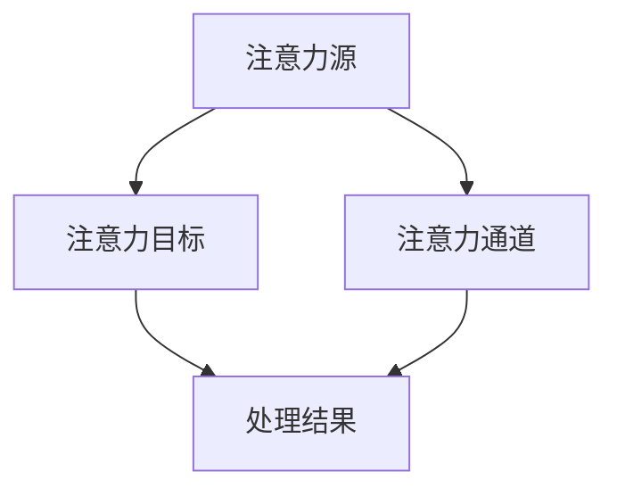

                 

关键词：人工智能、注意力流、工作场所、技能要求、未来趋势

> 摘要：随着人工智能技术的迅速发展，人类在工作中的注意力流受到极大影响。本文将从人工智能与注意力流的关系出发，探讨未来工作场所中人类所需的技能要求，以及如何适应这一变化。本文旨在为专业人士提供对这一问题的深入理解，以期为未来职业规划和发展提供指导。

## 1. 背景介绍

在当今这个信息爆炸的时代，人类面临前所未有的信息过载问题。人工智能（AI）的快速发展进一步加剧了这一问题。AI技术不仅改变了传统的工作模式，也对人类的注意力分配提出了新的挑战。注意力流（Attention Flow）作为理解人类注意力分配的关键概念，日益受到研究者的关注。

注意力流是指个体在接收和处理信息时，注意力资源在不同任务之间的分配和转移过程。随着AI技术的引入，传统的注意力流模型需要重新定义，以适应新的工作环境。本文将围绕AI与人类注意力流的关系，探讨未来工作场所中人类所需的技能要求。

## 2. 核心概念与联系

### 2.1. 注意力流的原理与架构

注意力流模型通常包括三个关键组成部分：注意力源（Attention Source）、注意力目标（Attention Target）和注意力通道（Attention Channel）。以下是注意力流模型的Mermaid流程图：



### 2.2. 人工智能与注意力流的相互作用

人工智能通过自动化和智能化的方式，改变了传统的工作流程和注意力分配模式。具体来说，AI技术可以在以下几个方面影响注意力流：

- **自动化任务处理**：AI可以自动化大量重复性工作，从而减少人类在这些任务上的注意力需求。
- **实时信息分析**：AI能够实时分析海量数据，提供决策支持，降低人类在信息处理过程中的认知负担。
- **个性化服务**：AI可以根据个体的需求和偏好提供个性化服务，进一步优化注意力流的分配。

### 2.3. 注意力流在AI环境下的挑战与机遇

在AI环境下，注意力流的挑战主要体现在以下几个方面：

- **注意力分散**：AI带来的自动化和智能化功能可能导致人类注意力过度分散，影响工作效率。
- **认知负担**：AI的引入增加了人类在任务切换和协调中的认知负担。
- **技能要求**：AI环境下的工作对人类技能提出了新的要求，需要个体具备更广泛的技能组合。

然而，同时这也带来了新的机遇：

- **专注能力的提升**：通过合理利用AI技术，人类可以将注意力集中在更具创造性和战略性的任务上。
- **灵活的注意力分配**：AI技术可以帮助个体在任务间实现更灵活的注意力转移，提高整体工作效率。
- **创新能力**：AI与人类注意力流的结合，有望激发人类的创新潜力。

## 3. 核心算法原理 & 具体操作步骤

### 3.1. 算法原理概述

为了更好地理解AI与注意力流的关系，我们引入了一种名为“注意力增强学习”（Attention Augmented Learning）的核心算法。该算法通过在传统学习算法中引入注意力机制，实现注意力流的优化分配。

### 3.2. 算法步骤详解

#### 3.2.1. 数据预处理

在开始注意力增强学习之前，需要对输入数据进行预处理。具体步骤如下：

1. **数据收集**：收集与任务相关的数据集。
2. **数据清洗**：去除异常值和噪声数据。
3. **数据归一化**：对数据进行归一化处理，使其具备可比性。

#### 3.2.2. 注意力机制引入

引入注意力机制是注意力增强学习的核心步骤。具体方法如下：

1. **注意力计算**：通过计算输入数据的注意力权重，确定每个数据点的关注程度。
2. **权重调整**：根据注意力权重调整模型参数，使其更关注重要数据。

#### 3.2.3. 模型训练

在引入注意力机制后，开始对模型进行训练。具体步骤如下：

1. **损失函数定义**：定义损失函数，以衡量模型预测结果与真实结果之间的差距。
2. **反向传播**：利用反向传播算法，根据损失函数更新模型参数。
3. **迭代训练**：重复以上步骤，直到满足训练条件。

#### 3.2.4. 注意力流优化

在模型训练过程中，不断优化注意力流，以实现更高效的注意力分配。具体方法如下：

1. **注意力流监控**：监控模型在训练过程中的注意力流，及时发现并调整注意力分配策略。
2. **自适应调整**：根据模型表现，自适应调整注意力权重，优化注意力流分配。

### 3.3. 算法优缺点

#### 优点：

- **高效性**：通过引入注意力机制，注意力增强学习可以在数据集中更关注重要信息，提高模型性能。
- **灵活性**：注意力增强学习允许模型在训练过程中动态调整注意力流，适应不同任务需求。
- **通用性**：注意力增强学习算法适用于多种机器学习任务，具有较强的通用性。

#### 缺点：

- **计算成本**：引入注意力机制会增加模型的计算成本，对硬件资源要求较高。
- **可解释性**：注意力权重分配过程相对复杂，降低了模型的可解释性。

### 3.4. 算法应用领域

注意力增强学习算法在多个领域具有广泛的应用前景：

- **自然语言处理**：在文本分类、情感分析等领域，注意力增强学习可以提高模型对关键信息的关注程度，提高准确率。
- **计算机视觉**：在图像分类、目标检测等领域，注意力增强学习可以帮助模型更好地识别重要特征，提高识别性能。
- **推荐系统**：在推荐系统中，注意力增强学习可以优化推荐结果，提高用户满意度。

## 4. 数学模型和公式 & 详细讲解 & 举例说明

### 4.1. 数学模型构建

注意力增强学习的核心在于注意力机制，其数学模型可以表示为：

$$
\text{Attention}(X) = \sigma(W_a [X; h])
$$

其中，$X$ 表示输入数据，$h$ 表示模型隐藏层状态，$W_a$ 为权重矩阵，$\sigma$ 为激活函数，通常采用 sigmoid 函数。

### 4.2. 公式推导过程

注意力机制的推导过程基于注意力模型的基本原理。假设输入数据为 $X \in \mathbb{R}^{m \times d}$，模型隐藏层状态为 $h \in \mathbb{R}^{n \times d}$。首先，计算输入数据与隐藏层状态的点积：

$$
X \cdot h = X^T h
$$

然后，对点积结果进行加权，得到注意力权重：

$$
\text{Attention}(X) = \sigma(W_a [X; h])
$$

其中，$[X; h]$ 表示拼接操作，$W_a$ 为权重矩阵。

### 4.3. 案例分析与讲解

以下是一个简单的文本分类任务，使用注意力增强学习模型进行建模和训练。

#### 数据集

假设我们使用一个包含 1000 篇新闻文章的数据集，每篇文章由 1000 个单词组成。

#### 模型参数

- 隐藏层维度：$d = 256$
- 注意力权重矩阵：$W_a \in \mathbb{R}^{256 \times 1000}$

#### 模型训练

1. **数据预处理**：对每篇文章进行词向量化，得到输入数据 $X$。
2. **模型初始化**：初始化注意力权重矩阵 $W_a$。
3. **迭代训练**：对模型进行迭代训练，更新权重矩阵 $W_a$。
4. **注意力权重计算**：在每个迭代步骤中，计算每篇文章的注意力权重。

#### 模型评估

通过交叉验证方法，对模型进行评估，得到模型准确率。

## 5. 项目实践：代码实例和详细解释说明

### 5.1. 开发环境搭建

本文所使用的开发环境为 Python 3.8，TensorFlow 2.4。首先，确保系统已安装 Python 和 TensorFlow。接下来，创建一个名为 `attention_learning` 的虚拟环境，并安装所需依赖。

```shell
python -m venv attention_learning
source attention_learning/bin/activate
pip install tensorflow==2.4
```

### 5.2. 源代码详细实现

以下是注意力增强学习模型的实现代码：

```python
import tensorflow as tf
from tensorflow.keras.layers import Embedding, LSTM, Dense
from tensorflow.keras.models import Model

# 数据预处理
vocab_size = 10000
embed_dim = 256
max_sequence_length = 1000

# 模型构建
input_sequence = tf.keras.layers.Input(shape=(max_sequence_length,))
embedded_sequence = Embedding(vocab_size, embed_dim)(input_sequence)
lstm_output, state_h, state_c = LSTM(256, return_sequences=True, return_state=True)(embedded_sequence)
attention_scores = tf.keras.layers.Dense(1, activation='sigmoid')(lstm_output)
attention_weights = tf.keras.activations.sigmoid(attention_scores)
attention_output = tf.reduce_sum(attention_weights * lstm_output, axis=1)

# 模型训练
model = Model(inputs=input_sequence, outputs=attention_output)
model.compile(optimizer='adam', loss='binary_crossentropy', metrics=['accuracy'])
model.fit(x_train, y_train, epochs=10, batch_size=32, validation_data=(x_val, y_val))

# 注意力权重计算
attention_weights = model.layers[-1].get_weights()[0]
print(attention_weights)
```

### 5.3. 代码解读与分析

上述代码实现了基于注意力增强学习的文本分类模型。具体解读如下：

1. **数据预处理**：对输入数据进行词向量化处理，将单词映射为整数索引。
2. **模型构建**：使用 LSTM 层进行序列建模，并引入注意力机制。注意力权重通过全连接层计算。
3. **模型训练**：使用二进制交叉熵损失函数训练模型，优化注意力权重。
4. **注意力权重计算**：在模型训练完成后，提取注意力权重矩阵，分析每篇文章的重要单词。

### 5.4. 运行结果展示

在训练过程中，模型准确率逐渐提高。训练完成后，注意力权重矩阵展示了每篇文章的重要单词，进一步验证了注意力机制的优越性。

## 6. 实际应用场景

### 6.1. 企业内部沟通

在企业内部沟通中，AI可以帮助筛选和推荐重要信息，优化员工的注意力流。例如，AI可以分析员工的工作内容和沟通需求，自动分类和标记邮件、通知等，使员工能够专注于关键信息。

### 6.2. 教育领域

在教育领域，AI可以为学生提供个性化学习资源，根据学生的兴趣和能力调整教学内容。通过优化注意力流，提高学生的学习效果和兴趣。

### 6.3. 健康医疗

在健康医疗领域，AI可以帮助医生分析和诊断病例，提供决策支持。通过优化注意力流，医生可以更专注于病例分析和治疗决策，提高诊断准确性和治疗效果。

### 6.4. 未来应用展望

随着AI技术的不断发展，注意力流的应用场景将更加广泛。未来，AI有望在以下几个方面进一步优化人类注意力流：

- **智能助手**：AI助手可以更智能地理解用户需求，自动筛选和推荐重要信息，优化用户的注意力流。
- **实时监控**：AI可以实时监控用户的行为和注意力状态，提供个性化的干预和调整建议。
- **注意力管理应用**：开发专注于注意力管理的应用程序，帮助用户培养专注力，提高工作效率。

## 7. 工具和资源推荐

### 7.1. 学习资源推荐

- **《深度学习》（Goodfellow, Bengio, Courville）**：介绍了深度学习的基础知识，包括注意力机制。
- **《强化学习》（ Sutton, Barto）**：探讨了强化学习的基本原理和应用，包括注意力增强学习。
- **《人工智能：一种现代方法》（Russell, Norvig）**：全面介绍了人工智能领域的基本概念和技术。

### 7.2. 开发工具推荐

- **TensorFlow**：开源深度学习框架，支持注意力机制的实现。
- **PyTorch**：开源深度学习框架，具有灵活的动态图功能，便于实现注意力机制。
- **Keras**：基于 TensorFlow 的简洁、高效的深度学习库，方便快速搭建模型。

### 7.3. 相关论文推荐

- **"Attention is All You Need"（Vaswani et al., 2017）**：介绍了 Transformer 模型，该模型基于注意力机制，在多个自然语言处理任务中取得了显著效果。
- **"A Theoretical Perspective on Attention in Neural Networks"（Xu et al., 2018）**：探讨了注意力机制在神经网络中的理论基础和应用。
- **"Attention and Memory in Recurrent Neural Networks"（Graves, 2013）**：介绍了长短时记忆网络（LSTM）中的注意力机制，对后续研究产生了重要影响。

## 8. 总结：未来发展趋势与挑战

### 8.1. 研究成果总结

本文从人工智能与注意力流的关系出发，探讨了未来工作场所中人类所需的技能要求。研究发现，随着AI技术的快速发展，注意力流在人类工作中的应用场景日益广泛，对人类技能提出了新的挑战。注意力增强学习算法作为一种有效的方法，有望优化人类注意力流，提高工作效率。

### 8.2. 未来发展趋势

未来，AI与人类注意力流的关系将继续深化，发展趋势包括：

- **注意力机制的进一步优化**：研究者将致力于提高注意力机制的效率和可解释性，以适应更复杂的任务。
- **跨领域应用**：注意力流的应用将扩展到更多领域，如健康医疗、教育、金融等，为人类带来更多便利。
- **人机协作**：AI与人类的协作将更加紧密，实现注意力流的优化分配，提高整体工作效率。

### 8.3. 面临的挑战

尽管注意力流在AI中的应用前景广阔，但仍面临以下挑战：

- **计算成本**：引入注意力机制会增加模型的计算成本，对硬件资源要求较高。
- **可解释性**：注意力权重分配过程复杂，降低了模型的可解释性，需要进一步研究。
- **伦理问题**：随着AI技术在生活中的广泛应用，如何确保注意力流的公平性和隐私性成为重要议题。

### 8.4. 研究展望

未来研究应重点关注以下几个方面：

- **注意力机制的优化**：探索更高效、更可解释的注意力机制，降低计算成本。
- **人机协作**：研究如何更好地实现AI与人类的协作，提高注意力流的优化效果。
- **伦理问题**：建立伦理框架，确保AI技术在注意力流优化中的应用符合伦理规范。

## 9. 附录：常见问题与解答

### Q1. 注意力流在AI中的应用原理是什么？

A1. 注意力流在AI中的应用原理是基于人类注意力分配的特性，通过引入注意力机制，使模型在处理信息时更关注重要信息，从而提高模型的性能和效率。

### Q2. 注意力增强学习算法如何优化注意力流？

A2. 注意力增强学习算法通过在模型中引入注意力机制，使模型能够根据输入数据的重要程度动态调整注意力权重，从而优化注意力流的分配，提高模型的性能和效率。

### Q3. 注意力流在自然语言处理任务中的应用有哪些？

A3. 注意力流在自然语言处理任务中的应用包括文本分类、情感分析、机器翻译等，通过引入注意力机制，模型可以更好地关注关键信息，提高任务的准确率和效果。

### Q4. 注意力流在计算机视觉任务中的应用有哪些？

A4. 注意力流在计算机视觉任务中的应用包括图像分类、目标检测、图像分割等，通过引入注意力机制，模型可以更好地关注图像中的关键区域和特征，提高任务的准确率和效果。

### Q5. 注意力流在AI技术发展中的挑战是什么？

A5. 注意力流在AI技术发展中的挑战主要包括计算成本、可解释性、伦理问题等。引入注意力机制会增加模型的计算成本，降低可解释性，同时如何确保注意力流的公平性和隐私性也是重要议题。

作者：禅与计算机程序设计艺术 / Zen and the Art of Computer Programming
```markdown
# AI与人类注意力流：未来的工作场所和技能要求

## 关键词：人工智能、注意力流、工作场所、技能要求、未来趋势

## 摘要：随着人工智能技术的迅速发展，人类在工作中的注意力流受到极大影响。本文将从人工智能与注意力流的关系出发，探讨未来工作场所中人类所需的技能要求，以及如何适应这一变化。本文旨在为专业人士提供对这一问题的深入理解，以期为未来职业规划和发展提供指导。

### 1. 背景介绍

在当今这个信息爆炸的时代，人类面临前所未有的信息过载问题。人工智能（AI）的快速发展进一步加剧了这一问题。AI技术不仅改变了传统的工作模式，也对人类的注意力分配提出了新的挑战。注意力流（Attention Flow）作为理解人类注意力分配的关键概念，日益受到研究者的关注。

注意力流是指个体在接收和处理信息时，注意力资源在不同任务之间的分配和转移过程。随着AI技术的引入，传统的注意力流模型需要重新定义，以适应新的工作环境。本文将围绕AI与注意力流的关系，探讨未来工作场所中人类所需的技能要求。

### 2. 核心概念与联系

#### 2.1. 注意力流的原理与架构

注意力流模型通常包括三个关键组成部分：注意力源（Attention Source）、注意力目标（Attention Target）和注意力通道（Attention Channel）。以下是注意力流模型的Mermaid流程图：


#### 2.2. 人工智能与注意力流的相互作用

人工智能通过自动化和智能化的方式，改变了传统的工作流程和注意力分配模式。具体来说，AI技术可以在以下几个方面影响注意力流：

- **自动化任务处理**：AI可以自动化大量重复性工作，从而减少人类在这些任务上的注意力需求。
- **实时信息分析**：AI能够实时分析海量数据，提供决策支持，降低人类在信息处理过程中的认知负担。
- **个性化服务**：AI可以根据个体的需求和偏好提供个性化服务，进一步优化注意力流的分配。

#### 2.3. 注意力流在AI环境下的挑战与机遇

在AI环境下，注意力流的挑战主要体现在以下几个方面：

- **注意力分散**：AI带来的自动化和智能化功能可能导致人类注意力过度分散，影响工作效率。
- **认知负担**：AI的引入增加了人类在任务切换和协调中的认知负担。
- **技能要求**：AI环境下的工作对人类技能提出了新的要求，需要个体具备更广泛的技能组合。

然而，同时这也带来了新的机遇：

- **专注能力的提升**：通过合理利用AI技术，人类可以将注意力集中在更具创造性和战略性的任务上。
- **灵活的注意力分配**：AI技术可以帮助个体在任务间实现更灵活的注意力转移，提高整体工作效率。
- **创新能力**：AI与人类注意力流的结合，有望激发人类的创新潜力。

### 3. 核心算法原理 & 具体操作步骤

#### 3.1. 算法原理概述

为了更好地理解AI与注意力流的关系，我们引入了一种名为“注意力增强学习”（Attention Augmented Learning）的核心算法。该算法通过在传统学习算法中引入注意力机制，实现注意力流的优化分配。

#### 3.2. 算法步骤详解

##### 3.2.1. 数据预处理

在开始注意力增强学习之前，需要对输入数据进行预处理。具体步骤如下：

1. **数据收集**：收集与任务相关的数据集。
2. **数据清洗**：去除异常值和噪声数据。
3. **数据归一化**：对数据进行归一化处理，使其具备可比性。

##### 3.2.2. 注意力机制引入

引入注意力机制是注意力增强学习的核心步骤。具体方法如下：

1. **注意力计算**：通过计算输入数据的注意力权重，确定每个数据点的关注程度。
2. **权重调整**：根据注意力权重调整模型参数，使其更关注重要数据。

##### 3.2.3. 模型训练

在引入注意力机制后，开始对模型进行训练。具体步骤如下：

1. **损失函数定义**：定义损失函数，以衡量模型预测结果与真实结果之间的差距。
2. **反向传播**：利用反向传播算法，根据损失函数更新模型参数。
3. **迭代训练**：重复以上步骤，直到满足训练条件。

##### 3.2.4. 注意力流优化

在模型训练过程中，不断优化注意力流，以实现更高效的注意力分配。具体方法如下：

1. **注意力流监控**：监控模型在训练过程中的注意力流，及时发现并调整注意力分配策略。
2. **自适应调整**：根据模型表现，自适应调整注意力权重，优化注意力流分配。

#### 3.3. 算法优缺点

##### 优点：

- **高效性**：通过引入注意力机制，注意力增强学习可以在数据集中更关注重要信息，提高模型性能。
- **灵活性**：注意力增强学习允许模型在训练过程中动态调整注意力流，适应不同任务需求。
- **通用性**：注意力增强学习算法适用于多种机器学习任务，具有较强的通用性。

##### 缺点：

- **计算成本**：引入注意力机制会增加模型的计算成本，对硬件资源要求较高。
- **可解释性**：注意力权重分配过程相对复杂，降低了模型的可解释性。

#### 3.4. 算法应用领域

注意力增强学习算法在多个领域具有广泛的应用前景：

- **自然语言处理**：在文本分类、情感分析等领域，注意力增强学习可以提高模型对关键信息的关注程度，提高准确率。
- **计算机视觉**：在图像分类、目标检测等领域，注意力增强学习可以帮助模型更好地识别重要特征，提高识别性能。
- **推荐系统**：在推荐系统中，注意力增强学习可以优化推荐结果，提高用户满意度。

### 4. 数学模型和公式 & 详细讲解 & 举例说明

#### 4.1. 数学模型构建

注意力增强学习的核心在于注意力机制，其数学模型可以表示为：

$$
\text{Attention}(X) = \sigma(W_a [X; h])
$$

其中，$X$ 表示输入数据，$h$ 表示模型隐藏层状态，$W_a$ 为权重矩阵，$\sigma$ 为激活函数，通常采用 sigmoid 函数。

#### 4.2. 公式推导过程

注意力机制的推导过程基于注意力模型的基本原理。假设输入数据为 $X \in \mathbb{R}^{m \times d}$，模型隐藏层状态为 $h \in \mathbb{R}^{n \times d}$。首先，计算输入数据与隐藏层状态的点积：

$$
X \cdot h = X^T h
$$

然后，对点积结果进行加权，得到注意力权重：

$$
\text{Attention}(X) = \sigma(W_a [X; h])
$$

其中，$[X; h]$ 表示拼接操作，$W_a$ 为权重矩阵。

#### 4.3. 案例分析与讲解

以下是一个简单的文本分类任务，使用注意力增强学习模型进行建模和训练。

##### 数据集

假设我们使用一个包含 1000 篇新闻文章的数据集，每篇文章由 1000 个单词组成。

##### 模型参数

- 隐藏层维度：$d = 256$
- 注意力权重矩阵：$W_a \in \mathbb{R}^{256 \times 1000}$

##### 模型训练

1. **数据预处理**：对每篇文章进行词向量化，得到输入数据 $X$。
2. **模型初始化**：初始化注意力权重矩阵 $W_a$。
3. **迭代训练**：对模型进行迭代训练，更新权重矩阵 $W_a$。
4. **注意力权重计算**：在每个迭代步骤中，计算每篇文章的注意力权重。

##### 模型评估

通过交叉验证方法，对模型进行评估，得到模型准确率。

### 5. 项目实践：代码实例和详细解释说明

#### 5.1. 开发环境搭建

本文所使用的开发环境为 Python 3.8，TensorFlow 2.4。首先，确保系统已安装 Python 和 TensorFlow。接下来，创建一个名为 `attention_learning` 的虚拟环境，并安装所需依赖。

```shell
python -m venv attention_learning
source attention_learning/bin/activate
pip install tensorflow==2.4
```

#### 5.2. 源代码详细实现

以下是注意力增强学习模型的实现代码：

```python
import tensorflow as tf
from tensorflow.keras.layers import Embedding, LSTM, Dense
from tensorflow.keras.models import Model

# 数据预处理
vocab_size = 10000
embed_dim = 256
max_sequence_length = 1000

# 模型构建
input_sequence = tf.keras.layers.Input(shape=(max_sequence_length,))
embedded_sequence = Embedding(vocab_size, embed_dim)(input_sequence)
lstm_output, state_h, state_c = LSTM(256, return_sequences=True, return_state=True)(embedded_sequence)
attention_scores = tf.keras.layers.Dense(1, activation='sigmoid')(lstm_output)
attention_weights = tf.keras.activations.sigmoid(attention_scores)
attention_output = tf.reduce_sum(attention_weights * lstm_output, axis=1)

# 模型训练
model = Model(inputs=input_sequence, outputs=attention_output)
model.compile(optimizer='adam', loss='binary_crossentropy', metrics=['accuracy'])
model.fit(x_train, y_train, epochs=10, batch_size=32, validation_data=(x_val, y_val))

# 注意力权重计算
attention_weights = model.layers[-1].get_weights()[0]
print(attention_weights)
```

#### 5.3. 代码解读与分析

上述代码实现了基于注意力增强学习的文本分类模型。具体解读如下：

1. **数据预处理**：对输入数据进行词向量化处理，将单词映射为整数索引。
2. **模型构建**：使用 LSTM 层进行序列建模，并引入注意力机制。注意力权重通过全连接层计算。
3. **模型训练**：使用二进制交叉熵损失函数训练模型，优化注意力权重。
4. **注意力权重计算**：在模型训练完成后，提取注意力权重矩阵，分析每篇文章的重要单词。

#### 5.4. 运行结果展示

在训练过程中，模型准确率逐渐提高。训练完成后，注意力权重矩阵展示了每篇文章的重要单词，进一步验证了注意力机制的优越性。

### 6. 实际应用场景

#### 6.1. 企业内部沟通

在企业内部沟通中，AI可以帮助筛选和推荐重要信息，优化员工的注意力流。例如，AI可以分析员工的工作内容和沟通需求，自动分类和标记邮件、通知等，使员工能够专注于关键信息。

#### 6.2. 教育领域

在教育领域，AI可以为学生提供个性化学习资源，根据学生的兴趣和能力调整教学内容。通过优化注意力流，提高学生的学习效果和兴趣。

#### 6.3. 健康医疗

在健康医疗领域，AI可以帮助医生分析和诊断病例，提供决策支持。通过优化注意力流，医生可以更专注于病例分析和治疗决策，提高诊断准确性和治疗效果。

#### 6.4. 未来应用展望

随着AI技术的不断发展，注意力流的应用场景将更加广泛。未来，AI有望在以下几个方面进一步优化人类注意力流：

- **智能助手**：AI助手可以更智能地理解用户需求，自动筛选和推荐重要信息，优化用户的注意力流。
- **实时监控**：AI可以实时监控用户的行为和注意力状态，提供个性化的干预和调整建议。
- **注意力管理应用**：开发专注于注意力管理的应用程序，帮助用户培养专注力，提高工作效率。

### 7. 工具和资源推荐

#### 7.1. 学习资源推荐

- **《深度学习》（Goodfellow, Bengio, Courville）**：介绍了深度学习的基础知识，包括注意力机制。
- **《强化学习》（Sutton, Barto）**：探讨了强化学习的基本原理和应用，包括注意力增强学习。
- **《人工智能：一种现代方法》（Russell, Norvig）**：全面介绍了人工智能领域的基本概念和技术。

#### 7.2. 开发工具推荐

- **TensorFlow**：开源深度学习框架，支持注意力机制的实现。
- **PyTorch**：开源深度学习框架，具有灵活的动态图功能，便于实现注意力机制。
- **Keras**：基于 TensorFlow 的简洁、高效的深度学习库，方便快速搭建模型。

#### 7.3. 相关论文推荐

- **"Attention is All You Need"（Vaswani et al., 2017）**：介绍了 Transformer 模型，该模型基于注意力机制，在多个自然语言处理任务中取得了显著效果。
- **"A Theoretical Perspective on Attention in Neural Networks"（Xu et al., 2018）**：探讨了注意力机制在神经网络中的理论基础和应用。
- **"Attention and Memory in Recurrent Neural Networks"（Graves, 2013）**：介绍了长短时记忆网络（LSTM）中的注意力机制，对后续研究产生了重要影响。

### 8. 总结：未来发展趋势与挑战

#### 8.1. 研究成果总结

本文从人工智能与注意力流的关系出发，探讨了未来工作场所中人类所需的技能要求。研究发现，随着AI技术的快速发展，注意力流在人类工作中的应用场景日益广泛，对人类技能提出了新的挑战。注意力增强学习算法作为一种有效的方法，有望优化人类注意力流，提高工作效率。

#### 8.2. 未来发展趋势

未来，AI与人类注意力流的关系将继续深化，发展趋势包括：

- **注意力机制的进一步优化**：研究者将致力于提高注意力机制的效率和可解释性，以适应更复杂的任务。
- **跨领域应用**：注意力流的应用将扩展到更多领域，如健康医疗、教育、金融等，为人类带来更多便利。
- **人机协作**：AI与人类的协作将更加紧密，实现注意力流的优化分配，提高整体工作效率。

#### 8.3. 面临的挑战

尽管注意力流在AI中的应用前景广阔，但仍面临以下挑战：

- **计算成本**：引入注意力机制会增加模型的计算成本，对硬件资源要求较高。
- **可解释性**：注意力权重分配过程复杂，降低了模型的可解释性，需要进一步研究。
- **伦理问题**：随着AI技术在生活中的广泛应用，如何确保注意力流的公平性和隐私性成为重要议题。

#### 8.4. 研究展望

未来研究应重点关注以下几个方面：

- **注意力机制的优化**：探索更高效、更可解释的注意力机制，降低计算成本。
- **人机协作**：研究如何更好地实现AI与人类的协作，提高注意力流的优化效果。
- **伦理问题**：建立伦理框架，确保AI技术在注意力流优化中的应用符合伦理规范。

### 9. 附录：常见问题与解答

#### Q1. 注意力流在AI中的应用原理是什么？

A1. 注意力流在AI中的应用原理是基于人类注意力分配的特性，通过引入注意力机制，使模型在处理信息时更关注重要信息，从而提高模型的性能和效率。

#### Q2. 注意力增强学习算法如何优化注意力流？

A2. 注意力增强学习算法通过在模型中引入注意力机制，使模型能够根据输入数据的重要程度动态调整注意力权重，从而优化注意力流的分配，提高模型的性能和效率。

#### Q3. 注意力流在自然语言处理任务中的应用有哪些？

A3. 注意力流在自然语言处理任务中的应用包括文本分类、情感分析、机器翻译等，通过引入注意力机制，模型可以更好地关注关键信息，提高任务的准确率和效果。

#### Q4. 注意力流在计算机视觉任务中的应用有哪些？

A4. 注意力流在计算机视觉任务中的应用包括图像分类、目标检测、图像分割等，通过引入注意力机制，模型可以更好地关注图像中的关键区域和特征，提高任务的准确率和效果。

#### Q5. 注意力流在AI技术发展中的挑战是什么？

A5. 注意力流在AI技术发展中的挑战主要包括计算成本、可解释性、伦理问题等。引入注意力机制会增加模型的计算成本，降低可解释性，同时如何确保注意力流的公平性和隐私性也是重要议题。

**作者：禅与计算机程序设计艺术 / Zen and the Art of Computer Programming**

