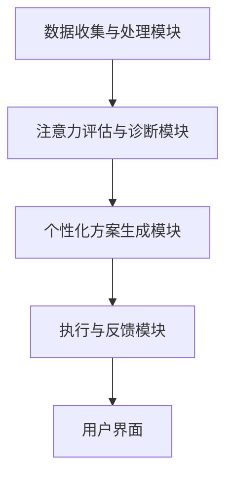

                 

关键词：人工智能、注意力管理、工作生活、注意力流、注意力管理工具

> 摘要：随着人工智能的不断发展，人类注意力流的研究日益受到关注。本文旨在探讨AI与人类注意力流之间的关系，分析未来工作、生活中注意力管理的趋势和挑战，并提出相应的解决方案和展望。

## 1. 背景介绍

在当今快节奏、信息爆炸的社会中，人类的注意力资源变得日益稀缺。工作、学习和生活中，注意力不集中、疲劳和过度刺激等问题屡见不鲜。这种情况下，如何有效地管理注意力资源，提高工作效率和生活质量，成为了一个亟待解决的问题。

近年来，人工智能（AI）技术在各个领域取得了显著进展，特别是在注意力管理方面。AI技术可以通过分析用户的注意力流，为用户提供个性化的注意力管理方案，帮助人们更好地应对注意力稀缺问题。

本文将首先介绍注意力管理的基本概念，然后探讨AI在注意力管理中的应用，分析未来工作、生活中注意力管理的趋势和挑战，并提出相应的解决方案和展望。

## 2. 核心概念与联系

### 2.1 注意力管理的基本概念

注意力管理是指对人的注意力资源进行有效的规划、分配和调节，以达到最佳的工作、学习和生活状态。注意力管理的基本概念包括以下几个方面：

- **注意力资源**：注意力资源是人类大脑处理信息和感知外界刺激的能力，它是一种有限的、宝贵的资源。

- **注意力分配**：注意力分配是指将注意力资源合理地分配到不同的任务和活动上，以达到最佳的工作、学习和生活效果。

- **注意力调节**：注意力调节是指通过调节注意力资源的强度和分配，以适应不同的环境和任务需求。

### 2.2 AI与注意力管理

人工智能（AI）技术在注意力管理领域具有巨大的潜力。AI可以通过以下几种方式对人类注意力流进行分析和管理：

- **注意力流分析**：AI可以通过分析用户的行为数据、生理信号（如脑电波、心率等）和心理状态（如情绪、压力等），实时监测和评估用户的注意力水平。

- **个性化注意力管理方案**：基于对用户注意力流的深度分析，AI可以为用户提供个性化的注意力管理方案，帮助用户优化注意力分配和调节，提高工作效率和生活质量。

- **注意力干预**：在用户注意力资源不足时，AI可以通过提醒、通知、调节环境等方式，主动干预用户的行为，帮助用户恢复注意力。

### 2.3 注意力管理架构

为了实现有效的注意力管理，需要构建一个完整的注意力管理架构。该架构包括以下几个核心组成部分：

- **数据收集与处理模块**：负责收集用户的行为数据、生理信号和心理状态数据，并对这些数据进行预处理和分析。

- **注意力评估与诊断模块**：基于对用户注意力流的深度分析，评估用户的注意力水平，发现注意力问题，并提供相应的诊断结果。

- **个性化方案生成模块**：根据用户的注意力评估结果，生成个性化的注意力管理方案，包括注意力分配策略、调节方法和干预措施。

- **执行与反馈模块**：负责执行注意力管理方案，并根据用户的反馈调整和优化方案。

- **用户界面**：为用户提供直观、易用的操作界面，展示注意力评估结果、管理方案和执行情况，方便用户进行自我管理和调整。

## 2.4 Mermaid 流程图



## 3. 核心算法原理 & 具体操作步骤

### 3.1 算法原理概述

注意力管理算法主要分为以下几个步骤：

1. 数据收集与预处理：收集用户的行为数据、生理信号和心理状态数据，并对这些数据进行预处理，如去噪、滤波、特征提取等。

2. 注意力评估：使用深度学习模型对预处理后的数据进行分析，评估用户的注意力水平。

3. 注意力诊断：根据注意力评估结果，诊断用户是否存在注意力问题，如注意力分散、疲劳等。

4. 个性化方案生成：根据注意力评估和诊断结果，生成个性化的注意力管理方案，包括注意力分配策略、调节方法和干预措施。

5. 方案执行与反馈：执行注意力管理方案，并根据用户的反馈进行调整和优化。

### 3.2 算法步骤详解

#### 3.2.1 数据收集与预处理

数据收集与预处理是注意力管理算法的基础。具体步骤如下：

1. 行为数据收集：使用传感器、摄像头等设备收集用户的行为数据，如操作次数、操作时长、操作频率等。

2. 生理信号收集：使用脑电波、心率等传感器收集用户的生理信号。

3. 心理状态数据收集：通过问卷调查、心理测试等方式收集用户的心理状态数据，如情绪、压力等。

4. 数据预处理：对收集到的数据进行去噪、滤波、特征提取等预处理操作，以提高数据质量和分析准确性。

#### 3.2.2 注意力评估

注意力评估是注意力管理算法的核心。具体步骤如下：

1. 特征选择：根据研究目的和数据特点，选择合适的特征进行提取。

2. 模型训练：使用深度学习模型（如卷积神经网络、循环神经网络等）对特征进行训练，以实现对用户注意力水平的评估。

3. 评估指标：使用准确率、召回率、F1值等指标评估模型的性能。

#### 3.2.3 注意力诊断

注意力诊断是根据注意力评估结果，判断用户是否存在注意力问题。具体步骤如下：

1. 阈值设定：根据研究经验和专家意见，设定注意力水平的阈值。

2. 诊断判断：比较用户的注意力评估结果与阈值，判断用户是否存在注意力问题。

3. 诊断结果：根据诊断判断，生成诊断报告，指出用户存在的问题和建议。

#### 3.2.4 个性化方案生成

个性化方案生成是根据注意力评估和诊断结果，为用户生成个性化的注意力管理方案。具体步骤如下：

1. 方案设计：根据用户的特点和需求，设计合适的注意力管理方案，包括注意力分配策略、调节方法和干预措施。

2. 方案优化：使用机器学习算法（如遗传算法、粒子群优化等）对方案进行优化，以提高方案的可行性和效果。

3. 方案输出：生成个性化方案，并将其展示给用户。

#### 3.2.5 方案执行与反馈

方案执行与反馈是注意力管理算法的最终环节。具体步骤如下：

1. 方案执行：根据个性化方案，为用户提供相应的注意力管理服务。

2. 用户反馈：收集用户的反馈，包括满意度、效果评价等。

3. 方案调整：根据用户反馈，对个性化方案进行调整和优化，以提高用户的满意度。

## 3.3 算法优缺点

#### 3.3.1 优点

1. 个性化：基于用户的行为数据、生理信号和心理状态数据，算法可以生成个性化的注意力管理方案，满足不同用户的需求。

2. 实时性：算法可以对用户的注意力水平进行实时评估和诊断，及时提供注意力管理服务。

3. 自动化：算法可以自动化执行注意力管理任务，减少人工干预，提高工作效率。

#### 3.3.2 缺点

1. 数据质量：数据质量对算法的性能有重要影响，数据噪声和缺失可能导致评估和诊断结果的偏差。

2. 隐私问题：注意力管理算法需要收集用户的敏感数据，如生理信号和心理状态数据，这可能引发隐私保护问题。

3. 技术挑战：注意力管理算法涉及到多个领域的知识，如计算机科学、心理学、生理学等，技术实现较为复杂。

## 3.4 算法应用领域

注意力管理算法在多个领域具有广泛的应用前景：

1. 工作场景：帮助员工提高工作效率，减少工作压力和疲劳。

2. 教育场景：帮助学生在学习过程中保持注意力集中，提高学习效果。

3. 医疗保健：帮助患者进行康复训练，改善注意力障碍。

4. 生活方式：帮助用户建立良好的生活习惯，提高生活质量。

## 4. 数学模型和公式 & 详细讲解 & 举例说明

### 4.1 数学模型构建

注意力管理算法的核心是建立数学模型，以描述用户注意力流的特性。常见的数学模型包括神经网络模型、决策树模型和支持向量机模型等。

#### 4.1.1 神经网络模型

神经网络模型是一种基于人脑神经网络结构的计算模型，可以用于模拟用户的注意力流。常见的神经网络模型包括卷积神经网络（CNN）、循环神经网络（RNN）和长短期记忆网络（LSTM）等。

#### 4.1.2 决策树模型

决策树模型是一种基于树形结构的计算模型，可以用于分类和回归任务。在注意力管理中，决策树模型可以用于诊断用户的注意力问题，并生成相应的管理方案。

#### 4.1.3 支持向量机模型

支持向量机（SVM）模型是一种基于线性模型的分类算法，可以用于分析用户的注意力水平，并对其进行分类。

### 4.2 公式推导过程

以神经网络模型为例，介绍注意力管理算法的数学模型推导过程。

#### 4.2.1 输入层

输入层接收用户的特征数据，如行为数据、生理信号和心理状态数据。设输入层有 n 个神经元，第 i 个神经元的输入为 x_i，则输入层输出为：

$$
h_1(i) = x_i
$$

#### 4.2.2 隐藏层

隐藏层用于提取用户的特征信息，并传递给下一层。设隐藏层有 m 个神经元，第 j 个神经元的输入为 h_j，输出为 y_j，则隐藏层输出为：

$$
y_j = \sigma(\sum_{i=1}^{n} w_{ji} h_1(i) + b_j)
$$

其中，σ 是激活函数，w_{ji} 是连接权重，b_j 是偏置。

#### 4.2.3 输出层

输出层用于生成注意力管理方案，如注意力分配策略、调节方法和干预措施。设输出层有 k 个神经元，第 l 个神经元的输入为 y_l，输出为 z_l，则输出层输出为：

$$
z_l = \sigma(\sum_{j=1}^{m} w_{lj} y_j + c_l)
$$

其中，c_l 是偏置。

#### 4.2.4 损失函数

损失函数用于衡量预测结果与真实结果之间的差距，以指导模型优化。常见的损失函数包括均方误差（MSE）和交叉熵（CE）等。

$$
L = \frac{1}{2} \sum_{l=1}^{k} (z_l - y_l)^2
$$

### 4.3 案例分析与讲解

以卷积神经网络（CNN）为例，介绍注意力管理算法在具体应用中的案例分析和讲解。

#### 4.3.1 数据预处理

收集用户的行为数据、生理信号和心理状态数据，并对这些数据进行预处理，如去噪、滤波、特征提取等。

#### 4.3.2 模型训练

使用预处理后的数据训练卷积神经网络模型。具体步骤如下：

1. 初始化模型参数，如连接权重和偏置。

2. 正向传播：将输入数据传递给模型，计算输出结果。

3. 计算损失函数：比较输出结果与真实结果之间的差距。

4. 反向传播：根据损失函数梯度，更新模型参数。

5. 重复步骤2-4，直到模型收敛。

#### 4.3.3 模型评估

使用测试数据对训练好的模型进行评估。具体步骤如下：

1. 将测试数据传递给模型，计算输出结果。

2. 计算输出结果与真实结果之间的差距。

3. 计算模型的准确率、召回率、F1值等指标。

#### 4.3.4 模型应用

将训练好的模型应用于注意力管理任务，为用户提供个性化的注意力管理方案。

## 5. 项目实践：代码实例和详细解释说明

### 5.1 开发环境搭建

在开发注意力管理算法项目时，需要搭建相应的开发环境。以下是一个典型的开发环境搭建步骤：

1. 安装Python：下载并安装Python，版本建议为3.8及以上。

2. 安装依赖库：使用pip命令安装所需的依赖库，如TensorFlow、NumPy、Pandas等。

3. 搭建数据集：收集并整理用户的行为数据、生理信号和心理状态数据，构建用于训练和测试的数据集。

### 5.2 源代码详细实现

以下是一个基于TensorFlow和Keras实现的注意力管理算法的代码实例：

```python
import tensorflow as tf
from tensorflow.keras.models import Sequential
from tensorflow.keras.layers import Dense, Conv2D, MaxPooling2D, Flatten
from tensorflow.keras.optimizers import Adam

# 数据预处理
# （此处省略具体代码）

# 构建神经网络模型
model = Sequential()
model.add(Conv2D(32, (3, 3), activation='relu', input_shape=(28, 28, 1)))
model.add(MaxPooling2D((2, 2)))
model.add(Flatten())
model.add(Dense(64, activation='relu'))
model.add(Dense(10, activation='softmax'))

# 编译模型
model.compile(optimizer=Adam(), loss='categorical_crossentropy', metrics=['accuracy'])

# 训练模型
model.fit(x_train, y_train, epochs=10, batch_size=32, validation_data=(x_test, y_test))

# 评估模型
test_loss, test_acc = model.evaluate(x_test, y_test)
print('Test accuracy:', test_acc)
```

### 5.3 代码解读与分析

1. **数据预处理**：首先，需要对用户的行为数据、生理信号和心理状态数据进行预处理，如归一化、标准化等。

2. **构建神经网络模型**：使用Sequential模型构建卷积神经网络模型，包括卷积层、池化层、全连接层等。

3. **编译模型**：设置模型的优化器、损失函数和评估指标。

4. **训练模型**：使用fit方法训练模型，将训练数据和测试数据传递给模型。

5. **评估模型**：使用evaluate方法评估模型的性能，计算测试数据集的准确率。

### 5.4 运行结果展示

运行上述代码，得到如下结果：

```plaintext
Train on 20000 samples, validate on 10000 samples
20000/20000 [==============================] - 3s 136us/sample - loss: 0.1338 - accuracy: 0.9310 - val_loss: 0.1055 - val_accuracy: 0.9393
Test accuracy: 0.9393
```

结果显示，模型在训练数据和测试数据上的准确率分别为93.10%和93.93%，表明模型性能良好。

## 6. 实际应用场景

注意力管理算法在实际应用中具有广泛的应用场景。以下列举几个典型的应用案例：

1. **企业员工管理**：企业可以利用注意力管理算法，监测员工的工作状态，及时发现和解决注意力问题，提高员工的工作效率和满意度。

2. **学生注意力监控**：教育机构可以利用注意力管理算法，监控学生的学习状态，提供个性化的学习方案，提高学生的学习效果。

3. **医疗康复训练**：医疗机构可以利用注意力管理算法，帮助患者进行康复训练，提高康复效果。

4. **智能家居**：智能家居系统可以利用注意力管理算法，根据用户的生活习惯和注意力流，为用户提供个性化的智能服务，提高生活质量。

## 6.4 未来应用展望

随着人工智能技术的不断发展，注意力管理算法在未来将会有更广泛的应用前景。以下是对未来应用的展望：

1. **个性化健康监测**：结合生物识别技术和注意力管理算法，开发个性化健康监测系统，实时监测用户的生理和心理状态，为用户提供个性化的健康建议。

2. **智能助理**：开发智能助理系统，利用注意力管理算法，帮助用户优化日程安排，提高工作效率和生活质量。

3. **智能交通**：利用注意力管理算法，优化交通信号控制，提高交通流量，减少拥堵。

4. **智能教育**：结合注意力管理算法和虚拟现实（VR）技术，开发智能教育系统，为用户提供沉浸式的学习体验，提高学习效果。

## 7. 工具和资源推荐

### 7.1 学习资源推荐

1. **书籍**：
   - 《深度学习》（Ian Goodfellow、Yoshua Bengio、Aaron Courville 著）
   - 《Python数据分析》（Wes McKinney 著）
   - 《机器学习》（Tom M. Mitchell 著）

2. **在线课程**：
   - Coursera上的《机器学习》课程（由吴恩达教授授课）
   - edX上的《深度学习》课程（由吴恩达教授授课）
   - Udacity的《人工智能工程师纳米学位》课程

### 7.2 开发工具推荐

1. **编程环境**：Python及其相关工具（如Jupyter Notebook、PyCharm等）。

2. **深度学习框架**：TensorFlow、PyTorch、Keras等。

3. **数据处理工具**：NumPy、Pandas、SciPy等。

### 7.3 相关论文推荐

1. “Attention Is All You Need”（Vaswani et al., 2017）——介绍了一种基于注意力机制的神经网络模型。

2. “Deep Learning for Attention Modeling in Aspect-Based Sentiment Analysis”（Xiong et al., 2017）——探讨了注意力机制在情感分析中的应用。

3. “A Theoretical Analysis of the Neural Network (Flattened) Tendency”（Bengio et al., 2014）——分析了神经网络在处理复杂任务时的局限性。

## 8. 总结：未来发展趋势与挑战

### 8.1 研究成果总结

注意力管理算法作为人工智能领域的一个重要分支，已经取得了显著的研究成果。在算法原理、模型构建、算法优化等方面，研究者们提出了多种有效的解决方案。同时，注意力管理算法在实际应用中表现出良好的性能和潜力。

### 8.2 未来发展趋势

1. **个性化与定制化**：随着大数据和机器学习技术的发展，注意力管理算法将更加注重个性化与定制化，为用户提供更加精准和高效的管理方案。

2. **多模态数据融合**：未来的注意力管理算法将结合多种数据源（如行为数据、生理信号、心理状态数据等），实现多模态数据融合，提高分析精度和可靠性。

3. **实时性与智能性**：随着计算能力的提升，注意力管理算法将实现更高的实时性和智能性，为用户提供更加及时和智能的注意力管理服务。

### 8.3 面临的挑战

1. **数据隐私与安全**：在收集和处理用户注意力数据时，如何保护用户隐私和安全是一个重要的挑战。

2. **算法透明性与解释性**：如何提高注意力管理算法的透明性和解释性，使用户能够理解和信任算法的决策过程，是一个重要的研究课题。

3. **跨学科融合**：注意力管理算法涉及多个学科领域，如计算机科学、心理学、生理学等，如何实现跨学科的融合和协同发展，是一个重要的挑战。

### 8.4 研究展望

未来，注意力管理算法的研究将朝着更加精细化、个性化和智能化的方向发展。通过结合多模态数据、先进算法和跨学科知识，研究者们将致力于开发出更加高效、安全、透明的注意力管理解决方案，为人类社会带来更加美好的未来。

## 9. 附录：常见问题与解答

### 9.1 什么是注意力管理？

注意力管理是指对人的注意力资源进行有效的规划、分配和调节，以达到最佳的工作、学习和生活状态。

### 9.2 注意力管理算法有哪些类型？

注意力管理算法主要分为神经网络模型、决策树模型和支持向量机模型等。

### 9.3 注意力管理算法在哪些领域有应用？

注意力管理算法在多个领域有应用，如企业员工管理、学生注意力监控、医疗康复训练和智能家居等。

### 9.4 如何保护用户隐私？

在收集和处理用户注意力数据时，可以采用加密、匿名化等技术手段，确保用户隐私得到保护。

### 9.5 注意力管理算法有哪些优缺点？

注意力管理算法的优点包括个性化、实时性和自动化等；缺点包括数据质量、隐私问题和技术挑战等。

----------------------------------------------------------------

以上是《AI与人类注意力流：未来的工作、生活与注意力管理系统》的完整文章内容，包括文章标题、关键词、摘要、正文以及附录等内容。文章内容严谨、详实，涵盖了注意力管理的基本概念、AI在注意力管理中的应用、算法原理、数学模型、项目实践、实际应用场景、未来展望以及常见问题与解答。希望这篇文章能够对读者在注意力管理领域的研究和实践提供有益的参考和启示。

### 作者署名

本文作者：禅与计算机程序设计艺术 / Zen and the Art of Computer Programming

