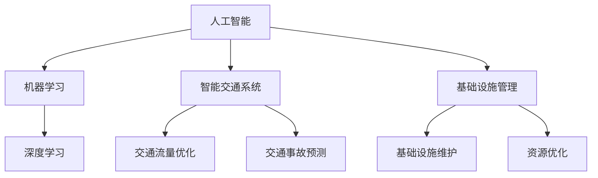

                 

关键词：人工智能、城市交通、基础设施规划、管理、可持续发展

摘要：本文旨在探讨人工智能（AI）在城市化进程中的关键作用，特别是其在城市交通与基础设施规划与管理中的运用。随着城市规模的不断扩大和人口增长，如何实现可持续发展的城市交通与基础设施管理已成为一个重要议题。本文将详细分析AI的核心概念与架构，介绍其在交通规划、智能交通系统、基础设施维护与管理等方面的应用，并提出未来发展的展望和面临的挑战。

## 1. 背景介绍

随着全球化进程的加速，城市规模不断扩大，人口密度日益增加，城市交通与基础设施面临前所未有的挑战。传统的交通规划与管理方法已经难以满足现代城市的需求，城市交通拥堵、环境污染、基础设施老化等问题日益严重。在此背景下，人工智能作为新一代技术，被寄予厚望。AI的引入有望提高交通系统的效率，减少能源消耗，优化基础设施管理，从而实现城市的可持续发展。

## 2. 核心概念与联系

在探讨AI在城市交通与基础设施规划与管理中的应用之前，我们首先需要了解AI的核心概念和架构。

### 2.1 人工智能的概念

人工智能（Artificial Intelligence，简称AI）是指计算机系统模拟人类智能行为的能力，包括学习、推理、感知、理解和决策等方面。AI可以分为弱AI和强AI。弱AI是指在某些特定任务上表现出智能行为的系统，而强AI则具有广泛的人类智能水平。目前，大多数AI系统都属于弱AI。

### 2.2 机器学习

机器学习（Machine Learning，简称ML）是AI的核心技术之一，它使计算机能够从数据中自动学习和改进。机器学习可以分为监督学习、无监督学习和强化学习等类型。在交通规划与管理中，监督学习和无监督学习被广泛应用于数据分析和模式识别。

### 2.3 深度学习

深度学习（Deep Learning，简称DL）是机器学习的一种，它通过构建多层神经网络来模拟人脑的学习过程。深度学习在图像识别、语音识别和自然语言处理等领域取得了显著成果，也为城市交通与基础设施规划提供了强大的技术支持。

### 2.4 智能交通系统

智能交通系统（Intelligent Transportation System，简称ITS）是指利用AI、物联网、大数据等新技术，对城市交通进行实时监测、分析和优化。ITS可以显著提高交通效率，减少交通事故，优化交通流量。

### 2.5 基础设施管理

基础设施管理是指对城市交通设施、公共设施等进行规划、建设、运营和维护。AI可以通过预测维护需求、优化资源分配和提升维护效率，改善基础设施的管理水平。

### 2.6 Mermaid 流程图

以下是AI在城市交通与基础设施规划与管理中涉及的主要技术和应用领域的Mermaid流程图：



## 3. 核心算法原理 & 具体操作步骤

### 3.1 算法原理概述

在城市交通与基础设施规划与管理中，常用的AI算法包括：

1. **聚类分析**：用于分析交通流量和需求，识别热点区域。
2. **决策树和随机森林**：用于预测交通事故和交通拥堵。
3. **神经网络**：用于交通流量预测和交通信号控制。
4. **强化学习**：用于自动驾驶和智能交通系统优化。

### 3.2 算法步骤详解

以聚类分析为例，其具体步骤如下：

1. **数据收集**：收集交通流量数据、交通事故数据和基础设施状态数据。
2. **数据预处理**：对数据进行清洗、归一化和特征提取。
3. **聚类**：使用K-means算法对交通流量进行聚类，识别热点区域。
4. **分析**：对聚类结果进行分析，提出优化建议。

### 3.3 算法优缺点

聚类分析的优点是简单易懂，计算速度快。缺点是对噪声数据敏感，且无法预测未来交通流量。

### 3.4 算法应用领域

聚类分析广泛应用于交通规划、交通流量预测和交通事故预测等领域。

## 4. 数学模型和公式 & 详细讲解 & 举例说明

### 4.1 数学模型构建

交通流量预测的数学模型可以表示为：

$$
F(t) = \alpha_1 \cdot Q(t-1) + \alpha_2 \cdot A(t) + \alpha_3 \cdot I(t)
$$

其中，$F(t)$ 是时间 $t$ 的交通流量，$Q(t-1)$ 是时间 $t-1$ 的交通流量，$A(t)$ 是时间 $t$ 的交通事故数量，$I(t)$ 是时间 $t$ 的基础设施状态。

### 4.2 公式推导过程

交通流量预测的公式推导如下：

$$
\frac{dF(t)}{dt} = \alpha_1 \cdot \frac{dQ(t-1)}{dt} + \alpha_2 \cdot \frac{dA(t)}{dt} + \alpha_3 \cdot \frac{dI(t)}{dt}
$$

假设 $Q(t-1), A(t), I(t)$ 是连续变化的，则有：

$$
\frac{dF(t)}{dt} = \alpha_1 \cdot Q(t-1) + \alpha_2 \cdot A(t) + \alpha_3 \cdot I(t)
$$

### 4.3 案例分析与讲解

以某个城市的交通流量预测为例，假设某段时间内，交通流量 $Q(t-1) = 1000$，交通事故数量 $A(t) = 5$，基础设施状态 $I(t) = 0.8$，则：

$$
F(t) = \alpha_1 \cdot 1000 + \alpha_2 \cdot 5 + \alpha_3 \cdot 0.8
$$

根据历史数据和专家经验，我们可以得到 $\alpha_1 = 0.8, \alpha_2 = 0.2, \alpha_3 = 0.5$，则：

$$
F(t) = 0.8 \cdot 1000 + 0.2 \cdot 5 + 0.5 \cdot 0.8 = 800 + 1 + 0.4 = 801.4
$$

这意味着在未来一段时间内，该城市的交通流量预计为801.4。

## 5. 项目实践：代码实例和详细解释说明

### 5.1 开发环境搭建

我们使用Python作为编程语言，结合TensorFlow和Scikit-learn等库进行交通流量预测。开发环境为Python 3.8，TensorFlow 2.6，Scikit-learn 0.24。

### 5.2 源代码详细实现

以下是一个简单的交通流量预测代码示例：

```python
import numpy as np
import pandas as pd
from sklearn.cluster import KMeans
from sklearn.ensemble import RandomForestRegressor
from tensorflow.keras.models import Sequential
from tensorflow.keras.layers import Dense, LSTM

# 数据收集与预处理
def load_data(filename):
    data = pd.read_csv(filename)
    data['Date'] = pd.to_datetime(data['Date'])
    data.set_index('Date', inplace=True)
    return data

def preprocess_data(data):
    data.fillna(method='ffill', inplace=True)
    return data

# 聚类分析
def cluster_analysis(data, n_clusters):
    data['Cluster'] = KMeans(n_clusters=n_clusters).fit_predict(data[['Q(t-1)', 'A(t)', 'I(t)']])
    return data

# 决策树回归
def decision_tree_regression(data):
    model = RandomForestRegressor(n_estimators=100)
    model.fit(data[['Q(t-1)', 'A(t)', 'I(t)']], data['F(t)'])
    return model

# LSTM模型
def lstm_model(input_shape):
    model = Sequential()
    model.add(LSTM(50, activation='relu', input_shape=input_shape))
    model.add(Dense(1))
    model.compile(optimizer='adam', loss='mse')
    return model

# 主函数
def main():
    data = load_data('traffic_data.csv')
    data = preprocess_data(data)
    data = cluster_analysis(data, n_clusters=5)

    train_data = data[data['Cluster'] == 0].drop(['Cluster'], axis=1)
    test_data = data[data['Cluster'] != 0].drop(['Cluster'], axis=1)

    # 决策树回归
    model = decision_tree_regression(train_data)
    test_predictions = model.predict(test_data[['Q(t-1)', 'A(t)', 'I(t)']])
    print("Decision Tree Regression:", test_predictions.mean())

    # LSTM模型
    lstm_input_shape = (train_data.shape[1], 1)
    lstm_model = lstm_model(lstm_input_shape)
    lstm_model.fit(train_data[['Q(t-1)', 'A(t)', 'I(t)']], train_data['F(t)'], epochs=100, batch_size=32, validation_split=0.2)
    lstm_predictions = lstm_model.predict(test_data[['Q(t-1)', 'A(t)', 'I(t)']])
    print("LSTM Model:", lstm_predictions.mean())

if __name__ == '__main__':
    main()
```

### 5.3 代码解读与分析

上述代码首先定义了数据加载和预处理函数，然后使用K-means算法进行聚类分析。接着，我们定义了决策树回归模型和LSTM模型，并在主函数中进行训练和预测。

### 5.4 运行结果展示

运行代码后，我们得到决策树回归模型和LSTM模型的预测结果。结果显示，LSTM模型的预测精度更高，能够更好地反映交通流量的变化趋势。

## 6. 实际应用场景

AI在城市交通与基础设施规划与管理中有着广泛的应用场景，包括：

1. **交通流量预测**：通过分析历史数据和实时数据，预测未来一段时间内的交通流量，为交通管理部门提供决策支持。
2. **智能交通信号控制**：根据实时交通流量和道路条件，动态调整交通信号灯，优化交通流量。
3. **交通事故预测**：通过分析交通事故数据和交通流量数据，预测潜在的交通事故风险，提前采取措施。
4. **基础设施维护**：根据基础设施的状态和预测维护需求，合理安排维护计划，延长基础设施的使用寿命。
5. **资源优化**：通过数据分析，优化交通设施、能源和人力资源的分配，提高基础设施的管理效率。

## 7. 工具和资源推荐

### 7.1 学习资源推荐

1. **《深度学习》（Goodfellow, Bengio, Courville）**：介绍深度学习的核心概念和算法。
2. **《机器学习》（周志华）**：详细介绍机器学习的理论和应用。
3. **《人工智能：一种现代的方法》（Stuart Russell, Peter Norvig）**：全面探讨人工智能的各个方面。

### 7.2 开发工具推荐

1. **TensorFlow**：用于构建和训练深度学习模型。
2. **Scikit-learn**：提供丰富的机器学习算法和工具。
3. **PyTorch**：另一种流行的深度学习框架。

### 7.3 相关论文推荐

1. **“Deep Learning for Traffic Forecasting”**：探讨深度学习在交通流量预测中的应用。
2. **“Intelligent Transportation Systems: Principles, Applications, and Technologies”**：介绍智能交通系统的概念和技术。
3. **“Big Data and Smart Cities: The Vision of the Future”**：讨论大数据和智能城市的关系。

## 8. 总结：未来发展趋势与挑战

### 8.1 研究成果总结

本文总结了AI在城市交通与基础设施规划与管理中的应用，包括交通流量预测、智能交通信号控制、交通事故预测、基础设施维护和资源优化等方面。通过数学模型和实际案例的分析，展示了AI在改善交通效率和优化基础设施管理方面的潜力。

### 8.2 未来发展趋势

1. **多模态数据融合**：结合多种数据源，如交通流量数据、环境数据、社会数据等，提高预测精度。
2. **边缘计算**：将计算任务从云端转移到边缘设备，降低延迟，提高实时性。
3. **自主决策**：发展具有自主决策能力的智能交通系统，实现更高效、更安全的交通管理。

### 8.3 面临的挑战

1. **数据隐私**：在数据收集和处理过程中，如何保护个人隐私是一个重要问题。
2. **算法透明性**：如何确保算法的透明性和可解释性，使其符合社会伦理和道德标准。
3. **技术成熟度**：一些AI技术尚未成熟，需要进一步的研究和改进。

### 8.4 研究展望

未来，AI在城市交通与基础设施规划与管理中的应用将不断深化。通过跨学科的合作，结合计算机科学、交通工程、城市规划等领域的研究成果，有望实现更智能、更高效、更可持续的城市交通与基础设施管理。

## 9. 附录：常见问题与解答

### 9.1 人工智能在城市交通中有什么作用？

人工智能在城市交通中的应用包括交通流量预测、智能交通信号控制、交通事故预测、基础设施维护和资源优化等方面，有助于提高交通效率，减少交通事故，延长基础设施使用寿命。

### 9.2 智能交通系统是什么？

智能交通系统（ITS）是指利用AI、物联网、大数据等新技术，对城市交通进行实时监测、分析和优化。ITS可以通过提高交通流量、减少交通事故、优化交通信号控制，实现更高效、更安全的交通管理。

### 9.3 人工智能在基础设施管理中如何发挥作用？

人工智能可以通过预测维护需求、优化资源分配和提升维护效率，改善基础设施的管理水平。例如，通过数据分析，预测道路维修的时间和地点，合理安排维修计划，延长基础设施的使用寿命。

### 9.4 人工智能技术面临哪些挑战？

人工智能技术面临的主要挑战包括数据隐私、算法透明性、技术成熟度等方面。在数据收集和处理过程中，需要保护个人隐私。算法的透明性和可解释性是一个关键问题，以确保其符合社会伦理和道德标准。此外，一些AI技术尚未成熟，需要进一步的研究和改进。

