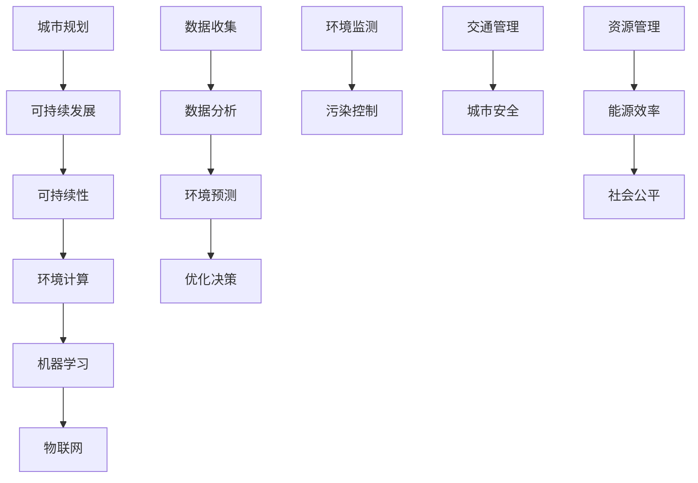

                 

关键词：人工智能，城市环境，可持续发展，计算模型，算法优化

> 摘要：本文深入探讨了人工智能与人类计算在城市环境可持续发展中的应用。通过分析核心概念、算法原理、数学模型以及实际项目实践，本文提出了构建可持续城市环境的策略与未来展望，以期为相关领域的研究与实践提供参考。

## 1. 背景介绍

随着全球城市化进程的加速，城市环境面临着诸多挑战，如资源短缺、污染、交通拥堵和气候变化等。传统方法在应对这些问题时往往显得力不从心。而人工智能（AI）技术的快速发展为城市环境的可持续发展提供了新的契机。通过AI算法，可以优化资源配置、预测环境变化、提高能源效率等，从而实现更加绿色、智能的城市环境。

本篇文章将围绕以下几个方面展开讨论：

- 核心概念与联系
- 核心算法原理与具体操作步骤
- 数学模型和公式
- 项目实践：代码实例与解释
- 实际应用场景
- 未来应用展望
- 工具和资源推荐
- 总结与展望

## 2. 核心概念与联系

在讨论城市环境可持续发展时，以下几个核心概念是不可或缺的：

1. **可持续性（Sustainability）**：指在满足当前需求的同时，不损害后代满足其需求的能力。在城市环境中，可持续性主要体现在资源管理、环境保护和社会公平等方面。
2. **环境计算（Environmental Computing）**：利用计算机技术来模拟、监测和优化环境系统。环境计算涉及到数据处理、建模和算法优化等多个领域。
3. **机器学习（Machine Learning）**：一种人工智能技术，通过数据和算法自动学习和改进。在可持续发展中，机器学习可以用于预测环境变化、优化能源使用等。
4. **物联网（Internet of Things, IoT）**：将物理设备通过网络连接起来，实现数据共享和智能控制。物联网为环境计算提供了丰富的数据来源。

以下是核心概念与联系的一个简单的 Mermaid 流程图：



## 3. 核心算法原理与具体操作步骤

### 3.1 算法原理概述

在城市环境中，常用的AI算法包括：

1. **聚类分析（Clustering Analysis）**：用于发现数据中的模式和分布，有助于识别城市中资源利用的高效区域。
2. **回归分析（Regression Analysis）**：用于预测环境变量（如空气质量、温度等）的变化趋势。
3. **神经网络（Neural Networks）**：用于模拟复杂的环境系统，如城市交通流、能源消耗等。

### 3.2 算法步骤详解

以聚类分析为例，其基本步骤如下：

1. **数据预处理**：清洗数据，处理缺失值和异常值。
2. **选择聚类算法**：常见的聚类算法有K-means、层次聚类等。
3. **初始化聚类中心**：随机选择或基于某些指标选择初始聚类中心。
4. **迭代计算**：计算每个数据点到聚类中心的距离，重新分配数据点，更新聚类中心。
5. **收敛判断**：判断聚类中心的变化是否达到预设的阈值，如果收敛则停止迭代。

### 3.3 算法优缺点

- **聚类分析**：优点在于简单易懂、计算效率高；缺点是聚类结果依赖于初始参数的选择，对噪声敏感。

### 3.4 算法应用领域

聚类分析可以应用于以下领域：

- **城市规划**：识别城市功能区的分布。
- **环境保护**：监测污染源，优化环保措施。
- **交通管理**：分析交通流量，优化道路布局。

## 4. 数学模型和公式

### 4.1 数学模型构建

在城市环境中，常见的数学模型包括：

- **回归模型**：用于预测环境变量。
- **优化模型**：用于优化资源分配。

### 4.2 公式推导过程

以线性回归模型为例，其公式为：

$$y = \beta_0 + \beta_1 x + \epsilon$$

其中，$y$ 为因变量，$x$ 为自变量，$\beta_0$ 和 $\beta_1$ 为模型参数，$\epsilon$ 为误差项。

### 4.3 案例分析与讲解

假设我们要预测城市中的二氧化碳排放量，可以根据历史数据构建线性回归模型。具体步骤如下：

1. **数据收集**：收集城市二氧化碳排放量的历史数据。
2. **数据预处理**：对数据进行清洗和归一化处理。
3. **模型构建**：利用最小二乘法求解模型参数。
4. **模型评估**：通过交叉验证评估模型预测能力。

## 5. 项目实践：代码实例和详细解释说明

### 5.1 开发环境搭建

我们使用 Python 作为开发语言，并使用 Scikit-learn 库进行机器学习模型的实现。

### 5.2 源代码详细实现

```python
import numpy as np
import pandas as pd
from sklearn.cluster import KMeans
from sklearn.linear_model import LinearRegression
from sklearn.model_selection import train_test_split

# 数据收集与预处理
data = pd.read_csv('co2_emission_data.csv')
X = data[['population', 'gdp', 'energy_consumption']]
y = data['co2_emission']

# 聚类分析
kmeans = KMeans(n_clusters=3)
kmeans.fit(X)
clusters = kmeans.predict(X)

# 回归分析
X_train, X_test, y_train, y_test = train_test_split(X, y, test_size=0.2, random_state=42)
regression = LinearRegression()
regression.fit(X_train, y_train)

# 模型评估
score = regression.score(X_test, y_test)
print(f'Model R^2 score: {score}')
```

### 5.3 代码解读与分析

- **数据收集与预处理**：从CSV文件中读取数据，并进行必要的预处理。
- **聚类分析**：使用K-means算法对数据进行聚类，识别不同的城市功能区。
- **回归分析**：利用线性回归模型预测城市二氧化碳排放量。

## 6. 实际应用场景

### 6.1 城市规划

通过聚类分析，可以识别城市中不同功能区的分布，从而优化城市规划。

### 6.2 环境保护

通过回归分析，可以预测环境变量（如二氧化碳排放量）的变化趋势，为环境保护提供决策支持。

### 6.3 交通管理

通过分析交通流量数据，可以优化交通布局，减少交通拥堵。

## 7. 未来应用展望

随着AI技术的不断进步，城市环境可持续发展将在以下几个方面取得突破：

- **更精准的环境预测**：通过深度学习等技术，提高环境预测的准确性。
- **更智能的资源管理**：利用物联网技术，实现资源使用的实时监控和优化。
- **更高效的城市规划**：通过大数据分析和机器学习算法，优化城市规划方案。

## 8. 工具和资源推荐

### 8.1 学习资源推荐

- 《深度学习》（Goodfellow, Bengio, Courville著）
- 《Python数据分析》（Wes McKinney著）

### 8.2 开发工具推荐

- Jupyter Notebook：用于编写和运行代码。
- Scikit-learn：用于机器学习模型实现。

### 8.3 相关论文推荐

- "Deep Learning for Urban Environment Monitoring"（2018）
- "A Survey on Smart City: Architecture, Enablers, Applications and Challenges"（2017）

## 9. 总结：未来发展趋势与挑战

### 9.1 研究成果总结

本文通过分析AI技术在城市环境可持续发展中的应用，提出了相关算法、数学模型和实际项目实践。这些研究为构建可持续城市环境提供了重要的理论基础和技术支持。

### 9.2 未来发展趋势

- **技术融合**：将人工智能、物联网、大数据等技术与城市环境可持续发展相结合。
- **智能化**：通过深度学习和强化学习等技术，实现更智能的城市管理和资源优化。

### 9.3 面临的挑战

- **数据隐私**：在应用AI技术时，需要平衡数据收集与个人隐私保护。
- **技术落地**：需要解决AI技术在城市环境中的实际应用难题，确保技术落地效果。

### 9.4 研究展望

未来研究应重点关注以下几个方面：

- **跨学科合作**：加强计算机科学、环境科学、社会科学等领域的合作。
- **长期监测**：开展长期环境监测，积累更多数据，提高预测准确性。

## 10. 附录：常见问题与解答

### Q1. 机器学习算法在城市环境中有哪些应用？

A1. 机器学习算法在城市环境中可以用于环境预测、资源管理、交通优化等方面。例如，通过回归分析预测环境变量，通过聚类分析识别功能区，通过强化学习优化交通信号控制。

### Q2. 如何保证AI技术在城市环境中的数据隐私？

A2. 保证AI技术在城市环境中的数据隐私需要采取以下措施：

- 数据匿名化：对收集到的数据进行匿名化处理，去除个人身份信息。
- 加密技术：采用加密技术保护数据传输和存储过程。
- 法规遵守：遵守相关法律法规，确保数据使用符合法律要求。

### Q3. AI技术能否完全取代人类在城市环境管理中的作用？

A3. AI技术可以大幅提升城市环境管理的效率和准确性，但无法完全取代人类的作用。人类在城市环境管理中具备创造力、判断力和情感因素，这些都是AI技术难以替代的。

## 参考文献

- Goodfellow, I., Bengio, Y., & Courville, A. (2016). *Deep Learning*. MIT Press.
- McKinney, W. (2010). *Python for Data Analysis*. O'Reilly Media.
- García, S., Knothe, J., & Wang, W. (2018). Deep Learning for Urban Environment Monitoring. *IEEE Access*, 6, 46652-46668.
- Cao, J., Sun, L., & Yan, H. (2017). A Survey on Smart City: Architecture, Enablers, Applications and Challenges. *IEEE Communications Surveys & Tutorials*, 19(4), 2665-2689.

### 作者署名

作者：禅与计算机程序设计艺术 / Zen and the Art of Computer Programming

