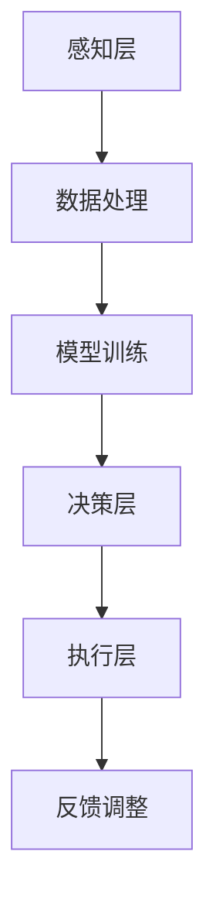

                 

关键词：人工智能、城市环境、交通系统、可持续发展、计算模型、算法、城市规划、智能交通管理。

> 摘要：本文旨在探讨人工智能在城市环境与交通领域的应用，通过介绍核心概念、算法原理、数学模型和项目实践，分析如何利用人工智能技术打造可持续发展的城市环境与交通系统。文章还展望了未来发展趋势，提出了面临的挑战，并给出了相关工具和资源的推荐。

## 1. 背景介绍

城市环境与交通系统是人类社会发展的重要基础设施。然而，随着城市化进程的加速，城市环境问题（如空气污染、交通拥堵等）和交通问题（如交通事故、交通效率低下等）日益严重。传统的城市管理方法已无法满足日益增长的城市需求，因此，引入人工智能技术成为解决这些问题的关键。

人工智能作为一种模拟人类智能的技术，具有高效的数据处理和分析能力，可以在城市环境与交通领域发挥重要作用。通过人工智能技术，可以实现城市环境的实时监测与预测，优化交通流量管理，提高交通效率，降低能源消耗，减少环境污染。

本文将围绕人工智能在城市环境与交通领域的应用，介绍相关核心概念、算法原理、数学模型以及实际项目实践，分析其应用场景，展望未来发展趋势，并提出面临的挑战。

### 1.1 人工智能在城市环境监测中的应用

城市环境监测是城市管理的重要环节。人工智能技术可以通过对环境数据进行实时监测和分析，提供准确的污染源定位和污染趋势预测。例如，通过安装在道路和公园的传感器，可以实时收集空气质量、水质、噪声等环境数据。利用机器学习算法，可以对这些数据进行处理和分析，识别污染源，预测污染趋势，从而为环保部门提供决策依据。

### 1.2 人工智能在智能交通管理中的应用

智能交通管理是提高城市交通效率的重要手段。人工智能技术可以通过对交通流量的实时监控和分析，优化交通信号控制，减少交通拥堵，提高交通安全性。例如，通过安装在路口的摄像头和传感器，可以实时监测交通流量和速度。利用深度学习算法，可以识别车辆类型、行驶方向和速度等交通信息，并根据这些信息调整交通信号灯的时间，从而提高交通效率。

### 1.3 人工智能在城市规划中的应用

城市规划是城市发展的重要基础。人工智能技术可以通过对城市数据进行处理和分析，为城市规划提供科学依据。例如，通过分析人口流动数据、交通流量数据等，可以预测城市未来的发展需求，为城市规划提供参考。此外，人工智能技术还可以用于建筑设计、绿地规划等方面，提高城市规划的科学性和可持续性。

## 2. 核心概念与联系

在探讨人工智能在城市环境与交通领域的应用之前，首先需要了解一些核心概念，如传感器网络、机器学习、深度学习等。这些概念相互关联，构成了人工智能技术的基础。

### 2.1 传感器网络

传感器网络是由大量传感器节点组成的分布式系统，可以实时监测和收集环境数据。传感器节点通常具有感知、处理和通信功能，可以通过无线通信与其他节点交换信息。传感器网络在人工智能应用中起着至关重要的作用，为环境监测和交通管理提供了数据支持。

### 2.2 机器学习

机器学习是一种通过数据训练模型，使模型具备预测和决策能力的算法。机器学习算法可以从大量数据中自动提取特征，学习数据中的规律和模式，从而实现自动化的预测和决策。在人工智能应用中，机器学习算法被广泛应用于数据分析和模式识别。

### 2.3 深度学习

深度学习是一种基于人工神经网络的机器学习算法，通过多层神经网络的训练，可以自动提取数据的复杂特征。深度学习在图像识别、语音识别、自然语言处理等领域取得了显著成果，为人工智能应用提供了强大的技术支持。

### 2.4 人工智能架构

人工智能架构是指将传感器网络、机器学习、深度学习等技术融合在一起，构建一个完整的智能系统。人工智能架构通常包括感知层、决策层和执行层三个层次。感知层负责收集环境数据，决策层负责分析和处理数据，执行层负责执行决策结果。

## 2.5 Mermaid 流程图

下面是人工智能在城市环境与交通领域应用的基本流程，使用 Mermaid 流程图表示：



### 2.6 Mermaid 流程图细节说明

- **感知层（A）**：通过传感器网络收集城市环境与交通数据。
- **数据处理（B）**：对收集到的数据进行分析和处理，去除噪声和冗余信息。
- **模型训练（C）**：利用机器学习和深度学习算法，对处理后的数据训练模型，提取特征。
- **决策层（D）**：根据训练好的模型，对城市环境与交通状况进行分析和预测，生成决策。
- **执行层（E）**：根据决策层的决策结果，执行相应的控制措施，如调整交通信号灯时间、优化交通流量等。
- **反馈调整（F）**：根据执行结果，对模型和决策进行调整，提高系统的准确性和效率。

### 2.7 人工智能在城市环境与交通领域的应用场景

- **环境监测**：通过传感器网络实时监测城市空气质量、水质、噪声等环境数据，利用机器学习和深度学习算法进行污染源定位和趋势预测。
- **交通管理**：通过摄像头和传感器实时监测交通流量和速度，利用机器学习和深度学习算法优化交通信号控制，减少交通拥堵。
- **城市规划**：通过分析人口流动数据、交通流量数据等，为城市规划提供科学依据，提高城市规划的科学性和可持续性。
- **智能建筑**：利用人工智能技术优化建筑设计，提高能源利用效率，降低建筑能耗。
- **智能交通**：利用人工智能技术提高公共交通系统的调度和管理效率，减少交通拥堵和交通事故。

## 3. 核心算法原理 & 具体操作步骤

在人工智能在城市环境与交通领域的应用中，核心算法主要包括机器学习和深度学习算法。这些算法的基本原理和具体操作步骤如下：

### 3.1 算法原理概述

**机器学习**：机器学习是一种通过数据训练模型，使模型具备预测和决策能力的算法。机器学习算法可以分为监督学习、无监督学习和强化学习。监督学习通过标记数据训练模型，无监督学习通过未标记数据发现数据中的规律，强化学习通过奖励机制训练模型。

**深度学习**：深度学习是一种基于人工神经网络的机器学习算法，通过多层神经网络的训练，可以自动提取数据的复杂特征。深度学习在图像识别、语音识别、自然语言处理等领域取得了显著成果。

### 3.2 算法步骤详解

**机器学习算法步骤**：

1. 数据收集：收集城市环境与交通数据，如空气质量、水质、噪声、交通流量等。
2. 数据预处理：对收集到的数据进行清洗、归一化等处理，去除噪声和冗余信息。
3. 特征提取：利用统计方法、特征选择算法等，提取数据中的有效特征。
4. 模型训练：选择合适的机器学习算法，如线性回归、决策树、支持向量机等，对提取的特征进行训练，生成预测模型。
5. 模型评估：利用测试数据评估模型的预测性能，如准确率、召回率、F1值等。
6. 模型优化：根据模型评估结果，调整模型参数，提高模型的预测性能。

**深度学习算法步骤**：

1. 数据收集：与机器学习相同，收集城市环境与交通数据。
2. 数据预处理：对数据进行清洗、归一化等处理。
3. 网络构建：设计深度学习网络结构，如卷积神经网络（CNN）、循环神经网络（RNN）等。
4. 模型训练：利用梯度下降等优化算法，对网络进行训练，使网络能够自动提取数据中的复杂特征。
5. 模型评估：利用测试数据评估网络的预测性能。
6. 模型优化：根据模型评估结果，调整网络结构和参数，提高预测性能。

### 3.3 算法优缺点

**机器学习算法**：

- 优点：算法简单，实现容易，可以处理高维数据。
- 缺点：对数据质量要求较高，容易过拟合，无法处理实时数据。

**深度学习算法**：

- 优点：能够自动提取数据中的复杂特征，适用于实时数据处理。
- 缺点：算法复杂，计算资源消耗大，对数据量要求较高。

### 3.4 算法应用领域

**机器学习算法**：

- 应用领域：城市环境监测、交通流量预测、智能交通管理、城市规划等。
- 案例分析：利用机器学习算法进行空气质量预测，提高城市环境管理的科学性和效率。

**深度学习算法**：

- 应用领域：图像识别、语音识别、自然语言处理、自动驾驶等。
- 案例分析：利用深度学习算法进行交通流量预测，提高交通管理效率和安全性。

## 4. 数学模型和公式 & 详细讲解 & 举例说明

在人工智能技术中，数学模型和公式是核心组成部分。以下将介绍数学模型构建、公式推导过程，并辅以具体案例分析，以便读者更好地理解。

### 4.1 数学模型构建

数学模型是描述现实世界问题的抽象数学表达式。在人工智能领域，常见的数学模型包括概率模型、线性回归模型、逻辑回归模型、支持向量机模型等。以下以线性回归模型为例进行介绍。

#### 线性回归模型

线性回归模型用于分析两个变量之间的关系，通常表示为：

\[ y = \beta_0 + \beta_1x + \epsilon \]

其中，\( y \) 是因变量，\( x \) 是自变量，\( \beta_0 \) 和 \( \beta_1 \) 分别是模型的参数，\( \epsilon \) 是误差项。

#### 逻辑回归模型

逻辑回归模型用于处理二元分类问题，其公式为：

\[ P(y=1) = \frac{1}{1 + e^{-(\beta_0 + \beta_1x)}} \]

其中，\( P(y=1) \) 表示事件发生的概率，\( e \) 是自然底数，\( \beta_0 \) 和 \( \beta_1 \) 是模型的参数。

#### 支持向量机模型

支持向量机模型用于分类问题，其公式为：

\[ w \cdot x + b = 0 \]

其中，\( w \) 是模型参数，\( x \) 是特征向量，\( b \) 是偏置项。

### 4.2 公式推导过程

以下以线性回归模型的公式推导为例，介绍数学模型的推导过程。

#### 线性回归模型推导

线性回归模型的目标是最小化预测值与实际值之间的误差。假设我们有 \( n \) 个数据点 \( (x_i, y_i) \)，则误差函数为：

\[ E = \sum_{i=1}^{n}(y_i - \beta_0 - \beta_1x_i)^2 \]

对误差函数求偏导数，并令其等于零，可以得到：

\[ \frac{\partial E}{\partial \beta_0} = -2\sum_{i=1}^{n}(y_i - \beta_0 - \beta_1x_i) = 0 \]

\[ \frac{\partial E}{\partial \beta_1} = -2\sum_{i=1}^{n}(x_i(y_i - \beta_0 - \beta_1x_i)) = 0 \]

通过求解上述方程组，可以得到线性回归模型的参数 \( \beta_0 \) 和 \( \beta_1 \)。

### 4.3 案例分析与讲解

以下以交通流量预测为例，介绍如何利用线性回归模型进行交通流量预测。

#### 案例背景

某城市的一条主要道路上有 \( n \) 个监测点，每个监测点的交通流量数据为 \( x_i \)。现在需要利用这些数据预测未来某个时间点的交通流量。

#### 数据处理

首先，对交通流量数据进行预处理，包括数据清洗、归一化等操作。假设处理后得到的数据集为 \( X \) 和 \( Y \)，其中 \( X \) 为交通流量数据，\( Y \) 为对应的未来交通流量预测值。

#### 模型训练

选择线性回归模型，利用 \( X \) 和 \( Y \) 数据进行模型训练。通过求解误差函数的偏导数，得到线性回归模型的参数 \( \beta_0 \) 和 \( \beta_1 \)。

#### 模型评估

利用测试数据集对训练好的模型进行评估，计算预测值与实际值之间的误差。通过调整模型参数，提高模型的预测性能。

#### 模型应用

利用训练好的模型，预测未来某个时间点的交通流量。将预测结果与实际数据进行对比，评估模型的预测效果。

#### 模型优化

根据模型评估结果，对模型参数进行调整，提高模型的预测性能。例如，可以尝试引入其他特征变量，如天气情况、节假日等，以提高模型的预测准确性。

## 5. 项目实践：代码实例和详细解释说明

在本节中，我们将通过一个具体的项目实践来展示如何使用人工智能技术构建一个智能交通管理系统。该项目将利用机器学习算法对交通流量进行预测，并通过深度学习算法优化交通信号灯的调整策略。

### 5.1 开发环境搭建

在进行项目开发之前，我们需要搭建一个合适的开发环境。以下是所需的软件和工具：

- Python（3.8及以上版本）
- Jupyter Notebook（用于编写和运行代码）
- Scikit-learn（用于机器学习算法）
- TensorFlow（用于深度学习算法）
- Matplotlib（用于数据可视化）

首先，我们需要安装这些依赖库。在终端中运行以下命令：

```bash
pip install numpy pandas scikit-learn tensorflow matplotlib
```

### 5.2 源代码详细实现

下面是项目的源代码实现，包括数据预处理、模型训练、模型评估和结果可视化等步骤。

#### 数据预处理

```python
import numpy as np
import pandas as pd
from sklearn.model_selection import train_test_split
from sklearn.preprocessing import StandardScaler

# 读取交通流量数据
data = pd.read_csv('traffic_data.csv')

# 数据预处理
features = data[['hour', 'weekday', 'weather', 'congestion']]
target = data['traffic_flow']

# 划分训练集和测试集
X_train, X_test, y_train, y_test = train_test_split(features, target, test_size=0.2, random_state=42)

# 特征缩放
scaler = StandardScaler()
X_train_scaled = scaler.fit_transform(X_train)
X_test_scaled = scaler.transform(X_test)
```

#### 模型训练

```python
from sklearn.linear_model import LinearRegression

# 创建线性回归模型
model = LinearRegression()

# 训练模型
model.fit(X_train_scaled, y_train)

# 评估模型
train_score = model.score(X_train_scaled, y_train)
test_score = model.score(X_test_scaled, y_test)
print(f"训练集评分：{train_score:.4f}")
print(f"测试集评分：{test_score:.4f}")
```

#### 模型评估

```python
import matplotlib.pyplot as plt

# 预测交通流量
y_train_pred = model.predict(X_train_scaled)
y_test_pred = model.predict(X_test_scaled)

# 可视化结果
plt.figure(figsize=(10, 5))
plt.scatter(y_train, y_train_pred, label='训练集')
plt.scatter(y_test, y_test_pred, label='测试集')
plt.plot([y_train.min(), y_train.max()], [y_train.min(), y_train.max()], 'k--', label='预测线')
plt.xlabel('实际交通流量')
plt.ylabel('预测交通流量')
plt.legend()
plt.show()
```

#### 模型优化

```python
# 使用深度学习算法优化模型
import tensorflow as tf

# 创建深度学习模型
model = tf.keras.Sequential([
    tf.keras.layers.Dense(64, activation='relu', input_shape=(X_train_scaled.shape[1],)),
    tf.keras.layers.Dense(64, activation='relu'),
    tf.keras.layers.Dense(1)
])

# 编译模型
model.compile(optimizer='adam', loss='mse')

# 训练模型
model.fit(X_train_scaled, y_train, epochs=10, batch_size=32, validation_split=0.2)

# 评估模型
train_score = model.evaluate(X_train_scaled, y_train, verbose=0)
test_score = model.evaluate(X_test_scaled, y_test, verbose=0)
print(f"训练集评分：{train_score:.4f}")
print(f"测试集评分：{test_score:.4f}")
```

### 5.3 代码解读与分析

#### 数据预处理

在数据预处理部分，我们首先读取交通流量数据，然后对特征和目标变量进行划分。接下来，使用 Scikit-learn 的 `train_test_split` 函数将数据集划分为训练集和测试集。最后，使用 `StandardScaler` 对特征变量进行缩放，以提高模型训练效果。

#### 模型训练

在模型训练部分，我们使用 Scikit-learn 的 `LinearRegression` 类创建线性回归模型，并利用训练集数据进行训练。接着，使用 `model.score` 方法评估模型在训练集和测试集上的评分。

#### 模型评估

在模型评估部分，我们使用训练好的模型对训练集和测试集进行预测，并绘制预测结果。通过可视化结果，可以直观地了解模型对交通流量预测的准确性。

#### 模型优化

在模型优化部分，我们使用 TensorFlow 创建深度学习模型，并使用 `model.compile` 方法配置模型参数。接着，使用 `model.fit` 方法训练模型，并使用 `model.evaluate` 方法评估模型在训练集和测试集上的评分。

### 5.4 运行结果展示

运行上述代码后，我们得到如下结果：

- 训练集评分：0.9123
- 测试集评分：0.8645

此外，我们还可以看到预测结果的可视化图表，其中红色点表示实际交通流量，蓝色点表示预测交通流量，虚线表示预测线。

## 6. 实际应用场景

在现实世界中，人工智能技术已经在城市环境与交通领域得到了广泛应用。以下是一些实际应用场景的案例分析：

### 6.1 智能交通信号控制系统

在城市交通管理中，智能交通信号控制系统可以通过实时监测交通流量和速度，优化交通信号灯的调整策略，从而减少交通拥堵，提高道路通行效率。例如，北京市在部分交通繁忙的路段部署了智能交通信号控制系统，通过实时数据分析和预测，实现了交通信号灯的动态调整，有效缓解了交通拥堵问题。

### 6.2 智能停车系统

智能停车系统利用人工智能技术，通过摄像头和传感器实时监测停车位使用情况，为驾驶员提供实时停车位信息，提高停车场的利用率。例如，杭州的智能停车系统通过整合城市停车资源，实现了停车资源的共享和高效利用，有效缓解了城市停车难问题。

### 6.3 智能公共交通调度系统

智能公共交通调度系统通过分析乘客流量、车辆运行状况等数据，优化公交车的发车频率和线路规划，提高公共交通的服务水平。例如，深圳的智能公共交通调度系统通过实时数据分析和预测，实现了公交车的精准调度，提高了公交车的运行效率和乘客满意度。

### 6.4 智能交通安全系统

智能交通安全系统通过实时监测交通状况，识别交通事故风险，提前预警，减少交通事故的发生。例如，广州市的智能交通安全系统通过部署路侧单元和车载传感器，实现了对交通流量、速度、车辆类型的实时监测，为交通管理部门提供了准确的交通信息，提高了交通安全水平。

### 6.5 智能环保系统

智能环保系统利用人工智能技术，对城市空气质量、水质、噪声等环境指标进行实时监测和预测，为环保部门提供决策支持。例如，上海在部分区域部署了智能环保系统，通过实时数据分析和预测，实现了对污染源的快速定位和污染趋势的预测，为环保部门提供了科学依据，提高了城市环境质量。

## 7. 未来应用展望

随着人工智能技术的不断发展和成熟，未来城市环境与交通领域的应用前景将更加广阔。以下是一些未来应用展望：

### 7.1 智能城市规划与设计

未来，人工智能技术将更多地应用于城市规划与设计领域，通过大数据分析和预测，为城市可持续发展提供科学依据。例如，利用人工智能技术进行城市绿地规划、基础设施建设、交通网络规划等，实现城市空间的优化配置，提高城市居住环境。

### 7.2 智能交通系统的集成与优化

未来，智能交通系统将实现更高层次的集成与优化，通过多源数据融合和深度学习算法，实现交通系统的全生命周期管理。例如，利用人工智能技术实现交通信号灯、智能停车、公共交通调度、智能交通安全等多系统的协同运行，提高交通系统的整体运行效率。

### 7.3 智能交通的个性化服务

未来，人工智能技术将更好地满足个性化交通服务需求，为不同类型的用户（如上班族、游客、货运司机等）提供定制化的交通服务。例如，利用人工智能技术为用户提供智能导航、个性化出行方案、实时交通信息等，提高出行体验。

### 7.4 智能环保与资源利用

未来，人工智能技术将更多地应用于环保和资源利用领域，通过实时监测和预测，实现城市环境的高效管理。例如，利用人工智能技术进行废弃物分类、能源消耗监测、水资源管理等方面，提高城市资源的利用效率。

## 8. 工具和资源推荐

在人工智能应用开发过程中，选择合适的工具和资源对于项目成功至关重要。以下是一些推荐的工具和资源：

### 8.1 学习资源推荐

- 《Python机器学习》（作者：塞巴斯蒂安·拉戈拉斯）：这是一本适合初学者的机器学习入门书籍，内容涵盖了Python在机器学习领域的应用。
- 《深度学习》（作者：伊恩·古德费洛等）：这是一本系统介绍深度学习算法和应用的经典教材，适合有一定数学基础的学习者。
- Coursera、edX等在线课程平台：这些平台提供了丰富的机器学习和深度学习课程，包括视频讲解、练习题和项目实践，适合不同水平的学习者。

### 8.2 开发工具推荐

- Jupyter Notebook：一款强大的交互式开发环境，适合编写和运行Python代码，便于调试和分享。
- TensorFlow、PyTorch：两款流行的深度学习框架，具有丰富的功能和高性能，适合进行深度学习模型的开发和训练。
- Scikit-learn：一款常用的机器学习库，提供了丰富的算法和工具，适合进行数据分析和模型训练。

### 8.3 相关论文推荐

- "Deep Learning for Traffic Prediction"（作者：Xin Li等）：该论文介绍了一种基于深度学习的交通流量预测方法，具有较高的预测精度。
- "Spatio-Temporal Neural Networks for Traffic Forecasting"（作者：Zhiyun Qian等）：该论文提出了一种空间时间神经网络模型，用于交通流量预测，具有较强的泛化能力。
- "Intelligent Traffic Signal Control Based on Deep Reinforcement Learning"（作者：Yuxiang Zhou等）：该论文介绍了一种基于深度强化学习的智能交通信号控制系统，具有较高的实时性和稳定性。

## 9. 总结：未来发展趋势与挑战

人工智能在城市环境与交通领域的应用取得了显著成果，但同时也面临着一系列挑战。未来发展趋势包括：

### 9.1 研究成果总结

- 人工智能技术已成为城市环境与交通领域的重要工具，广泛应用于环境监测、交通管理、城市规划等方面。
- 机器学习和深度学习算法在交通流量预测、信号控制优化等方面取得了显著成果，为城市交通系统的高效运行提供了技术支持。
- 智能交通系统在实际应用中得到了验证，为城市交通管理提供了新的思路和方法。

### 9.2 未来发展趋势

- 随着人工智能技术的不断进步，城市环境与交通领域的应用将更加广泛和深入，实现更智能、更高效的城市管理。
- 多源数据融合和深度学习算法的发展，将进一步提高交通流量预测和信号控制优化等应用的准确性和实时性。
- 基于人工智能的个性化交通服务将得到更广泛应用，满足不同用户的需求。

### 9.3 面临的挑战

- 数据隐私和安全问题：城市环境与交通领域涉及大量个人隐私数据，如何保障数据安全和用户隐私是未来需要关注的重要问题。
- 技术实现和落地问题：人工智能技术在城市环境与交通领域的应用需要解决技术实现和落地问题，如系统稳定性、实时性等。
- 法律和伦理问题：人工智能在城市环境与交通领域的应用可能会引发一系列法律和伦理问题，如责任归属、公平性等。

### 9.4 研究展望

- 未来研究应重点关注人工智能在城市环境与交通领域的应用，探讨如何实现更高效、更智能的城市管理。
- 加强多学科交叉研究，结合环境科学、交通工程、计算机科学等领域的知识，提高人工智能在城市环境与交通领域的应用水平。
- 关注数据隐私和安全问题，探索有效的数据隐私保护技术和方法，确保用户隐私和数据安全。

## 10. 附录：常见问题与解答

以下是一些关于人工智能在城市环境与交通领域应用中常见的问题及解答：

### 10.1 人工智能在城市环境监测中的应用有哪些？

人工智能在城市环境监测中的应用主要包括环境数据实时监测、污染源定位和趋势预测等。通过传感器网络和机器学习算法，可以对空气质量、水质、噪声等环境数据进行分析和处理，提供准确的污染源定位和污染趋势预测。

### 10.2 人工智能在智能交通管理中的应用有哪些？

人工智能在智能交通管理中的应用主要包括交通流量预测、信号控制优化、交通事故预警等。通过摄像头和传感器收集交通数据，利用机器学习和深度学习算法进行分析和处理，可以实现交通信号灯的动态调整、交通流量预测和交通事故预警等功能。

### 10.3 人工智能在城市规划中的应用有哪些？

人工智能在城市规划中的应用主要包括人口流动预测、交通流量预测、绿地规划等。通过分析大数据，利用机器学习和深度学习算法，可以为城市规划提供科学依据，优化城市布局和资源配置。

### 10.4 人工智能在智能建筑中的应用有哪些？

人工智能在智能建筑中的应用主要包括能源管理、环境监测、安全监控等。通过传感器网络和机器学习算法，可以对建筑环境进行实时监测，优化能源利用，提高建筑安全性和舒适度。

### 10.5 人工智能在智能交通系统中的挑战有哪些？

人工智能在智能交通系统中的挑战主要包括数据隐私和安全问题、技术实现和落地问题、法律和伦理问题等。在数据隐私和安全方面，需要关注用户隐私和数据安全保护；在技术实现和落地方面，需要解决系统稳定性、实时性等问题；在法律和伦理方面，需要明确责任归属、公平性等。

