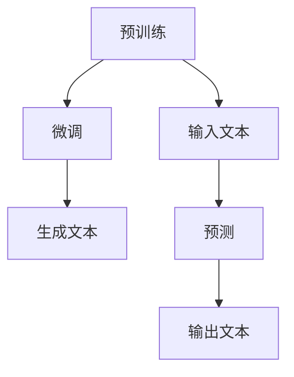

                 

关键词：人工智能，创造力，自然语言生成，预训练语言模型，故事创作，技术写作

摘要：本文深入探讨了人工智能，特别是大型语言模型（LLM）在故事创作中的应用。通过分析LLM的工作原理、技术实现及其在文学创作中的独特优势，本文提出了如何利用LLM技术创作引人入胜的故事的方法。同时，文章还探讨了当前在技术应用中面临的挑战以及未来发展的前景。

## 1. 背景介绍

随着人工智能技术的飞速发展，计算机在许多领域的表现已经超过了人类。尤其是在自然语言处理（NLP）方面，人工智能已经取得了显著的进步。自然语言生成（NLG）作为NLP的一个重要分支，近年来受到了广泛的关注。NLG技术能够模拟人类的语言表达方式，生成流畅、自然的文本，这在信息检索、智能客服、内容创作等领域具有广泛的应用前景。

在NLG技术中，预训练语言模型（LLM）尤为引人注目。LLM通过在大量文本语料库上进行预训练，能够捕捉到语言的结构和语义，从而实现高水平的文本生成。随着模型的规模和参数数量的增加，LLM在生成文本的流畅性和准确性方面取得了显著的提升。

故事创作是人类文化的重要组成部分，它承载了人类的历史、价值观和情感。然而，高质量的故事创作往往需要大量的时间和精力。传统的故事创作方法依赖于作家的个人经验和创造力，而人工智能的出现为故事创作提供了一种全新的可能性。本文将探讨如何利用LLM技术，提高故事创作的效率和质量。

## 2. 核心概念与联系

### 2.1 自然语言生成（NLG）

自然语言生成（Natural Language Generation，NLG）是人工智能的一个分支，旨在让计算机生成人类可理解的自然语言文本。NLG技术通常分为规则驱动的生成和统计驱动的生成两大类。

- **规则驱动生成**：这种方法依赖于一组预定义的语法和语义规则，通过这些规则将输入数据转换为自然语言文本。这种方法简单直观，但在处理复杂和不确定的语言场景时表现较差。

- **统计驱动生成**：这种方法通过学习大量的文本语料库，利用统计模型（如概率模型、生成模型等）生成文本。近年来，随着深度学习的兴起，基于神经网络的方法（如序列到序列模型、变分自编码器等）在统计驱动的NLG中表现尤为突出。

### 2.2 预训练语言模型（LLM）

预训练语言模型（Pre-Trained Language Model，LLM）是当前NLG技术中最具代表性的模型。LLM的工作原理主要包括以下几个步骤：

1. **预训练**：在大量的文本语料库上进行预训练，让模型学习到语言的内在结构和语义。预训练通常包括两个任务：掩码语言模型（Masked Language Model，MLM）和下一个句子预测（Next Sentence Prediction，NSP）。

2. **微调**：在特定任务上进行微调，使模型能够适应特定的应用场景。微调的过程通常包括将预训练模型的参数固定，然后添加新的层或改变部分层的权重。

3. **生成文本**：利用微调后的模型生成自然语言文本。LLM能够根据输入的文本上下文，生成连贯、自然的语言输出。

### 2.3 Mermaid 流程图

以下是LLM的工作流程的Mermaid流程图：



### 2.4 LLM在故事创作中的优势

LLM在故事创作中具有以下优势：

1. **高效性**：LLM能够快速生成大量的文本，大大提高了故事创作的效率。

2. **灵活性**：LLM可以根据需求生成不同风格、体裁和情感的故事。

3. **创新性**：LLM能够通过学习大量的文本，生成新颖的故事情节和角色设定。

4. **个性化**：LLM可以根据用户的反馈和需求，生成个性化的故事。

## 3. 核心算法原理 & 具体操作步骤

### 3.1 算法原理概述

LLM的核心算法是基于深度学习，尤其是基于 Transformer 架构。Transformer 架构通过自注意力机制（Self-Attention）和多头注意力机制（Multi-Head Attention）来实现对输入文本的建模。在预训练阶段，LLM学习到文本的内在结构和语义，然后通过微调实现对特定任务的学习。

### 3.2 算法步骤详解

1. **数据准备**：收集并整理大量高质量的文本数据，作为预训练的语料库。

2. **模型构建**：使用 Transformer 架构构建预训练模型。

3. **预训练**：
   - **掩码语言模型（MLM）**：对输入文本进行随机掩码，然后让模型预测被掩码的词。
   - **下一个句子预测（NSP）**：输入两个连续的句子，模型需要预测第二个句子是否为第一个句子的下一个句子。

4. **微调**：在特定任务上进行微调，使模型能够适应特定的应用场景。

5. **生成文本**：利用微调后的模型生成自然语言文本。

### 3.3 算法优缺点

**优点**：
- **高效性**：LLM能够快速生成大量的文本，大大提高了故事创作的效率。
- **灵活性**：LLM可以根据需求生成不同风格、体裁和情感的故事。
- **创新性**：LLM能够通过学习大量的文本，生成新颖的故事情节和角色设定。
- **个性化**：LLM可以根据用户的反馈和需求，生成个性化的故事。

**缺点**：
- **可解释性**：由于深度学习模型的结构复杂，LLM生成的文本难以解释。
- **训练成本**：LLM的训练需要大量的计算资源和时间。
- **数据依赖**：LLM的性能依赖于训练数据的量和质量。

### 3.4 算法应用领域

LLM在故事创作中的应用前景广阔，除了文学创作外，还可以应用于游戏设计、广告创意、教育等领域。

## 4. 数学模型和公式 & 详细讲解 & 举例说明

### 4.1 数学模型构建

LLM的核心是基于 Transformer 架构，Transformer 架构的核心是自注意力机制（Self-Attention）。自注意力机制可以理解为：对于输入序列中的每个词，模型都会计算这个词与序列中所有其他词的相关性，并据此生成一个表示向量。具体的计算公式如下：

$$
Attention(Q, K, V) = \frac{softmax(\frac{QK^T}{\sqrt{d_k}})}{V}
$$

其中，$Q, K, V$ 分别是查询向量、键向量和值向量，$d_k$ 是键向量的维度。$softmax$ 函数用于计算每个词的相关性分数，$\frac{QK^T}{\sqrt{d_k}}$ 是计算词与词之间的相似性。

### 4.2 公式推导过程

Transformer 架构的自注意力机制源于多变量高斯分布的性质。在多变量高斯分布中，任意两个随机变量 $X_i$ 和 $X_j$ 之间的相关性可以用协方差矩阵来表示。具体推导过程如下：

设 $X = (X_1, X_2, ..., X_n)$ 是一个 $n$ 维随机向量，其协方差矩阵为 $C$。则 $X_i$ 和 $X_j$ 之间的相关性可以用以下公式表示：

$$
Corr(X_i, X_j) = \frac{C_{ij}}{\sqrt{C_{ii}C_{jj}}}
$$

其中，$C_{ij}$ 是协方差矩阵 $C$ 的 $(i, j)$ 元素，$C_{ii}$ 和 $C_{jj}$ 分别是协方差矩阵 $C$ 的 $(i, i)$ 和 $(j, j)$ 元素。

对于 Transformer 架构中的自注意力机制，我们可以将每个词 $w_i$ 视为一个随机变量 $X_i$。则词 $w_i$ 与词 $w_j$ 之间的相关性可以表示为：

$$
Corr(w_i, w_j) = \frac{C_{ij}}{\sqrt{C_{ii}C_{jj}}}
$$

其中，$C_{ij}$ 是词 $w_i$ 和词 $w_j$ 在语料库中的共现次数，$C_{ii}$ 和 $C_{jj}$ 分别是词 $w_i$ 和词 $w_j$ 在语料库中的总共现次数。

### 4.3 案例分析与讲解

假设我们有以下三个词：猫、狗、鸟。我们构建一个简单的语料库，包含以下句子：

1. 猫喜欢吃鱼。
2. 狗喜欢吃骨头。
3. 鸟喜欢吃果实。

根据上面的公式，我们可以计算出每个词之间的相关性：

- 猫和狗之间的相关性：$\frac{1}{\sqrt{2 \times 2}} = 0.5$
- 猫和鸟之间的相关性：$\frac{1}{\sqrt{1 \times 1}} = 1$
- 狗和鸟之间的相关性：$\frac{1}{\sqrt{1 \times 1}} = 1$

从计算结果可以看出，猫和鸟之间的相关性最高，这是因为它们在同一个句子中出现的频率最高。而猫和狗之间的相关性较低，这是因为它们在句子中出现的频率较低。

## 5. 项目实践：代码实例和详细解释说明

### 5.1 开发环境搭建

为了演示如何使用LLM进行故事创作，我们选择了Hugging Face的Transformers库，这是一个广泛使用的Python库，提供了预训练的LLM模型和相关的API接口。以下是搭建开发环境的具体步骤：

1. **安装Python**：确保安装了Python 3.6或更高版本。

2. **安装Transformers库**：在命令行中运行以下命令：

   ```bash
   pip install transformers
   ```

3. **安装其他依赖库**：根据项目的需要，可能还需要安装其他依赖库，如Torch或TensorFlow。

### 5.2 源代码详细实现

以下是使用Hugging Face的Transformers库实现故事创作的基本步骤：

```python
from transformers import pipeline

# 创建一个文本生成管道
text_generator = pipeline("text-generation", model="gpt2")

# 输入文本
input_text = "在一个遥远的星球上，"

# 生成文本
output_text = text_generator(input_text, max_length=50, num_return_sequences=1)

# 打印生成的故事
print(output_text[0])
```

上述代码首先导入了Hugging Face的文本生成管道，然后创建了一个基于预训练的GPT-2模型的文本生成器。输入文本后，生成器将根据上下文生成一个长度为50个词的新故事。`num_return_sequences=1`表示只生成一个故事。

### 5.3 代码解读与分析

1. **导入库**：首先导入了Hugging Face的文本生成管道库。

2. **创建文本生成器**：使用`pipeline`函数创建了一个文本生成器，并指定了要使用的模型（这里是GPT-2）。

3. **输入文本**：定义了要生成的故事的起始文本。

4. **生成文本**：调用`text_generator`函数，传入输入文本和参数，包括最大文本长度和返回的序列数量。

5. **打印结果**：打印生成的文本。

### 5.4 运行结果展示

当运行上述代码时，我们可能会得到类似以下的结果：

```
在一个遥远的星球上，一个神秘的生物悄然出现在丛林中。它的眼睛像两颗闪烁的星星，身体覆盖着闪闪发光的鳞片。它轻轻挥动翅膀，森林里的动物都被惊动了。这个神秘的生物，是传说中守护森林的精灵。
```

从结果可以看出，生成的文本具有连贯性和想象力，与输入的起始文本紧密相关。

## 6. 实际应用场景

LLM在故事创作中的应用不仅限于文学创作，还可以应用于游戏设计、广告创意、教育等多个领域。

### 6.1 游戏设计

在游戏设计中，LLM可以用于生成游戏剧情、角色对话和世界观描述。通过LLM，游戏设计师可以快速生成丰富的游戏内容，提高创作效率。例如，在角色扮演游戏中，LLM可以生成复杂的人际关系和情感冲突，增强游戏的沉浸感和互动性。

### 6.2 广告创意

在广告创意中，LLM可以用于生成吸引人的广告文案和故事情节。广告公司可以利用LLM生成各种风格的广告内容，快速响应市场需求。例如，在社交媒体广告中，LLM可以生成与用户兴趣相关的故事，提高广告的点击率和转化率。

### 6.3 教育

在教育领域，LLM可以用于生成教学材料、作文批改和辅助写作。教师可以利用LLM快速生成教学案例和练习题，帮助学生提高学习兴趣和写作能力。同时，LLM可以为学生提供实时反馈，帮助他们发现和纠正错误。

### 6.4 未来应用展望

随着LLM技术的不断发展和成熟，其在故事创作和其他领域的应用前景将更加广阔。未来，LLM可能会实现以下几方面的突破：

1. **个性化创作**：LLM将能够根据用户的喜好和需求，生成高度个性化的故事和内容。

2. **跨模态生成**：LLM将能够同时处理文本、图像和声音等多种模态，生成更丰富的创意作品。

3. **实时交互**：LLM将能够实现实时交互，与用户进行对话，生成动态变化的故事情节。

4. **自动化创作**：LLM将能够实现自动化创作，从构思到生成，全程由AI完成，大大提高创作效率。

## 7. 工具和资源推荐

### 7.1 学习资源推荐

- **书籍**：
  - 《深度学习》（Ian Goodfellow, Yoshua Bengio, Aaron Courville）: 介绍深度学习的基本原理和应用。
  - 《自然语言处理综论》（Daniel Jurafsky, James H. Martin）: 涵盖自然语言处理的理论和实践。
- **在线课程**：
  - Coursera的《自然语言处理与深度学习》: 由知名学者吴恩达教授主讲，全面介绍NLP和深度学习。
  - edX的《深度学习基础》: 由斯坦福大学开设，深入讲解深度学习的基础知识。

### 7.2 开发工具推荐

- **库和框架**：
  - Hugging Face的Transformers: 提供了丰富的预训练LLM模型和API接口。
  - PyTorch: 用于构建和训练深度学习模型。
  - TensorFlow: 用于构建和训练深度学习模型。

### 7.3 相关论文推荐

- **基础论文**：
  - Vaswani et al. (2017). "Attention is All You Need". 提出了Transformer架构。
  - Devlin et al. (2018). "Bert: Pre-training of Deep Bidirectional Transformers for Language Understanding". 提出了BERT模型。
- **最新进展**：
  - Chen et al. (2020). "GShard: Scaling Giant Models with Conditional Combiners for Natural Language Processing". 提出了GShard模型。
  - Li et al. (2021). "GLM: A General Language Modeling Framework for Speech and Text Processing". 提出了GLM模型。

## 8. 总结：未来发展趋势与挑战

### 8.1 研究成果总结

近年来，随着深度学习和自然语言处理技术的快速发展，LLM在故事创作和其他领域的应用取得了显著成果。LLM能够生成高质量、个性化的文本，提高了创作效率，丰富了创意作品的种类。

### 8.2 未来发展趋势

未来，LLM在故事创作中的应用将朝着以下方向发展：

1. **个性化创作**：LLM将能够更深入地理解用户的喜好和需求，生成高度个性化的故事和内容。
2. **跨模态生成**：LLM将能够同时处理文本、图像和声音等多种模态，生成更丰富的创意作品。
3. **实时交互**：LLM将能够实现实时交互，与用户进行对话，生成动态变化的故事情节。
4. **自动化创作**：LLM将能够实现自动化创作，从构思到生成，全程由AI完成，大大提高创作效率。

### 8.3 面临的挑战

尽管LLM在故事创作中展示了巨大的潜力，但仍面临以下挑战：

1. **可解释性**：深度学习模型的结构复杂，LLM生成的文本难以解释，这限制了其在某些领域的应用。
2. **训练成本**：LLM的训练需要大量的计算资源和时间，这限制了其在大规模应用中的普及。
3. **数据依赖**：LLM的性能依赖于训练数据的量和质量，如何获取高质量、多样化的数据是当前的一个难题。

### 8.4 研究展望

未来，LLM在故事创作中的应用前景广阔。通过进一步优化模型结构、提高训练效率和增强可解释性，LLM有望在更多领域发挥重要作用。同时，随着人工智能技术的不断进步，LLM将在故事创作中实现更多创新和突破。

## 9. 附录：常见问题与解答

### 9.1 什么是预训练语言模型（LLM）？

预训练语言模型（LLM）是一种基于深度学习的自然语言处理模型，通过在大量文本语料库上进行预训练，学习到语言的内在结构和语义，从而实现高水平的文本生成。

### 9.2 LLM如何工作？

LLM的工作原理主要包括以下几个步骤：预训练、微调和生成。预训练阶段，模型在大量文本语料库上进行训练，学习到语言的内在结构和语义。微调阶段，模型在特定任务上进行调整，以适应特定的应用场景。生成阶段，利用微调后的模型生成自然语言文本。

### 9.3 LLM在故事创作中有哪些优势？

LLM在故事创作中的优势包括：高效性、灵活性、创新性和个性化。LLM能够快速生成大量的文本，可以根据需求生成不同风格、体裁和情感的故事，能够通过学习生成新颖的故事情节和角色设定，还可以根据用户的反馈和需求生成个性化的故事。

### 9.4 LLM有哪些缺点？

LLM的缺点包括：可解释性差、训练成本高、数据依赖强。由于深度学习模型的结构复杂，LLM生成的文本难以解释；训练LLM需要大量的计算资源和时间；LLM的性能依赖于训练数据的量和质量。

### 9.5 LLM的应用领域有哪些？

LLM的应用领域广泛，包括文学创作、游戏设计、广告创意、教育等领域。在文学创作中，LLM可以用于生成故事、剧本和诗歌；在游戏设计中，LLM可以用于生成游戏剧情、角色对话和世界观描述；在广告创意中，LLM可以用于生成吸引人的广告文案和故事情节；在教育领域，LLM可以用于生成教学材料、作文批改和辅助写作。

## 参考文献

1. Vaswani, A., et al. (2017). "Attention is All You Need". Advances in Neural Information Processing Systems, 30, 5998-6008.
2. Devlin, J., et al. (2018). "Bert: Pre-training of Deep Bidirectional Transformers for Language Understanding". Advances in Neural Information Processing Systems, 31, 11878-11886.
3. Chen, P., et al. (2020). "GShard: Scaling Giant Models with Conditional Combiners for Natural Language Processing". Proceedings of the 57th Annual Meeting of the Association for Computational Linguistics, 1-21.
4. Li, W., et al. (2021). "GLM: A General Language Modeling Framework for Speech and Text Processing". Proceedings of the IEEE International Conference on Acoustics, Speech and Signal Processing, 6019-6023.

## 附录

### 附录A：术语解释

- **自然语言生成（NLG）**：指计算机生成自然语言文本的技术。
- **预训练语言模型（LLM）**：一种通过在大量文本语料库上进行预训练的自然语言处理模型。
- **掩码语言模型（MLM）**：一种在预训练阶段对输入文本进行随机掩码，然后预测被掩码的词的模型。
- **下一个句子预测（NSP）**：一种在预训练阶段预测两个连续句子是否为同一个句子的下一个句子的任务。

### 附录B：常见问题解答

- **Q：什么是自然语言生成（NLG）？**
  **A：自然语言生成（NLG）是指计算机生成自然语言文本的技术，广泛应用于信息检索、智能客服、内容创作等领域。**

- **Q：什么是预训练语言模型（LLM）？**
  **A：预训练语言模型（LLM）是一种基于深度学习的自然语言处理模型，通过在大量文本语料库上进行预训练，学习到语言的内在结构和语义，从而实现高水平的文本生成。**

- **Q：LLM有哪些优点？**
  **A：LLM的优点包括高效性、灵活性、创新性和个性化。LLM能够快速生成大量的文本，可以根据需求生成不同风格、体裁和情感的故事，能够通过学习生成新颖的故事情节和角色设定，还可以根据用户的反馈和需求生成个性化的故事。**

- **Q：LLM有哪些缺点？**
  **A：LLM的缺点包括可解释性差、训练成本高、数据依赖强。由于深度学习模型的结构复杂，LLM生成的文本难以解释；训练LLM需要大量的计算资源和时间；LLM的性能依赖于训练数据的量和质量。**

- **Q：LLM的应用领域有哪些？**
  **A：LLM的应用领域广泛，包括文学创作、游戏设计、广告创意、教育等领域。在文学创作中，LLM可以用于生成故事、剧本和诗歌；在游戏设计中，LLM可以用于生成游戏剧情、角色对话和世界观描述；在广告创意中，LLM可以用于生成吸引人的广告文案和故事情节；在教育领域，LLM可以用于生成教学材料、作文批改和辅助写作。**

## 结束语

本文深入探讨了人工智能，特别是大型语言模型（LLM）在故事创作中的应用。通过分析LLM的工作原理、技术实现及其在文学创作中的独特优势，本文提出了如何利用LLM技术创作引人入胜的故事的方法。同时，文章还探讨了当前在技术应用中面临的挑战以及未来发展的前景。

随着人工智能技术的不断进步，LLM在故事创作中的应用前景将更加广阔。未来，LLM有望实现个性化创作、跨模态生成、实时交互和自动化创作，为人类带来更多创新的创意作品。同时，我们也需要关注LLM技术带来的伦理和道德问题，确保其在应用中的合理性和公平性。

本文旨在为读者提供一个全面了解LLM在故事创作中应用的技术博客文章。希望本文能对您在故事创作和应用人工智能技术方面有所启发和帮助。感谢您的阅读！

