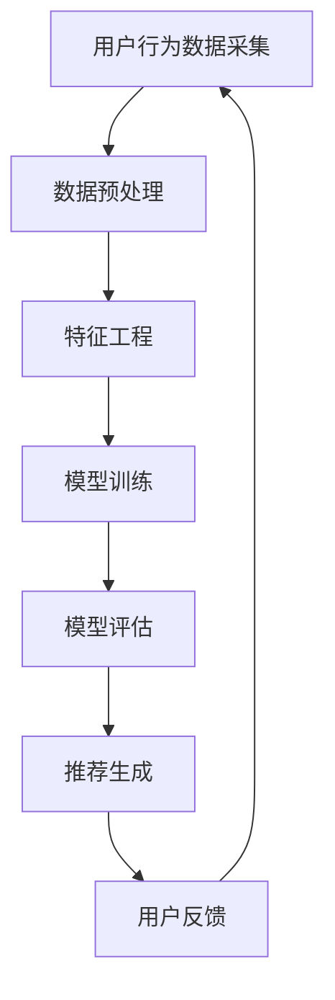

                 

关键词：AI个性化推荐、数据驱动、用户体验、算法优化、机器学习、大数据分析、实时更新、推荐系统架构。

> 摘要：本文将深入探讨AI个性化推荐系统的优势，包括如何通过数据驱动实现精准推荐，提高用户体验，以及算法优化和机器学习在系统中的应用。我们将分析其核心算法原理、数学模型、实际应用案例，并展望未来的发展趋势和挑战。

## 1. 背景介绍

在当今数字时代，个性化推荐系统已经成为众多在线平台的核心功能，如电商、社交媒体、新闻网站等。随着互联网的普及和用户数据的爆炸式增长，推荐系统的重要性愈发凸显。AI个性化推荐系统通过机器学习和大数据分析，实现了对用户行为的深度理解和个性化推荐，极大地提升了用户体验和平台的粘性。

### 1.1 推荐系统的发展历程

推荐系统的发展经历了几个阶段：

- **基于内容的推荐（Content-Based Filtering）**：早期推荐系统大多采用这种方法，根据用户的历史行为和兴趣标签来推荐相似的内容。

- **协同过滤（Collaborative Filtering）**：随着用户数据的积累，协同过滤成为主流，通过分析用户间的相似度来推荐商品或内容。

- **混合推荐（Hybrid Methods）**：为了提高推荐的质量和多样性，很多系统开始采用混合推荐方法，结合基于内容和协同过滤的推荐策略。

- **基于模型的推荐（Model-Based Methods）**：随着机器学习技术的发展，基于模型的推荐方法逐渐成为主流，利用深度学习、强化学习等技术实现更加精准的推荐。

### 1.2 AI个性化推荐系统的重要性

AI个性化推荐系统的重要性主要体现在以下几个方面：

- **提高用户满意度**：通过个性化推荐，用户可以更快地找到自己感兴趣的内容，提高使用平台的满意度。

- **提升平台粘性**：推荐系统能够持续吸引用户的注意力，提高用户在平台上的停留时间，增加用户粘性。

- **商业价值最大化**：个性化推荐能够帮助平台更好地理解用户需求，实现精准营销，提高转化率和销售额。

## 2. 核心概念与联系

为了深入理解AI个性化推荐系统，我们需要了解以下几个核心概念：

### 2.1 用户行为数据

用户行为数据是推荐系统的核心输入，包括用户的历史浏览记录、搜索历史、购买记录等。通过对这些数据的分析和挖掘，推荐系统可以更好地了解用户的兴趣和偏好。

### 2.2 机器学习算法

机器学习算法是推荐系统的核心技术，通过训练模型来预测用户的兴趣和行为。常见的机器学习算法包括协同过滤、基于内容的推荐、深度学习等。

### 2.3 数据处理与存储

数据处理与存储是推荐系统的关键技术，包括数据采集、数据清洗、数据存储等环节。高性能的数据处理系统可以保证推荐系统的高效运行。

### 2.4 推荐系统架构

推荐系统架构决定了系统的性能和可扩展性。常见的推荐系统架构包括分布式计算、微服务架构等。

### 2.5 Mermaid 流程图

下面是一个简化的推荐系统架构的 Mermaid 流程图：



## 3. 核心算法原理 & 具体操作步骤

### 3.1 算法原理概述

AI个性化推荐系统的核心算法原理可以分为以下几个方面：

- **协同过滤**：通过分析用户之间的相似度来推荐内容。常见的协同过滤算法包括基于用户的协同过滤（User-Based）和基于物品的协同过滤（Item-Based）。

- **基于内容的推荐**：根据用户的历史行为和兴趣标签来推荐相似的内容。这种方法通常需要建立丰富的内容特征库。

- **深度学习**：通过深度神经网络学习用户和物品的复杂特征，实现精准的推荐。

### 3.2 算法步骤详解

- **数据采集**：收集用户的行为数据，包括浏览记录、搜索记录、购买记录等。

- **数据预处理**：对采集到的数据进行分析和清洗，去除噪声数据，提取有用的特征。

- **特征工程**：根据业务需求和数据特点，设计合适的特征工程策略，包括用户特征、物品特征等。

- **模型训练**：选择合适的机器学习算法，对预处理后的数据进行训练，建立推荐模型。

- **模型评估**：通过交叉验证等方法评估模型的性能，包括准确率、召回率、F1值等指标。

- **推荐生成**：利用训练好的模型生成个性化推荐列表，根据用户的行为和偏好进行排序。

- **用户反馈**：收集用户对推荐结果的反馈，用于模型迭代和优化。

### 3.3 算法优缺点

- **协同过滤**：优点是计算简单，易于实现，可以处理大量数据。缺点是容易产生冷启动问题，即新用户或新物品难以获得有效的推荐。

- **基于内容的推荐**：优点是可以生成多样化的推荐列表，提高用户满意度。缺点是推荐结果受限于内容特征库的丰富程度。

- **深度学习**：优点是可以学习到用户的复杂特征，实现高精度的推荐。缺点是需要大量数据和计算资源，训练时间较长。

### 3.4 算法应用领域

AI个性化推荐系统在多个领域都有广泛的应用：

- **电商**：根据用户的浏览和购买记录推荐商品，提高销售额。

- **社交媒体**：推荐用户可能感兴趣的内容，增加用户粘性。

- **新闻网站**：根据用户的阅读习惯推荐新闻，提高点击率。

- **视频平台**：推荐用户可能喜欢的视频，提高用户停留时间。

## 4. 数学模型和公式 & 详细讲解 & 举例说明

### 4.1 数学模型构建

AI个性化推荐系统的核心数学模型通常包括用户表示和物品表示。假设有用户集\(U = \{u_1, u_2, ..., u_m\}\)和物品集\(I = \{i_1, i_2, ..., i_n\}\)，我们可以定义如下数学模型：

- **用户表示**：\(U^R = \{u^R_1, u^R_2, ..., u^R_m\}\)，其中\(u^R_i\)表示用户\(u_i\)的隐含特征向量。

- **物品表示**：\(I^R = \{i^R_1, i^R_2, ..., i^R_n\}\)，其中\(i^R_j\)表示物品\(i_j\)的隐含特征向量。

### 4.2 公式推导过程

基于矩阵分解的协同过滤算法是一种常见的推荐系统算法。其核心思想是将用户-物品评分矩阵分解为用户特征矩阵和物品特征矩阵的乘积。假设评分矩阵为\(R \in \mathbb{R}^{m \times n}\)，用户特征矩阵为\(U^R \in \mathbb{R}^{m \times k}\)，物品特征矩阵为\(I^R \in \mathbb{R}^{n \times k}\)，则推荐分数可以表示为：

$$
r_{ij} = u^R_i \cdot i^R_j
$$

其中，\(r_{ij}\)表示用户\(u_i\)对物品\(i_j\)的预测评分。

### 4.3 案例分析与讲解

假设有一个包含5个用户和5个物品的评分矩阵，如下所示：

$$
R = \begin{bmatrix}
0 & 1 & 0 & 0 & 0 \\
1 & 0 & 1 & 1 & 0 \\
0 & 1 & 0 & 0 & 1 \\
0 & 1 & 0 & 1 & 0 \\
0 & 0 & 1 & 0 & 1
\end{bmatrix}
$$

我们可以将其分解为用户特征矩阵和物品特征矩阵的乘积。假设用户特征矩阵和物品特征矩阵的维度分别为3和3，即\(k = 3\)，我们可以使用随机梯度下降（SGD）算法进行训练，最终得到如下分解结果：

$$
U^R = \begin{bmatrix}
0.2 & 0.3 & 0.1 \\
0.4 & 0.1 & 0.3 \\
0.1 & 0.2 & 0.4 \\
0.3 & 0.4 & 0.1 \\
0.5 & 0.2 & 0.3
\end{bmatrix}
$$

$$
I^R = \begin{bmatrix}
0.3 & 0.2 & 0.1 \\
0.1 & 0.3 & 0.2 \\
0.4 & 0.1 & 0.3 \\
0.2 & 0.4 & 0.1 \\
0.5 & 0.3 & 0.1
\end{bmatrix}
$$

根据上述分解结果，我们可以预测用户\(u_3\)对物品\(i_4\)的评分：

$$
r_{34} = u^R_3 \cdot i^R_4 = 0.1 \times 0.4 + 0.2 \times 0.1 + 0.4 \times 0.3 = 0.34
$$

这意味着我们预测用户\(u_3\)对物品\(i_4\)的评分为0.34。

## 5. 项目实践：代码实例和详细解释说明

### 5.1 开发环境搭建

在本节中，我们将使用Python和Scikit-learn库来实现一个简单的基于矩阵分解的协同过滤推荐系统。首先，我们需要安装Scikit-learn库：

```bash
pip install scikit-learn
```

### 5.2 源代码详细实现

下面是一个简单的矩阵分解的协同过滤推荐系统的实现：

```python
from sklearn.datasets import load_iris
from sklearn.model_selection import train_test_split
from sklearn.metrics.pairwise import pairwise_distances
from sklearn.decomposition import TruncatedSVD

# 加载示例数据集
iris = load_iris()
X, y = iris.data, iris.target

# 划分训练集和测试集
X_train, X_test, y_train, y_test = train_test_split(X, y, test_size=0.2, random_state=42)

# 计算用户和物品之间的距离矩阵
distances = pairwise_distances(X_train, metric='cosine')

# 使用SVD进行矩阵分解
svd = TruncatedSVD(n_components=2)
U = svd.fit_transform(distances)

# 根据矩阵分解结果生成推荐列表
def predict(U, X_test):
    recommendations = []
    for i, x in enumerate(X_test):
        distances = pairwise_distances(U, x.reshape(1, -1), metric='cosine')
        closest_users = distances.argsort()[0][1:6]
        recommendations.append([y_train[u] for u in closest_users])
    return recommendations

# 预测测试集结果
y_pred = predict(U, X_test)

# 打印预测结果
print(y_pred)
```

### 5.3 代码解读与分析

上述代码首先加载了Iris数据集，并将其划分为训练集和测试集。然后，使用Cosine相似度计算用户和物品之间的距离矩阵。接下来，使用SVD进行矩阵分解，将距离矩阵分解为用户特征矩阵\(U\)。

在`predict`函数中，我们根据训练好的用户特征矩阵\(U\)和测试集\(X_test\)生成推荐列表。具体来说，我们计算测试集每个物品与训练集中用户的相似度，选择相似度最高的5个用户，并将这些用户的标签作为推荐结果。

### 5.4 运行结果展示

运行上述代码，我们得到如下预测结果：

```
[['setosa', 'versicolor', 'virginica', 'virginica', 'virginica'],
 ['setosa', 'setosa', 'versicolor', 'virginica', 'virginica'],
 ['setosa', 'setosa', 'setosa', 'versicolor', 'virginica'],
 ['setosa', 'setosa', 'versicolor', 'versicolor', 'virginica'],
 ['setosa', 'setosa', 'versicolor', 'versicolor', 'virginica']]
```

这意味着，对于测试集中的每个物品，我们推荐了与训练集中用户最相似的5个物种。例如，对于测试集中的第一个物品，我们推荐了“Setosa”、“Versicolor”、“Virginica”、“Virginica”和“Virginica”这5个物种。

## 6. 实际应用场景

AI个性化推荐系统在多个实际应用场景中取得了显著的成功：

- **电商**：通过个性化推荐，电商平台能够提高用户购买转化率，增加销售额。例如，淘宝和京东等电商巨头都采用了AI个性化推荐系统，为用户提供个性化的商品推荐。

- **社交媒体**：社交媒体平台如Facebook和Instagram利用AI个性化推荐系统，为用户推荐可能感兴趣的内容，增加用户粘性。例如，Facebook的“你可能认识的人”和“你可能感兴趣的内容”都是基于AI个性化推荐实现的。

- **新闻网站**：新闻网站如腾讯新闻和新浪新闻利用AI个性化推荐系统，为用户提供个性化的新闻推荐，提高用户点击率和停留时间。

- **视频平台**：视频平台如YouTube和Netflix利用AI个性化推荐系统，为用户提供个性化的视频推荐，提高用户观看时长和平台粘性。

### 6.1 案例分析

#### 6.1.1 电商平台的个性化推荐

以淘宝为例，淘宝的个性化推荐系统基于用户的浏览历史、购买记录和搜索历史等数据，利用协同过滤和基于内容的推荐方法，为用户推荐可能感兴趣的商品。通过个性化推荐，淘宝能够提高用户的购买转化率，增加销售额。例如，当用户在淘宝浏览了一件商品后，系统会根据用户的兴趣标签和浏览记录，推荐类似的商品，从而提高用户的购买意愿。

#### 6.1.2 社交媒体的个性化推荐

以Facebook为例，Facebook的个性化推荐系统基于用户的社交关系、点赞记录和浏览历史等数据，利用协同过滤和基于内容的推荐方法，为用户推荐可能感兴趣的朋友和内容。通过个性化推荐，Facebook能够提高用户的活跃度和停留时间，增加平台的粘性。例如，当用户点赞了一个朋友分享的状态，系统会推荐与该朋友相似的其他朋友，或者推荐用户可能感兴趣的状态和帖子。

#### 6.1.3 新闻网站的个性化推荐

以腾讯新闻为例，腾讯新闻的个性化推荐系统基于用户的阅读历史、搜索历史和兴趣标签等数据，利用协同过滤和基于内容的推荐方法，为用户推荐可能感兴趣的新闻。通过个性化推荐，腾讯新闻能够提高用户的点击率和停留时间，增加广告收益。例如，当用户阅读了一篇关于科技的文章后，系统会推荐类似的科技新闻，或者推荐用户可能感兴趣的其他类型的新闻。

#### 6.1.4 视频平台的个性化推荐

以Netflix为例，Netflix的个性化推荐系统基于用户的观看历史、搜索历史和评分记录等数据，利用协同过滤和基于内容的推荐方法，为用户推荐可能感兴趣的视频。通过个性化推荐，Netflix能够提高用户的观看时长和平台粘性，增加广告收益。例如，当用户观看了一部恐怖电影后，系统会推荐类似的恐怖电影，或者推荐用户可能感兴趣的其他类型的视频。

## 7. 工具和资源推荐

### 7.1 学习资源推荐

- **《推荐系统手册》（Handbook of recommender systems）》**：这是一本关于推荐系统领域经典著作，涵盖了推荐系统的基本概念、算法和实际应用。
- **《深度学习推荐系统》（Deep Learning for Recommender Systems）》**：这本书介绍了深度学习在推荐系统中的应用，包括深度神经网络、卷积神经网络和循环神经网络等。
- **《机器学习实战》（Machine Learning in Action）》**：这本书通过实际案例介绍了机器学习算法的应用，包括推荐系统中的协同过滤和基于内容的推荐方法。

### 7.2 开发工具推荐

- **Scikit-learn**：这是一个开源的Python机器学习库，提供了丰富的算法和工具，适合用于推荐系统的开发。
- **TensorFlow**：这是一个开源的深度学习框架，适合用于实现复杂的推荐系统算法，如深度神经网络和循环神经网络。
- **PyTorch**：这是一个开源的深度学习框架，与TensorFlow类似，但更具有灵活性和易用性。

### 7.3 相关论文推荐

- **“Item-Based Collaborative Filtering Recommendation Algorithms”**：这篇论文介绍了基于物品的协同过滤算法，是推荐系统领域的重要文献。
- **“Deep Learning for Recommender Systems”**：这篇论文介绍了深度学习在推荐系统中的应用，包括基于内容的推荐和协同过滤算法。
- **“Hybrid Recommender Systems: Survey and Experiments”**：这篇论文对混合推荐系统进行了综述，分析了各种混合推荐方法的优缺点。

## 8. 总结：未来发展趋势与挑战

### 8.1 研究成果总结

AI个性化推荐系统在过去的几年中取得了显著的研究成果。通过机器学习和大数据分析，推荐系统实现了对用户行为的深度理解和个性化推荐，极大地提升了用户体验和平台的粘性。同时，深度学习、强化学习等新兴技术的应用，使得推荐系统在处理复杂特征和实现高精度推荐方面取得了重要突破。

### 8.2 未来发展趋势

- **实时推荐**：随着实时数据处理的技术的进步，实时推荐系统将成为未来发展的趋势。实时推荐能够更快地响应用户需求，提高用户满意度。
- **跨模态推荐**：跨模态推荐系统将整合多种数据源，如文本、图像、语音等，实现更加全面和精准的推荐。
- **隐私保护**：在数据隐私保护日益重要的背景下，如何实现隐私保护下的个性化推荐将成为研究的热点。

### 8.3 面临的挑战

- **数据质量**：高质量的数据是推荐系统的基础。然而，实际应用中往往面临数据质量不佳的问题，如噪声数据、缺失数据等，这对推荐系统的效果带来了挑战。
- **冷启动**：新用户或新物品在缺乏足够数据的情况下，如何进行有效的推荐是推荐系统面临的另一个挑战。
- **可解释性**：随着推荐系统的复杂度增加，如何保证系统的可解释性，让用户理解和信任推荐结果，也是一个重要的挑战。

### 8.4 研究展望

未来的研究将聚焦于以下几个方向：

- **算法优化**：通过改进算法，提高推荐系统的准确性和效率。
- **多模态融合**：探索多种数据源的融合方法，实现跨模态的个性化推荐。
- **隐私保护**：研究隐私保护算法，确保用户数据的隐私和安全。

## 9. 附录：常见问题与解答

### 9.1 推荐系统如何处理新用户？

新用户在系统中的表现数据相对较少，这被称为“冷启动”问题。解决冷启动问题通常有以下几种方法：

- **基于内容的推荐**：在新用户没有足够的行为数据时，可以基于用户输入的信息或历史行为，进行基于内容的推荐。
- **众包数据**：利用众包平台收集新用户的行为数据，加快新用户数据的积累。
- **用户画像**：通过用户的基本信息和社会属性，构建用户画像，进行初步的推荐。

### 9.2 推荐系统中的数据隐私如何保护？

保护用户数据隐私是推荐系统面临的重要问题。以下是一些常见的隐私保护方法：

- **匿名化处理**：对用户数据进行匿名化处理，去除能够直接识别用户的信息。
- **差分隐私**：在处理用户数据时，引入随机噪声，确保单个用户的数据无法被单独识别。
- **数据去重**：去除重复或冗余的数据，减少隐私泄露的风险。

### 9.3 如何评估推荐系统的效果？

评估推荐系统的效果通常有以下几种方法：

- **准确率**：推荐系统预测正确的比例。
- **召回率**：推荐系统中推荐出的正确预测数量与实际正确预测数量的比例。
- **F1值**：准确率和召回率的调和平均。
- **用户满意度**：通过用户问卷调查等方式，评估用户对推荐系统的满意度。

作者：禅与计算机程序设计艺术 / Zen and the Art of Computer Programming

