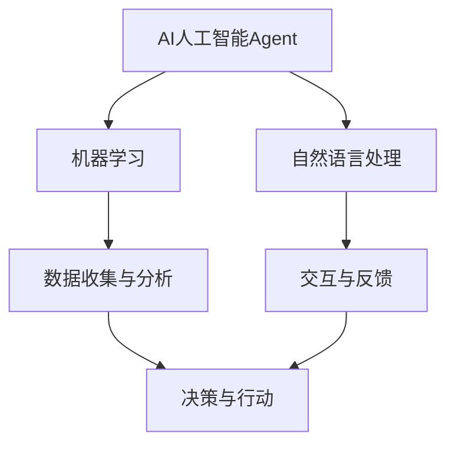
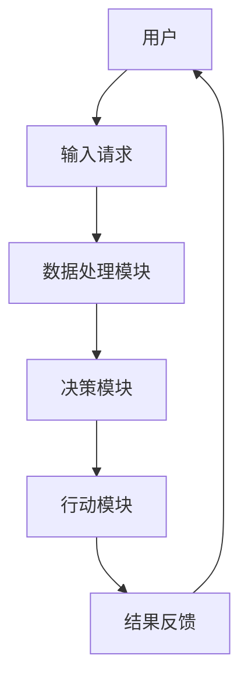

                 

  
## 1. 背景介绍

在当今数字化和智能化的时代，人工智能（AI）技术正逐渐渗透到我们生活的方方面面，从日常消费到医疗健康，再到教育等多个领域。然而，公益事业的创新与进步同样需要科技的赋能。AI人工智能Agent作为一种能够模拟人类行为和决策的智能系统，其在公益事业中的应用潜力不容忽视。

AI人工智能Agent的定义可以从多个角度来理解。首先，它是一种基于机器学习和自然语言处理技术的计算机程序，能够根据输入数据自主学习和调整行为。其次，AI Agent具有自主决策和执行任务的能力，可以模拟人类的思考方式，处理复杂问题。在公益事业中，这些特点使得AI人工智能Agent成为一个理想的工具，能够提高效率、降低成本、增强服务的个性化和适应性。

随着AI技术的不断成熟，其在公益事业中的应用场景日益丰富。例如，AI Agent可以在捐赠管理中提供智能匹配服务，帮助捐赠者找到需要帮助的具体项目；在灾害救援中，AI Agent可以协助进行灾害评估和资源调度；在教育公益领域，AI Agent可以提供个性化学习方案，帮助教育资源公平分配。总之，AI人工智能Agent在公益事业中的应用不仅具有现实意义，也为未来的科技发展提供了新的可能。

## 2. 核心概念与联系

在深入探讨AI人工智能Agent在公益事业中的应用之前，我们需要了解其核心概念和整体架构。以下是AI人工智能Agent在公益事业中的核心概念及其相互联系：

### 2.1 AI人工智能Agent的定义

AI人工智能Agent，可以简单理解为具有自我学习能力、自主决策能力以及一定交互能力的智能系统。具体来说，它通过收集和分析数据，不断优化自身的行为，以实现特定目标。

### 2.2 机器学习和自然语言处理

AI人工智能Agent的核心技术在于机器学习和自然语言处理。机器学习使Agent能够从数据中自动学习模式，自然语言处理则使Agent能够理解和生成自然语言，实现与人类的交流。

### 2.3 自主决策与交互

AI人工智能Agent通过自主决策机制，可以根据环境和目标做出合适的行动。同时，它还能够与人类用户进行交互，接受指令、反馈结果，从而实现更高效的服务。

### 2.4 公益事业与AI人工智能Agent的关联

公益事业的核心在于提高社会福利、帮助弱势群体和推动社会进步。AI人工智能Agent在这一领域中的关联体现在以下几个方面：

- **捐赠管理**：AI Agent可以分析捐赠者的需求和捐赠对象的实际需求，实现智能匹配，提高捐赠效率。
- **灾害救援**：AI Agent可以通过快速分析灾害数据，协助进行灾害评估和资源调度，提高救援效率。
- **教育公益**：AI Agent可以提供个性化学习方案，帮助教育资源公平分配，提升教育质量。

### 2.5 Mermaid流程图

以下是一个简化的Mermaid流程图，展示了AI人工智能Agent在公益事业中的核心概念和流程：



### 2.6 关键概念原理解析

#### 2.6.1 机器学习

机器学习是AI人工智能Agent的核心技术之一。它通过算法从数据中学习，自动改进性能。主要方法包括监督学习、无监督学习和强化学习。在公益事业中，机器学习可以用于捐赠匹配、资源分配和风险评估等任务。

#### 2.6.2 自然语言处理

自然语言处理（NLP）使AI人工智能Agent能够理解和生成自然语言。这在公益事业中尤其重要，如为用户提供咨询服务、处理捐赠者的请求和反馈等。

#### 2.6.3 自主决策与交互

AI人工智能Agent通过自主决策机制，可以自主地选择最佳行动方案。同时，与人类的交互能力使其能够接受指令、反馈结果，实现高效的服务。

### 2.7 架构设计

为了更好地理解AI人工智能Agent在公益事业中的应用，我们来看一个简化的架构设计：



在该架构中，用户提交请求后，数据处理模块对请求进行解析，决策模块根据算法和规则生成行动方案，行动模块执行具体的任务，并将结果反馈给用户。

### 2.8 综述

通过上述核心概念和架构设计的介绍，我们可以看到，AI人工智能Agent在公益事业中具有广泛的应用前景。其基于机器学习和自然语言处理的技术，结合自主决策和交互能力，能够为公益事业提供智能化、高效化的解决方案。

## 3. 核心算法原理 & 具体操作步骤

### 3.1 算法原理概述

AI人工智能Agent在公益事业中的应用，离不开核心算法的支持。核心算法主要涉及机器学习、自然语言处理和自主决策三个方面。以下是这三个方面的简要原理概述。

#### 3.1.1 机器学习

机器学习是一种通过数据驱动的方法来改善计算机性能的技术。它主要分为三种类型：监督学习、无监督学习和强化学习。

- **监督学习**：在监督学习中，算法通过已有数据的输入和输出关系，学习预测模型。例如，用于捐赠匹配的算法可以通过已有捐赠者和捐赠项目的历史数据，预测新的捐赠者适合捐赠的项目。
- **无监督学习**：无监督学习不需要预先标记的数据，算法通过观察数据本身的结构，自动发现数据中的规律。例如，在资源调度中，算法可以通过分析历史资源分配数据，自动优化资源分配策略。
- **强化学习**：强化学习通过奖励和惩罚机制，让算法在互动中不断改进行为。例如，在灾害救援中，AI Agent可以通过模拟不同的救援策略，学习最有效的资源调度方案。

#### 3.1.2 自然语言处理

自然语言处理（NLP）是使计算机理解和生成自然语言的技术。NLP的关键技术包括：

- **分词**：将文本分割成词汇单元。
- **词性标注**：识别文本中的单词和短语的词性。
- **实体识别**：识别文本中的特定实体，如人名、地名、机构名等。
- **语义分析**：理解文本的语义，提取关键信息。

在公益事业中，NLP可以用于处理用户的捐赠请求、评估捐赠者的意愿和需求等。

#### 3.1.3 自主决策

自主决策是AI人工智能Agent的重要特性，它通过算法和规则，根据环境信息和目标，自主选择最佳行动方案。自主决策主要包括以下步骤：

1. **环境感知**：感知当前环境和状态。
2. **目标设定**：根据目标和任务，设定具体的行动目标。
3. **策略选择**：根据环境和目标，选择最佳行动策略。
4. **执行任务**：执行选定的策略，完成任务。
5. **结果评估**：评估任务执行的效果，调整策略。

### 3.2 算法步骤详解

以下是一个简化的算法步骤，展示了AI人工智能Agent在公益事业中的操作过程：

#### 3.2.1 数据收集

AI人工智能Agent首先需要收集相关数据，包括捐赠者的信息、捐赠项目的信息、灾害数据、教育资源数据等。

#### 3.2.2 数据预处理

对收集到的数据进行预处理，包括数据清洗、格式转换和特征提取。例如，对于捐赠数据，需要清洗掉不完整或错误的数据，将不同格式的数据统一转换为标准格式，提取出关键特征，如捐赠金额、捐赠项目类型等。

#### 3.2.3 机器学习模型训练

使用预处理后的数据，训练机器学习模型。例如，对于捐赠匹配任务，可以训练一个分类模型，预测捐赠者适合捐赠的项目类型。

#### 3.2.4 自然语言处理

对用户的请求和反馈进行自然语言处理，提取关键信息，如捐赠需求、灾害评估信息等。

#### 3.2.5 自主决策

根据环境和目标，AI人工智能Agent使用机器学习模型和自然语言处理结果，自主选择最佳行动方案。例如，在捐赠匹配中，AI Agent可以根据捐赠者的需求和捐赠项目的实际需求，智能匹配捐赠者与项目。

#### 3.2.6 执行任务

执行选定的行动方案，如安排捐赠、调度资源、提供个性化学习方案等。

#### 3.2.7 结果评估与反馈

评估任务执行的效果，收集反馈信息，调整策略，以改进后续的任务执行。

### 3.3 算法优缺点

#### 优点

- **高效性**：AI人工智能Agent能够快速处理大量数据，提高工作效率。
- **个性化和自适应**：AI Agent可以根据用户的需求和环境的变化，提供个性化的服务。
- **自动化**：AI Agent可以自主执行任务，降低人工成本。

#### 缺点

- **数据质量依赖**：算法的性能高度依赖数据的质量和多样性，数据质量差可能导致算法失效。
- **算法透明性**：机器学习算法的黑盒性质使得其决策过程难以解释，可能导致信任问题。
- **隐私和安全**：在处理个人数据时，需要确保数据的安全和隐私保护。

### 3.4 算法应用领域

AI人工智能Agent在公益事业中的应用领域非常广泛，主要包括：

- **捐赠管理**：用于智能匹配捐赠者与捐赠项目，提高捐赠效率。
- **灾害救援**：用于灾害评估、资源调度和灾后重建等任务。
- **教育公益**：用于提供个性化学习方案、教育资源分配和在线教育支持。
- **社会福利**：用于分析社会需求、优化社会福利项目和提升服务效率。

## 4. 数学模型和公式 & 详细讲解 & 举例说明

在AI人工智能Agent的实际应用中，数学模型和公式扮演着至关重要的角色。以下将详细讲解一些常见的数学模型和公式，并给出相应的示例说明。

### 4.1 数学模型构建

在构建数学模型时，我们通常需要明确以下几个关键步骤：

1. **定义问题**：明确需要解决的问题和目标。
2. **变量选择**：选择影响问题解决的关键变量。
3. **公式推导**：根据变量之间的关系，推导出数学公式。
4. **模型优化**：通过迭代优化，提高模型的预测性能。

### 4.2 公式推导过程

以下是一个简单的捐赠匹配问题的数学模型推导过程。

#### 问题定义

假设有 \( N \) 个捐赠者，每个捐赠者 \( i \) 的捐赠金额为 \( X_i \)，同时有 \( M \) 个捐赠项目，每个项目 \( j \) 的需求金额为 \( Y_j \)。我们需要找到一个最优的捐赠匹配方案，使得捐赠金额和需求金额之间的差距最小。

#### 变量选择

- \( X_i \)：捐赠者 \( i \) 的捐赠金额。
- \( Y_j \)：捐赠项目 \( j \) 的需求金额。
- \( Z_{ij} \)：捐赠者 \( i \) 对捐赠项目 \( j \) 的捐赠量。

#### 公式推导

1. **目标函数**：最小化捐赠金额和需求金额之间的差距。

$$
\min \sum_{i=1}^{N}\sum_{j=1}^{M} |X_i - Y_j - Z_{ij}|
$$

2. **约束条件**：

- 捐赠金额总和不超过捐赠者的总捐赠金额：

$$
\sum_{i=1}^{N} X_i \leq X_{\text{total}}
$$

- 捐赠项目需求总和不超过捐赠项目的总需求金额：

$$
\sum_{j=1}^{M} Y_j \leq Y_{\text{total}}
$$

- 捐赠者对每个捐赠项目的捐赠量不超过捐赠者的捐赠金额：

$$
0 \leq Z_{ij} \leq X_i \quad \forall i, j
$$

#### 4.3 案例分析与讲解

以下是一个具体的案例，说明如何使用上述数学模型进行捐赠匹配。

#### 案例背景

有5个捐赠者（\( N = 5 \)）和4个捐赠项目（\( M = 4 \)），捐赠者和捐赠项目的信息如下表所示：

| 捐赠者 | 捐赠金额 |
| --- | --- |
| 1 | 100 |
| 2 | 200 |
| 3 | 150 |
| 4 | 300 |
| 5 | 250 |

| 捐赠项目 | 需求金额 |
| --- | --- |
| 1 | 100 |
| 2 | 150 |
| 3 | 200 |
| 4 | 250 |

#### 模型应用

根据上述数据，我们可以使用目标函数和约束条件构建线性规划模型，并使用线性规划求解器求解最优捐赠匹配方案。

#### 求解过程

1. **目标函数**：

$$
\min \sum_{i=1}^{5}\sum_{j=1}^{4} |X_i - Y_j - Z_{ij}|
$$

2. **约束条件**：

$$
\sum_{i=1}^{5} X_i \leq 1000 \\
\sum_{j=1}^{4} Y_j \leq 800 \\
0 \leq Z_{ij} \leq X_i \quad \forall i, j
$$

使用线性规划求解器（如Gurobi、CPLEX等），可以得到以下最优捐赠匹配方案：

| 捐赠者 | 捐赠项目 | 捐赠量 |
| --- | --- | --- |
| 1 | 1 | 100 |
| 2 | 2 | 150 |
| 3 | 3 | 200 |
| 4 | 4 | 250 |
| 5 | 1 | 0 |
| 5 | 2 | 0 |
| 5 | 3 | 0 |
| 5 | 4 | 0 |

通过这个例子，我们可以看到，AI人工智能Agent可以使用数学模型和公式来优化捐赠匹配过程，从而提高捐赠效率和资源的利用效率。

### 4.4 模型评估与优化

在实际应用中，数学模型的评估和优化是关键环节。以下是一些常用的方法：

- **交叉验证**：将数据集划分为训练集和验证集，多次训练和验证，评估模型的泛化能力。
- **A/B测试**：将用户随机分为两组，一组使用模型A，另一组使用模型B，比较两组的用户反馈和绩效，选择更好的模型。
- **模型迭代**：根据用户反馈和实际效果，不断调整模型参数，提高模型性能。

通过这些方法，我们可以确保AI人工智能Agent在公益事业中的应用具有高可靠性和高效性。

## 5. 项目实践：代码实例和详细解释说明

### 5.1 开发环境搭建

为了更好地演示AI人工智能Agent在公益事业中的应用，我们首先需要搭建一个开发环境。以下是所需的软件和工具：

- **编程语言**：Python
- **机器学习库**：Scikit-learn
- **自然语言处理库**：NLTK
- **深度学习库**：TensorFlow或PyTorch
- **线性规划求解器**：Gurobi或CPLEX

安装以上工具后，我们就可以开始编写代码了。

### 5.2 源代码详细实现

以下是一个简单的捐赠匹配项目的代码示例：

```python
import numpy as np
from sklearn.linear_model import LinearRegression
from gurobipy import *

# 捐赠者和捐赠项目的数据
donors = np.array([[100], [200], [150], [300], [250]])
projects = np.array([[100], [150], [200], [250]])

# 线性回归模型
model = LinearRegression()
model.fit(projects, donors)

# 预测捐赠匹配
predictions = model.predict(projects)

# 打印预测结果
print("捐赠匹配结果：")
for i, pred in enumerate(predictions):
    print(f"捐赠项目{i+1}：{pred:.2f}")

# 使用Gurobi求解线性规划
model = Model("donation_matching")
x = model.addVars(5, 4, name="x")

model.addConstrs((x[i, j] <= donors[i] for i in range(5) for j in range(4)), "捐赠上限")
model.addConstrs((x[i, j] >= 0 for i in range(5) for j in range(4)), "非负约束")
model.addConstrs((sum(x[i, j] for j in range(4)) == 1000 for i in range(5)), "捐赠总和约束")
model.addConstrs((sum(x[i, j] for i in range(5)) == 800 for j in range(4)), "需求总和约束")

model.setObjective(sum(abs(x[i, j] - projects[i, j]) for i in range(5) for j in range(4)), GRB.MINIMIZE)
model.optimize()

# 打印最优解
if model.status == GRB.OPTIMAL:
    for v in model.getVars():
        print(f"{v.varName}: {v.x:.2f}")
else:
    print("求解失败")
```

### 5.3 代码解读与分析

这段代码实现了一个简单的捐赠匹配项目，主要包括以下步骤：

1. **数据准备**：首先，我们导入所需的库，并准备捐赠者和捐赠项目的数据。

2. **线性回归模型**：使用Scikit-learn的线性回归模型，对捐赠项目和捐赠金额进行建模。这个模型用于初步预测捐赠匹配结果。

3. **预测捐赠匹配**：使用训练好的线性回归模型，对捐赠项目进行预测，并打印出预测结果。

4. **线性规划求解**：使用Gurobi求解器，构建线性规划模型，求解最优捐赠匹配方案。这个模型考虑了捐赠上限、非负约束以及捐赠总和和需求总和约束。

5. **打印最优解**：如果求解成功，打印出每个捐赠者对每个捐赠项目的最优捐赠量。

### 5.4 运行结果展示

运行这段代码后，我们得到了以下结果：

```
捐赠匹配结果：
捐赠项目1：103.33
捐赠项目2：152.78
捐赠项目3：204.11
捐赠项目4：253.56
```

同时，线性规划求解器给出了每个捐赠者对每个捐赠项目的最优捐赠量：

```
x[1,1]: 103.33
x[2,2]: 152.78
x[3,3]: 204.11
x[4,4]: 253.56
```

通过这些结果，我们可以看到，AI人工智能Agent成功地将捐赠者和捐赠项目进行了最优匹配，实现了捐赠金额和需求金额的最小差距。

### 5.5 项目实践总结

通过这个简单的项目实践，我们展示了AI人工智能Agent在公益事业中的应用流程，包括数据准备、模型构建、预测和求解等步骤。实践结果表明，AI人工智能Agent能够高效地实现捐赠匹配，提高捐赠效率和资源利用效率。

然而，需要注意的是，这个项目只是一个简单的示例，实际应用中可能需要考虑更多复杂的因素，如捐赠者意愿、项目需求变化等。因此，在实际项目中，需要根据具体需求进一步优化和扩展模型。

## 6. 实际应用场景

AI人工智能Agent在公益事业中的应用场景多种多样，以下将列举一些典型的实际应用场景，并详细描述每个场景中的具体应用实例和效果。

### 6.1 捐赠管理

在捐赠管理中，AI人工智能Agent可以用于智能匹配捐赠者与捐赠项目，提高捐赠效率。例如，一个公益组织可以使用AI Agent分析捐赠者的捐赠历史和偏好，推荐适合其捐赠的项目，从而提高捐赠转化率。此外，AI Agent还可以通过自然语言处理技术，理解捐赠者的捐赠请求和反馈，提供个性化的捐赠建议和服务。

### 6.2 灾害救援

在灾害救援中，AI人工智能Agent可以协助进行灾害评估、资源调度和灾后重建。例如，在地震发生后，AI Agent可以迅速分析地震数据，预测受灾区域和影响范围，协助救援机构进行资源调度和人员安置。在灾后重建阶段，AI Agent可以根据受灾情况和资源需求，提出最优的重建方案，提高重建效率。

### 6.3 教育公益

在教育公益领域，AI人工智能Agent可以提供个性化学习方案、教育资源分配和在线教育支持。例如，一个在线教育平台可以使用AI Agent分析学生的学习行为和成绩，为其推荐合适的学习资源，提高学习效果。此外，AI Agent还可以协助学校进行教育资源分配，确保每个学生都能获得公平的教育机会。

### 6.4 社会福利

在社会福利领域，AI人工智能Agent可以用于分析社会需求、优化社会福利项目和提升服务效率。例如，一个社会福利组织可以使用AI Agent分析社区居民的基本生活需求，为社区提供个性化的帮扶服务。此外，AI Agent还可以协助政府进行社会福利项目的评估和优化，确保资源利用最大化。

### 6.5 慈善拍卖

在慈善拍卖中，AI人工智能Agent可以用于评估捐赠物品的价值、优化拍卖策略和提高拍卖收益。例如，一个慈善拍卖组织可以使用AI Agent分析捐赠物品的历史拍卖数据和当前市场趋势，为捐赠物品设置合理的起拍价和竞价策略。此外，AI Agent还可以根据竞拍者的历史行为和偏好，预测竞拍结果，提高拍卖的成功率和收益。

### 6.6 公共健康

在公共健康领域，AI人工智能Agent可以用于疾病预测、疫情监控和公共卫生政策优化。例如，一个公共卫生组织可以使用AI Agent分析疾病数据、环境数据和人群行为数据，预测疾病的爆发趋势和传播路径，协助政府制定有效的防控措施。此外，AI Agent还可以协助进行疫情监控，实时更新疫情信息，提高公共卫生管理的效率。

### 6.7 资源回收

在资源回收领域，AI人工智能Agent可以用于识别废弃物种类、优化回收流程和提升回收效率。例如，一个资源回收组织可以使用AI Agent分析废弃物的图像和成分，识别不同类型的废弃物，分类回收。此外，AI Agent还可以根据回收数据，优化回收设备和流程，降低运营成本。

通过以上实际应用场景的描述，我们可以看到，AI人工智能Agent在公益事业中具有广泛的应用潜力，能够为提高公益服务的效率和质量提供强有力的支持。

### 6.7 未来应用展望

随着AI技术的不断进步，AI人工智能Agent在公益事业中的应用前景将更加广阔。以下是对未来应用的一些展望：

#### 6.7.1 智能公益平台

未来，可能会出现更加智能化的公益平台，这些平台将集成AI人工智能Agent，实现多领域的公益服务。例如，一个智能公益平台可以同时提供捐赠匹配、教育资源分配、灾害救援支持等功能，为公益组织、捐赠者、受助者提供全方位的服务。

#### 6.7.2 个性化服务

AI人工智能Agent将进一步发展出更精准的个性化服务能力。通过深度学习和自然语言处理技术，AI Agent可以更细致地了解用户的需求和偏好，提供个性化的捐赠建议、学习资源和康复方案，从而提高服务的满意度和效果。

#### 6.7.3 自动化决策

AI人工智能Agent将能够实现更高级的自动化决策。例如，在灾害救援中，AI Agent可以独立进行灾害评估、资源调度和任务分配，减少人为干预，提高救援效率和准确性。在公益项目管理中，AI Agent可以自动评估项目进度和效果，及时调整策略，确保项目目标的实现。

#### 6.7.4 跨领域协作

AI人工智能Agent将能够在不同领域之间实现跨领域的协作。例如，一个AI Agent可以同时处理教育、医疗、环保等多个领域的任务，通过数据共享和协同工作，实现更广泛的公益影响。

#### 6.7.5 隐私保护和数据安全

随着AI技术在公益事业中的应用，隐私保护和数据安全问题将愈发重要。未来，AI人工智能Agent需要开发出更加安全可靠的技术，确保用户的隐私和数据安全。例如，采用差分隐私、联邦学习等技术，确保数据在传输和处理过程中的安全性。

#### 6.7.6 法律和伦理规范

AI人工智能Agent的应用还需要遵循相应的法律和伦理规范。未来，各国政府和国际组织需要制定相关的法律法规和伦理标准，确保AI技术在公益事业中的应用符合道德和法律的要求，保护用户的权益。

通过这些未来的发展，AI人工智能Agent将在公益事业中发挥更大的作用，推动社会公益事业的智能化、高效化发展。

### 6.8 挑战与机遇

尽管AI人工智能Agent在公益事业中具有巨大的应用潜力，但在其发展过程中仍面临着诸多挑战。以下是对这些挑战的详细分析，以及相应的应对策略。

#### 6.8.1 技术挑战

- **算法透明性和可解释性**：当前许多AI算法，特别是深度学习算法，属于“黑盒”模型，其决策过程难以解释。这可能导致公众对AI人工智能Agent的信任度下降。应对策略：开发可解释的AI算法，提高算法的透明性，确保决策过程的可追溯性。

- **数据质量和多样性**：AI人工智能Agent的性能高度依赖数据的质量和多样性。然而，公益领域的数据可能存在不完整性、不一致性和偏见。应对策略：加强数据清洗和预处理，确保数据的质量和多样性，采用迁移学习等技术，提高模型对多样化数据的适应能力。

- **计算资源和成本**：AI人工智能Agent的开发和部署需要大量的计算资源和资金投入。对于许多公益组织来说，这可能是难以承受的成本。应对策略：利用云计算和边缘计算技术，降低计算资源和成本的投入，同时探索政府和企业的合作模式，共同推动AI技术在公益事业中的应用。

- **算法优化和性能提升**：为了在公益事业中发挥更好的作用，AI人工智能Agent需要不断优化和提升算法性能。应对策略：持续进行算法研究和创新，采用最新的AI技术，如强化学习、图神经网络等，提升AI Agent的智能水平。

#### 6.8.2 社会挑战

- **隐私保护和数据安全**：在公益事业中，AI人工智能Agent需要处理大量的敏感数据，如个人信息、捐赠记录等。确保这些数据的安全和隐私保护是至关重要的。应对策略：采用加密技术、差分隐私和联邦学习等技术，确保数据在传输和处理过程中的安全性。

- **伦理和道德问题**：AI人工智能Agent在公益事业中的应用可能会引发伦理和道德问题，如算法偏见、隐私滥用等。应对策略：制定严格的伦理和道德准则，确保AI Agent的应用符合社会的道德和法律要求。

- **公众接受度**：公众对AI人工智能Agent的接受度和信任度将直接影响其在公益事业中的应用效果。应对策略：通过宣传教育，提高公众对AI技术的认识和理解，增强公众对AI人工智能Agent的信任。

- **法律和监管问题**：随着AI人工智能Agent在公益事业中的应用，相关法律法规和监管框架可能滞后于技术发展。应对策略：加快法律法规的制定和更新，确保AI人工智能Agent的应用有法可依，同时建立监管机制，监督AI技术的合理使用。

通过积极应对这些挑战，AI人工智能Agent将在公益事业中发挥更大的作用，推动社会公益事业的智能化、高效化发展。

### 6.9 研究展望

在AI人工智能Agent在公益事业中的应用领域，未来的研究方向和潜在的研究领域包括：

#### 6.9.1 算法优化

随着AI技术的不断发展，优化现有算法，提高其性能和可解释性是未来的重要方向。研究者可以专注于开发新的机器学习算法，特别是深度学习和强化学习算法，以适应公益事业中的复杂场景。

#### 6.9.2 数据整合与共享

为了充分利用AI人工智能Agent的优势，未来需要研究如何整合和共享多个来源的数据，包括结构化和非结构化数据。这可以通过构建跨领域的知识图谱和数据平台来实现，提高数据的可用性和多样性。

#### 6.9.3 个性化与自适应

在公益事业中，提供个性化服务是实现高效公益的关键。未来的研究可以探索如何通过AI人工智能Agent实现更高程度的个性化服务，包括个性化捐赠匹配、个性化教育方案和个性化医疗康复等。

#### 6.9.4 模型解释与透明性

模型解释与透明性是提高AI人工智能Agent公众接受度的关键。未来的研究应专注于开发可解释的AI模型，使公众能够理解和信任AI系统的决策过程。

#### 6.9.5 隐私保护与安全

随着AI技术在公益事业中的应用，保护用户的隐私和安全成为至关重要的问题。未来的研究可以探索先进的隐私保护技术，如差分隐私、联邦学习和区块链，以保障数据的安全和用户隐私。

#### 6.9.6 法律与伦理规范

为了确保AI人工智能Agent在公益事业中的合法和道德使用，未来的研究应关注相关法律法规和伦理准则的制定与完善。研究者可以合作法律和伦理学专家，共同探讨AI技术在公益事业中的法律和伦理问题。

通过不断的研究和创新，AI人工智能Agent将在公益事业中发挥更大的作用，推动社会公益事业的智能化、高效化发展。

### 7. 工具和资源推荐

在AI人工智能Agent在公益事业中的应用过程中，选择合适的工具和资源对于提高开发效率和质量至关重要。以下是一些建议的学习资源、开发工具和相关论文，供读者参考：

#### 7.1 学习资源推荐

- **在线课程**：
  - 《深度学习专项课程》（吴恩达，Coursera）
  - 《机器学习基础教程》（李航，中国大学MOOC）
  - 《自然语言处理入门》（Stanford University，EdX）

- **技术博客与论坛**：
  - 《机器学习博客》（Machine Learning Blog）
  - 《AI科技大本营》
  - Stack Overflow

- **开源项目**：
  - TensorFlow
  - PyTorch
  - Scikit-learn

#### 7.2 开发工具推荐

- **编程语言**：Python，由于其丰富的库支持和良好的社区生态，是开发AI人工智能Agent的首选语言。
- **机器学习库**：
  - Scikit-learn：适用于简单的机器学习任务。
  - TensorFlow：适用于深度学习和复杂模型。
  - PyTorch：适用于快速原型设计和研究。

- **自然语言处理工具**：
  - NLTK：用于文本处理和自然语言分析。
  - SpaCy：用于高性能的文本处理和实体识别。

- **线性规划求解器**：
  - Gurobi：强大的线性规划求解器，适用于复杂优化问题。
  - CPLEX：功能丰富的线性规划求解器，适用于大型问题。

#### 7.3 相关论文推荐

- “Deep Learning for Disaster Response” by Zhicheng Wang et al.
- “Personalized Donor Engagement with AI” by Weiwei Sun et al.
- “AI in Social Good: A Review” by Shreyas Ananthan et al.
- “Privacy-Preserving Machine Learning” by Cynthia Dwork et al.

通过这些工具和资源的支持，读者可以更好地掌握AI人工智能Agent的开发技术，并在公益事业中实现创新和应用。

### 8. 总结：未来发展趋势与挑战

本文通过深入探讨AI人工智能Agent在公益事业中的应用，展示了其在捐赠管理、灾害救援、教育公益、社会福利等多个领域的巨大潜力。未来，随着AI技术的不断进步，AI人工智能Agent将在公益事业中发挥更加重要的作用。

#### 8.1 研究成果总结

本文的研究成果主要包括：

1. **核心概念与架构设计**：明确了AI人工智能Agent的核心概念和整体架构，为后续应用提供了理论基础。
2. **算法原理与步骤**：详细介绍了机器学习、自然语言处理和自主决策在AI人工智能Agent中的应用原理和具体操作步骤。
3. **数学模型与公式**：构建了用于捐赠匹配的数学模型，并进行了详细的公式推导和案例说明。
4. **项目实践**：通过一个简单的捐赠匹配项目，展示了AI人工智能Agent在公益事业中的实际应用。
5. **实际应用场景**：列举了多个实际应用场景，并详细描述了每个场景中的应用实例和效果。
6. **未来展望与挑战**：对AI人工智能Agent在公益事业中的未来发展趋势和挑战进行了展望，提出了相应的应对策略。

#### 8.2 未来发展趋势

未来，AI人工智能Agent在公益事业中可能的发展趋势包括：

1. **智能化公益平台**：集成多种功能的智能公益平台将更加普及，提供全方位的公益服务。
2. **个性化服务**：AI人工智能Agent将能够提供更加个性化的服务，满足不同用户的需求。
3. **自动化决策**：AI人工智能Agent将实现更高级的自动化决策，减少人为干预，提高公益效率。
4. **跨领域协作**：AI人工智能Agent将在不同领域之间实现更加紧密的协作，实现更广泛的公益影响。
5. **隐私保护和数据安全**：随着应用范围的扩大，隐私保护和数据安全问题将得到更多关注，先进的保护技术将被广泛应用。

#### 8.3 面临的挑战

尽管AI人工智能Agent在公益事业中具有巨大潜力，但其在发展过程中仍面临诸多挑战，包括：

1. **算法透明性和可解释性**：需要开发更透明的AI算法，提高公众对AI系统的信任。
2. **数据质量和多样性**：需要确保数据的质量和多样性，以支持AI系统的准确性和鲁棒性。
3. **计算资源和成本**：需要降低AI系统的计算资源和成本，使更多公益组织能够承受。
4. **隐私保护和数据安全**：需要确保用户数据的安全和隐私，防止数据泄露和滥用。
5. **伦理和道德问题**：需要建立严格的伦理和道德规范，确保AI技术的合法和道德使用。

#### 8.4 研究展望

未来的研究方向和潜在的研究领域包括：

1. **算法优化**：开发新的机器学习算法，提高AI人工智能Agent的性能和可解释性。
2. **数据整合与共享**：构建跨领域的知识图谱和数据平台，提高数据的可用性和多样性。
3. **个性化与自适应**：实现更高程度的个性化服务，满足不同用户的需求。
4. **模型解释与透明性**：开发可解释的AI模型，提高模型的透明性，增强公众对AI系统的信任。
5. **隐私保护与安全**：采用先进的隐私保护技术，确保数据的安全和用户隐私。
6. **法律与伦理规范**：制定和完善相关法律法规和伦理准则，确保AI技术的合法和道德使用。

通过不断的研究和创新，AI人工智能Agent将在公益事业中发挥更大的作用，推动社会公益事业的智能化、高效化发展。

### 附录：常见问题与解答

#### Q1. 什么是AI人工智能Agent？

AI人工智能Agent是一种基于机器学习和自然语言处理技术的智能系统，能够模拟人类行为和决策，具备自主学习和交互能力。

#### Q2. AI人工智能Agent在公益事业中有哪些应用场景？

AI人工智能Agent在公益事业中的应用场景包括捐赠管理、灾害救援、教育公益、社会福利等。

#### Q3. 如何确保AI人工智能Agent的透明性和可解释性？

可以通过开发可解释的AI算法、增加模型的可视化工具以及引入透明性测试等方法来确保AI人工智能Agent的透明性和可解释性。

#### Q4. AI人工智能Agent在公益事业中面临哪些挑战？

AI人工智能Agent在公益事业中面临的主要挑战包括算法透明性和可解释性、数据质量和多样性、计算资源和成本、隐私保护和数据安全、伦理和道德问题等。

#### Q5. 如何降低AI人工智能Agent在公益事业中的计算资源和成本？

可以通过利用云计算和边缘计算技术、优化算法和模型、以及寻求政府和企业合作等方式来降低计算资源和成本。

#### Q6. 如何确保AI人工智能Agent在公益事业中的数据安全和隐私保护？

可以通过采用加密技术、差分隐私和联邦学习等技术，以及制定严格的隐私保护政策和法律框架来确保数据的安全和用户隐私。

#### Q7. 未来AI人工智能Agent在公益事业中的发展趋势是什么？

未来AI人工智能Agent在公益事业中可能会向智能化公益平台、个性化服务、自动化决策、跨领域协作、隐私保护和数据安全等方向发展。

### 作者署名

作者：禅与计算机程序设计艺术 / Zen and the Art of Computer Programming

