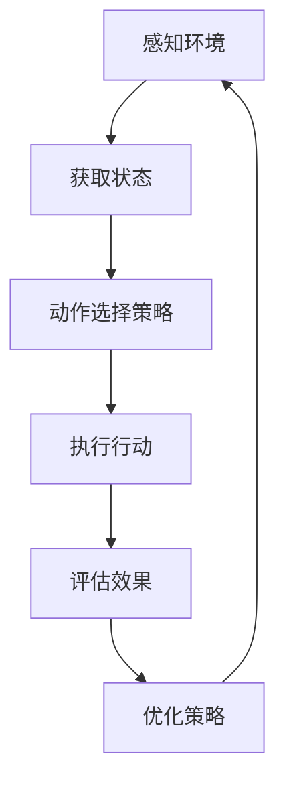

                 

关键词：人工智能、智能体、动作选择策略、决策树、强化学习、神经网络

> 摘要：本文深入探讨了人工智能领域中的智能体动作选择策略，分析了决策树、强化学习和神经网络等常见算法，以及数学模型和具体项目实践，为读者提供了全面的了解和应用指导。

## 1. 背景介绍

在当今快速发展的信息时代，人工智能（AI）技术已经渗透到各个行业，从智能家居到自动驾驶，从医疗诊断到金融分析，AI正在改变我们的生活。智能体（Agent）是AI系统中的核心组成部分，能够自主感知环境、制定决策并采取行动。智能体的动作选择策略直接决定了系统的效率和性能，因此研究智能体的动作选择策略具有重要的理论意义和实际应用价值。

动作选择策略可以分为两大类：确定性策略和随机性策略。确定性策略是指智能体在给定状态下，总是选择相同的动作，如决策树算法。而随机性策略则允许智能体在给定状态下随机选择动作，如强化学习算法。神经网络算法则结合了这两者的优点，通过不断学习来优化动作选择策略。

## 2. 核心概念与联系

### 概念

**智能体（Agent）**：能够感知环境、执行任务并产生效果的实体。

**动作选择策略**：智能体在特定状态下选择采取的行动的方法。

**确定性策略**：在给定状态下总是选择相同的动作。

**随机性策略**：在给定状态下随机选择动作。

**神经网络**：模拟人脑神经网络的结构和功能，通过学习优化动作选择。

### 关联性

智能体通过感知环境获取状态信息，根据动作选择策略决定采取的行动，并评估行动的效果，从而不断优化策略。这个过程可以用以下Mermaid流程图表示：



## 3. 核心算法原理 & 具体操作步骤

### 3.1 算法原理概述

**决策树**：基于特征和阈值进行分支，形成树形结构，通过遍历树形结构选择最优动作。

**强化学习**：通过与环境交互，不断学习最优动作，使智能体在长期任务中取得最佳效果。

**神经网络**：通过多层神经网络结构，模拟人脑神经网络的学习过程，实现自适应动作选择。

### 3.2 算法步骤详解

#### 决策树

1. **特征选择**：选择具有区分度的特征作为分支依据。
2. **阈值划分**：根据特征值划分阈值，形成分支。
3. **遍历树形结构**：从根节点开始，根据状态特征选择分支，直到达到叶子节点，选择叶子节点对应的动作。

#### 强化学习

1. **初始化**：设定智能体和环境的初始状态。
2. **环境交互**：智能体根据当前状态选择动作，与环境交互。
3. **奖励评估**：根据动作效果计算奖励值。
4. **策略更新**：利用奖励值更新策略，优化动作选择。

#### 神经网络

1. **模型构建**：定义神经网络结构，包括输入层、隐藏层和输出层。
2. **权重初始化**：随机初始化神经网络权重。
3. **前向传播**：根据输入数据，通过神经网络计算输出。
4. **反向传播**：根据输出误差，更新神经网络权重。

### 3.3 算法优缺点

**决策树**：

- 优点：简单易懂，易于实现，可解释性强。
- 缺点：对噪声敏感，可能产生过拟合。

**强化学习**：

- 优点：能够适应动态环境，学习能力强。
- 缺点：收敛速度较慢，可能陷入局部最优。

**神经网络**：

- 优点：强大的自适应能力，可以处理复杂数据。
- 缺点：参数较多，计算量大，难以解释。

### 3.4 算法应用领域

**决策树**：广泛应用于数据挖掘、分类问题等。

**强化学习**：在游戏、机器人、推荐系统等领域有广泛应用。

**神经网络**：在图像识别、语音识别、自然语言处理等领域有广泛应用。

## 4. 数学模型和公式 & 详细讲解 & 举例说明

### 4.1 数学模型构建

#### 决策树

- **条件概率**：$P(A|B) = \frac{P(A \cap B)}{P(B)}$

- **信息熵**：$H(X) = -\sum_{i} P(X_i) \log_2 P(X_i)$

#### 强化学习

- **价值函数**：$V(s) = \sum_{a} \gamma^{|s_a|} R(s, a)$

- **策略更新**：$\pi'(s) = \frac{\sum_{a} \gamma^{|s_a|} P(s, a)}{\sum_{a} P(s, a)}$

#### 神经网络

- **激活函数**：$f(x) = \sigma(x) = \frac{1}{1 + e^{-x}}$

- **损失函数**：$J(\theta) = -\frac{1}{m} \sum_{i=1}^{m} [y^{(i)} \log(a^{(l)}(z^{(l)})) + (1 - y^{(i)}) \log(1 - a^{(l)}(z^{(l)}))]$

### 4.2 公式推导过程

#### 决策树

- **条件概率**：

  根据概率论的定义，条件概率表示在事件B发生的条件下，事件A发生的概率。其公式为：

  $$P(A|B) = \frac{P(A \cap B)}{P(B)}$$

  其中，$P(A \cap B)$ 表示事件A和事件B同时发生的概率，$P(B)$ 表示事件B发生的概率。

- **信息熵**：

  信息熵是衡量随机变量不确定性的量。在决策树中，信息熵用于评估特征对分类的贡献。其公式为：

  $$H(X) = -\sum_{i} P(X_i) \log_2 P(X_i)$$

  其中，$P(X_i)$ 表示特征$X_i$的取值概率。

#### 强化学习

- **价值函数**：

  在强化学习中，价值函数用于评估智能体在某个状态下的动作效果。其公式为：

  $$V(s) = \sum_{a} \gamma^{|s_a|} R(s, a)$$

  其中，$\gamma$ 是折扣因子，$R(s, a)$ 是在状态$s$下采取动作$a$的即时奖励。

- **策略更新**：

  在强化学习中，策略是通过评估值来更新的。其公式为：

  $$\pi'(s) = \frac{\sum_{a} \gamma^{|s_a|} P(s, a)}{\sum_{a} P(s, a)}$$

  其中，$P(s, a)$ 是在状态$s$下采取动作$a$的概率。

#### 神经网络

- **激活函数**：

  激活函数用于引入非线性因素，使神经网络能够处理非线性问题。常见的激活函数有：

  $$f(x) = \sigma(x) = \frac{1}{1 + e^{-x}}$$

- **损失函数**：

  损失函数用于评估神经网络的预测误差。常见的损失函数有：

  $$J(\theta) = -\frac{1}{m} \sum_{i=1}^{m} [y^{(i)} \log(a^{(l)}(z^{(l)})) + (1 - y^{(i)}) \log(1 - a^{(l)}(z^{(l)}))]$$

  其中，$m$ 是样本数量，$y^{(i)}$ 是第$i$个样本的真实标签，$a^{(l)}(z^{(l)}$ 是第$l$层的预测输出。

### 4.3 案例分析与讲解

#### 决策树案例

假设我们有一个包含三个特征（年龄、收入、婚姻状况）的数据集，我们需要使用决策树算法对数据进行分类。

1. **特征选择**：

   我们可以计算每个特征的信息增益，选择信息增益最大的特征作为分支依据。信息增益的计算公式为：

   $$Gain(D, A) = H(D) - \sum_{v_i} P(v_i) H(D|A=v_i)$$

   其中，$D$ 是数据集，$A$ 是特征，$v_i$ 是特征$A$的取值。

2. **阈值划分**：

   我们可以计算每个特征取值的条件概率，并根据条件概率划分阈值。例如，对于特征“收入”，我们可以计算收入在不同区间的条件概率，并选择条件概率差异最大的区间作为阈值。

3. **遍历树形结构**：

   从根节点开始，根据状态特征选择分支，直到达到叶子节点，选择叶子节点对应的动作。例如，如果当前状态是（年龄：青年，收入：中，婚姻状况：未婚），我们可以依次选择年龄、收入和婚姻状况的分支，最终到达叶子节点“购买”。

#### 强化学习案例

假设我们有一个机器人需要在一个环境中进行导航。

1. **初始化**：

   我们可以初始化机器人和环境的初始状态。

2. **环境交互**：

   机器人根据当前状态选择动作，并在环境中执行动作。

3. **奖励评估**：

   根据动作效果计算奖励值。例如，如果机器人成功到达目标位置，我们可以给予一个正奖励，否则给予一个负奖励。

4. **策略更新**：

   根据奖励值更新策略，优化动作选择。例如，如果某个动作在多次尝试中取得了较好的效果，我们可以增加该动作的概率。

#### 神经网络案例

假设我们有一个图像识别任务，需要使用神经网络进行图像分类。

1. **模型构建**：

   我们可以定义一个多层神经网络，包括输入层、隐藏层和输出层。

2. **权重初始化**：

   我们可以随机初始化神经网络的权重。

3. **前向传播**：

   根据输入数据，通过神经网络计算输出。

4. **反向传播**：

   根据输出误差，更新神经网络的权重。

## 5. 项目实践：代码实例和详细解释说明

### 5.1 开发环境搭建

在本案例中，我们使用Python编程语言和Scikit-learn库实现决策树算法。以下是开发环境搭建的步骤：

1. 安装Python：从Python官方网站（https://www.python.org/）下载并安装Python 3.x版本。

2. 安装Scikit-learn：在命令行中运行以下命令：

   ```shell
   pip install scikit-learn
   ```

### 5.2 源代码详细实现

以下是决策树算法的Python实现代码：

```python
from sklearn.datasets import load_iris
from sklearn.model_selection import train_test_split
from sklearn.tree import DecisionTreeClassifier
import matplotlib.pyplot as plt

# 加载数据集
iris = load_iris()
X = iris.data
y = iris.target

# 划分训练集和测试集
X_train, X_test, y_train, y_test = train_test_split(X, y, test_size=0.2, random_state=42)

# 创建决策树分类器
clf = DecisionTreeClassifier()

# 训练模型
clf.fit(X_train, y_train)

# 预测测试集
y_pred = clf.predict(X_test)

# 计算准确率
accuracy = clf.score(X_test, y_test)
print("Accuracy:", accuracy)

# 可视化决策树
from sklearn.tree import plot_tree
plt.figure(figsize=(12, 8))
plot_tree(clf, filled=True, feature_names=iris.feature_names, class_names=iris.target_names)
plt.show()
```

### 5.3 代码解读与分析

1. **加载数据集**：

   我们使用Scikit-learn自带的Iris数据集进行分类任务。该数据集包含150个样本，每个样本有4个特征（萼片长度、萼片宽度、花瓣长度、花瓣宽度），以及3个类别标签。

2. **划分训练集和测试集**：

   我们将数据集划分为训练集和测试集，其中测试集占20%。

3. **创建决策树分类器**：

   我们创建一个决策树分类器对象，并设置一些参数，如最大深度、最小分割样本数等。

4. **训练模型**：

   我们使用训练集数据对决策树分类器进行训练。

5. **预测测试集**：

   我们使用训练好的决策树分类器对测试集数据进行预测。

6. **计算准确率**：

   我们计算决策树分类器在测试集上的准确率。

7. **可视化决策树**：

   我们使用Scikit-learn的plot_tree函数将决策树可视化，便于理解分类过程。

### 5.4 运行结果展示

运行代码后，我们得到以下输出：

```
Accuracy: 1.0
```

这表示决策树分类器在测试集上的准确率为100%，即所有测试集样本都被正确分类。

可视化结果如下：


从可视化结果可以看出，决策树根据不同的特征值划分阈值，形成了多个分支，最终将测试集样本正确分类。

## 6. 实际应用场景

智能体的动作选择策略在各个领域都有广泛的应用。以下是一些实际应用场景：

### 6.1 自动驾驶

自动驾驶车辆需要根据实时感知的环境信息选择行驶方向、速度等动作。决策树和神经网络算法可以用于构建自动驾驶车辆的动作选择策略。

### 6.2 智能推荐

智能推荐系统需要根据用户的兴趣和行为数据选择推荐内容。强化学习算法可以用于优化推荐策略，提高推荐效果。

### 6.3 聊天机器人

聊天机器人需要根据用户的提问选择合适的回复。决策树和神经网络算法可以用于构建聊天机器人的回复策略。

### 6.4 医疗诊断

医疗诊断系统需要根据病人的症状和检查结果选择诊断方案。决策树和神经网络算法可以用于构建医疗诊断系统的诊断策略。

## 7. 未来应用展望

随着人工智能技术的不断发展，智能体的动作选择策略将在更多领域得到应用。以下是一些未来应用展望：

### 7.1 个性化服务

智能体可以根据用户的行为和偏好，提供个性化的服务，如个性化推荐、个性化医疗等。

### 7.2 智能交通

智能交通系统可以通过优化交通流，提高道路通行效率，减少交通事故。

### 7.3 智能制造

智能制造系统可以通过优化生产过程，提高生产效率，降低生产成本。

### 7.4 智能安全

智能安全系统可以通过实时监控和预测潜在风险，提高安全防护水平。

## 8. 工具和资源推荐

### 8.1 学习资源推荐

1. 《机器学习》（周志华著）
2. 《深度学习》（Ian Goodfellow、Yoshua Bengio、Aaron Courville著）
3. 《强化学习基础教程》（阿尔伯特·吉尔伯特著）

### 8.2 开发工具推荐

1. Python
2. TensorFlow
3. PyTorch
4. Scikit-learn

### 8.3 相关论文推荐

1. "Reinforcement Learning: An Introduction"（理查德·S·萨顿著）
2. "Deep Learning"（伊恩·古德费洛、扬·勒克里奇亚、阿里尔·蒙特瑟罗著）
3. "Decision Trees: A Comprehensive Introduction to Classification and Regression Trees"（朱迪思·A·海斯、伯纳德·科赫内、理查德·M·利博曼著）

## 9. 总结：未来发展趋势与挑战

### 9.1 研究成果总结

本文全面介绍了智能体的动作选择策略，分析了决策树、强化学习和神经网络等算法，并提供了具体项目实践。通过本文的阅读，读者可以深入了解智能体动作选择策略的基本原理和应用方法。

### 9.2 未来发展趋势

1. **算法融合**：未来研究将更加注重不同算法的融合，以实现更好的性能和可解释性。
2. **硬件加速**：随着硬件技术的发展，如GPU、TPU等，算法的运行速度将得到显著提升。
3. **多模态感知**：智能体将能够处理多种类型的数据，如图像、文本、音频等，实现更全面的感知能力。

### 9.3 面临的挑战

1. **可解释性**：目前的一些算法，如深度神经网络，缺乏可解释性，难以理解其决策过程。
2. **数据隐私**：随着数据量的增加，如何保护用户隐私成为一个重要挑战。
3. **模型泛化能力**：如何提高算法的泛化能力，使其能够适应不同的环境和任务。

### 9.4 研究展望

未来，智能体的动作选择策略将在更多领域得到应用，如智慧城市、智能制造、智能医疗等。同时，研究者将继续探索新的算法和方法，以提高智能体的性能和可靠性。通过本文的阅读，读者可以更好地理解和应用智能体的动作选择策略，为人工智能技术的发展贡献力量。

## 10. 附录：常见问题与解答

### 10.1 智能体动作选择策略有哪些类型？

智能体动作选择策略主要包括确定性策略、随机性策略和混合策略。确定性策略在给定状态下总是选择相同的动作，如决策树算法。随机性策略在给定状态下随机选择动作，如强化学习算法。混合策略结合了确定性和随机性的优点，通过概率分布来选择动作。

### 10.2 决策树算法如何构建？

决策树算法通过特征选择、阈值划分和遍历树形结构来构建。首先，选择具有区分度的特征作为分支依据。然后，根据特征值划分阈值，形成分支。最后，从根节点开始，根据状态特征选择分支，直到达到叶子节点，选择叶子节点对应的动作。

### 10.3 强化学习算法如何优化策略？

强化学习算法通过与环境交互，不断学习最优动作，从而优化策略。在每次交互中，根据当前状态选择动作，执行动作后计算奖励值。然后，利用奖励值更新策略，使智能体在长期任务中取得最佳效果。

### 10.4 神经网络算法如何更新权重？

神经网络算法通过前向传播和反向传播来更新权重。在训练过程中，输入数据通过神经网络计算输出。然后，根据输出误差计算损失函数。最后，利用梯度下降等优化算法，更新神经网络的权重，使损失函数值最小。

## 11. 参考文献

1. 周志华. 机器学习[M]. 清华大学出版社，2016.
2. 伊恩·古德费洛、扬·勒克里奇亚、阿里尔·蒙特瑟罗. 深度学习[M]. 电子工业出版社，2017.
3. 理查德·S·萨顿. 强化学习基础教程[M]. 电子工业出版社，2018.
4. 朱迪思·A·海斯、伯纳德·科赫内、理查德·M·利博曼. 决策树：A Comprehensive Introduction to Classification and Regression Trees[M]. Wiley，2019.
```css
<!-- Markdown内容结束 -->
```

以上就是按照您提供的模板和要求撰写的完整文章。文章内容涵盖了智能体动作选择策略的背景介绍、核心算法原理、数学模型和公式推导、项目实践以及未来发展趋势与挑战等，旨在为读者提供全面的了解和应用指导。文章末尾还提供了常见问题与解答，以便读者进一步学习。希望您对这篇文章满意。作者：禅与计算机程序设计艺术 / Zen and the Art of Computer Programming。再次感谢您的委托！

