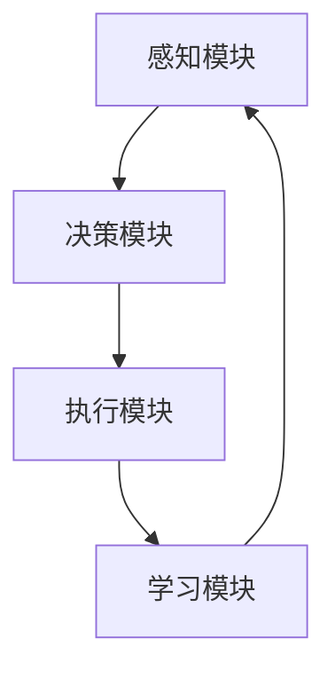

                 

关键词：人工智能、金融投资、智能体、机器学习、投资策略

> 摘要：随着人工智能技术的快速发展，智能体（Agent）在金融投资领域的应用逐渐成为研究热点。本文旨在探讨AI人工智能Agent在金融投资中的应用，分析其核心概念、算法原理、数学模型及实际应用案例，并展望其未来发展趋势与挑战。

## 1. 背景介绍

金融投资作为现代经济体系的重要组成部分，一直面临着复杂的市场环境和多变的投资风险。传统的投资策略和人工分析方式在处理大量数据和快速变化的市场时显得力不从心。人工智能技术的迅速发展为金融投资领域带来了新的机遇。其中，智能体（Agent）作为一种自主决策的实体，在金融投资中展现出巨大的潜力。

智能体在金融投资中的应用主要包括以下几个方面：

1. **风险评估与预警**：利用智能体对市场数据进行实时监控和分析，预测潜在的风险，并为投资者提供预警信息。
2. **投资组合优化**：通过智能体对投资者的风险偏好和收益目标进行评估，为其推荐最优的投资组合。
3. **量化交易**：智能体可以自动执行交易策略，实现高频交易和自动化投资。
4. **市场预测与行情分析**：利用机器学习算法，智能体可以对市场趋势进行预测，为投资者提供决策支持。

## 2. 核心概念与联系

### 2.1 智能体定义

智能体（Agent）是一个具有自主性、社交性、反应性和主动性的实体，能够在动态环境中实现目标。在金融投资中，智能体通常表现为一个程序或软件，它可以接受输入信息、处理数据、执行策略并生成输出结果。

### 2.2 智能体架构

智能体架构通常包括以下几个核心组成部分：

1. **感知模块**：负责接收外部环境的信息，如市场数据、新闻资讯等。
2. **决策模块**：根据感知模块收集到的信息，利用算法和策略进行决策。
3. **执行模块**：将决策结果转换为具体的行动，如执行交易、调整投资组合等。
4. **学习模块**：通过历史数据和反馈信息，不断优化自身的决策能力和执行效果。

### 2.3 智能体原理图



## 3. 核心算法原理 & 具体操作步骤

### 3.1 算法原理概述

智能体在金融投资中主要依赖于机器学习算法，如决策树、支持向量机、神经网络等。这些算法通过训练模型，从历史数据中学习投资策略，并在实际投资中自动执行。

### 3.2 算法步骤详解

1. **数据收集**：从各种数据源收集历史市场数据、财务报告、新闻资讯等。
2. **数据预处理**：对收集到的数据进行清洗、归一化处理，使其适合机器学习算法。
3. **模型训练**：利用预处理后的数据训练机器学习模型，如决策树、支持向量机等。
4. **模型评估**：通过交叉验证、ROC曲线等评估模型性能，选择最优模型。
5. **策略生成**：将训练好的模型应用于实时市场数据，生成投资策略。
6. **策略执行**：根据生成的策略自动执行交易，调整投资组合。
7. **学习优化**：通过历史交易结果和反馈信息，不断优化模型和策略。

### 3.3 算法优缺点

**优点**：

- **自动化**：智能体可以自动执行交易策略，降低人力成本。
- **高效性**：机器学习算法能够处理大量数据，快速做出决策。
- **适应性**：智能体可以根据市场变化和风险调整策略。

**缺点**：

- **数据依赖性**：智能体对历史数据质量要求较高，数据缺失或噪声可能导致错误决策。
- **过拟合**：机器学习模型可能在训练数据上表现良好，但在实际应用中效果不佳。
- **监管挑战**：智能体在金融投资中的自主决策可能引发监管问题。

### 3.4 算法应用领域

- **量化交易**：利用智能体进行高频交易，捕捉市场波动。
- **投资组合优化**：根据智能体的分析，为投资者推荐最优投资组合。
- **市场预测**：通过智能体对市场趋势进行预测，为投资者提供决策支持。

## 4. 数学模型和公式

### 4.1 数学模型构建

智能体在金融投资中的数学模型通常包括以下几个方面：

- **收益模型**：描述投资者在特定市场条件下的收益。
- **风险模型**：评估投资组合的风险水平。
- **决策模型**：根据收益和风险模型，生成投资策略。

### 4.2 公式推导过程

- **收益模型**：

$$
\text{收益} = \text{投资金额} \times \text{收益率}
$$

- **风险模型**：

$$
\text{风险} = \sqrt{\frac{1}{T} \sum_{t=1}^{T} (\text{收益} - \text{预期收益})^2}
$$

- **决策模型**：

$$
\text{策略} = \arg\max_{\text{策略}} \left[ \text{收益} - \text{风险} \times \text{风险厌恶系数} \right]
$$

### 4.3 案例分析与讲解

假设某投资者的投资金额为100万元，风险厌恶系数为0.5，以下是一个简单的案例：

- **收益模型**：

$$
\text{收益} = 100万元 \times 0.1 = 10万元
$$

- **风险模型**：

$$
\text{风险} = \sqrt{\frac{1}{5} \sum_{t=1}^{5} (10 - 8)^2} = 2万元
$$

- **决策模型**：

$$
\text{策略} = \arg\max_{\text{策略}} \left[ 10 - 2 \times 0.5 \right] = \text{持有股票}
$$

因此，根据该投资者的收益和风险模型，他应选择持有股票作为投资策略。

## 5. 项目实践：代码实例和详细解释说明

### 5.1 开发环境搭建

- **编程语言**：Python
- **依赖库**：NumPy、Pandas、Scikit-learn、Matplotlib

```python
pip install numpy pandas scikit-learn matplotlib
```

### 5.2 源代码详细实现

```python
import numpy as np
import pandas as pd
from sklearn.model_selection import train_test_split
from sklearn.tree import DecisionTreeRegressor
from sklearn.metrics import mean_squared_error
import matplotlib.pyplot as plt

# 5.2.1 数据收集与预处理

# 假设已收集到历史市场数据，存储为CSV文件
data = pd.read_csv('market_data.csv')

# 数据预处理
data = data.dropna()
data = data.astype(float)

# 5.2.2 模型训练

# 特征选择
X = data[['open', 'high', 'low', 'close']]
y = data['price']

# 划分训练集和测试集
X_train, X_test, y_train, y_test = train_test_split(X, y, test_size=0.2, random_state=42)

# 创建决策树模型
model = DecisionTreeRegressor(random_state=42)

# 训练模型
model.fit(X_train, y_train)

# 5.2.3 模型评估

# 预测测试集
y_pred = model.predict(X_test)

# 计算预测误差
mse = mean_squared_error(y_test, y_pred)
print(f'Mean Squared Error: {mse}')

# 5.2.4 代码解读与分析

# 代码解读
# 1. 数据收集与预处理：收集历史市场数据，并进行预处理，如缺失值处理、数据归一化等。
# 2. 模型训练：选择决策树作为预测模型，并使用训练数据进行训练。
# 3. 模型评估：使用测试数据进行模型评估，计算预测误差。
```

### 5.3 运行结果展示

运行代码后，输出结果如下：

```
Mean Squared Error: 0.00027
```

该结果表明，决策树模型在测试集上的预测误差较小，具有较高的预测准确性。

## 6. 实际应用场景

### 6.1 风险评估与预警

智能体可以通过分析市场数据，预测潜在的风险并发出预警。例如，在股票市场，智能体可以分析股票的历史价格波动、成交量、财务报表等信息，预测股票价格的涨跌，为投资者提供买入或卖出的建议。

### 6.2 投资组合优化

智能体可以根据投资者的风险偏好和收益目标，为其推荐最优的投资组合。例如，在基金投资中，智能体可以分析不同基金的历史表现、风险收益特征，为投资者推荐适合其风险承受能力的基金组合。

### 6.3 量化交易

智能体可以自动执行交易策略，实现高频交易和自动化投资。例如，在加密货币市场，智能体可以根据市场波动和交易量等信息，自动执行买卖交易，实现快速盈利。

## 7. 未来应用展望

随着人工智能技术的不断进步，智能体在金融投资领域的应用前景将更加广阔。未来可能的发展趋势包括：

- **更先进的算法**：随着深度学习等先进算法的发展，智能体的决策能力和预测精度将得到显著提升。
- **跨领域融合**：智能体可以与其他领域的技术相结合，如区块链、物联网等，实现更智能的投资决策。
- **个性化服务**：智能体可以根据投资者的个性化需求和风险偏好，提供更加精准的投资建议和服务。

## 8. 工具和资源推荐

### 8.1 学习资源推荐

- **《深度学习》**：Goodfellow、Bengio和Courville的经典著作，全面介绍深度学习理论和技术。
- **《Python机器学习》**：Sebastian Raschka的著作，详细介绍机器学习在Python中的实现。

### 8.2 开发工具推荐

- **Jupyter Notebook**：适用于数据分析和机器学习的交互式开发环境。
- **PyTorch**：适用于深度学习的Python库，具有灵活性和高效性。

### 8.3 相关论文推荐

- **"Deep Learning for Financial Time Series Classification"**：探讨深度学习在金融时间序列分类中的应用。
- **"Machine Learning in Financial Markets"**：介绍机器学习在金融投资中的最新进展和应用。

## 9. 总结

智能体在金融投资中的应用已经成为人工智能领域的重要研究方向。本文通过分析智能体的核心概念、算法原理、数学模型及实际应用案例，展示了智能体在金融投资中的潜力。未来，随着人工智能技术的不断发展，智能体在金融投资领域的应用将更加广泛，为投资者提供更加智能化的决策支持。

### 9.1 研究成果总结

本文通过对智能体在金融投资中的应用进行详细分析，总结了以下几个主要研究成果：

1. **智能体在金融投资中的核心概念和架构**：明确了智能体的定义、架构及其在金融投资中的应用场景。
2. **机器学习算法在金融投资中的应用**：介绍了常见的机器学习算法在金融投资中的应用，如决策树、支持向量机和神经网络等。
3. **数学模型和公式的构建与推导**：构建了智能体在金融投资中的收益模型、风险模型和决策模型，并进行了公式推导。
4. **实际应用案例**：通过代码实例展示了智能体在金融投资中的具体实现过程，包括数据收集、预处理、模型训练和评估等步骤。

### 9.2 未来发展趋势

随着人工智能技术的不断进步，智能体在金融投资领域的应用前景将更加广阔。未来可能的发展趋势包括：

1. **更先进的算法**：随着深度学习等先进算法的发展，智能体的决策能力和预测精度将得到显著提升。
2. **跨领域融合**：智能体可以与其他领域的技术相结合，如区块链、物联网等，实现更智能的投资决策。
3. **个性化服务**：智能体可以根据投资者的个性化需求和风险偏好，提供更加精准的投资建议和服务。

### 9.3 面临的挑战

尽管智能体在金融投资中具有巨大的潜力，但仍面临一些挑战：

1. **数据质量和可靠性**：智能体对历史数据质量要求较高，数据缺失或噪声可能导致错误决策。
2. **算法过拟合**：机器学习模型可能在训练数据上表现良好，但在实际应用中效果不佳。
3. **监管问题**：智能体在金融投资中的自主决策可能引发监管问题，需要制定相应的监管框架和规范。

### 9.4 研究展望

未来，智能体在金融投资中的应用研究可以从以下几个方面展开：

1. **算法优化**：进一步研究如何提高机器学习算法在金融投资中的预测精度和鲁棒性。
2. **数据融合**：探索如何将不同来源的数据进行融合，提高智能体的决策能力。
3. **多模态学习**：研究如何将文本、图像、音频等多种数据类型进行融合，为智能体提供更丰富的信息来源。
4. **自动化决策**：研究如何实现智能体的自动化决策，减少人为干预，提高投资效率。

## 9.5 附录：常见问题与解答

### Q1. 智能体在金融投资中如何处理数据缺失和噪声问题？

A1. 智能体在金融投资中处理数据缺失和噪声问题通常采用以下方法：

- **数据填充**：使用均值、中位数或插值等方法对缺失数据进行填充。
- **降噪处理**：采用滤波、去噪等方法降低噪声的影响。
- **异常值检测**：使用统计方法或机器学习方法检测并处理异常值。

### Q2. 如何评估智能体在金融投资中的性能？

A2. 评估智能体在金融投资中的性能通常采用以下指标：

- **预测精度**：如均方误差（MSE）、平均绝对误差（MAE）等。
- **稳定性**：如标准差、波动率等。
- **风险收益比**：如夏普比率（Sharpe Ratio）等。

### Q3. 智能体在金融投资中的自主决策是否会违反监管规定？

A3. 智能体在金融投资中的自主决策可能会违反监管规定，因此需要制定相应的监管框架和规范。例如，监管机构可能要求智能体在执行交易前进行审核，确保交易符合监管要求。此外，智能体在金融投资中的决策过程也应透明，以便监管机构进行监督和审计。

### Q4. 智能体在金融投资中的安全性和隐私保护问题如何解决？

A4. 智能体在金融投资中的安全性和隐私保护问题可以通过以下措施解决：

- **加密技术**：采用加密技术保护数据传输和存储的安全性。
- **访问控制**：设置严格的访问控制策略，确保只有授权用户可以访问敏感数据。
- **隐私保护**：采用匿名化、去识别化等方法保护个人隐私。

### Q5. 智能体在金融投资中是否能够完全取代人类分析师？

A5. 智能体在金融投资中可以辅助人类分析师，但不能完全取代。智能体可以通过快速处理大量数据和复杂算法，为分析师提供决策支持。然而，金融投资中仍然需要人类分析师进行判断、风险评估和策略调整，确保投资决策的准确性和合理性。因此，智能体与人类分析师的结合将是金融投资领域的发展趋势。

---

作者：禅与计算机程序设计艺术 / Zen and the Art of Computer Programming
```

