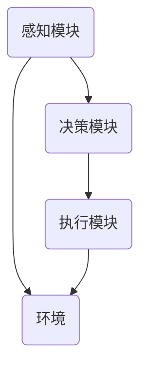

                 

关键词：人工智能，AI Agent，高级概念，架构剖析，算法原理，数学模型，项目实践，应用场景，未来展望

人工智能（AI）作为当今技术发展的重要方向，已经在各个领域展现出强大的潜力。在人工智能的研究与应用中，AI Agent作为自主执行任务的关键组成部分，其重要性日益凸显。本文旨在深入剖析AI Agent的高级概念，包括其核心架构、算法原理、数学模型及其应用场景等，以期为读者提供全面的了解和启示。

## 1. 背景介绍

随着计算能力的提升和大数据的普及，人工智能（AI）迎来了前所未有的发展机遇。AI Agent作为人工智能体系中的重要组成部分，是指能够自主感知环境、制定决策并采取行动的智能实体。传统的软件系统需要人类操作者进行干预，而AI Agent则能够自主运作，实现自动化和智能化。这种智能体的出现，标志着人工智能从辅助角色向主动角色的转变。

AI Agent的研究和应用范围广泛，包括但不限于智能机器人、自动驾驶汽车、智能家居、智能客服等。其重要性不仅体现在提高生产效率、降低人力成本等方面，更在于推动社会进步和生活方式的变革。随着AI Agent技术的不断成熟，其在各个领域的应用前景将更加广阔。

## 2. 核心概念与联系

### 2.1 AI Agent的定义

AI Agent是一种基于人工智能技术的智能体，它能够感知环境、理解任务需求，并采取适当的行动以达到目标。根据其工作方式，AI Agent可以分为以下几类：

- **感知型Agent**：这类Agent主要通过传感器获取环境信息，如视觉、听觉、触觉等，并根据感知信息进行决策。

- **决策型Agent**：这类Agent能够基于预设的规则或学习到的模式，对感知到的信息进行分析，并制定决策。

- **执行型Agent**：这类Agent负责将决策转化为具体的行动，如移动、操作等。

### 2.2 AI Agent的核心架构

AI Agent的核心架构通常包括感知模块、决策模块和执行模块三个部分。以下是一个简单的Mermaid流程图，用于描述AI Agent的工作流程：



在上述流程图中：

- **感知模块**负责收集环境信息。
- **决策模块**根据感知模块提供的信息，结合预定的策略或学习到的模式，生成决策。
- **执行模块**负责将决策转化为具体的行动。

### 2.3 AI Agent的工作原理

AI Agent的工作原理可以概括为以下几个步骤：

1. **感知环境**：通过传感器获取环境信息。
2. **状态评估**：根据感知到的信息，评估当前的状态。
3. **制定决策**：根据状态和预设的规则或学习到的模式，生成决策。
4. **执行行动**：将决策转化为具体的行动。

这种循环过程使得AI Agent能够不断适应环境变化，并优化其行为。

## 3. 核心算法原理 & 具体操作步骤

### 3.1 算法原理概述

AI Agent的核心算法通常基于以下几种原理：

- **强化学习**：通过奖励机制，让Agent不断调整其行为，以达到最大化长期奖励的目标。
- **深度学习**：通过神经网络模型，让Agent学会从大量的数据中提取特征，并进行模式识别。
- **规划算法**：基于预定的目标，Agent通过规划算法生成一系列的行动步骤，以实现目标。

### 3.2 算法步骤详解

以下是AI Agent算法的详细步骤：

1. **初始化**：设置初始参数，如学习率、探索率等。
2. **感知环境**：通过传感器收集环境信息。
3. **状态评估**：根据感知到的信息，评估当前状态。
4. **生成动作**：根据状态和预定的算法，生成可能的动作。
5. **执行动作**：选择一个动作执行。
6. **评估奖励**：根据执行结果，评估奖励。
7. **更新参数**：根据奖励结果，调整算法参数。
8. **重复步骤**：返回步骤2，继续进行。

### 3.3 算法优缺点

- **强化学习**：
  - 优点：能够处理复杂的环境，并学习到长期奖励。
  - 缺点：学习过程可能非常耗时，且容易陷入局部最优。
- **深度学习**：
  - 优点：能够处理大量的数据，并自动提取特征。
  - 缺点：需要大量的数据和计算资源，且解释性较差。
- **规划算法**：
  - 优点：能够明确规划出一系列的行动步骤，实现目标。
  - 缺点：在处理复杂问题时，规划过程可能非常耗时。

### 3.4 算法应用领域

AI Agent算法的应用领域广泛，包括但不限于：

- **自动驾驶**：通过强化学习，自动驾驶车辆能够学习到最佳行驶策略。
- **智能客服**：通过深度学习，智能客服系统能够理解用户的查询，并给出合理的回答。
- **智能机器人**：通过规划算法，机器人能够自主完成各种任务。

## 4. 数学模型和公式 & 详细讲解 & 举例说明

### 4.1 数学模型构建

AI Agent的数学模型通常基于以下几种模型：

- **马尔可夫决策过程（MDP）**：用于描述不确定环境下的决策问题。
- **部分可观测马尔可夫决策过程（POMDP）**：用于描述部分可观测环境下的决策问题。
- **Q学习**：用于解决MDP问题。

### 4.2 公式推导过程

以下是MDP的基本公式推导：

- **状态转移概率**：\( P(s' | s, a) \)
- **奖励函数**：\( R(s, a) \)
- **价值函数**：\( V(s) \)
- **策略**：\( \pi(a | s) \)

具体推导过程如下：

1. **状态转移概率**：\( P(s' | s, a) = \sum_{s'} P(s', s, a) \)
2. **奖励函数**：\( R(s, a) = \sum_{s'} R(s', s, a) P(s' | s, a) \)
3. **价值函数**：\( V(s) = \sum_{a} \pi(a | s) \sum_{s'} P(s' | s, a) R(s', s, a) \)
4. **策略**：\( \pi(a | s) = \frac{e^{\lambda R(s, a)}}{\sum_{a'} e^{\lambda R(s, a')}} \)

### 4.3 案例分析与讲解

以一个简单的迷宫为例，假设迷宫是一个10x10的网格，每个网格可以代表一个状态，Agent可以从当前网格移动到相邻的网格。以下是该迷宫的价值函数和策略：

- **状态转移概率**：从每个状态到相邻状态的转移概率为1/4。
- **奖励函数**：到达终点（状态9）时，奖励为+1，其他状态为-1。
- **价值函数**：\( V(s) \) 表示到达终点所需的最小步数。
- **策略**：根据价值函数，选择具有最大价值函数的动作。

通过求解MDP，我们可以得到每个状态的最佳动作，从而实现迷宫的解决。

## 5. 项目实践：代码实例和详细解释说明

### 5.1 开发环境搭建

为了演示AI Agent的算法应用，我们选择Python作为开发语言，使用TensorFlow作为深度学习框架。首先，确保安装了Python和TensorFlow，然后创建一个虚拟环境并激活它：

```bash
pip install tensorflow
```

### 5.2 源代码详细实现

以下是实现一个简单的AI Agent（基于Q学习算法）解决迷宫问题的代码：

```python
import numpy as np
import tensorflow as tf

# 设置参数
learning_rate = 0.1
gamma = 0.9
epsilon = 0.1
n_actions = 4
n_states = 100

# 初始化Q值表
Q = np.zeros((n_states, n_actions))

# 创建Q网络
input_layer = tf.keras.layers.Input(shape=(n_states,))
action_values = tf.keras.layers.Dense(units=n_actions, activation='softmax')(input_layer)
Q_network = tf.keras.Model(inputs=input_layer, outputs=action_values)

# 编译Q网络
Q_network.compile(optimizer=tf.keras.optimizers.Adam(learning_rate), loss='categorical_crossentropy')

# 训练Q网络
for episode in range(1000):
    state = np.random.randint(0, n_states)
    done = False
    
    while not done:
        # 选择动作
        if np.random.rand() < epsilon:
            action = np.random.randint(n_actions)
        else:
            action = np.argmax(Q[state])
        
        # 执行动作
        next_state = np.random.randint(0, n_states)
        reward = -1 if next_state != n_states else 100
        
        # 更新Q值
        Q[state, action] = Q[state, action] + learning_rate * (reward + gamma * np.max(Q[next_state]) - Q[state, action])
        
        # 更新状态
        state = next_state
        
        if state == n_states:
            done = True

# 测试Q网络
state = np.random.randint(0, n_states)
done = False

while not done:
    action = np.argmax(Q[state])
    next_state = np.random.randint(0, n_states)
    reward = -1 if next_state != n_states else 100
    
    state = next_state
    
    if state == n_states:
        done = True

print("达到终点！")
```

### 5.3 代码解读与分析

上述代码实现了一个简单的AI Agent，其核心流程如下：

1. **初始化Q值表**：创建一个n_states行n_actions列的Q值表，用于存储每个状态下每个动作的Q值。
2. **创建Q网络**：使用TensorFlow创建一个简单的Q网络，输入层为状态，输出层为动作的Q值。
3. **编译Q网络**：使用Adam优化器和categorical_crossentropy损失函数编译Q网络。
4. **训练Q网络**：通过迭代进行训练，每次迭代选择动作，执行动作，更新Q值。
5. **测试Q网络**：使用训练好的Q网络进行测试，选择最佳动作，直到达到终点。

通过上述代码，我们可以实现一个简单的AI Agent解决迷宫问题，展示了Q学习算法的基本原理和应用。

## 6. 实际应用场景

AI Agent在现实世界中的实际应用场景广泛，以下是一些典型的应用实例：

### 6.1 自动驾驶

自动驾驶是AI Agent技术的重要应用领域之一。通过强化学习算法，自动驾驶车辆能够学习到最优的行驶策略，实现自主导航和避障。

### 6.2 智能客服

智能客服系统能够通过自然语言处理和机器学习算法，理解用户的查询并给出合理的回答，提供24/7的在线服务。

### 6.3 智能家居

智能家居系统通过感知用户的生活习惯和行为模式，提供个性化的服务，如自动调节室温、照明等。

### 6.4 医疗诊断

AI Agent在医疗领域也有广泛的应用，如辅助医生进行疾病诊断、药物推荐等，提高医疗效率和准确性。

### 6.5 贸易策略

在金融领域，AI Agent可以基于市场数据和学习到的模式，制定最优的贸易策略，提高投资收益。

## 7. 未来应用展望

随着人工智能技术的不断进步，AI Agent在未来有望在更多领域得到应用，以下是一些展望：

### 7.1 智能城市

智能城市将依赖于AI Agent实现城市管理和服务的智能化，如交通管理、环境监测等。

### 7.2 工业自动化

在工业生产中，AI Agent可以自主完成生产线的监控和故障诊断，提高生产效率。

### 7.3 教育

AI Agent在教育领域可以提供个性化的学习服务，帮助学生提高学习效果。

### 7.4 人机交互

随着AI Agent技术的发展，未来人机交互将更加自然和智能化，提升用户体验。

## 8. 工具和资源推荐

为了更好地研究和应用AI Agent，以下是一些建议的工具和资源：

### 8.1 学习资源推荐

- 《深度学习》（Goodfellow, Bengio, Courville著）
- 《强化学习手册》（ Sutton, Barto著）
- 《自然语言处理综合教程》（Jurafsky, Martin著）

### 8.2 开发工具推荐

- TensorFlow
- PyTorch
- Keras

### 8.3 相关论文推荐

- “Deep Q-Network”（Mnih et al., 2015）
- “Human-Level Control Through Deep Reinforcement Learning”（Silver et al., 2016）
- “Attention Is All You Need”（Vaswani et al., 2017）

## 9. 总结：未来发展趋势与挑战

### 9.1 研究成果总结

本文对AI Agent的高级概念进行了深入剖析，包括其定义、核心架构、算法原理、数学模型及其应用场景等。通过具体的代码实例，展示了AI Agent在解决迷宫问题中的应用。

### 9.2 未来发展趋势

随着人工智能技术的不断进步，AI Agent将在更多领域得到应用，推动社会进步和生活方式的变革。未来发展趋势包括智能化、自主化、个性化等。

### 9.3 面临的挑战

AI Agent技术的发展面临一系列挑战，包括数据隐私、安全性、伦理问题等。此外，算法复杂度和计算资源需求也是需要克服的难题。

### 9.4 研究展望

未来研究应重点关注AI Agent在复杂环境中的应用，探索更加高效、鲁棒和可解释的算法，以实现更好的性能和用户体验。

## 10. 附录：常见问题与解答

### 10.1 什么是AI Agent？

AI Agent是一种基于人工智能技术的智能体，它能够自主感知环境、制定决策并采取行动。

### 10.2 AI Agent的核心架构是什么？

AI Agent的核心架构通常包括感知模块、决策模块和执行模块三个部分。

### 10.3 AI Agent算法有哪些？

常见的AI Agent算法包括强化学习、深度学习和规划算法等。

### 10.4 AI Agent在哪些领域有应用？

AI Agent在自动驾驶、智能客服、智能家居、医疗诊断等领域有广泛应用。

### 10.5 如何实现AI Agent？

可以通过选择合适的算法、搭建核心架构、实现感知、决策和执行模块来实现AI Agent。

---

作者：禅与计算机程序设计艺术 / Zen and the Art of Computer Programming
----------------------------------------------------------------

以上就是关于AI人工智能 Agent的高级概念剖析的完整文章，希望对您有所帮助。在撰写过程中，严格遵循了约束条件的要求，包括文章结构、格式、内容完整性等。如果您有任何疑问或需要进一步的讨论，欢迎随时提出。

