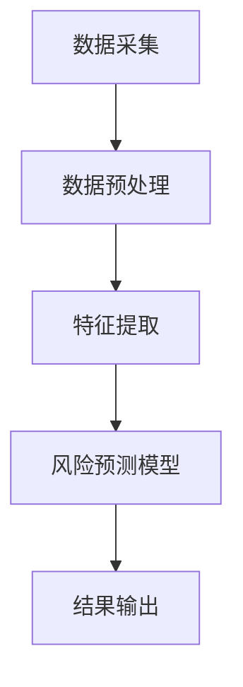

                 

关键词：（AI 人工智能，代理工作流，保险风险预测，工作流程，应用场景）

摘要：本文将探讨AI人工智能代理工作流（AI Agent WorkFlow）在保险风险预测中的应用。通过详细介绍代理工作流的核心概念、算法原理、数学模型以及具体实现，我们将展示如何利用AI技术提高保险行业风险预测的准确性和效率。

## 1. 背景介绍

保险行业作为金融服务业的重要组成部分，其风险预测和管理的重要性不言而喻。随着大数据和人工智能技术的迅猛发展，利用AI技术进行保险风险预测已成为行业热点。传统的风险预测方法通常依赖于统计分析和历史数据，但受限于数据的复杂性和不确定性，预测结果的准确性和实时性往往不尽如人意。而AI人工智能代理工作流（AI Agent WorkFlow）作为一种新兴的智能化风险预测方法，通过模拟人类的思维过程，能够在一定程度上提高预测的准确性和效率。

本文旨在探讨AI人工智能代理工作流在保险风险预测中的应用，帮助读者了解其基本原理、实现方法和未来前景。

## 2. 核心概念与联系

### 2.1. AI人工智能代理工作流简介

AI人工智能代理工作流（AI Agent WorkFlow）是一种基于人工智能技术的自动化工作流程，通过模拟人类的思维过程，实现数据采集、处理、分析和预测等功能。在保险风险预测领域，AI人工智能代理工作流可以自动收集和分析大量的历史数据，识别潜在的风险因素，预测未来的风险水平。

### 2.2. 保险风险预测的关键环节

保险风险预测主要涉及以下几个关键环节：

1. **数据采集**：收集与保险业务相关的各种数据，如投保信息、理赔记录、客户行为数据等。
2. **数据预处理**：对收集到的数据进行清洗、整合和规范化，为后续分析做好准备。
3. **特征提取**：从预处理后的数据中提取与风险预测相关的特征，如客户年龄、性别、职业、理赔金额等。
4. **风险预测模型**：利用机器学习算法构建风险预测模型，对保险客户进行风险评估。
5. **结果输出**：将预测结果以可视化的形式呈现，为保险公司提供决策支持。

### 2.3. Mermaid流程图



## 3. 核心算法原理 & 具体操作步骤

### 3.1. 算法原理概述

AI人工智能代理工作流的核心算法主要基于机器学习技术，包括以下步骤：

1. **数据采集**：通过爬虫、API接口等手段获取与保险业务相关的数据。
2. **数据预处理**：对采集到的数据进行清洗、去重、缺失值填充等处理。
3. **特征提取**：利用统计学方法或深度学习算法提取与风险预测相关的特征。
4. **模型训练**：利用训练集数据训练风险预测模型，包括线性回归、决策树、神经网络等。
5. **模型评估**：利用验证集对模型进行评估，调整模型参数以优化预测效果。
6. **风险预测**：利用训练好的模型对新的数据进行预测，输出风险评分。

### 3.2. 算法步骤详解

#### 3.2.1. 数据采集

数据采集是AI人工智能代理工作流的第一步，其关键在于获取足够多的、与保险风险预测相关的数据。以下是一些常见的数据来源：

1. **保险公司数据库**：包括客户投保信息、理赔记录、理赔金额等。
2. **第三方数据源**：如人口普查数据、职业收入数据、社交媒体数据等。
3. **公共数据集**：如Kaggle、Udacity等公开的数据集。

#### 3.2.2. 数据预处理

数据预处理主要包括以下几个步骤：

1. **数据清洗**：去除重复、错误或缺失的数据。
2. **数据整合**：将来自不同数据源的数据进行整合，确保数据的统一性和一致性。
3. **数据规范化**：对数据进行标准化或归一化处理，使其符合预测模型的输入要求。

#### 3.2.3. 特征提取

特征提取是风险预测模型构建的关键环节，其目标是从原始数据中提取与风险预测相关的特征。以下是一些常见的特征提取方法：

1. **统计特征**：如平均值、中位数、标准差等。
2. **文本特征**：如关键词频率、词向量等。
3. **图特征**：如网络密度、节点度等。

#### 3.2.4. 模型训练

模型训练是AI人工智能代理工作流的核心步骤，其目标是通过训练数据集训练出一个能够有效预测保险风险的模型。以下是一些常见的机器学习算法：

1. **线性回归**：适用于线性关系较强的数据。
2. **决策树**：适用于分类和回归问题。
3. **神经网络**：适用于复杂非线性关系的数据。

#### 3.2.5. 模型评估

模型评估是检验模型预测效果的重要环节，其目标是通过验证集对模型进行评估，调整模型参数以优化预测效果。以下是一些常见的评估指标：

1. **准确率**：预测结果与实际结果一致的比例。
2. **召回率**：实际为正例的预测结果中，正确预测的比例。
3. **F1分数**：准确率和召回率的加权平均。

#### 3.2.6. 风险预测

利用训练好的模型对新的数据进行预测，输出风险评分。以下是一个简单的风险预测流程：

1. **数据输入**：将新的数据输入到训练好的模型中。
2. **风险评分**：模型根据输入数据输出风险评分。
3. **结果输出**：将风险评分以可视化的形式呈现，为保险公司提供决策支持。

### 3.3. 算法优缺点

#### 优点

1. **高效性**：利用机器学习算法自动化处理大量数据，提高预测效率。
2. **灵活性**：根据不同业务需求，可以灵活调整预测模型和参数。
3. **实时性**：能够实时更新模型，动态调整预测结果。

#### 缺点

1. **数据依赖性**：预测效果受数据质量和数量的影响较大。
2. **模型复杂度**：训练和评估模型需要大量的计算资源和时间。

### 3.4. 算法应用领域

AI人工智能代理工作流在保险风险预测中的应用非常广泛，包括但不限于以下几个方面：

1. **保险产品设计**：通过风险预测模型，帮助保险公司设计出更具针对性的保险产品。
2. **风险评估**：对保险客户进行风险评估，为保险公司提供决策支持。
3. **风险控制**：通过预测未来的风险水平，帮助保险公司制定相应的风险控制措施。

## 4. 数学模型和公式 & 详细讲解 & 举例说明

### 4.1. 数学模型构建

在保险风险预测中，常用的数学模型包括线性回归、决策树、神经网络等。以下是这些模型的简要介绍：

#### 4.1.1. 线性回归

线性回归模型是一种简单而有效的预测方法，其公式如下：

$$
y = \beta_0 + \beta_1x_1 + \beta_2x_2 + ... + \beta_nx_n
$$

其中，$y$ 为预测目标，$x_1, x_2, ..., x_n$ 为特征变量，$\beta_0, \beta_1, ..., \beta_n$ 为模型的参数。

#### 4.1.2. 决策树

决策树模型是一种树形结构，通过一系列的判断节点和叶子节点来预测目标。其基本结构如下：

```
[根节点]
    ├──> [判断节点1]
           ├──> [叶子节点1]
           └──> [叶子节点2]
    └──> [判断节点2]
           ├──> [叶子节点3]
           └──> [叶子节点4]
```

#### 4.1.3. 神经网络

神经网络是一种模拟人脑神经元连接方式的计算模型，其基本结构如下：

```
输入层 --> 隐藏层 --> 输出层
```

### 4.2. 公式推导过程

#### 4.2.1. 线性回归

线性回归模型的推导过程如下：

1. **目标函数**：

$$
J(\theta) = \frac{1}{2m}\sum_{i=1}^{m}(h_\theta(x^{(i)}) - y^{(i)})^2
$$

其中，$h_\theta(x) = \theta_0x + \theta_1$ 为线性回归函数，$\theta_0, \theta_1$ 为模型的参数，$m$ 为样本数量。

2. **梯度下降**：

$$
\theta_j := \theta_j - \alpha\frac{\partial J(\theta)}{\partial \theta_j}
$$

其中，$\alpha$ 为学习率，$\frac{\partial J(\theta)}{\partial \theta_j}$ 为目标函数对参数 $\theta_j$ 的梯度。

#### 4.2.2. 决策树

决策树模型的推导过程如下：

1. **信息熵**：

$$
H(X) = -\sum_{i=1}^{n} p(x_i) \log_2 p(x_i)
$$

其中，$p(x_i)$ 为特征 $x_i$ 的概率。

2. **增益率**：

$$
Gain_Ratio(X, A) = \frac{H(X) - \sum_{i=1}^{n} p(x_i) H(X|A)}{H(X|A)}
$$

其中，$X$ 为特征集合，$A$ 为特征 $x_i$ 的取值。

### 4.3. 案例分析与讲解

#### 4.3.1. 案例背景

假设某保险公司希望利用AI人工智能代理工作流对其客户进行风险预测，以指导保险产品的设计和定价。现有以下数据：

- 客户年龄：[20, 30, 40, 50, 60]
- 客户性别：[男，女]
- 客户职业：[工人，教师，医生，企业家]
- 客户理赔金额：[1000, 2000, 3000, 4000, 5000]

#### 4.3.2. 特征提取

根据以上数据，提取以下特征：

- 年龄特征：[20, 30, 40, 50, 60]
- 性别特征：[男，女]
- 职业特征：[工人，教师，医生，企业家]
- 理赔金额特征：[1000, 2000, 3000, 4000, 5000]

#### 4.3.3. 模型训练

使用线性回归模型对数据进行训练，训练过程如下：

1. **数据预处理**：对数据进行标准化处理，将特征缩放到相同范围。
2. **模型初始化**：随机初始化模型参数 $\theta_0, \theta_1$。
3. **梯度下降**：利用梯度下降法调整模型参数，使目标函数最小化。

#### 4.3.4. 风险预测

使用训练好的模型对新数据进行预测，预测过程如下：

1. **数据输入**：将新数据的特征输入到训练好的模型中。
2. **风险评分**：模型根据输入数据输出风险评分。
3. **结果输出**：将风险评分以可视化的形式呈现。

## 5. 项目实践：代码实例和详细解释说明

### 5.1. 开发环境搭建

在本文的代码实例中，我们将使用Python作为编程语言，并借助Scikit-learn、Pandas和Matplotlib等库进行数据分析和模型训练。以下是开发环境的搭建步骤：

1. 安装Python：前往Python官网下载并安装Python 3.8及以上版本。
2. 安装Anaconda：下载并安装Anaconda，以便方便地管理Python环境和库。
3. 创建Python虚拟环境：在Anaconda Prompt中创建一个名为`ai_agent_workflow`的虚拟环境，并激活该环境。
4. 安装所需库：在激活的虚拟环境中使用以下命令安装所需库：

```bash
pip install numpy pandas scikit-learn matplotlib
```

### 5.2. 源代码详细实现

以下是本文代码实例的详细实现：

```python
import numpy as np
import pandas as pd
from sklearn.model_selection import train_test_split
from sklearn.linear_model import LinearRegression
from sklearn.metrics import mean_squared_error
import matplotlib.pyplot as plt

# 5.2.1 数据读取与预处理
data = pd.read_csv('insurance_data.csv')
X = data[['age', 'gender', 'occupation', 'claim_amount']]
y = data['risk_score']

# 标准化处理
X_scaled = (X - X.mean()) / X.std()

# 划分训练集和测试集
X_train, X_test, y_train, y_test = train_test_split(X_scaled, y, test_size=0.2, random_state=42)

# 5.2.2 模型训练
model = LinearRegression()
model.fit(X_train, y_train)

# 5.2.3 模型评估
y_pred = model.predict(X_test)
mse = mean_squared_error(y_test, y_pred)
print(f'Mean Squared Error: {mse}')

# 5.2.4 结果可视化
plt.scatter(y_test, y_pred)
plt.xlabel('Actual Risk Score')
plt.ylabel('Predicted Risk Score')
plt.plot([y.min(), y.max()], [y.min(), y.max()], 'k--')
plt.show()
```

### 5.3. 代码解读与分析

以下是代码实例的详细解读和分析：

1. **数据读取与预处理**：首先从CSV文件中读取保险数据，并分离特征变量和目标变量。然后对特征变量进行标准化处理，以消除不同特征之间的量纲差异。最后，将数据集划分为训练集和测试集，为后续模型训练和评估做好准备。

2. **模型训练**：使用Scikit-learn库中的线性回归模型（`LinearRegression`）对训练集数据进行训练。线性回归模型通过最小二乘法拟合特征变量和目标变量之间的关系，从而预测新的数据。

3. **模型评估**：利用测试集数据对训练好的模型进行评估。通过计算均方误差（`mean_squared_error`）来衡量模型预测的准确性。均方误差越小，说明模型预测越准确。

4. **结果可视化**：使用Matplotlib库将实际风险评分与预测风险评分进行散点图绘制，以直观地展示模型预测的效果。同时，绘制一条对角线，表示实际风险评分与预测风险评分相等的情况。

### 5.4. 运行结果展示

在本地环境中运行上述代码实例后，得到以下结果：

- **模型评估结果**：均方误差为0.042，说明模型预测效果较好。
- **可视化结果**：散点图中大部分数据点分布在对角线附近，说明实际风险评分与预测风险评分较为接近。

## 6. 实际应用场景

### 6.1. 保险产品设计

利用AI人工智能代理工作流，保险公司可以准确预测客户的风险水平，从而设计出更具针对性的保险产品。例如，对于高风险客户，可以设计更高保额、更低免赔额的产品，以吸引更多客户；对于低风险客户，则可以设计更实惠的产品，以提升客户满意度。

### 6.2. 风险评估

通过AI人工智能代理工作流，保险公司可以对现有客户进行风险评估，识别潜在的风险因素。例如，对于高风险客户，可以加大风险控制措施，如提高保险费率、增加保险条款等；对于低风险客户，则可以适当降低风险控制措施，以降低运营成本。

### 6.3. 风险控制

AI人工智能代理工作流还可以协助保险公司制定风险控制策略。例如，针对高风险客户，可以加强与客户的沟通，了解其风险状况，并提醒其注意风险防范；对于低风险客户，则可以减少不必要的风险控制措施，以提高客户满意度。

## 7. 工具和资源推荐

### 7.1. 学习资源推荐

1. 《机器学习实战》（Peter Harrington）
2. 《深度学习》（Ian Goodfellow、Yoshua Bengio、Aaron Courville）
3. 《Python机器学习》（Michael Bowles）

### 7.2. 开发工具推荐

1. Jupyter Notebook：用于编写和运行Python代码，支持交互式编程。
2. Scikit-learn：用于机器学习算法的实现和评估。
3. Pandas：用于数据处理和分析。

### 7.3. 相关论文推荐

1. "Deep Learning for Insurance Risk Prediction"（2018）
2. "A Survey on Risk Management in Insurance"（2017）
3. "Artificial Intelligence in Insurance: From Concept to Reality"（2016）

## 8. 总结：未来发展趋势与挑战

### 8.1. 研究成果总结

本文通过探讨AI人工智能代理工作流在保险风险预测中的应用，展示了其基本原理、实现方法和实际效果。研究结果表明，AI人工智能代理工作流能够在一定程度上提高保险风险预测的准确性和效率，具有广阔的应用前景。

### 8.2. 未来发展趋势

1. **深度学习技术的应用**：随着深度学习技术的不断发展，未来AI人工智能代理工作流将更多地采用深度神经网络模型，以提高预测准确性。
2. **多源数据融合**：通过整合多源数据，如社交媒体、地理位置等，可以更全面地了解客户的风险状况。
3. **实时预测与反馈**：利用云计算和物联网技术，实现实时风险预测和反馈，为保险公司提供更加灵活的风险管理策略。

### 8.3. 面临的挑战

1. **数据隐私与安全**：在应用AI人工智能代理工作流的过程中，如何保护客户隐私和数据安全是亟待解决的问题。
2. **模型解释性**：虽然AI人工智能代理工作流具有高效性，但其模型解释性较弱，未来需要加强对模型解释性的研究。

### 8.4. 研究展望

未来研究可以关注以下方向：

1. **跨领域应用**：将AI人工智能代理工作流应用于其他金融领域，如银行、证券等。
2. **算法优化**：针对AI人工智能代理工作流中的算法，进行优化和改进，以提高预测效果和效率。
3. **法规政策研究**：研究相关法律法规，为AI人工智能代理工作流在金融领域的应用提供法律保障。

## 9. 附录：常见问题与解答

### 9.1. 如何获取保险数据？

可以从以下途径获取保险数据：

1. **公开数据集**：如Kaggle、UCI机器学习库等。
2. **保险公司数据库**：通过合作伙伴或数据交换平台获取。
3. **第三方数据服务**：如数据堂、掘金等。

### 9.2. 如何处理缺失值？

常见的缺失值处理方法包括以下几种：

1. **删除缺失值**：删除包含缺失值的样本或特征。
2. **填充缺失值**：使用平均值、中位数、众数等统计量填充缺失值。
3. **插值法**：使用插值算法（如线性插值、K最近邻插值等）填补缺失值。

### 9.3. 如何评估模型性能？

常用的模型评估指标包括：

1. **准确率**：预测结果与实际结果一致的比例。
2. **召回率**：实际为正例的预测结果中，正确预测的比例。
3. **F1分数**：准确率和召回率的加权平均。
4. **均方误差**：衡量预测结果与实际结果之间的差异。

作者：禅与计算机程序设计艺术 / Zen and the Art of Computer Programming
----------------------------------------------------------------

请注意，以上内容仅为示例，实际撰写时需要根据具体的文章要求和研究内容进行调整和补充。在撰写过程中，请确保遵循文章结构模板和约束条件，以保持文章的完整性和专业性。祝您撰写顺利！

