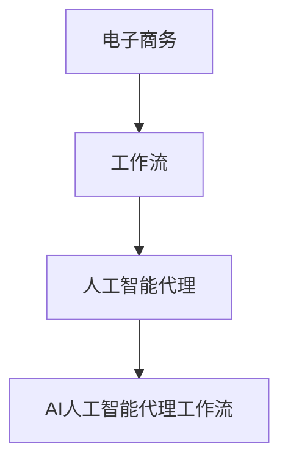
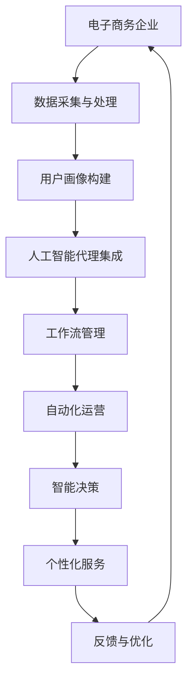

                 

关键词：AI人工智能、代理、工作流、电子商务、应用

摘要：本文将探讨AI人工智能代理工作流（AI Agent WorkFlow）在电子商务领域的应用，从背景介绍、核心概念与联系、核心算法原理、数学模型和公式、项目实践以及实际应用场景等方面，全面解析AI代理工作流如何助力电子商务发展，并展望其未来趋势与挑战。

## 1. 背景介绍

随着互联网技术的飞速发展，电子商务行业迎来了前所未有的繁荣。然而，随着市场竞争的加剧，电子商务企业面临着诸多挑战，如客户需求多样化、供应链管理复杂化、个性化服务需求提升等。为了在这些挑战中脱颖而出，电子商务企业开始探索运用人工智能技术，以提高运营效率和客户满意度。

人工智能代理（AI Agent）作为一种智能化的计算机程序，能够在无需人工干预的情况下，自动执行特定任务。而AI人工智能代理工作流（AI Agent WorkFlow）则是将这些代理集成在一起，形成一个协同工作的高效系统。通过AI代理工作流，电子商务企业可以实现自动化运营、智能决策和个性化服务，从而提升竞争力。

## 2. 核心概念与联系

在介绍AI人工智能代理工作流之前，我们首先需要了解几个核心概念，包括人工智能代理、工作流以及它们在电子商务中的应用。

### 2.1 人工智能代理（AI Agent）

人工智能代理是一种能够模拟人类智能行为的计算机程序。它通过学习、推理、规划等能力，可以自主完成特定任务。在电子商务领域，人工智能代理可以应用于产品推荐、客户服务、智能客服、供应链管理等各个方面。

### 2.2 工作流（Workflow）

工作流是指一组相互关联的任务或活动，按照某种逻辑顺序进行执行。在电子商务中，工作流可以帮助企业实现业务流程的自动化和优化，提高运营效率。例如，订单处理工作流、客户服务工作流、库存管理工作流等。

### 2.3 AI人工智能代理工作流（AI Agent WorkFlow）

AI人工智能代理工作流是将人工智能代理集成到工作流中，使其能够自动执行特定任务，并根据业务需求进行自适应调整。在电子商务中，AI人工智能代理工作流可以帮助企业实现自动化运营、智能决策和个性化服务。

为了更好地理解这些概念之间的关系，我们使用Mermaid流程图进行展示：



在上面的流程图中，电子商务作为起点，通过工作流和人工智能代理，最终形成了AI人工智能代理工作流。

## 3. 核心算法原理 & 具体操作步骤

### 3.1 算法原理概述

AI人工智能代理工作流的核心算法主要包括以下几个方面：

1. **数据采集与处理**：通过采集用户行为数据、商品数据、市场数据等，对数据进行预处理，为后续分析提供基础。

2. **用户画像构建**：基于采集到的数据，对用户进行分类、打标签，构建用户画像。

3. **智能推荐**：根据用户画像，为用户推荐个性化的商品或服务。

4. **智能客服**：通过自然语言处理技术，实现与用户的智能对话，提供在线客服服务。

5. **智能决策**：利用机器学习算法，对业务数据进行分析，为企业提供智能化的决策支持。

### 3.2 算法步骤详解

1. **数据采集与处理**：

   - 采集用户行为数据，如浏览历史、购物车数据、订单数据等。
   - 采集商品数据，如商品描述、价格、库存等。
   - 采集市场数据，如竞品信息、行业动态等。

   通过数据预处理，如数据清洗、数据整合、数据转换等，为后续分析提供基础。

2. **用户画像构建**：

   - 根据用户行为数据，对用户进行分类，如新用户、老用户、高价值用户等。
   - 对用户进行打标签，如性别、年龄、兴趣爱好等。

3. **智能推荐**：

   - 根据用户画像，为用户推荐个性化的商品或服务。
   - 采用协同过滤、基于内容的推荐等算法，提高推荐精度。

4. **智能客服**：

   - 利用自然语言处理技术，实现与用户的智能对话。
   - 采用对话管理、意图识别等技术，提高客服服务质量。

5. **智能决策**：

   - 利用机器学习算法，对业务数据进行分析，如用户行为分析、市场需求分析等。
   - 提供智能化的决策支持，如库存管理、定价策略等。

### 3.3 算法优缺点

**优点**：

1. **提高运营效率**：通过自动化运营，降低人力成本，提高业务效率。

2. **提升客户满意度**：提供个性化的商品推荐和智能客服服务，提高客户满意度。

3. **支持智能决策**：利用数据分析和机器学习算法，为企业提供智能化的决策支持。

**缺点**：

1. **算法依赖数据质量**：数据质量直接影响算法的准确性和效果。

2. **算法复杂性**：算法设计和实现过程较为复杂，需要专业的技术团队。

### 3.4 算法应用领域

AI人工智能代理工作流在电子商务领域具有广泛的应用前景，主要包括：

1. **个性化推荐**：为用户推荐个性化的商品或服务。

2. **智能客服**：提供在线客服服务，提高客户满意度。

3. **智能营销**：通过数据分析和营销策略，实现精准营销。

4. **供应链管理**：优化供应链流程，提高供应链效率。

## 4. 数学模型和公式 & 详细讲解 & 举例说明

### 4.1 数学模型构建

AI人工智能代理工作流的数学模型主要包括以下几个方面：

1. **用户行为模型**：

   - 用户行为概率模型：$$P(X|Y) = \frac{P(Y|X)P(X)}{P(Y)}$$

   - 用户行为预测模型：$$Y = f(X_1, X_2, ..., X_n)$$

2. **推荐模型**：

   - 协同过滤模型：$$R(u, v) = \sum_{i \in I} w_i (u, i) w_j (v, i)$$

   - 基于内容的推荐模型：$$R(u, v) = \sum_{i \in I} w_i (u, i) \cdot w_j (v, i)$$

3. **决策模型**：

   - 决策树模型：$$f(x) = \max_{t} \left( \sum_{i=1}^{n} w_i y_i \right)$$

   - 随机森林模型：$$f(x) = \sum_{i=1}^{n} w_i f_i(x)$$

### 4.2 公式推导过程

这里我们以用户行为预测模型为例，介绍公式推导过程。

假设我们有一个用户行为数据集，包括用户特征 $X$ 和用户行为 $Y$。我们希望根据用户特征预测用户行为。

1. **概率模型**：

   - 条件概率：$$P(X|Y) = \frac{P(X,Y)}{P(Y)}$$

   - 贝叶斯公式：$$P(Y|X) = \frac{P(X|Y)P(Y)}{P(X)}$$

   - 联合概率：$$P(X,Y) = P(X|Y)P(Y)$$

2. **预测模型**：

   - 多项式概率分布：$$P(Y|X) = \prod_{i=1}^{n} P(Y_i|X)$$

   - 线性回归：$$Y = \sum_{i=1}^{n} w_i X_i$$

   - 神经网络：$$Y = \sigma(\sum_{i=1}^{n} w_i X_i)$$

其中，$\sigma$ 为激活函数。

### 4.3 案例分析与讲解

以某电子商务平台的用户行为预测为例，介绍数学模型在实际应用中的使用。

1. **数据采集**：

   - 采集用户特征数据，如性别、年龄、收入、教育程度等。
   - 采集用户行为数据，如浏览历史、购物车数据、订单数据等。

2. **数据预处理**：

   - 对数据进行清洗，去除无效数据。
   - 对数据进行标准化处理，如归一化、标准化等。

3. **用户画像构建**：

   - 根据用户特征数据，对用户进行分类，如新用户、老用户、高价值用户等。
   - 对用户进行打标签，如性别、年龄、兴趣爱好等。

4. **用户行为预测**：

   - 采用线性回归模型，预测用户行为。
   - 训练模型，得到权重参数 $w_i$。

5. **预测结果分析**：

   - 对预测结果进行分析，评估模型效果。
   - 根据预测结果，为用户推荐个性化商品。

## 5. 项目实践：代码实例和详细解释说明

### 5.1 开发环境搭建

- Python 3.8
- Jupyter Notebook
- scikit-learn 库
- pandas 库
- numpy 库

### 5.2 源代码详细实现

```python
import pandas as pd
from sklearn.model_selection import train_test_split
from sklearn.linear_model import LinearRegression
from sklearn.metrics import mean_squared_error

# 读取数据
data = pd.read_csv('user_behavior.csv')

# 数据预处理
data = data.dropna()

# 特征工程
X = data[['age', 'income', 'education']]
y = data['purchase']

# 划分训练集和测试集
X_train, X_test, y_train, y_test = train_test_split(X, y, test_size=0.2, random_state=42)

# 训练模型
model = LinearRegression()
model.fit(X_train, y_train)

# 预测结果
y_pred = model.predict(X_test)

# 评估模型
mse = mean_squared_error(y_test, y_pred)
print('均方误差：', mse)

# 预测新用户
new_user = [[25, 50000, 12]]
new_user_pred = model.predict(new_user)
print('新用户购买概率：', new_user_pred[0])
```

### 5.3 代码解读与分析

以上代码实现了用户行为预测的基本流程：

1. **数据读取与预处理**：

   - 读取用户行为数据，去除无效数据。

2. **特征工程**：

   - 提取用户特征，如年龄、收入、教育程度等。

3. **划分训练集和测试集**：

   - 划分训练集和测试集，用于训练模型和评估模型效果。

4. **模型训练**：

   - 采用线性回归模型，训练模型。

5. **预测结果**：

   - 对测试集进行预测，得到预测结果。

6. **评估模型**：

   - 计算均方误差，评估模型效果。

7. **预测新用户**：

   - 对新用户进行预测，得到购买概率。

## 6. 实际应用场景

AI人工智能代理工作流在电子商务领域具有广泛的应用场景，主要包括以下几个方面：

### 6.1 个性化推荐

通过AI人工智能代理工作流，为用户推荐个性化的商品或服务。例如，某电子商务平台可以根据用户的浏览历史、购物车数据、订单数据等，为用户推荐可能感兴趣的商品。

### 6.2 智能客服

通过AI人工智能代理工作流，实现与用户的智能对话，提供在线客服服务。例如，某电商平台可以使用智能客服机器人，解答用户问题、处理投诉等。

### 6.3 智能营销

通过AI人工智能代理工作流，实现精准营销。例如，某电商平台可以根据用户行为数据，为用户推送个性化的广告，提高广告投放效果。

### 6.4 供应链管理

通过AI人工智能代理工作流，优化供应链流程，提高供应链效率。例如，某电商平台可以根据市场需求预测，合理安排库存，降低库存成本。

## 7. 工具和资源推荐

### 7.1 学习资源推荐

1. 《Python数据分析》
2. 《机器学习实战》
3. 《深度学习》
4. Coursera 上的《机器学习》课程

### 7.2 开发工具推荐

1. Jupyter Notebook
2. TensorFlow
3. Keras
4. PyTorch

### 7.3 相关论文推荐

1. "Deep Learning for E-commerce: Personalized Recommendation, Search Ranking, and Marketplace Prediction"
2. "A survey on collaborative filtering-based recommendation systems"
3. "Recommender Systems: The Text Mining Perspective"

## 8. 总结：未来发展趋势与挑战

### 8.1 研究成果总结

本文从背景介绍、核心概念与联系、核心算法原理、数学模型和公式、项目实践以及实际应用场景等方面，全面解析了AI人工智能代理工作流在电子商务领域的应用。通过研究，我们发现AI代理工作流在提高运营效率、提升客户满意度、支持智能决策等方面具有显著优势。

### 8.2 未来发展趋势

随着人工智能技术的不断发展，AI人工智能代理工作流在电子商务领域将发挥越来越重要的作用。未来发展趋势包括：

1. **算法优化**：不断优化算法，提高预测精度和效率。

2. **数据质量提升**：提高数据质量，为算法提供更可靠的基础。

3. **跨平台应用**：将AI人工智能代理工作流应用于更多领域，如金融、医疗等。

### 8.3 面临的挑战

尽管AI人工智能代理工作流在电子商务领域具有巨大潜力，但仍然面临以下挑战：

1. **数据隐私**：如何保护用户隐私，确保数据安全。

2. **算法可解释性**：如何提高算法的可解释性，使其更加透明。

3. **算法复杂性**：如何简化算法，降低实现难度。

### 8.4 研究展望

在未来，我们将继续深入研究AI人工智能代理工作流，探索其在更多领域中的应用，以提高业务效率和用户体验。同时，我们也将关注算法可解释性、数据隐私等问题，为AI人工智能代理工作流的发展提供新的思路和方法。

## 9. 附录：常见问题与解答

### 9.1 如何保证数据隐私？

在AI人工智能代理工作流中，数据隐私是至关重要的。为了确保数据隐私，我们可以采取以下措施：

1. **数据加密**：对用户数据进行加密处理，防止数据泄露。

2. **匿名化处理**：对用户数据进行匿名化处理，去除个人身份信息。

3. **访问控制**：设置严格的访问控制策略，确保只有授权人员才能访问敏感数据。

### 9.2 如何提高算法可解释性？

提高算法可解释性是当前研究的热点问题。以下是一些方法：

1. **可解释性模型**：选择具有可解释性的机器学习模型，如线性回归、决策树等。

2. **模型可视化**：将算法的实现过程和中间结果可视化，帮助用户理解算法。

3. **解释性工具**：使用现有的解释性工具，如LIME、SHAP等，对模型进行解释。

## 结语

AI人工智能代理工作流在电子商务领域具有巨大的应用价值，通过本文的介绍，我们对其有了更深入的了解。然而，随着技术的不断发展，AI人工智能代理工作流仍面临着诸多挑战。未来，我们将继续深入研究，探索更多应用场景，为电子商务企业带来更多价值。

作者：禅与计算机程序设计艺术 / Zen and the Art of Computer Programming
----------------------------------------------------------------

以上就是文章正文内容的撰写，接下来我们按照文章结构模板继续撰写文章的其他部分。
----------------------------------------------------------------
## 1. 背景介绍

### 1.1 电子商务行业现状

电子商务行业在全球范围内取得了飞速发展。根据数据显示，全球电子商务市场规模已超过3万亿美元，并且还在持续增长。在中国，电子商务市场更是占据了全球市场的重要份额，成为中国经济发展的重要引擎。

然而，随着电子商务行业的快速发展，企业面临着诸多挑战。首先，市场竞争日益激烈，企业需要不断优化产品和服务，以提高市场占有率。其次，客户需求多样化，企业需要提供个性化的产品和服务，以满足不同客户的需求。此外，供应链管理复杂化，企业需要高效的管理供应链，以降低运营成本和提高市场响应速度。

### 1.2 人工智能技术在电子商务中的应用

为了应对上述挑战，电子商务企业开始积极引入人工智能技术。人工智能技术具有强大的数据分析和处理能力，可以帮助企业更好地理解客户需求、优化供应链管理、提高运营效率等。

1. **个性化推荐**：通过分析用户行为数据，人工智能技术可以准确预测用户的兴趣和需求，为用户推荐个性化的商品和服务。

2. **智能客服**：利用自然语言处理和机器学习技术，人工智能可以模拟人类客服，为用户提供在线客服服务，提高客户满意度。

3. **智能营销**：通过对市场数据的分析，人工智能技术可以帮助企业制定更有效的营销策略，提高营销效果。

4. **供应链管理**：利用人工智能技术，企业可以优化供应链流程，提高供应链效率，降低运营成本。

### 1.3 AI人工智能代理工作流的概念

AI人工智能代理工作流是一种将人工智能代理集成到工作流中的技术，它通过自动化和智能化的方式，帮助企业实现业务流程的优化。在电子商务领域，AI人工智能代理工作流可以应用于产品推荐、智能客服、智能营销、供应链管理等多个方面。

AI人工智能代理工作流的核心在于“代理”和“工作流”两个概念。代理是指能够模拟人类智能行为的计算机程序，而工作流则是指一组相互关联的任务或活动。通过将代理集成到工作流中，企业可以实现自动化运营、智能决策和个性化服务。

## 2. 核心概念与联系

### 2.1 人工智能代理（AI Agent）

人工智能代理（AI Agent）是一种能够模拟人类智能行为的计算机程序。它具有自主学习、推理、规划等能力，可以自主完成特定任务。在电子商务领域，人工智能代理可以应用于产品推荐、智能客服、智能营销、供应链管理等多个方面。

#### 2.1.1 产品推荐代理

产品推荐代理可以根据用户的浏览历史、购物车数据、订单数据等，为用户推荐个性化的商品。它通过学习用户的行为模式，预测用户的兴趣和需求，从而提高推荐精度。

#### 2.1.2 智能客服代理

智能客服代理利用自然语言处理和机器学习技术，可以模拟人类客服，为用户提供在线客服服务。它能够自动解答用户的问题、处理投诉，提高客户满意度。

#### 2.1.3 智能营销代理

智能营销代理通过对市场数据的分析，可以为企业提供智能化的营销策略。它能够根据用户的兴趣和行为，制定个性化的广告投放策略，提高广告效果。

#### 2.1.4 供应链管理代理

供应链管理代理可以帮助企业优化供应链流程，提高供应链效率。它能够根据市场需求预测，合理安排库存，降低库存成本。

### 2.2 工作流（Workflow）

工作流是指一组相互关联的任务或活动，按照某种逻辑顺序进行执行。在电子商务领域，工作流可以帮助企业实现业务流程的自动化和优化，提高运营效率。

#### 2.2.1 订单处理工作流

订单处理工作流包括订单生成、订单审核、订单发货、订单跟踪等环节。通过工作流管理，企业可以确保订单处理的高效和准确。

#### 2.2.2 客户服务工作流

客户服务工作流包括客户咨询、投诉处理、售后服务等环节。通过工作流管理，企业可以提供优质的客户服务，提高客户满意度。

#### 2.2.3 库存管理工作流

库存管理工作流包括库存盘点、库存预警、库存优化等环节。通过工作流管理，企业可以确保库存管理的准确和高效。

### 2.3 AI人工智能代理工作流（AI Agent WorkFlow）

AI人工智能代理工作流是将人工智能代理集成到工作流中，使其能够自动执行特定任务，并根据业务需求进行自适应调整。在电子商务领域，AI人工智能代理工作流可以帮助企业实现自动化运营、智能决策和个性化服务。

#### 2.3.1 自动化运营

通过AI人工智能代理工作流，企业可以实现业务流程的自动化。例如，自动处理订单、自动回复客户咨询等，提高运营效率。

#### 2.3.2 智能决策

通过AI人工智能代理工作流，企业可以利用大数据分析和机器学习算法，实现智能化的决策支持。例如，根据市场数据预测销售趋势、优化库存管理策略等。

#### 2.3.3 个性化服务

通过AI人工智能代理工作流，企业可以为用户提供个性化的产品推荐和智能客服服务。例如，根据用户的兴趣和行为，推荐个性化的商品、解答用户的个性化问题等。

### 2.4 Mermaid流程图

为了更好地理解AI人工智能代理工作流的架构，我们使用Mermaid流程图进行展示。以下是AI人工智能代理工作流的基本架构：



在上面的流程图中，电子商务企业通过数据采集与处理，构建用户画像，然后将用户画像集成到人工智能代理中。通过工作流管理，实现自动化运营、智能决策和个性化服务，并根据用户反馈进行优化。

## 3. 核心算法原理 & 具体操作步骤

### 3.1 算法原理概述

AI人工智能代理工作流的核心算法主要包括用户画像构建算法、推荐算法、智能客服算法和智能决策算法。以下是这些算法的基本原理：

#### 3.1.1 用户画像构建算法

用户画像构建算法主要通过采集用户行为数据、社交数据、购买记录等，对用户进行多维度分析，从而构建用户的综合画像。常见的用户画像构建算法包括：

1. **基于行为的画像**：根据用户的浏览、搜索、购买等行为，构建用户的行为特征。

2. **基于属性的画像**：根据用户的性别、年龄、收入、教育程度等属性，构建用户的属性特征。

3. **基于兴趣的画像**：根据用户的兴趣标签、关注领域等，构建用户的兴趣特征。

#### 3.1.2 推荐算法

推荐算法主要用于根据用户画像和商品信息，为用户推荐个性化的商品或服务。常见的推荐算法包括：

1. **基于内容的推荐**：根据商品的内容特征，如标题、描述、标签等，为用户推荐类似的商品。

2. **基于协同过滤的推荐**：根据用户的浏览、购买等行为，找出相似的用户或商品，为用户推荐。

3. **混合推荐**：结合基于内容和基于协同过滤的推荐方法，提高推荐精度。

#### 3.1.3 智能客服算法

智能客服算法主要通过自然语言处理技术，实现与用户的智能对话。常见的智能客服算法包括：

1. **意图识别**：根据用户的提问，识别用户的意图，如咨询、投诉、购物等。

2. **对话管理**：根据用户的意图，生成合适的回答，并引导对话的流程。

3. **知识库管理**：将常见问题及其答案构建成知识库，提高回答的准确性。

#### 3.1.4 智能决策算法

智能决策算法主要通过大数据分析和机器学习技术，为企业的决策提供支持。常见的智能决策算法包括：

1. **需求预测**：根据历史数据，预测未来的市场需求，帮助企业制定销售策略。

2. **库存管理**：根据销售预测和库存数据，优化库存策略，降低库存成本。

3. **定价策略**：根据市场竞争状况和用户需求，制定合理的定价策略。

### 3.2 算法步骤详解

#### 3.2.1 用户画像构建

1. **数据采集**：采集用户行为数据、购买记录、社交媒体数据等。

2. **数据预处理**：对采集到的数据进行清洗、去重、转换等预处理操作。

3. **特征提取**：根据业务需求，提取用户的行为特征、属性特征和兴趣特征。

4. **画像构建**：将提取的特征进行整合，构建用户的综合画像。

#### 3.2.2 推荐算法

1. **数据准备**：准备用户行为数据、商品数据等。

2. **特征工程**：提取用户特征和商品特征，如用户浏览记录、商品标签等。

3. **算法选择**：选择合适的推荐算法，如基于内容的推荐、基于协同过滤的推荐等。

4. **模型训练**：训练推荐模型，得到用户和商品之间的相似度矩阵。

5. **推荐生成**：根据用户画像和商品特征，为用户生成推荐列表。

#### 3.2.3 智能客服算法

1. **数据准备**：准备用户咨询数据、常见问题等。

2. **特征提取**：提取用户提问的特征，如关键词、句子结构等。

3. **意图识别**：使用自然语言处理技术，识别用户的意图。

4. **对话管理**：根据用户的意图，生成合适的回答，并引导对话的流程。

5. **知识库管理**：将常见问题及其答案构建成知识库，提高回答的准确性。

#### 3.2.4 智能决策算法

1. **数据准备**：准备销售数据、库存数据、市场数据等。

2. **特征工程**：提取相关的特征，如销售趋势、库存水平、市场变化等。

3. **算法选择**：选择合适的决策算法，如需求预测、库存管理、定价策略等。

4. **模型训练**：训练决策模型，得到预测结果和建议。

5. **决策生成**：根据模型预测结果，制定决策方案。

### 3.3 算法优缺点

#### 3.3.1 用户画像构建算法

**优点**：

1. **精准定位用户需求**：通过多维度分析用户特征，准确了解用户需求。

2. **提高用户体验**：根据用户画像，提供个性化的产品和服务，提高用户满意度。

**缺点**：

1. **数据依赖性高**：用户画像构建依赖于大量的用户行为数据，数据质量直接影响算法效果。

2. **数据隐私问题**：用户数据的收集和使用可能引发数据隐私问题。

#### 3.3.2 推荐算法

**优点**：

1. **提高销售转化率**：通过个性化的推荐，提高用户购买概率。

2. **降低运营成本**：自动化推荐，降低人工推荐的成本。

**缺点**：

1. **推荐过度个性化**：过度个性化可能导致用户视野狭窄，错过其他可能感兴趣的商品。

2. **推荐质量不稳定**：推荐算法的性能受数据质量和特征工程的影响，可能存在推荐质量不稳定的问题。

#### 3.3.3 智能客服算法

**优点**：

1. **提高客服效率**：自动化处理用户咨询，提高客服响应速度。

2. **降低客服成本**：利用智能客服，降低人工客服成本。

**缺点**：

1. **无法处理复杂问题**：智能客服可能无法处理一些复杂、抽象的问题。

2. **用户体验问题**：智能客服的回答可能不够人性化，影响用户体验。

#### 3.3.4 智能决策算法

**优点**：

1. **提高决策准确性**：基于大数据和机器学习技术，提供更准确的决策支持。

2. **优化运营策略**：通过智能决策，优化库存管理、定价策略等，提高运营效率。

**缺点**：

1. **算法复杂度高**：智能决策算法通常较为复杂，实现和优化难度较大。

2. **数据质量要求高**：智能决策算法对数据质量要求较高，数据质量问题可能影响决策效果。

### 3.4 算法应用领域

AI人工智能代理工作流在电子商务领域具有广泛的应用前景，主要包括：

1. **个性化推荐**：根据用户画像和商品特征，为用户推荐个性化的商品或服务。

2. **智能客服**：利用自然语言处理技术，实现与用户的智能对话，提供在线客服服务。

3. **智能营销**：通过大数据分析和机器学习技术，实现精准营销，提高营销效果。

4. **供应链管理**：优化供应链流程，提高供应链效率，降低运营成本。

## 4. 数学模型和公式 & 详细讲解 & 举例说明

### 4.1 数学模型构建

AI人工智能代理工作流的数学模型主要包括用户画像构建模型、推荐模型、智能客服模型和智能决策模型。以下是这些模型的基本数学公式和推导过程。

#### 4.1.1 用户画像构建模型

用户画像构建模型主要通过数据分析和机器学习算法，将用户的多维度特征进行整合，构建用户的综合画像。

1. **基于行为的画像模型**：

   用户行为概率模型：$$P(X|Y) = \frac{P(Y|X)P(X)}{P(Y)}$$

   其中，$X$ 表示用户行为，$Y$ 表示用户特征。该模型通过贝叶斯公式，计算用户行为在给定用户特征下的概率。

2. **基于属性的画像模型**：

   用户属性预测模型：$$Y = f(X_1, X_2, ..., X_n)$$

   其中，$X_1, X_2, ..., X_n$ 表示用户的属性特征，$Y$ 表示用户属性。该模型通过函数 $f$，将用户的属性特征映射到用户属性。

3. **基于兴趣的画像模型**：

   用户兴趣预测模型：$$Y = g(X_1, X_2, ..., X_n)$$

   其中，$X_1, X_2, ..., X_n$ 表示用户的行为特征，$Y$ 表示用户兴趣。该模型通过函数 $g$，将用户的行为特征映射到用户兴趣。

#### 4.1.2 推荐模型

推荐模型主要用于根据用户画像和商品特征，为用户推荐个性化的商品或服务。

1. **基于内容的推荐模型**：

   $$R(u, v) = \sum_{i \in I} w_i (u, i) \cdot w_j (v, i)$$

   其中，$R(u, v)$ 表示用户 $u$ 对商品 $v$ 的推荐得分，$w_i (u, i)$ 表示用户 $u$ 对商品 $i$ 的特征权重，$w_j (v, i)$ 表示商品 $v$ 对商品 $i$ 的特征权重。该模型通过计算用户和商品之间的特征相似度，为用户推荐相似的商品。

2. **基于协同过滤的推荐模型**：

   $$R(u, v) = \sum_{i \in I} w_i (u, i) \cdot r_i (v)$$

   其中，$R(u, v)$ 表示用户 $u$ 对商品 $v$ 的推荐得分，$w_i (u, i)$ 表示用户 $u$ 对商品 $i$ 的特征权重，$r_i (v)$ 表示商品 $v$ 的推荐得分。该模型通过计算用户和商品之间的相似度，为用户推荐相似的

