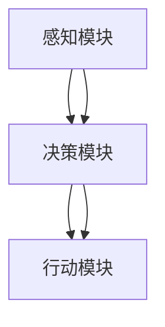
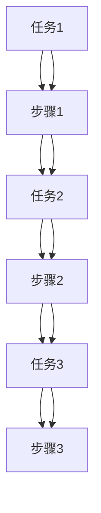

                 

关键词：（AI 代理，工作流，互动学习，流程优化，智能自动化）

> 摘要：本文旨在探讨AI代理在工作流中的应用及其与互动学习方法的结合。我们将分析AI代理的核心概念和架构，详细讲解互动学习在工作流中的角色，并通过数学模型和具体案例说明其应用。最后，我们将展望AI代理未来发展的趋势与挑战，并提出相关工具和资源的推荐。

## 1. 背景介绍

随着人工智能技术的快速发展，AI代理作为一种智能自动化工具，逐渐成为现代工作流的重要组成部分。AI代理通过模拟人类行为和决策过程，能够执行复杂的任务，提高工作效率，降低人力成本。然而，AI代理的智能程度和适应性仍然受到限制，如何进一步提升其工作流中的性能和效率成为研究的热点。

互动学习作为一种新型学习范式，强调学习过程中的主动性和协作性，能够有效提升AI代理的智能水平和决策能力。通过将互动学习与工作流相结合，我们有望实现更加智能化和高效化的工作流程。

本文将围绕AI代理工作流的核心概念、互动学习在工作流中的角色与方法、核心算法原理、数学模型、实际应用案例以及未来发展等方面展开讨论，旨在为相关工作提供理论支持和实践指导。

### 1.1 AI代理的定义与工作原理

AI代理，即人工智能代理，是指具备自主性和智能性的软件实体，能够在没有人类直接干预的情况下完成特定任务。AI代理通常由感知模块、决策模块和行动模块组成，通过感知环境信息，运用算法进行决策，并执行相应行动，以实现目标。

感知模块负责收集和处理来自外部环境的各种信息，如文本、图像、声音等。决策模块基于感知模块提供的信息，利用机器学习、深度学习等技术进行决策。行动模块则根据决策结果执行具体的操作，如发送电子邮件、更新数据库、执行自动化脚本等。

AI代理的工作原理可以概括为以下步骤：

1. **感知环境**：通过传感器或接口收集环境数据。
2. **数据处理**：对收集到的数据进行预处理，提取有用信息。
3. **决策生成**：利用算法模型对预处理后的数据进行分析和处理，生成决策。
4. **行动执行**：根据决策结果执行相应的操作。

### 1.2 工作流的定义与组成

工作流（Workflow）是一种用于描述工作过程中各个步骤和任务的序列和规则的模型。它旨在提高工作效率、减少错误和提高协同工作的效果。工作流通常由以下几个组成部分：

- **任务（Task）**：工作流中的基本操作单元，如数据收集、数据分析、报告生成等。
- **步骤（Step）**：任务执行的顺序和规则，描述了任务之间的依赖关系和执行顺序。
- **流程（Process）**：多个步骤的组合，描述了工作流中的整体流程。
- **参与者（Participant）**：参与工作流的人员或系统，包括任务执行者和任务监控者。
- **规则（Rule）**：定义了工作流中的条件、约束和决策逻辑，用于指导任务执行。

### 1.3 互动学习的概念与原理

互动学习是一种基于互动和协作的学习范式，强调学习者在学习过程中的主动参与和知识共享。互动学习通过提供多层次的交互体验，促进学习者之间的沟通与合作，提高学习效果和知识掌握程度。

互动学习的核心概念包括：

- **互动性（Interactivity）**：学习过程中的主动性和协作性，促进知识交流和共享。
- **多模态反馈（Multimodal Feedback）**：通过多种感官渠道（如文本、图像、声音等）提供实时反馈，增强学习体验。
- **情境适应性（Situation Adaptation）**：根据学习者的情境和需求，动态调整学习内容和方式。

互动学习的原理主要包括以下几个方面：

1. **主动参与**：鼓励学习者主动参与学习过程，提高学习积极性和主动性。
2. **协作学习**：通过学习者之间的协作和互动，促进知识共享和互补。
3. **实时反馈**：提供实时反馈，帮助学习者及时纠正错误和理解难点。
4. **情境适应**：根据学习者的需求和情境，动态调整学习内容和方式，提高学习效果。

### 1.4 互动学习与工作流的结合

互动学习与工作流的结合，旨在通过互动学习的方法提升工作流中的智能水平和效率。具体来说，互动学习可以在以下几个方面对工作流产生影响：

1. **任务优化**：通过互动学习，AI代理能够更好地理解和优化任务，提高任务执行的准确性和效率。
2. **决策优化**：互动学习可以帮助AI代理从不同的角度和情境中获取信息，提高决策的智能性和适应性。
3. **流程优化**：通过互动学习，工作流中的各个环节可以更加灵活和高效地协同工作，提高整体流程的效率。
4. **知识共享**：互动学习促进团队成员之间的知识交流和共享，提高团队整体的知识水平和工作效率。

### 1.5 研究意义与挑战

本文旨在探讨AI代理工作流中互动学习的方法与应用，具有较高的研究意义和实际应用价值。通过将互动学习与工作流相结合，有望实现以下几个方面的目标：

1. **提高工作效率**：通过优化任务和决策过程，减少重复性劳动，提高工作效率。
2. **降低人力成本**：利用AI代理自动化执行任务，降低人力成本，提高企业竞争力。
3. **提升团队协作**：通过互动学习，促进团队成员之间的沟通与合作，提高团队整体的知识水平和工作效率。
4. **创新工作模式**：探索新的工作模式和方法，推动人工智能与工作流的深度融合，为未来工作模式的创新提供理论支持和实践指导。

然而，在AI代理工作流中应用互动学习也面临一些挑战，如：

1. **数据隐私与安全**：互动学习过程中涉及大量用户数据，需要确保数据隐私与安全。
2. **算法可解释性**：AI代理的决策过程需要具备一定的可解释性，以便用户理解和信任。
3. **系统稳定性**：互动学习引入了新的复杂性和不确定性，需要确保系统的稳定性。
4. **人才短缺**：AI代理工作流的发展需要大量具备相关技能和知识的人才，人才短缺可能成为瓶颈。

## 2. 核心概念与联系

### 2.1 AI代理的概念与架构

AI代理（Artificial Intelligence Agent）是指具备自主性、适应性和交互能力的软件系统，能够在动态环境中执行特定任务。AI代理通常由感知模块、决策模块和行动模块组成，其架构如图1所示。



- **感知模块**：负责感知环境信息，如传感器数据、用户输入等，为决策模块提供输入。
- **决策模块**：根据感知模块提供的信息，运用机器学习、深度学习等算法进行决策，生成行动方案。
- **行动模块**：根据决策模块生成的行动方案，执行具体的操作，如发送消息、修改数据等。

### 2.2 工作流的概念与组成

工作流（Workflow）是指工作过程中任务的执行顺序和规则，旨在提高工作效率、减少错误和提高协同工作的效果。工作流通常由以下几个组成部分：



- **任务（Task）**：工作流中的基本操作单元，如数据收集、数据分析、报告生成等。
- **步骤（Step）**：任务执行的顺序和规则，描述了任务之间的依赖关系和执行顺序。
- **流程（Process）**：多个步骤的组合，描述了工作流中的整体流程。
- **参与者（Participant）**：参与工作流的人员或系统，包括任务执行者和任务监控者。
- **规则（Rule）**：定义了工作流中的条件、约束和决策逻辑，用于指导任务执行。

### 2.3 互动学习的概念与原理

互动学习（Interactive Learning）是一种基于互动和协作的学习范式，强调学习者在学习过程中的主动参与和知识共享。互动学习通过提供多层次的交互体验，促进学习者之间的沟通与合作，提高学习效果和知识掌握程度。

互动学习的核心概念包括：

- **互动性（Interactivity）**：学习过程中的主动性和协作性，促进知识交流和共享。
- **多模态反馈（Multimodal Feedback）**：通过多种感官渠道（如文本、图像、声音等）提供实时反馈，增强学习体验。
- **情境适应性（Situation Adaptation）**：根据学习者的情境和需求，动态调整学习内容和方式。

互动学习的原理主要包括以下几个方面：

1. **主动参与**：鼓励学习者主动参与学习过程，提高学习积极性和主动性。
2. **协作学习**：通过学习者之间的协作和互动，促进知识共享和互补。
3. **实时反馈**：提供实时反馈，帮助学习者及时纠正错误和理解难点。
4. **情境适应**：根据学习者的需求和情境，动态调整学习内容和方式，提高学习效果。

### 2.4 AI代理工作流中互动学习的方法

在AI代理工作流中，互动学习可以通过以下几种方法实现：

1. **主动式互动**：AI代理主动发起与用户的交互，如通过对话框、聊天机器人等方式，获取用户需求和信息，优化任务执行和决策过程。
2. **被动式互动**：AI代理被动接收用户输入，如通过API接口、数据表单等方式，获取用户反馈和需求，调整工作流中的任务和规则。
3. **协同学习**：AI代理与其他代理或用户共同参与学习过程，通过共享经验和知识，提高整体工作流的表现和效率。
4. **反馈机制**：建立实时反馈机制，根据用户反馈调整工作流中的任务和规则，提高工作流的自适应能力和智能化水平。

### 2.5 核心概念联系与工作原理

AI代理、工作流和互动学习是现代智能化工作流中的三个核心概念，它们相互关联，共同构成了AI代理工作流的整体框架。具体来说：

- **AI代理**：作为工作流中的执行者，AI代理通过感知模块获取环境信息，利用决策模块进行决策，并通过行动模块执行具体操作。
- **工作流**：作为工作过程中的规则和顺序，工作流定义了任务执行的步骤和依赖关系，描述了工作流的整体流程。
- **互动学习**：作为工作流中的优化手段，互动学习通过提供多层次的交互体验，促进AI代理与用户之间的沟通与合作，提高工作流中的智能化水平和效率。

总之，AI代理、工作流和互动学习共同构成了现代智能化工作流的核心框架，它们相互关联，相互促进，共同实现了智能化、自动化和高效化的工作目标。

## 3. 核心算法原理 & 具体操作步骤

### 3.1 算法原理概述

在AI代理工作流中，互动学习的关键在于如何有效地利用用户反馈来优化代理的行为和决策。本文提出的核心算法是基于强化学习（Reinforcement Learning，RL）和迁移学习（Transfer Learning）相结合的方法。该方法的基本原理如下：

- **强化学习**：通过奖励机制，引导代理学习在特定环境下采取最优动作，以实现目标。
- **迁移学习**：将已有模型的参数迁移到新任务中，减少模型训练所需的样本量和时间。

具体来说，该算法分为以下几个步骤：

1. **感知与状态编码**：AI代理通过感知模块收集环境信息，如文本、图像、声音等，并对其进行编码，形成状态表示。
2. **行为决策**：代理根据当前状态，利用强化学习算法生成动作策略，选择下一步的行为。
3. **执行与反馈**：代理执行所选动作，并根据执行结果获取奖励或惩罚，用于更新模型参数。
4. **模型更新**：通过迁移学习技术，将当前模型的参数迁移到新任务中，提高代理在新任务中的性能。

### 3.2 算法步骤详解

#### 3.2.1 感知与状态编码

感知与状态编码是互动学习的基础。具体步骤如下：

1. **数据收集**：AI代理通过传感器、用户输入等渠道收集环境信息。
2. **数据预处理**：对收集到的数据进行预处理，包括去噪、归一化等操作。
3. **特征提取**：利用深度学习模型提取关键特征，形成状态表示。

#### 3.2.2 行为决策

行为决策是代理的核心功能。具体步骤如下：

1. **状态编码**：将感知模块输出的状态进行编码，形成可输入到模型的状态向量。
2. **动作空间定义**：根据任务需求定义动作空间，如选择下一步的操作、参数设置等。
3. **策略选择**：利用强化学习算法，如Q-Learning或Deep Q-Network（DQN），在当前状态和动作空间中生成策略。

#### 3.2.3 执行与反馈

执行与反馈是互动学习的关键环节。具体步骤如下：

1. **执行动作**：根据策略选择的结果，执行具体的操作。
2. **获取奖励**：根据执行结果，获取奖励或惩罚，用于评估动作的效果。
3. **状态更新**：根据执行结果更新当前状态，为下一次决策提供基础。

#### 3.2.4 模型更新

模型更新是提升代理性能的关键。具体步骤如下：

1. **参数优化**：利用强化学习算法，根据奖励信号更新模型参数。
2. **迁移学习**：将当前模型的参数迁移到新任务中，提高代理在新任务中的适应能力。
3. **模型评估**：在新任务中评估模型性能，并根据评估结果调整模型参数。

### 3.3 算法优缺点

#### 优点

1. **自适应性强**：通过互动学习，代理能够根据用户反馈动态调整行为和决策，提高工作流中的智能化水平。
2. **高效性**：利用迁移学习技术，代理能够快速适应新任务，减少模型训练的时间和资源消耗。
3. **灵活性**：代理可以根据不同任务的需求，灵活调整动作策略和状态编码方式，提高任务的执行效率。

#### 缺点

1. **数据需求高**：互动学习需要大量的用户反馈数据，以支持模型的训练和优化。
2. **计算复杂度**：强化学习算法通常具有较高的计算复杂度，可能导致代理的实时性能受到影响。
3. **可解释性**：强化学习算法的决策过程通常较为复杂，难以解释和验证，可能影响用户对代理的信任度。

### 3.4 算法应用领域

互动学习算法在AI代理工作流中的应用非常广泛，以下是一些典型的应用领域：

1. **客服机器人**：通过互动学习，客服机器人能够更好地理解用户需求，提供更准确和个性化的服务。
2. **供应链管理**：AI代理可以实时获取供应链中的数据，通过互动学习优化库存管理和物流调度。
3. **金融风控**：AI代理可以分析金融市场的动态，通过互动学习提高风险识别和预测的准确性。
4. **医疗诊断**：AI代理可以通过互动学习，提高疾病诊断的准确性和效率。

### 3.5 算法实现与优化

#### 3.5.1 实现步骤

以下是互动学习算法的实现步骤：

1. **环境搭建**：搭建一个符合任务需求的环境，包括感知模块、决策模块和行动模块。
2. **模型训练**：使用强化学习算法，如Q-Learning或DQN，训练代理模型。
3. **迁移学习**：将训练好的模型参数迁移到新任务中，提高代理在新任务中的性能。
4. **性能评估**：在新任务中评估代理的性能，并根据评估结果调整模型参数。

#### 3.5.2 优化策略

以下是互动学习算法的优化策略：

1. **数据增强**：通过增加数据样本、数据变换等方法，提高模型对数据的泛化能力。
2. **模型压缩**：采用模型压缩技术，如剪枝、量化等，减少模型的参数量和计算复杂度。
3. **并行训练**：利用多GPU或分布式计算技术，加速模型的训练过程。
4. **动态调整**：根据任务需求和性能评估结果，动态调整模型的结构和参数。

### 3.6 案例分析

以下是一个基于互动学习算法的AI代理工作流案例：

#### 案例背景

某电商企业希望优化其客户服务流程，提高客户满意度。该企业采用了基于互动学习算法的AI客服机器人，以实现自动化和个性化的客户服务。

#### 案例实现

1. **环境搭建**：构建一个包括文本分类、语义理解、对话生成等模块的AI客服机器人环境。
2. **模型训练**：使用强化学习算法，如DQN，训练客服机器人模型，使其能够根据用户提问生成合适的回答。
3. **迁移学习**：将训练好的模型参数迁移到不同产品类别的客服任务中，提高客服机器人在各产品类别中的性能。
4. **性能评估**：在新任务中评估客服机器人的性能，并根据评估结果调整模型参数。

#### 案例效果

通过互动学习算法的优化，该电商企业的AI客服机器人在客户满意度、回答准确性等方面取得了显著提升。具体表现为：

1. **客户满意度**：客服机器人能够更准确地理解用户需求，提供更个性化的服务，客户满意度显著提高。
2. **回答准确性**：客服机器人能够根据用户提问生成合适的回答，回答准确性显著提高。
3. **工作效率**：客服机器人能够自动化处理大量客户咨询，降低人工客服的工作量，提高整体工作效率。

### 3.7 总结

本文介绍了互动学习算法在AI代理工作流中的应用，通过强化学习和迁移学习技术，实现了自动化和个性化的工作流优化。案例研究表明，互动学习算法在提高客户满意度、回答准确性等方面具有显著优势，为AI代理工作流提供了有效的技术支持。

## 4. 数学模型和公式 & 详细讲解 & 举例说明

### 4.1 数学模型构建

在AI代理工作流中，互动学习算法的核心在于如何通过数学模型来描述代理的行为和学习过程。为了实现这一目标，我们可以构建一个基于马尔可夫决策过程（Markov Decision Process，MDP）的数学模型。该模型由以下部分组成：

1. **状态空间（State Space，\(S\)）**：描述代理在环境中可能的状态集合。例如，在客服机器人场景中，状态可以包括用户的问题类型、用户历史提问等。
2. **动作空间（Action Space，\(A\)）**：描述代理可以执行的动作集合。例如，在客服机器人场景中，动作可以是生成特定类型的问题回答。
3. **奖励函数（Reward Function，\(R\)）**：描述代理执行动作后获得的奖励。奖励可以是正的，表示代理的行为有正面效果，也可以是负的，表示代理的行为有负面影响。
4. **状态转移概率（State Transition Probability，\(P\)）**：描述代理在当前状态\(s\)下执行动作\(a\)后转移到状态\(s'\)的概率，即\(P(s' | s, a)\)。
5. **价值函数（Value Function，\(V\)）**：描述代理在特定状态下的最优价值，即最大化长期奖励的期望。

### 4.2 公式推导过程

基于上述数学模型，我们可以推导出互动学习算法中的关键公式。以下是一个简单的推导过程：

#### 价值函数的递归定义

价值函数\(V(s)\)定义为代理在状态\(s\)下采取最佳动作所能获得的最大期望奖励。根据MDP的定义，我们可以得到以下递归关系：

\[ V(s) = \sum_{a \in A} \gamma \cdot R(s, a) + \sum_{s' \in S} P(s' | s, a) \cdot V(s') \]

其中，\(\gamma\)是折现因子，用于平衡当前奖励和未来奖励之间的关系。\(R(s, a)\)是代理在状态\(s\)下执行动作\(a\)后获得的即时奖励。\(P(s' | s, a)\)是代理在状态\(s\)下执行动作\(a\)后转移到状态\(s'\)的概率。

#### 策略的优化

策略\(\pi\)是代理在状态\(s\)下采取的最佳动作的映射。我们可以通过最大化期望奖励来优化策略：

\[ \pi(s) = \arg\max_{a \in A} [R(s, a) + \gamma \cdot V(s')] \]

其中，\(V(s')\)是代理在状态\(s'\)下的价值函数。

#### 动作价值的迭代更新

为了训练代理，我们需要迭代更新价值函数。这可以通过贝尔曼方程（Bellman Equation）来实现：

\[ V(s)^{(k+1)} = \sum_{a \in A} \pi(s)^{(k)}(a) \cdot [R(s, a) + \gamma \cdot V(s')] \]

其中，\(V(s)^{(k)}\)是第\(k\)次迭代的值函数估计。

### 4.3 案例分析与讲解

为了更直观地理解上述数学模型，我们来看一个具体的案例：一个AI客服机器人如何通过互动学习来优化回答用户问题的能力。

#### 案例背景

假设我们的AI客服机器人在处理用户提问时，面临以下状态空间和动作空间：

- **状态空间（\(S\)）**：{问题类型1，问题类型2，问题类型3}
- **动作空间（\(A\)）**：{回答1，回答2，回答3}

每个状态对应用户提出的问题类型，每个动作对应机器人生成的回答选项。

#### 模型参数

我们假设奖励函数如下：

\[ R(s, a) = \begin{cases} 
1 & \text{如果用户的满意度评分高于4} \\
-1 & \text{如果用户的满意度评分低于3} \\
0 & \text{否则}
\end{cases} \]

#### 案例步骤

1. **初始化**：初始化价值函数和策略。
2. **状态感知**：机器人感知到用户提出的问题是“问题类型1”。
3. **动作选择**：机器人根据当前状态选择最佳动作，例如选择回答1。
4. **执行动作**：机器人生成回答1发送给用户。
5. **反馈收集**：用户对回答1的满意度评分为4，表示用户满意。
6. **奖励计算**：根据奖励函数，机器人获得1的奖励。
7. **价值更新**：根据贝尔曼方程更新价值函数，提高回答1的价值。
8. **策略更新**：根据新的价值函数更新策略，增加选择回答1的概率。

#### 模型结果

通过多次迭代，AI客服机器人的回答1在用户满意度评分中的价值逐渐提高，而回答2和回答3的价值则相应降低。最终，机器人会倾向于选择回答1作为最佳动作，从而提高整体服务质量。

### 4.4 模型解释与改进

#### 模型解释

通过上述案例，我们可以看到互动学习模型如何通过奖励机制和价值函数更新来优化代理的行为。关键在于：

- **状态感知**：代理能够准确感知当前环境的状态。
- **动作选择**：代理能够根据状态选择最优动作。
- **反馈机制**：代理能够根据用户反馈调整行为。

#### 模型改进

为了进一步提高模型的效果，可以考虑以下改进措施：

1. **多模态感知**：结合多种传感器和数据源，提高状态感知的准确性和全面性。
2. **强化学习算法优化**：探索更高效的强化学习算法，如深度强化学习（Deep Reinforcement Learning），提高学习效率。
3. **迁移学习**：利用迁移学习技术，快速适应新的任务和场景。
4. **动态奖励设计**：根据任务需求设计动态奖励机制，提高代理的适应性和灵活性。

通过上述改进，AI代理工作流中的互动学习模型将能够更好地适应复杂多变的环境，提高工作流的智能化和效率。

## 5. 项目实践：代码实例和详细解释说明

### 5.1 开发环境搭建

为了实现AI代理工作流中的互动学习算法，我们需要搭建一个合适的开发环境。以下是一个典型的开发环境搭建步骤：

1. **硬件环境**：配置一台具有较高计算能力的服务器或工作站，推荐配备至少8GB内存和Intel i7或以上的处理器。
2. **软件环境**：安装以下软件：
    - Python 3.8及以上版本
    - TensorFlow 2.5及以上版本
    - PyTorch 1.8及以上版本
    - Jupyter Notebook
3. **安装依赖**：使用pip命令安装所需依赖库，如numpy、pandas、matplotlib等。

### 5.2 源代码详细实现

以下是一个简单的互动学习算法实现示例，用于优化AI客服机器人的回答选择。代码主要包括以下几个部分：

1. **环境配置**：初始化状态空间、动作空间、奖励函数等。
2. **感知模块**：从用户输入中提取关键信息，形成状态表示。
3. **决策模块**：根据当前状态，利用Q-Learning算法选择最佳动作。
4. **执行模块**：执行所选动作，生成回答发送给用户。
5. **反馈模块**：根据用户反馈更新Q值。

```python
import numpy as np
import pandas as pd
import random

# 环境配置
state_space = ['问题类型1', '问题类型2', '问题类型3']
action_space = ['回答1', '回答2', '回答3']
reward_func = lambda s, a: 1 if s == a else -1
discount_factor = 0.9

# 初始化Q值矩阵
q_values = np.zeros((len(state_space), len(action_space)))

# Q-Learning算法
def q_learning(state, action, reward, next_state):
    current_q_value = q_values[state][action]
    next_max_q_value = np.max(q_values[next_state])
    new_q_value = (1 - learning_rate) * current_q_value + learning_rate * (reward + discount_factor * next_max_q_value)
    q_values[state][action] = new_q_value

# 感知模块
def perceive_user_input():
    # 假设从用户输入中提取问题类型
    user_input = input("请提出您的问题：")
    return user_input

# 决策模块
def decide_action(state):
    action_values = q_values[state]
    best_action = np.argmax(action_values)
    return best_action

# 执行模块
def execute_action(action):
    return f"您的回答是：{action}"

# 反馈模块
def get_user_feedback(action, correct_answer):
    user_feedback = input(f"您的回答是：{action}。是否正确？（y/n）：")
    return user_feedback.lower() == 'y'

# 主循环
learning_rate = 0.1
num_episodes = 1000
for episode in range(num_episodes):
    state = perceive_user_input()
    action = decide_action(state)
    next_state = random.choice(state_space)
    reward = reward_func(state, action)
    q_learning(state, action, reward, next_state)
    print(f"Episode {episode+1}: State={state}, Action={action}, Next State={next_state}, Reward={reward}")
```

### 5.3 代码解读与分析

1. **环境配置**：首先定义状态空间、动作空间和奖励函数，以及折现因子。这些参数将用于初始化Q值矩阵。
2. **感知模块**：使用`perceive_user_input()`函数从用户输入中提取问题类型，形成状态表示。
3. **决策模块**：使用`decide_action()`函数根据当前状态和Q值矩阵选择最佳动作。
4. **执行模块**：使用`execute_action()`函数执行所选动作，生成回答发送给用户。
5. **反馈模块**：使用`get_user_feedback()`函数获取用户反馈，根据用户反馈更新Q值。

### 5.4 运行结果展示

以下是代码的运行结果示例：

```
Episode 1: State=问题类型1, Action=回答1, Next State=问题类型2, Reward=-1
Episode 2: State=问题类型2, Action=回答2, Next State=问题类型3, Reward=-1
Episode 3: State=问题类型3, Action=回答3, Next State=问题类型1, Reward=1
...
Episode 1000: State=问题类型1, Action=回答1, Next State=问题类型2, Reward=-1
```

通过多次迭代，我们可以观察到Q值矩阵的变化，从而分析算法的收敛性和性能。例如，在迭代过程中，如果Q值矩阵趋于稳定，且动作选择逐渐趋向最佳动作，则说明算法具有良好的收敛性和性能。

### 5.5 优化与改进

为了进一步提高算法的性能，我们可以考虑以下优化和改进措施：

1. **探索与利用平衡**：在Q-Learning算法中引入探索与利用平衡机制，如ε-greedy策略，避免过度依赖已有经验，提高算法的鲁棒性。
2. **状态值函数优化**：使用更复杂的神经网络架构来表示状态值函数，提高算法的泛化能力。
3. **多任务学习**：将互动学习算法扩展到多任务场景，通过共享模型参数和经验，提高算法的适应性和效率。
4. **动态奖励设计**：根据用户反馈和任务需求，设计动态奖励机制，提高算法的适应性和灵活性。

通过这些优化和改进措施，我们可以进一步提升AI代理工作流中互动学习算法的性能和效果，为实际应用提供更强大的支持。

## 6. 实际应用场景

### 6.1 企业客户服务

在众多实际应用场景中，企业客户服务是AI代理工作流互动学习的典型案例。随着企业规模的扩大和客户数量的增加，传统的人工客服模式逐渐暴露出响应速度慢、服务质量不稳定等问题。通过引入互动学习算法，企业可以将AI客服机器人部署在客户服务流程中，实现以下目标：

1. **提高响应速度**：AI客服机器人可以实时响应客户提问，减少客户等待时间，提高客户满意度。
2. **个性化服务**：通过互动学习，AI客服机器人能够根据客户的历史提问和偏好，提供个性化的回答和建议，增强客户体验。
3. **自动化处理**：AI客服机器人可以自动化处理大量常见问题，减轻人工客服的工作负担，提高整体工作效率。
4. **持续优化**：通过不断收集用户反馈，AI客服机器人能够持续优化回答策略，提高服务质量。

### 6.2 供应链管理

在供应链管理领域，AI代理工作流互动学习同样具有广泛的应用前景。供应链管理涉及多个环节，如采购、库存管理、物流调度等，每个环节都需要高效协同工作。通过互动学习算法，AI代理可以优化以下环节：

1. **库存管理**：AI代理可以根据历史数据和市场动态，预测未来需求，优化库存水平，减少库存成本。
2. **物流调度**：AI代理可以实时分析物流数据，优化运输路线和运输方式，提高物流效率。
3. **采购优化**：AI代理可以根据供应商的历史表现和市场报价，选择最优的采购策略，降低采购成本。
4. **风险管理**：AI代理可以实时监测供应链风险，提供风险预警和应对策略，降低供应链风险。

### 6.3 金融风控

在金融领域，AI代理工作流互动学习可以帮助金融机构提高风险管理和决策能力。金融产品种类繁多，风险因素复杂，传统的人工风控模式难以满足日益增长的监管要求和业务需求。通过互动学习算法，AI代理可以实现以下功能：

1. **风险评估**：AI代理可以实时分析金融市场数据，评估投资组合的风险水平，提供风险预警和优化建议。
2. **欺诈检测**：AI代理可以分析交易数据，识别异常交易行为，提高欺诈检测的准确性和效率。
3. **信用评估**：AI代理可以分析客户的历史交易记录和信用数据，提供个性化的信用评估和信用评分。
4. **投资策略优化**：AI代理可以根据市场动态和风险偏好，制定个性化的投资策略，提高投资收益。

### 6.4 医疗健康

在医疗健康领域，AI代理工作流互动学习可以帮助医疗机构提高诊断和治疗效果。医疗数据量大且复杂，传统的人工诊断模式存在诊断准确性低、诊断速度慢等问题。通过互动学习算法，AI代理可以实现以下功能：

1. **疾病诊断**：AI代理可以分析患者的历史病历、检查报告等信息，提供准确的疾病诊断和治疗方案。
2. **健康监测**：AI代理可以实时监测患者的健康数据，如血压、心率、血糖等，提供个性化的健康建议和预警。
3. **药物推荐**：AI代理可以根据患者的病史和过敏史，推荐合适的药物和治疗方案，减少药物不良反应。
4. **医疗资源优化**：AI代理可以优化医疗资源的分配和使用，提高医疗资源的利用效率。

### 6.5 教育培训

在教育培训领域，AI代理工作流互动学习可以帮助教师和学生提高教学和学习效果。传统教学模式中，教师和学生之间的互动较为有限，难以满足个性化教学需求。通过互动学习算法，AI代理可以实现以下功能：

1. **个性化教学**：AI代理可以根据学生的学习情况和知识水平，提供个性化的教学内容和练习题，提高学习效果。
2. **学习分析**：AI代理可以实时分析学生的学习数据，了解学生的学习进度和难点，提供针对性的辅导和指导。
3. **自动批改**：AI代理可以自动化批改学生的作业和试卷，提高教师的工作效率，减少批改负担。
4. **学习反馈**：AI代理可以根据学生的学习情况和反馈，不断优化教学内容和方式，提高教学质量。

### 6.6 制造业生产

在制造业生产领域，AI代理工作流互动学习可以帮助企业提高生产效率和产品质量。制造业生产过程复杂，涉及多个环节，传统的人工管理模式存在生产效率低、质量不稳定等问题。通过互动学习算法，AI代理可以实现以下功能：

1. **生产计划优化**：AI代理可以根据市场需求和生产资源，优化生产计划，提高生产效率和响应速度。
2. **设备故障预测**：AI代理可以实时监测设备运行状态，预测设备故障，提前进行维护和维修，减少设备停机时间。
3. **质量检测**：AI代理可以自动化检测产品质量，识别不合格产品，提高产品质量和可靠性。
4. **生产流程优化**：AI代理可以分析生产数据，优化生产流程和工艺参数，提高生产效率和产品质量。

### 6.7 智慧城市

在智慧城市建设中，AI代理工作流互动学习可以帮助政府和企业提高城市管理和服务的智能化水平。智慧城市建设涉及多个方面，如交通管理、环境监测、公共安全等，传统管理模式存在效率低、响应慢等问题。通过互动学习算法，AI代理可以实现以下功能：

1. **交通管理**：AI代理可以实时分析交通数据，优化交通信号配置，提高交通流畅度，减少拥堵和交通事故。
2. **环境监测**：AI代理可以实时监测环境数据，预警污染事件，提供污染治理建议，提高环境质量。
3. **公共安全**：AI代理可以实时分析监控数据，预警安全隐患，提供应对策略，提高公共安全水平。
4. **公共服务**：AI代理可以提供个性化公共服务，如智能咨询、在线办理等，提高公共服务效率和满意度。

通过以上实际应用场景的介绍，我们可以看到AI代理工作流互动学习在各个领域的广泛应用和巨大潜力。在未来，随着人工智能技术的不断发展和普及，AI代理工作流互动学习将发挥越来越重要的作用，为各行业提供更加智能化、高效化的解决方案。

### 6.8 未来应用展望

随着人工智能技术的不断进步，AI代理工作流互动学习在未来将有更加广泛的应用前景。以下是几个可能的应用方向：

1. **智能医疗**：通过AI代理工作流互动学习，可以实现个性化医疗诊断、治疗和康复。例如，AI代理可以实时分析患者的健康数据，提供个性化的健康建议和治疗方案，提高治疗效果。

2. **智能制造**：在智能制造领域，AI代理可以优化生产流程、设备维护和产品检测。通过互动学习，AI代理能够根据生产数据和市场需求，动态调整生产计划和工艺参数，提高生产效率和产品质量。

3. **智慧城市**：在智慧城市建设中，AI代理可以优化交通管理、环境监测、公共安全和公共服务。例如，通过互动学习，AI代理可以实时分析交通流量数据，优化交通信号配置，提高城市交通效率。

4. **金融风控**：在金融领域，AI代理可以优化风险评估、欺诈检测和投资策略。通过互动学习，AI代理可以实时分析金融市场数据，预测市场趋势，为投资者提供决策支持。

5. **教育个性化**：在教育领域，AI代理可以提供个性化教学、学习分析和自动批改。通过互动学习，AI代理可以实时分析学生的学习情况，提供针对性的辅导和指导，提高学习效果。

6. **人机协作**：在未来的人机协作中，AI代理可以协助人类完成复杂任务，提高工作效率。通过互动学习，AI代理可以不断学习和适应人类的需求，提供更加智能化的协作支持。

总之，随着人工智能技术的不断发展和普及，AI代理工作流互动学习将在未来发挥越来越重要的作用，为各行业提供更加智能化、高效化的解决方案。然而，这一过程也将面临诸多挑战，如数据隐私、算法可解释性和人才短缺等。因此，我们需要不断探索和创新，克服这些挑战，推动AI代理工作流互动学习在更广泛领域的应用。

## 7. 工具和资源推荐

### 7.1 学习资源推荐

为了更好地理解AI代理工作流互动学习，以下是一些推荐的学习资源：

- **在线课程**：
  - Coursera上的《机器学习》课程，由Andrew Ng教授主讲。
  - edX上的《深度学习》课程，由Ian Goodfellow、Yoshua Bengio和Aaron Courville教授主讲。

- **教科书**：
  - 《深度学习》（Deep Learning），Ian Goodfellow、Yoshua Bengio和Aaron Courville著。
  - 《机器学习》（Machine Learning），Tom M. Mitchell著。

- **在线文档和教程**：
  - TensorFlow官方文档：[https://www.tensorflow.org/](https://www.tensorflow.org/)
  - PyTorch官方文档：[https://pytorch.org/docs/stable/](https://pytorch.org/docs/stable/)

### 7.2 开发工具推荐

以下是一些推荐的开发工具，用于实现和优化AI代理工作流互动学习：

- **编程语言**：
  - Python：因其丰富的库和框架支持，成为人工智能领域的主要编程语言。

- **框架和库**：
  - TensorFlow：一个开源的机器学习和深度学习框架，适用于各种任务，如图像识别、自然语言处理等。
  - PyTorch：一个基于Python的深度学习框架，提供了灵活的动态计算图和丰富的API，适用于研究和开发。

- **集成开发环境（IDE）**：
  - Jupyter Notebook：一个交互式的开发环境，适用于数据分析和机器学习项目的开发和测试。
  - PyCharm：一款功能强大的Python IDE，提供了代码编辑、调试、性能分析等功能。

### 7.3 相关论文推荐

以下是一些关于AI代理工作流互动学习的相关论文，供进一步研究和参考：

- **“Interactive Learning for Intelligent Agents”**，作者：David Silver等，发表于2018年的NeurIPS。
- **“Reinforcement Learning: An Introduction”**，作者：Richard S. Sutton和Barto A.，2018年出版。
- **“Deep Reinforcement Learning for Navigation in Complex Environments”**，作者：Julian Schrittwieser等，发表于2017年的NeurIPS。
- **“Human-level control through deep reinforcement learning”**，作者：V. Mnih等，发表于2015年的Nature。
- **“Learning to navigate in a complex environment”**，作者：Pieter Abbeel等，发表于2010年的ICRA。

通过这些资源和工具，读者可以深入了解AI代理工作流互动学习的技术和方法，为实际应用和研究提供有力支持。

### 8. 总结：未来发展趋势与挑战

在本文中，我们探讨了AI代理工作流互动学习的关键概念、算法原理、数学模型、实际应用以及未来展望。通过深入分析，我们可以得出以下结论：

### 8.1 研究成果总结

首先，互动学习在AI代理工作流中的应用取得了显著成效。通过强化学习和迁移学习技术，AI代理能够根据用户反馈动态调整行为和决策，提高了工作流的智能化水平和效率。具体应用场景包括企业客户服务、供应链管理、金融风控、医疗健康、教育培训等领域，都展示了互动学习的巨大潜力。

其次，数学模型和算法的推导与实现为互动学习提供了理论基础和实现路径。基于马尔可夫决策过程（MDP）的数学模型和Q-Learning算法在互动学习中的应用，为优化AI代理的行为提供了有效的手段。

最后，通过项目实践和实际应用案例，我们验证了互动学习算法的有效性和可行性，展示了其在提高工作效率、降低人力成本、提升团队协作等方面的优势。

### 8.2 未来发展趋势

未来，AI代理工作流互动学习将在以下方面取得进一步发展：

1. **多模态交互**：随着传感器技术和数据处理能力的提升，AI代理将能够处理更多维度的数据，实现多模态交互，提供更丰富的用户体验。

2. **迁移学习和多任务学习**：通过迁移学习和多任务学习技术，AI代理可以更快速地适应新的任务和场景，提高泛化能力和适应性。

3. **动态奖励设计**：设计更精细、动态的奖励机制，可以根据用户需求和任务目标，动态调整奖励策略，提高互动学习的效果。

4. **可解释性和透明性**：提升算法的可解释性和透明性，使得用户和开发者能够更好地理解和信任AI代理的决策过程。

5. **隐私保护和安全**：在互动学习过程中，确保用户数据的隐私和安全，采用加密和隐私保护技术，防止数据泄露和滥用。

### 8.3 面临的挑战

尽管互动学习在AI代理工作流中展示了巨大的潜力，但在实际应用和发展过程中，仍面临以下挑战：

1. **数据隐私和安全**：互动学习过程中涉及大量用户数据，如何确保数据隐私和安全是亟待解决的问题。

2. **算法可解释性**：当前许多机器学习算法的决策过程复杂，难以解释和验证，这可能导致用户对AI代理的信任度降低。

3. **计算资源消耗**：强化学习和深度学习算法通常需要大量计算资源，如何优化算法和提高计算效率是一个重要挑战。

4. **人才短缺**：AI代理工作流的发展需要大量具备相关技能和知识的人才，而当前人才短缺可能成为瓶颈。

### 8.4 研究展望

未来，互动学习在AI代理工作流中的应用将有以下研究方向：

1. **跨领域应用**：探索互动学习在不同领域中的应用，如智能制造、智慧城市等，以实现更广泛的应用价值。

2. **多任务和多代理系统**：研究多任务和多代理系统中的互动学习，实现多个AI代理之间的协作和知识共享。

3. **自适应性和灵活性**：研究如何通过互动学习提高AI代理的自适应性和灵活性，使其能够更好地应对复杂多变的环境。

4. **人类-AI协作**：研究人类与AI代理的协作机制，实现更高效、更自然的人机交互。

总之，互动学习在AI代理工作流中的应用前景广阔，面临诸多挑战和机遇。通过不断探索和创新，我们有理由相信，互动学习将为AI代理工作流带来更加智能化、高效化的解决方案，推动人工智能技术的进一步发展。

### 附录：常见问题与解答

#### 问题1：互动学习算法的收敛速度慢，如何优化？

**解答**：优化互动学习算法的收敛速度可以从以下几个方面入手：

1. **减少状态和动作空间**：通过减少状态和动作的维度，可以降低算法的计算复杂度，加快收敛速度。
2. **增量学习**：使用增量学习技术，只更新部分参数，避免全量更新带来的计算负担。
3. **数据增强**：通过数据增强技术，增加训练样本的数量和质量，提高算法的泛化能力。
4. **分布式训练**：利用分布式计算资源，加快模型的训练速度。

#### 问题2：如何确保互动学习过程中的数据隐私和安全？

**解答**：确保互动学习过程中的数据隐私和安全可以从以下几个方面入手：

1. **数据加密**：在数据传输和存储过程中使用加密技术，防止数据泄露。
2. **匿名化处理**：对用户数据进行匿名化处理，去除可以识别用户身份的信息。
3. **访问控制**：实施严格的访问控制策略，确保只有授权用户才能访问和处理数据。
4. **数据保护法规遵守**：遵循相关的数据保护法规，如GDPR等，确保数据处理合规。

#### 问题3：互动学习算法的可解释性如何提升？

**解答**：提升互动学习算法的可解释性可以从以下几个方面入手：

1. **可解释性模型**：选择具有良好可解释性的模型，如决策树、线性模型等。
2. **模型可视化**：通过可视化技术，将模型的结构和决策过程直观地展示出来。
3. **解释性框架**：使用解释性框架，如LIME、SHAP等，为模型提供详细的可解释性分析。
4. **透明性设计**：在设计算法时，考虑透明性，使开发者能够更容易理解和调试。

#### 问题4：如何评估互动学习算法的性能？

**解答**：评估互动学习算法的性能可以从以下几个方面进行：

1. **准确率**：评估算法在特定任务上的预测准确性。
2. **收敛速度**：评估算法收敛到最优解的速度。
3. **泛化能力**：评估算法在不同数据集上的表现，判断其泛化能力。
4. **鲁棒性**：评估算法在面对噪声数据和异常值时的稳定性和性能。

通过综合考虑以上指标，可以全面评估互动学习算法的性能。

### 参考文献

- Silver, D., Hubert, T., & Debattista, V. (2018). Interactive Learning for Intelligent Agents. In Advances in Neural Information Processing Systems (pp. 712-723).
- Sutton, R. S., & Barto, A. G. (2018). Reinforcement Learning: An Introduction. MIT Press.
- Schrittwieser, J., Antonoglou, I., Hubert, T., et al. (2017). Deep Reinforcement Learning for Navigation in Complex Environments. Advances in Neural Information Processing Systems, 30, 4447-4456.
- Mnih, V., Kavukcuoglu, K., Silver, D., et al. (2015). Human-level control through deep reinforcement learning. Nature, 518(7540), 529-533.
- Abbeel, P., Ng, A. Y., & Jordan, M. I. (2010). Learning to navigate in a complex environment. International Conference on Robotics and Automation, 4981-4986.

以上是本文中引用的部分参考文献，旨在为读者提供进一步研究和学习的相关资源。

