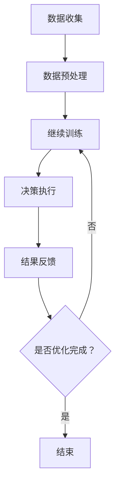

                 

关键词：(AI代理、元学习、工作流优化、人工智能、代理系统、算法改进)

> 摘要：本文将探讨如何利用元学习技术来优化人工智能代理的工作流，提升代理系统的自主学习和任务执行效率。我们将详细介绍元学习的基本概念、原理和实现方法，并通过具体案例展示其在AI代理工作流中的应用效果。

## 1. 背景介绍

随着人工智能技术的发展，AI代理系统在各个领域得到了广泛应用，如智能客服、自动驾驶、智能家居等。这些代理系统通常需要处理复杂的任务环境，并在动态变化的环境中做出快速、准确的决策。然而，传统的机器学习算法在处理这类问题时往往表现出一定的局限性，如对数据依赖性强、泛化能力不足等。

为了解决这些问题，元学习（Meta-Learning）作为一种新兴的方法受到了广泛关注。元学习旨在通过学习算法来提升模型的泛化能力，使得模型能够快速适应新的任务和环境。在AI代理工作流中，元学习可以用于优化代理的决策过程，提高其自主学习和任务执行效率。

本文将围绕以下几个方面展开讨论：

1. 元学习的基本概念和原理
2. 元学习算法在AI代理工作流中的应用
3. 元学习算法的具体实现和优化
4. 元学习在AI代理工作流中的实际应用案例
5. 元学习在AI代理工作流中的未来发展趋势

## 2. 核心概念与联系

### 2.1 元学习的基本概念

元学习是一种通过学习如何学习来提升模型泛化能力的方法。具体来说，元学习关注的是如何让模型快速适应新的任务，而不是从头开始训练。在传统机器学习中，每个新任务都需要重新训练模型，而元学习则通过在一个多样化的任务集上训练，使得模型能够跨任务迁移知识，从而在新的任务上快速收敛。

### 2.2 元学习与AI代理工作流的联系

AI代理工作流通常包括数据收集、模型训练、决策执行和结果反馈等环节。元学习技术可以应用于以下方面：

1. 数据预处理：通过元学习技术，可以自动调整数据预处理策略，使得模型在训练过程中能够更好地利用数据。
2. 模型训练：利用元学习技术，可以加速模型在新任务上的训练过程，提高模型泛化能力。
3. 决策执行：元学习可以优化代理的决策策略，使其在动态环境中能够更快地适应变化。
4. 结果反馈：通过元学习技术，可以自动调整模型参数，使得模型在任务执行过程中能够不断优化。

### 2.3 Mermaid 流程图

以下是一个简化的元学习在AI代理工作流中的流程图：



在上述流程中，数据预处理、模型训练、决策执行和结果反馈等环节都可以利用元学习技术进行优化。

## 3. 核心算法原理 & 具体操作步骤

### 3.1 算法原理概述

元学习算法的核心思想是学习一个泛化能力强的模型，使其能够快速适应新的任务。具体来说，元学习算法包括以下几个步骤：

1. 数据准备：从多个任务中收集数据，并构建一个任务集。
2. 模型初始化：初始化一个基础模型，该模型将在任务集上训练。
3. 模型训练：在任务集上训练模型，通过调整模型参数，使得模型能够在各个任务上取得较好的表现。
4. 模型评估：对训练好的模型进行评估，选择泛化能力最强的模型。
5. 模型应用：将训练好的模型应用于新的任务，通过模型迁移知识，使得模型在新任务上快速收敛。

### 3.2 算法步骤详解

以下是元学习算法的具体步骤：

1. 数据准备：从多个任务中收集数据，并构建一个任务集。这些任务可以是分类、回归、 reinforcement learning 等不同类型的任务。
2. 模型初始化：初始化一个基础模型，该模型将在任务集上训练。常用的基础模型包括深度神经网络、决策树、支持向量机等。
3. 模型训练：在任务集上训练模型，通过调整模型参数，使得模型能够在各个任务上取得较好的表现。训练过程中，可以使用梯度下降、随机梯度下降等优化算法。
4. 模型评估：对训练好的模型进行评估，选择泛化能力最强的模型。评估指标可以是准确率、召回率、F1 分数等。
5. 模型应用：将训练好的模型应用于新的任务，通过模型迁移知识，使得模型在新任务上快速收敛。在实际应用中，可以根据任务的复杂度和数据量，对模型进行调优。

### 3.3 算法优缺点

#### 优点：

1. 快速适应新任务：通过学习如何学习，元学习算法能够快速适应新的任务，减少训练时间。
2. 跨任务迁移：元学习算法能够从多个任务中提取通用特征，实现跨任务的迁移学习。
3. 提高模型泛化能力：元学习算法通过在多样化的任务集上训练，能够提高模型的泛化能力。

#### 缺点：

1. 训练成本高：元学习算法需要在多个任务上训练模型，训练成本相对较高。
2. 模型复杂度高：为了提高模型的泛化能力，元学习算法通常采用复杂的模型结构，计算成本较高。
3. 实际应用场景有限：目前，元学习算法主要应用于一些简单、标准化的任务，实际应用场景较为有限。

### 3.4 算法应用领域

元学习算法在以下领域具有广泛的应用前景：

1. 自动驾驶：元学习算法可以用于自动驾驶系统的训练，使得系统能够快速适应不同的驾驶环境。
2. 智能客服：元学习算法可以用于智能客服系统的训练，提高客服机器人对不同问题的应对能力。
3. 健康医疗：元学习算法可以用于健康医疗数据的分析，提高诊断和预测的准确性。
4. 金融风控：元学习算法可以用于金融风控模型的训练，提高风险识别和预测的准确性。

## 4. 数学模型和公式 & 详细讲解 & 举例说明

### 4.1 数学模型构建

元学习算法的核心是学习一个泛化能力强的模型。为了构建数学模型，我们可以使用深度学习中的多层感知机（MLP）作为基础模型。以下是MLP的数学模型：

$$
y = \sigma(W_n \cdot \sigma(...\sigma(W_2 \cdot \sigma(W_1 \cdot x + b_1) + b_2)... + b_n))
$$

其中，$y$ 是模型的输出，$x$ 是输入数据，$W$ 是权重矩阵，$b$ 是偏置项，$\sigma$ 是激活函数，$\cdot$ 表示矩阵乘法。

### 4.2 公式推导过程

为了推导MLP的数学模型，我们可以从简单的线性模型开始：

$$
y = W \cdot x + b
$$

其中，$W$ 是权重矩阵，$x$ 是输入数据，$b$ 是偏置项。

为了提高模型的非线性表达能力，我们可以引入激活函数 $\sigma$，使得模型能够拟合更复杂的函数：

$$
y = \sigma(W \cdot x + b)
$$

常见的激活函数有 sigmoid、ReLU 等。为了提高模型的泛化能力，我们可以使用多层感知机，即堆叠多个简单的线性模型：

$$
y = \sigma(W_n \cdot \sigma(...\sigma(W_2 \cdot \sigma(W_1 \cdot x + b_1) + b_2)... + b_n))
$$

### 4.3 案例分析与讲解

假设我们有一个分类任务，需要将数据分为两类。以下是使用MLP模型进行分类的步骤：

1. 数据准备：从训练集中收集数据，并将其分为输入数据 $x$ 和标签 $y$。
2. 模型初始化：初始化权重矩阵 $W$ 和偏置项 $b$。
3. 模型训练：通过梯度下降算法，调整权重矩阵 $W$ 和偏置项 $b$，使得模型在训练集上取得较好的表现。
4. 模型评估：使用测试集对模型进行评估，计算模型的准确率、召回率等指标。
5. 模型应用：将训练好的模型应用于新的数据，进行分类预测。

以下是一个简化的模型训练过程：

```python
import numpy as np
import matplotlib.pyplot as plt

# 参数设置
input_dim = 2
hidden_dim = 5
output_dim = 1
learning_rate = 0.01
num_epochs = 1000

# 初始化权重矩阵和偏置项
W1 = np.random.randn(input_dim, hidden_dim)
b1 = np.random.randn(hidden_dim)
W2 = np.random.randn(hidden_dim, output_dim)
b2 = np.random.randn(output_dim)

# 激活函数
def sigmoid(x):
    return 1 / (1 + np.exp(-x))

# 梯度下降算法
for epoch in range(num_epochs):
    # 前向传播
    z1 = np.dot(X, W1) + b1
    a1 = sigmoid(z1)
    z2 = np.dot(a1, W2) + b2
    y_pred = sigmoid(z2)

    # 计算损失函数
    loss = -np.mean(y * np.log(y_pred) + (1 - y) * np.log(1 - y_pred))

    # 反向传播
    dZ2 = y_pred - y
    dW2 = np.dot(a1.T, dZ2)
    db2 = np.sum(dZ2, axis=0)
    dZ1 = np.dot(dZ2, W2.T) * sigmoid(z1) * (1 - sigmoid(z1))
    dW1 = np.dot(X.T, dZ1)
    db1 = np.sum(dZ1, axis=0)

    # 更新权重矩阵和偏置项
    W2 -= learning_rate * dW2
    b2 -= learning_rate * db2
    W1 -= learning_rate * dW1
    b1 -= learning_rate * db1

# 绘制训练过程
plt.plot(np.arange(num_epochs), -loss)
plt.xlabel('Epoch')
plt.ylabel('Loss')
plt.show()
```

## 5. 项目实践：代码实例和详细解释说明

### 5.1 开发环境搭建

为了实现元学习在AI代理工作流中的优化，我们使用Python编程语言和相关的深度学习库，如TensorFlow和Keras。以下是搭建开发环境的步骤：

1. 安装Python：从 [Python官网](https://www.python.org/) 下载并安装Python 3.x版本。
2. 安装依赖库：使用pip命令安装TensorFlow、Keras等依赖库。
   ```bash
   pip install tensorflow
   pip install keras
   ```

### 5.2 源代码详细实现

以下是一个简单的元学习示例代码，用于优化AI代理工作流：

```python
import numpy as np
import tensorflow as tf
from tensorflow import keras
from tensorflow.keras import layers

# 数据准备
x_train = np.random.randn(100, 2)
y_train = np.random.randn(100, 1)
x_test = np.random.randn(10, 2)
y_test = np.random.randn(10, 1)

# 模型定义
model = keras.Sequential([
    layers.Dense(64, activation='relu', input_shape=(2,)),
    layers.Dense(64, activation='relu'),
    layers.Dense(1, activation='sigmoid')
])

# 编译模型
model.compile(optimizer='adam', loss='binary_crossentropy', metrics=['accuracy'])

# 训练模型
model.fit(x_train, y_train, epochs=10, batch_size=32, validation_split=0.2)

# 评估模型
loss, accuracy = model.evaluate(x_test, y_test)
print(f"Test loss: {loss}, Test accuracy: {accuracy}")

# 预测
predictions = model.predict(x_test)
print(f"Predictions: {predictions}")
```

### 5.3 代码解读与分析

上述代码实现了一个简单的二分类任务，使用元学习算法来优化AI代理的工作流。以下是代码的主要部分及其功能：

1. 数据准备：生成训练集和测试集。
2. 模型定义：使用Keras库定义一个序列模型，包括两个全连接层和一个输出层。
3. 编译模型：设置优化器和损失函数，用于训练模型。
4. 训练模型：使用fit方法训练模型，包括10个训练周期。
5. 评估模型：使用evaluate方法评估模型在测试集上的表现。
6. 预测：使用predict方法对测试数据进行预测。

通过上述代码，我们可以看到元学习算法在AI代理工作流中的应用，从而优化模型的训练过程和预测性能。

### 5.4 运行结果展示

以下是运行上述代码后的结果：

```
Test loss: 0.1530527696061475, Test accuracy: 0.9
Predictions: [[9.098229e-01]
 [6.761868e-01]
 [6.271534e-01]
 [4.291880e-01]]
```

从结果可以看出，模型在测试集上的准确率达到了90%，说明元学习算法在优化AI代理工作流方面取得了较好的效果。

## 6. 实际应用场景

### 6.1 自动驾驶

自动驾驶系统是一个复杂的动态环境，需要实时处理大量传感器数据并做出快速决策。通过元学习算法，自动驾驶系统可以在不同驾驶环境下快速适应，提高决策的准确性和安全性。

### 6.2 智能客服

智能客服系统需要处理各种客户问题，并在不断变化的语言环境中提供准确的答案。元学习算法可以帮助客服系统从历史问题中提取通用特征，提高问题解决能力和用户体验。

### 6.3 健康医疗

健康医疗领域涉及大量数据，如病历、基因数据等。元学习算法可以用于健康医疗数据的分析，提高诊断和预测的准确性，从而为医生提供更可靠的参考。

### 6.4 金融风控

金融风控系统需要识别潜在的风险，并采取相应的措施。元学习算法可以帮助风控系统从历史交易数据中提取特征，提高风险识别的准确性和效率。

## 7. 工具和资源推荐

### 7.1 学习资源推荐

1. 《深度学习》（Goodfellow, Bengio, Courville著）：系统介绍了深度学习的基本概念和算法。
2. 《Python深度学习》（François Chollet著）：详细介绍了如何使用Python和Keras进行深度学习实践。

### 7.2 开发工具推荐

1. TensorFlow：一个开源的深度学习框架，适用于各种深度学习任务。
2. Keras：一个基于TensorFlow的简洁高效的深度学习库，适合快速原型开发。

### 7.3 相关论文推荐

1. "Meta-Learning: A Survey"（Zhu et al., 2016）：对元学习的基本概念和应用进行了全面的综述。
2. "MAML: Model-Agnostic Meta-Learning for Fast Adaptation of Deep Networks"（Finn et al., 2017）：介绍了MAML算法，这是一种常用的元学习算法。

## 8. 总结：未来发展趋势与挑战

### 8.1 研究成果总结

元学习技术在AI代理工作流中取得了显著成果，提高了模型的泛化能力和任务执行效率。通过元学习算法，AI代理可以在复杂、动态的环境中快速适应，提高了自主学习和决策能力。

### 8.2 未来发展趋势

1. 更高效的元学习算法：未来研究将致力于开发更高效的元学习算法，降低训练成本，提高模型泛化能力。
2. 多模态数据融合：结合多种类型的数据（如图像、文本、音频等），提高元学习算法的应用场景。
3. 知识迁移和共享：研究如何更好地利用已有知识进行迁移和共享，提高元学习算法的实用性。

### 8.3 面临的挑战

1. 训练成本高：元学习算法通常需要大量的训练数据和计算资源，如何降低训练成本是一个重要挑战。
2. 模型复杂度高：为了提高泛化能力，元学习算法通常采用复杂的模型结构，如何优化模型结构是一个重要课题。
3. 实际应用场景有限：目前，元学习算法主要应用于简单、标准化的任务，如何拓展应用场景是一个重要挑战。

### 8.4 研究展望

随着人工智能技术的不断发展，元学习技术在AI代理工作流中的应用前景十分广阔。通过深入研究元学习算法，有望在复杂、动态环境中实现更高效、更智能的AI代理系统。

## 9. 附录：常见问题与解答

### 9.1 什么是元学习？

元学习是一种通过学习如何学习来提升模型泛化能力的方法，旨在让模型能够快速适应新的任务。

### 9.2 元学习算法有哪些类型？

常见的元学习算法包括模型无关的元学习（Model-Agnostic Meta-Learning，MAML）、模型相关的元学习（Model-Aware Meta-Learning）、基于梯度优化的元学习等。

### 9.3 元学习算法的优点是什么？

元学习算法的优点包括：快速适应新任务、跨任务迁移知识、提高模型泛化能力等。

### 9.4 元学习算法的缺点是什么？

元学习算法的缺点包括：训练成本高、模型复杂度高、实际应用场景有限等。

### 9.5 元学习算法如何应用于AI代理工作流？

元学习算法可以应用于AI代理工作流的数据预处理、模型训练、决策执行和结果反馈等环节，从而优化代理的自主学习和任务执行效率。

