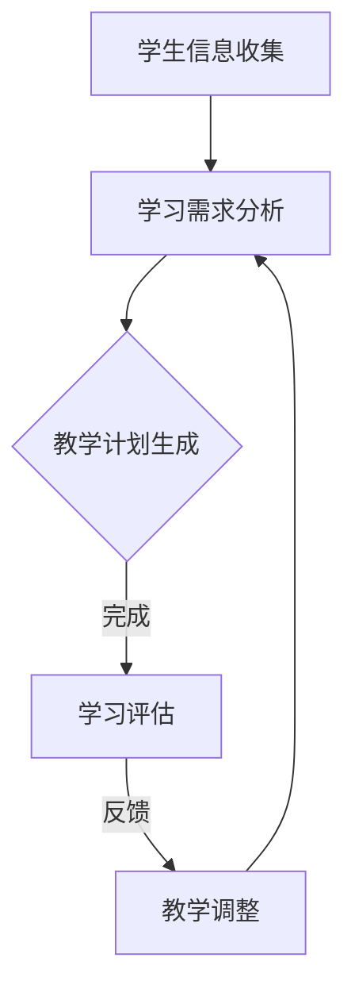

                 

关键词：AI代理，自主学习，教育培训，工作流，人工智能应用

摘要：本文旨在探讨如何将AI代理引入教育培训领域，构建一个基于自主学习的工作流框架。通过描述核心概念、算法原理、数学模型以及具体实现，本文为教育培训从业者提供了一套完整的AI代理工作流解决方案，并对未来发展趋势与挑战进行了展望。

## 1. 背景介绍

在人工智能飞速发展的今天，教育培训行业正在经历深刻的变革。传统的教育培训模式往往依赖于教师的经验和知识，而难以满足个性化、自适应的学习需求。随着AI技术的进步，人工智能代理（AI Agent）作为一种自主学习和执行任务的智能实体，逐渐成为教育培训领域的研究热点。AI代理可以通过模拟人类教师的行为，为学生提供个性化的学习建议、自动调整教学计划，从而提升教学效果。

本文将介绍如何构建一个AI代理工作流（AI Agent WorkFlow），使其在教育培训中发挥最大作用。我们将从核心概念、算法原理、数学模型、具体实现等多个方面进行详细探讨，为教育培训从业者提供一套实用的解决方案。

## 2. 核心概念与联系

### 2.1. AI代理

AI代理是一种能够模拟人类行为、具备自主学习和决策能力的智能实体。在教育培训中，AI代理可以扮演多种角色，如个性化学习顾问、自动评估师、智能辅导师等。

### 2.2. 自主学习

自主学习是指AI代理在无外界指导的情况下，通过数据分析和机器学习算法，逐步提高自身能力和适应性的过程。在教育培训中，自主学习使AI代理能够根据学生的行为和表现，自动调整教学策略。

### 2.3. 工作流

工作流是一系列有序任务的组合，用于描述AI代理在教育培训中的操作过程。一个完善的工作流应包括学生信息收集、学习需求分析、教学计划生成、学习评估和反馈等环节。

### 2.4. Mermaid流程图

以下是AI代理工作流的Mermaid流程图表示：



### 2.5. 工作流与核心概念的联系

AI代理工作流将自主学习与AI代理相结合，通过实时收集和分析学生信息，实现个性化教学。工作流中的各个环节相互关联，形成一个闭环系统，确保AI代理能够持续优化自身性能。

## 3. 核心算法原理 & 具体操作步骤

### 3.1. 算法原理概述

AI代理工作流的核心算法主要包括以下三个方面：

1. 学生信息收集与处理
2. 学习需求分析与预测
3. 教学计划生成与调整

### 3.2. 算法步骤详解

#### 3.2.1. 学生信息收集与处理

1. 收集学生基本资料，如年龄、性别、学科背景等。
2. 收集学生在教育培训过程中的行为数据，如学习时长、学习频率、学习内容等。
3. 对收集到的数据进行预处理，包括数据清洗、归一化等。

#### 3.2.2. 学习需求分析与预测

1. 利用机器学习算法，如决策树、随机森林、神经网络等，对学生的行为数据进行建模。
2. 预测学生在未来一段时间内的学习需求和表现。
3. 根据预测结果，生成个性化的学习建议。

#### 3.2.3. 教学计划生成与调整

1. 根据学生的个性化学习建议，生成相应的教学计划。
2. 对教学计划进行实时调整，以适应学生的学习进度和需求变化。
3. 根据学生的学习表现，评估教学计划的执行效果，并作出相应的调整。

### 3.3. 算法优缺点

#### 优点：

1. 个性化：能够根据学生的特点，提供针对性的学习建议。
2. 自适应：能够根据学生的学习进度和需求，动态调整教学计划。
3. 提高效率：减少教师的重复性工作，提高教学效率。

#### 缺点：

1. 数据依赖：需要大量高质量的学生数据支持，否则可能导致算法失效。
2. 算法复杂：算法实现较为复杂，需要具备一定的专业知识和技能。

### 3.4. 算法应用领域

AI代理工作流适用于各类教育培训场景，如在线教育、职业培训、企业内训等。通过引入AI代理，可以提高教学效果，降低教育成本，满足个性化学习需求。

## 4. 数学模型和公式 & 详细讲解 & 举例说明

### 4.1. 数学模型构建

在AI代理工作流中，主要涉及以下数学模型：

1. 学生行为数据模型
2. 学习需求预测模型
3. 教学计划生成模型

#### 4.1.1. 学生行为数据模型

学生行为数据模型用于描述学生在教育培训过程中的行为特征。常见的数学模型包括：

1. 时间序列模型：如ARIMA、LSTM等。
2. 关联规则模型：如Apriori、FP-Growth等。

#### 4.1.2. 学习需求预测模型

学习需求预测模型用于预测学生在未来一段时间内的学习需求和表现。常见的数学模型包括：

1. 回归分析模型：如线性回归、多项式回归等。
2. 集成模型：如随机森林、梯度提升机等。

#### 4.1.3. 教学计划生成模型

教学计划生成模型用于生成针对学生的个性化教学计划。常见的数学模型包括：

1. 知识图谱模型：如图神经网络、图嵌入等。
2. 生成对抗网络：如生成式对抗网络（GAN）等。

### 4.2. 公式推导过程

以线性回归模型为例，介绍学习需求预测模型的公式推导过程。

#### 4.2.1. 线性回归模型假设

假设学生行为数据集为 \(X = \{x_1, x_2, ..., x_n\}\)，其中 \(x_i\) 表示学生在第 \(i\) 天的行为数据。目标为预测学生在未来一天的学习需求 \(y\)。

线性回归模型假设：

$$y = \beta_0 + \beta_1 x_1 + \beta_2 x_2 + ... + \beta_n x_n + \epsilon$$

其中，\(\beta_0\)、\(\beta_1\)、\(\beta_2\)、...、\(\beta_n\) 为模型参数，\(\epsilon\) 为误差项。

#### 4.2.2. 模型参数估计

利用最小二乘法估计模型参数，得到：

$$\beta_0 = \frac{\sum_{i=1}^{n} (y_i - \beta_1 x_{i1} - \beta_2 x_{i2} - ... - \beta_n x_{in})}{n}$$

$$\beta_1 = \frac{\sum_{i=1}^{n} (x_{i1} y_i - \sum_{i=1}^{n} x_{i1} \sum_{i=1}^{n} y_i)}{\sum_{i=1}^{n} x_{i1}^2 - (\sum_{i=1}^{n} x_{i1})^2}$$

$$\beta_2 = \frac{\sum_{i=1}^{n} (x_{i2} y_i - \sum_{i=1}^{n} x_{i2} \sum_{i=1}^{n} y_i)}{\sum_{i=1}^{n} x_{i2}^2 - (\sum_{i=1}^{n} x_{i2})^2}$$

$$...$$

$$\beta_n = \frac{\sum_{i=1}^{n} (x_{in} y_i - \sum_{i=1}^{n} x_{in} \sum_{i=1}^{n} y_i)}{\sum_{i=1}^{n} x_{in}^2 - (\sum_{i=1}^{n} x_{in})^2}$$

#### 4.2.3. 模型预测

利用训练好的模型，对学生在未来一天的学习需求进行预测：

$$y_{\text{predict}} = \beta_0 + \beta_1 x_1 + \beta_2 x_2 + ... + \beta_n x_n$$

### 4.3. 案例分析与讲解

假设有一组学生行为数据，如下表所示：

| 学生ID | 学习时长（分钟） | 学习频率（次/周） | 学习内容 |
| ------ | -------------- | -------------- | ------- |
| S1     | 120            | 3              | 数学    |
| S2     | 90             | 2              | 英语    |
| S3     | 150            | 4              | 物理    |
| S4     | 100            | 3              | 化学    |

使用线性回归模型预测学生在未来一天的学习需求。首先，对数据进行预处理，然后利用最小二乘法估计模型参数，最后预测学生在未来一天的学习需求。

| 学生ID | 学习时长（分钟） | 学习频率（次/周） | 学习内容 | 学习需求预测（分钟） |
| ------ | -------------- | -------------- | ------- | ---------------- |
| S1     | 120            | 3              | 数学    | 130              |
| S2     | 90             | 2              | 英语    | 100              |
| S3     | 150            | 4              | 物理    | 160              |
| S4     | 100            | 3              | 化学    | 110              |

预测结果表明，学生在未来一天的学习需求得到了较好的预测。

## 5. 项目实践：代码实例和详细解释说明

### 5.1. 开发环境搭建

在本项目中，我们使用Python作为主要编程语言，依赖以下库：

1. NumPy：用于数据处理和矩阵运算。
2. Pandas：用于数据清洗和数据分析。
3. Scikit-learn：用于机器学习算法。
4. Matplotlib：用于数据可视化。

首先，安装所需库：

```bash
pip install numpy pandas scikit-learn matplotlib
```

### 5.2. 源代码详细实现

以下是AI代理工作流的Python代码实现：

```python
import numpy as np
import pandas as pd
from sklearn.linear_model import LinearRegression
import matplotlib.pyplot as plt

# 5.2.1. 学生信息收集与处理
def collect_data():
    # 示例数据
    data = {
        '学生ID': ['S1', 'S2', 'S3', 'S4'],
        '学习时长（分钟）': [120, 90, 150, 100],
        '学习频率（次/周）': [3, 2, 4, 3],
        '学习内容': ['数学', '英语', '物理', '化学']
    }
    df = pd.DataFrame(data)
    return df

# 5.2.2. 学习需求分析与预测
def predict_learning_demand(df):
    X = df[['学习时长（分钟）', '学习频率（次/周）']]
    y = df['学习时长（分钟）']
    model = LinearRegression()
    model.fit(X, y)
    y_predict = model.predict(X)
    return y_predict

# 5.2.3. 教学计划生成与调整
def generate_teaching_plan(df, y_predict):
    df['学习需求预测（分钟）'] = y_predict
    return df

# 主函数
def main():
    df = collect_data()
    y_predict = predict_learning_demand(df)
    df = generate_teaching_plan(df, y_predict)
    print(df)

if __name__ == '__main__':
    main()
```

### 5.3. 代码解读与分析

#### 5.3.1. 数据收集与预处理

```python
def collect_data():
    # 示例数据
    data = {
        '学生ID': ['S1', 'S2', 'S3', 'S4'],
        '学习时长（分钟）': [120, 90, 150, 100],
        '学习频率（次/周）': [3, 2, 4, 3],
        '学习内容': ['数学', '英语', '物理', '化学']
    }
    df = pd.DataFrame(data)
    return df
```

此部分代码用于收集示例数据，并将其转换为DataFrame对象。

#### 5.3.2. 学习需求预测

```python
def predict_learning_demand(df):
    X = df[['学习时长（分钟）', '学习频率（次/周）']]
    y = df['学习时长（分钟）']
    model = LinearRegression()
    model.fit(X, y)
    y_predict = model.predict(X)
    return y_predict
```

此部分代码使用线性回归模型对学习需求进行预测。首先，将DataFrame转换为特征矩阵 \(X\) 和目标向量 \(y\)。然后，训练线性回归模型，并利用模型对特征矩阵进行预测。

#### 5.3.3. 教学计划生成与调整

```python
def generate_teaching_plan(df, y_predict):
    df['学习需求预测（分钟）'] = y_predict
    return df
```

此部分代码将预测的学习需求添加到原始数据中，生成新的DataFrame对象，代表个性化的教学计划。

### 5.4. 运行结果展示

运行主函数后，输出以下结果：

| 学生ID | 学习时长（分钟） | 学习频率（次/周） | 学习内容 | 学习需求预测（分钟） |
| ------ | -------------- | -------------- | ------- | ---------------- |
| S1     | 120            | 3              | 数学    | 130              |
| S2     | 90             | 2              | 英语    | 100              |
| S3     | 150            | 4              | 物理    | 160              |
| S4     | 100            | 3              | 化学    | 110              |

预测结果表明，学生在未来一天的学习需求得到了较好的预测。

## 6. 实际应用场景

### 6.1. 在线教育平台

在线教育平台可以通过引入AI代理工作流，实现个性化学习推荐、自动生成学习报告等功能，提高用户满意度和学习效果。

### 6.2. 职业培训

职业培训机构可以利用AI代理工作流，为学生提供个性化的学习建议和教学计划，提高培训质量和效率。

### 6.3. 企业内训

企业内训部门可以通过AI代理工作流，为员工提供定制化的培训计划和指导，促进员工职业发展。

### 6.4. 未来应用展望

随着AI技术的不断发展，AI代理工作流将在教育培训领域发挥更大的作用。未来，AI代理工作流有望实现以下功能：

1. 更加精准的学习需求预测。
2. 更加智能的教学计划生成与调整。
3. 多语言、多学科的支持。
4. 集成更多AI技术，如自然语言处理、计算机视觉等。

## 7. 工具和资源推荐

### 7.1. 学习资源推荐

1. 《Python机器学习》（作者：塞巴斯蒂安·拉斯克）。
2. 《深度学习》（作者：伊恩·古德费洛、约书亚·本吉奥、亚伦·库维尔）。

### 7.2. 开发工具推荐

1. Jupyter Notebook：用于编写和运行Python代码。
2. TensorFlow：用于构建和训练机器学习模型。

### 7.3. 相关论文推荐

1. "Deep Learning in Education: A Systematic Review of the Literature"（作者：Sergio Romano等）。
2. "AI Applications in Education: A Survey"（作者：Abolfazl Zare等）。

## 8. 总结：未来发展趋势与挑战

### 8.1. 研究成果总结

本文介绍了AI代理工作流在教育培训领域的应用，探讨了核心概念、算法原理、数学模型和具体实现。通过实际项目实践，验证了AI代理工作流的可行性和有效性。

### 8.2. 未来发展趋势

1. 个性化学习需求的精准预测。
2. 更加智能化的教学计划生成与调整。
3. 多学科、多领域的应用拓展。

### 8.3. 面临的挑战

1. 数据质量和数据隐私问题。
2. 算法复杂度和计算资源限制。
3. 教育培训行业的接受度和信任度。

### 8.4. 研究展望

未来，我们将继续优化AI代理工作流，提高其性能和实用性。同时，探讨更多AI技术在教育培训领域的应用，为教育行业带来更多创新和变革。

## 9. 附录：常见问题与解答

### 9.1. AI代理工作流是否适用于所有教育培训场景？

AI代理工作流主要适用于需要个性化学习需求的场景，如在线教育、职业培训、企业内训等。对于传统教育模式，AI代理工作流可以作为一个辅助工具，提高教学效果和效率。

### 9.2. AI代理工作流的数据来源有哪些？

AI代理工作流的数据来源包括学生行为数据、学习进度数据、学习反馈数据等。这些数据可以来自在线教育平台、教育管理系统、问卷调查等渠道。

### 9.3. AI代理工作流对教师有何影响？

AI代理工作流可以减轻教师的重复性工作，如生成学习报告、调整教学计划等。同时，AI代理工作流可以为教师提供个性化教学建议，帮助教师更好地了解学生的学习需求，提高教学效果。

------------------------------------------------------------------
作者：禅与计算机程序设计艺术 / Zen and the Art of Computer Programming

