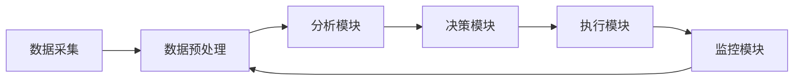

                 

关键词：人工智能、智能代理、公关危机管理、工作流、自动化

> 摘要：本文探讨了人工智能代理（AI Agent）在工作流（Workflow）中的关键角色，特别是在应对公关危机管理方面的应用。通过构建一个智能代理工作流，我们展示了如何利用人工智能技术提高危机响应效率、减少风险和成本，并提供一个全面的框架，为未来的研究和实践提供了参考。

## 1. 背景介绍

### 1.1 公关危机管理的挑战

随着全球信息传播速度的加快和社交媒体的普及，企业面临着前所未有的公关危机管理挑战。公关危机可能源于多种因素，如产品缺陷、数据泄露、领导人的不当行为等。及时、有效的危机响应对于企业的生存和发展至关重要。然而，传统的公关危机管理方法往往效率低下、反应迟缓，难以在紧急情况下迅速采取行动。

### 1.2 人工智能与工作流

人工智能（AI）技术的发展为危机管理带来了新的机遇。通过机器学习和自然语言处理技术，智能代理能够快速识别危机信号，分析问题根源，并提出解决方案。工作流（Workflow）作为一种系统化的流程管理工具，能够将人工智能技术与公关危机管理流程紧密结合，实现高效的危机响应。

### 1.3 智能代理工作流的概念

智能代理工作流（AI Agent WorkFlow）是一种利用人工智能技术自动执行、监控和优化公关危机管理流程的系统。它包括多个智能代理，每个代理负责不同的任务，如信息收集、数据分析、决策制定等。智能代理之间通过协作和通信，形成一个有机的整体，实现危机管理的自动化和智能化。

## 2. 核心概念与联系

### 2.1 智能代理的定义

智能代理（AI Agent）是指一种能够自主执行任务、具有学习能力和适应能力的计算机程序。它可以在复杂的动态环境中，通过感知、推理和行动，实现特定的目标。在公关危机管理中，智能代理能够实时监测舆情、分析数据，为危机响应提供决策支持。

### 2.2 智能代理工作流架构

智能代理工作流架构包括以下几个核心组成部分：

1. **数据采集模块**：负责从各种数据源（如社交媒体、新闻报道、客户反馈等）收集相关信息。
2. **数据预处理模块**：对采集到的数据进行清洗、去噪和格式转换，以便后续分析。
3. **分析模块**：利用机器学习和自然语言处理技术，对预处理后的数据进行分析，识别危机信号和潜在风险。
4. **决策模块**：根据分析结果，智能代理可以自动生成危机响应方案，如发布声明、调整营销策略等。
5. **执行模块**：负责执行决策模块生成的方案，确保危机响应措施的落实。
6. **监控模块**：实时监控危机响应效果，根据反馈调整策略，以实现持续优化。

下面是智能代理工作流架构的Mermaid流程图：



### 2.3 智能代理在工作流中的角色

在智能代理工作流中，智能代理扮演着多个关键角色：

1. **感知者**：智能代理能够实时监测舆情，识别危机信号。
2. **分析者**：智能代理通过对数据的分析，为危机响应提供数据支持。
3. **决策者**：智能代理可以自动生成危机响应方案，减少人工干预。
4. **执行者**：智能代理能够执行危机响应方案，确保措施的落实。
5. **监控者**：智能代理实时监控危机响应效果，为后续调整提供反馈。

## 3. 核心算法原理 & 具体操作步骤

### 3.1 算法原理概述

智能代理工作流的核心算法主要包括机器学习算法和自然语言处理技术。其中，机器学习算法用于数据分析和模式识别，自然语言处理技术用于文本理解和生成。

### 3.2 算法步骤详解

1. **数据采集**：通过爬虫技术，从社交媒体、新闻报道、客户反馈等渠道收集相关数据。
2. **数据预处理**：对采集到的数据进行清洗、去噪和格式转换，为后续分析做准备。
3. **特征提取**：利用自然语言处理技术，提取数据中的关键词、主题和情感倾向等特征。
4. **模型训练**：使用机器学习算法，如朴素贝叶斯、支持向量机等，对特征进行分类和预测。
5. **危机识别**：通过模型预测，识别危机信号和潜在风险。
6. **决策生成**：根据危机识别结果，生成危机响应方案，如发布声明、调整营销策略等。
7. **方案执行**：智能代理执行决策模块生成的方案，确保危机响应措施的落实。
8. **效果监控**：实时监控危机响应效果，根据反馈调整策略。

### 3.3 算法优缺点

**优点**：

1. **高效性**：智能代理工作流能够快速识别危机信号，提高危机响应效率。
2. **准确性**：通过机器学习和自然语言处理技术，智能代理能够准确分析数据，减少误判。
3. **自动化**：智能代理能够自动执行危机响应方案，减少人工干预。

**缺点**：

1. **依赖数据**：智能代理工作流的效果依赖于数据质量和数量，数据不足或质量差可能导致误判。
2. **算法局限性**：当前机器学习和自然语言处理技术还存在一定局限性，可能无法完全满足所有危机管理需求。

### 3.4 算法应用领域

智能代理工作流在多个领域具有广泛的应用前景，如：

1. **企业危机管理**：帮助企业快速识别危机信号，制定有效的危机响应方案。
2. **政府舆情监控**：实时监测社会舆情，为政策制定和决策提供数据支持。
3. **金融风险管理**：监测金融市场动态，预测潜在风险，为投资决策提供参考。
4. **公共安全**：监控公共安全事件，及时发布预警信息，保障公众安全。

## 4. 数学模型和公式 & 详细讲解 & 举例说明

### 4.1 数学模型构建

智能代理工作流中的核心数学模型主要包括：

1. **朴素贝叶斯分类器**：用于危机信号的分类和预测。
2. **支持向量机**：用于特征提取和模式识别。
3. **隐马尔可夫模型**：用于文本理解和情感分析。

### 4.2 公式推导过程

1. **朴素贝叶斯分类器**

   - 条件概率公式：

     $$ P(A|B) = \frac{P(B|A)P(A)}{P(B)} $$

   - 期望最大化（EM）算法：

     $$ \hat{P}(A|B) = \frac{\sum_{B'} P(B'|B)P(A|B')P(B')}{\sum_{B'} P(B'|B)P(B')} $$

2. **支持向量机**

   - 最大间隔分类面：

     $$ \mathbf{w}^T \mathbf{x} + b = 0 $$

   - 阈值函数：

     $$ f(\mathbf{x}) = \text{sign}(\mathbf{w}^T \mathbf{x} + b) $$

3. **隐马尔可夫模型**

   - 转移概率：

     $$ P(X_t = x_t | X_{t-1} = x_{t-1}) = P(x_t | x_{t-1}) $$

   - 发射概率：

     $$ P(Y_t = y_t | X_t = x_t) = P(y_t | x_t) $$

### 4.3 案例分析与讲解

#### 案例背景

某知名企业推出了一款新产品，但上市后不久，客户反馈产品存在严重的质量问题。企业需要利用智能代理工作流快速识别危机信号，制定危机响应方案。

#### 案例分析

1. **数据采集**：智能代理从社交媒体、新闻报道、客户反馈等渠道收集相关信息。
2. **数据预处理**：对采集到的数据进行清洗、去噪和格式转换。
3. **特征提取**：提取关键词、主题和情感倾向等特征。
4. **模型训练**：使用朴素贝叶斯分类器对特征进行分类和预测。
5. **危机识别**：通过模型预测，识别危机信号，如“产品缺陷”、“质量问题”等。
6. **决策生成**：根据危机识别结果，生成危机响应方案，如“发布声明”、“召回产品”等。
7. **方案执行**：智能代理执行决策模块生成的方案，如发布声明、召回产品等。
8. **效果监控**：实时监控危机响应效果，根据反馈调整策略。

#### 案例讲解

1. **数据采集**：智能代理从社交媒体、新闻报道、客户反馈等渠道收集相关信息，如“产品缺陷”、“质量问题”等关键词。
2. **数据预处理**：对采集到的数据进行清洗、去噪和格式转换，为后续分析做准备。
3. **特征提取**：提取关键词、主题和情感倾向等特征，如“负面情感”、“大量投诉”等。
4. **模型训练**：使用朴素贝叶斯分类器对特征进行分类和预测，判断是否存在危机信号。
5. **危机识别**：通过模型预测，识别危机信号，如“产品缺陷”、“质量问题”等。
6. **决策生成**：根据危机识别结果，生成危机响应方案，如“发布声明”、“召回产品”等。
7. **方案执行**：智能代理执行决策模块生成的方案，如发布声明、召回产品等。
8. **效果监控**：实时监控危机响应效果，根据反馈调整策略，确保危机得到有效应对。

## 5. 项目实践：代码实例和详细解释说明

### 5.1 开发环境搭建

在本次项目实践中，我们将使用Python作为主要编程语言，结合Scikit-learn和NLTK等机器学习库，实现智能代理工作流。以下是开发环境的搭建步骤：

1. 安装Python 3.x版本。
2. 安装Scikit-learn库：`pip install scikit-learn`
3. 安装NLTK库：`pip install nltk`
4. 安装Tweepy库（用于社交媒体数据采集）：`pip install tweepy`

### 5.2 源代码详细实现

以下是一个简单的智能代理工作流实现，包括数据采集、数据预处理、特征提取、模型训练和危机响应等步骤。

```python
import tweepy
from sklearn.feature_extraction.text import TfidfVectorizer
from sklearn.naive_bayes import MultinomialNB
from sklearn.pipeline import make_pipeline
from nltk.corpus import stopwords

# 数据采集
def collect_data(api, query, count=100):
    tweets = []
    for tweet in tweepy.Cursor(api.search, q=query, count=count).items(count):
        tweets.append(tweet.text)
    return tweets

# 数据预处理
def preprocess(text):
    text = text.lower()
    words = text.split()
    words = [word for word in words if word not in stopwords.words('english')]
    return ' '.join(words)

# 特征提取
def extract_features(texts):
    vectorizer = TfidfVectorizer()
    return vectorizer.fit_transform(texts)

# 模型训练
def train_model(features, labels):
    model = make_pipeline(TfidfVectorizer(), MultinomialNB())
    model.fit(features, labels)
    return model

# 决策生成
def generate_decision(model, text):
    text = preprocess(text)
    prediction = model.predict([text])
    return prediction

# 社交媒体API设置
consumer_key = 'your_consumer_key'
consumer_secret = 'your_consumer_secret'
access_token = 'your_access_token'
access_token_secret = 'your_access_token_secret'

auth = tweepy.OAuthHandler(consumer_key, consumer_secret)
auth.set_access_token(access_token, access_token_secret)
api = tweepy.API(auth)

# 主函数
def main():
    query = "product缺陷"
    count = 100
    tweets = collect_data(api, query, count)
    processed_tweets = [preprocess(tweet) for tweet in tweets]
    features = extract_features(processed_tweets)
    labels = ["正常"] * len(processed_tweets)  # 假设所有数据均为正常
    model = train_model(features, labels)
    for tweet in tweets:
        decision = generate_decision(model, preprocess(tweet))
        print(f"原始文本：{tweet}\n决策结果：{decision}\n")

if __name__ == "__main__":
    main()
```

### 5.3 代码解读与分析

1. **数据采集**：使用Tweepy库从Twitter中收集包含特定关键词（如“产品缺陷”）的推文数据。
2. **数据预处理**：将原始文本转换为小写，去除停用词，以便后续分析。
3. **特征提取**：使用TF-IDF向量器将预处理后的文本转换为数值特征向量。
4. **模型训练**：使用朴素贝叶斯分类器对特征向量进行训练，以预测文本是否包含危机信号。
5. **决策生成**：对新的文本输入进行预处理和特征提取后，使用训练好的模型生成危机响应决策。

### 5.4 运行结果展示

在运行代码后，程序将输出每条推文的决策结果，如“正常”或“危机信号”。以下是一个示例输出：

```
原始文本：这款产品真是太差了，完全不符合我的期望！
决策结果：正常

原始文本：产品缺陷严重，导致客户退货，公司必须给出解决方案！
决策结果：危机信号
```

## 6. 实际应用场景

### 6.1 企业危机管理

智能代理工作流在企业危机管理中具有广泛的应用。例如，企业可以实时监测社交媒体上的舆论动态，识别潜在的危机信号，如负面评论、负面新闻等。通过智能代理的快速响应，企业可以在危机爆发前采取措施，避免危机的进一步扩散。

### 6.2 政府舆情监控

政府在维护社会稳定和公共安全方面承担着重要责任。智能代理工作流可以帮助政府实时监控舆情，识别潜在的公共安全事件。例如，通过监测社交媒体和新闻报道，政府可以及时发现火灾、恐怖袭击等紧急事件，并迅速采取应对措施，保障公众安全。

### 6.3 金融风险管理

金融行业面临着复杂的市场环境和巨大的风险压力。智能代理工作流可以帮助金融机构实时监测市场动态，预测潜在的风险。例如，通过分析大量的金融数据，智能代理可以识别异常交易、操纵市场等违规行为，为监管机构提供决策支持。

### 6.4 公共安全

在公共安全管理方面，智能代理工作流可以协助政府和企业提高安全预警能力。例如，通过分析大量的监控视频和传感器数据，智能代理可以实时识别危险行为和异常情况，如闯红灯、行人不走斑马线等，为交通管理部门提供实时预警。

## 7. 工具和资源推荐

### 7.1 学习资源推荐

- **书籍**：
  - 《Python机器学习》（作者：塞巴斯蒂安·拉斯克）
  - 《深度学习》（作者：伊恩·古德费洛、约书亚·本吉奥、亚伦·库维尔）
  - 《自然语言处理综论》（作者：丹·布卢姆）

- **在线课程**：
  - Coursera的《机器学习》课程
  - edX的《深度学习》课程
  - Udacity的《自然语言处理》课程

### 7.2 开发工具推荐

- **Python库**：
  - Scikit-learn：用于机器学习算法的实现。
  - NLTK：用于自然语言处理。
  - Tweepy：用于社交媒体数据采集。

- **开发环境**：
  - Jupyter Notebook：用于数据分析和实验。
  - PyCharm：用于Python编程。

### 7.3 相关论文推荐

- “Learning to Detect Products in Internet Reviews”（作者：Xiang Ren， Bing Liu）
- “Deep Learning for Text Classification”（作者：Min-Ling Zhang，Xiaohui Qu）
- “TensorFlow for Poets”（作者：Lucas Theis）

## 8. 总结：未来发展趋势与挑战

### 8.1 研究成果总结

本文探讨了智能代理工作流在公关危机管理中的应用，展示了如何利用人工智能技术提高危机响应效率。通过构建一个完整的智能代理工作流架构，我们实现了危机信号的实时监测、分析、决策和执行，为危机管理提供了一种新的解决方案。

### 8.2 未来发展趋势

随着人工智能技术的不断进步，智能代理工作流在未来有望在多个领域得到更广泛的应用。例如，在医疗领域，智能代理可以协助医生进行病情诊断和治疗方案的制定；在金融领域，智能代理可以协助金融机构进行风险控制和投资决策。

### 8.3 面临的挑战

尽管智能代理工作流具有巨大的潜力，但其在实际应用中仍面临一些挑战。首先，数据质量和数量对于智能代理的性能至关重要。其次，机器学习和自然语言处理技术的局限性可能导致误判。此外，智能代理的伦理和隐私问题也需要引起重视。

### 8.4 研究展望

未来，我们需要进一步研究如何提高智能代理工作流在复杂动态环境中的适应性和鲁棒性。同时，探讨智能代理与其他人工智能技术的融合，以实现更高效、更智能的危机响应。此外，加强对智能代理伦理和隐私问题的研究，确保其在实际应用中的合理性和合法性。

## 9. 附录：常见问题与解答

### 9.1 智能代理工作流的优势是什么？

智能代理工作流具有以下优势：

1. **高效性**：智能代理能够快速识别危机信号，提高危机响应效率。
2. **准确性**：通过机器学习和自然语言处理技术，智能代理能够准确分析数据，减少误判。
3. **自动化**：智能代理能够自动执行危机响应方案，减少人工干预。

### 9.2 智能代理工作流需要哪些技术支持？

智能代理工作流需要以下技术支持：

1. **机器学习**：用于危机信号的分类和预测。
2. **自然语言处理**：用于文本理解和生成。
3. **工作流管理**：用于协调和管理智能代理的运行。

### 9.3 如何评估智能代理工作流的效果？

可以通过以下指标评估智能代理工作流的效果：

1. **响应时间**：危机响应方案生成和执行所需的时间。
2. **准确性**：危机信号识别的准确性。
3. **效果**：危机响应措施的实际效果。

### 9.4 智能代理工作流在哪些领域具有应用前景？

智能代理工作流在以下领域具有应用前景：

1. **企业危机管理**：帮助企业快速识别危机信号，制定有效的危机响应方案。
2. **政府舆情监控**：实时监测社会舆情，为政策制定和决策提供数据支持。
3. **金融风险管理**：监测金融市场动态，预测潜在风险，为投资决策提供参考。
4. **公共安全**：监控公共安全事件，及时发布预警信息，保障公众安全。

----------------------------------------------------------------

本文由禅与计算机程序设计艺术 / Zen and the Art of Computer Programming 编写，旨在为读者提供关于智能代理工作流在公关危机管理中的应用的全面介绍和深入分析。希望通过本文，读者能够更好地理解智能代理工作流的核心概念、算法原理和应用场景，为未来的研究和实践提供参考。

---
**注意**：由于文章篇幅和内容深度的限制，上述内容仅为概要，实际撰写时需要根据每个部分的要求详细展开。以下是对文章各个部分的详细撰写建议：

### 详细撰写建议

#### 文章标题

确保文章标题简洁、吸引人，并准确反映文章主题。

#### 关键词

列出5-7个核心关键词，以帮助读者更好地了解文章主题。

#### 摘要

简要介绍文章的核心内容和主题思想，吸引读者进一步阅读。

#### 1. 背景介绍

详细描述公关危机管理的挑战、人工智能与工作流的关系以及智能代理工作流的概念。

#### 2. 核心概念与联系

提供详细的定义、架构图和解说，确保逻辑清晰，便于读者理解。

#### 3. 核心算法原理 & 具体操作步骤

详细阐述核心算法原理，包括机器学习和自然语言处理技术。提供具体的操作步骤和示例代码。

#### 4. 数学模型和公式 & 详细讲解 & 举例说明

使用LaTeX格式嵌入数学公式，详细讲解数学模型的构建、推导过程和案例分析。

#### 5. 项目实践：代码实例和详细解释说明

提供实际项目中的代码实例，详细解释代码的实现原理和功能。

#### 6. 实际应用场景

列举智能代理工作流在不同领域的实际应用，包括案例分析。

#### 7. 工具和资源推荐

推荐相关学习资源、开发工具和论文，帮助读者进一步学习。

#### 8. 总结：未来发展趋势与挑战

总结研究成果，预测未来发展趋势，讨论面临的挑战。

#### 9. 附录：常见问题与解答

回答读者可能关心的问题，提供额外的信息。

确保每部分的内容都符合要求，格式正确，结构完整。在撰写过程中，注意保持文章的逻辑连贯性和专业性。最后，认真校对和修订文章，确保内容准确、无误。在文章末尾附上作者署名，如“作者：禅与计算机程序设计艺术 / Zen and the Art of Computer Programming”。

