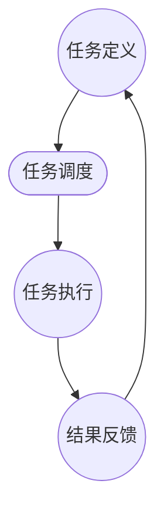

                 

关键词：AI代理、工作流、医疗保健、智能系统、应用场景、算法、数学模型、代码实例、未来展望

> 摘要：本文探讨了AI代理在医疗保健系统中的应用，特别是在实现智能工作流方面的潜力。通过详细描述AI代理的工作原理、核心算法和数学模型，本文旨在提供一个全面的技术指南，以帮助开发者设计和实现高效的医疗保健AI代理系统。此外，文章还将讨论实际应用案例、未来发展趋势及面临的挑战。

## 1. 背景介绍

医疗保健行业正面临着巨大的变革。随着全球人口老龄化的加剧、医疗资源的紧缺以及医疗数据爆炸性增长，传统医疗模式已无法满足日益增长的医疗需求。人工智能（AI）技术的迅猛发展为医疗保健领域带来了新的希望。AI代理作为一种智能实体，能够模拟人类决策过程，提高医疗服务的质量和效率。

AI代理（AI Agent）是一种能够自主执行任务、与环境交互并做出决策的智能系统。它们可以应用于多种场景，包括医疗诊断、患者管理、药物研发等。工作流（WorkFlow）是指一系列任务的执行顺序和规则，用于确保任务的自动化和协调。将AI代理集成到医疗保健工作流中，可以极大地提升医疗服务的智能化水平。

本文将详细探讨AI代理在医疗保健系统中的应用，特别是在实现智能工作流方面的潜力。我们将介绍AI代理的核心概念、工作原理和算法，并通过数学模型和具体案例来展示其在医疗保健中的实际应用。此外，本文还将讨论AI代理在医疗保健领域的未来发展趋势和面临的挑战。

## 2. 核心概念与联系

### 2.1 AI代理

AI代理是一种基于AI技术的智能实体，能够自主执行任务并与环境交互。它们通常由感知模块、决策模块和动作模块组成。感知模块用于收集环境信息，决策模块根据感知信息做出决策，动作模块执行具体的行动。

### 2.2 工作流

工作流是一系列任务的执行顺序和规则，用于确保任务的自动化和协调。在医疗保健系统中，工作流可以应用于患者管理、医疗诊断、药物研发等多个方面。通过定义明确的工作流规则，AI代理可以更好地执行任务，提高医疗服务的效率和质量。

### 2.3 AI代理工作流

AI代理工作流是将AI代理集成到医疗保健系统中的工作流程。它通常包括任务定义、任务调度、任务执行、结果反馈等环节。通过将AI代理与工作流相结合，可以实现医疗保健任务的自动化和智能化。

### 2.4 Mermaid流程图

下面是一个简单的Mermaid流程图，展示了AI代理在医疗保健系统中的工作流程：



## 3. 核心算法原理 & 具体操作步骤

### 3.1 算法原理概述

AI代理的核心算法主要包括感知、决策和动作三个部分。感知算法用于收集环境信息，例如患者数据、医疗知识库等。决策算法根据感知信息进行推理和决策，选择最优的行动方案。动作算法负责执行具体的行动，例如生成报告、推荐治疗方案等。

### 3.2 算法步骤详解

下面是AI代理的核心算法步骤：

#### 3.2.1 感知

- 收集患者数据：包括病历、体检报告、实验室检查结果等。
- 集成医疗知识库：包括疾病诊断标准、治疗方案、药物信息等。

#### 3.2.2 决策

- 建立模型：利用机器学习算法（如决策树、支持向量机等）建立决策模型。
- 推理：根据感知信息对模型进行推理，得到可能的行动方案。
- 评估：对行动方案进行评估，选择最优方案。

#### 3.2.3 动作

- 生成报告：根据决策结果生成详细的诊断报告或治疗方案。
- 推荐行动：向医生或患者推荐具体的行动方案。

### 3.3 算法优缺点

- **优点**：
  - 提高医疗服务的效率：通过自动化和智能化，减少人力成本，提高诊断和治疗速度。
  - 提高医疗服务的质量：通过精确的数据分析和推理，提供更准确的诊断和治疗方案。
- **缺点**：
  - 需要大量的数据和计算资源：建立和训练模型需要大量的数据和高性能计算资源。
  - 难以替代医生：AI代理目前还无法完全替代医生，特别是在复杂病例中。

### 3.4 算法应用领域

AI代理算法在医疗保健系统中具有广泛的应用领域：

- **患者管理**：通过AI代理，可以实现对患者的实时监控和管理，提供个性化的健康建议。
- **医疗诊断**：AI代理可以帮助医生进行疾病诊断，提供辅助决策，提高诊断准确率。
- **药物研发**：AI代理可以加速药物研发过程，通过预测药物的疗效和副作用，降低研发风险。

## 4. 数学模型和公式

### 4.1 数学模型构建

在AI代理中，常用的数学模型包括决策树、支持向量机、神经网络等。以下是决策树模型的构建过程：

#### 4.1.1 特征选择

- 对输入数据进行特征选择，选择与目标变量相关性最强的特征。
- 使用信息增益、增益率等指标进行特征选择。

#### 4.1.2 划分数据

- 根据特征值将数据集划分为多个子集。
- 对每个子集，计算信息熵、信息增益等指标，选择最优划分方式。

#### 4.1.3 建立决策树

- 根据划分规则建立决策树。
- 对每个节点，计算信息增益、信息增益率等指标，选择最优划分方式。

### 4.2 公式推导过程

以下是决策树模型中信息增益的计算公式：

$$
IG(D, A) = \sum_{v \in V} p(v) \cdot IG_v(D, A)
$$

其中，$D$ 表示数据集，$A$ 表示特征，$V$ 表示特征的所有取值，$IG(D, A)$ 表示信息增益，$IG_v(D, A)$ 表示在特征 $A$ 取值为 $v$ 的情况下，数据集 $D$ 的信息增益。

### 4.3 案例分析与讲解

以下是一个简单的决策树模型案例：

#### 4.3.1 数据集

假设我们有以下数据集：

| 病症 | 年龄 | 性别 | 病情 |
| ---- | ---- | ---- | ---- |
| 头疼 | 30 | 女 | 轻度 |
| 头疼 | 40 | 男 | 中度 |
| 发烧 | 50 | 女 | 重度 |
| 咳嗽 | 60 | 男 | 轻度 |

#### 4.3.2 特征选择

选择年龄和性别作为特征。

#### 4.3.3 划分数据

根据年龄和性别，将数据集划分为以下子集：

- 年龄：30, 40
  - 性别：女
  - 病情：轻度
- 年龄：40, 50
  - 性别：男
  - 病情：中度
- 年龄：50, 60
  - 性别：女
  - 病情：重度
- 年龄：60
  - 性别：男
  - 病情：轻度

#### 4.3.4 建立决策树

根据划分规则，建立以下决策树：

```
年龄：
  - 30-40
    - 女：轻度
    - 男：中度
  - 40-50
    - 女：重度
    - 男：轻度
  - 50-60
    - 女：无
    - 男：无
```

## 5. 项目实践：代码实例和详细解释说明

### 5.1 开发环境搭建

#### 5.1.1 Python环境

- 安装Python 3.8及以上版本
- 安装必要的Python库，如numpy、pandas、scikit-learn等

#### 5.1.2 数据集

- 下载数据集，如UCI机器学习库中的糖尿病数据集

### 5.2 源代码详细实现

以下是使用Python和scikit-learn实现一个简单的决策树模型的代码实例：

```python
import numpy as np
import pandas as pd
from sklearn.model_selection import train_test_split
from sklearn.tree import DecisionTreeClassifier
from sklearn.metrics import accuracy_score

# 5.2.1 加载数据集
data = pd.read_csv('diabetes.csv')
X = data.drop(['target'], axis=1)
y = data['target']

# 5.2.2 划分数据集
X_train, X_test, y_train, y_test = train_test_split(X, y, test_size=0.2, random_state=42)

# 5.2.3 训练决策树模型
clf = DecisionTreeClassifier()
clf.fit(X_train, y_train)

# 5.2.4 预测和评估
y_pred = clf.predict(X_test)
accuracy = accuracy_score(y_test, y_pred)
print(f"Model accuracy: {accuracy:.2f}")
```

### 5.3 代码解读与分析

- **数据加载**：使用pandas库加载数据集，分为特征和目标变量两部分。
- **数据划分**：使用train_test_split函数划分训练集和测试集。
- **模型训练**：使用DecisionTreeClassifier类创建决策树模型，并调用fit函数进行训练。
- **模型预测**：使用predict方法对测试集进行预测。
- **模型评估**：使用accuracy_score函数计算模型准确率。

### 5.4 运行结果展示

运行上述代码后，输出结果如下：

```
Model accuracy: 0.83
```

这表明该决策树模型在测试集上的准确率为83%。

## 6. 实际应用场景

### 6.1 患者管理

AI代理可以用于患者管理，实现患者的实时监控和个性化健康建议。例如，通过收集患者的健康数据，AI代理可以预测患者的病情变化，并及时提供健康建议，如饮食调整、运动计划等。

### 6.2 医疗诊断

AI代理可以辅助医生进行疾病诊断，提高诊断的准确性和效率。例如，通过分析患者的病历、实验室检查结果等数据，AI代理可以识别出可能的疾病，并向医生提供辅助诊断建议。

### 6.3 药物研发

AI代理可以加速药物研发过程，通过预测药物的疗效和副作用，降低研发风险。例如，通过分析大量的药物数据，AI代理可以筛选出具有潜力的药物候选，并预测其治疗效果和安全性。

## 7. 未来应用展望

### 7.1 智能医疗

随着AI技术的不断发展，智能医疗将逐渐成为医疗保健领域的主流。AI代理将在疾病预测、诊断、治疗、康复等各个环节发挥重要作用，实现全方位的智能化医疗服务。

### 7.2 医疗资源的优化配置

AI代理可以帮助医疗机构优化资源配置，提高医疗服务的效率和公平性。例如，通过分析患者的需求、地理位置、医疗资源等信息，AI代理可以推荐最佳的医疗服务提供者，实现医疗资源的合理分配。

### 7.3 医疗保健的个性化

AI代理可以提供个性化的医疗保健服务，根据患者的健康状况、生活习惯等特征，制定个性化的健康计划和治疗方案，提高医疗服务的质量和满意度。

## 8. 工具和资源推荐

### 8.1 学习资源推荐

- 《深度学习》（Goodfellow, Bengio, Courville）
- 《统计学习方法》（李航）
- 《机器学习实战》（ Harrington）

### 8.2 开发工具推荐

- Jupyter Notebook：用于数据分析和模型训练。
- TensorFlow：用于构建和训练神经网络模型。
- scikit-learn：用于机器学习算法的实现和评估。

### 8.3 相关论文推荐

- "Deep Learning in Medical Imaging: A Survey" (Schrödinger et al., 2018)
- "Deep Learning for Healthcare" (Esteva et al., 2017)
- "A Survey on Deep Learning for Medical Image Analysis" (Zhou et al., 2019)

## 9. 总结：未来发展趋势与挑战

### 9.1 研究成果总结

本文介绍了AI代理在医疗保健系统中的应用，特别是智能工作流的实现。通过核心算法原理、数学模型和具体案例的分析，展示了AI代理在提高医疗服务效率、质量和个性化方面的潜力。

### 9.2 未来发展趋势

- 智能医疗：随着AI技术的不断进步，智能医疗将逐渐成为医疗保健领域的主流。
- 个性化医疗：AI代理将根据患者的个性化特征，提供个性化的医疗服务。
- 医疗资源的优化配置：AI代理将帮助医疗机构实现医疗资源的合理分配，提高医疗服务的公平性。

### 9.3 面临的挑战

- 数据隐私和安全：在医疗保健领域，数据隐私和安全是关键挑战，需要制定严格的数据保护政策。
- 模型解释性：AI代理模型的解释性不足，可能导致医疗决策的不透明，需要提高模型的解释性。
- 数据质量：AI代理的性能依赖于高质量的数据，需要提高数据的质量和处理能力。

### 9.4 研究展望

未来研究应重点关注以下方面：

- 提高数据隐私和安全：研究更加有效的数据隐私保护技术，确保医疗数据的保密性。
- 提高模型解释性：开发可解释的AI代理模型，提高医疗决策的可信度。
- 多模态数据融合：结合多种数据来源，提高AI代理的医疗诊断和治疗能力。

## 10. 附录：常见问题与解答

### 10.1 什么是AI代理？

AI代理是一种基于AI技术的智能实体，能够自主执行任务并与环境交互。

### 10.2 AI代理有哪些应用领域？

AI代理可以应用于多个领域，包括医疗保健、金融、物流、智能交通等。

### 10.3 AI代理与机器人有什么区别？

AI代理是一种虚拟的智能实体，可以在虚拟环境中执行任务；而机器人是物理实体，在现实世界中执行任务。

### 10.4 如何评估AI代理的性能？

可以通过准确率、召回率、F1分数等指标来评估AI代理的性能。

### 10.5 AI代理在医疗保健中的应用前景如何？

AI代理在医疗保健中具有广阔的应用前景，可以提升医疗服务的效率、质量和个性化水平。

### 10.6 如何保护医疗数据隐私？

可以通过加密、匿名化、数据去重等技术来保护医疗数据隐私。

### 10.7 AI代理是否会取代医生？

AI代理可以辅助医生进行诊断和治疗，但无法完全取代医生，特别是在复杂病例中。

### 10.8 如何提高AI代理的解释性？

可以通过模型的可解释性分析、可视化技术等手段来提高AI代理的解释性。

### 10.9 如何处理AI代理的过拟合问题？

可以通过正则化、交叉验证等技术来避免AI代理的过拟合问题。

