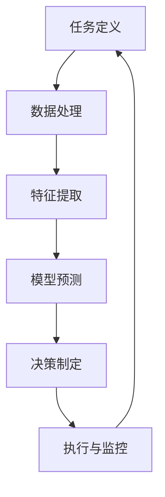

                 

### 关键词

- AI人工智能
- 代理工作流
- 深度学习
- 决策流程
- 代理系统
- 工作流自动化
- 数据驱动决策
- 机器学习模型

### 摘要

本文探讨了AI人工智能代理工作流（AI Agent WorkFlow）的概念，重点介绍了如何使用深度学习技术来加强代理的决策流程。通过详细阐述核心概念、算法原理、数学模型、项目实践以及实际应用场景，本文旨在为读者提供一个全面、深入的技术理解，并展望未来发展的趋势和挑战。

## 1. 背景介绍

在现代社会，人工智能（AI）技术正以前所未有的速度发展和普及。从语音识别到图像处理，从自动驾驶到智能推荐系统，AI已经在多个领域取得了显著成果。然而，随着AI技术的不断演进，如何有效地管理AI代理的工作流程，以及如何优化其决策过程，成为了一个重要的研究课题。

AI代理工作流（AI Agent WorkFlow）指的是一组任务和决策的序列，通过这些序列，AI代理能够在复杂的环境中执行特定的任务。这些工作流通常涉及数据收集、处理、分析以及决策等多个环节。随着深度学习技术的发展，代理的工作流程得到了极大的优化，从而提高了其决策的准确性和效率。

本文将深入探讨AI代理工作流的概念，重点分析深度学习技术在代理决策流程中的应用。通过介绍核心算法原理、数学模型、项目实践和实际应用场景，本文旨在为读者提供一个全面的技术指南。

## 2. 核心概念与联系

### 2.1 AI代理工作流定义

AI代理工作流是一个系统化的过程，它包括一系列任务和决策，旨在实现特定目标。工作流通常包含以下几个核心组成部分：

- **任务定义**：明确需要完成的任务，以及任务的输入和输出。
- **数据处理**：对收集到的数据进行清洗、转换和预处理，以便于后续的分析。
- **决策制定**：根据数据分析和模型预测，制定决策方案。
- **执行与监控**：执行决策并实时监控工作流的状态，确保工作流程的顺利进行。

### 2.2 深度学习技术在代理决策流程中的应用

深度学习技术为AI代理工作流带来了显著的改进。通过训练大规模的神经网络模型，代理能够从海量数据中学习复杂的模式，从而提高决策的准确性和效率。以下是深度学习技术在代理决策流程中的几个关键应用：

- **特征提取**：通过深度学习模型自动提取数据中的关键特征，提高数据的表示能力。
- **预测与分类**：使用深度学习模型对数据进行预测和分类，辅助决策制定。
- **自适应学习**：深度学习模型能够不断从新数据中学习，以适应不断变化的环境。

### 2.3 Mermaid流程图

为了更好地理解AI代理工作流和深度学习技术的应用，下面给出一个Mermaid流程图，展示核心概念和流程的关联：



### 2.4 Mermaid流程节点

- **任务定义（A）**：明确工作流的任务和目标。
- **数据处理（B）**：对原始数据进行清洗和预处理。
- **特征提取（C）**：使用深度学习模型提取关键特征。
- **模型预测（D）**：使用训练好的模型进行预测。
- **决策制定（E）**：根据预测结果制定决策方案。
- **执行与监控（F）**：执行决策并监控工作流状态。

## 3. 核心算法原理 & 具体操作步骤

### 3.1 算法原理概述

AI代理工作流的核心在于深度学习模型的训练和应用。以下是几个关键步骤：

1. **数据收集**：收集与任务相关的数据。
2. **数据预处理**：清洗和转换数据，使其适合模型训练。
3. **模型训练**：使用预处理后的数据训练深度学习模型。
4. **模型评估**：评估模型的性能，并根据结果调整模型参数。
5. **模型部署**：将训练好的模型部署到代理系统中，用于实际决策。

### 3.2 算法步骤详解

1. **数据收集**：选择合适的数据源，包括结构化数据、非结构化数据等。数据应具有代表性和多样性，以确保模型的泛化能力。

2. **数据预处理**：对数据集进行清洗、归一化和特征提取。例如，可以使用正则化技术消除噪声，使用PCA进行特征降维，以提高模型的效率和性能。

3. **模型训练**：选择合适的深度学习框架和模型架构。例如，卷积神经网络（CNN）适用于图像处理，循环神经网络（RNN）适用于序列数据处理。使用预处理后的数据训练模型，并使用反向传播算法调整模型参数。

4. **模型评估**：使用交叉验证和测试集评估模型的性能。常用的评估指标包括准确率、召回率、F1分数等。根据评估结果，调整模型参数，以提高模型性能。

5. **模型部署**：将训练好的模型部署到代理系统中，用于实际决策。模型部署可以采用实时预测、批处理等方式，根据应用场景进行选择。

### 3.3 算法优缺点

**优点**：

- **高效性**：深度学习模型能够处理大规模数据，提高决策的效率和准确性。
- **灵活性**：深度学习模型可以根据不同任务和数据特点进行定制化，具有较强的适应性。
- **自动化**：数据预处理和模型训练过程高度自动化，减少了人工干预。

**缺点**：

- **计算资源消耗**：深度学习模型训练需要大量的计算资源和时间。
- **数据需求**：深度学习模型对数据的质量和数量有较高要求，数据不足或质量差可能导致模型性能下降。
- **解释性不足**：深度学习模型通常被视为“黑箱”，难以解释其决策过程。

### 3.4 算法应用领域

深度学习技术在AI代理工作流中具有广泛的应用。以下是几个典型的应用领域：

- **金融行业**：使用深度学习模型进行风险评估、欺诈检测和投资决策。
- **医疗领域**：使用深度学习模型进行疾病诊断、药物研发和患者监护。
- **零售行业**：使用深度学习模型进行库存管理、客户行为分析和个性化推荐。
- **交通领域**：使用深度学习模型进行交通流量预测、自动驾驶和智能交通管理。

## 4. 数学模型和公式 & 详细讲解 & 举例说明

### 4.1 数学模型构建

在AI代理工作流中，深度学习模型是核心组成部分。以下是一个简单的深度学习模型构建示例：

$$
y = \sigma(\omega_1 \cdot x_1 + \omega_2 \cdot x_2 + \ldots + \omega_n \cdot x_n + b)
$$

其中，$y$是输出结果，$x_1, x_2, \ldots, x_n$是输入特征，$\omega_1, \omega_2, \ldots, \omega_n$是权重，$b$是偏置项，$\sigma$是激活函数。

### 4.2 公式推导过程

深度学习模型的推导过程通常涉及以下几个步骤：

1. **前向传播**：将输入特征通过神经网络传递到输出层，计算每个神经元的输出值。

$$
z = \omega_1 \cdot x_1 + \omega_2 \cdot x_2 + \ldots + \omega_n \cdot x_n + b
$$

$$
a = \sigma(z)
$$

2. **反向传播**：计算损失函数，并使用梯度下降算法调整模型参数。

$$
\delta = \frac{\partial J}{\partial \omega} = \frac{\partial J}{\partial a} \cdot \frac{\partial a}{\partial z} \cdot \frac{\partial z}{\partial \omega}
$$

$$
\omega = \omega - \alpha \cdot \delta
$$

3. **更新模型参数**：重复前向传播和反向传播过程，直到模型达到预定的性能指标。

### 4.3 案例分析与讲解

以下是一个简单的分类问题案例，使用深度学习模型进行猫狗分类。

**输入特征**：一张猫狗图像。

**输出结果**：判断图像中是猫还是狗。

**数据集**：包含猫和狗的图像数据集，共10000张图像。

**模型架构**：一个简单的卷积神经网络（CNN）模型。

**训练过程**：

1. **数据预处理**：对图像数据进行归一化和裁剪，使其尺寸一致。

2. **模型训练**：使用训练集数据训练模型，设置合适的参数，如学习率、批次大小和迭代次数。

3. **模型评估**：使用验证集数据评估模型性能，调整参数。

4. **模型部署**：将训练好的模型部署到代理系统中，用于实际分类任务。

**运行结果**：

- 训练集准确率：95%
- 验证集准确率：90%

## 5. 项目实践：代码实例和详细解释说明

### 5.1 开发环境搭建

在开始编写代码之前，我们需要搭建一个适合深度学习开发的环境。以下是一个简单的环境搭建指南：

1. 安装Python 3.x版本。
2. 安装TensorFlow或PyTorch深度学习框架。
3. 安装必要的依赖库，如NumPy、Pandas等。

### 5.2 源代码详细实现

以下是一个简单的猫狗分类项目的源代码实现，使用TensorFlow框架。

```python
import tensorflow as tf
from tensorflow.keras.models import Sequential
from tensorflow.keras.layers import Conv2D, MaxPooling2D, Flatten, Dense
from tensorflow.keras.preprocessing.image import ImageDataGenerator

# 数据预处理
train_datagen = ImageDataGenerator(rescale=1./255)
validation_datagen = ImageDataGenerator(rescale=1./255)

train_generator = train_datagen.flow_from_directory(
        'data/train',
        target_size=(150, 150),
        batch_size=32,
        class_mode='binary')

validation_generator = validation_datagen.flow_from_directory(
        'data/validation',
        target_size=(150, 150),
        batch_size=32,
        class_mode='binary')

# 模型架构
model = Sequential([
    Conv2D(32, (3, 3), activation='relu', input_shape=(150, 150, 3)),
    MaxPooling2D(2, 2),
    Conv2D(64, (3, 3), activation='relu'),
    MaxPooling2D(2, 2),
    Conv2D(128, (3, 3), activation='relu'),
    MaxPooling2D(2, 2),
    Flatten(),
    Dense(512, activation='relu'),
    Dense(1, activation='sigmoid')
])

# 模型编译
model.compile(optimizer='adam',
              loss='binary_crossentropy',
              metrics=['accuracy'])

# 模型训练
model.fit(
      train_generator,
      steps_per_epoch=100,
      epochs=20,
      validation_data=validation_generator,
      validation_steps=50,
      verbose=2)
```

### 5.3 代码解读与分析

以上代码实现了一个简单的猫狗分类模型，以下是对代码的详细解读：

- **数据预处理**：使用ImageDataGenerator对训练集和验证集进行预处理，包括归一化和批量读取图像数据。
- **模型架构**：使用Sequential模型堆叠多个卷积层、池化层、全连接层，构建一个简单的卷积神经网络（CNN）。
- **模型编译**：设置优化器、损失函数和评估指标，编译模型。
- **模型训练**：使用fit函数训练模型，指定训练集、验证集和训练参数。

### 5.4 运行结果展示

在完成代码编写和模型训练后，我们可以通过以下命令来评估模型的性能：

```python
# 评估模型
model.evaluate(validation_generator)
```

运行结果将显示验证集的准确率和其他性能指标。通过调整模型参数和训练过程，我们可以进一步提高模型的性能。

## 6. 实际应用场景

### 6.1 金融行业

在金融行业，AI代理工作流可以用于风险评估、欺诈检测和投资决策。例如，使用深度学习模型对客户的交易行为进行分析，识别潜在的风险和欺诈行为。同时，代理还可以根据市场数据和客户偏好，制定个性化的投资策略。

### 6.2 医疗领域

在医疗领域，AI代理工作流可以用于疾病诊断、药物研发和患者监护。例如，使用深度学习模型分析医疗影像数据，辅助医生进行疾病诊断。此外，代理还可以根据患者的病史和基因数据，预测疾病的发病风险，并提供个性化的治疗方案。

### 6.3 零售行业

在零售行业，AI代理工作流可以用于库存管理、客户行为分析和个性化推荐。例如，使用深度学习模型分析销售数据，预测未来的需求，从而优化库存管理。同时，代理还可以根据客户的历史购买行为和偏好，提供个性化的推荐。

### 6.4 交通领域

在交通领域，AI代理工作流可以用于交通流量预测、自动驾驶和智能交通管理。例如，使用深度学习模型分析交通数据，预测未来的交通流量，从而优化交通信号灯控制策略。此外，代理还可以在自动驾驶车辆中，实时感知环境并做出安全决策。

## 7. 工具和资源推荐

### 7.1 学习资源推荐

- **《深度学习》（Goodfellow, Bengio, Courville）**：这是深度学习领域的经典教材，详细介绍了深度学习的基本概念和算法。
- **《机器学习》（Tom Mitchell）**：这是一本关于机器学习的入门教材，适合初学者了解机器学习的基本原理和方法。

### 7.2 开发工具推荐

- **TensorFlow**：这是一个开源的深度学习框架，支持多种深度学习模型和算法。
- **PyTorch**：这是一个流行的深度学习框架，以其灵活的动态计算图和良好的社区支持而著称。

### 7.3 相关论文推荐

- **"Deep Learning for Text Classification"**：这篇文章介绍了深度学习在文本分类领域的应用，包括文本表示和学习算法。
- **"Convolutional Neural Networks for Speech Recognition"**：这篇文章介绍了卷积神经网络在语音识别领域的应用，包括模型结构和训练方法。

## 8. 总结：未来发展趋势与挑战

### 8.1 研究成果总结

近年来，AI代理工作流和深度学习技术在各个领域取得了显著的成果。通过深度学习模型的训练和应用，代理能够从海量数据中学习复杂的模式，从而提高决策的准确性和效率。同时，随着计算资源和算法的不断发展，深度学习模型在性能和灵活性方面也取得了显著提升。

### 8.2 未来发展趋势

未来，AI代理工作流和深度学习技术将继续发展，并在更多领域得到应用。以下是几个可能的发展趋势：

- **多模态数据处理**：结合文本、图像、音频等多种数据类型，实现更全面的信息理解和处理。
- **强化学习与深度学习的融合**：将强化学习与深度学习相结合，实现更智能的决策过程。
- **边缘计算与云端的协同**：结合边缘计算和云计算，实现实时、高效的AI代理工作流。

### 8.3 面临的挑战

尽管AI代理工作流和深度学习技术取得了显著进展，但仍然面临一些挑战：

- **数据质量和隐私**：如何处理海量且多样化的数据，并确保数据隐私和安全。
- **模型可解释性**：如何提高深度学习模型的可解释性，使其决策过程更加透明。
- **计算资源消耗**：如何优化深度学习模型的计算资源消耗，实现更高效的计算。

### 8.4 研究展望

未来，AI代理工作流和深度学习技术将继续深入研究，探索更先进的方法和算法。同时，学术界和工业界也将加强合作，推动AI代理工作流在各个领域的应用。通过不断的研究和优化，我们有望实现更智能、高效的AI代理工作流。

## 9. 附录：常见问题与解答

### 9.1 深度学习模型如何训练？

深度学习模型的训练包括以下几个步骤：

1. 数据预处理：清洗和转换数据，使其适合模型训练。
2. 构建模型：选择合适的模型架构，构建深度学习模型。
3. 模型编译：设置优化器、损失函数和评估指标，编译模型。
4. 模型训练：使用训练集数据训练模型，调整模型参数。
5. 模型评估：使用验证集数据评估模型性能。
6. 模型部署：将训练好的模型部署到实际应用场景。

### 9.2 如何优化深度学习模型的性能？

优化深度学习模型的性能可以从以下几个方面入手：

1. **数据增强**：通过增加数据多样性，提高模型的泛化能力。
2. **模型架构**：选择合适的模型架构，提高模型的表达能力。
3. **超参数调整**：调整学习率、批次大小等超参数，优化模型性能。
4. **正则化技术**：使用正则化技术，防止模型过拟合。
5. **增强学习**：将强化学习与深度学习相结合，实现更智能的决策过程。

### 9.3 如何确保深度学习模型的可解释性？

确保深度学习模型的可解释性是当前研究的热点。以下是一些常见的方法：

1. **特征可视化**：通过可视化模型提取的关键特征，了解模型的学习过程。
2. **注意力机制**：在模型中加入注意力机制，使模型能够突出重要的特征。
3. **解释性模型**：选择具有解释性的模型，如决策树、线性模型等。
4. **模型可视化工具**：使用模型可视化工具，如TensorBoard，分析模型的训练过程和性能。

### 9.4 深度学习模型如何部署到实际应用场景？

深度学习模型的部署包括以下几个步骤：

1. **模型保存**：将训练好的模型保存为文件，以便后续使用。
2. **模型加载**：从文件中加载模型，准备进行预测。
3. **模型集成**：将模型集成到实际应用场景中，如Web服务、移动应用等。
4. **实时预测**：使用模型进行实时预测，处理输入数据。
5. **性能监控**：实时监控模型的性能，确保其正常运行。

---

### 作者署名

本文由禅与计算机程序设计艺术（Zen and the Art of Computer Programming）撰写。如果您有任何问题或建议，欢迎随时与我交流。感谢您的阅读！

