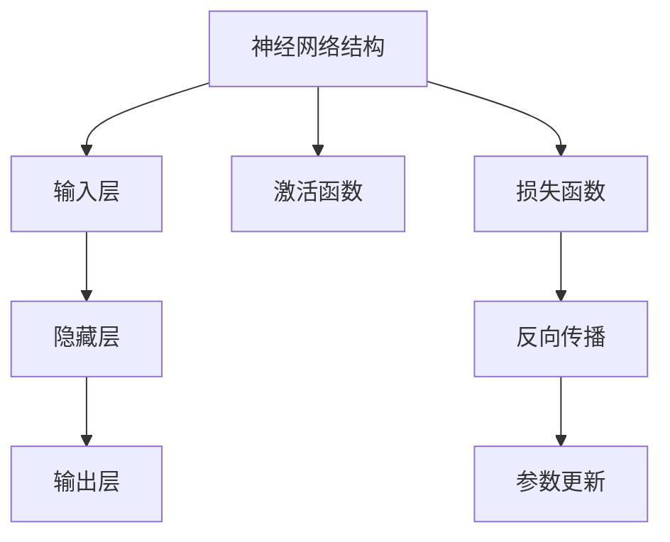

                 

### 文章关键词

- AI人工智能
- 反向传播
- 神经网络
- 深度学习
- 机器学习
- 算法原理
- 代码实例

### 文章摘要

本文将深入探讨AI人工智能领域的核心算法——反向传播算法。通过详细讲解其原理、数学模型、应用步骤和代码实例，帮助读者全面理解这一关键技术，并掌握其在实际项目中的应用方法。文章还将讨论反向传播算法的未来发展前景，以及面临的挑战。

## 1. 背景介绍

反向传播算法（Backpropagation Algorithm）是深度学习与神经网络领域的一项重要成就。它源于20世纪80年代，由心理学家和计算机科学家共同提出，旨在解决多层神经网络的训练问题。反向传播算法通过递归地计算误差梯度，并在网络中进行参数更新，从而实现模型优化。

神经网络作为一种模拟人脑结构和功能的计算模型，在图像识别、语音识别、自然语言处理等众多领域取得了显著成果。而反向传播算法作为神经网络训练的核心算法，极大地提高了神经网络的训练效率和准确性。随着深度学习技术的不断演进，反向传播算法也在不断优化和改进，已成为人工智能研究与应用的重要工具。

## 2. 核心概念与联系

在讨论反向传播算法之前，我们需要了解一些核心概念和联系。以下是一个简化的Mermaid流程图，描述了神经网络、反向传播算法以及它们之间的联系。



### 2.1 神经网络结构

神经网络由多个层次组成，包括输入层、隐藏层和输出层。每一层都包含多个神经元（或节点），它们通过加权连接的方式相互连接。

### 2.2 激活函数

激活函数用于引入非线性因素，使神经网络能够处理复杂的输入数据。常见的激活函数包括Sigmoid、ReLU和Tanh等。

### 2.3 损失函数

损失函数用于衡量模型预测值与真实值之间的差距。常见的损失函数包括均方误差（MSE）和交叉熵（Cross-Entropy）等。

### 2.4 反向传播

反向传播算法的核心在于计算损失函数关于网络参数的梯度。这一过程从输出层开始，反向传播至输入层，从而更新网络参数，使模型逐渐逼近最优解。

### 2.5 参数更新

在反向传播过程中，参数更新是基于梯度下降（Gradient Descent）算法实现的。通过调整参数的值，使损失函数逐渐减小，从而优化模型。

## 3. 核心算法原理 & 具体操作步骤

### 3.1 算法原理概述

反向传播算法的核心思想是通过计算误差梯度，反向传播至网络输入层，并利用这些梯度更新网络参数。以下是算法的简要原理概述：

1. **前向传播**：将输入数据通过网络的前向传播，得到输出结果。
2. **计算误差**：将输出结果与真实值进行比较，计算损失函数。
3. **反向传播**：从输出层开始，计算每个参数的误差梯度。
4. **参数更新**：利用梯度下降算法，更新网络参数。

### 3.2 算法步骤详解

#### 3.2.1 前向传播

前向传播是指将输入数据通过神经网络的各个层次，最终得到输出结果的过程。以下是一个简化的前向传播步骤：

1. **初始化权重和偏置**：随机初始化网络的权重和偏置。
2. **计算每个神经元的激活值**：从输入层开始，计算每个神经元的激活值，直到输出层。
3. **输出结果**：得到最终输出结果。

#### 3.2.2 计算误差

计算误差是指将输出结果与真实值进行比较，计算损失函数的值。常见的损失函数包括均方误差（MSE）和交叉熵（Cross-Entropy）等。

#### 3.2.3 反向传播

反向传播是指从输出层开始，计算每个参数的误差梯度，并将这些梯度反向传播至输入层。以下是反向传播的步骤：

1. **计算输出层误差梯度**：对于输出层，计算每个参数的误差梯度。
2. **传播误差梯度**：将输出层的误差梯度反向传播至隐藏层。
3. **计算隐藏层误差梯度**：对于隐藏层，计算每个参数的误差梯度。
4. **重复步骤2-3，直到输入层**。

#### 3.2.4 参数更新

参数更新是指利用误差梯度更新网络参数的过程。以下是一个简化的参数更新步骤：

1. **计算每个参数的更新量**：根据误差梯度计算每个参数的更新量。
2. **更新参数**：将参数更新量应用到网络中。

### 3.3 算法优缺点

#### 优点

1. **高效性**：反向传播算法通过计算误差梯度，可以实现快速模型优化。
2. **适应性**：反向传播算法适用于各种神经网络结构，具有广泛的适应性。
3. **可扩展性**：反向传播算法可以应用于深度神经网络，实现更复杂的模型。

#### 缺点

1. **计算复杂度**：反向传播算法的计算复杂度较高，特别是在大型神经网络中。
2. **局部最小值**：反向传播算法容易陷入局部最小值，导致训练失败。

### 3.4 算法应用领域

反向传播算法在深度学习领域具有广泛的应用。以下是一些主要应用领域：

1. **图像识别**：反向传播算法在图像识别领域取得了显著成果，如卷积神经网络（CNN）。
2. **语音识别**：反向传播算法在语音识别领域也被广泛应用，如循环神经网络（RNN）。
3. **自然语言处理**：反向传播算法在自然语言处理领域发挥了重要作用，如长短期记忆网络（LSTM）。

## 4. 数学模型和公式 & 详细讲解 & 举例说明

### 4.1 数学模型构建

反向传播算法的核心在于计算误差梯度。以下是一个简化的数学模型，用于计算误差梯度：

$$
\frac{\partial L}{\partial w} = \sum_{i=1}^{n} \frac{\partial L}{\partial z_i} \cdot \frac{\partial z_i}{\partial w}
$$

其中，\(L\) 表示损失函数，\(w\) 表示权重，\(z_i\) 表示每个神经元的激活值。

### 4.2 公式推导过程

以下是一个简化的误差梯度推导过程：

1. **输出层误差梯度**：
$$
\frac{\partial L}{\partial z_j} = \frac{\partial L}{\partial y} \cdot \frac{\partial y}{\partial z_j} \cdot \frac{\partial z_j}{\partial a_j} \cdot \frac{\partial a_j}{\partial z_j}
$$

2. **隐藏层误差梯度**：
$$
\frac{\partial L}{\partial z_i} = \sum_{j=1}^{n} \frac{\partial L}{\partial z_j} \cdot \frac{\partial z_j}{\partial a_i} \cdot \frac{\partial a_i}{\partial z_i}
$$

### 4.3 案例分析与讲解

以下是一个简单的线性回归案例，用于说明反向传播算法的原理。

假设我们有以下线性回归模型：
$$
y = wx + b
$$

其中，\(y\) 是输出值，\(x\) 是输入值，\(w\) 是权重，\(b\) 是偏置。

假设我们使用均方误差（MSE）作为损失函数：
$$
L = \frac{1}{2} \sum_{i=1}^{n} (y_i - wx_i - b)^2
$$

#### 前向传播

1. **初始化权重和偏置**：
   - 随机初始化权重 \(w\) 和偏置 \(b\)。

2. **计算输出值**：
   - 将输入值 \(x\) 通过模型计算输出值 \(y\)。

#### 反向传播

1. **计算输出层误差梯度**：
   - 计算输出值与真实值之间的误差。
   - 计算每个权重和偏置的误差梯度。

2. **计算隐藏层误差梯度**：
   - 将输出层的误差梯度反向传播至隐藏层。
   - 计算每个权重和偏置的误差梯度。

#### 参数更新

1. **计算每个参数的更新量**：
   - 根据误差梯度计算每个参数的更新量。

2. **更新参数**：
   - 将参数更新量应用到模型中。

通过多次迭代，模型的误差将逐渐减小，直至收敛。

## 5. 项目实践：代码实例和详细解释说明

在本节中，我们将通过一个简单的Python代码实例，展示如何实现反向传播算法。

### 5.1 开发环境搭建

确保已经安装以下Python库：

- NumPy：用于矩阵运算。
- Matplotlib：用于数据可视化。

### 5.2 源代码详细实现

以下是一个简单的反向传播算法实现：

```python
import numpy as np

# 初始化参数
w = np.random.rand(1, 1)
b = np.random.rand(1, 1)

# 训练数据
x_train = np.array([[0], [1]])
y_train = np.array([[0], [1]])

# 损失函数
def loss(y_pred, y_true):
    return ((y_pred - y_true) ** 2).mean()

# 前向传播
def forward(x):
    return w.dot(x) + b

# 反向传播
def backward(x, y):
    y_pred = forward(x)
    error = y_pred - y
    dw = (error * x).mean()
    db = error.mean()
    return dw, db

# 训练模型
for epoch in range(1000):
    dw, db = backward(x_train, y_train)
    w -= 0.01 * dw
    b -= 0.01 * db

    if epoch % 100 == 0:
        y_pred = forward(x_train)
        print(f"Epoch {epoch}: Loss = {loss(y_pred, y_train)}")

# 测试模型
x_test = np.array([[2]])
y_test = np.array([[1]])

y_pred = forward(x_test)
print(f"Test Loss = {loss(y_pred, y_test)}")
```

### 5.3 代码解读与分析

1. **初始化参数**：随机初始化权重 \(w\) 和偏置 \(b\)。

2. **训练数据**：使用简单的线性回归训练数据。

3. **损失函数**：使用均方误差（MSE）作为损失函数。

4. **前向传播**：计算输入值通过模型得到的输出值。

5. **反向传播**：计算误差梯度，并更新权重和偏置。

6. **训练模型**：通过多次迭代，更新模型参数，使损失函数逐渐减小。

7. **测试模型**：使用测试数据验证模型性能。

## 6. 实际应用场景

反向传播算法在实际应用中具有广泛的应用场景，以下是一些典型的应用案例：

1. **图像识别**：反向传播算法广泛应用于图像识别领域，如人脸识别、物体检测等。

2. **语音识别**：反向传播算法在语音识别领域发挥了重要作用，如语音合成、语音翻译等。

3. **自然语言处理**：反向传播算法在自然语言处理领域得到广泛应用，如情感分析、机器翻译等。

4. **推荐系统**：反向传播算法在推荐系统领域应用于用户行为分析，如商品推荐、音乐推荐等。

## 7. 未来应用展望

随着人工智能技术的不断发展和创新，反向传播算法在未来的应用前景将更加广阔。以下是一些可能的未来应用方向：

1. **强化学习**：反向传播算法可以应用于强化学习领域，实现智能体的自我学习和优化。

2. **量子计算**：反向传播算法可以与量子计算相结合，实现更高效的模型训练。

3. **生物医学**：反向传播算法可以应用于生物医学领域，如疾病预测、基因分析等。

## 8. 工具和资源推荐

### 8.1 学习资源推荐

1. 《深度学习》（Goodfellow, Bengio, Courville）——深度学习领域的经典教材，详细介绍了反向传播算法。
2. 《Python深度学习》（François Chollet）——通过Python实现深度学习算法，包括反向传播算法。
3. Coursera上的“深度学习”（吴恩达）——深度学习领域权威课程，涵盖反向传播算法等内容。

### 8.2 开发工具推荐

1. TensorFlow——Google开源的深度学习框架，支持反向传播算法。
2. PyTorch——Facebook开源的深度学习框架，具有灵活的动态计算图。
3. Keras——基于TensorFlow和PyTorch的高层次API，简化深度学习开发。

### 8.3 相关论文推荐

1. “A Learning Algorithm for Continually Running Fully Recurrent Neural Networks” （1989）——反向传播算法的原始论文。
2. “Improving Backpropagation Learning: Convergence Properties of Backpropagation Algorithm” （1990）——反向传播算法的改进研究。
3. “Learning representations by back-propagating errors” （1986）——反向传播算法的理论基础。

## 9. 总结：未来发展趋势与挑战

反向传播算法作为深度学习与神经网络领域的一项核心技术，取得了显著的成果。然而，随着人工智能技术的不断演进，反向传播算法也面临着一系列挑战：

1. **计算复杂度**：大型神经网络的训练需要大量的计算资源，如何优化算法以降低计算复杂度是一个重要挑战。
2. **收敛速度**：反向传播算法在训练过程中容易陷入局部最小值，如何提高收敛速度和避免陷入局部最小值是一个重要问题。
3. **参数调整**：反向传播算法的参数调整对模型性能有重要影响，如何选择合适的参数是一个挑战。

未来，反向传播算法将继续在人工智能领域发挥重要作用，通过不断优化和改进，应对新的挑战。

## 10. 附录：常见问题与解答

### 10.1 什么是反向传播算法？

反向传播算法是一种用于训练神经网络的优化算法，通过递归地计算误差梯度，并利用梯度下降法更新网络参数，从而实现模型优化。

### 10.2 反向传播算法有哪些应用领域？

反向传播算法在图像识别、语音识别、自然语言处理、推荐系统等多个领域得到了广泛应用。

### 10.3 反向传播算法的优缺点是什么？

优点：高效性、适应性、可扩展性；缺点：计算复杂度、局部最小值问题。

### 10.4 如何优化反向传播算法的性能？

可以通过优化算法实现、调整参数、使用预训练模型等方法来提高反向传播算法的性能。

### 10.5 反向传播算法与其他机器学习算法有何区别？

反向传播算法是用于训练神经网络的优化算法，而其他机器学习算法如决策树、支持向量机等则适用于不同的数据类型和任务。

## 11. 结束语

本文详细介绍了AI人工智能核心算法——反向传播算法。通过讲解其原理、数学模型、应用步骤和代码实例，帮助读者全面理解这一关键技术。同时，本文还讨论了反向传播算法的实际应用场景和未来发展趋势，以及面临的挑战。希望本文能对读者在人工智能领域的探索和实践有所帮助。

作者：禅与计算机程序设计艺术 / Zen and the Art of Computer Programming

