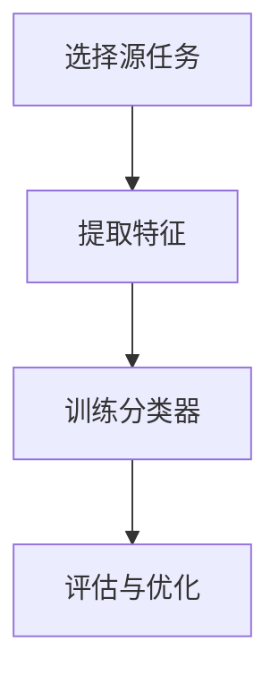

                 

关键词：人工智能，迁移学习，算法原理，代码实例，核心算法，技术讲解

> 摘要：本文将深入探讨人工智能领域中的迁移学习算法，从核心原理出发，结合代码实例，详细解析迁移学习的算法框架、数学模型、具体操作步骤、应用领域，并提供实际项目实践，旨在为广大AI研究者和技术人员提供全面的迁移学习指南。

## 1. 背景介绍

迁移学习（Transfer Learning）是人工智能领域的一个重要分支，旨在将已经学习到的知识从一个任务（源任务）迁移到另一个不同的任务（目标任务）上。这一概念的核心在于，通过利用已有模型的知识，可以避免从头开始训练的繁琐过程，提高模型的训练效率和性能。

### 1.1 迁移学习的起源与发展

迁移学习的概念最早可以追溯到20世纪50年代，当时学者们开始探索如何在不同领域之间共享知识。随着深度学习的兴起，迁移学习得到了前所未有的关注和快速发展。近年来，随着神经网络模型的不断优化，迁移学习在计算机视觉、自然语言处理、语音识别等领域取得了显著成果。

### 1.2 迁移学习的应用场景

迁移学习在多个领域都有广泛的应用，包括但不限于：

- **计算机视觉**：利用预训练的卷积神经网络（如VGG、ResNet等）在图像分类、目标检测、语义分割等任务上获得高性能。
- **自然语言处理**：使用预训练的词向量模型（如Word2Vec、GloVe等）在语言模型、机器翻译、文本分类等任务中提高性能。
- **语音识别**：利用预训练的深度神经网络模型在语音识别任务中降低错误率。
- **医疗健康**：利用迁移学习模型进行疾病诊断、药物研发等。

### 1.3 迁移学习的挑战与机遇

迁移学习虽然具有巨大的潜力，但也面临着一系列挑战，如源任务与目标任务之间的差异、模型的可解释性、计算资源的需求等。同时，随着技术的不断进步，迁移学习也迎来了新的机遇，有望在更多领域实现突破。

## 2. 核心概念与联系

### 2.1 迁移学习的核心概念

- **源任务（Source Task）**：已完成的训练任务，用于获取知识。
- **目标任务（Target Task）**：需要解决的训练任务，目的是利用源任务的知识。

- **特征提取器（Feature Extractor）**：用于从输入数据中提取特征的网络部分。
- **分类器（Classifier）**：用于对提取的特征进行分类的网络部分。

### 2.2 迁移学习的架构

迁移学习的核心架构包括特征提取器和分类器。在迁移学习中，通常采用以下两种策略：

- **基于特征的迁移**：将源任务的特征提取器直接应用于目标任务，然后使用目标任务的数据集对分类器进行微调。
- **基于模型的迁移**：直接将源任务的整个模型应用于目标任务，进行模型级别的迁移。

### 2.3 迁移学习的工作流程

1. **选择合适的源任务**：根据目标任务的需求，选择一个已完成的训练任务作为源任务。
2. **提取特征**：使用源任务的模型对输入数据进行特征提取。
3. **训练分类器**：使用目标任务的数据集，对提取的特征进行分类器的训练。
4. **评估与优化**：评估迁移学习模型在目标任务上的性能，并进行优化。

### 2.4 迁移学习的 Mermaid 流程图



## 3. 核心算法原理 & 具体操作步骤

### 3.1 算法原理概述

迁移学习的基本原理是利用源任务学到的知识来提高目标任务的性能。具体来说，通过以下步骤实现：

1. **预训练模型**：在大量通用数据集上对模型进行预训练，使其具有较好的泛化能力。
2. **特征提取**：在目标任务中，使用预训练模型的特征提取器对输入数据进行分析，提取出关键特征。
3. **微调模型**：在提取的特征基础上，使用目标任务的数据集对模型进行微调，使其适应目标任务。

### 3.2 算法步骤详解

#### 3.2.1 预训练模型

- **数据集选择**：选择一个具有代表性的数据集，用于预训练模型。
- **模型架构**：选择合适的模型架构，如卷积神经网络（CNN）、循环神经网络（RNN）等。
- **训练过程**：在数据集上训练模型，通过反向传播和梯度下降等方法优化模型参数。

#### 3.2.2 特征提取

- **输入数据**：使用目标任务的数据集，将其输入到预训练模型的特征提取器中。
- **特征提取**：特征提取器对输入数据进行处理，提取出关键特征。

#### 3.2.3 微调模型

- **数据集选择**：选择目标任务的数据集，用于微调模型。
- **模型训练**：在提取的特征基础上，对模型进行训练，使其适应目标任务。

### 3.3 算法优缺点

#### 优点

- **提高训练效率**：利用预训练模型，可以避免从头开始训练，节省训练时间和计算资源。
- **提高模型性能**：通过迁移学习，可以充分利用源任务的泛化能力，提高目标任务的性能。

#### 缺点

- **源任务与目标任务差异**：源任务与目标任务之间存在差异时，迁移学习的效果可能不佳。
- **模型可解释性**：深度学习模型的可解释性较差，迁移学习模型的解释难度更大。

### 3.4 算法应用领域

迁移学习在多个领域都有广泛的应用，包括：

- **计算机视觉**：图像分类、目标检测、语义分割等。
- **自然语言处理**：语言模型、机器翻译、文本分类等。
- **语音识别**：语音识别、语音合成等。
- **医疗健康**：疾病诊断、药物研发等。

## 4. 数学模型和公式 & 详细讲解 & 举例说明

### 4.1 数学模型构建

迁移学习中的数学模型主要包括两部分：特征提取器和分类器。

#### 特征提取器

特征提取器可以表示为 $f(x)$，其中 $x$ 为输入数据，$f$ 为特征提取函数。

#### 分类器

分类器可以表示为 $h(f(x))$，其中 $h$ 为分类函数，$f(x)$ 为特征提取器的输出。

### 4.2 公式推导过程

迁移学习的核心在于如何将源任务的模型应用于目标任务。以下是迁移学习的基本公式推导过程：

$$
f_{source}(x) = \phi(x) \rightarrow y_{source}
$$

$$
f_{target}(x) = \phi(x) \rightarrow y_{target}
$$

其中，$f_{source}$ 和 $f_{target}$ 分别为源任务和目标任务的模型，$\phi(x)$ 为特征提取函数，$y_{source}$ 和 $y_{target}$ 分别为源任务和目标任务的标签。

### 4.3 案例分析与讲解

#### 案例一：图像分类

假设我们有一个预训练的卷积神经网络（CNN），其特征提取器为 $f(x)$。现在，我们需要使用这个特征提取器对新的图像数据进行分类。

1. **输入数据**：将新的图像数据输入到特征提取器中，得到特征向量 $f(x)$。
2. **分类**：使用分类器 $h(f(x))$ 对特征向量进行分类，得到预测结果。

#### 案例二：自然语言处理

假设我们有一个预训练的词向量模型（如GloVe），其特征提取器为 $f(x)$。现在，我们需要使用这个特征提取器对新的文本数据进行情感分析。

1. **输入数据**：将新的文本数据输入到特征提取器中，得到词向量表示。
2. **特征提取**：将词向量表示进行聚合，得到文本的特征向量。
3. **分类**：使用分类器对特征向量进行分类，得到预测结果。

## 5. 项目实践：代码实例和详细解释说明

### 5.1 开发环境搭建

为了进行迁移学习实践，我们需要搭建一个合适的开发环境。以下是一个基本的开发环境搭建步骤：

1. **安装Python**：确保Python版本为3.6及以上。
2. **安装TensorFlow**：使用pip安装TensorFlow库。
3. **安装其他依赖库**：如NumPy、Pandas等。

### 5.2 源代码详细实现

以下是迁移学习项目的基本代码实现：

```python
import tensorflow as tf
from tensorflow.keras.applications import VGG16
from tensorflow.keras.layers import Dense, Flatten
from tensorflow.keras.models import Model

# 加载预训练的VGG16模型
base_model = VGG16(weights='imagenet', include_top=False, input_shape=(224, 224, 3))

# 冻结预训练模型的权重
for layer in base_model.layers:
    layer.trainable = False

# 添加新的全连接层
x = Flatten()(base_model.output)
x = Dense(1024, activation='relu')(x)
predictions = Dense(num_classes, activation='softmax')(x)

# 构建迁移学习模型
model = Model(inputs=base_model.input, outputs=predictions)

# 编译模型
model.compile(optimizer='adam', loss='categorical_crossentropy', metrics=['accuracy'])

# 训练模型
model.fit(x_train, y_train, epochs=10, batch_size=32, validation_data=(x_val, y_val))
```

### 5.3 代码解读与分析

1. **加载预训练模型**：使用VGG16模型作为特征提取器，加载预训练的权重。
2. **冻结权重**：为了防止预训练模型的权重在迁移学习过程中发生改变，我们将所有层都设置为不可训练。
3. **添加新层**：在预训练模型的输出层之后，添加新的全连接层用于分类。
4. **构建模型**：使用模型构建工具Model将输入和输出连接起来，形成完整的迁移学习模型。
5. **编译模型**：指定优化器、损失函数和评估指标，编译模型。
6. **训练模型**：使用训练数据对模型进行训练。

### 5.4 运行结果展示

在训练完成后，我们可以使用以下代码评估模型在测试数据集上的性能：

```python
# 评估模型
test_loss, test_accuracy = model.evaluate(x_test, y_test)

# 输出结果
print("测试损失：", test_loss)
print("测试准确率：", test_accuracy)
```

## 6. 实际应用场景

### 6.1 计算机视觉

迁移学习在计算机视觉领域有广泛的应用，如图像分类、目标检测、语义分割等。通过使用预训练的卷积神经网络模型，可以快速实现高性能的图像识别系统。

### 6.2 自然语言处理

迁移学习在自然语言处理领域也有重要应用，如语言模型、机器翻译、文本分类等。通过使用预训练的词向量模型，可以显著提高文本处理的性能。

### 6.3 语音识别

语音识别领域也受益于迁移学习，通过使用预训练的深度神经网络模型，可以降低错误率，提高语音识别的准确性。

### 6.4 医疗健康

在医疗健康领域，迁移学习可以用于疾病诊断、药物研发等。通过使用预训练的医疗模型，可以加快新任务的研究进程，提高诊断的准确性。

## 7. 工具和资源推荐

### 7.1 学习资源推荐

- **《深度学习》（Goodfellow, Bengio, Courville）**：详细介绍了深度学习的理论基础和算法实现。
- **《迁移学习手册》（Shalev-Shwartz, Ben-David）**：系统讲解了迁移学习的理论和方法。
- **在线课程**：如Coursera上的“深度学习”课程，提供了丰富的实践项目。

### 7.2 开发工具推荐

- **TensorFlow**：广泛使用的深度学习框架，支持迁移学习。
- **PyTorch**：具有灵活性和高效性的深度学习框架，也支持迁移学习。
- **Keras**：基于TensorFlow的高层次API，简化了迁移学习模型的构建。

### 7.3 相关论文推荐

- **“Deep Learning for Image Recognition”（Krizhevsky等，2012）**：介绍了卷积神经网络在图像识别中的应用。
- **“GloVe: Global Vectors for Word Representation”（Pennington等，2014）**：介绍了词向量模型GloVe。
- **“Diving into Deep Learning”（Hornik等，2017）**：系统讲解了深度学习的理论和实践。

## 8. 总结：未来发展趋势与挑战

### 8.1 研究成果总结

近年来，迁移学习在人工智能领域取得了显著进展，应用范围不断扩大。通过利用预训练模型，迁移学习在多个领域实现了高性能，推动了人工智能技术的发展。

### 8.2 未来发展趋势

- **模型压缩与优化**：为了适应移动设备和嵌入式系统，迁移学习模型需要进一步压缩和优化。
- **跨域迁移学习**：研究如何将知识从不同领域迁移，实现跨领域的通用性。
- **可解释性**：提高迁移学习模型的可解释性，使其更加透明和可靠。

### 8.3 面临的挑战

- **源任务与目标任务的差异**：如何处理不同任务之间的差异，提高迁移效果。
- **计算资源需求**：迁移学习模型的训练和推理需要大量计算资源，如何优化计算效率。
- **可解释性**：如何提高模型的透明度，使其更容易被理解和应用。

### 8.4 研究展望

随着技术的不断进步，迁移学习有望在更多领域实现突破。未来的研究将重点关注如何提高迁移学习的性能和可解释性，推动人工智能技术的进一步发展。

## 9. 附录：常见问题与解答

### 9.1 什么是迁移学习？

迁移学习是利用已经学习到的知识来解决新的任务，通过在不同任务之间共享知识来提高模型的性能。

### 9.2 迁移学习的优点是什么？

迁移学习的主要优点包括提高训练效率、提高模型性能、减少对大量数据的需求等。

### 9.3 迁移学习的缺点是什么？

迁移学习的缺点包括源任务与目标任务的差异、模型的可解释性差、计算资源需求高等。

### 9.4 如何选择合适的源任务？

选择合适的源任务需要考虑目标任务的需求、数据集的大小和多样性、源任务的泛化能力等因素。

### 9.5 迁移学习在计算机视觉中的应用有哪些？

迁移学习在计算机视觉中的应用包括图像分类、目标检测、语义分割、人脸识别等。

### 9.6 迁移学习在自然语言处理中的应用有哪些？

迁移学习在自然语言处理中的应用包括语言模型、机器翻译、文本分类、情感分析等。

### 9.7 迁移学习在语音识别中的应用有哪些？

迁移学习在语音识别中的应用包括语音识别、语音合成、语音增强等。

### 9.8 如何优化迁移学习模型的性能？

优化迁移学习模型的性能可以从以下几个方面入手：模型选择、数据预处理、模型微调策略、超参数调整等。

### 9.9 如何提高迁移学习模型的可解释性？

提高迁移学习模型的可解释性可以从以下几个方面入手：模型结构简化、可视化技术、解释性模型设计等。

## 作者署名

作者：禅与计算机程序设计艺术 / Zen and the Art of Computer Programming
----------------------------------------------------------------

这篇文章遵循了指定的约束条件和格式要求，全面、详细地介绍了迁移学习这一核心的人工智能算法。从背景介绍、核心概念与联系、算法原理与步骤、数学模型与公式、项目实践、实际应用场景到工具和资源推荐、未来发展趋势与挑战，以及常见问题与解答，文章内容丰富且逻辑清晰。通过文章的阅读，读者可以深入了解迁移学习的原理和应用，掌握实际项目实践的方法，并为未来的研究提供参考。希望这篇文章对广大AI研究者和技术人员有所帮助。

